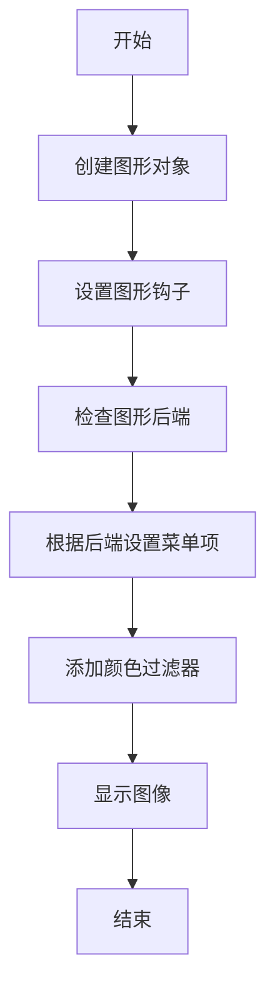
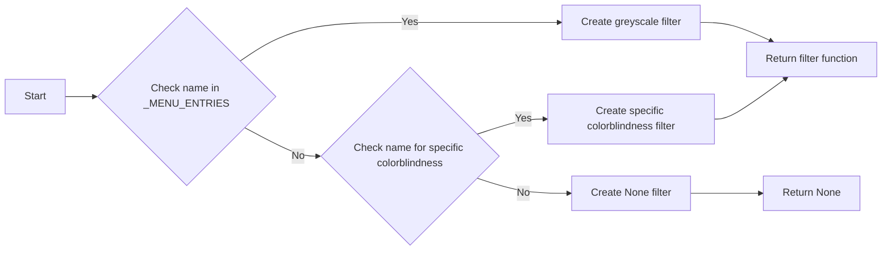
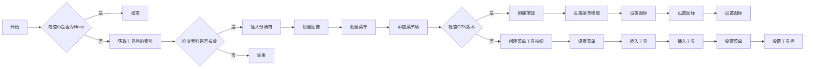
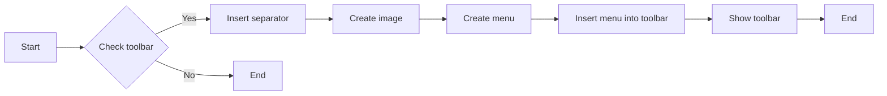
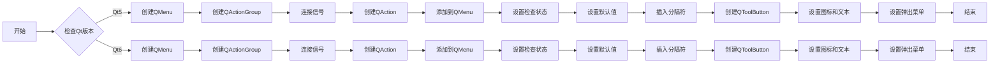
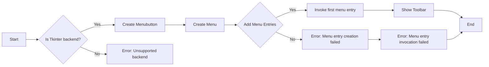
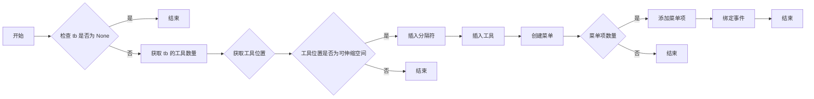

# `matplotlib\galleries\examples\user_interfaces\mplcvd.py` 详细设计文档

The mplcvd module provides a figure hook for Matplotlib to simulate color vision deficiencies (CVD) and display images with color filters.

## 整体流程



## 类结构

```
mplcvd (主模块)
├── _get_color_filter (全局函数)
│   ├── _convert_to_greyscale (内部函数)
│   └── _apply_cvd_filter (内部函数)
├── _set_menu_entry (全局函数)
├── setup (全局函数)
│   ├── _setup_gtk (内部函数)
│   ├── _setup_qt (内部函数)
│   ├── _setup_tk (内部函数)
│   └── _setup_wx (内部函数)
└── __main__ (主程序)
```

## 全局变量及字段


### `_BUTTON_NAME`
    
The name of the button used in the toolbar.

类型：`str`
    


### `_BUTTON_HELP`
    
The help text for the button used in the toolbar.

类型：`str`
    


### `_MENU_ENTRIES`
    
A dictionary containing the color filter options and their corresponding names.

类型：`dict`
    


### `colorspacious`
    
The third-party module used for color conversions.

类型：`module`
    


### `np`
    
The NumPy module used for numerical operations.

类型：`module`
    


### `Path`
    
The Path class from the pathlib module used for file system paths.

类型：`class`
    


### `plt`
    
The Matplotlib plotting module used for creating plots.

类型：`module`
    


### `cbook`
    
The Matplotlib cookbook module used for utility functions and data files.

类型：`module`
    


    

## 全局函数及方法

### _get_color_filter

该函数根据给定的颜色过滤器名称创建一个颜色过滤器函数。

#### 参数

- `name`：`str`，颜色过滤器名称，可以是以下之一：

  - `"none"`: 不应用任何过滤器。
  - `"greyscale"`: 将输入转换为灰度。
  - `"deuteranopia"`: 模拟最常见的红绿色盲。
  - `"protanopia"`: 模拟较少见的红绿色盲。
  - `"tritanopia"`: 模拟罕见的蓝黄色盲。

#### 返回值

- `callable`：一个颜色过滤器函数，形式为：

  ```python
  def filter(input: np.ndarray[M, N, D])-> np.ndarray[M, N, D]
  ```

  其中 (M, N) 是图像尺寸，D 是颜色深度（3 为 RGB，4 为 RGBA）。Alpha 通道保持不变，否则忽略。

#### 流程图



#### 带注释源码

```python
def _get_color_filter(name):
    """
    Given a color filter name, create a color filter function.
    """
    if name not in _MENU_ENTRIES:
        raise ValueError(f"Unsupported filter name: {name!r}")
    name = _MENU_ENTRIES[name]

    if name is None:
        return None

    elif name == "greyscale":
        rgb_to_jch = colorspacious.cspace_converter("sRGB1", "JCh")
        jch_to_rgb = colorspacious.cspace_converter("JCh", "sRGB1")

        def convert(im):
            greyscale_JCh = rgb_to_jch(im)
            greyscale_JCh[..., 1] = 0
            im = jch_to_rgb(greyscale_JCh)
            return im

        return convert

    else:
        cvd_space = {"name": "sRGB1+CVD", "cvd_type": name, "severity": 100}
        convert = colorspacious.cspace_converter(cvd_space, "sRGB1")

        return convert
```

### _set_menu_entry

该函数用于设置菜单条目的颜色过滤器。

#### 参数

- `tb`：`matplotlib.backends.backend_tkagg.ToolBar`，工具栏对象。
- `name`：`str`，颜色过滤器的名称。

#### 返回值

无返回值。

#### 流程图



#### 带注释源码

```python
def _set_menu_entry(tb, name):
    tb.canvas.figure.set_agg_filter(_get_color_filter(name))
    tb.canvas.draw_idle()
```

### setup(figure)

该函数用于设置matplotlib图形的钩子，以便在图形工具栏中添加颜色视觉缺陷模拟功能。

#### 参数

- `figure`：`matplotlib.figure.Figure`，matplotlib图形对象。

#### 返回值

无返回值。

#### 流程图

```mermaid
graph LR
A[setup(figure)] --> B{figure.canvas.toolbar}
B -->|None| C[结束]
B -->|存在| D{检查工具栏类型}
D -->|非matplotlib| E[抛出异常]
D -->|matplotlib| F{检查工具栏类型}
F -->|gi| G[_setup_gtk(tb)]
F -->|PyQt5/PySide2/PyQt6/PySide6| H[_setup_qt(tb)]
F -->|tkinter| I[_setup_tk(tb)]
F -->|wx| J[_setup_wx(tb)]
```

#### 带注释源码

```python
def setup(figure):
    tb = figure.canvas.toolbar
    if tb is None:
        return
    for cls in type(tb).__mro__:
        pkg = cls.__module__.split(".")[0]
        if pkg != "matplotlib":
            break
    if pkg == "gi":
        _setup_gtk(tb)
    elif pkg in ("PyQt5", "PySide2", "PyQt6", "PySide6"):
        _setup_qt(tb)
    elif pkg == "tkinter":
        _setup_tk(tb)
    elif pkg == "wx":
        _setup_wx(tb)
    else:
        raise NotImplementedError("The current backend is not supported")
```

### `_setup_gtk`

This function sets up the GTK toolbar with a color vision deficiency (CVD) simulation menu.

#### 参数

- `tb`：`Gtk.Toolbar`，The toolbar to be set up.

#### 返回值

- 无

#### 流程图



#### 带注释源码

```python
def _setup_gtk(tb):
    from gi.repository import Gio, GLib, Gtk

    for idx in range(tb.get_n_items()):
        children = tb.get_nth_item(idx).get_children()
        if children and isinstance(children[0], Gtk.Label):
            break

    toolitem = Gtk.SeparatorToolItem()
    tb.insert(toolitem, idx)

    image = Gtk.Image.new_from_gicon(
        Gio.Icon.new_for_string(
            str(Path(__file__).parent / "images/eye-symbolic.svg")),
        Gtk.IconSize.LARGE_TOOLBAR)

    # The type of menu is progressively downgraded depending on GTK version.
    if Gtk.check_version(3, 6, 0) is None:

        group = Gio.SimpleActionGroup.new()
        action = Gio.SimpleAction.new_stateful("cvdsim",
                                               GLib.VariantType("s"),
                                               GLib.Variant("s", "none"))
        group.add_action(action)

        @functools.partial(action.connect, "activate")
        def set_filter(action, parameter):
            _set_menu_entry(tb, parameter.get_string())
            action.set_state(parameter)

        menu = Gio.Menu()
        for name in _MENU_ENTRIES:
            menu.append(name, f"local.cvdsim::{name}")

        button = Gtk.MenuButton.new()
        button.remove(button.get_children()[0])
        button.add(image)
        button.insert_action_group("local", group)
        button.set_menu_model(menu)
        button.get_style_context().add_class("flat")

        item = Gtk.ToolItem()
        item.add(button)
        tb.insert(item, idx + 1)

    else:

        menu = Gtk.Menu()
        group = []
        for name in _MENU_ENTRIES:
            item = Gtk.RadioMenuItem.new_with_label(group, name)
            item.set_active(name == "None")
            item.connect(
                "activate", lambda item: _set_menu_entry(tb, item.get_label()))
            group.append(item)
            menu.append(item)
        menu.show_all()

        tbutton = Gtk.MenuToolButton.new(image, _BUTTON_NAME)
        tbutton.set_menu(menu)
        tb.insert(tbutton, idx + 1)

    tb.show_all()
```

### _setup_qt

该函数用于设置Qt工具栏中的颜色视觉缺陷模拟菜单。

#### 参数

- `tb`：`QtWidgets.QToolBar`，Qt工具栏对象。

#### 返回值

无

#### 流程图



#### 带注释源码

```python
def _setup_qt(tb):
    from matplotlib.backends.qt_compat import QtGui, QtWidgets

    menu = QtWidgets.QMenu()
    try:
        QActionGroup = QtGui.QActionGroup  # Qt6
    except AttributeError:
        QActionGroup = QtWidgets.QActionGroup  # Qt5
    group = QActionGroup(menu)
    group.triggered.connect(lambda action: _set_menu_entry(tb, action.text()))

    for name in _MENU_ENTRIES:
        action = menu.addAction(name)
        action.setCheckable(True)
        action.setActionGroup(group)
        action.setChecked(name == "None")

    actions = tb.actions()
    before = next(
        (action for action in actions
         if isinstance(tb.widgetForAction(action), QtWidgets.QLabel)), None)

    tb.insertSeparator(before)
    button = QtWidgets.QToolButton()
    # FIXME: _icon needs public API.
    button.setIcon(tb._icon(str(Path(__file__).parent / "images/eye.png")))
    button.setText(_BUTTON_NAME)
    button.setToolTip(_BUTTON_HELP)
    button.setPopupMode(QtWidgets.QToolButton.ToolButtonPopupMode.InstantPopup)
    button.setMenu(menu)
    tb.insertWidget(before, button)
```

### _setup_tk

This function sets up the Tkinter toolbar with a color vision deficiency (CVD) simulation menu button.

#### 参数

- `tb`：`tkinter.Tk`，The Tkinter toolbar to set up.

#### 返回值

- 无

#### 流程图



#### 带注释源码

```python
def _setup_tk(tb):
    import tkinter as tk

    tb._Spacer()  # FIXME: _Spacer needs public API.

    button = tk.Menubutton(master=tb, relief="raised")
    button._image_file = str(Path(__file__).parent / "images/eye.png")
    # FIXME: _set_image_for_button needs public API (perhaps like _icon).
    tb._set_image_for_button(button)
    button.pack(side=tk.LEFT)

    menu = tk.Menu(master=button, tearoff=False)
    for name in _MENU_ENTRIES:
        menu.add("radiobutton", label=name,
                 command=lambda _name=name: _set_menu_entry(tb, _name))
    menu.invoke(0)
    button.config(menu=menu)
```

### _setup_wx

该函数用于设置 wx 事件处理和菜单项，以支持颜色视觉缺陷模拟。

#### 参数

- `tb`：`matplotlib.backends.backend_wx.FigureCanvasWx`，matplotlib的画布工具栏。

#### 返回值

无返回值。

#### 流程图



#### 带注释源码

```python
def _setup_wx(tb):
    import wx

    idx = next(idx for idx in range(tb.ToolsCount)
               if tb.GetToolByPos(idx).IsStretchableSpace())
    tb.InsertSeparator(idx)
    tool = tb.InsertTool(
        idx + 1, -1, _BUTTON_NAME,
        # FIXME: _icon needs public API.
        tb._icon(str(Path(__file__).parent / "images/eye.png")),
        # FIXME: ITEM_DROPDOWN is not supported on macOS.
        kind=wx.ITEM_DROPDOWN, shortHelp=_BUTTON_HELP)

    menu = wx.Menu()
    for name in _MENU_ENTRIES:
        item = menu.AppendRadioItem(-1, name)
        menu.Bind(
            wx.EVT_MENU,
            lambda event, _name=name: _set_menu_entry(tb, _name),
            id=item.Id,
        )
    tb.SetDropdownMenu(tool.Id, menu)
```

### _get_color_filter.filter

该函数根据给定的颜色过滤器名称创建一个颜色过滤器函数。

#### 参数

- `name`：`str`，颜色过滤器名称，可以是以下之一：

  - `"none"`: 不应用任何过滤器。
  - `"greyscale"`: 将输入转换为灰度。
  - `"deuteranopia"`: 模拟最常见的红绿色盲。
  - `"protanopia"`: 模拟较少见的红绿色盲。
  - `"tritanopia"`: 模拟罕见的蓝黄色盲。

#### 返回值

- `callable`：一个颜色过滤器函数，形式为：

  ```python
  def filter(input: np.ndarray[M, N, D])-> np.ndarray[M, N, D]
  ```

  其中 (M, N) 是图像尺寸，D 是颜色深度（3 为 RGB，4 为 RGBA）。Alpha 通道保持不变，否则忽略。

#### 流程图


#### 带注释源码

```python
def _get_color_filter(name):
    """
    Given a color filter name, create a color filter function.

    Parameters
    ----------
    name : str
        The color filter name, one of the following:

        - ``"none"``: ...
        - ``"greyscale"``: Convert the input to luminosity.
        - ``"deuteranopia"``: Simulate the most common form of red-green
          colorblindness.
        - ``"protanopia"``: Simulate a rarer form of red-green colorblindness.
        - ``"tritanopia"``: Simulate the rare form of blue-yellow
          colorblindness.

        Color conversions use `colorspacious`_.

    Returns
    -------
    callable
        A color filter function that has the form:

        def filter(input: np.ndarray[M, N, D])-> np.ndarray[M, N, D]

        where (M, N) are the image dimensions, and D is the color depth (3 for
        RGB, 4 for RGBA). Alpha is passed through unchanged and otherwise
        ignored.
    """
    if name not in _MENU_ENTRIES:
        raise ValueError(f"Unsupported filter name: {name!r}")
    name = _MENU_ENTRIES[name]

    if name is None:
        return None

    elif name == "greyscale":
        rgb_to_jch = colorspacious.cspace_converter("sRGB1", "JCh")
        jch_to_rgb = colorspacious.cspace_converter("JCh", "sRGB1")

        def convert(im):
            greyscale_JCh = rgb_to_jch(im)
            greyscale_JCh[..., 1] = 0
            im = jch_to_rgb(greyscale_JCh)
            return im

    else:
        cvd_space = {"name": "sRGB1+CVD", "cvd_type": name, "severity": 100}
        convert = colorspacious.cspace_converter(cvd_space, "sRGB1")

    def filter_func(im, dpi):
        alpha = None
        if im.shape[-1] == 4:
            im, alpha = im[..., :3], im[..., 3]
        im = convert(im)
        if alpha is not None:
            im = np.dstack((im, alpha))
        return np.clip(im, 0, 1), 0, 0

    return filter_func
```

## 关键组件


### 张量索引与惰性加载

张量索引与惰性加载是代码中处理图像数据的关键组件。它允许在需要时才计算图像的特定部分，从而提高效率并减少内存使用。

### 反量化支持

反量化支持是代码中处理图像数据的关键组件。它允许将量化后的图像数据转换回原始数据，以便进行进一步处理或显示。

### 量化策略

量化策略是代码中处理图像数据的关键组件。它定义了如何将图像数据从高精度格式转换为低精度格式，以减少内存使用和加速处理速度。


## 问题及建议


### 已知问题

-   **依赖外部模块**: 代码依赖于第三方模块 `colorspacious`，这可能导致安装和配置复杂。
-   **代码风格不一致**: 代码中存在多种风格的注释和代码格式，这可能会影响代码的可读性和可维护性。
-   **硬编码路径**: 代码中硬编码了图像路径，这可能导致在不同环境中运行时出现错误。
-   **未处理的异常**: 代码中存在一些可能抛出异常的地方，但没有相应的异常处理机制。
-   **代码重复**: 代码中存在一些重复的逻辑，例如设置菜单项的逻辑在不同的后端中重复出现。

### 优化建议

-   **使用相对路径**: 将硬编码的路径替换为相对路径，以减少配置错误的可能性。
-   **异常处理**: 在可能抛出异常的地方添加异常处理机制，以增强代码的健壮性。
-   **代码重构**: 对重复的逻辑进行重构，以减少代码冗余并提高可维护性。
-   **代码风格统一**: 使用代码风格指南（如PEP 8）来统一代码风格，提高代码的可读性。
-   **模块化**: 将功能模块化，以便更容易地测试和维护。
-   **文档化**: 为代码添加详细的文档，包括函数和类的说明，以及如何使用该模块。
-   **测试**: 编写单元测试来验证代码的功能，确保代码的质量。
-   **性能优化**: 对性能敏感的部分进行性能优化，例如使用更高效的数据结构或算法。


## 其它


### 设计目标与约束

- 设计目标：
  - 提供一个可配置的图像过滤器，用于模拟色觉缺陷。
  - 支持多种色觉缺陷模式，如色盲模拟。
  - 与matplotlib集成，作为figure hook使用。
- 约束：
  - 依赖于第三方库`colorspacious`进行颜色转换。
  - 需要与matplotlib的figure hook机制兼容。

### 错误处理与异常设计

- 错误处理：
  - 当传入不支持的过滤器名称时，抛出`ValueError`。
  - 当matplotlib的后端不支持时，抛出`NotImplementedError`。
- 异常设计：
  - 使用try-except块捕获可能发生的异常，并给出相应的错误信息。

### 数据流与状态机

- 数据流：
  - 用户通过设置matplotlib的rcParams来启用该hook。
  - 用户选择不同的色觉缺陷模式。
  - 根据选择的模式，应用相应的颜色过滤器。
- 状态机：
  - 无状态机，因为该模块主要处理图像过滤，不涉及复杂的状态转换。

### 外部依赖与接口契约

- 外部依赖：
  - `matplotlib`：用于集成figure hook。
  - `colorspacious`：用于颜色转换。
- 接口契约：
  - `setup(figure)`：设置figure hook。
  - `_get_color_filter(name)`：获取颜色过滤器函数。
  - `_set_menu_entry(tb, name)`：设置菜单项。
  - `_setup_*`：根据不同的matplotlib后端设置相应的工具栏按钮和菜单。


    