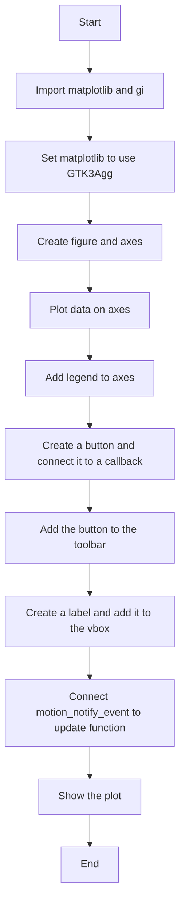
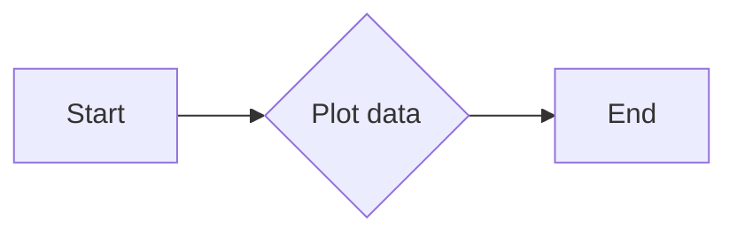
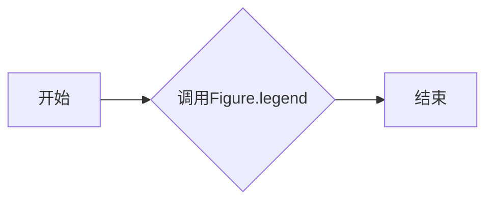
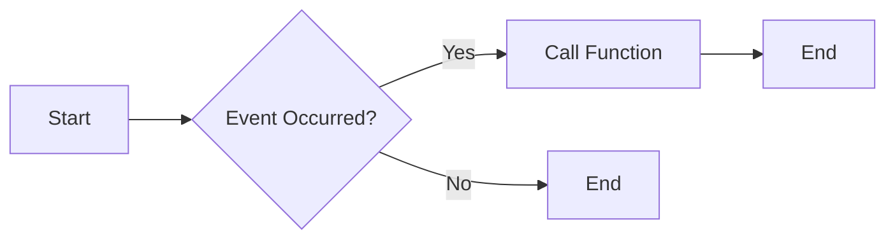
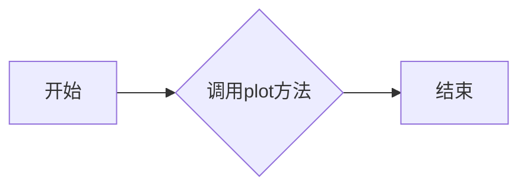
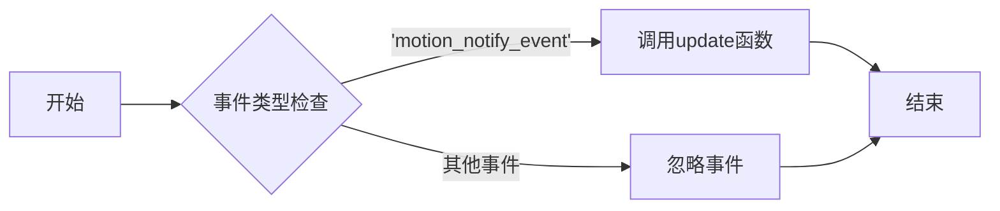
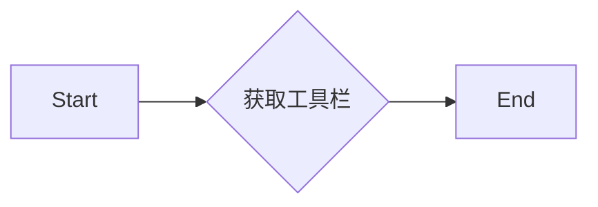
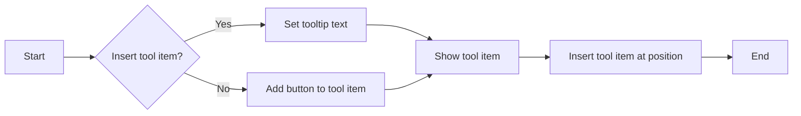
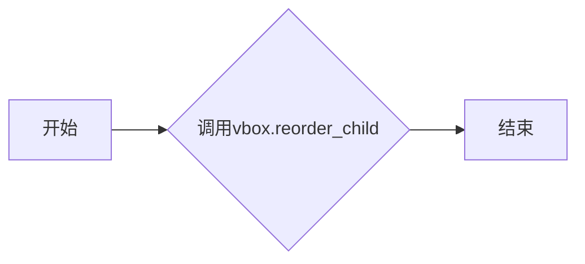

# `matplotlib\galleries\examples\user_interfaces\pylab_with_gtk3_sgskip.py` 详细设计文档

This code integrates matplotlib's pyplot with GTK3 to create interactive plots with a custom GUI using GTK3 widgets.

## 整体流程



## 类结构

```
matplotlib.pyplot (module)
├── fig (Figure object)
│   ├── ax (Axes object)
│   ├── canvas (FigureCanvasGTK3Agg object)
│   ├── manager (FigureManagerGTK3 object)
│   ├── toolbar (NavigationToolbar2GTK3 object)
│   └── vbox (Gtk.VBox object)
└── gi (module)
```

## 全局变量及字段


### `fig`
    
The main figure object that contains all the plot elements.

类型：`matplotlib.figure.Figure`
    


### `ax`
    
The axes object that contains the plot elements.

类型：`matplotlib.axes._subplots.AxesSubplot`
    


### `manager`
    
The manager object that manages the figure window.

类型：`matplotlib.backends.backend_gtk3agg.FigureManagerGTK3`
    


### `toolbar`
    
The toolbar object that provides navigation controls for the figure.

类型：`matplotlib.backends.backend_gtk3agg.NavigationToolbar2GTK3`
    


### `vbox`
    
The vertical box container that holds the toolbar and other widgets.

类型：`Gtk.VBox`
    


### `button`
    
The button widget that is added to the toolbar.

类型：`Gtk.Button`
    


### `toolitem`
    
The tool item widget that holds the button in the toolbar.

类型：`Gtk.ToolItem`
    


### `label`
    
The label widget that displays information about the mouse position on the axes.

类型：`Gtk.Label`
    


### `Figure.fig`
    
The main figure object that contains all the plot elements.

类型：`matplotlib.figure.Figure`
    


### `Figure.ax`
    
The axes object that contains the plot elements.

类型：`matplotlib.axes._subplots.AxesSubplot`
    


### `Figure.canvas`
    
The canvas object that draws the figure.

类型：`matplotlib.backends.backend_gtk3agg.FigureCanvasGTK3Agg`
    


### `Figure.manager`
    
The manager object that manages the figure window.

类型：`matplotlib.backends.backend_gtk3agg.FigureManagerGTK3`
    


### `Figure.toolbar`
    
The toolbar object that provides navigation controls for the figure.

类型：`matplotlib.backends.backend_gtk3agg.NavigationToolbar2GTK3`
    


### `Figure.vbox`
    
The vertical box container that holds the toolbar and other widgets.

类型：`Gtk.VBox`
    


### `Axes.ax`
    
The axes object that contains the plot elements.

类型：`matplotlib.axes._subplots.AxesSubplot`
    


### `FigureCanvasGTK3Agg.canvas`
    
The canvas object that draws the figure.

类型：`matplotlib.backends.backend_gtk3agg.FigureCanvasGTK3Agg`
    


### `FigureManagerGTK3.manager`
    
The manager object that manages the figure window.

类型：`matplotlib.backends.backend_gtk3agg.FigureManagerGTK3`
    


### `NavigationToolbar2GTK3.toolbar`
    
The toolbar object that provides navigation controls for the figure.

类型：`matplotlib.backends.backend_gtk3agg.NavigationToolbar2GTK3`
    


### `Gtk.VBox.vbox`
    
The vertical box container that holds the toolbar and other widgets.

类型：`Gtk.VBox`
    
    

## 全局函数及方法


### update(event)

更新标签的文本，显示鼠标在轴上的位置。

参数：

- `event`：`matplotlib.events.Event`，包含鼠标移动事件的详细信息。

返回值：无

#### 流程图

```mermaid
graph LR
A[开始] --> B{事件类型}
B -- motion_notify_event --> C[检查xdata和ydata]
C -->|xdata is None| D[设置标签文本为"Drag mouse over axes for position"]
C -->|xdata is not None| E[设置标签文本为"x,y=({xdata}, {ydata})"]
E --> F[结束]
```

#### 带注释源码

```python
def update(event):
    # 检查事件是否为鼠标移动事件
    if event.xdata is None:
        # 如果xdata为None，则鼠标不在轴上，设置标签文本为提示信息
        label.set_markup('Drag mouse over axes for position')
    else:
        # 如果xdata不为None，则鼠标在轴上，设置标签文本为鼠标位置
        label.set_markup(
            f'<span color="#ef0000">x,y=({event.xdata}, {event.ydata})</span>')
``` 


### Figure.plot

`Figure.plot` is a method used to plot data on a matplotlib figure. It is used to create line plots with specified markers and line styles.

参数：

- `x`：`list`，代表x轴的数据点。
- `y`：`list`，代表y轴的数据点。
- `label`：`str`，为该线添加一个标签，用于图例。

返回值：`None`，该方法不返回任何值。

#### 流程图



#### 带注释源码

```python
ax.plot([1, 2, 3], 'ro-', label='easy as 1 2 3')
ax.plot([1, 4, 9], 'gs--', label='easy as 1 2 3 squared')
```

在这段代码中，`ax.plot` 方法被调用来绘制两条线。第一条线使用红色圆圈标记和实线，第二条线使用绿色方块标记和虚线。同时，每条线都有一个标签，用于图例中显示。


### Figure.legend

`Figure.legend` 是一个matplotlib.pyplot模块中的方法，用于在图表中添加图例。

参数：

- `loc`：`int`，指定图例的位置，默认为'best'，即自动选择最佳位置。
- `ncol`：`int`，指定图例的列数，默认为1。
- `frameon`：`bool`，指定是否显示图例的边框，默认为True。
- `fancybox`：`bool`，指定是否显示图例的边框为方框，默认为False。
- `shadow`：`bool`，指定是否显示图例的阴影，默认为False。
- `title`：`str`，指定图例的标题，默认为None。

返回值：`Legend` 对象，表示图例。

#### 流程图



#### 带注释源码

```
ax.legend(loc='best', ncol=1, frameon=True, fancybox=False, shadow=False, title=None)
```


### Figure.canvas.mpl_connect

连接一个事件处理函数到matplotlib图形的特定事件。

描述：

该函数用于将一个事件处理函数连接到matplotlib图形的特定事件。当事件发生时，指定的函数将被调用。

参数：

- `event`: `str`，指定要连接的事件类型，例如'motion_notify_event'。
- `func`: `callable`，当事件发生时将被调用的函数。

返回值：`None`，该函数不返回任何值。

#### 流程图



#### 带注释源码

```python
fig.canvas.mpl_connect('motion_notify_event', update)
```

在这段代码中，`update` 函数被连接到 `fig.canvas` 的 `'motion_notify_event'` 事件。这意味着每当鼠标在图形上移动时，`update` 函数都会被调用。


### `Axes.plot`

`Axes.plot` 方法用于在matplotlib的Axes对象上绘制图形。

参数：

- `x`：`array_like`，x轴的数据点。
- `y`：`array_like`，y轴的数据点。
- `fmt`：`str`，用于指定图形的样式，例如 'ro-' 表示红色圆圈和实线。
- `label`：`str`，图形的标签，用于图例。

返回值：`Line2D`，绘制的线对象。

#### 流程图



#### 带注释源码

```python
ax.plot([1, 2, 3], 'ro-', label='easy as 1 2 3')
```

在这个例子中，`ax` 是一个Axes对象，`plot` 方法被调用以绘制一个红色的圆圈和实线，数据点为 `[1, 2, 3]`，样式为 `'ro-'`，标签为 `'easy as 1 2 3'`。


### `ax.legend()`

`ax.legend()` 是一个用于在matplotlib图形中添加图例的方法。

参数：

- 无

返回值：`None`，该方法不返回值，它直接在图形上添加图例。

#### 流程图

```mermaid
graph LR
A[开始] --> B{调用 ax.legend()}
B --> C[结束]
```

#### 带注释源码

```python
ax.legend()
# ax.legend() 调用此方法，将自动在图形上添加图例。
```


### FigureCanvasGTK3Agg.mpl_connect

连接matplotlib的FigureCanvasGTK3Agg类的一个事件处理函数。

参数：

- `event`: `matplotlib.cursors.Event`，事件对象，包含鼠标移动事件的相关信息。

返回值：无

#### 流程图



#### 带注释源码

```python
fig.canvas.mpl_connect('motion_notify_event', update)
```

在这段代码中，`mpl_connect` 方法用于将 `update` 函数连接到 `FigureCanvasGTK3Agg` 类的 `motion_notify_event` 事件。当鼠标在图上移动时，会触发这个事件，并调用 `update` 函数来更新标签的文本，显示鼠标的当前位置。


### FigureManagerGTK3.toolbar

该函数用于获取matplotlib图形的GTK3工具栏对象。

参数：

- 无

返回值：`Gtk.Toolbar`，返回matplotlib图形的GTK3工具栏对象。

#### 流程图



#### 带注释源码

```python
# 获取matplotlib图形的GTK3工具栏对象
toolbar = manager.toolbar
```


### FigureManagerGTK3.update

This method updates the label on the GUI to reflect the current mouse position over the axes when the user drags the mouse.

参数：

- `event`：`matplotlib.events.Event`，This parameter represents the event object that contains information about the mouse movement.

返回值：`None`，This method does not return any value.

#### 流程图

```mermaid
graph LR
A[Start] --> B{Event received}
B -->|xdata is None| C[Set label to "Drag mouse over axes for position"]
B -->|xdata is not None| D[Set label to "x,y=({xdata}, {ydata})"]
D --> E[End]
```

#### 带注释源码

```python
def update(event):
    if event.xdata is None:
        label.set_markup('Drag mouse over axes for position')
    else:
        label.set_markup(
            f'<span color="#ef0000">x,y=({event.xdata}, {event.ydata})</span>')
```


### NavigationToolbar2GTK3.insert

This method inserts a tool item into the toolbar of a matplotlib figure managed by a GTK3 canvas manager.

参数：

- `toolitem`：`Gtk.ToolItem`，The tool item to be inserted into the toolbar.
- `pos`：`int`，The position at which to insert the tool item. The position is zero-based and counts from the left.

返回值：`None`，This method does not return a value.

#### 流程图



#### 带注释源码

```python
toolitem = Gtk.ToolItem()
toolitem.show()
toolitem.set_tooltip_text('Click me for fun and profit')
toolitem.add(button)

pos = 8  # where to insert this in the toolbar
toolbar.insert(toolitem, pos)
```


### `vbox.pack_start`

`vbox.pack_start` 是一个方法，用于将一个 widget 添加到垂直盒（VBox）中。

参数：

- `widget`：`Gtk.Widget`，要添加到 vbox 中的 widget。
- `expand`：`bool`，指示 widget 是否应该扩展以填充可用空间。
- `fill`：`bool`，指示 widget 是否应该填充其空间。
- `padding`：`int`，widget 与 vbox 边缘之间的空间。

返回值：`None`，没有返回值。

#### 流程图

```mermaid
graph LR
A[开始] --> B{vbox.pack_start()}
B --> C[结束]
```

#### 带注释源码

```python
vbox.pack_start(label, False, False, 0)
```

在这段代码中，`vbox.pack_start(label, False, False, 0)` 将 `label` widget 添加到 `vbox` 中，`False` 表示 `label` 不会扩展以填充可用空间，`False` 表示 `label` 不会填充其空间，`0` 表示 widget 与 vbox 边缘之间的空间为 0。


### `vbox.reorder_child`

`vbox.reorder_child` 方法用于重新排列 `vbox`（垂直盒布局）中的子元素。

参数：

- `child`：`Gtk.Widget`，需要重新排列的子元素。
- `position`：`int`，新的子元素位置。

返回值：`None`，没有返回值。

#### 流程图



#### 带注释源码

```python
# 在代码中找到以下行
vbox.reorder_child(toolbar, -1)
# 这行代码将toolbar重新排列到vbox的最后一个位置。
```


## 关键组件


### 张量索引与惰性加载

张量索引与惰性加载是处理大型数据集时提高性能的关键技术，它允许在需要时才计算数据，从而减少内存消耗和提高处理速度。

### 反量化支持

反量化支持是优化计算过程的一种技术，它通过将量化后的数据转换回原始精度，以便进行更精确的计算。

### 量化策略

量化策略是优化模型大小和加速推理过程的一种方法，它通过减少模型中使用的数值精度来减少模型大小和计算需求。


## 问题及建议


### 已知问题

-   {问题1}：代码中使用了`matplotlib.use('GTK3Agg')`来指定使用GTK3作为matplotlib的图形后端，这可能会限制代码在其他图形后端上的兼容性。
-   {问题2}：代码中直接修改了matplotlib的内部状态，如`manager.toolbar`和`manager.vbox`，这可能会违反matplotlib的设计原则，导致不可预测的行为。
-   {问题3}：代码中添加了一个按钮到工具栏，但没有提供任何关于按钮功能的详细说明，这可能会让用户感到困惑。

### 优化建议

-   {建议1}：考虑使用matplotlib的内置功能来添加自定义控件，而不是直接修改内部状态，以提高代码的稳定性和可维护性。
-   {建议2}：为添加的按钮提供清晰的文档说明，包括按钮的功能和预期行为，以增强用户体验。
-   {建议3}：考虑使用事件处理机制来更新标签内容，而不是在`update`函数中直接修改标签的属性，这样可以更好地分离逻辑和界面。
-   {建议4}：代码中没有错误处理机制，建议添加异常处理来捕获和处理可能发生的错误，例如在连接事件处理函数时。
-   {建议5}：代码中没有使用日志记录，建议添加日志记录来帮助调试和监控程序的行为。


## 其它


### 设计目标与约束

- 设计目标：实现一个使用GTK3作为图形用户界面的matplotlib绘图工具，允许用户通过GUI进行交互。
- 约束条件：必须使用matplotlib和GTK3库，且代码应在Python环境中运行。

### 错误处理与异常设计

- 错误处理：在代码中应包含异常处理机制，以捕获和处理可能出现的错误，如GTK3库加载失败、绘图操作错误等。
- 异常设计：定义清晰的异常类型和错误消息，以便于调试和用户理解。

### 数据流与状态机

- 数据流：数据流从matplotlib的绘图操作开始，通过GTK3的GUI组件进行展示和交互。
- 状态机：状态机描述了程序在不同事件（如鼠标移动、按钮点击）下的状态转换。

### 外部依赖与接口契约

- 外部依赖：代码依赖于matplotlib和GTK3库，这些库需要正确安装和配置。
- 接口契约：定义matplotlib和GTK3库的接口规范，确保代码与这些库的交互正确无误。

### 安全性与隐私

- 安全性：确保代码不会暴露敏感信息，如用户数据或系统配置。
- 隐私：遵守隐私保护法规，不收集或传输用户隐私数据。

### 性能与可扩展性

- 性能：优化代码执行效率，确保绘图和交互操作流畅。
- 可扩展性：设计模块化代码，便于未来扩展新功能或集成新库。

### 用户文档与帮助

- 用户文档：提供详细的用户手册，指导用户如何使用该工具。
- 帮助系统：集成在线帮助或离线帮助文档，方便用户查询。

### 测试与质量保证

- 测试：编写单元测试和集成测试，确保代码质量和功能正确性。
- 质量保证：持续集成和代码审查，确保代码质量和开发效率。

### 维护与更新策略

- 维护：定期更新代码，修复已知问题和添加新功能。
- 更新策略：遵循软件开发生命周期，确保代码的可持续性和稳定性。


    