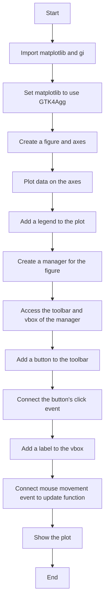
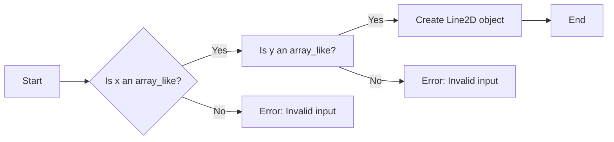
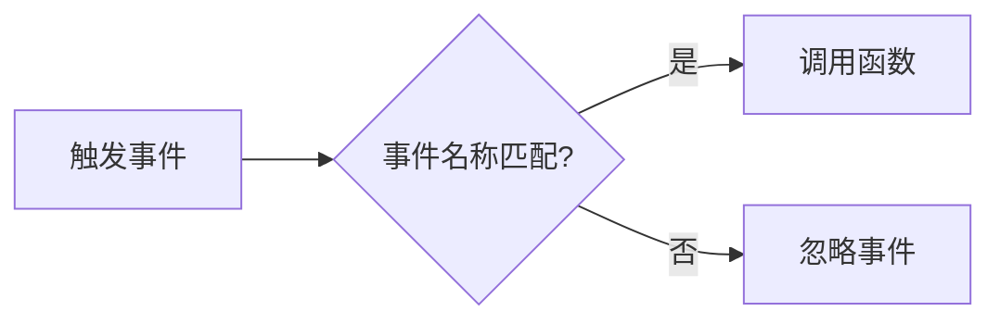
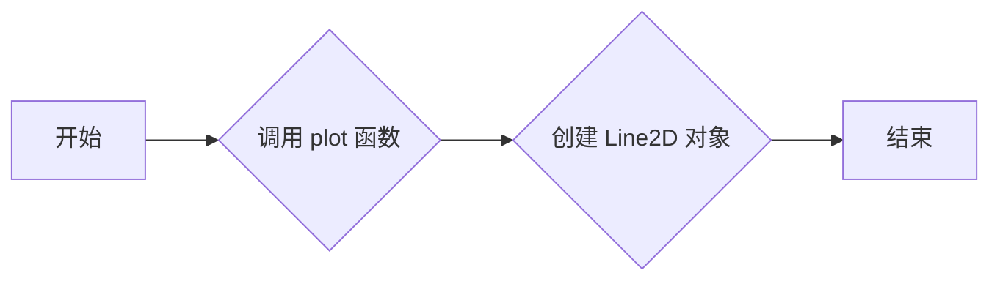
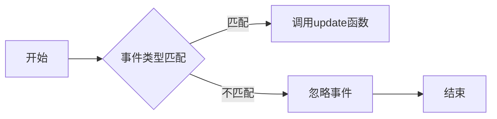
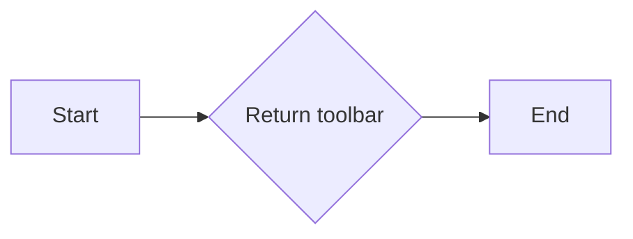
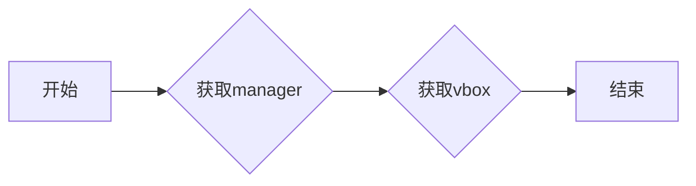
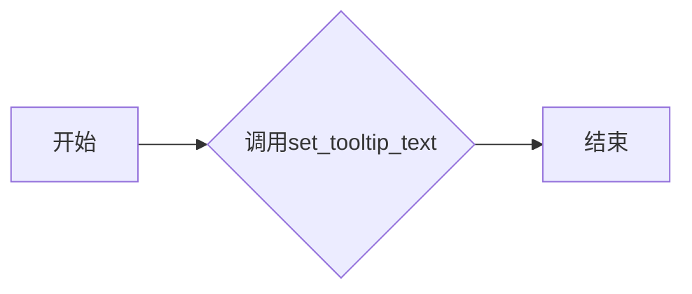
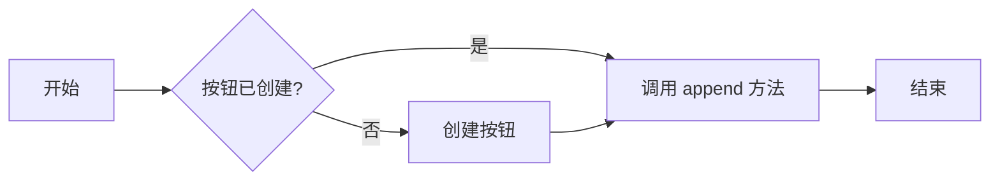

# `matplotlib\galleries\examples\user_interfaces\pylab_with_gtk4_sgskip.py` 详细设计文档

This code integrates matplotlib's pyplot with GTK4 to create interactive plots with a GUI, allowing users to interact with the plot through buttons and mouse movements.

## 整体流程



## 类结构

```
matplotlib.pyplot (matplotlib module)
├── fig (Figure object)
│   ├── ax (Axes object)
│   ├── canvas (FigureCanvasGTK4Agg object)
│   └── manager (FigureManagerGTK4 object)
└── button (Gtk.Button object)
    └── label (Gtk.Label object)
```

## 全局变量及字段


### `fig`
    
The main figure object that contains all the plot elements.

类型：`matplotlib.figure.Figure`
    


### `ax`
    
The axes object that contains the plot elements.

类型：`matplotlib.axes._subplots.AxesSubplot`
    


### `manager`
    
The manager object that manages the figure window.

类型：`matplotlib.backends.backend_gtk4agg.FigureManagerGTK4`
    


### `toolbar`
    
The toolbar widget that contains the plot controls.

类型：`matplotlib.backends.backend_gtk4agg.ToolBarGTK4`
    


### `vbox`
    
The vertical box widget that contains the figure canvas and other widgets.

类型：`Gtk.Box`
    


### `button`
    
The button widget that is added to the toolbar.

类型：`Gtk.Button`
    


### `label`
    
The label widget that is added to the vbox.

类型：`Gtk.Label`
    


### `Figure.fig`
    
The main figure object that contains all the plot elements.

类型：`matplotlib.figure.Figure`
    


### `Figure.ax`
    
The axes object that contains the plot elements.

类型：`matplotlib.axes._subplots.AxesSubplot`
    


### `Figure.canvas`
    
The canvas widget that displays the figure.

类型：`matplotlib.backends.backend_gtk4agg.FigureCanvasGTK4Agg`
    


### `Figure.manager`
    
The manager object that manages the figure window.

类型：`matplotlib.backends.backend_gtk4agg.FigureManagerGTK4`
    


### `Axes.ax`
    
The axes object that contains the plot elements.

类型：`matplotlib.axes._subplots.AxesSubplot`
    


### `FigureCanvasGTK4Agg.canvas`
    
The canvas widget that displays the figure.

类型：`matplotlib.backends.backend_gtk4agg.FigureCanvasGTK4Agg`
    


### `FigureManagerGTK4.manager`
    
The manager object that manages the figure window.

类型：`matplotlib.backends.backend_gtk4agg.FigureManagerGTK4`
    


### `Gtk.Button.button`
    
The button widget that is added to the toolbar.

类型：`Gtk.Button`
    


### `Gtk.Label.label`
    
The label widget that is added to the vbox.

类型：`Gtk.Label`
    
    

## 全局函数及方法


### update(event)

更新标签的文本，以显示鼠标在轴上的位置。

参数：

- `event`：`matplotlib.events.Event`，包含鼠标移动事件的详细信息。

返回值：无

#### 流程图

```mermaid
graph LR
A[开始] --> B{事件类型}
B -- motion_notify_event --> C[检查xdata和ydata]
C -->|xdata is None| D[设置标签文本为"Drag mouse over axes for position"]
C -->|xdata is not None| E[设置标签文本为"x,y=({xdata}, {ydata})"]
E --> F[结束]
```

#### 带注释源码

```python
def update(event):
    # 检查事件是否为鼠标移动事件
    if event.xdata is None:
        # 如果xdata为None，则鼠标不在轴上，设置标签文本为提示信息
        label.set_markup('Drag mouse over axes for position')
    else:
        # 如果xdata不为None，则鼠标在轴上，设置标签文本为鼠标位置
        label.set_markup(
            f'<span color="#ef0000">x,y=({event.xdata}, {event.ydata})</span>')
``` 


### Figure.plot

This function is not explicitly defined in the provided code snippet, but it seems to be a reference to the `plot` method used within the `AxesSubplot` class from the `matplotlib.pyplot` module. The `plot` method is used to create line plots in a figure.

参数：

- `x`：`array_like`，x轴数据点
- `y`：`array_like`，y轴数据点
- `fmt`：`str`，用于指定线型、标记和颜色，默认为'ro-'

返回值：`Line2D`，表示绘制的线对象

#### 流程图



#### 带注释源码

```python
import matplotlib.pyplot as plt

# 创建一个子图
fig, ax = plt.subplots()

# 使用plot方法绘制线图
ax.plot([1, 2, 3], 'ro-', label='easy as 1 2 3')
ax.plot([1, 4, 9], 'gs--', label='easy as 1 2 3 squared')

# 显示图例
ax.legend()
```


### matplotlib.pyplot.subplots

This function creates a new figure and a set of subplots (axes) in a single call.

参数：

- `figsize`：`tuple`，指定图形的大小（宽度和高度）
- `dpi`：`int`，指定图形的分辨率（每英寸点数）
- `ncols`：`int`，指定子图的数量（列数）
- `nrows`：`int`，指定子图的数量（行数）
- `sharex`：`bool`，指定是否共享x轴
- `sharey`：`bool`，指定是否共享y轴
- `gridspec_kw`：`dict`，用于指定GridSpec的参数
- `constrained_layout`：`bool`，指定是否启用约束布局

返回值：`Figure`，表示图形对象；`AxesSubplot`，表示子图对象

#### 流程图


#### 带注释源码

```python
import matplotlib.pyplot as plt

# 创建一个图形和子图
fig, ax = plt.subplots()
```


### matplotlib.pyplot.show

This function displays the figure on the screen.

参数：

- `fig`：`Figure`，表示图形对象

返回值：无

#### 流程图


#### 带注释源码

```python
import matplotlib.pyplot as plt

# 显示图形
plt.show()
```


### gi.require_version

This function sets the required version of a GObject introspection module.

参数：

- `version`：`str`，指定模块的版本

返回值：无

#### 流程图


#### 带注释源码

```python
import gi

# 设置GTK模块的版本
gi.require_version('Gtk', '4.0')
```


### Gtk.Button

This class represents a button widget in GTK.

参数：

- `label`：`str`，按钮的标签文本

返回值：`Gtk.Button`，表示按钮对象

#### 流程图


#### 带注释源码

```python
import gi
from gi.repository import Gtk

# 创建一个按钮
button = Gtk.Button(label='Click me')
```


### lambda

This is an anonymous function defined using the `lambda` keyword.

参数：

- `event`：`event`，事件对象

返回值：无

#### 流程图


#### 带注释源码

```python
button.connect('clicked', lambda event: print('hi mom'))
```


### Gtk.Label

This class represents a label widget in GTK.

参数：

- `markup`：`str`，标签的文本，支持Markdown格式

返回值：`Gtk.Label`，表示标签对象

#### 流程图


#### 带注释源码

```python
import gi
from gi.repository import Gtk

# 创建一个标签
label = Gtk.Label()
label.set_markup('Drag mouse over axes for position')
```


### fig.canvas.mpl_connect

This function connects a callback function to an event in the canvas.

参数：

- `event_name`：`str`，事件名称
- `callback`：`callable`，回调函数

返回值：无

#### 流程图


#### 带注释源码

```python
def update(event):
    if event.xdata is None:
        label.set_markup('Drag mouse over axes for position')
    else:
        label.set_markup(
            f'<span color="#ef0000">x,y=({event.xdata}, {event.ydata})</span>')

fig.canvas.mpl_connect('motion_notify_event', update)
```


### matplotlib.pyplot.use

This function sets the backend to use for the matplotlib library.

参数：

- `backend`：`str`，指定要使用的后端

返回值：无

#### 流程图


#### 带注释源码

```python
import matplotlib

# 设置matplotlib使用GTK4Agg后端
matplotlib.use('GTK4Agg')  # or 'GTK4Cairo'
```


### Figure.legend

The `legend` method is used to display a legend for the plot created with `matplotlib.pyplot`.

参数：

- `loc`：`int`，The location of the legend relative to the plot. It can be an integer or a string. Integer values are interpreted as the number of axes away from the axes object. String values are interpreted as the location of the legend relative to the axes object.
- `bbox_to_anchor`：`tuple`，The bounding box to which the legend is anchored. It is a tuple of four floats (x0, y0, x1, y1) that define the bounding box in axes coordinates.
- `bbox_transform`：`str`，The transform to use for the bounding box. It can be 'data' or 'axes'.
- `ncol`：`int`，The number of columns for the legend box.
- `mode`：`str`，The mode of the legend box. It can be 'expand' or 'fixed'.
- `frameon`：`bool`，Whether to draw the legend's frame.
- `fancybox`：`bool`，Whether to draw a box around the legend.
- `shadowbox`：`bool`，Whether to draw a shadow behind the legend.
- `title`：`str`，The title of the legend.
- `title_fontsize`：`str`，The font size of the legend title.
- `labelspacing`：`float`，The spacing between the legend labels.
- `handlelength`：`float`，The length of the legend handles.
- `handletextpad`：`float`，The padding between the legend handles and the text.
- `borderpad`：`float`，The padding around the legend.
- `columnspacing`：`float`，The spacing between columns in the legend box.
- `labelspacing`：`float`，The spacing between the legend labels.
- `handlelength`：`float`，The length of the legend handles.
- `handleheight`：`float`，The height of the legend handles.
- `borderaxespad`：`float`，The padding between the axes and the legend border.
- `loc`：`int`，The location of the legend relative to the plot.
- `bbox_to_anchor`：`tuple`，The bounding box to which the legend is anchored.
- `bbox_transform`：`str`，The transform to use for the bounding box.
- `ncol`：`int`，The number of columns for the legend box.
- `mode`：`str`，The mode of the legend box.
- `frameon`：`bool`，Whether to draw the legend's frame.
- `fancybox`：`bool`，Whether to draw a box around the legend.
- `shadowbox`：`bool`，Whether to draw a shadow behind the legend.
- `title`：`str`，The title of the legend.
- `title_fontsize`：`str`，The font size of the legend title.
- `labelspacing`：`float`，The spacing between the legend labels.
- `handlelength`：`float`，The length of the legend handles.
- `handletextpad`：`float`，The padding between the legend handles and the text.
- `borderpad`：`float`，The padding around the legend.
- `columnspacing`：`float`，The spacing between columns in the legend box.
- `labelspacing`：`float`，The spacing between the legend labels.
- `handlelength`：`float`，The length of the legend handles.
- `handleheight`：`float`，The height of the legend handles.
- `borderaxespad`：`float`，The padding between the axes and the legend border.
- `loc`：`int`，The location of the legend relative to the plot.
- `bbox_to_anchor`：`tuple`，The bounding box to which the legend is anchored.
- `bbox_transform`：`str`，The transform to use for the bounding box.
- `ncol`：`int`，The number of columns for the legend box.
- `mode`：`str`，The mode of the legend box.
- `frameon`：`bool`，Whether to draw the legend's frame.
- `fancybox`：`bool`，Whether to draw a box around the legend.
- `shadowbox`：`bool`，Whether to draw a shadow behind the legend.
- `title`：`str`，The title of the legend.
- `title_fontsize`：`str`，The font size of the legend title.
- `labelspacing`：`float`，The spacing between the legend labels.
- `handlelength`：`float`，The length of the legend handles.
- `handletextpad`：`float`，The padding between the legend handles and the text.
- `borderpad`：`float`，The padding around the legend.
- `columnspacing`：`float`，The spacing between columns in the legend box.
- `labelspacing`：`float`，The spacing between the legend labels.
- `handlelength`：`float`，The length of the legend handles.
- `handleheight`：`float`，The height of the legend handles.
- `borderaxespad`：`float`，The padding between the axes and the legend border.
- `loc`：`int`，The location of the legend relative to the plot.
- `bbox_to_anchor`：`tuple`，The bounding box to which the legend is anchored.
- `bbox_transform`：`str`，The transform to use for the bounding box.
- `ncol`：`int`，The number of columns for the legend box.
- `mode`：`str`，The mode of the legend box.
- `frameon`：`bool`，Whether to draw the legend's frame.
- `fancybox`：`bool`，Whether to draw a box around the legend.
- `shadowbox`：`bool`，Whether to draw a shadow behind the legend.
- `title`：`str`，The title of the legend.
- `title_fontsize`：`str`，The font size of the legend title.
- `labelspacing`：`float`，The spacing between the legend labels.
- `handlelength`：`float`，The length of the legend handles.
- `handletextpad`：`float`，The padding between the legend handles and the text.
- `borderpad`：`float`，The padding around the legend.
- `columnspacing`：`float`，The spacing between columns in the legend box.
- `labelspacing`：`float`，The spacing between the legend labels.
- `handlelength`：`float`，The length of the legend handles.
- `handleheight`：`float`，The height of the legend handles.
- `borderaxespad`：`float`，The padding between the axes and the legend border.
- `loc`：`int`，The location of the legend relative to the plot.
- `bbox_to_anchor`：`tuple`，The bounding box to which the legend is anchored.
- `bbox_transform`：`str`，The transform to use for the bounding box.
- `ncol`：`int`，The number of columns for the legend box.
- `mode`：`str`，The mode of the legend box.
- `frameon`：`bool`，Whether to draw the legend's frame.
- `fancybox`：`bool`，Whether to draw a box around the legend.
- `shadowbox`：`bool`，Whether to draw a shadow behind the legend.
- `title`：`str`，The title of the legend.
- `title_fontsize`：`str`，The font size of the legend title.
- `labelspacing`：`float`，The spacing between the legend labels.
- `handlelength`：`float`，The length of the legend handles.
- `handletextpad`：`float`，The padding between the legend handles and the text.
- `borderpad`：`float`，The padding around the legend.
- `columnspacing`：`float`，The spacing between columns in the legend box.
- `labelspacing`：`float`，The spacing between the legend labels.
- `handlelength`：`float`，The length of the legend handles.
- `handleheight`：`float`，The height of the legend handles.
- `borderaxespad`：`float`，The padding between the axes and the legend border.
- `loc`：`int`，The location of the legend relative to the plot.
- `bbox_to_anchor`：`tuple`，The bounding box to which the legend is anchored.
- `bbox_transform`：`str`，The transform to use for the bounding box.
- `ncol`：`int`，The number of columns for the legend box.
- `mode`：`str`，The mode of the legend box.
- `frameon`：`bool`，Whether to draw the legend's frame.
- `fancybox`：`bool`，Whether to draw a box around the legend.
- `shadowbox`：`bool`，Whether to draw a shadow behind the legend.
- `title`：`str`，The title of the legend.
- `title_fontsize`：`str`，The font size of the legend title.
- `labelspacing`：`float`，The spacing between the legend labels.
- `handlelength`：`float`，The length of the legend handles.
- `handletextpad`：`float`，The padding between the legend handles and the text.
- `borderpad`：`float`，The padding around the legend.
- `columnspacing`：`float`，The spacing between columns in the legend box.
- `labelspacing`：`float`，The spacing between the legend labels.
- `handlelength`：`float`，The length of the legend handles.
- `handleheight`：`float`，The height of the legend handles.
- `borderaxespad`：`float`，The padding between the axes and the legend border.
- `loc`：`int`，The location of the legend relative to the plot.
- `bbox_to_anchor`：`tuple`，The bounding box to which the legend is anchored.
- `bbox_transform`：`str`，The transform to use for the bounding box.
- `ncol`：`int`，The number of columns for the legend box.
- `mode`：`str`，The mode of the legend box.
- `frameon`：`bool`，Whether to draw the legend's frame.
- `fancybox`：`bool`，Whether to draw a box around the legend.
- `shadowbox`：`bool`，Whether to draw a shadow behind the legend.
- `title`：`str`，The title of the legend.
- `title_fontsize`：`str`，The font size of the legend title.
- `labelspacing`：`float`，The spacing between the legend labels.
- `handlelength`：`float`，The length of the legend handles.
- `handletextpad`：`float`，The padding between the legend handles and the text.
- `borderpad`：`float`，The padding around the legend.
- `columnspacing`：`float`，The spacing between columns in the legend box.
- `labelspacing`：`float`，The spacing between the legend labels.
- `handlelength`：`float`，The length of the legend handles.
- `handleheight`：`float`，The height of the legend handles.
- `borderaxespad`：`float`，The padding between the axes and the legend border.
- `loc`：`int`，The location of the legend relative to the plot.
- `bbox_to_anchor`：`tuple`，The bounding box to which the legend is anchored.
- `bbox_transform`：`str`，The transform to use for the bounding box.
- `ncol`：`int`，The number of columns for the legend box.
- `mode`：`str`，The mode of the legend box.
- `frameon`：`bool`，Whether to draw the legend's frame.
- `fancybox`：`bool`，Whether to draw a box around the legend.
- `shadowbox`：`bool`，Whether to draw a shadow behind the legend.
- `title`：`str`，The title of the legend.
- `title_fontsize`：`str`，The font size of the legend title.
- `labelspacing`：`float`，The spacing between the legend labels.
- `handlelength`：`float`，The length of the legend handles.
- `handletextpad`：`float`，The padding between the legend handles and the text.
- `borderpad`：`float`，The padding around the legend.
- `columnspacing`：`float`，The spacing between columns in the legend box.
- `labelspacing`：`float`，The spacing between the legend labels.
- `handlelength`：`float`，The length of the legend handles.
- `handleheight`：`float`，The height of the legend handles.
- `borderaxespad`：`float`，The padding between the axes and the legend border.
- `loc`：`int`，The location of the legend relative to the plot.
- `bbox_to_anchor`：`tuple`，The bounding box to which the legend is anchored.
- `bbox_transform`：`str`，The transform to use for the bounding box.
- `ncol`：`int`，The number of columns for the legend box.
- `mode`：`str`，The mode of the legend box.
- `frameon`：`bool`，Whether to draw the legend's frame.
- `fancybox`：`bool`，Whether to draw a box around the legend.
- `shadowbox`：`bool`，Whether to draw a shadow behind the legend.
- `title`：`str`，The title of the legend.
- `title_fontsize`：`str`，The font size of the legend title.
- `labelspacing`：`float`，The spacing between the legend labels.
- `handlelength`：`float`，The length of the legend handles.
- `handletextpad`：`float`，The padding between the legend handles and the text.
- `borderpad`：`float`，The padding around the legend.
- `columnspacing`：`float`，The spacing between columns in the legend box.
- `labelspacing`：`float`，The spacing between the legend labels.
- `handlelength`：`float`，The length of the legend handles.
- `handleheight`：`float`，The height of the legend handles.
- `borderaxespad`：`float`，The padding between the axes and the legend border.
- `loc`：`int`，The location of the legend relative to the plot.
- `bbox_to_anchor`：`tuple`，The bounding box to which the legend is anchored.
- `bbox_transform`：`str`，The transform to use for the bounding box.
- `ncol`：`int`，The number of columns for the legend box.
- `mode`：`str`，The mode of the legend box.
- `frameon`：`bool`，Whether to draw the legend's frame.
- `fancybox`：`bool`，Whether to draw a box around the legend.
- `shadowbox`：`bool`，Whether to draw a shadow behind the legend.
- `title`：`str`，The title of the legend.
- `title_fontsize`：`str`，The font size of the legend title.
- `labelspacing`：`float`，The spacing between the legend labels.
- `handlelength`：`float`，The length of the legend handles.
- `handletextpad`：`float`，The padding between the legend handles and the text.
- `borderpad`：`float`，The padding around the legend.
- `columnspacing`：`float`，The spacing between columns in the legend box.
- `labelspacing`：`float`，The spacing between the legend labels.
- `handlelength`：`float`，The length of the legend handles.
- `handleheight`：`float`，The height of the legend handles.
- `borderaxespad`：`float`，The padding between the axes and the legend border.
- `loc`：`int`，The location of the legend relative to the plot.
- `bbox_to_anchor`：`tuple`，The bounding box to which the legend is anchored.
- `bbox_transform`：`str`，The transform to use for the bounding box.
- `ncol`：`int`，The number of columns for the legend box.
- `mode`：`str`，The mode of the legend box.
- `frameon`：`bool`，Whether to draw the legend's frame.
- `fancybox`：`bool`，Whether to draw a box around the legend.
- `shadowbox`：`bool`，Whether to draw a shadow behind the legend.
- `title`：`str`，The title of the legend.
- `title_fontsize`：`str`，The font size of the legend title.
- `labelspacing`：`float`，The spacing between the legend labels.
- `handlelength`：`float`，The length of the legend handles.
- `handletextpad`：`float`，The padding between the legend handles and the text.
- `borderpad`：`float`，The padding around the legend.
- `columnspacing`：`float`，The spacing between columns in the legend box.
- `labelspacing`：`float`，The spacing between the legend labels.
- `handlelength`：`float`，The length of the legend handles.
- `handleheight`：`float`，The height of the legend handles.
- `borderaxespad`：`float`，The padding between the axes and the legend border.
- `loc`：`int`，The location of the legend relative to the plot.
- `bbox_to_anchor`：`tuple`，The bounding box to which the legend is anchored.
- `bbox_transform`：`str`，The transform to use for the bounding box.
- `ncol`：`int`，The number of columns for the legend box.
- `mode`：`str`，The mode of the legend box.
- `frameon`：`bool`，Whether to draw the legend's frame.
- `fancybox`：`bool`，Whether to draw a box around the legend.
- `shadowbox`：`bool`，Whether to draw a shadow behind the legend.
- `title`：`str`，


### Figure.canvas.mpl_connect

连接一个事件处理函数到matplotlib图形的特定事件。

描述：

该函数用于将一个事件处理函数连接到matplotlib图形的特定事件。当事件发生时，指定的函数将被调用。

参数：

- `event_name`：`str`，事件名称，例如'motion_notify_event'。
- `func`：`callable`，事件发生时调用的函数。

返回值：`None`。

#### 流程图



#### 带注释源码

```python
fig.canvas.mpl_connect('motion_notify_event', update)
```

在这段代码中，`update` 函数被连接到 `fig.canvas` 的 `'motion_notify_event'` 事件。这意味着每当鼠标在图形上移动时，`update` 函数都会被调用。


### `Axes.plot`

`Axes.plot` 是 Matplotlib 库中用于在二维笛卡尔坐标系中绘制线图的函数。

参数：

- `x`：`array_like`，x 轴的数据点。
- `y`：`array_like`，y 轴的数据点。
- `fmt`：`str`，用于指定线型、颜色和标记的字符串。
- `label`：`str`，图例标签。

返回值：`Line2D`，绘制的线对象。

#### 流程图



#### 带注释源码

```python
ax.plot([1, 2, 3], 'ro-', label='easy as 1 2 3')
ax.plot([1, 4, 9], 'gs--', label='easy as 1 2 3 squared')
```

在这段代码中，`plot` 函数被两次调用。第一次调用绘制了从点 (1, 2, 3) 到点 (1, 2, 3) 的红色实线，并添加了图例标签 "easy as 1 2 3"。第二次调用绘制了从点 (1, 4, 9) 到点 (1, 4, 9) 的绿色虚线，并添加了图例标签 "easy as 1 2 3 squared"。


### `ax.legend()`

`ax.legend()` 是一个用于在matplotlib图形中添加图例的方法。

参数：

- 无

返回值：`None`，该方法不返回任何值，它直接在图形上添加图例。

#### 流程图

```mermaid
graph LR
A[开始] --> B{调用 ax.legend()}
B --> C[结束]
```

#### 带注释源码

```python
ax.legend()  # 在图形 ax 上添加图例
```


### FigureCanvasGTK4Agg.mpl_connect

连接matplotlib的FigureCanvasGTK4Agg类的一个事件处理函数。

参数：

- `event`: `matplotlib.events.Event`，事件对象，包含事件的相关信息，如位置等。

返回值：无

#### 流程图



#### 带注释源码

```python
fig.canvas.mpl_connect('motion_notify_event', update)
```

在这段代码中，`mpl_connect` 方法用于将名为 `'motion_notify_event'` 的事件与 `update` 函数关联起来。当鼠标在绘图区域移动时，会触发 `'motion_notify_event'` 事件，随后调用 `update` 函数来更新标签的显示内容。


### FigureManagerGTK4.toolbar

该函数返回matplotlib图形的GTK4工具栏对象。

参数：

- 无

返回值：`Gtk.Toolbar`，matplotlib图形的GTK4工具栏对象

#### 流程图



#### 带注释源码

```python
# 在matplotlib的FigureManagerGTK4类中定义
def toolbar(self):
    # 返回工具栏对象
    return self._toolbar
```


### FigureManagerGTK4.vbox

该函数用于获取matplotlib图形的vbox属性，以便在GTK4环境中添加自定义控件。

参数：

- 无

返回值：`Gtk.Box`，返回matplotlib图形的vbox对象，用于添加自定义控件。

#### 流程图



#### 带注释源码

```python
# you can access the window or vbox attributes this way
manager = fig.canvas.manager
# you can access the window or vbox attributes this way
toolbar = manager.toolbar
vbox = manager.vbox
```


### `button.connect`

`button.connect` is a method used to connect a signal to a callback function in the GTK framework.

参数：

- `signal`: `'clicked'`，A string representing the signal to connect. In this case, it's the 'clicked' signal of the button.
- `callback`: `lambda button: print('hi mom')`，A function that will be called when the signal is emitted. This is an anonymous function that prints 'hi mom' when the button is clicked.

返回值：`None`，This method does not return a value.

#### 流程图

```mermaid
graph LR
A[Button clicked] --> B{Print "hi mom"}
```

#### 带注释源码

```python
button.connect('clicked', lambda button: print('hi mom'))
```


### Gtk.Button.set_tooltip_text

设置按钮的提示文本。

参数：

- `tooltip_text`：`str`，要设置的提示文本。当用户将鼠标悬停在按钮上时，会显示这个文本。

返回值：`None`，没有返回值。

#### 流程图



#### 带注释源码

```python
button.set_tooltip_text('Click me for fun and profit')
```


### Gtk.Button.append

`append` 方法是 `Gtk.Button` 类的一个方法，用于将按钮添加到工具栏（`Gtk.Toolbar`）中。

参数：

- `button`：`Gtk.Button`，要添加到工具栏的按钮。

返回值：无

#### 流程图



#### 带注释源码

```python
button = Gtk.Button(label='Click me')
# 创建按钮
button.connect('clicked', lambda button: print('hi mom'))
# 连接点击事件
button.set_tooltip_text('Click me for fun and profit')
# 设置工具提示文本
toolbar.append(button)
# 将按钮添加到工具栏
```


### Gtk.Label.set_markup

`set_markup` 方法用于设置标签的文本内容，支持富文本格式。

参数：

- `markup`：`str`，富文本标记字符串，用于定义标签的文本格式。

返回值：`None`，无返回值。

#### 流程图

```mermaid
graph LR
A[开始] --> B{传入 markup 参数}
B --> C[设置标签文本]
C --> D[结束]
```

#### 带注释源码

```python
label = Gtk.Label()
label.set_markup('Drag mouse over axes for position')
```

在这段代码中，`label.set_markup('Drag mouse over axes for position')` 调用将设置标签的文本为 "Drag mouse over axes for position"，并且使用富文本格式。


### `Gtk.Label.insert_child_after`

`Gtk.Label.insert_child_after` 是一个方法，用于将一个子控件插入到指定的子控件之后。

参数：

- `child`：`Gtk.Widget`，要插入的子控件。
- `sibling`：`Gtk.Widget`，指定插入点之前的子控件。

返回值：`None`，没有返回值。

#### 流程图

```mermaid
graph LR
A[开始] --> B{检查参数}
B -->|参数有效| C[插入子控件]
C --> D[结束]
B -->|参数无效| E[错误处理]
E --> D
```

#### 带注释源码

```python
# 在以下代码中，label 是一个 Gtk.Label 实例，fig.canvas 是一个包含子控件的容器。
# 我们将 label 插入到 fig.canvas 的 vbox 中，在 fig.canvas 的后面。
vbox.insert_child_after(label, fig.canvas)  # 将 label 插入到 fig.canvas 之后
```


## 关键组件


### 张量索引与惰性加载

张量索引与惰性加载是处理大型数据集时常用的技术，它允许在需要时才计算或加载数据，从而节省内存和提高效率。

### 反量化支持

反量化支持是指系统对量化操作的反向操作，即从量化后的数据恢复到原始数据，这对于确保量化过程的准确性至关重要。

### 量化策略

量化策略是指将浮点数数据转换为固定点数表示的方法，这可以减少模型的大小和计算量，但可能影响模型的精度。


## 问题及建议


### 已知问题

-   {问题1}：代码中使用了 `matplotlib.use('GTK4Agg')` 来指定使用 GTK4 作为绘图后端，这可能会限制代码在其他绘图后端（如 Tkinter 或 Qt）上的兼容性。
-   {问题2}：代码中直接修改了 `fig.canvas.manager.toolbar` 和 `fig.canvas.manager.vbox`，这种直接操作可能会导致代码的可维护性降低，因为任何对 `matplotlib` 库内部结构的修改都可能在未来版本中失效。
-   {问题3}：代码中使用了 lambda 表达式来连接按钮的点击事件，这可能会使得代码难以阅读和维护。
-   {问题4}：代码中使用了 `fig.canvas.mpl_connect` 来连接鼠标移动事件，但没有处理其他可能的事件，如鼠标点击或键盘事件，这可能会限制代码的功能。

### 优化建议

-   {建议1}：考虑使用面向对象的方法来封装绘图和交互逻辑，以提高代码的可维护性和可扩展性。
-   {建议2}：避免直接修改 `matplotlib` 库的内部结构，而是使用提供的接口和类来操作绘图元素。
-   {建议3}：使用更清晰的事件处理方法，例如定义一个专门的事件处理类，而不是使用 lambda 表达式。
-   {建议4}：扩展代码以支持更多的交互事件，如鼠标点击或键盘事件，以提供更丰富的用户体验。
-   {建议5}：添加错误处理和异常设计，以确保代码在遇到意外情况时能够优雅地处理。
-   {建议6}：考虑使用设计模式，如观察者模式，来管理事件和回调函数，以提高代码的模块化和可重用性。
-   {建议7}：进行代码审查和单元测试，以确保代码的质量和稳定性。


## 其它


### 设计目标与约束

- 设计目标：实现一个使用GTK4作为GUI后端的matplotlib绘图界面，允许用户通过图形界面进行交互。
- 约束条件：必须使用matplotlib和GTK4库，且代码需要在支持这些库的环境中运行。

### 错误处理与异常设计

- 错误处理：代码中应包含异常处理机制，以捕获并处理可能出现的错误，如库加载失败、图形界面创建失败等。
- 异常设计：定义清晰的异常类型和错误信息，以便于调试和用户理解。

### 数据流与状态机

- 数据流：用户通过鼠标操作触发绘图事件，事件数据通过回调函数更新标签显示。
- 状态机：无明确状态机，但绘图界面可能涉及不同的交互状态，如绘图、鼠标拖动等。

### 外部依赖与接口契约

- 外部依赖：代码依赖于matplotlib和GTK4库。
- 接口契约：matplotlib和GTK4提供的API应遵循其官方文档中的接口规范。

### 安全性与隐私

- 安全性：确保代码不会暴露系统安全漏洞，如代码注入等。
- 隐私：无用户数据收集，因此隐私保护不是设计重点。

### 性能考量

- 性能考量：确保绘图操作流畅，避免界面卡顿或响应延迟。

### 可维护性与可扩展性

- 可维护性：代码结构清晰，易于理解和修改。
- 可扩展性：设计应允许未来添加新的功能或交互方式。

### 测试与验证

- 测试：编写单元测试和集成测试，确保代码质量和功能正确性。
- 验证：通过实际运行和用户测试验证代码的稳定性和用户体验。

### 文档与帮助

- 文档：提供详细的代码注释和用户手册，帮助用户理解和使用代码。
- 帮助：提供在线帮助或离线帮助文档，方便用户查询。

### 用户界面设计

- 用户界面设计：确保用户界面直观易用，符合用户操作习惯。

### 代码风格与规范

- 代码风格：遵循PEP 8编码规范，确保代码可读性和一致性。
- 规范：遵循项目内部编码规范，如命名约定、注释规范等。


    