# `matplotlib\galleries\examples\user_interfaces\svg_histogram_sgskip.py` 详细设计文档

该代码演示了如何使用matplotlib创建一个交互式SVG直方图，通过在SVG中嵌入JavaScript代码（ecmascript），使用户能够在网页浏览器中点击图例标记来显示或隐藏对应的直方图柱状图。

## 整体流程

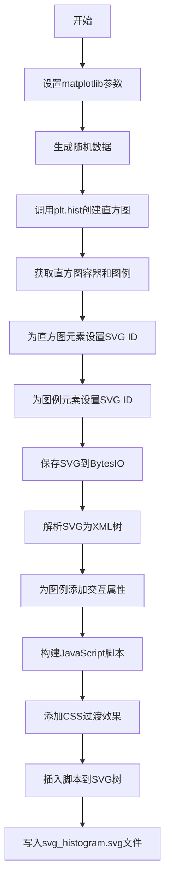

## 类结构

```
该脚本为面向过程代码，无类层次结构
主要模块: matplotlib.pyplot, numpy, xml.etree.ElementTree, io, json
```

## 全局变量及字段


### `plt`
    
matplotlib.pyplot模块，用于绑制图形

类型：`module`
    


### `np`
    
numpy模块，用于数值计算和随机数生成

类型：`module`
    


### `ET`
    
xml.etree.ElementTree模块，用于XML操作和SVG处理

类型：`module`
    


### `json`
    
json模块，用于数据序列化和JSON字符串生成

类型：`module`
    


### `BytesIO`
    
io模块的字节流类，用于内存中存储SVG二进制数据

类型：`class`
    


### `r`
    
随机标准正态分布数据，包含100个样本

类型：`numpy.ndarray`
    


### `r1`
    
随机正态分布数据，均值偏移+1，包含100个样本

类型：`numpy.ndarray`
    


### `labels`
    
图例标签列表，包含'Rabbits'和'Frogs'两个类别名称

类型：`list`
    


### `H`
    
plt.hist返回的直方图数据元组，包含计数、bin边界和补丁对象

类型：`tuple`
    


### `containers`
    
直方图容器对象列表，用于访问直方图的图形元素

类型：`list`
    


### `leg`
    
图例对象，用于管理和操作图例元素

类型：`matplotlib.legend.Legend`
    


### `hist_patches`
    
存储直方图补丁ID的字典，键为hist_编号，值为补丁ID列表

类型：`dict`
    


### `f`
    
SVG输出缓冲区，用于临时存储生成的SVG字节数据

类型：`BytesIO`
    


### `tree`
    
XML树根元素，代表整个SVG文档结构

类型：`xml.etree.ElementTree.Element`
    


### `xmlid`
    
XML元素ID映射字典，用于通过ID快速查找SVG元素

类型：`dict`
    


### `script`
    
嵌入SVG的JavaScript脚本字符串，包含交互函数toggle_hist

类型：`str`
    


### `css`
    
SVG样式元素，用于添加过渡效果CSS规则

类型：`xml.etree.ElementTree.Element`
    


    

## 全局函数及方法


# SVG Histogram 交互式直方图设计文档

## 1. 代码核心功能概述

该代码演示了如何创建交互式SVG直方图，通过在SVG中嵌入ECMAScript（JavaScript）脚本，使观众可以通过点击图例标记来隐藏或显示对应的直方图条形，实现数据可视化的交互探索功能。

## 2. 文件整体运行流程

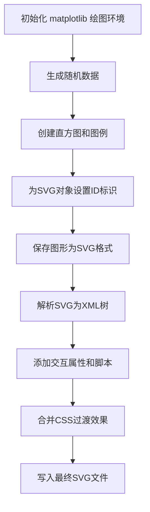

## 3. 类详细信息

本代码为脚本式编写，未定义自定义类。所有操作均通过调用第三方库的类和实例方法完成。

### 3.1 全局变量

| 名称 | 类型 | 描述 |
|------|------|------|
| `r` | numpy.ndarray | 标准正态分布随机数数组（100个元素） |
| `r1` | numpy.ndarray | 偏移后的正态分布随机数（r+1） |
| `labels` | list | 直方图图例标签列表 ['Rabbits', 'Frogs'] |
| `H` | tuple | plt.hist()返回的直方图数据元组 |
| `containers` | list | 直方图容器对象列表 |
| `leg` | Legend | matplotlib图例对象 |
| `f` | BytesIO | 内存中的二进制文件对象 |
| `tree` | ElementTree | SVG XML树结构 |
| `xmlid` | dict | SVG元素ID映射字典 |
| `hist_patches` | dict | 直方图条形ID映射字典 |
| `script` | str | 嵌入SVG的JavaScript交互脚本 |
| `css` | Element | SVG样式元素 |

## 4. 关键组件信息

| 组件名称 | 一句话描述 |
|----------|------------|
| matplotlib.pyplot | Python 2D绘图库，用于生成直方图可视化 |
| numpy.random | 数值计算库，用于生成随机测试数据 |
| xml.etree.ElementTree | Python标准库，用于解析和操作SVG XML |
| BytesIO | 内存文件系统，用于临时存储SVG数据 |
| JSON | 数据序列化，用于将Python字典转为JavaScript对象 |

## 5. 函数与方法详细信息

### `plt.figure()`

创建新的图形窗口。

**参数：** 无

**返回值：** `Figure`，matplotlib图形对象

**流程图：**

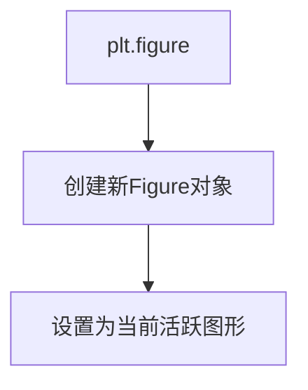

**源码：**

```python
plt.figure()  # 创建新的图形画布，准备后续绘图操作
```

---

### `np.random.randn(100)`

生成100个标准正态分布（均值0，标准差1）的随机数。

**参数：**
- `100`：int，生成随机数的数量

**返回值：** `ndarray`，形状为(100,)的随机数数组

**流程图：**

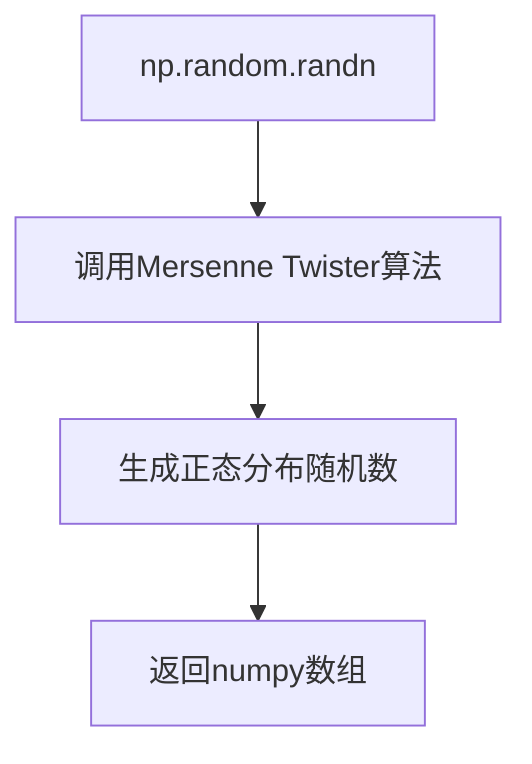

**源码：**

```python
r = np.random.randn(100)  # 生成100个标准正态分布随机数作为数据集1
r1 = r + 1  # 将数据偏移+1作为数据集2
```

---

### `plt.hist()`

绘制直方图并返回数据和容器。

**参数：**
- `[r, r1]`：list，要绘制的数据列表
- `label=labels`：关键字参数，图例标签

**返回值：** `(ndarray, list, list)` 元组，包含直方图频数、容器和条形补丁列表

**流程图：**

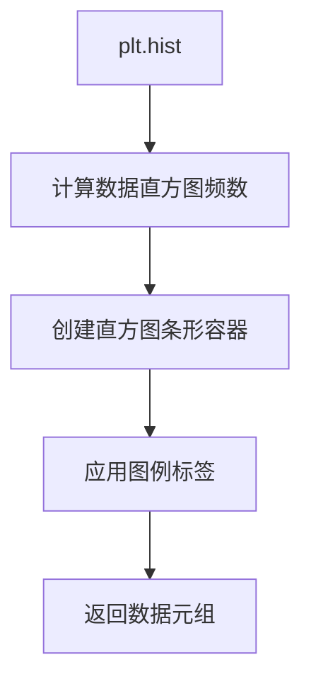

**源码：**

```python
H = plt.hist([r, r1], label=labels)  # 绘制双数据集直方图
containers = H[-1]  # 提取直方图容器（第三个元素）
```

---

### `plt.legend()`

创建图形图例。

**参数：**
- `frameon=False`：bool，图例是否显示边框

**返回值：** `Legend`，图例对象

**流程图：**

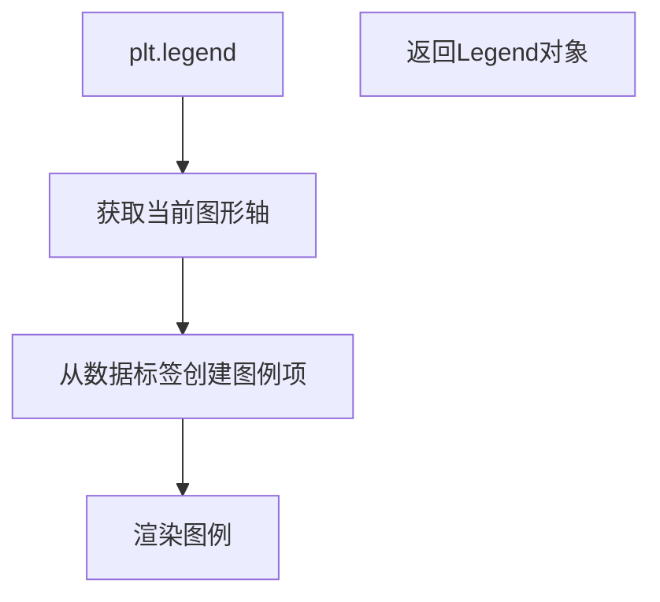

**源码：**

```python
leg = plt.legend(frameon=False)  # 创建无边框图例
```

---

### `element.set_gid()`

为SVG元素设置ID属性（matplotlib后端方法）。

**参数：**
- `f'hist_{ic}_patch_{il}'`：str，SVG元素全局ID

**返回值：** 无

**流程图：**

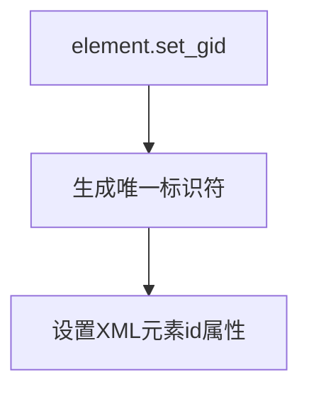

**源码：**

```python
# 为直方图条形设置唯一ID
element.set_gid(f'hist_{ic}_patch_{il}')  # 格式: hist_0_patch_0
hist_patches[f'hist_{ic}'].append(f'hist_{ic}_patch_{il}')
```

---

### `plt.savefig()`

将图形保存为文件或对象。

**参数：**
- `f`：file-like，输出目标（BytesIO对象）
- `format="svg"`：str，输出格式

**返回值：** `None`

**流程图：**

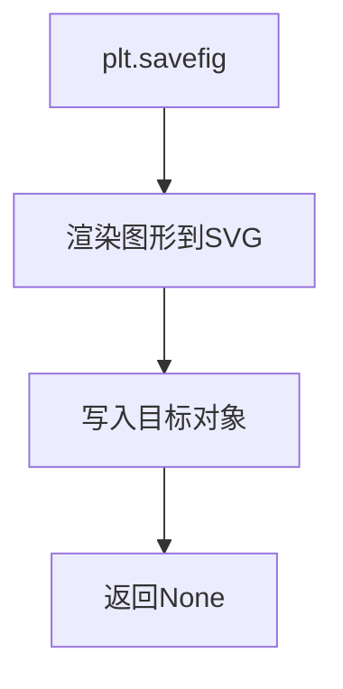

**源码：**

```python
f = BytesIO()  # 创建内存文件对象
plt.savefig(f, format="svg")  # 将图形保存为SVG格式到内存
```

---

### `ET.XMLID()`

解析XML字符串并返回树和ID映射。

**参数：**
- `f.getvalue()`：bytes，SVG字节数据

**返回值：** `(Element, dict)` 元组，XML树元素和ID到元素的映射

**流程图：**

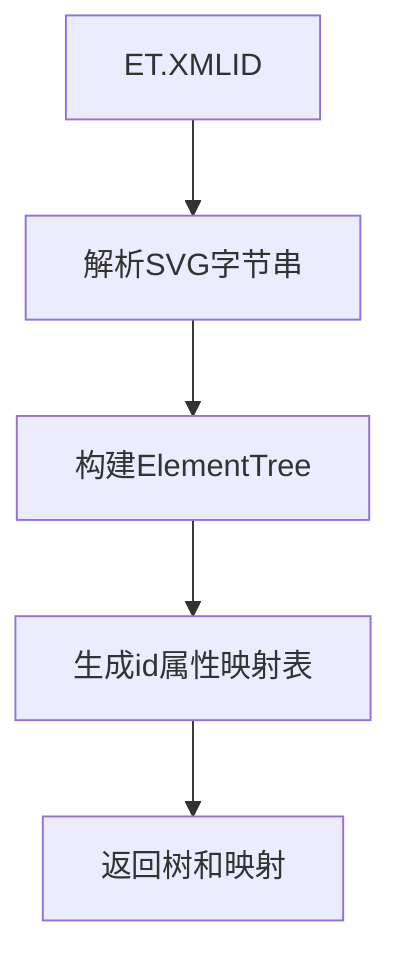

**源码：**

```python
tree, xmlid = ET.XMLID(f.getvalue())  # 解析SVG并建立ID索引
```

---

### `el.set()`

为XML元素设置属性。

**参数：**
- `'cursor'`/`'onclick'`：str，属性名
- `'pointer'`/`"toggle_hist(this)"`：str，属性值

**返回值：** 无

**流程图：**

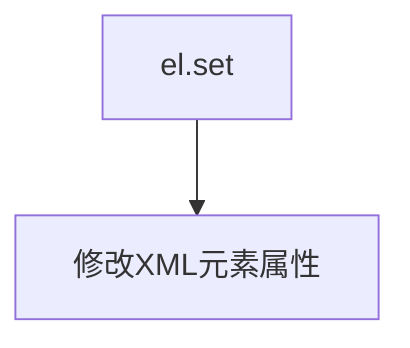

**源码：**

```python
# 为图例补丁添加交互属性
el.set('cursor', 'pointer')  # 鼠标悬停显示指针
el.set('onclick', "toggle_hist(this)")  # 点击触发函数
```

---

### `tree.find()`

在XML树中查找元素。

**参数：**
- `.//{http://www.w3.org/2000/svg}style`：str，XPath查询（带命名空间）

**返回值：** `Element` 或 `None`，找到的元素

**流程图：**

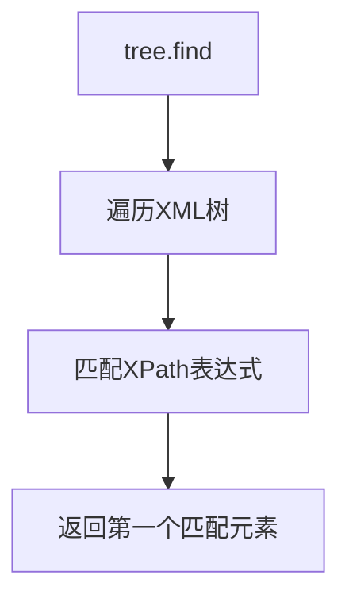

**源码：**

```python
css = tree.find('.//{http://www.w3.org/2000/svg}style')  # 查找SVG样式元素
```

---

### `tree.insert()`

在XML树中插入元素。

**参数：**
- `0`：int，插入位置（根节点之前）
- `ET.XML(script)`：Element，要插入的脚本元素

**返回值：** 无

**流程图：**

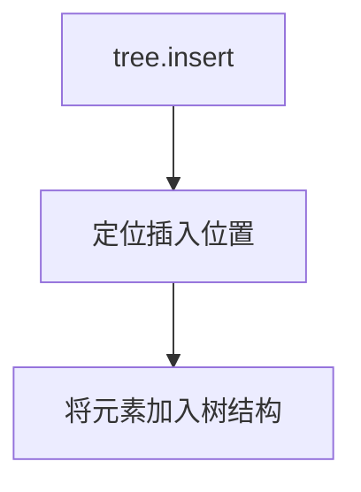

**源码：**

```python
tree.insert(0, ET.XML(script))  # 将交互脚本插入SVG开头
```

---

### `ET.ElementTree().write()`

将XML树写入文件。

**参数：**
- `"svg_histogram.svg"`：str，目标文件名

**返回值：** 无

**流程图：**

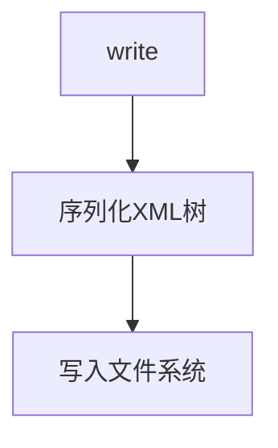

**源码：**

```python
ET.ElementTree(tree).write("svg_histogram.svg")  # 保存最终SVG文件
```

## 6. 潜在技术债务与优化空间

| 序号 | 问题 | 优化建议 |
|------|------|----------|
| 1 | 手动设置ID方式繁琐 | 使用SVG `<g>` 分组或 PatchCollection 批量处理 |
| 2 | 硬编码命名空间前缀 | 封装XML命名空间处理工具函数 |
| 3 | JavaScript字符串拼接不够健壮 | 使用模板引擎或专门的SVG脚本注入库 |
| 4 | CSS过渡效果字符串拼接易错 | 使用字典或配置文件管理样式 |
| 5 | 错误处理缺失 | 添加文件写入异常捕获和SVG解析验证 |

## 7. 其它设计考量

### 7.1 设计目标与约束

- **目标**：创建可在现代浏览器中运行的交互式直方图
- **约束**：依赖SVG和ECMAScript支持（IE9+）
- **跨平台**：支持Linux、macOS、Windows主流浏览器

### 7.2 错误处理与异常设计

当前代码缺少显式异常处理，建议增加：
- 文件写入权限检查
- SVG解析有效性验证
- 内存缓冲溢出保护

### 7.3 数据流与状态机

```
用户点击图例
    ↓
onclick事件触发 toggle_hist()
    ↓
获取点击对象ID中的数字编号
    ↓
切换图例补丁/文本透明度
    ↓
遍历对应直方图所有条形ID
    ↓
切换每条直方图的透明度
    ↓
CSS过渡动画平滑显示/隐藏
```

### 7.4 外部依赖与接口契约

| 依赖 | 版本要求 | 用途 |
|------|----------|------|
| matplotlib | ≥3.0 | 图形渲染 |
| numpy | ≥1.15 | 数值计算 |
| Python | ≥3.6 | XML标准库 |

### 7.5 交互脚本接口

嵌入的JavaScript提供以下接口：

```javascript
// 全局变量：直方图ID映射
var container = {"hist_0": ["hist_0_patch_0", ...], "hist_1": [...]}

// 切换函数
toggle(oid, attribute, values)  // 切换元素属性
toggle_hist(obj)               // 主交互函数，由onclick调用
```


### `toggle`

切换对象的样式属性值，在两个状态之间切换。

参数：

- `oid`：`String`，对象标识符，用于获取 DOM 元素
- `attribute`：`String`，样式属性的名称（如 "opacity"）
- `values`：`Array`，包含两个值的数组 [开启状态的值, 关闭状态的值]

返回值：`void`，无返回值，直接修改对象的样式属性

#### 流程图

```mermaid
flowchart TD
    A[开始 toggle 函数] --> B[通过 oid 获取 DOM 元素]
    B --> C[获取当前属性值]
    C --> D{当前值是否等于<br/>values[0] 或空字符串?}
    D -->|是| E[设置属性值为 values[1]]
    D -->|否| F[设置属性值为 values[0]]
    E --> G[将样式属性应用到对象]
    F --> G
    G --> H[结束]
```

#### 带注释源码

```javascript
function toggle(oid, attribute, values) {
    /* Toggle the style attribute of an object between two values.

    Parameters
    ----------
    oid : str
      Object identifier.
    attribute : str
      Name of style attribute.
    values : [on state, off state]
      The two values that are switched between.
    */
    var obj = document.getElementById(oid);  // 通过 ID 获取 SVG 元素
    var a = obj.style[attribute];            // 获取当前样式属性值

    // 判断当前值是否需要切换：如果等于第一个值或为空，则切换到第二个值，否则切换到第一个值
    a = (a == values[0] || a == "") ? values[1] : values[0];
    obj.style[attribute] = a;                // 应用新的样式属性值
}
```

---

### `toggle_hist`

点击图例标记时切换对应直方图的可见性，同时切换图例本身的透明度。

参数：

- `obj`：`Element`，被点击的 SVG 元素（图例补丁或文本）

返回值：`void`，无返回值，通过副作用修改多个元素的样式

#### 流程图

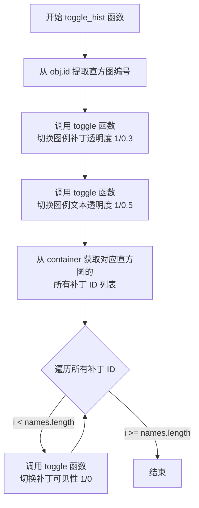

#### 带注释源码

```javascript
function toggle_hist(obj) {

    var num = obj.id.slice(-1);  // 从元素 ID 中提取最后一个字符作为直方图编号

    // 切换图例补丁的透明度：点击时从 1 变为 0.3，再次点击恢复
    toggle('leg_patch_' + num, 'opacity', [1, 0.3]);
    
    // 切换图例文本的透明度：点击时从 1 变为 0.5，再次点击恢复
    toggle('leg_text_' + num, 'opacity', [1, 0.5]);

    // 从全局容器获取该直方图对应的所有补丁 ID
    var names = container['hist_'+num]

    // 遍历所有补丁，切换其可见性（完全不透明 vs 完全透明）
    for (var i=0; i < names.length; i++) {
        toggle(names[i], 'opacity', [1, 0])
    };
}
```

---

### 全局变量 `container`

存储每个直方图对应的所有补丁 ID，用于在交互时批量切换可见性。

变量：

- `container`：`Object`，键为直方图标识符（如 "hist_0"、"hist_1"），值为该直方图所有补丁 ID 组成的数组

#### 带注释源码

```javascript
// 全局变量 container，由 Python 代码动态生成
// 结构示例: {"hist_0": ["hist_0_patch_0", "hist_0_patch_1", ...], "hist_1": [...]}
var container = %s
```


### `toggle`

切换对象样式属性在两个值之间切换

参数：

- `oid`：`String`，对象标识符，用于在文档中查找对应的元素
- `attribute`：`String`，样式属性名称（如 "opacity"）
- `values`：`Array`，包含两个状态的数组 [on state, off state]

返回值：`void`，无返回值

#### 流程图

```mermaid
flowchart TD
    A[开始] --> B[通过oid获取DOM元素对象]
    B --> C[获取当前属性值]
    C --> D{当前值是否等于values[0]或空字符串?}
    D -->|是| E[设置属性为values[1]]
    D -->|否| F[设置属性为values[0]]
    E --> G[结束]
    F --> G
```

#### 带注释源码

```javascript
function toggle(oid, attribute, values) {
    /* Toggle the style attribute of an object between two values.

    Parameters
    ----------
    oid : str
      Object identifier.
    attribute : str
      Name of style attribute.
    values : [on state, off state]
      The two values that are switched between.
    */
    // 通过ID获取SVG文档中的DOM元素对象
    var obj = document.getElementById(oid);
    
    // 获取该对象指定样式属性的当前值
    var a = obj.style[attribute];

    // 判断当前值是否等于第一个值或空字符串
    // 如果是，则切换到第二个值；否则切换到第一个值
    a = (a == values[0] || a == "") ? values[1] : values[0];
    
    // 更新对象的样式属性
    obj.style[attribute] = a;
}
```


### `toggle_hist(obj)`

该函数是SVG直方图交互功能的核心处理函数，当用户点击图例标记（patch或text）时触发，通过获取点击元素的ID尾数来确定目标直方图索引，然后分别切换对应图例元素和直方图条形的透明度，实现显示/隐藏对应直方图数据系列的功能。

参数：

- `obj`：HTML元素对象，点击的图例元素（可以是图例补丁元素或图例文本元素），包含以数字结尾的ID

返回值：`undefined`（无返回值），该函数直接修改DOM元素的样式属性

#### 流程图

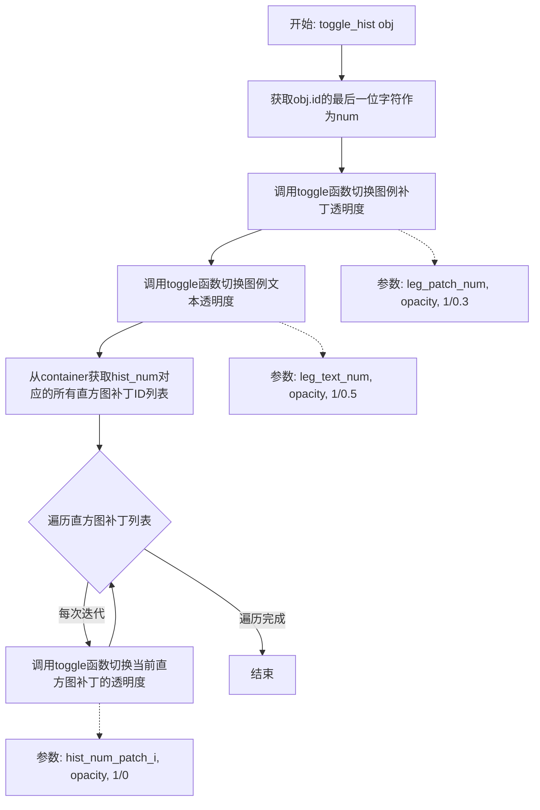

#### 带注释源码

```javascript
function toggle_hist(obj) {

    // 从点击元素的ID中提取末尾的数字字符
    // 例如: "leg_patch_0" -> "0", "leg_text_1" -> "1"
    // 这个数字对应直方图数据系列的索引
    var num = obj.id.slice(-1);

    // 切换图例补丁元素的透明度
    // 在完全可见(1)和半透明(0.3)之间切换
    // 参数: 元素ID, 样式属性名, [可见状态值, 隐藏状态值]
    toggle('leg_patch_' + num, 'opacity', [1, 0.3]);
    
    // 切换图例文本元素的透明度
    // 在完全可见(1)和半透明(0.5)之间切换
    toggle('leg_text_' + num, 'opacity', [1, 0.5]);

    // 从预定义的container对象中获取对应直方图的所有补丁ID
    // container在脚本初始化时由Python代码生成
    // 格式: {"hist_0": ["hist_0_patch_0", "hist_0_patch_1", ...], "hist_1": [...]}
    var names = container['hist_'+num]

    // 遍历该直方图的所有条形补丁
    for (var i=0; i < names.length; i++) {
        // 切换每个直方图条形的透明度
        // 在完全可见(1)和完全透明(0)之间切换
        toggle(names[i], 'opacity', [1, 0])
    };
    }
```

#### 辅助函数 `toggle` 流程

```mermaid
flowchart TD
    A[开始: toggle oid, attribute, values] --> B[通过ID获取DOM元素]
    B --> C[获取当前属性值]
    C --> D{判断当前值是否等于values[0]或为空}
    D -->|是| E[设置属性值为values[1]]
    D -->|否| F[设置属性值为values[0]]
    E --> G[结束]
    F --> G
```

## 关键组件


### SVG直方图生成模块

使用matplotlib创建直方图数据，并将其保存为SVG格式的基础组件。通过`plt.hist()`生成直方图数据，`plt.savefig()`将图像写入BytesIO对象。

### XML/SVG解析引擎

使用`xml.etree.ElementTree`模块解析和操作SVG文档。包含`ET.XMLID()`函数用于解析SVG并生成ID映射字典，以及`ET.register_namespace()`避免XML命名空间混乱。

### SVG元素ID分配系统

为直方图条形、图例块和文本分配全局唯一标识符(GID)的机制。通过`element.set_gid()`方法将ID绑定到各个SVG元素，使后续的JavaScript交互能够精确定位和操作这些元素。

### 交互事件绑定组件

为SVG元素添加鼠标交互属性的模块。通过设置`cursor: pointer`和`onclick`事件处理函数，将点击图例的操作与JavaScript函数`toggle_hist`关联。

### JavaScript交互逻辑生成器

动态构建嵌入SVG的ECMAScript代码。包含`toggle()`函数用于在两个状态值之间切换CSS属性，以及`toggle_hist()`函数用于处理图例点击时同时切换对应直方图条和图例标记的透明度。

### CSS过渡效果增强器

修改SVG内置CSS样式，添加平滑的透明度过渡动画。通过`-webkit-transition`和`-moz-transition`属性实现跨浏览器的0.4秒淡入淡出效果。

### 容器数据结构

存储直方图条形ID映射的Python字典对象。键为`hist_{ic}`格式，值为对应的SVG元素ID列表，用于在JavaScript中批量操作同一直方图的所有条形。

### 文件输出模块

将处理完成的SVG树写入磁盘文件的组件。使用`ET.ElementTree(tree).write()`将包含交互脚本和样式的最终SVG文档保存为`svg_histogram.svg`文件。


## 问题及建议


### 已知问题

- **ID解析逻辑缺陷**：JavaScript中 `num = obj.id.slice(-1)` 只获取最后一位字符，当直方图数量超过9个时会导致索引错误
- **硬编码透明度值**：透明度值（1, 0.3, 0.5, 0）在代码中多处硬编码，散落在Python和JavaScript中，难以维护
- **缺少错误处理**：文件读写、SVG生成、XML解析等操作均无异常捕获机制
- **魔法数字和硬编码**：随机种子(19680801)、直方图数量(100)、输出文件名("svg_histogram.svg")等均为硬编码
- **字符串拼接效率低**：CSS和脚本通过字符串拼接生成，容易出错且难以调试
- **全局作用域污染**：所有代码都在顶层执行，无模块化封装
- **设计文档中提到的优化未实现**：注释提到可使用PatchCollection或class属性简化ID管理，但代码中未实现

### 优化建议

- 将JavaScript逻辑封装为可配置的函数，透明度值和过渡时长作为参数传入
- 使用更健壮的ID解析方式，如正则表达式或存储完整索引值
- 将硬编码配置抽取为常量或配置文件
- 添加try-except块处理文件IO和XML操作异常
- 考虑将直方图生成逻辑封装为可复用的函数或类
- 使用f-string或模板引擎替代字符串拼接提高可读性
- 实现注释中建议的PatchCollection或class方式简化SVG对象管理
- 添加日志记录便于调试和监控


## 其它


### 设计目标与约束

本代码旨在演示如何在SVG图像中实现交互式直方图功能，允许用户通过点击图例标记来切换对应直方图的显示与隐藏。设计约束包括：1) 依赖matplotlib后端的对象ID机制；2) 使用ECMAScript实现交互逻辑；3) 生成的SVG需在现代Web浏览器中打开；4) 仅支持Linux、macOS以及Windows IE9+浏览器。

### 错误处理与异常设计

代码采用Python标准库进行文件操作和XML处理，主要异常处理包括：1) `BytesIO`对象创建失败时直接抛出IOError；2) `ElementTree.XMLID()`解析失败时返回空字典导致后续`KeyError`，通过预先存在的xmlid键值对预防；3) SVG写入失败时由文件系统权限决定，暂无自定义异常捕获机制。

### 数据流与状态机

数据流主要包括：随机数生成 → matplotlib直方图渲染 → SVG序列化 → XML解析与ID提取 → 交互属性注入 → JavaScript脚本嵌入 → 最终SVG文件输出。状态机体现在JavaScript层面：toggle函数在两个状态值之间切换（opacity: 1↔0.3/0.5），图例和直方图柱体保持同步显示状态。

### 外部依赖与接口契约

主要依赖包括：1) `matplotlib.pyplot` - 图形渲染；2) `numpy.random` - 随机数生成；3) `xml.etree.ElementTree` - XML解析与操作；4) `json` - Python字典到JavaScript对象转换。输出接口为`svg_histogram.svg`文件，包含内联ECMAScript脚本和CSS过渡效果。

### 性能考虑

当前实现的主要性能瓶颈：1) 逐个设置元素ID效率较低，大数据集时建议使用PatchCollection或class属性批量处理；2) XML解析采用完整加载模式，大型SVG可能出现内存占用问题；3) JavaScript遍历采用线性循环，可考虑使用Set数据结构优化查找性能。

### 兼容性考虑

浏览器兼容性：1) CSS过渡效果使用-webkit-和-moz-前缀，兼容旧版Chrome/Firefox；2) ECMAScript标准写法兼容现代浏览器；3) SVG 1.1规范在主流浏览器支持良好，但IE9以下版本不支持SVG。Python兼容性方面，代码使用Python 3语法风格，无版本特定特性依赖。

### 可测试性

当前代码可测试性较低，属于一次性演示脚本。建议改进方向：1) 将交互逻辑封装为独立函数便于单元测试；2) 将配置参数（随机种子、文件路径）提取为函数参数；3) 添加SVG输出结构验证函数；4) JavaScript函数可使用Jest等框架进行独立测试。

### 部署与运行环境

运行环境要求：1) Python 3.x；2) matplotlib >= 1.5；3) numpy >= 1.10；4) 现代Web浏览器（Chrome、Firefox、Safari、Edge或IE9+）用于查看交互效果。部署方式为直接运行Python脚本，输出当前目录下的`svg_histogram.svg`文件。

### 配置管理

代码中包含以下可配置项：1) `np.random.seed(19680801)` - 随机数种子确保可重现性；2) `plt.rcParams['svg.fonttype'] = 'none'` - SVG字体类型配置；3) CSS过渡持续时间`0.4s ease-out`；4) 不透明度状态值（1/0.3/0.5/0）；5) 输出文件名`svg_histogram.svg`。建议将上述参数抽取为配置文件或命令行参数。

### 版本控制信息

代码为独立演示脚本，无版本控制需求。相关库版本要求：matplotlib 1.5+、numpy 1.10+、Python 3.4+（ElementTree在Python 2.5+已存在但API略有差异）。

### 使用示例

运行方式：直接在Python环境中执行脚本文件。输出：在当前工作目录生成`svg_histogram.svg`文件。双击打开SVG文件或将其拖入Web浏览器，点击图例标记（彩色方块或文字）可切换对应直方图的显示状态，直方图和图例会呈现0.4秒的平滑过渡动画效果。


    