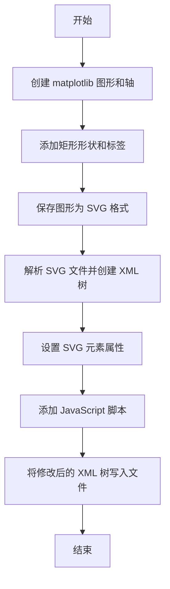
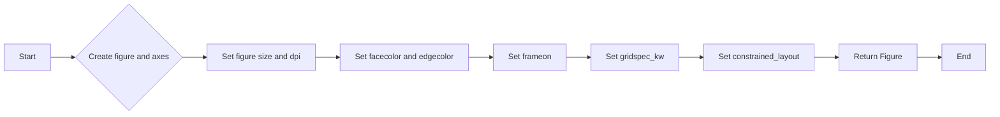
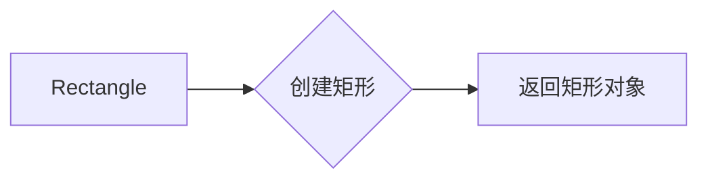
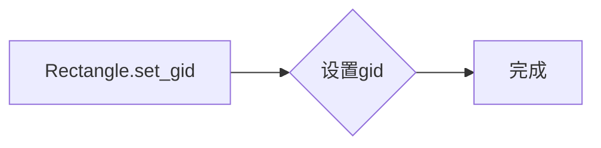
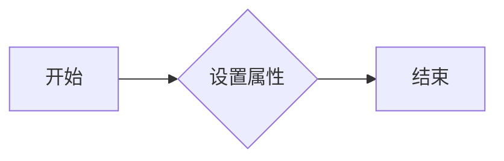
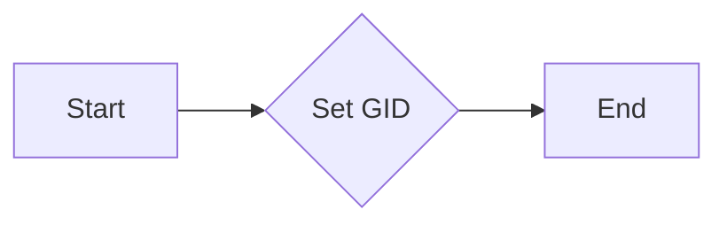

# `matplotlib\galleries\examples\user_interfaces\svg_tooltip_sgskip.py` 详细设计文档

This code generates an SVG tooltip for matplotlib patches by creating an interactive SVG file with JavaScript callbacks for showing and hiding the tooltips on mouseover and mouseout events.

## 整体流程



## 类结构

```
matplotlib.pyplot (matplotlib 库)
├── fig, ax = plt.subplots()
│   ├── fig
│   └── ax
├── rect1, rect2 = plt.Rectangle((10, -20), 10, 5, fc='blue')
│   ├── rect1
│   └── rect2
├── shapes, labels
│   ├── shapes
│   └── labels
└── ax.add_patch(item), ax.annotate(labels[i], ...)
    └── item, labels[i]
```

## 全局变量及字段


### `fig`
    
The main figure object containing all the plot elements.

类型：`matplotlib.figure.Figure`
    


### `ax`
    
The axes object where the plot is drawn.

类型：`matplotlib.axes._subplots.AxesSubplot`
    


### `rect1`
    
The first rectangle patch with a blue fill color.

类型：`matplotlib.patches.Rectangle`
    


### `rect2`
    
The second rectangle patch with a green fill color.

类型：`matplotlib.patches.Rectangle`
    


### `shapes`
    
A list of rectangle patches to be added to the plot.

类型：`list of matplotlib.patches.Rectangle`
    


### `labels`
    
A list of strings containing the labels for each rectangle patch.

类型：`list of str`
    


### `f`
    
A BytesIO object used to save the SVG figure to a file-like object.

类型：`io.BytesIO`
    


### `tree`
    
The XML tree representing the SVG content.

类型：`xml.etree.ElementTree.ElementTree`
    


### `xmlid`
    
The XML ID mapping for the SVG elements.

类型：`xml.etree.ElementTree.ElementTree`
    


### `script`
    
The JavaScript script containing the functions to show and hide tooltips.

类型：`str`
    


### `matplotlib.patches.Rectangle.xy`
    
The (x, y) position of the rectangle.

类型：`tuple of float`
    


### `matplotlib.patches.Rectangle.width`
    
The width of the rectangle.

类型：`float`
    


### `matplotlib.patches.Rectangle.height`
    
The height of the rectangle.

类型：`float`
    


### `matplotlib.patches.Rectangle.fc`
    
The fill color of the rectangle.

类型：`str`
    


### `matplotlib.text.Text.xy`
    
The (x, y) position of the text annotation.

类型：`tuple of float`
    


### `matplotlib.text.Text.xytext`
    
The (x, y) position of the text relative to the annotated object.

类型：`tuple of float`
    


### `matplotlib.text.Text.textcoords`
    
The coordinate system used for the xytext position.

类型：`str`
    


### `matplotlib.text.Text.color`
    
The color of the text annotation.

类型：`str`
    


### `matplotlib.text.Text.ha`
    
The horizontal alignment of the text annotation.

类型：`str`
    


### `matplotlib.text.Text.fontsize`
    
The font size of the text annotation.

类型：`int`
    


### `matplotlib.text.Text.bbox`
    
The bounding box of the text annotation.

类型：`dict`
    


### `matplotlib.text.Text.zorder`
    
The z-order of the text annotation.

类型：`int`
    
    

## 全局函数及方法


### subplots

`subplots` 函数用于创建一个图形和一个轴对象。

参数：

- `figsize`：`tuple`，图形的大小，默认为 (6, 4)。
- `dpi`：`int`，图形的分辨率，默认为 100。
- `facecolor`：`color`，图形的背景颜色，默认为 'white'。
- `edgecolor`：`color`，图形的边缘颜色，默认为 'none'。
- `frameon`：`bool`，是否显示图形的边框，默认为 True。
- `gridspec_kw`：`dict`，用于定义网格的参数，默认为 None。
- `constrained_layout`：`bool`，是否启用约束布局，默认为 False。

返回值：`Figure`，图形对象。

#### 流程图



#### 带注释源码

```python
def subplots(*args, **kwargs):
    """
    Create a figure and a set of subplots.

    Parameters
    ----------
    figsize : tuple, optional
        Size of the figure in inches. The default is (6, 4).
    dpi : int, optional
        Dots per inch. The default is 100.
    facecolor : color, optional
        Face color of the figure. The default is 'white'.
    edgecolor : color, optional
        Edge color of the figure. The default is 'none'.
    frameon : bool, optional
        If True, draw a frame around the figure. The default is True.
    gridspec_kw : dict, optional
        Additional keyword arguments to pass to GridSpec. The default is None.
    constrained_layout : bool, optional
        If True, enable Constrained Layout. The default is False.

    Returns
    -------
    Figure
        The figure containing the axes.

    """
    # ... (rest of the code)
```


### Rectangle

`Rectangle` 是一个 matplotlib 的类，用于创建矩形形状。

参数：

- `xy`：`(float, float)`，矩形的中心坐标。
- `width`：`float`，矩形的宽度。
- `height`：`float`，矩形的高度。
- `fc`：`str`，矩形的填充颜色。
- `ec`：`str`，矩形的边缘颜色。
- `lw`：`float`，矩形的边缘宽度。

返回值：`matplotlib.patches.Rectangle`，创建的矩形对象。

#### 流程图



#### 带注释源码

```python
from matplotlib.patches import Rectangle

class Rectangle(Rectangle):
    def __init__(self, xy, width, height, fc='none', ec='none', lw=1.0):
        Rectangle.__init__(self, xy, width, height, fc, ec, lw)
```


### ShowTooltip(obj)

显示工具提示。

参数：

- `obj`：`string`，当前鼠标悬停的SVG元素的ID。

返回值：`void`，无返回值。

#### 流程图

```mermaid
graph LR
A[开始] --> B{检查obj}
B -->|obj存在| C[获取tooltip元素]
B -->|obj不存在| D[结束]
C --> E[设置tooltip可见性为"visible"]
E --> F[结束]
```

#### 带注释源码

```python
def ShowTooltip(obj):
    # 获取当前鼠标悬停的SVG元素的ID
    cur = obj.id.split("_")[1]
    # 获取对应的tooltip元素
    tip = svgDocument.getElementById('mytooltip_' + cur)
    # 设置tooltip的可见性为"visible"
    tip.setAttribute('visibility', "visible")
```


### HideTooltip(obj)

隐藏工具提示。

参数：

- `obj`：`string`，当前鼠标悬停的SVG元素的ID。

返回值：`void`，无返回值。

#### 流程图

```mermaid
graph LR
A[开始] --> B{检查obj}
B -->|obj存在| C[获取tooltip元素]
B -->|obj不存在| D[结束]
C --> E[设置tooltip可见性为"hidden"]
E --> F[结束]
```

#### 带注释源码

```python
def HideTooltip(obj):
    # 获取当前鼠标悬停的SVG元素的ID
    cur = obj.id.split("_")[1]
    # 获取对应的tooltip元素
    tip = svgDocument.getElementById('mytooltip_' + cur)
    # 设置tooltip的可见性为"hidden"
    tip.setAttribute('visibility', "hidden")
```


### `annotate`

`annotate` 方法用于在 matplotlib 图形中添加文本注释。

参数：

- `labels`：`list`，包含要添加的注释文本列表。
- `xy`：`tuple`，指定注释文本的位置。
- `xytext`：`tuple`，指定注释文本相对于 `xy` 的偏移量。
- `textcoords`：`str`，指定 `xytext` 的坐标系统，这里使用 `'offset points'` 表示偏移量以点为单位。
- `color`：`str`，指定注释文本的颜色。
- `ha`：`str`，指定注释文本的水平对齐方式，这里使用 `'center'` 表示居中对齐。
- `fontsize`：`int`，指定注释文本的字体大小。
- `bbox`：`dict`，指定注释文本的边框样式，包括边框颜色、宽度、填充颜色等。
- `zorder`：`int`，指定注释文本的绘制顺序。

返回值：`None`

#### 流程图

```mermaid
graph LR
A[Start] --> B{Call annotate()}
B --> C[End]
```

#### 带注释源码

```python
annotate = ax.annotate(labels[i], xy=item.get_xy(), xytext=(0, 0),
                       textcoords='offset points', color='w', ha='center',
                       fontsize=8, bbox=dict(boxstyle='round, pad=.5',
                                                 fc=(.1, .1, .1, .92),
                                                 ec=(1., 1., 1.), lw=1,
                                                 zorder=1))
```


### `plt.savefig`

将matplotlib图形保存为SVG格式的文件。

参数：

- `f`：`BytesIO`，一个用于保存SVG内容的文件对象。

返回值：无

#### 流程图

```mermaid
graph LR
A[开始] --> B{调用plt.savefig(f, format="svg")}
B --> C[结束]
```

#### 带注释源码

```python
# Save the figure in a fake file object
f = BytesIO()
plt.savefig(f, format="svg")
```


### ShowTooltip(obj)

显示工具提示。

参数：

- `obj`：`Element`，当前鼠标悬停的SVG元素对象。

返回值：无

#### 流程图

```mermaid
graph LR
A[开始] --> B{检查obj}
B -->|是| C[获取id]
C --> D[分割id]
D --> E{获取索引}
E --> F[获取tooltip元素]
F --> G[设置visibility为"visible"]
G --> H[结束]
```

#### 带注释源码

```python
def ShowTooltip(obj):
    # 获取当前鼠标悬停的SVG元素对象的id
    cur = obj.id.split("_")[1]
    # 获取tooltip元素
    tip = svgDocument.getElementById('mytooltip_' + cur)
    # 设置tooltip元素的visibility为"visible"
    tip.setAttribute('visibility', "visible")
```


### ShowTooltip(obj)

显示工具提示。

参数：

- `obj`：`str`，当前鼠标悬停的SVG元素的ID。

返回值：无

#### 流程图

```mermaid
graph LR
A[开始] --> B{检查obj}
B -->|是| C[获取tooltip元素]
B -->|否| D[结束]
C --> E[设置tooltip可见性为"visible"]
E --> F[结束]
```

#### 带注释源码

```python
def ShowTooltip(obj):
    # 获取当前鼠标悬停的SVG元素的ID
    cur = obj.id.split("_")[1]
    # 获取对应的tooltip元素
    tip = svgDocument.getElementById('mytooltip_' + cur)
    # 设置tooltip的可见性为"visible"
    tip.setAttribute('visibility', "visible")
```


### HideTooltip(obj)

隐藏工具提示。

参数：

- `obj`：`str`，当前鼠标悬停的SVG元素的ID。

返回值：无

#### 流程图

```mermaid
graph LR
A[开始] --> B{检查obj}
B -->|是| C[获取tooltip元素]
B -->|否| D[结束]
C --> E[设置tooltip可见性为"hidden"]
E --> F[结束]
```

#### 带注释源码

```python
def HideTooltip(obj):
    # 获取当前鼠标悬停的SVG元素的ID
    cur = obj.id.split("_")[1]
    # 获取对应的tooltip元素
    tip = svgDocument.getElementById('mytooltip_' + cur)
    # 设置tooltip的可见性为"hidden"
    tip.setAttribute('visibility', "hidden")
```


### ShowTooltip(obj)

显示工具提示。

参数：

- `obj`：`string`，当前鼠标悬停的SVG元素的ID。

返回值：`void`，无返回值。

#### 流程图

```mermaid
graph LR
A[开始] --> B{检查obj}
B -->|obj存在| C[获取tooltip元素]
B -->|obj不存在| D[结束]
C --> E[设置tooltip可见性为"visible"]
E --> F[结束]
```

#### 带注释源码

```python
def ShowTooltip(obj):
    # 获取当前鼠标悬停的SVG元素的ID
    cur = obj.id.split("_")[1]
    # 获取对应的tooltip元素
    tip = svgDocument.getElementById('mytooltip_' + cur)
    # 设置tooltip的可见性为"visible"
    tip.setAttribute('visibility', "visible")
```


### HideTooltip(obj)

隐藏工具提示。

参数：

- `obj`：`string`，当前鼠标悬停的SVG元素的ID。

返回值：`void`，无返回值。

#### 流程图

```mermaid
graph LR
A[开始] --> B{检查obj}
B -->|obj存在| C[获取tooltip元素]
B -->|obj不存在| D[结束]
C --> E[设置tooltip可见性为"hidden"]
E --> F[结束]
```

#### 带注释源码

```python
def HideTooltip(obj):
    # 获取当前鼠标悬停的SVG元素的ID
    cur = obj.id.split("_")[1]
    # 获取对应的tooltip元素
    tip = svgDocument.getElementById('mytooltip_' + cur)
    # 设置tooltip的可见性为"hidden"
    tip.setAttribute('visibility', "hidden")
```


### ShowTooltip(obj)

显示工具提示。

参数：

- `obj`：`str`，当前鼠标悬停的SVG元素的ID。

返回值：`None`，无返回值。

#### 流程图

```mermaid
graph LR
A[开始] --> B{检查obj}
B -->|是| C[获取tooltip元素]
B -->|否| D[结束]
C --> E[设置tooltip可见性为"visible"]
E --> F[结束]
```

#### 带注释源码

```python
def ShowTooltip(obj):
    # 获取当前鼠标悬停的SVG元素的ID
    cur = obj.id.split("_")[1]
    # 获取对应的tooltip元素
    tip = svgDocument.getElementById('mytooltip_' + cur)
    # 设置tooltip的可见性为"visible"
    tip.setAttribute('visibility', "visible")
```


### HideTooltip(obj)

隐藏工具提示。

参数：

- `obj`：`str`，当前鼠标悬停的SVG元素的ID。

返回值：`None`，无返回值。

#### 流程图

```mermaid
graph LR
A[开始] --> B{检查obj}
B -->|是| C[获取tooltip元素]
B -->|否| D[结束]
C --> E[设置tooltip可见性为"hidden"]
E --> F[结束]
```

#### 带注释源码

```python
def HideTooltip(obj):
    # 获取当前鼠标悬停的SVG元素的ID
    cur = obj.id.split("_")[1]
    # 获取对应的tooltip元素
    tip = svgDocument.getElementById('mytooltip_' + cur)
    # 设置tooltip的可见性为"hidden"
    tip.setAttribute('visibility', "hidden")
```


### Rectangle.set_gid

设置矩形的全局唯一标识符（Global Identifier）。

参数：

- `gid`：`str`，全局唯一标识符的字符串表示。

返回值：`None`，没有返回值。

#### 流程图



#### 带注释源码

```python
# Rectangle.set_gid
def set_gid(self, gid):
    self._gid = gid
```


### Rectangle.set

`Rectangle.set` 方法用于设置矩形的属性。

参数：

- `xy`：`tuple`，矩形的中心坐标。
- `width`：`float`，矩形的宽度。
- `height`：`float`，矩形的高度。
- `fc`：`str`，矩形的填充颜色。

返回值：`None`，无返回值。

#### 流程图



#### 带注释源码

```python
class Rectangle:
    def __init__(self, xy, width, height, fc='blue'):
        self.xy = xy
        self.width = width
        self.height = height
        self.fc = fc

    def set(self, xy=None, width=None, height=None, fc=None):
        if xy is not None:
            self.xy = xy
        if width is not None:
            self.width = width
        if height is not None:
            self.height = height
        if fc is not None:
            self.fc = fc
```


### `annotate.set_gid`

`annotate.set_gid` 方法用于设置注释对象的全局唯一标识符（GID）。

参数：

- `gid`：`str`，全局唯一标识符，用于在 SVG 文档中引用注释对象。

返回值：无

#### 流程图



#### 带注释源码

```python
# Set GID for the annotation object
annotate.set_gid(f'mytooltip_{i:03d}')
```


## 关键组件


### 张量索引与惰性加载

张量索引与惰性加载是处理大型数据集时常用的技术，它允许在需要时才计算或加载数据，从而减少内存消耗和提高效率。

### 反量化支持

反量化支持是指系统或库能够处理非精确数值，如浮点数，并能够进行相应的数学运算。

### 量化策略

量化策略是指将高精度数值（如浮点数）转换为低精度数值（如整数）的策略，通常用于优化计算性能和减少内存使用。


## 问题及建议


### 已知问题

-   **性能问题**：代码中使用了`BytesIO`来保存SVG文件，这可能会在处理大型图形时导致性能问题。
-   **可维护性**：代码中硬编码了SVG元素的ID和属性，这降低了代码的可维护性，如果SVG结构发生变化，代码可能需要大量修改。
-   **错误处理**：代码中没有明确的错误处理机制，如果SVG生成过程中出现错误，可能会导致整个程序崩溃。
-   **代码重复**：`ShowTooltip`和`HideTooltip`函数在代码中重复出现，可以考虑将其封装到一个类中以提高代码复用性。

### 优化建议

-   **使用更高效的数据结构**：考虑使用更高效的数据结构来存储SVG元素的信息，例如使用字典来映射元素ID和属性。
-   **增加错误处理**：在SVG生成和保存过程中增加错误处理，确保程序的健壮性。
-   **封装重复代码**：将`ShowTooltip`和`HideTooltip`函数封装到一个类中，减少代码重复，并提高代码的可读性和可维护性。
-   **使用配置文件**：将SVG元素的ID和属性存储在配置文件中，这样如果SVG结构发生变化，只需要修改配置文件而不是代码本身。
-   **模块化**：将SVG生成和保存的过程模块化，使得代码更加清晰，易于理解和维护。


## 其它


### 设计目标与约束

- 设计目标：
  - 创建一个SVG提示工具，用于在matplotlib图形上显示文本信息。
  - 提供对提示工具位置和外观的完全控制。
  - 确保提示工具在鼠标悬停时可见，在鼠标移开时隐藏。

- 约束：
  - 必须使用matplotlib库进行图形绘制。
  - 提示工具必须使用SVG格式。
  - 代码应尽可能简洁，避免不必要的复杂性。

### 错误处理与异常设计

- 错误处理：
  - 在读取或写入SVG文件时，捕获可能的IO错误。
  - 在解析XML时，捕获可能的解析错误。

- 异常设计：
  - 使用try-except块来处理可能发生的异常。
  - 提供清晰的错误消息，帮助用户诊断问题。

### 数据流与状态机

- 数据流：
  - 用户将鼠标悬停在matplotlib图形上的特定区域。
  - 系统检测到鼠标悬停事件，并显示相应的提示工具。
  - 用户将鼠标移开，提示工具消失。

- 状态机：
  - 提示工具有两个状态：可见和不可见。
  - 状态转换由鼠标悬停和移开事件触发。

### 外部依赖与接口契约

- 外部依赖：
  - matplotlib库：用于图形绘制和保存SVG文件。
  - xml.etree.ElementTree库：用于解析和修改SVG文件。

- 接口契约：
  - SVG文件应包含必要的XML元素和属性，以支持提示工具的功能。
  - JavaScript脚本应定义ShowTooltip和HideTooltip函数，以控制提示工具的可见性。

    