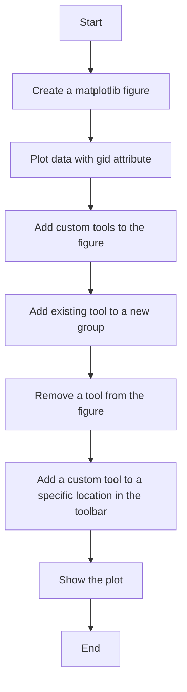
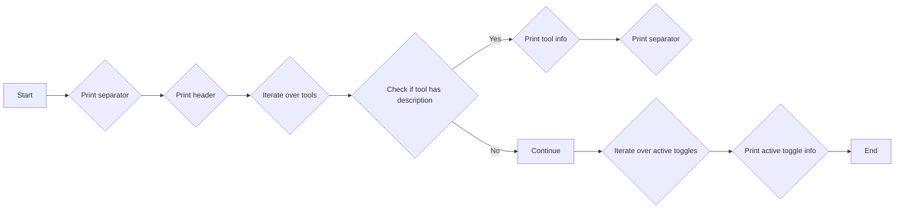
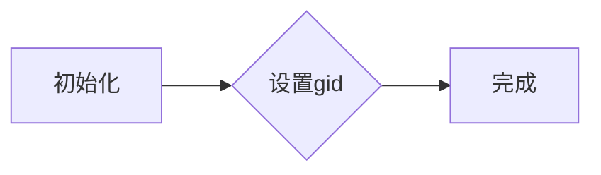
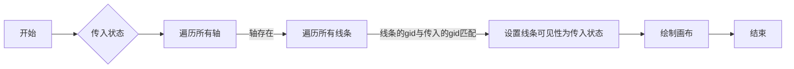

# `matplotlib\galleries\examples\user_interfaces\toolmanager_sgskip.py` 详细设计文档

This code demonstrates the usage of `matplotlib.backend_managers.ToolManager` to manage tools in a matplotlib plot, including listing tools, creating custom tools, adding and removing tools, and toggling tool visibility.

## 整体流程



## 类结构

```
matplotlib.figure.Figure
├── matplotlib.backends.backend_toolmanager.ToolManager
│   ├── ListTools
│   └── GroupHideTool
└── matplotlib.backends.backend_toolmanager.Toolbar
```

## 全局变量及字段


### `fig`
    
The main figure object used for plotting and managing tools.

类型：`matplotlib.figure.Figure`
    


### `plt`
    
The matplotlib pyplot module used for plotting and managing tools.

类型：`matplotlib.pyplot`
    


### `ListTools.default_keymap`
    
The default keyboard shortcut key for the ListTools tool.

类型：`str`
    


### `ListTools.description`
    
The description of the ListTools tool.

类型：`str`
    


### `ListTools.toolmanager`
    
The ToolManager instance that manages the tools.

类型：`matplotlib.backends.backend_toolmanager.ToolManager`
    


### `GroupHideTool.default_keymap`
    
The default keyboard shortcut key for the GroupHideTool tool.

类型：`str`
    


### `GroupHideTool.description`
    
The description of the GroupHideTool tool.

类型：`str`
    


### `GroupHideTool.default_toggled`
    
The default toggled state of the GroupHideTool tool.

类型：`bool`
    


### `GroupHideTool.gid`
    
The group identifier for the lines to be shown or hidden by the GroupHideTool tool.

类型：`str`
    


### `GroupHideTool.figure`
    
The figure object associated with the GroupHideTool tool.

类型：`matplotlib.figure.Figure`
    


### `ListTools.default_keymap`
    
The default keyboard shortcut key for the ListTools tool.

类型：`str`
    


### `ListTools.description`
    
The description of the ListTools tool.

类型：`str`
    


### `ListTools.toolmanager`
    
The ToolManager instance that manages the tools.

类型：`matplotlib.backends.backend_toolmanager.ToolManager`
    


### `GroupHideTool.default_keymap`
    
The default keyboard shortcut key for the GroupHideTool tool.

类型：`str`
    


### `GroupHideTool.description`
    
The description of the GroupHideTool tool.

类型：`str`
    


### `GroupHideTool.default_toggled`
    
The default toggled state of the GroupHideTool tool.

类型：`bool`
    


### `GroupHideTool.gid`
    
The group identifier for the lines to be shown or hidden by the GroupHideTool tool.

类型：`str`
    


### `GroupHideTool.figure`
    
The figure object associated with the GroupHideTool tool.

类型：`matplotlib.figure.Figure`
    
    

## 全局函数及方法


### ListTools.trigger

ListTools.trigger is a method of the ListTools class, which is a subclass of ToolBase. This method is triggered when the user presses the default keymap key (in this case, 'm') to list all the tools controlled by the `ToolManager`.

参数：

- `*args`：Variable length argument list. Not used in this method.
- `**kwargs`： Arbitrary keyword arguments. Not used in this method.

返回值：`None`，This method does not return any value.

#### 流程图



#### 带注释源码

```python
def trigger(self, *args, **kwargs):
    print('_' * 80)  # Print separator
    fmt_tool = "{:12} {:45} {}".format  # Define format string for tool info
    print(fmt_tool('Name (id)', 'Tool description', 'Keymap'))  # Print header
    print('-' * 80)  # Print separator
    tools = self.toolmanager.tools  # Get tools from ToolManager
    for name in sorted(tools):  # Iterate over sorted tool names
        if not tools[name].description:  # Check if tool has description
            continue  # Skip tools without description
        keys = ', '.join(sorted(self.toolmanager.get_tool_keymap(name)))  # Get keymap for tool
        print(fmt_tool(name, tools[name].description, keys))  # Print tool info
    print('_' * 80)  # Print separator
    fmt_active_toggle = "{!s:12} {!s:45}".format  # Define format string for active toggle info
    print("Active Toggle tools")  # Print header for active toggle tools
    print(fmt_active_toggle("Group", "Active"))  # Print header for active toggle info
    print('-' * 80)  # Print separator
    for group, active in self.toolmanager.active_toggle.items():  # Iterate over active toggles
        print(fmt_active_toggle(group, active))  # Print active toggle info
```


### GroupHideTool.__init__

初始化`GroupHideTool`类实例，设置工具的`gid`属性。

参数：

- `gid`：`str`，指定要显示或隐藏的线条的组标识符。

返回值：无

#### 流程图



#### 带注释源码

```python
def __init__(self, *args, gid, **kwargs):
    # 设置gid属性
    self.gid = gid
    # 调用父类的初始化方法
    super().__init__(*args, **kwargs)
```


### GroupHideTool.enable

该函数用于启用`GroupHideTool`工具，使得与指定`gid`相关的线条可见。

参数：

- `*args`：任意数量的额外参数，目前未使用。
- `*kwargs`：任意数量的额外关键字参数，目前未使用。

返回值：无

#### 流程图

```mermaid
graph LR
A[开始] --> B{调用 set_lines_visibility(True)}
B --> C[结束]
```

#### 带注释源码

```python
def enable(self, *args):
    # 设置线条的可视性为True
    self.set_lines_visibility(True)
``` 


### GroupHideTool.disable

禁用特定组别的线条可见性。

参数：

- `*args`：任意数量的额外参数（未使用）
- `*kwargs`：任意数量的额外关键字参数（未使用）

返回值：无

#### 流程图

```mermaid
graph LR
A[开始] --> B{调用 set_lines_visibility(False)}
B --> C[结束]
```

#### 带注释源码

```python
def disable(self, *args):
    # 设置线条不可见
    self.set_lines_visibility(False)
``` 


### GroupHideTool.set_lines_visibility

该函数用于设置具有特定 `gid` 的线条的可见性。

参数：

- `state`：`bool`，表示线条的可见状态（`True` 表示可见，`False` 表示不可见）

返回值：无

#### 流程图



#### 带注释源码

```python
def set_lines_visibility(self, state):
    # 遍历所有轴
    for ax in self.figure.get_axes():
        # 遍历所有线条
        for line in ax.get_lines():
            # 如果线条的gid与传入的gid匹配
            if line.get_gid() == self.gid:
                # 设置线条可见性为传入状态
                line.set_visible(state)
    # 绘制画布
    self.figure.canvas.draw()
```


## 关键组件


### 张量索引与惰性加载

用于延迟计算张量索引，直到实际需要时才进行计算，从而提高性能。

### 反量化支持

提供对反量化操作的支持，允许在量化过程中进行反向量化。

### 量化策略

定义量化策略，用于在模型训练和推理过程中对模型参数进行量化。

## 问题及建议


### 已知问题

-   **全局变量和函数的复用性低**：代码中直接在全局作用域中创建图形和添加工具，这可能导致代码难以维护和扩展。建议将图形创建和工具添加封装到类中，提高代码的模块化和复用性。
-   **工具管理器的配置灵活性**：代码中通过硬编码的方式添加和移除工具，这限制了工具管理器的配置灵活性。建议提供一个配置文件或接口，允许用户动态地添加、移除和配置工具。
-   **错误处理不足**：代码中没有明显的错误处理机制，当工具或图形操作失败时，可能会引发异常。建议添加异常处理逻辑，确保程序的健壮性。

### 优化建议

-   **封装图形和工具操作**：创建一个图形管理类，负责创建图形、添加和移除工具等操作，提高代码的模块化和复用性。
-   **提供配置接口**：实现一个配置接口，允许用户通过配置文件或参数来动态配置工具管理器，提高系统的灵活性。
-   **添加异常处理**：在关键操作中添加异常处理逻辑，确保在出现错误时能够给出明确的错误信息，并采取相应的恢复措施。


## 其它


### 设计目标与约束

- 设计目标：实现一个工具管理器，允许用户修改工具栏、创建工具、添加和移除工具。
- 约束：使用 `matplotlib.backend_managers.ToolManager`，确保工具的添加和移除不影响现有工具的功能。

### 错误处理与异常设计

- 错误处理：在添加或移除工具时，如果工具不存在，应抛出异常。
- 异常设计：定义自定义异常类，如 `ToolNotFoundError` 和 `ToolAlreadyExistsError`。

### 数据流与状态机

- 数据流：用户通过键盘快捷键或工具栏操作添加或移除工具。
- 状态机：`ToolManager` 维护工具的状态，包括工具的添加、移除和激活状态。

### 外部依赖与接口契约

- 外部依赖：依赖 `matplotlib` 库的 `backend_managers.ToolManager`。
- 接口契约：`ToolBase` 和 `ToolToggleBase` 类定义了工具的基本接口，包括 `trigger`、`enable` 和 `disable` 方法。


    