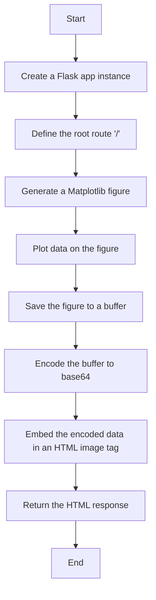

# `matplotlib\galleries\examples\user_interfaces\web_application_server_sgskip.py` 详细设计文档

This code is a Flask web application that generates a simple plot using Matplotlib and embeds it in an HTML image tag. It demonstrates how to create and save a figure without using pyplot, which is recommended for web applications to avoid memory leaks.

## 整体流程



## 类结构

```
FlaskApp (Flask web application)
├── hello (Route handler for '/')
```

## 全局变量及字段


### `app`
    
The Flask application instance that handles the web server.

类型：`Flask`
    


### `FlaskApp.app`
    
The Flask application instance that handles the web server.

类型：`Flask`
    
    

## 全局函数及方法


### hello

The `hello` function generates a simple line plot using Matplotlib and embeds it into an HTML image, which is then returned as the response to a web request.

参数：

-  无参数

返回值：`str`，A string containing an HTML image tag that embeds the generated plot.

#### 流程图


#### 带注释源码

```python
@app.route("/")
def hello():
    # Generate the figure **without using pyplot**.
    fig = Figure()
    ax = fig.subplots()
    ax.plot([1, 2])  # Plot data
    # Save it to a temporary buffer.
    buf = BytesIO()
    fig.savefig(buf, format="png")  # Save figure to buffer
    # Embed the result in the html output.
    data = base64.b64encode(buf.getbuffer()).decode("ascii")  # Encode buffer to base64
    return f""  # Return HTML image tag
```


### hello

The `hello` function generates a simple plot using Matplotlib and embeds it into an HTML image tag, which is then returned as the response to a web request.

参数：

-  无

返回值：`str`，A string containing an HTML image tag that displays the generated plot.

#### 流程图


#### 带注释源码

```python
@app.route("/")
def hello():
    # Generate the figure **without using pyplot**.
    fig = Figure()
    ax = fig.subplots()
    ax.plot([1, 2])
    # Save it to a temporary buffer.
    buf = BytesIO()
    fig.savefig(buf, format="png")
    # Embed the result in the html output.
    data = base64.b64encode(buf.getbuffer()).decode("ascii")
    return f""
```


## 关键组件


### 张量索引与惰性加载

张量索引与惰性加载是指在处理大规模数据时，只对需要的数据进行索引和加载，以减少内存消耗和提高处理速度。

### 反量化支持

反量化支持是指系统对量化操作的反向操作，即从量化后的数据恢复到原始数据，以便进行后续处理。

### 量化策略

量化策略是指对数据进行量化处理的方法，包括量化精度、量化范围等参数的选择，以优化计算效率和存储空间。


## 问题及建议


### 已知问题

-   **内存管理**: 代码中使用了`BytesIO`来保存图像，但没有明确释放`fig`对象。这可能导致内存泄漏，尤其是在高并发环境下。
-   **错误处理**: 代码中没有包含错误处理机制，如果`fig.savefig`失败，可能会导致异常未被捕获和处理。
-   **代码复用**: 代码中直接在`hello`函数中创建和保存图像，这可能导致代码重复，如果需要多次生成图像，则需要复制和修改代码。

### 优化建议

-   **内存管理**: 在保存图像后，应该显式地调用`fig.clear()`来释放图像资源，并最终调用`fig.close()`来关闭图像。
-   **错误处理**: 在`fig.savefig`调用前后添加异常处理，确保在发生错误时能够捕获异常并进行适当的处理。
-   **代码复用**: 将图像生成逻辑封装到一个单独的函数中，这样可以在需要生成图像的地方重用该函数，减少代码重复。
-   **性能优化**: 如果图像生成是性能瓶颈，可以考虑使用异步处理或缓存机制来提高性能。
-   **安全性**: 在将图像嵌入到HTML输出之前，应该对图像数据进行验证，以防止潜在的注入攻击。


## 其它


### 设计目标与约束

- 设计目标：实现一个能够在Web应用服务器（如Flask）中嵌入Matplotlib图形的功能，避免内存泄漏。
- 约束条件：不使用pyplot，直接使用`.Figure`构造函数创建图形，并保存到内存缓冲区。

### 错误处理与异常设计

- 错误处理：捕获并处理可能发生的异常，如文件保存失败、编码错误等。
- 异常设计：定义自定义异常类，以便更清晰地表示和处理特定错误情况。

### 数据流与状态机

- 数据流：用户请求生成图形 -> 服务器处理请求并生成图形 -> 图形保存到内存缓冲区 -> 图形嵌入到HTML输出。
- 状态机：服务器启动 -> 接收请求 -> 处理请求 -> 返回响应 -> 服务器关闭。

### 外部依赖与接口契约

- 外部依赖：Flask框架、Matplotlib库。
- 接口契约：Flask应用接口、Matplotlib图形创建接口。


    