# `matplotlib\galleries\examples\user_interfaces\wxcursor_demo_sgskip.py` 详细设计文档

This code provides a wxPython application that draws a sine wave on a canvas and allows users to interact with it by changing the cursor and displaying coordinates on the status bar.

## 整体流程

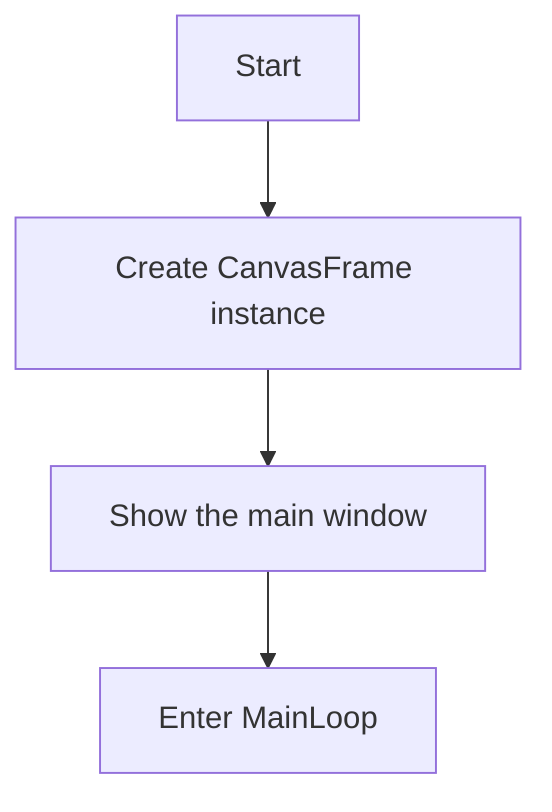

## 类结构

```
CanvasFrame (wx.Frame)
├── figure (matplotlib.figure.Figure)
│   ├── axes (matplotlib.axes.Axes)
│   └── figure_canvas (matplotlib.backends.backend_wxagg.FigureCanvasWxAgg)
├── statusBar (wx.StatusBar)
└── toolbar (matplotlib.backends.backend_wx.NavigationToolbar2Wx)
```

## 全局变量及字段


### `wx`
    
wxPython module for creating GUI applications.

类型：`module`
    


### `np`
    
NumPy module for numerical operations.

类型：`module`
    


### `matplotlib.backends.backend_wx`
    
Module for integrating Matplotlib with wxPython.

类型：`module`
    


### `matplotlib.backends.backend_wxagg`
    
Module for integrating Matplotlib with wxPython using the Agg backend.

类型：`module`
    


### `matplotlib.figure`
    
Module for creating figures in Matplotlib.

类型：`module`
    


### `wx.Frame`
    
wxPython class for creating frames.

类型：`class`
    


### `wx.BoxSizer`
    
wxPython class for creating box sizers.

类型：`class`
    


### `wx.StatusBar`
    
wxPython class for creating status bars.

类型：`class`
    


### `wx.App`
    
wxPython class for creating applications.

类型：`class`
    


### `matplotlib.backends.backend_wx.NavigationToolbar2Wx`
    
wxPython class for creating navigation toolbars for Matplotlib figures.

类型：`class`
    


### `CanvasFrame.figure`
    
Matplotlib figure object.

类型：`matplotlib.figure.Figure`
    


### `CanvasFrame.axes`
    
Matplotlib axes object.

类型：`matplotlib.axes._subplots.AxesSubplot`
    


### `CanvasFrame.figure_canvas`
    
Matplotlib canvas object for wxPython.

类型：`matplotlib.backends.backend_wxagg.FigureCanvasWxAgg`
    


### `CanvasFrame.statusBar`
    
wxPython status bar object.

类型：`wx.StatusBar`
    


### `CanvasFrame.toolbar`
    
Matplotlib navigation toolbar object for wxPython.

类型：`matplotlib.backends.backend_wx.NavigationToolbar2Wx`
    


### `CanvasFrame.sizer`
    
wxPython box sizer object for layout management.

类型：`wx.BoxSizer`
    
    

## 全局函数及方法


### np.arange

`np.arange` 是 NumPy 库中的一个函数，用于生成一个沿指定间隔的数字序列。

参数：

- `start`：`int`，序列的起始值。
- `stop`：`int`，序列的结束值（不包括此值）。
- `step`：`int`，序列中相邻元素之间的间隔，默认为 1。

返回值：`numpy.ndarray`，一个沿指定间隔的数字序列。

#### 流程图

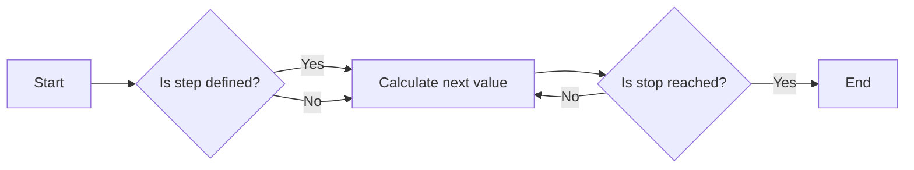

#### 带注释源码

```python
t = np.arange(0.0, 3.0, 0.01)
# t is an array of numbers from 0.0 to 3.0 with a step of 0.01
```


### np.sin

计算输入参数的正弦值。

参数：

- `x`：`numpy.ndarray`，输入的数值数组或标量。

返回值：`numpy.ndarray`，与输入数组相同形状的正弦值数组，或标量。

#### 流程图

```mermaid
graph LR
A[Start] --> B{Is x a numpy.ndarray?}
B -- Yes --> C[Calculate sin(x)]
B -- No --> D{Convert x to numpy.ndarray}
D --> C
C --> E[Return sin(x)]
E --> F[End]
```

#### 带注释源码

```python
import numpy as np

def np_sin(x):
    """
    Calculate the sine of the input value(s).

    Parameters:
    - x: numpy.ndarray, the input value(s) to calculate the sine of.

    Returns:
    - numpy.ndarray: the sine of the input value(s), with the same shape as the input array or a scalar.
    """
    return np.sin(x)
```


### CanvasFrame.ChangeCursor

该函数用于更改画布的鼠标光标为瞄准器。

参数：

- `event`：`wx.MouseEvent`，事件对象，包含鼠标事件的信息。

返回值：无

#### 流程图

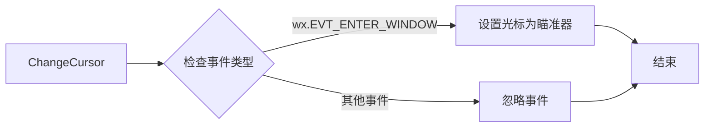

#### 带注释源码

```python
def ChangeCursor(self, event):
    # 检查事件类型，如果是wx.EVT_ENTER_WINDOW，则设置光标为瞄准器
    if event.GetEventName() == 'wx.EVT_ENTER_WINDOW':
        self.figure_canvas.SetCursor(wx.Cursor(wx.CURSOR_BULLSEYE))
```

### CanvasFrame.UpdateStatusBar

该函数用于更新状态栏，显示鼠标在画布上的坐标。

参数：

- `event`：`wx.MouseEvent`，事件对象，包含鼠标事件的信息。

返回值：无

#### 流程图

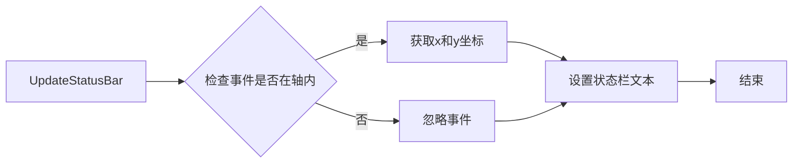

#### 带注释源码

```python
def UpdateStatusBar(self, event):
    # 检查事件是否在轴内
    if event.inaxes:
        # 获取x和y坐标
        x = event.xdata
        y = event.ydata
        # 设置状态栏文本
        self.statusBar.SetStatusText(f"x={x}  y={y}")
```


### wx.BoxSizer

`wx.BoxSizer` 是一个用于wxWidgets框架中的布局管理器，它允许开发者以垂直或水平方式排列窗口组件。

参数：

- `orientation`：`wx.VERTICAL` 或 `wx.HORIZONTAL`，指定布局的方向。

返回值：`wx.BoxSizer` 对象，用于在wxWidgets窗口中排列组件。

#### 流程图

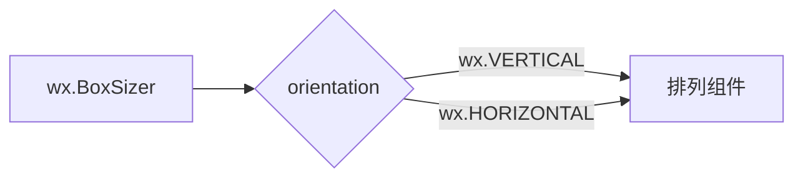

#### 带注释源码

```python
self.sizer = wx.BoxSizer(wx.VERTICAL)
self.sizer.Add(self.figure_canvas, 1, wx.LEFT | wx.TOP | wx.GROW)
```

在这段代码中，`wx.BoxSizer(wx.VERTICAL)` 创建了一个垂直方向的布局管理器。然后，`self.sizer.Add(self.figure_canvas, 1, wx.LEFT | wx.TOP | wx.GROW)` 将 `self.figure_canvas` 组件添加到布局管理器中，并设置了相应的布局参数。


### wx.StatusBar.SetStatusText

该函数用于更新状态栏的文本。

参数：

- `statusText`：`str`，要显示的文本内容。

返回值：`None`，无返回值。

#### 流程图

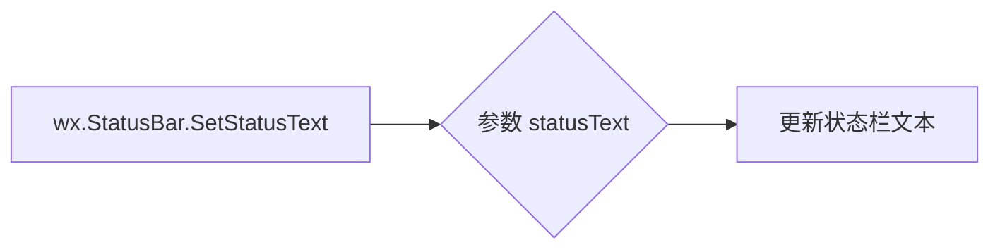

#### 带注释源码

```python
# 在CanvasFrame类中
def UpdateStatusBar(self, event):
    if event.inaxes:
        self.statusBar.SetStatusText(f"x={event.xdata}  y={event.ydata}")
```


### App.OnInit

初始化应用程序，创建主窗口并插入自定义框架。

参数：

- `self`：`App` 类的实例，表示当前应用程序对象。

返回值：`True`，表示初始化成功。

#### 流程图

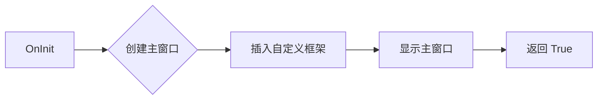

#### 带注释源码

```python
class App(wx.App):
    def OnInit(self):
        """Create the main window and insert the custom frame."""
        frame = CanvasFrame()
        self.SetTopWindow(frame)
        frame.Show(True)
        return True
```


### FigureCanvasWxAgg

`FigureCanvasWxAgg` 是一个类，它继承自 `matplotlib.backends.backend_wxagg.FigureCanvasWxAgg`，用于在 wxPython 应用程序中显示 Matplotlib 图形。

参数：

- `event`：`wx.MouseEvent`，表示鼠标事件。

返回值：无

#### 流程图

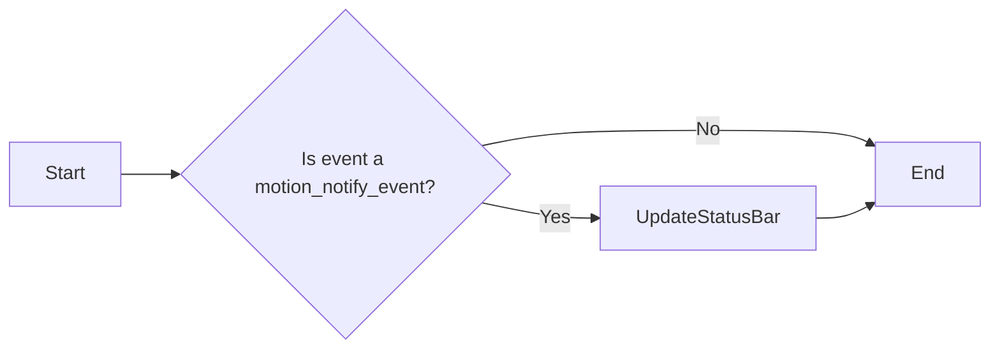

#### 带注释源码

```python
from matplotlib.backends.backend_wx import NavigationToolbar2Wx
from matplotlib.backends.backend_wxagg import FigureCanvasWxAgg as FigureCanvas
from matplotlib.figure import Figure

class CanvasFrame(wx.Frame):
    # ... (其他代码)

    def UpdateStatusBar(self, event):
        if event.inaxes:
            self.statusBar.SetStatusText(f"x={event.xdata}  y={event.ydata}")
```

在这个方法中，`UpdateStatusBar` 被调用时，它会检查传入的事件是否是一个 `motion_notify_event`。如果是，它会更新状态栏以显示鼠标当前位置的 x 和 y 坐标。如果事件不是 `motion_notify_event`，则方法不执行任何操作。


### CanvasFrame.ChangeCursor

该函数用于更改画布上的光标为瞄准器。

参数：

- `event`：`wx.MouseEvent`，事件对象，包含鼠标事件的信息。

返回值：无

#### 流程图


#### 带注释源码

```python
def ChangeCursor(self, event):
    # 检查事件类型，如果是wx.EVT_ENTER_WINDOW，则设置光标为瞄准器
    if event.GetEventName() == 'wx.EVT_ENTER_WINDOW':
        self.figure_canvas.SetCursor(wx.Cursor(wx.CURSOR_BULLSEYE))
    # 其他事件不做处理
```

### CanvasFrame.UpdateStatusBar

该函数用于更新状态栏，显示鼠标在图上的坐标。

参数：

- `event`：`matplotlib.cursors.Event`，事件对象，包含鼠标移动事件的信息。

返回值：无

#### 流程图

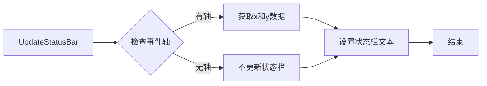

#### 带注释源码

```python
def UpdateStatusBar(self, event):
    # 检查事件轴是否存在
    if event.inaxes:
        # 获取x和y数据
        x_data = event.xdata
        y_data = event.ydata
        # 设置状态栏文本
        self.statusBar.SetStatusText(f"x={x_data}  y={y_data}")
    # 如果没有轴，不更新状态栏
```


### CanvasFrame.ChangeCursor

该函数用于更改matplotlib的FigureCanvas的鼠标光标。

参数：

- `event`：`wx.MouseEvent`，事件对象，包含鼠标事件的信息。

返回值：无

#### 流程图

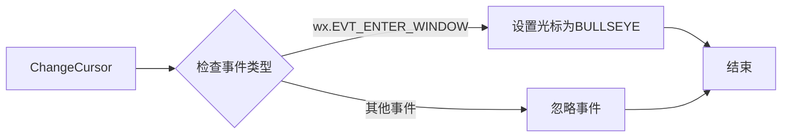

#### 带注释源码

```python
def ChangeCursor(self, event):
    # 检查事件类型
    if event.GetEventType() == wx.EVT_ENTER_WINDOW:
        # 设置光标为BULLSEYE
        self.figure_canvas.SetCursor(wx.Cursor(wx.CURSOR_BULLSEYE))
    # 忽略其他事件
    else:
        pass
```

### CanvasFrame.UpdateStatusBar

该函数用于更新状态栏，显示鼠标在图上的坐标。

参数：

- `event`：`matplotlib.cursors.Event`，事件对象，包含鼠标移动事件的信息。

返回值：无

#### 流程图

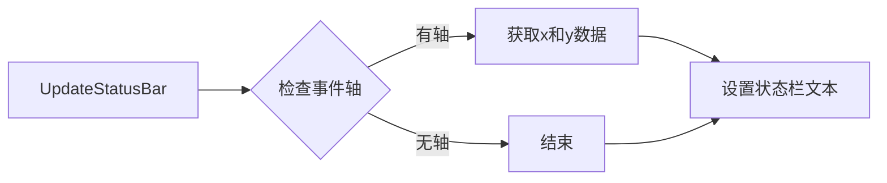

#### 带注释源码

```python
def UpdateStatusBar(self, event):
    # 检查事件轴
    if event.inaxes:
        # 获取x和y数据
        x_data = event.xdata
        y_data = event.ydata
        # 设置状态栏文本
        self.statusBar.SetStatusText(f"x={x_data}  y={y_data}")
    # 无轴，结束
    else:
        pass
```


### NavigationToolbar2Wx

NavigationToolbar2Wx is a class that provides a set of tools for navigating and interacting with a matplotlib figure in a wxPython application.

参数：

- `event`：`wx.MouseEvent`，The event that triggered the method, typically a mouse event.

返回值：`None`，This method does not return a value.

#### 流程图

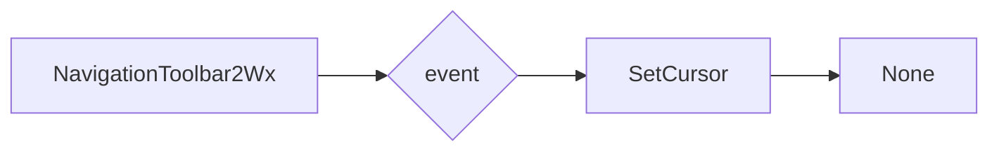

#### 带注释源码

```python
# NavigationToolbar2Wx class from matplotlib.backends.backend_wx
class NavigationToolbar2Wx(wx.ToolBar):
    # ... (Other methods and class details)

    def SetCursor(self, event):
        # Set the cursor to the default cursor
        wx.SetCursor(wx.Cursor(wx.CURSOR_ARROW))

        # Check if the event is a mouse event
        if isinstance(event, wx.MouseEvent):
            # Check if the mouse button is the left button
            if event.GetButton() == wx.MOUSE_BTN_LEFT:
                # Check if the mouse is over the toolbar
                if self.HitTest(event.GetPosition()):
                    # Set the cursor to a hand cursor
                    wx.SetCursor(wx.Cursor(wx.CURSOR_HAND))
```


### CanvasFrame.ChangeCursor

该函数用于更改画布的鼠标光标。

参数：

- `event`：`wx.MouseEvent`，事件对象，包含鼠标事件的相关信息。

返回值：无

#### 流程图


#### 带注释源码

```python
def ChangeCursor(self, event):
    # 检查事件类型
    if event.GetEventType() == wx.EVT_ENTER_WINDOW:
        # 设置光标为BULLSEYE
        self.figure_canvas.SetCursor(wx.Cursor(wx.CURSOR_BULLSEYE))
    # 忽略其他事件
    else:
        pass
```


### ChangeCursor

改变画布上的光标样式。

参数：

- `event`：`wx.MouseEvent`，事件对象，包含鼠标事件的信息。

返回值：无

#### 流程图

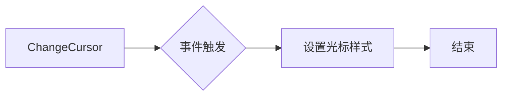

#### 带注释源码

```python
def ChangeCursor(self, event):
    # 设置画布光标样式为BULLSEYE
    self.figure_canvas.SetCursor(wx.Cursor(wx.CURSOR_BULLSEYE))
```


### wx.StatusBar.SetStatusText

设置状态栏的文本。

参数：

- `statusText`：`str`，要显示的文本。
- ...

返回值：`None`，无返回值。

#### 流程图

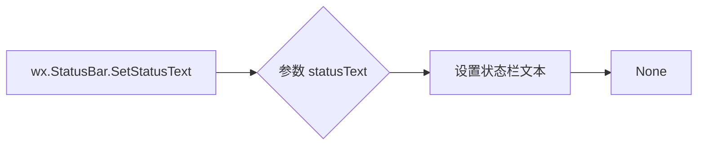

#### 带注释源码

```python
# 在CanvasFrame类中
def UpdateStatusBar(self, event):
    if event.inaxes:
        self.statusBar.SetStatusText(f"x={event.xdata}  y={event.ydata}")
```


### CanvasFrame.ChangeCursor

改变画布上的鼠标光标。

参数：

- `event`：`wx.MouseEvent`，鼠标事件对象，包含鼠标的当前位置和其他相关信息。

返回值：无

#### 流程图


#### 带注释源码

```python
def ChangeCursor(self, event):
    # 检查事件类型，如果是wx.EVT_ENTER_WINDOW，则设置光标为BULLSEYE
    if event.GetEventName() == 'wx.EVT_ENTER_WINDOW':
        self.figure_canvas.SetCursor(wx.Cursor(wx.CURSOR_BULLSEYE))
    # 对于其他事件，忽略
    # ...
```


### wx.MainLoop()

wx.MainLoop() 是 wxPython 库中的一个全局函数，用于启动应用程序的主事件循环。它等待并处理各种事件，如窗口消息、键盘输入、鼠标事件等，直到应用程序被显式关闭。

参数：

- 无

参数描述：wx.MainLoop() 不接受任何参数。

返回值：`None`

返回值描述：wx.MainLoop() 不返回任何值。

#### 流程图

```mermaid
graph LR
A[wx.MainLoop()] --> B{事件处理}
B --> C{事件类型}
C -->|窗口消息| D[处理窗口消息]
C -->|键盘输入| E[处理键盘输入]
C -->|鼠标事件| F[处理鼠标事件]
C -->|其他事件| G[处理其他事件]
D --> B
E --> B
F --> B
G --> B
```

#### 带注释源码

```
if __name__ == '__main__':
    app = App()
    app.MainLoop()  # 启动应用程序的主事件循环
```


### CanvasFrame.__init__

初始化CanvasFrame类，创建一个matplotlib图形界面，并将其嵌入到wxPython框架中。

参数：

- `self`：`CanvasFrame`类的实例，用于访问类的属性和方法。

返回值：无

#### 流程图

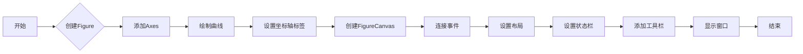

#### 带注释源码

```python
def __init__(self):
    super().__init__(None, -1, 'CanvasFrame', size=(550, 350))

    self.figure = Figure()  # 创建一个Figure对象
    self.axes = self.figure.add_subplot()  # 在Figure中添加一个Axes对象
    t = np.arange(0.0, 3.0, 0.01)  # 创建时间数组
    s = np.sin(2*np.pi*t)  # 创建正弦波数据
    self.axes.plot(t, s)  # 在Axes中绘制曲线
    self.axes.set_xlabel('t')  # 设置x轴标签
    self.axes.set_ylabel('sin(t)')  # 设置y轴标签
    self.figure_canvas = FigureCanvas(self, -1, self.figure)  # 创建FigureCanvas对象

    # Note that event is a MplEvent
    self.figure_canvas.mpl_connect(
        'motion_notify_event', self.UpdateStatusBar)  # 连接事件，更新状态栏
    self.figure_canvas.Bind(wx.EVT_ENTER_WINDOW, self.ChangeCursor)  # 绑定事件，更改光标

    self.sizer = wx.BoxSizer(wx.VERTICAL)  # 创建一个垂直布局
    self.sizer.Add(self.figure_canvas, 1, wx.LEFT | wx.TOP | wx.GROW)  # 将FigureCanvas添加到布局中
    self.SetSizer(self.sizer)  # 设置布局
    self.Fit()  # 调整窗口大小以适应布局

    self.statusBar = wx.StatusBar(self, -1)  # 创建状态栏
    self.SetStatusBar(self.statusBar)  # 设置状态栏

    self.toolbar = NavigationToolbar2Wx(self.figure_canvas)  # 创建工具栏
    self.sizer.Add(self.toolbar, 0, wx.LEFT | wx.EXPAND)  # 将工具栏添加到布局中
    self.toolbar.Show()  # 显示工具栏
```


### CanvasFrame.ChangeCursor

改变画布上的光标样式。

参数：

- `event`：`wx.MouseEvent`，事件对象，包含鼠标事件的相关信息。

返回值：无

#### 流程图

```mermaid
graph LR
A[ChangeCursor] --> B{SetCursor}
B --> C[wx.Cursor(wx.CURSOR_BULLSEYE)]
```

#### 带注释源码

```python
def ChangeCursor(self, event):
    # 设置画布光标为BULLSEYE样式
    self.figure_canvas.SetCursor(wx.Cursor(wx.CURSOR_BULLSEYE))
``` 


### CanvasFrame.UpdateStatusBar

This method updates the status bar of the canvas frame with the x and y coordinates of the cursor position.

参数：

- `event`：`wx.PyCommandEvent`，This is the event that triggered the method. It contains information about the cursor position.

返回值：`None`，This method does not return any value.

#### 流程图

```mermaid
graph LR
A[Start] --> B{Check if event.inaxes is not None}
B -- Yes --> C[Update status bar with x and y data]
C --> D[End]
B -- No --> D
```

#### 带注释源码

```python
def UpdateStatusBar(self, event):
    # Check if the event has an associated axes (i.e., the cursor is within the plot area)
    if event.inaxes:
        # Update the status bar with the x and y coordinates of the cursor position
        self.statusBar.SetStatusText(f"x={event.xdata}  y={event.ydata}")
``` 


### App.OnInit

初始化应用程序，创建主窗口并显示。

参数：

- 无

返回值：`bool`，表示初始化是否成功

#### 流程图

```mermaid
graph LR
A[OnInit] --> B{创建主窗口}
B --> C{显示主窗口}
C --> D{返回True}
```

#### 带注释源码

```python
class App(wx.App):
    def OnInit(self):
        """Create the main window and insert the custom frame."""
        frame = CanvasFrame()
        self.SetTopWindow(frame)
        frame.Show(True)
        return True
``` 


## 关键组件


### 张量索引与惰性加载

用于在matplotlib的CanvasFrame类中处理和显示数据点的坐标，通过事件触发更新状态栏。

### 反量化支持

在CanvasFrame类中，通过matplotlib的绘图功能实现数据的可视化，没有直接的反量化支持描述。

### 量化策略

在CanvasFrame类中，通过numpy生成和处理数据，没有特定的量化策略描述。


## 问题及建议


### 已知问题

-   **全局变量和函数缺失**：代码中没有使用全局变量或全局函数，但考虑到代码结构，可能存在潜在的全局变量或函数使用，但没有在代码中明确声明。
-   **异常处理**：代码中没有异常处理机制，如果发生错误（如绘图错误或窗口创建错误），程序可能会崩溃。
-   **代码复用性**：`CanvasFrame` 类中的 `ChangeCursor` 和 `UpdateStatusBar` 方法可能在其他类似的应用中复用，但它们被封装在特定的类中，降低了代码的通用性。

### 优化建议

-   **引入异常处理**：在关键操作（如窗口创建、绘图操作）中添加异常处理，确保程序在出现错误时能够优雅地处理异常。
-   **增加代码复用性**：将 `ChangeCursor` 和 `UpdateStatusBar` 方法提取为独立的函数或类，以便在其他项目中复用。
-   **代码注释**：增加代码注释，特别是对于复杂逻辑或非直观的操作，以提高代码的可读性和可维护性。
-   **性能优化**：如果绘图操作或事件处理非常频繁，可以考虑使用更高效的数据结构或算法来优化性能。
-   **用户界面一致性**：确保用户界面元素（如状态栏和工具栏）在不同操作系统和不同版本的 wxPython 中保持一致性和兼容性。


## 其它


### 设计目标与约束

- 设计目标：实现一个基于wxPython的绘图界面，能够绘制正弦曲线，并在鼠标移动时显示坐标信息。
- 约束条件：使用wxPython库进行GUI开发，利用matplotlib进行绘图。

### 错误处理与异常设计

- 错误处理：在代码中未发现明显的错误处理机制，但应考虑添加异常处理来捕获并处理可能出现的错误，例如绘图时数据格式错误等。
- 异常设计：应设计合理的异常类，以便于在发生错误时能够提供清晰的错误信息。

### 数据流与状态机

- 数据流：用户通过鼠标移动触发事件，事件处理函数`UpdateStatusBar`更新状态栏显示坐标信息。
- 状态机：当前代码中未涉及复杂的状态机设计，主要状态为绘图和显示坐标信息。

### 外部依赖与接口契约

- 外部依赖：代码依赖于wxPython和matplotlib库。
- 接口契约：`CanvasFrame`类提供了绘图和显示坐标信息的接口，`App`类负责创建并运行应用程序。


    