# `matplotlib\galleries\examples\widgets\annotated_cursor.py` 详细设计文档

The code implements an annotated cursor for matplotlib plots, displaying the current coordinates of the plot point closest to the mouse pointer.

## 整体流程

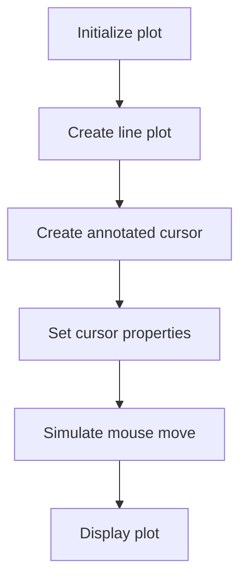

## 类结构

```
AnnotatedCursor (继承自 Cursor 类)
├── Cursor (matplotlib.widgets 类)
```

## 全局变量及字段


### `fig`
    
The main figure object where the plot is drawn.

类型：`matplotlib.figure.Figure`
    


### `ax`
    
The axes object where the plot is drawn.

类型：`matplotlib.axes._subplots.AxesSubplot`
    


### `x`
    
The x data points of the plot.

类型：`numpy.ndarray`
    


### `y`
    
The y data points of the plot.

类型：`numpy.ndarray`
    


### `line`
    
The line object representing the plot.

类型：`matplotlib.lines.Line2D`
    


### `cursor`
    
The annotated cursor widget that displays the current coordinates on the plot.

类型：`AnnotatedCursor`
    


### `AnnotatedCursor.line`
    
The line object from which the data coordinates are displayed.

类型：`matplotlib.lines.Line2D`
    


### `AnnotatedCursor.numberformat`
    
The format string used to create the displayed text.

类型：`str`
    


### `AnnotatedCursor.offset`
    
The offset in display coordinates of the text position relative to the cross-hair.

类型：`tuple`
    


### `AnnotatedCursor.dataaxis`
    
The axis in which the cursor position is looked up ('x' or 'y').

类型：`str`
    


### `AnnotatedCursor.textprops`
    
The properties of the rendered text object.

类型：`dict`
    


### `AnnotatedCursor.ax`
    
The axes object where the cursor is drawn.

类型：`matplotlib.axes._subplots.AxesSubplot`
    


### `AnnotatedCursor.useblit`
    
Whether to use blitting for rendering the cursor.

类型：`bool`
    


### `AnnotatedCursor.color`
    
The color of the cursor lines.

类型：`str`
    


### `AnnotatedCursor.linewidth`
    
The linewidth of the cursor lines.

类型：`float`
    


### `AnnotatedCursor.text`
    
The text object that displays the current coordinates.

类型：`matplotlib.text.Text`
    


### `AnnotatedCursor.lastdrawnplotpoint`
    
The last drawn plot point coordinates.

类型：`tuple`
    
    

## 全局函数及方法

### np.linspace

#### 描述

`np.linspace` 函数用于生成一个线性间隔的数字序列。它从指定的起始值开始，以指定的步长生成等间隔的数字，直到达到指定的结束值。

#### 参数

- `start`：`float`，序列的起始值。
- `stop`：`float`，序列的结束值。
- `num`：`int`，序列中数字的数量（不包括结束值）。
- `dtype`：`dtype`，可选，序列中数字的数据类型。
- `endpoint`：`bool`，可选，是否包含结束值。

#### 返回值

- `array`：`ndarray`，包含线性间隔数字的数组。

#### 流程图

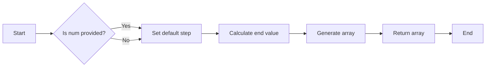

#### 带注释源码

```python
def linspace(start, stop, num=50, dtype=None, endpoint=True):
    """
    Generate linearly spaced numbers over a specified interval.

    Parameters
    ----------
    start : float
        The starting value of the sequence.
    stop : float
        The end value of the sequence, not included in the output.
    num : int, optional
        The number of samples to generate. Default is 50.
    dtype : dtype, optional
        The data type of the output array. Default is None.
    endpoint : bool, optional
        If True, the stop value is included in the sequence. Default is True.

    Returns
    -------
    array : ndarray
        An array of linearly spaced numbers.

    """
    if dtype is None:
        dtype = np.float64

    if endpoint:
        stop += 1.0

    step = (stop - start) / (num - 1)

    return np.arange(start, stop, step, dtype=dtype)
```

### plt.subplots

#### 描述

`plt.subplots` 是 Matplotlib 库中的一个函数，用于创建一个图形和一个轴（Axes）对象。它允许用户自定义图形的大小、子图的数量和布局。

#### 参数

- `figsize`：一个元组，指定图形的大小（宽度和高度），单位为英寸。
- `ncols`：子图的数量（列数），默认为 1。
- `nrows`：子图的数量（行数），默认为 1。
- `sharex`：布尔值，指示是否共享所有子图的 x 轴。
- `sharey`：布尔值，指示是否共享所有子图的 y 轴。
- `fig`：可选的图形对象，如果提供，则在该图形中创建子图。
- `gridspec_kw`：字典，用于指定 GridSpec 的关键字参数。

#### 返回值

- `fig`：图形对象。
- `axes`：一个轴（Axes）对象的数组，每个轴对应一个子图。

#### 流程图

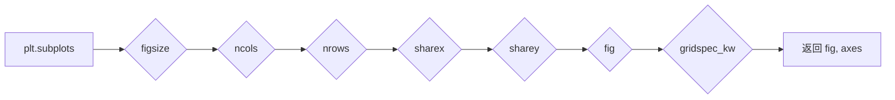

#### 带注释源码

```python
import matplotlib.pyplot as plt

fig, ax = plt.subplots(figsize=(8, 6))
```


### fig

#### 描述

`fig` 是 Matplotlib 库中的一个图形对象，它代表了一个图形窗口。图形对象包含一个或多个轴（Axes）对象，每个轴可以绘制一个或多个图表。

#### 参数

- 无

#### 返回值

- `fig`：图形对象。

#### 流程图

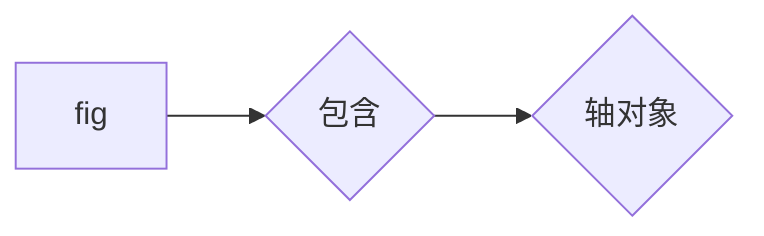

#### 带注释源码

```python
import matplotlib.pyplot as plt

fig, ax = plt.subplots(figsize=(8, 6))
```


### ax

#### 描述

`ax` 是 Matplotlib 库中的一个轴（Axes）对象，它是图形对象的一部分。轴对象负责绘制图表，包括坐标轴、标题、标签等。

#### 参数

- 无

#### 返回值

- `ax`：轴对象。

#### 流程图

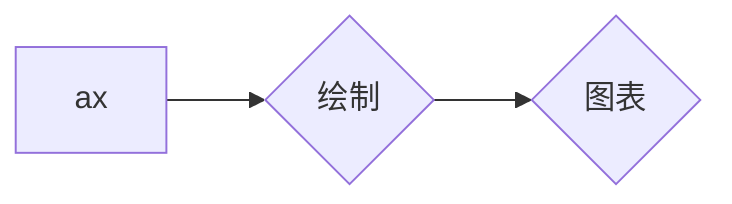

#### 带注释源码

```python
import matplotlib.pyplot as plt

fig, ax = plt.subplots(figsize=(8, 6))
ax.plot([1, 2, 3], [1, 4, 9])
```

### AnnotatedCursor.onmove

AnnotatedCursor.onmove is a method of the AnnotatedCursor class that handles the movement of the cursor when the mouse is moved over the plot.

参数：

- `event`：`matplotlib.backend_bases.MouseEvent`，The event object containing information about the mouse movement.

返回值：无

#### 流程图

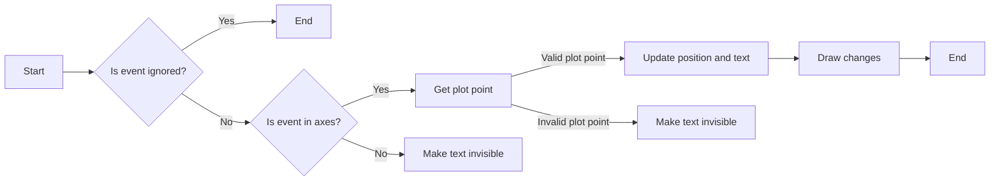

#### 带注释源码

```python
def onmove(self, event):
    """
    Overridden draw callback for cursor. Called when moving the mouse.
    """
    # Leave method under the same conditions as in overridden method
    if self.ignore(event):
        self.lastdrawnplotpoint = None
        return
    if not self.canvas.widgetlock.available(self):
        self.lastdrawnplotpoint = None
        return

    # If the mouse left drawable area, we now make the text invisible.
    # Baseclass will redraw complete canvas after, which makes both text
    # and cursor disappear.
    if event.inaxes != self.ax:
        self.lastdrawnplotpoint = None
        self.text.set_visible(False)
        super().onmove(event)
        return

    # Get the coordinates, which should be displayed as text,
    # if the event coordinates are valid.
    plotpoint = None
    if event.xdata is not None and event.ydata is not None:
        # Get plot point related to current x position.
        # These coordinates are displayed in text.
        plotpoint = self.set_position(event.xdata, event.ydata)
        # Modify event, such that the cursor is displayed on the
        # plotted line, not at the mouse pointer,
        # if the returned plot point is valid
        if plotpoint is not None:
            event.xdata = plotpoint[0]
            event.ydata = plotpoint[1]

    # If the plotpoint is given, compare to last drawn plotpoint and
    # return if they are the same.
    # Skip even the call of the base class, because this would restore the
    # background, draw the cursor lines and would leave us the job to
    # re-draw the text.
    if plotpoint is not None and plotpoint == self.lastdrawnplotpoint:
        return

    # Baseclass redraws canvas and cursor. Due to blitting,
    # the added text is removed in this call, because the
    # background is redrawn.
    super().onmove(event)

    # Check if the display of text is still necessary.
    # If not, just return.
    # This behaviour is also cloned from the base class.
    if not self.get_active() or not self.visible:
        return

    # Draw the widget, if event coordinates are valid.
    if plotpoint is not None:
        # Update position and displayed text.
        # Position: Where the event occurred.
        # Text: Determined by set_position() method earlier
        # Position is transformed to pixel coordinates,
        # an offset is added there and this is transformed back.
        temp = [event.xdata, event.ydata]
        temp = self.ax.transData.transform(temp)
        temp = temp + self.offset
        temp = self.ax.transData.inverted().transform(temp)
        self.text.set_position(temp)
        self.text.set_text(self.numberformat.format(*plotpoint))
        self.text.set_visible(self.visible)

        # Tell base class, that we have drawn something.
        # Baseclass needs to know, that it needs to restore a clean
        # background, if the cursor leaves our figure context.
        self.needclear = True

        # Remember the recently drawn cursor position, so events for the
        # same position (mouse moves slightly between two plot points)
        # can be skipped
        self.lastdrawnplotpoint = plotpoint
    # otherwise, make text invisible
    else:
        self.text.set_visible(False)

    # Draw changes. Cannot use _update method of base class,
    # because it would first restore the background, which
    # is done already and is not necessary.
    if self.useblit:
        self.ax.draw_artist(self.text)
        self.canvas.blit(self.ax.bbox)
    else:
        # If blitting is deactivated, the overridden _update call made
        # by the base class immediately returned.
        # We still have to draw the changes.
        self.canvas.draw_idle()
```

### ax.set_xlim

#### 描述

`ax.set_xlim` 方法用于设置轴的 x 轴限制，即 x 轴的最小值和最大值。

#### 参数

- `ax`: `matplotlib.axes.Axes` 对象，表示要设置限制的轴。
- `xlim`: 一个包含两个元素的元组或列表，指定 x 轴的最小值和最大值。

#### 返回值

无返回值。

#### 流程图

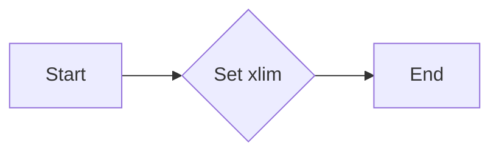

#### 带注释源码

```python
def set_xlim(self, xlim):
    """
    Set the x-axis limits.

    Parameters
    ----------
    xlim : tuple or list of two floats
        The new limits for the x-axis.

    Returns
    -------
    None
    """
    self._xlim = xlim
    self._update_view()
```


### ax.set_xlim

#### 描述

`ax.set_xlim` 方法用于设置轴的 x 轴限制，即 x 轴的最小值和最大值。

#### 参数

- `ax`: `matplotlib.axes.Axes` 对象，表示要设置限制的轴。
- `xlim`: 一个包含两个元素的元组或列表，指定 x 轴的最小值和最大值。

#### 返回值

无返回值。

#### 流程图


#### 带注释源码

```python
def set_xlim(self, xlim):
    """
    Set the x-axis limits.

    Parameters
    ----------
    xlim : tuple or list of two floats
        The new limits for the x-axis.

    Returns
    -------
    None
    """
    self._xlim = xlim
    self._update_view()
```


### `AnnotatedCursor.set_position`

**描述**

`set_position` 方法用于查找并返回与给定坐标相对应的绘图坐标。该方法的行为取决于 `dataaxis` 属性，它决定了在哪个轴上查找哪个游标坐标。

**参数**

- `xpos`：`float`，游标在数据坐标中的当前 x 位置。如果 `dataaxis` 设置为 'x'，则重要。
- `ypos`：`float`，游标在数据坐标中的当前 y 位置。如果 `dataaxis` 设置为 'y'，则重要。

**返回值**

- `ret`：`{2D array-like, None}`，应显示的坐标。`None` 是默认值。

#### 流程图

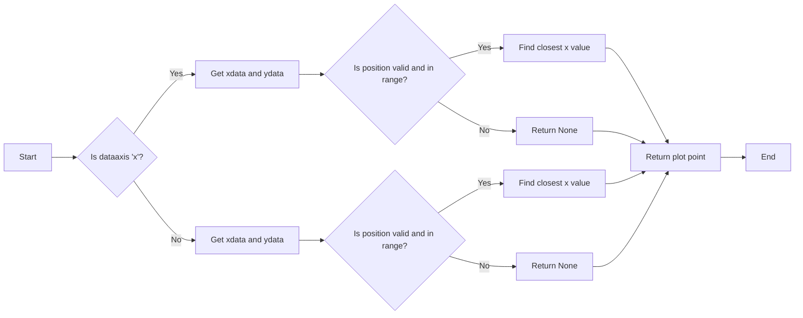

#### 带注释源码

```python
def set_position(self, xpos, ypos):
    """
    Finds the coordinates, which have to be shown in text.

    The behaviour depends on the *dataaxis* attribute. Function looks
    up the matching plot coordinate for the given mouse position.

    Parameters
    ----------
    xpos : float
        The current x position of the cursor in data coordinates.
        Important if *dataaxis* is set to 'x'.
    ypos : float
        The current y position of the cursor in data coordinates.
        Important if *dataaxis* is set to 'y'.

    Returns
    -------
    ret : {2D array-like, None}
        The coordinates which should be displayed.
        *None* is the fallback value.
    """

    # Get plot line data
    xdata = self.line.get_xdata()
    ydata = self.line.get_ydata()

    # The dataaxis attribute decides, in which axis we look up which cursor
    # coordinate.
    if self.dataaxis == 'x':
        pos = xpos
        data = xdata
        lim = self.ax.get_xlim()
    elif self.dataaxis == 'y':
        pos = ypos
        data = ydata
        lim = self.ax.get_ylim()
    else:
        raise ValueError(f"The data axis specifier {self.dataaxis} should "
                         f"be 'x' or 'y'")

    # If position is valid and in valid plot data range.
    if pos is not None and lim[0] <= pos <= lim[-1]:
        # Find closest x value in sorted x vector.
        # This requires the plotted data to be sorted.
        index = np.searchsorted(data, pos)
        # Return none, if this index is out of range.
        if index < 0 or index >= len(data):
            return None
        # Return plot point as tuple.
        return (xdata[index], ydata[index])

    # Return none if there is no good related point for this x position.
    return None
```

### AnnotatedCursor.onmove

This method is an overridden draw callback for the cursor. It is called when the mouse is moved.

参数：

- `event`：`matplotlib.backend_bases.MouseEvent`，The mouse event object.

返回值：无

#### 流程图

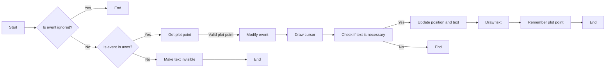

#### 带注释源码

```python
def onmove(self, event):
    """
    Overridden draw callback for cursor. Called when moving the mouse.
    """
    # Leave method under the same conditions as in overridden method
    if self.ignore(event):
        self.lastdrawnplotpoint = None
        return
    if not self.canvas.widgetlock.available(self):
        self.lastdrawnplotpoint = None
        return

    # If the mouse left drawable area, we now make the text invisible.
    # Baseclass will redraw complete canvas after, which makes both text
    # and cursor disappear.
    if event.inaxes != self.ax:
        self.lastdrawnplotpoint = None
        self.text.set_visible(False)
        super().onmove(event)
        return

    # Get the coordinates, which should be displayed as text,
    # if the event coordinates are valid.
    plotpoint = None
    if event.xdata is not None and event.ydata is not None:
        # Get plot point related to current x position.
        # These coordinates are displayed in text.
        plotpoint = self.set_position(event.xdata, event.ydata)
        # Modify event, such that the cursor is displayed on the
        # plotted line, not at the mouse pointer,
        # if the returned plot point is valid
        if plotpoint is not None:
            event.xdata = plotpoint[0]
            event.ydata = plotpoint[1]

    # If the plotpoint is given, compare to last drawn plotpoint and
    # return if they are the same.
    # Skip even the call of the base class, because this would restore the
    # background, draw the cursor lines and would leave us the job to
    # re-draw the text.
    if plotpoint is not None and plotpoint == self.lastdrawnplotpoint:
        return

    # Baseclass redraws canvas and cursor. Due to blitting,
    # the added text is removed in this call, because the
    # background is redrawn.
    super().onmove(event)

    # Check if the display of text is still necessary.
    # If not, just return.
    # This behaviour is also cloned from the base class.
    if not self.get_active() or not self.visible:
        return

    # Draw the widget, if event coordinates are valid.
    if plotpoint is not None:
        # Update position and displayed text.
        # Position: Where the event occurred.
        # Text: Determined by set_position() method earlier
        # Position is transformed to pixel coordinates,
        # an offset is added there and this is transformed back.
        temp = [event.xdata, event.ydata]
        temp = self.ax.transData.transform(temp)
        temp = temp + self.offset
        temp = self.ax.transData.inverted().transform(temp)
        self.text.set_position(temp)
        self.text.set_text(self.numberformat.format(*plotpoint))
        self.text.set_visible(self.visible)

        # Tell base class, that we have drawn something.
        # Baseclass needs to know, that it needs to restore a clean
        # background, if the cursor leaves our figure context.
        self.needclear = True

        # Remember the recently drawn cursor position, so events for the
        # same position (mouse moves slightly between two plot points)
        # can be skipped
        self.lastdrawnplotpoint = plotpoint
    # otherwise, make text invisible
    else:
        self.text.set_visible(False)

    # Draw changes. Cannot use _update method of base class,
    # because it would first restore the background, which
    # is done already and is not necessary.
    if self.useblit:
        self.ax.draw_artist(self.text)
        self.canvas.blit(self.ax.bbox)
    else:
        # If blitting is deactivated, the overridden _update call made
        # by the base class immediately returned.
        # We still have to draw the changes.
        self.canvas.draw_idle()
```

### `AnnotatedCursor.onmove`

**描述**

`onmove` 方法是 `AnnotatedCursor` 类的一个方法，它被调用以响应鼠标移动事件。该方法负责更新文本显示，以显示鼠标指针附近的当前坐标。

**参数**

- `event`：`matplotlib.backend_bases.MouseEvent`，表示鼠标移动事件。

**返回值**

- 无

#### 流程图

```mermaid
graph LR
A[开始] --> B{事件类型为 "motion_notify_event"?}
B -- 是 --> C[获取鼠标位置]
B -- 否 --> D[忽略事件]
C --> E{坐标有效?}
E -- 是 --> F[查找匹配的坐标点]
E -- 否 --> G[设置文本为 "0, 0"]
F --> H[坐标点与上次相同?]
H -- 是 --> I[返回]
H -- 否 --> J[更新文本和位置]
J --> K[绘制文本]
K --> L[结束]
D --> M[结束]
```

#### 带注释源码

```python
def onmove(self, event):
    """
    Overridden draw callback for cursor. Called when moving the mouse.
    """
    # Leave method under the same conditions as in overridden method
    if self.ignore(event):
        self.lastdrawnplotpoint = None
        return
    if not self.canvas.widgetlock.available(self):
        self.lastdrawnplotpoint = None
        return

    # If the mouse left drawable area, we now make the text invisible.
    # Baseclass will redraw complete canvas after, which makes both text
    # and cursor disappear.
    if event.inaxes != self.ax:
        self.lastdrawnplotpoint = None
        self.text.set_visible(False)
        super().onmove(event)
        return

    # Get the coordinates, which should be displayed as text,
    # if the event coordinates are valid.
    plotpoint = None
    if event.xdata is not None and event.ydata is not None:
        # Get plot point related to current x position.
        # These coordinates are displayed in text.
        plotpoint = self.set_position(event.xdata, event.ydata)
        # Modify event, such that the cursor is displayed on the
        # plotted line, not at the mouse pointer,
        # if the returned plot point is valid
        if plotpoint is not None:
            event.xdata = plotpoint[0]
            event.ydata = plotpoint[1]

    # If the plotpoint is given, compare to last drawn plotpoint and
    # return if they are the same.
    # Skip even the call of the base class, because this would restore the
    # background, draw the cursor lines and would leave us the job to
    # re-draw the text.
    if plotpoint is not None and plotpoint == self.lastdrawnplotpoint:
        return

    # Baseclass redraws canvas and cursor. Due to blitting,
    # the added text is removed in this call, because the
    # background is redrawn.
    super().onmove(event)

    # Check if the display of text is still necessary.
    # If not, just return.
    # This behaviour is also cloned from the base class.
    if not self.get_active() or not self.visible:
        return

    # Draw the widget, if event coordinates are valid.
    if plotpoint is not None:
        # Update position and displayed text.
        # Position: Where the event occurred.
        # Text: Determined by set_position() method earlier
        # Position is transformed to pixel coordinates,
        # an offset is added there and this is transformed back.
        temp = [event.xdata, event.ydata]
        temp = self.ax.transData.transform(temp)
        temp = temp + self.offset
        temp = self.ax.transData.inverted().transform(temp)
        self.text.set_position(temp)
        self.text.set_text(self.numberformat.format(*plotpoint))
        self.text.set_visible(self.visible)

        # Tell base class, that we have drawn something.
        # Baseclass needs to know, that it needs to restore a clean
        # background, if the cursor leaves our figure context.
        self.needclear = True

        # Remember the recently drawn cursor position, so events for the
        # same position (mouse moves slightly between two plot points)
        # can be skipped
        self.lastdrawnplotpoint = plotpoint
    # otherwise, make text invisible
    else:
        self.text.set_visible(False)

    # Draw changes. Cannot use _update method of baseclass,
    # because it would first restore the background, which
    # is done already and is not necessary.
    if self.useblit:
        self.ax.draw_artist(self.text)
        self.canvas.blit(self.ax.bbox)
    else:
        # If blitting is deactivated, the overridden _update call made
        # by the base class immediately returned.
        # We still have to draw the changes.
        self.canvas.draw_idle()
```

### plt.show()

#### 描述

`plt.show()` 是 Matplotlib 库中的一个全局函数，用于显示当前图形窗口。它将所有之前绘制的图形和图表显示出来，并保持窗口打开，直到用户关闭它。

#### 参数

- 无

#### 返回值

- 无

#### 流程图

```mermaid
graph LR
A[plt.show()] --> B{显示图形}
B --> C[用户交互]
C --> B
```

#### 带注释源码

```python
plt.show()  # 显示当前图形窗口
```


### AnnotatedCursor.__init__

This method initializes an instance of the `AnnotatedCursor` class, which is a subclass of `matplotlib.widgets.Cursor`. It sets up the cursor with specific properties and integrates it with the given line plot.

参数：

- `line`：`matplotlib.lines.Line2D`，The plot line from which the data coordinates are displayed.
- `numberformat`：`python format string`，The format string used to create the displayed text with the two coordinates.
- `offset`：`(float, float)`，The offset in display (pixel) coordinates of the text position relative to the cross-hair.
- `dataaxis`：`{"x", "y"}`，The axis in which the cursor position is looked up.
- `textprops`：`matplotlib.text` properties as dictionary，Specifies the appearance of the rendered text object.
- `**cursorargs`：`matplotlib.widgets.Cursor` properties，Arguments passed to the internal `~matplotlib.widgets.Cursor` instance.

返回值：无

#### 流程图

```mermaid
graph LR
A[Start] --> B{Initialize AnnotatedCursor}
B --> C[Set line]
C --> D[Set numberformat]
D --> E[Set offset]
E --> F[Set dataaxis]
F --> G[Set textprops]
G --> H[Set cursorargs]
H --> I[Call super().__init__]
I --> J[Create invisible animated text]
J --> K[Set default position]
K --> L[End]
```

#### 带注释源码

```python
def __init__(self, line, numberformat="{0:.4g};{1:.4g}", offset=(5, 5),
             dataaxis='x', textprops=None, **cursorargs):
    if textprops is None:
        textprops = {}
    # The line object, for which the coordinates are displayed
    self.line = line
    # The format string, on which .format() is called for creating the text
    self.numberformat = numberformat
    # Text position offset
    self.offset = np.array(offset)
    # The axis in which the cursor position is looked up
    self.dataaxis = dataaxis

    # First call baseclass constructor.
    # Draws cursor and remembers background for blitting.
    # Saves ax as class attribute.
    super().__init__(**cursorargs)

    # Default value for position of text.
    self.set_position(self.line.get_xdata()[0], self.line.get_ydata()[0])
    # Create invisible animated text
    self.text = self.ax.text(
        self.ax.get_xbound()[0],
        self.ax.get_ybound()[0],
        "0, 0",
        animated=bool(self.useblit),
        visible=False, **textprops)
    # The position at which the cursor was last drawn
    self.lastdrawnplotpoint = None
```


### AnnotatedCursor.onmove

This method is an overridden draw callback for the cursor. It is called when the mouse is moved and handles the logic for updating the cursor position and text display.

参数：

- `event`：`matplotlib.backend_bases.MouseEvent`，The mouse event object that triggered the method.

返回值：`None`，This method does not return a value.

#### 流程图

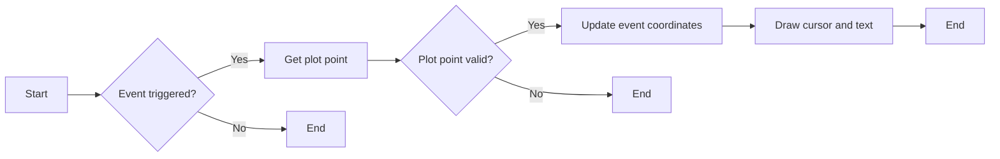

#### 带注释源码

```python
def onmove(self, event):
    """
    Overridden draw callback for cursor. Called when moving the mouse.
    """

    # Leave method under the same conditions as in overridden method
    if self.ignore(event):
        self.lastdrawnplotpoint = None
        return
    if not self.canvas.widgetlock.available(self):
        self.lastdrawnplotpoint = None
        return

    # If the mouse left drawable area, we now make the text invisible.
    # Baseclass will redraw complete canvas after, which makes both text
    # and cursor disappear.
    if event.inaxes != self.ax:
        self.lastdrawnplotpoint = None
        self.text.set_visible(False)
        super().onmove(event)
        return

    # Get the coordinates, which should be displayed as text,
    # if the event coordinates are valid.
    plotpoint = None
    if event.xdata is not None and event.ydata is not None:
        # Get plot point related to current x position.
        # These coordinates are displayed in text.
        plotpoint = self.set_position(event.xdata, event.ydata)
        # Modify event, such that the cursor is displayed on the
        # plotted line, not at the mouse pointer,
        # if the returned plot point is valid
        if plotpoint is not None:
            event.xdata = plotpoint[0]
            event.ydata = plotpoint[1]

    # If the plotpoint is given, compare to last drawn plotpoint and
    # return if they are the same.
    # Skip even the call of the base class, because this would restore the
    # background, draw the cursor lines and would leave us the job to
    # re-draw the text.
    if plotpoint is not None and plotpoint == self.lastdrawnplotpoint:
        return

    # Baseclass redraws canvas and cursor. Due to blitting,
    # the added text is removed in this call, because the
    # background is redrawn.
    super().onmove(event)

    # Check if the display of text is still necessary.
    # If not, just return.
    # This behaviour is also cloned from the base class.
    if not self.get_active() or not self.visible:
        return

    # Draw the widget, if event coordinates are valid.
    if plotpoint is not None:
        # Update position and displayed text.
        # Position: Where the event occurred.
        # Text: Determined by set_position() method earlier
        # Position is transformed to pixel coordinates,
        # an offset is added there and this is transformed back.
        temp = [event.xdata, event.ydata]
        temp = self.ax.transData.transform(temp)
        temp = temp + self.offset
        temp = self.ax.transData.inverted().transform(temp)
        self.text.set_position(temp)
        self.text.set_text(self.numberformat.format(*plotpoint))
        self.text.set_visible(self.visible)

        # Tell base class, that we have drawn something.
        # Baseclass needs to know, that it needs to restore a clean
        # background, if the cursor leaves our figure context.
        self.needclear = True

        # Remember the recently drawn cursor position, so events for the
        # same position (mouse moves slightly between two plot points)
        # can be skipped
        self.lastdrawnplotpoint = plotpoint
    # otherwise, make text invisible
    else:
        self.text.set_visible(False)

    # Draw changes. Cannot use _update method of base class,
    # because it would first restore the background, which
    # is done already and is not necessary.
    if self.useblit:
        self.ax.draw_artist(self.text)
        self.canvas.blit(self.ax.bbox)
    else:
        # If blitting is deactivated, the overridden _update call made
        # by the base class immediately returned.
        # We still have to draw the changes.
        self.canvas.draw_idle()
``` 


### AnnotatedCursor.set_position

该函数用于查找并返回与给定数据坐标相对应的绘图坐标。

参数：

- `xpos`：`float`，当前光标在数据坐标中的x位置。如果`dataaxis`设置为`x`，则重要。
- `ypos`：`float`，当前光标在数据坐标中的y位置。如果`dataaxis`设置为`y`，则重要。

返回值：`{2D array-like, None}`，要显示的坐标。如果没有找到相关点，则返回`None`。

#### 流程图

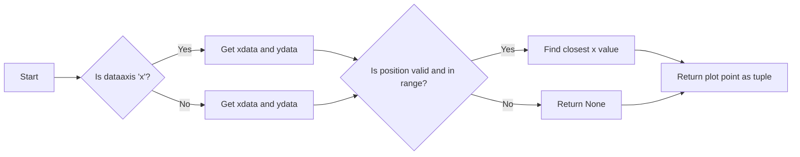

#### 带注释源码

```python
def set_position(self, xpos, ypos):
    """
    Finds the coordinates, which have to be shown in text.

    The behaviour depends on the *dataaxis* attribute. Function looks
    up the matching plot coordinate for the given mouse position.

    Parameters
    ----------
    xpos : float
        The current x position of the cursor in data coordinates.
        Important if *dataaxis* is set to 'x'.
    ypos : float
        The current y position of the cursor in data coordinates.
        Important if *dataaxis* is set to 'y'.

    Returns
    -------
    ret : {2D array-like, None}
        The coordinates which should be displayed.
        *None* is the fallback value.
    """

    # Get plot line data
    xdata = self.line.get_xdata()
    ydata = self.line.get_ydata()

    # The dataaxis attribute decides, in which axis we look up which cursor
    # coordinate.
    if self.dataaxis == 'x':
        pos = xpos
        data = xdata
        lim = self.ax.get_xlim()
    elif self.dataaxis == 'y':
        pos = ypos
        data = ydata
        lim = self.ax.get_ylim()
    else:
        raise ValueError(f"The data axis specifier {self.dataaxis} should "
                         f"be 'x' or 'y'")

    # If position is valid and in valid plot data range.
    if pos is not None and lim[0] <= pos <= lim[-1]:
        # Find closest x value in sorted x vector.
        # This requires the plotted data to be sorted.
        index = np.searchsorted(data, pos)
        # Return none, if this index is out of range.
        if index < 0 or index >= len(data):
            return None
        # Return plot point as tuple.
        return (xdata[index], ydata[index])

    # Return none if there is no good related point for this x position.
    return None
```


### AnnotatedCursor.clear

This method clears the cursor and text from the display.

参数：

- `event`：`MouseEvent`，The mouse event that triggered the clear operation.

返回值：`None`，No return value.

#### 流程图

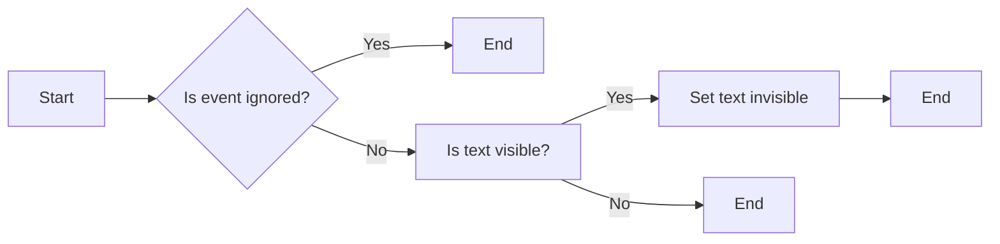

#### 带注释源码

```python
def clear(self, event):
    """
    Overridden clear callback for cursor, called before drawing the figure.
    """

    # The base class saves the clean background for blitting.
    # Text and cursor are invisible,
    # until the first mouse move event occurs.
    super().clear(event)
    if self.ignore(event):
        return
    self.text.set_visible(False)
```


### AnnotatedCursor._update

#### 描述

`_update` 方法是 `AnnotatedCursor` 类的一个私有方法，它被用来更新绘图元素，例如文本和光标，以反映当前的状态。如果启用了位图块（blitting），则此方法将调用基类 `Cursor` 的 `_update` 方法。

#### 参数

- 无

#### 返回值

- 无

#### 流程图

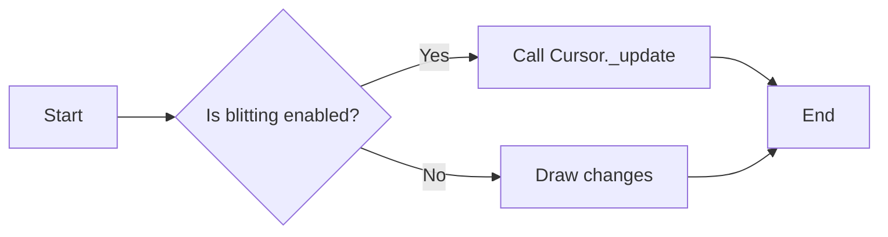

#### 带注释源码

```python
def _update(self):
    """
    Overridden method for either blitting or drawing the widget canvas.

    Passes call to base class if blitting is activated, only.
    In other cases, one draw_idle call is enough, which is placed
    explicitly in this class (see *onmove()*).
    In that case, `~matplotlib.widgets.Cursor` is not supposed to draw
    something using this method.
    """
    if self.useblit:
        super()._update()
```


### Cursor.__init__

This method initializes an instance of the `AnnotatedCursor` class, which is a subclass of `matplotlib.widgets.Cursor`. It sets up the cursor with specific properties and initializes the text display for showing coordinates.

参数：

- `line`：`matplotlib.lines.Line2D`，The plot line from which the data coordinates are displayed.
- `numberformat`：`python format string`，The format string used to create the displayed text with coordinates.
- `offset`：`(float, float)`，The offset in display (pixel) coordinates of the text position relative to the cross-hair.
- `dataaxis`：`{"x", "y"}`，The axis in which the cursor position is looked up.
- `textprops`：`matplotlib.text` properties as dictionary，Specifies the appearance of the rendered text object.
- `**cursorargs`：`matplotlib.widgets.Cursor` properties，Arguments passed to the internal `~matplotlib.widgets.Cursor` instance.

返回值：None

#### 流程图

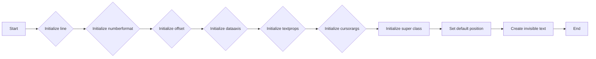

#### 带注释源码

```python
def __init__(self, line, numberformat="{0:.4g};{1:.4g}", offset=(5, 5),
             dataaxis='x', textprops=None, **cursorargs):
    if textprops is None:
        textprops = {}
    # The line object, for which the coordinates are displayed
    self.line = line
    # The format string, on which .format() is called for creating the text
    self.numberformat = numberformat
    # Text position offset
    self.offset = np.array(offset)
    # The axis in which the cursor position is looked up
    self.dataaxis = dataaxis

    # First call baseclass constructor.
    # Draws cursor and remembers background for blitting.
    # Saves ax as class attribute.
    super().__init__(**cursorargs)

    # Default value for position of text.
    self.set_position(self.line.get_xdata()[0], self.line.get_ydata()[0])
    # Create invisible animated text
    self.text = self.ax.text(
        self.ax.get_xbound()[0],
        self.ax.get_ybound()[0],
        "0, 0",
        animated=bool(self.useblit),
        visible=False, **textprops)
    # The position at which the cursor was last drawn
    self.lastdrawnplotpoint = None
```


### AnnotatedCursor.onmove

This method is an overridden draw callback for the cursor. It is called when the mouse is moved.

参数：

- `event`：`matplotlib.backend_bases.MouseEvent`，The event object containing information about the mouse movement.

返回值：`None`，This method does not return any value.

#### 流程图

```mermaid
graph LR
A[Start] --> B{Check ignore()}
B -->|Yes| C[End]
B -->|No| D{Check widgetlock availability()}
D -->|No| C[End]
D -->|Yes| E{Check event inaxes}
E -->|No| F[End]
E -->|Yes| G{Get plotpoint}
G -->|Valid| H[Update event coordinates]
G -->|Invalid| I[End]
H --> J{Check lastdrawnplotpoint}
J -->|Same| K[End]
J -->|Different| L[Redraw canvas and cursor]
L --> M{Check active and visible}
M -->|No| N[End]
M -->|Yes| O[Draw widget]
O --> P[End]
```

#### 带注释源码

```python
def onmove(self, event):
    """
    Overridden draw callback for cursor. Called when moving the mouse.
    """

    # Leave method under the same conditions as in overridden method
    if self.ignore(event):
        self.lastdrawnplotpoint = None
        return
    if not self.canvas.widgetlock.available(self):
        self.lastdrawnplotpoint = None
        return

    # If the mouse left drawable area, we now make the text invisible.
    # Baseclass will redraw complete canvas after, which makes both text
    # and cursor disappear.
    if event.inaxes != self.ax:
        self.lastdrawnplotpoint = None
        self.text.set_visible(False)
        super().onmove(event)
        return

    # Get the coordinates, which should be displayed as text,
    # if the event coordinates are valid.
    plotpoint = None
    if event.xdata is not None and event.ydata is not None:
        # Get plot point related to current x position.
        # These coordinates are displayed in text.
        plotpoint = self.set_position(event.xdata, event.ydata)
        # Modify event, such that the cursor is displayed on the
        # plotted line, not at the mouse pointer,
        # if the returned plot point is valid
        if plotpoint is not None:
            event.xdata = plotpoint[0]
            event.ydata = plotpoint[1]

    # If the plotpoint is given, compare to last drawn plotpoint and
    # return if they are the same.
    # Skip even the call of the base class, because this would restore the
    # background, draw the cursor lines and would leave us the job to
    # re-draw the text.
    if plotpoint is not None and plotpoint == self.lastdrawnplotpoint:
        return

    # Baseclass redraws canvas and cursor. Due to blitting,
    # the added text is removed in this call, because the
    # background is redrawn.
    super().onmove(event)

    # Check if the display of text is still necessary.
    # If not, just return.
    # This behaviour is also cloned from the base class.
    if not self.get_active() or not self.visible:
        return

    # Draw the widget, if event coordinates are valid.
    if plotpoint is not None:
        # Update position and displayed text.
        # Position: Where the event occurred.
        # Text: Determined by set_position() method earlier
        # Position is transformed to pixel coordinates,
        # an offset is added there and this is transformed back.
        temp = [event.xdata, event.ydata]
        temp = self.ax.transData.transform(temp)
        temp = temp + self.offset
        temp = self.ax.transData.inverted().transform(temp)
        self.text.set_position(temp)
        self.text.set_text(self.numberformat.format(*plotpoint))
        self.text.set_visible(self.visible)

        # Tell base class, that we have drawn something.
        # Baseclass needs to know, that it needs to restore a clean
        # background, if the cursor leaves our figure context.
        self.needclear = True

        # Remember the recently drawn cursor position, so events for the
        # same position (mouse moves slightly between two plot points)
        # can be skipped
        self.lastdrawnplotpoint = plotpoint
    # otherwise, make text invisible
    else:
        self.text.set_visible(False)

    # Draw changes. Cannot use _update method of base class,
    # because it would first restore the background, which
    # is done already and is not necessary.
    if self.useblit:
        self.ax.draw_artist(self.text)
        self.canvas.blit(self.ax.bbox)
    else:
        # If blitting is deactivated, the overridden _update call made
        # by the base class immediately returned.
        # We still have to draw the changes.
        self.canvas.draw_idle()
``` 


### Cursor.set_position

#### 描述

`set_position` 方法用于查找并返回与给定坐标相对应的绘图坐标。

#### 参数

- `xpos`：`float`，当前光标在数据坐标中的 x 位置。如果 `dataaxis` 设置为 'x'，则重要。
- `ypos`：`float`，当前光标在数据坐标中的 y 位置。如果 `dataaxis` 设置为 'y'，则重要。

#### 返回值

- `ret`：`{2D array-like, None}`，应显示的坐标。`None` 是默认值。

#### 流程图

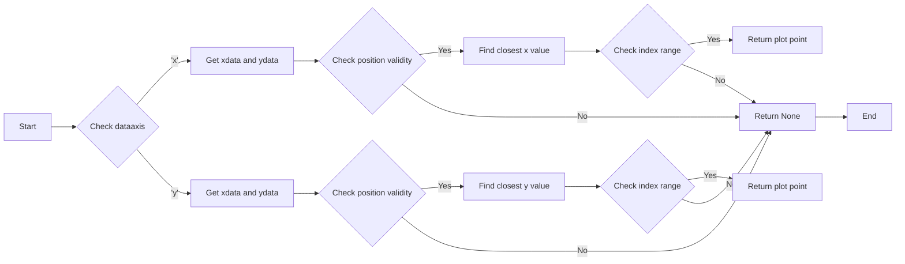

#### 带注释源码

```python
def set_position(self, xpos, ypos):
    """
    Finds the coordinates, which have to be shown in text.

    The behaviour depends on the *dataaxis* attribute. Function looks
    up the matching plot coordinate for the given mouse position.

    Parameters
    ----------
    xpos : float
        The current x position of the cursor in data coordinates.
        Important if *dataaxis* is set to 'x'.
    ypos : float
        The current y position of the cursor in data coordinates.
        Important if *dataaxis* is set to 'y'.

    Returns
    -------
    ret : {2D array-like, None}
        The coordinates which should be displayed.
        *None* is the fallback value.
    """

    # Get plot line data
    xdata = self.line.get_xdata()
    ydata = self.line.get_ydata()

    # The dataaxis attribute decides, in which axis we look up which cursor
    # coordinate.
    if self.dataaxis == 'x':
        pos = xpos
        data = xdata
        lim = self.ax.get_xlim()
    elif self.dataaxis == 'y':
        pos = ypos
        data = ydata
        lim = self.ax.get_ylim()
    else:
        raise ValueError(f"The data axis specifier {self.dataaxis} should "
                         f"be 'x' or 'y'")

    # If position is valid and in valid plot data range.
    if pos is not None and lim[0] <= pos <= lim[-1]:
        # Find closest x value in sorted x vector.
        # This requires the plotted data to be sorted.
        index = np.searchsorted(data, pos)
        # Return none, if this index is out of range.
        if index < 0 or index >= len(data):
            return None
        # Return plot point as tuple.
        return (xdata[index], ydata[index])

    # Return none if there is no good related point for this x position.
    return None
```

### Cursor.clear

#### 描述

`Cursor.clear` 方法是 `AnnotatedCursor` 类的一个方法，它被调用以清除或重置游标的状态，通常在绘制图形之前或图形被重绘时使用。

#### 参数

- `event`：`matplotlib.backend_bases.MouseEvent`，表示触发清除操作的鼠标事件。

#### 返回值

- 无返回值。

#### 流程图

```mermaid
graph LR
    A[开始] --> B{事件触发?}
    B -- 是 --> C[清除游标状态]
    B -- 否 --> D[结束]
    C --> D
```

#### 带注释源码

```python
def clear(self, event):
    """
    Overridden clear callback for cursor, called before drawing the figure.
    """

    # The base class saves the clean background for blitting.
    # Text and cursor are invisible,
    # until the first mouse move event occurs.
    super().clear(event)
    if self.ignore(event):
        return
    self.text.set_visible(False)
```

### 关键组件信息

- **AnnotatedCursor 类**：一个继承自 `matplotlib.widgets.Cursor` 的类，用于显示带有文本的游标，显示鼠标附近的绘图点坐标。
- **Cursor 类**：`matplotlib.widgets` 模块中的基类，用于创建和操作游标。

### Cursor._update

#### 描述

`_update` 方法是 `AnnotatedCursor` 类的一个私有方法，它被用来更新游标的状态，以便在绘图时正确显示。这个方法主要处理游标的绘制逻辑，包括是否使用位图块（blitting）来提高性能。

#### 参数

- 无

#### 返回值

- 无

#### 流程图

```mermaid
graph LR
A[Start] --> B{Use Blitting?}
B -- Yes --> C[Call super._update]
B -- No --> D[Draw changes]
C --> E[End]
D --> E
```

#### 带注释源码

```python
def _update(self):
    """
    Overridden method for either blitting or drawing the widget canvas.

    Passes call to base class if blitting is activated, only.
    In other cases, one draw_idle call is enough, which is placed
    explicitly in this class (see *onmove()*).
    In that case, `~matplotlib.widgets.Cursor` is not supposed to draw
    something using this method.
    """
    if self.useblit:
        super()._update()
```

## 关键组件


### 张量索引与惰性加载

张量索引与惰性加载是代码中用于处理数据访问和计算的关键组件。它允许在需要时才计算或访问数据，从而提高性能和内存效率。

### 反量化支持

反量化支持是代码中用于处理量化数据的关键组件。它允许将量化数据转换回原始数据，以便进行进一步处理或分析。

### 量化策略

量化策略是代码中用于处理数据量化的关键组件。它定义了如何将原始数据转换为量化数据，包括量化精度和范围等参数。


## 问题及建议


### 已知问题

-   **数据排序要求**：代码要求数据在指定轴上必须是升序的，否则`numpy.searchsorted`可能会失败，导致文本消失。这限制了用户在处理数据时的灵活性，因为可能需要重新排序数据以满足要求。
-   **非唯一函数处理**：当使用`dataaxis='y'`时，如果绘制的函数不是单射的，可能会出现多个x值对应一个y值的情况。这可能导致文本显示不正确，因为代码只显示与鼠标位置对应的第一个x值。
-   **性能问题**：如果使用`useblit=True`，代码可能会在绘制时遇到性能问题，尤其是在包含大量数据点的图表中。这是因为每次鼠标移动时都需要重新绘制文本和光标。

### 优化建议

-   **数据排序灵活性**：提供一种机制，允许用户在创建`AnnotatedCursor`实例时指定是否对数据进行排序，或者提供一个方法来检查数据是否已排序，并在必要时自动排序。
-   **处理非唯一函数**：改进代码，使其能够处理非唯一函数的情况，例如通过显示所有可能的x值或选择一个特定的x值（例如最近的或平均的）。
-   **性能优化**：对于`useblit=True`的情况，考虑实现更高效的文本和光标绘制策略，例如使用缓存或优化绘图算法。
-   **错误处理**：增加错误处理，以处理`numpy.searchsorted`失败的情况，并提供更清晰的错误消息，帮助用户诊断问题。
-   **文档和示例**：提供更详细的文档和示例，说明如何处理非唯一函数和性能问题，以及如何优化代码以适应不同的使用场景。


## 其它


### 设计目标与约束

- 设计目标：
  - 实现一个可定制的注释光标，用于显示鼠标指针附近的绘图点坐标。
  - 光标应能够适应不同的绘图数据，包括非唯一函数。
  - 光标应具有高性能，以支持实时交互。
- 约束：
  - 光标数据必须按顺序排列，以确保 `numpy.searchsorted` 函数正确工作。
  - 光标应与 `matplotlib` 库兼容。

### 错误处理与异常设计

- 错误处理：
  - 如果数据轴指定器不是 'x' 或 'y'，则抛出 `ValueError`。
  - 如果鼠标事件坐标无效，则将文本设置为不可见。
  - 如果数据索引超出范围，则返回 `None`。
- 异常设计：
  - 使用 `try-except` 块捕获潜在的错误，并优雅地处理它们。

### 数据流与状态机

- 数据流：
  - 用户移动鼠标，触发 `onmove` 事件。
  - `onmove` 事件计算鼠标指针附近的绘图点坐标。
  - `set_position` 方法查找与给定坐标最接近的绘图点。
  - 文本显示绘图点坐标。
- 状态机：
  - 光标状态包括活动、可见和不可见。
  - 状态根据用户交互和事件处理动态变化。

### 外部依赖与接口契约

- 外部依赖：
  - `matplotlib.pyplot`：用于绘图和事件处理。
  - `numpy`：用于数值计算。
- 接口契约：
  - `AnnotatedCursor` 类必须接受 `line` 参数，该参数是 `matplotlib.lines.Line2D` 对象。
  - `AnnotatedCursor` 类必须实现 `onmove` 方法，该方法在鼠标移动时被调用。
  - `AnnotatedCursor` 类必须实现 `set_position` 方法，该方法用于查找绘图点坐标。

    