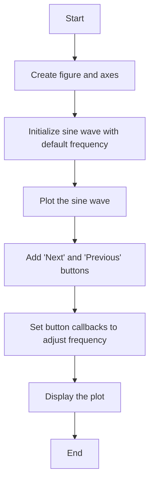
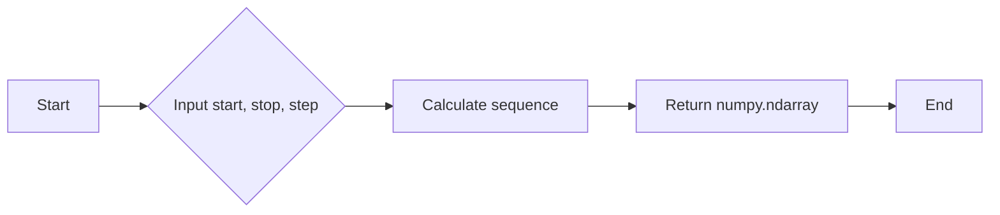
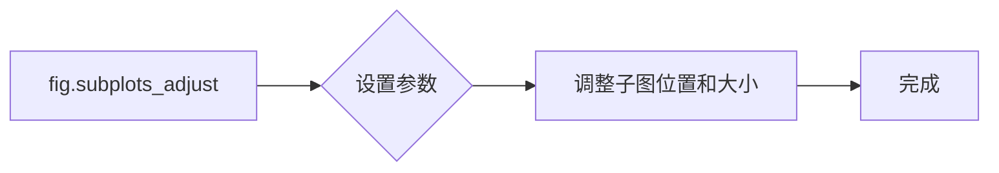
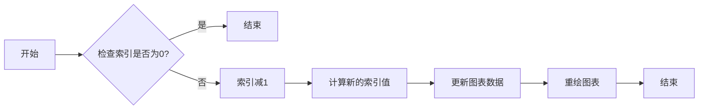

# `matplotlib\galleries\examples\widgets\buttons.py` 详细设计文档

This code creates a simple GUI using matplotlib to visualize a sine wave with adjustable frequencies using 'Next' and 'Previous' buttons.

## 整体流程



## 类结构

```
Index (Class)
├── next (Method)
│   ├── Increment index
│   ├── Calculate new frequency
│   ├── Update sine wave data
│   └── Redraw plot
└── prev (Method)
    ├── Decrement index
    ├── Calculate new frequency
    ├── Update sine wave data
    └── Redraw plot
```

## 全局变量及字段


### `freqs`
    
Array of frequencies used to generate the sine wave.

类型：`numpy.ndarray`
    


### `fig`
    
The main figure object for the plot.

类型：`matplotlib.figure.Figure`
    


### `ax`
    
The axes object where the plot is drawn.

类型：`matplotlib.axes._subplots.AxesSubplot`
    


### `t`
    
Array of time values used to plot the sine wave.

类型：`numpy.ndarray`
    


### `s`
    
Array of sine wave values corresponding to the time values in 't'.)

类型：`numpy.ndarray`
    


### `l`
    
The line object representing the sine wave plot.

类型：`matplotlib.lines.Line2D`
    


### `Index.ind`
    
Index of the current frequency in the 'freqs' array.

类型：`int`
    


### `Index.Index.ind`
    
Index of the current frequency in the 'freqs' array, used to select the frequency for the sine wave plot.

类型：`int`
    
    

## 全局函数及方法


### np.arange

`np.arange` 是 NumPy 库中的一个函数，用于生成一个沿指定间隔的数字序列。

参数：

- `start`：`int`，序列的起始值。
- `stop`：`int`，序列的结束值（不包括此值）。
- `step`：`int`，序列中相邻元素之间的间隔，默认为 1。

返回值：`numpy.ndarray`，一个沿指定间隔的数字序列。

#### 流程图



#### 带注释源码

```python
import numpy as np

freqs = np.arange(2, 20, 3)  # Generate a sequence from 2 to 19 with a step of 3
```


### np.sin

`np.sin` 是 NumPy 库中的一个函数，用于计算输入数组中每个元素的正弦值。

参数：

- `x`：`numpy.ndarray` 或 `float`，输入数组或单个数值，表示要计算正弦值的输入。

返回值：`numpy.ndarray` 或 `float`，输出数组或单个数值，包含输入数组中每个元素的正弦值。

#### 流程图

```mermaid
graph LR
A[Start] --> B{Is x a numpy.ndarray or float?}
B -- Yes --> C[Calculate sin(x)]
B -- No --> D[Error: Invalid input type]
C --> E[End]
D --> E
```

#### 带注释源码

```python
import numpy as np

def calculate_sine(x):
    """
    Calculate the sine of a number or an array of numbers.

    Parameters:
    - x: numpy.ndarray or float, the input number or array of numbers.

    Returns:
    - numpy.ndarray or float, the sine of the input number or array of numbers.
    """
    return np.sin(x)
```


### plt.subplots

`plt.subplots` 是一个用于创建图形和轴对象的函数。

参数：

- `figsize`：`tuple`，图形的大小（宽度和高度），默认为 (6, 4)。
- `dpi`：`int`，图形的分辨率，默认为 100。
- `facecolor`：`color`，图形的背景颜色，默认为 'white'。
- `edgecolor`：`color`，图形的边缘颜色，默认为 'none'。
- `frameon`：`bool`，是否显示图形的边框，默认为 True。
- `num`：`int`，要创建的轴的数量，默认为 1。
- `gridspec_kw`：`dict`，用于定义网格规格的字典。
- `constrained_layout`：`bool`，是否启用约束布局，默认为 False。

返回值：`Figure` 对象，包含图形和轴。

#### 流程图


#### 带注释源码

```python
fig, ax = plt.subplots()
# fig: 创建一个图形对象
# ax: 创建一个轴对象，用于绘制图形
```


### fig.subplots_adjust

调整子图参数。

#### 描述

`fig.subplots_adjust` 是一个全局函数，用于调整子图的位置和大小。它接受多个参数，允许用户自定义子图之间的间距、边距以及子图相对于整个图形窗口的位置。

#### 参数

- `left`：子图左侧的边距，默认为 0.125。
- `right`：子图右侧的边距，默认为 0.9。
- `top`：子图顶部的边距，默认为 0.9。
- `bottom`：子图底部的边距，默认为 0.1。
- `wspace`：子图之间的水平间距，默认为 0.2。
- `hspace`：子图之间的垂直间距，默认为 0.2。

#### 返回值

无返回值。

#### 流程图



#### 带注释源码

```python
fig.subplots_adjust(bottom=0.2)
```

在这段代码中，`fig.subplots_adjust` 被调用来设置子图底部的边距为 0.2。这意味着子图底部将与图形窗口底部的距离为 0.2 的比例单位。其他参数保持默认值。


### plt.draw()

`plt.draw()` 是一个全局函数，用于重新绘制当前的图形。

参数：

- 无

返回值：`None`，无返回值，但会更新当前的图形显示。

#### 流程图

```mermaid
graph LR
A[开始] --> B{调用 plt.draw()}
B --> C[结束]
```

#### 带注释源码

```
# 在 Index 类的 next 和 prev 方法中调用
# self.ind -= 1
# i = self.ind % len(freqs)
# ydata = np.sin(2*np.pi*freqs[i]*t)
# l.set_ydata(ydata)
# plt.draw()
```


### Index.next(event)

`Index.next(event)` 是 Index 类的一个方法，用于在按下“Next”按钮时更新图形。

参数：

- `event`：`matplotlib.widgets.Button`，表示按钮点击事件。

返回值：`None`，无返回值。

#### 流程图

```mermaid
graph LR
A[开始] --> B{事件触发 Index.next()}
B --> C[增加索引 self.ind += 1]
B --> D{计算新索引 i = self.ind % len(freqs)}
B --> E{计算新的 ydata}
B --> F{更新线条数据 l.set_ydata(ydata)}
B --> G{调用 plt.draw()}
C --> G
D --> G
E --> G
F --> G
G --> H[结束]
```

#### 带注释源码

```python
def next(self, event):
    self.ind += 1
    i = self.ind % len(freqs)
    ydata = np.sin(2*np.pi*freqs[i]*t)
    l.set_ydata(ydata)
    plt.draw()
```


### Index.prev(event)

`Index.prev(event)` 是 Index 类的一个方法，用于在按下“Previous”按钮时更新图形。

参数：

- `event`：`matplotlib.widgets.Button`，表示按钮点击事件。

返回值：`None`，无返回值。

#### 流程图

```mermaid
graph LR
A[开始] --> B{事件触发 Index.prev()}
B --> C{减少索引 self.ind -= 1}
B --> D{计算新索引 i = self.ind % len(freqs)}
B --> E{计算新的 ydata}
B --> F{更新线条数据 l.set_ydata(ydata)}
B --> G{调用 plt.draw()}
C --> G
D --> G
E --> G
F --> G
G --> H[结束]
```

#### 带注释源码

```python
def prev(self, event):
    self.ind -= 1
    i = self.ind % len(freqs)
    ydata = np.sin(2*np.pi*freqs[i]*t)
    l.set_ydata(ydata)
    plt.draw()
```


### plt.show

`plt.show` 是一个全局函数，用于显示当前图形。

参数：

- 无

返回值：无

#### 流程图


#### 带注释源码

```python
plt.show()  # 显示当前图形
```


### Index.next

`Index.next` 是 `Index` 类的一个方法，用于将当前频率索引加一，并更新图形。

参数：

- `event`：`matplotlib.widgets.Button`，点击按钮时的事件对象。

返回值：无

#### 流程图


#### 带注释源码

```python
def next(self, event):
    self.ind += 1  # Increment the index
    i = self.ind % len(freqs)  # Calculate the new index
    ydata = np.sin(2*np.pi*freqs[i]*t)  # Calculate the new y data
    l.set_ydata(ydata)  # Update the line data
    plt.draw()  # Redraw the plot
```


### Index.prev

`Index.prev` 是 `Index` 类的一个方法，用于将当前频率索引减一，并更新图形。

参数：

- `event`：`matplotlib.widgets.Button`，点击按钮时的事件对象。

返回值：无

#### 流程图


#### 带注释源码

```python
def prev(self, event):
    self.ind -= 1  # Decrement the index
    i = self.ind % len(freqs)  # Calculate the new index
    ydata = np.sin(2*np.pi*freqs[i]*t)  # Calculate the new y data
    l.set_ydata(ydata)  # Update the line data
    plt.draw()  # Redraw the plot
```


### Index.next

This method updates the sine wave visualization by incrementing the frequency index.

参数：

- `event`：`matplotlib.widgets.Button`，This parameter is used to capture the button click event.

返回值：`None`，This method does not return any value.

#### 流程图

```mermaid
graph LR
A[Start] --> B{Is ind incremented?}
B -- Yes --> C[Set ind to ind % len(freqs)]
B -- No --> C
C --> D[Calculate new frequency index]
D --> E[Update ydata with new frequency]
E --> F[Update line with new ydata]
F --> G[Draw plot]
G --> H[End]
```

#### 带注释源码

```python
def next(self, event):
    self.ind += 1
    i = self.ind % len(freqs)
    ydata = np.sin(2*np.pi*freqs[i]*t)
    l.set_ydata(ydata)
    plt.draw()
``` 


### Index.prev

`Index.prev` 方法是 `Index` 类的一个方法，用于在图形用户界面中向前移动频率索引。

参数：

- `event`：`matplotlib.widgets.Button`，表示触发事件的按钮点击事件。

返回值：无

#### 流程图



#### 带注释源码

```python
def prev(self, event):
    self.ind -= 1
    i = self.ind % len(freqs)
    ydata = np.sin(2*np.pi*freqs[i]*t)
    l.set_ydata(ydata)
    plt.draw()
```


## 关键组件


### 张量索引

用于在数组中定位和访问特定元素。

### 惰性加载

延迟计算或加载数据，直到实际需要时才进行。

### 反量化支持

支持反向量化操作，用于优化计算过程。

### 量化策略

定义数据量化和解量化的方法，以优化存储和计算效率。


## 问题及建议


### 已知问题

-   **全局变量和类字段的使用**：`freqs` 数组作为全局变量，其作用域被限制在文件级别，这可能导致在大型项目中难以追踪和管理。可以考虑将其作为类字段或函数参数传递，以便更好地控制其作用域和生命周期。
-   **代码复用性**：`Index` 类的 `next` 和 `prev` 方法在功能上非常相似，但实现上略有不同。可以考虑将这两个方法合并为一个方法，以减少代码重复。
-   **异常处理**：代码中没有异常处理机制，如果出现错误（例如，`plt.draw()` 调用失败），程序可能会崩溃。应该添加异常处理来提高代码的健壮性。

### 优化建议

-   **使用类字段**：将 `freqs` 数组作为类字段，并在类构造函数中初始化，以便更好地控制其作用域和生命周期。
-   **合并方法**：将 `next` 和 `prev` 方法合并为一个方法，例如 `change_freq`，并根据传入的参数决定是增加还是减少频率。
-   **添加异常处理**：在关键操作（如 `plt.draw()`）周围添加异常处理，以捕获并处理可能发生的错误。
-   **代码注释**：添加必要的代码注释，以提高代码的可读性和可维护性。
-   **单元测试**：编写单元测试来验证代码的功能，确保代码的正确性和稳定性。
-   **模块化**：将代码分解为更小的模块或函数，以提高代码的可读性和可维护性。
-   **使用配置文件**：如果 `freqs` 数组需要根据不同的配置进行调整，可以考虑使用配置文件来管理这些值，而不是在代码中硬编码。


## 其它


### 设计目标与约束

- 设计目标：创建一个简单的按钮GUI，用于修改正弦波的频率，并可视化波形。
- 约束条件：使用matplotlib库进行图形绘制，不使用额外的GUI框架。

### 错误处理与异常设计

- 错误处理：程序中未包含显式的错误处理机制，但应确保在修改频率时不会超出数组`freqs`的范围。
- 异常设计：未设计特定的异常处理机制，但应确保在发生异常时能够优雅地处理。

### 数据流与状态机

- 数据流：用户通过点击“Next”或“Previous”按钮来改变频率，进而改变正弦波的波形。
- 状态机：程序没有明确的状态机设计，但可以通过`Index`类的`ind`字段来跟踪当前频率索引。

### 外部依赖与接口契约

- 外部依赖：程序依赖于matplotlib和numpy库。
- 接口契约：`Button`类提供了`on_clicked`方法，用于注册点击事件的回调函数。


    