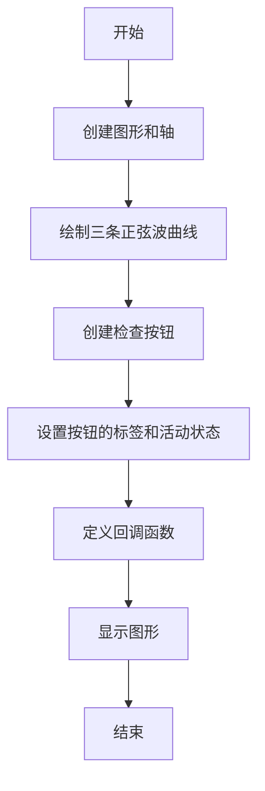
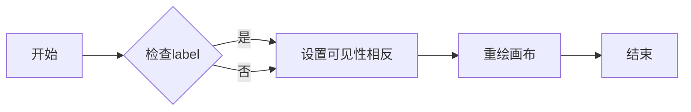
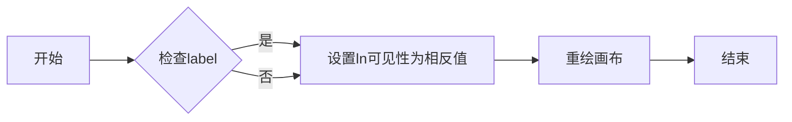
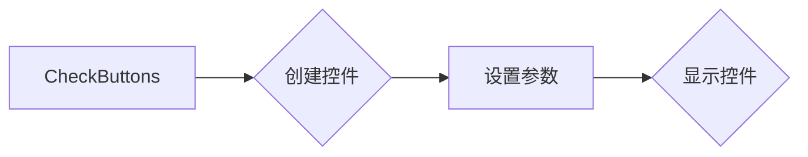

# `matplotlib\galleries\examples\widgets\check_buttons.py` 详细设计文档

This code creates a graphical user interface (GUI) using matplotlib to display and toggle the visibility of three sine waves with check buttons.

## 整体流程



## 类结构

```
CheckButtons (matplotlib.widgets模块中的类)
```

## 全局变量及字段


### `t`
    
Array of time values for the sine waves.

类型：`numpy.ndarray`
    


### `s0`
    
Array of sine wave values with frequency 1 Hz.

类型：`numpy.ndarray`
    


### `s1`
    
Array of sine wave values with frequency 2 Hz.

类型：`numpy.ndarray`
    


### `s2`
    
Array of sine wave values with frequency 3 Hz.

类型：`numpy.ndarray`
    


### `fig`
    
The main figure object created by matplotlib for plotting.

类型：`matplotlib.figure.Figure`
    


### `ax`
    
The axes object where the sine waves are plotted.

类型：`matplotlib.axes._subplots.AxesSubplot`
    


### `l0`
    
The line object representing the 1 Hz sine wave.

类型：`matplotlib.lines.Line2D`
    


### `l1`
    
The line object representing the 2 Hz sine wave.

类型：`matplotlib.lines.Line2D`
    


### `l2`
    
The line object representing the 3 Hz sine wave.

类型：`matplotlib.lines.Line2D`
    


### `lines_by_label`
    
Dictionary mapping labels to line objects for easy access.

类型：`dict`
    


### `line_colors`
    
List of colors corresponding to the sine waves.

类型：`list`
    


### `rax`
    
The axes object containing the check buttons.

类型：`matplotlib.axes._subplots.AxesSubplot`
    


### `check`
    
The check buttons widget controlling the visibility of the sine waves.

类型：`matplotlib.widgets.CheckButtons`
    


### `CheckButtons.ax`
    
The axes object where the check buttons are placed.

类型：`matplotlib.axes._subplots.AxesSubplot`
    


### `CheckButtons.labels`
    
List of labels corresponding to the check buttons.

类型：`list`
    


### `CheckButtons.actives`
    
List of booleans indicating the initial active state of each check button.

类型：`list`
    


### `CheckButtons.label_props`
    
Dictionary of properties for the labels of the check buttons.

类型：`dict`
    


### `CheckButtons.frame_props`
    
Dictionary of properties for the frames of the check buttons.

类型：`dict`
    


### `CheckButtons.check_props`
    
Dictionary of properties for the check marks of the check buttons.

类型：`dict`
    
    

## 全局函数及方法


### callback

`callback` 函数是一个回调函数，用于处理 `CheckButtons` 组件的点击事件。

参数：

- `label`：`str`，表示被点击的按钮的标签，对应于绘图中的线条标签。

返回值：`None`，该函数不返回任何值。

#### 流程图



#### 带注释源码

```python
def callback(label):
    ln = lines_by_label[label]  # 获取对应的线条对象
    ln.set_visible(not ln.get_visible())  # 设置线条的可见性为当前可见性的相反
    ln.figure.canvas.draw_idle()  # 重绘画布，更新显示
```


### callback(label)

该函数是一个回调函数，当CheckButtons的按钮被点击时被调用。

参数：

- `label`：`str`，表示被点击的按钮的标签，对应于matplotlib中plot对象的label属性。

返回值：`None`，该函数不返回任何值。

#### 流程图



#### 带注释源码

```python
def callback(label):
    # 获取对应label的line对象
    ln = lines_by_label[label]
    # 切换line的可见性
    ln.set_visible(not ln.get_visible())
    # 重绘画布以反映更改
    ln.figure.canvas.draw_idle()
``` 


### CheckButtons.draw

该函数用于创建一个CheckButtons控件，该控件允许用户通过点击来切换matplotlib图形中线条的可见性。

参数：

- `ax`：`matplotlib.axes.Axes`，CheckButtons控件的父轴。
- `labels`：`list`，包含每个按钮标签的列表。
- `actives`：`list`，包含每个按钮初始状态的布尔值列表，True表示可见，False表示不可见。
- `label_props`：`dict`，包含标签属性的字典，如颜色。
- `frame_props`：`dict`，包含框架属性的字典，如边框颜色。
- `check_props`：`dict`，包含复选框属性的字典，如面颜色。

返回值：`matplotlib.widgets.CheckButtons`，创建的CheckButtons控件。

#### 流程图



#### 带注释源码

```python
check = CheckButtons(
    ax=rax,
    labels=lines_by_label.keys(),
    actives=[l.get_visible() for l in lines_by_label.values()],
    label_props={'color': line_colors},
    frame_props={'edgecolor': line_colors},
    check_props={'facecolor': line_colors},
)
```


## 关键组件


### 张量索引与惰性加载

张量索引与惰性加载是指在处理大型数据集时，只对需要的数据进行索引和加载，以减少内存消耗和提高处理速度。

### 反量化支持

反量化支持是指系统对量化后的数据进行反量化处理，以便进行后续的精确计算或分析。

### 量化策略

量化策略是指对数据或模型进行量化处理的方法，以减少数据或模型的精度，从而降低计算资源消耗。常见的量化策略包括整数量化、浮点量化等。


## 问题及建议


### 已知问题

-   **代码复用性低**：代码中绘制正弦波和创建检查按钮的逻辑是硬编码的，如果需要绘制不同的波形或使用不同的检查按钮，需要重写大量代码。
-   **全局变量使用**：`lines_by_label` 和 `line_colors` 是全局变量，这可能导致代码难以理解和维护。
-   **异常处理缺失**：代码中没有异常处理机制，如果发生错误（例如，matplotlib版本不兼容），程序可能会崩溃。
-   **文档不足**：代码注释较少，对于不熟悉matplotlib的用户来说，理解代码的功能和结构可能比较困难。

### 优化建议

-   **增加代码复用性**：将绘制波形和创建检查按钮的逻辑封装成函数或类，以便在不同的上下文中重用。
-   **减少全局变量使用**：将全局变量封装在类中，或者使用局部变量和参数传递来避免全局变量的使用。
-   **添加异常处理**：在代码中添加异常处理，以便在发生错误时提供有用的错误信息，并防止程序崩溃。
-   **增强文档**：添加详细的注释和文档，解释代码的功能、方法和类的设计，以便其他开发者更容易理解和使用代码。
-   **考虑用户输入**：允许用户通过参数指定波形和检查按钮的属性，而不是硬编码在代码中。
-   **优化性能**：如果绘制大量波形或检查按钮，考虑性能优化，例如使用更高效的数据结构或算法。


## 其它


### 设计目标与约束

- 设计目标：实现一个用户界面，允许用户通过复选按钮选择显示或隐藏不同的正弦波。
- 约束：使用matplotlib库创建图形界面，复选按钮样式可配置。

### 错误处理与异常设计

- 错误处理：程序应能够处理matplotlib库可能抛出的异常，如绘图错误。
- 异常设计：使用try-except语句捕获并处理异常，确保程序稳定运行。

### 数据流与状态机

- 数据流：用户通过复选按钮选择显示或隐藏正弦波，状态机根据用户的选择更新图形的可见性。
- 状态机：复选按钮的状态（选中或未选中）与对应正弦波的可见性状态相对应。

### 外部依赖与接口契约

- 外部依赖：程序依赖于matplotlib库进行图形绘制。
- 接口契约：复选按钮的回调函数`callback`负责根据用户的选择更新图形的可见性状态。


    