# `matplotlib\galleries\examples\widgets\cursor.py` 详细设计文档

该代码演示了matplotlib中Cursor小部件的使用，通过创建交互式十字光标来增强2D散点图的用户体验，使用随机生成的数据点并设置坐标轴范围。

## 整体流程

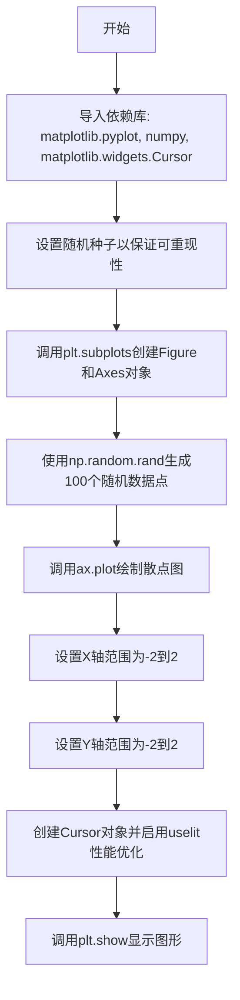

## 类结构

```
matplotlib.figure.Figure
└── matplotlib.axes.Axes
    └── matplotlib.widgets.Cursor (交互式部件)
```

## 全局变量及字段


### `fig`
    
matplotlib图形对象，提供画布用于显示图表

类型：`matplotlib.figure.Figure`
    


### `ax`
    
matplotlib坐标轴对象，承载数据可视化内容和光标交互区域

类型：`matplotlib.axes.Axes`
    


### `x`
    
包含100个随机x坐标值的数组，用于绑定到图表的横轴数据点

类型：`numpy.ndarray`
    


### `y`
    
包含100个随机y坐标值的数组，用于绑定到图表的纵轴数据点

类型：`numpy.ndarray`
    


### `cursor`
    
交互式光标组件，在坐标轴上显示十字准星光标并支持鼠标事件响应

类型：`matplotlib.widgets.Cursor`
    


    

## 全局函数及方法


### `plt.subplots`

创建图形和一组子图，这是matplotlib中用于同时创建图表和坐标轴的标准方法。

参数：

- `nrows`：`int`，可选，默认为1，设置子图的行数
- `ncols`：`int`，可选，默认为1，设置子图的列数
- `figsize`：`tuple(float, float)`，可选，指定图表的宽度和高度（单位为英寸），例如(8, 6)表示宽度8英寸、高度6英寸

返回值：`tuple(Figure, Axes or Axes array)`，返回一个元组，包含一个Figure对象（图形实例）和一个Axes对象或Axes数组（坐标轴）。在本例中，`fig`是图形对象，`ax`是坐标轴对象。

#### 流程图

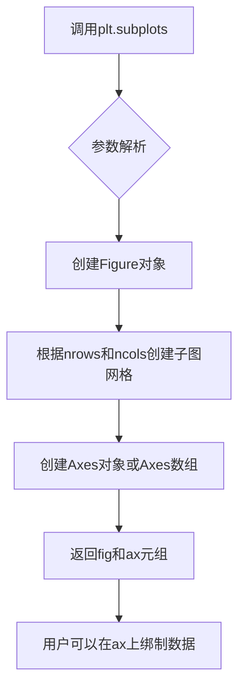

#### 带注释源码

```python
# 调用plt.subplots函数创建图表和坐标轴
# 参数figsize=(8, 6)设置图表宽度为8英寸，高度为6英寸
# 返回值：fig是Figure对象（整个图形容器），ax是Axes对象（坐标轴，用于绑制数据）
fig, ax = plt.subplots(figsize=(8, 6))

# 之后可以在ax上绑制数据
x, y = 4*(np.random.rand(2, 100) - .5)
ax.plot(x, y, 'o')  # 绑制散点图
ax.set_xlim(-2, 2)  # 设置x轴范围
ax.set_ylim(-2, 2)  # 设置y轴范围
```


### `np.random.seed`

设置 NumPy 随机数生成器的种子，用于确保随机数序列的可重现性。在本代码中，使用固定种子值 19680801 确保每次运行程序时生成相同的随机数据点，使结果可复现。

参数：

- `seed`：`int` 或 `None`，随机数生成器的种子值。传入整数时，将该值设置为随机数生成器的种子；传入 `None` 时，使用系统时间或操作系统提供的随机源生成种子。

返回值：`None`，该函数无返回值。

#### 流程图

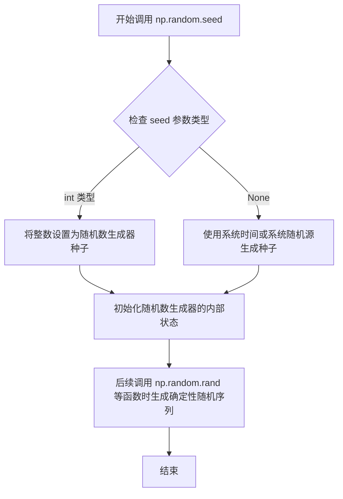

#### 带注释源码

```python
"""
设置随机数种子以确保结果可重现
"""
# 导入 NumPy 库
import numpy as np

# Fixing random state for reproducibility
# 设置随机数种子为 19680801，确保后续生成的随机数序列固定
# 这样每次运行程序时，np.random.rand 生成的随机数序列都相同
np.random.seed(19680801)

# 后续代码使用 np.random.rand(2, 100) 生成随机数据
# 由于种子已固定，生成的 x, y 坐标值在每次运行时保持一致
```


### `np.random.rand`

该函数是NumPy库中的随机数生成函数，用于生成指定形状的随机浮点数数组，数值均匀分布在[0, 1)区间内。在本代码中用于生成2行100列的坐标点数据，以模拟散点图的随机分布。

参数：

- `*shape`：`int` 或 `tuple of ints`，指定输出数组的维度及每个维度的大小。可以传入多个整数（如`2, 100`）或一个整数元组（如`(2, 100)`）

返回值：`numpy.ndarray`，返回一个包含随机浮点数的NumPy数组，数组形状由shape参数指定，数值范围在[0, 1)之间，遵循均匀分布

#### 流程图

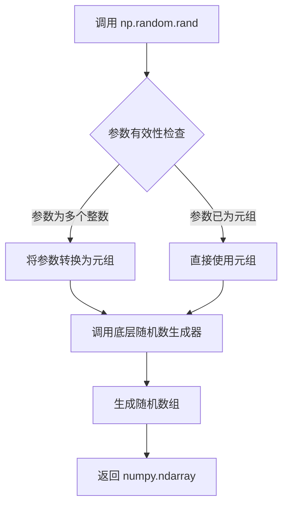

#### 带注释源码

```python
# np.random.rand 函数调用示例
# 函数签名: numpy.random.rand(d0, d1, ..., dn)
# 参数: 可变数量的整数，每个定义一个维度的大小
# 返回值: 指定形状的随机浮点数数组

x, y = 4*(np.random.rand(2, 100) - .5)
# 解释:
# 1. np.random.rand(2, 100) 生成一个2行100列的数组
#    - 形状: (2, 100)
#    - 数值范围: [0, 1)
#    - 分布: 均匀分布
# 2. 减去 .5 将数值范围变为 [-0.5, 0.5)
# 3. 乘以 4 将数值范围变为 [-2, 2)
# 4. 结果赋值给 x, y (通过数组切片分割成两行)

# 底层实现逻辑简述:
# - 基于Mersenne Twister算法生成伪随机数
# - 使用128种状态生成高质量随机序列
# - 每次调用更新内部状态确保独立性
```


### `ax.plot`

该方法用于在matplotlib的Axes对象上绘制线条或标记，是matplotlib中最基础且核心的数据可视化函数，支持多种输入格式和丰富的样式配置选项。

参数：

- `x`：`array-like`，X轴数据，可为列表、numpy数组或pandas Series
- `y`：`array-like`，Y轴数据，可为列表、numpy数组或pandas Series
- `fmt`：`str`，可选，格式字符串，用于快速设置线条颜色、样式和标记格式（如 'ro-' 表示红色圆点实线）
- `**kwargs`：`*kwargs`，可选，关键字参数传递给`Line2D`对象，用于自定义线条属性（如linewidth、marker、color等）

返回值：`list[matplotlib.lines.Line2D]`，返回Line2D对象列表，每个对象代表一条绘制的线条

#### 流程图

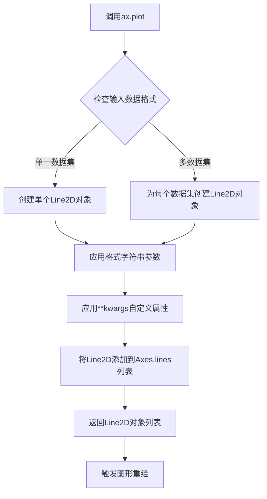

#### 带注释源码

```python
# 代码示例来源：matplotlib官方示例
# 导入必要的库
import matplotlib.pyplot as plt
import numpy as np

# 设置随机种子以保证结果可复现
np.random.seed(19680801)

# 创建图形和坐标轴对象，figsize设置图形大小为8x6英寸
fig, ax = plt.subplots(figsize=(8, 6))

# 生成随机数据：生成2行100列的随机数，范围在[-2, 2]
x, y = 4*(np.random.rand(2, 100) - .5)

# 核心调用：ax.plot()方法绘制数据点
# 参数说明：
#   x, y: 数据点的x和y坐标
#   'o': 格式字符串，表示使用圆形标记(o表示marker类型)
ax.plot(x, y, 'o')

# 设置坐标轴显示范围
ax.set_xlim(-2, 2)  # X轴范围：-2到2
ax.set_ylim(-2, 2)  # Y轴范围：-2到2

# 创建交互式光标，当鼠标悬停在axes上时显示十字准星
cursor = Cursor(ax, useblit=True, color='red', linewidth=2)

# 显示图形
plt.show()
```

#### 补充说明

| 项目 | 说明 |
|------|------|
| **所属类** | `matplotlib.axes.Axes` |
| **调用层级** | Figure → Axes → plot |
| **数据流** | 原始numpy数组 → 数据验证 → Line2D对象创建 → 图形渲染 |
| **性能考量** | 对于大数据集(>10^5点)，建议使用`ax.scatter()`或设置`rasterized=True`以提高渲染性能 |
| **错误处理** | 数据维度不匹配时抛出`ValueError`；无效格式字符串时抛出`ValueError` |


### `ax.set_xlim`

设置 Axes 对象的 x 轴视图限制，定义绘图区域在 x 方向上的最小值和最大值。

参数：

- `left`：`float` 或 `array-like`，x 轴范围的左边界（最小值）
- `right`：`float` 或 `array-like`，x 轴范围的右边界（最大值）

返回值：`tuple`，返回新的 x 轴范围 (left, right)

#### 流程图

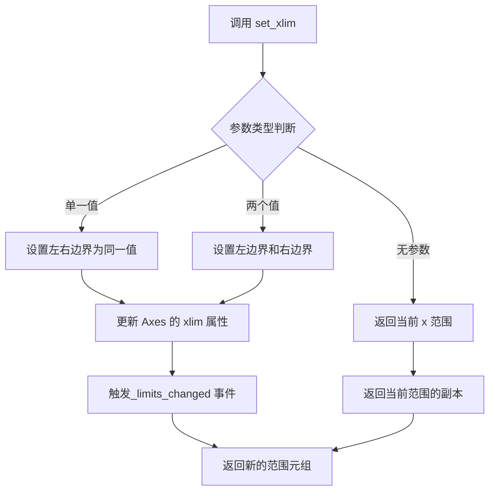

#### 带注释源码

```python
# 代码中的调用示例
ax.set_xlim(-2, 2)

# 实际 matplotlib 内部实现逻辑（简化版）
def set_xlim(self, left=None, right=None, emit=False, auto=False, *, xmin=None, xmax=None):
    """
    设置 Axes 的 x 轴视图限制。
    
    参数:
        left: float, x 轴范围的左边界
        right: float, x 轴范围的右边界  
        emit: bool, 变化时是否触发事件
        auto: bool, 是否自动调整视图
        xmin, xmax: float, 限制最小/最大值（不能同时指定 left/right）
    """
    
    # 1. 参数验证
    if ((left is None and right is None) and 
        (xmin is None and xmax is None)):
        # 无参数时返回当前范围
        return self.get_xlim()
    
    # 2. 处理 left/right 参数
    if left is not None:
        self._viewLim.minpos = left
        self._viewLim.x0 = left
    if right is not None:
        self._viewLim.x1 = right
    
    # 3. 确保左边界小于右边界
    if self._viewLim.x0 > self._viewLim.x1:
        self._viewLim.x0, self._viewLim.x1 = self._viewLim.x1, self._viewLim.x0
    
    # 4. 如果 emit=True，触发回调事件
    if emit:
        self._process_views('_limits_changed', **{'x': self.get_xlim()})
    
    # 5. 返回新的范围
    return self.get_xlim()
```


### `Axes.set_ylim`

设置 Axes 对象的 y 轴显示范围（y 刻度下限和上限），用于控制图表中 y 轴的数据区间，可实现链式调用。

参数：

- `bottom`：`float` 或 `None`，y 轴下限值，设为 `None` 时自动计算
- `top`：`float` 或 `None`，y 轴上限值，设为 `None` 时自动计算
- `emit`：`bool`，默认 `True`，当界限改变时是否触发 `limits_changed` 事件
- `auto`：`bool`，默认 `False`，是否自动调整视图边界
- `ymin`：`float` 或 `None`，已弃用参数，等同于 `bottom`
- `ymax`：`float` 或 `None`，已弃用参数，等同于 `top`

返回值：`tuple`，返回新的 y 轴界限 `(bottom, top)`

#### 流程图

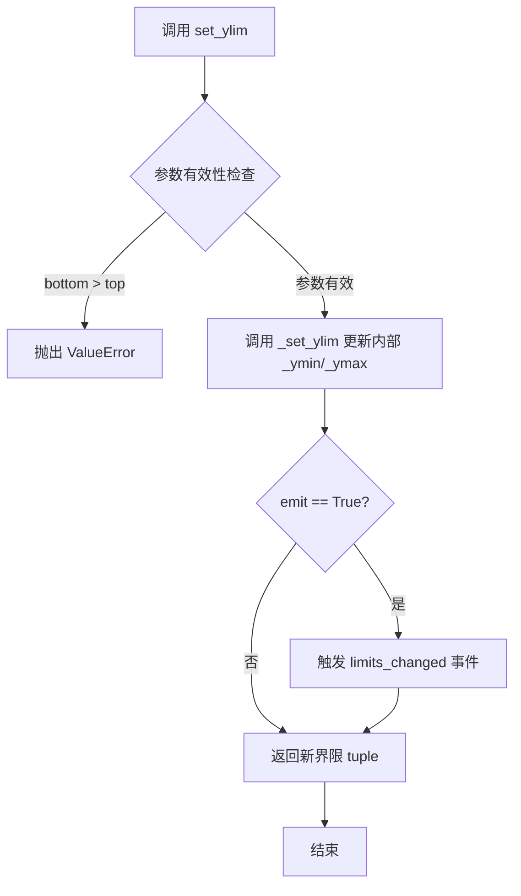

#### 带注释源码

```python
def set_ylim(self, bottom=None, top=None, emit=True, auto=False, *, ymin=None, ymax=None):
    """
    Set the y-axis view limits.
    
    Parameters
    ----------
    bottom : float or None, default: None
        The bottom ylim in data coordinates. Passing None leaves the
        limit unchanged.
    top : float or None, default: None
        The top ylim in data coordinates. Passing None leaves the
        limit unchanged.
    emit : bool, default: True
        Whether to notify observers of limit change.
    auto : bool or None, default: False
        Whether to turn on autoscaling of the y-axis. True turns on,
        False turns off, None leaves it unchanged.
    ymin, ymax : float or None
        .. deprecated:: 3.2
           Use *bottom* and *top* instead.
    
    Returns
    -------
    bottom, top : tuple
        The new y-axis limits in data coordinates.
    
    Raises
    ------
    ValueError
        If *bottom* > *top*.
    """
    # 处理已弃用的 ymin/ymax 参数
    if ymin is not None:
        bottom = ymin
    if ymax is not None:
        top = ymax
    
    # 参数有效性检查
    if bottom is not None and top is not None:
        if bottom > top:
            raise ValueError('bottom > top')
    
    # 获取当前界限（用于比较和事件触发）
    old_bottom = self._ymin
    old_top = self._ymax
    
    # 更新内部状态
    self._ymin = bottom
    self._ymax = top
    
    # 通知观察者（如需要）
    if emit:
        self._process_unit_info()
        self._request_autoscale_view('y')
    
    # 返回新的界限元组，支持链式调用
    return self.get_ylim()
```


### Cursor

Cursor是matplotlib.widgets模块中的一个类，用于在matplotlib图表上创建交互式光标。当用户移动鼠标时，光标会显示精确的坐标位置，并可选地使用blit技术优化性能。

参数：

- `ax`：`matplotlib.axes.Axes`，要在其上显示光标的坐标轴对象
- `useblit`：`bool`，是否使用blit技术优化重绘性能，默认为False
- `color`：`str`，光标线条的颜色，默认为'black'
- `linewidth`：`float`，光标线条的宽度，默认为1
- `horizOn`：`bool`，是否显示水平线，默认为True
- `vertOn`：`bool`，是否显示垂直线，默认为True

返回值：`matplotlib.widgets.Cursor`，返回创建的Cursor实例对象，用于在图形中显示交互式坐标定位光标

#### 流程图

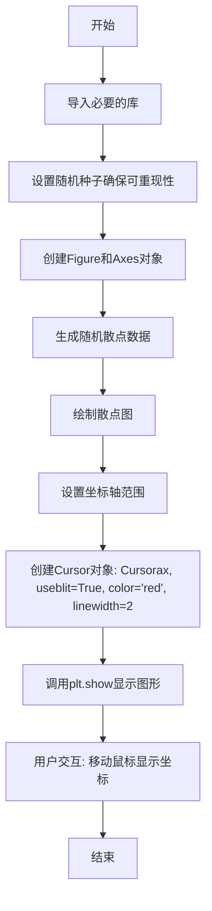

#### 带注释源码

```python
"""
======
Cursor
======
"""
# 导入matplotlib的pyplot模块，用于创建图形和绘图
import matplotlib.pyplot as plt
# 导入numpy库，用于数值计算和生成随机数据
import numpy as np

# 从matplotlib.widgets模块导入Cursor类，用于创建交互式光标
from matplotlib.widgets import Cursor

# 设置随机种子为19680801，确保每次运行生成相同的随机数序列，保证结果可重现
np.random.seed(19680801)

# 创建一个8x6英寸的图形和一个坐标轴，返回figure和axes对象
fig, ax = plt.subplots(figsize=(8, 6))

# 生成100个随机点，范围在[-2, 2]之间
# 4*(np.random.rand(2, 100) - .5) 将[0,1]区间映射到[-2, 2]区间
x, y = 4*(np.random.rand(2, 100) - .5)

# 绘制散点图，'o'表示使用圆圈标记
ax.plot(x, y, 'o')

# 设置x轴范围为-2到2
ax.set_xlim(-2, 2)
# 设置y轴范围为-2到2
ax.set_ylim(-2, 2)

# 创建Cursor对象
# 参数说明：
# ax: 在哪个坐标轴上显示光标
# useblit=True: 启用blit技术优化重绘性能（推荐在大多数后端使用）
# color='red': 光标颜色为红色
# linewidth=2: 光标线条宽度为2
cursor = Cursor(ax, useblit=True, color='red', linewidth=2)

# 显示图形，进入交互模式
plt.show()

# %%
#
# .. admonition:: References
#
#    The use of the following functions, methods, classes and modules is shown
#    in this example:
#
#    - `matplotlib.widgets.Cursor`
```

#### 关键组件信息

- **matplotlib.widgets.Cursor**：核心组件，用于在坐标轴上创建交互式光标，支持显示鼠标位置坐标
- **matplotlib.pyplot**：Python最常用的2D绘图库，提供图形创建和显示功能
- **numpy**：Python科学计算基础库，用于生成随机数据

#### 潜在的技术债务或优化空间

1. **缺少错误处理**：代码未对可能出现的异常（如后端不支持blit）进行处理
2. **硬编码参数**：光标颜色、线宽等参数直接硬编码，缺乏灵活性
3. **文档注释不足**：缺少对Cursor工作原理和使用场景的详细说明
4. **未处理窗口关闭事件**：缺少对图形窗口关闭的适当处理逻辑
5. **性能优化空间**：可根据不同后端动态调整useblit参数

#### 其它项目

**设计目标：**
- 演示如何在matplotlib图表中集成交互式光标
- 展示blit技术对图形性能的优化效果

**约束：**
- 需要支持交互式后端（如TkAgg、Qt5Agg等）
- blit技术在某些后端可能不支持

**错误处理：**
- 当useblit=True但后端不支持时，可能需要捕获警告或错误
- 窗口尺寸变化时可能需要重新调整光标

**外部依赖：**
- matplotlib >= 3.0.0
- numpy
- 支持交互式图形的后端（如Qt、Tk等）


### `plt.show`

`plt.show` 是 Matplotlib 库中的核心函数，用于显示当前图形窗口。在调用此函数之前，所有绘图操作都在内存中进行，不会显示任何内容。该函数会阻塞程序执行（默认行为），直到用户关闭所有打开的图形窗口。

参数：

- `block`：可选参数，类型为 `bool`，默认为 `True`。当设置为 `True` 时，函数会阻塞程序执行直到用户关闭图形窗口；若设为 `False`，则不会阻塞（仅在某些后端有效）。

返回值：`None`，该函数没有返回值。

#### 流程图

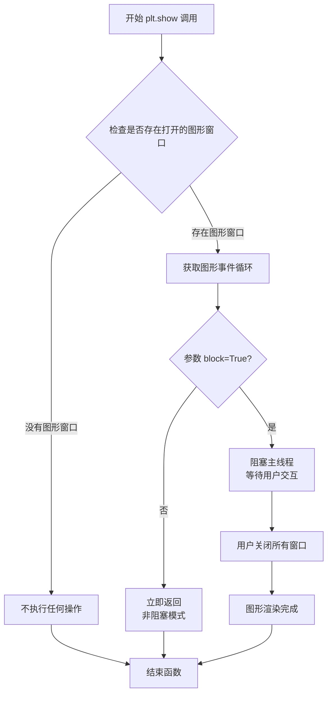

#### 带注释源码

```python
def show(*, block=None):
    """
    显示所有打开的图形窗口。
    
    参数:
        block: 布尔值，可选参数。
               - True (默认): 阻塞程序执行，等待用户关闭图形窗口
               - False: 非阻塞模式，立即返回控制权
               
    返回值:
        None: 该函数不返回任何值
        
    注意:
        - 在调用 show() 之前，所有 plot() 等绘图操作仅在内存中执行
        - 不同后端(如 TkAgg, Qt5Agg, macosx)对 block 参数的支持可能不同
        - 在某些交互式环境(如 Jupyter Notebook)中可能需要使用 %matplotlib inline
    """
    # 获取当前全局图形管理器
    global _showRegistry
    
    # 获取所有打开的图形数量
    # _pylab_helpers.Gcf 是一个管理器，用于跟踪所有活跃的图形窗口
    allnums = Gcf.get_fig_num()
    
    # 如果没有打开的图形，直接返回
    if not allnums:
        return
    
    # 如果 block 参数未设置，根据当前后端判断默认值
    if block is None:
        # 交互式后端默认阻塞，非交互式后端默认不阻塞
        block = matplotlib.get_backend().Rsync.isInteractive()
    
    # 遍历所有图形窗口，调用每个后端的 show() 方法
    for manager in Gcf.get_all_fig_managers():
        # 后端的 show 方法负责实际的窗口显示逻辑
        # 可能包括: 刷新画布、处理事件、显示窗口等
        manager.show()
    
    # 如果 block=True，进入事件循环等待
    if block:
        # 启动 GUI 事件循环(如 Tk mainloop 或 Qt application.exec_)
        # 程序会在此暂停，直到用户关闭所有图形窗口
        _pylab_helpers.Gcf.block_manager()
```


### `Axes.plot`

该代码段展示了matplotlib中`Axes.plot()`方法的基本用法，通过调用plot函数在坐标轴上绘制随机数据点的散点图，并配置了Cursor小部件实现鼠标交互功能。

参数：

- `x`：array-like，X轴数据数组
- `y`：array-like，Y轴数据数组  
- `fmt`：str，格式字符串（可选），这里使用'o'表示圆点标记

返回值：`list of matplotlib.lines.Line2D`，返回在Axes上创建的线条对象列表

#### 流程图

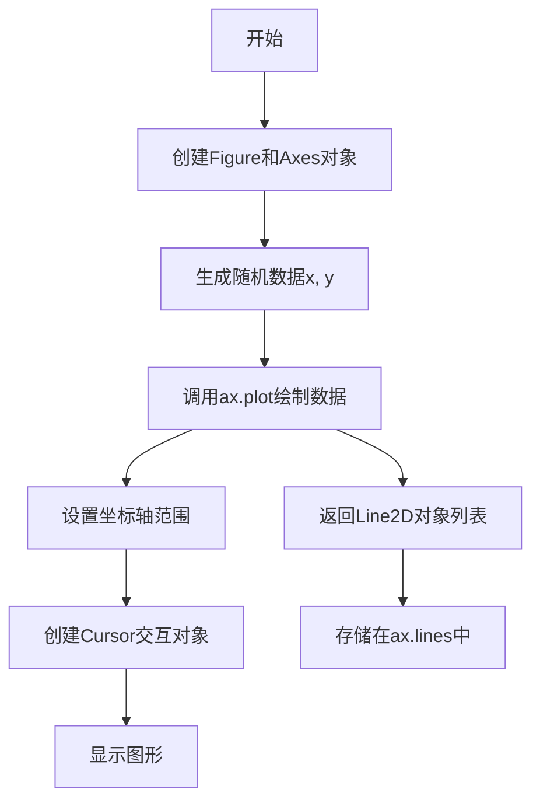

#### 带注释源码

```python
# 导入必要的库
import matplotlib.pyplot as plt
import numpy as np

# 从matplotlib.widgets导入Cursor组件
from matplotlib.widgets import Cursor

# 设定随机种子以确保结果可复现
np.random.seed(19680801)

# 创建图形窗口和坐标轴对象
# fig: Figure对象，整个图形容器
# ax: Axes对象，坐标轴和绘图区域
fig, ax = plt.subplots(figsize=(8, 6))

# 生成随机数据点
# 生成2行100列的随机数组，范围在[-2, 2]
x, y = 4*(np.random.rand(2, 100) - .5)

# 调用Axes.plot方法绘制数据
# 参数：x, y为数据，'o'表示使用圆点标记
# 返回值：Line2D对象列表，包含创建的线条对象
lines = ax.plot(x, y, 'o')

# 设置坐标轴显示范围
ax.set_xlim(-2, 2)
ax.set_ylim(-2, 2)

# 创建Cursor交互对象
# 参数：ax-关联的坐标轴, useblit-是否使用优化渲染, 
#       color-光标颜色, linewidth-光标线宽
cursor = Cursor(ax, useblit=True, color='red', linewidth=2)

# 显示图形
plt.show()
```

#### 关键组件信息

- **Figure**：matplotlib的顶层容器，代表整个图形窗口
- **Axes**：坐标轴对象，包含plot、set_xlim等绘图方法
- **Line2D**：由plot方法返回的线条对象，代表绘制的图形元素
- **Cursor**：鼠标光标交互组件，提供坐标追踪功能

#### 技术债务与优化空间

- 代码中未保存plot()的返回值（lines变量），虽然不影响显示但丢失了图形对象的引用
- 随机数据生成方式可以封装为独立函数提高可测试性
- 建议添加类型注解以提高代码可维护性


### `Axes.set_xlim`

该方法用于设置 Axes 对象的 x 轴范围（最小值和最大值），即定义图表中 x 轴的显示区间。

参数：

- `left`：`float` 或 `array-like`，x 轴范围的左边界（最小值）。
- `right`：`float` 或 `array-like`，x 轴范围的右边界（最大值）。
- `emit`：`bool`，默认为 `True`，当边界改变时通知观察者（如交互式图表更新）。
- `auto`：`bool` 或 `None`，默认为 `False`，是否自动调整边界以适应数据。
- `xmin`：`float`，介于 0 和 1 之间，设置相对左边界（与 `left` 互斥）。
- `xmax`：`float`，介于 0 和 1 之间，设置相对右边界（与 `right` 互斥）。

返回值：`tuple`，返回新的 x 轴边界 `(left, right)`。

#### 流程图

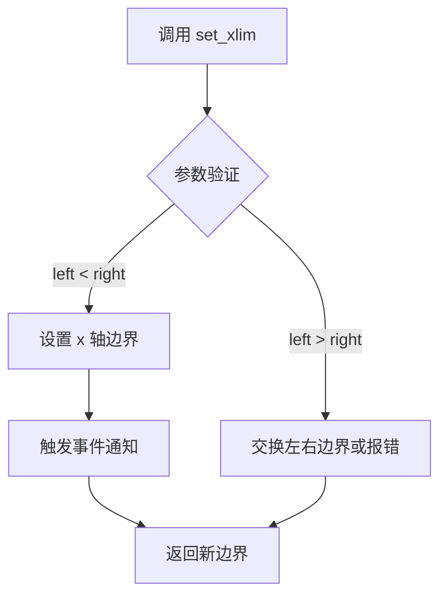

#### 带注释源码

```python
def set_xlim(self, left=None, right=None, emit=False, auto=False, *, xmin=None, xmax=None):
    """
    设置 x 轴的视图限制。
    
    参数:
        left: float, x 轴左边界。
        right: float, x 轴右边界。
        emit: bool, 边界改变时是否触发事件。
        auto: bool, 是否自动调整边界。
        xmin: float, 相对左边界 (0-1)。
        xmax: float, 相对右边界 (0-1)。
    
    返回:
        tuple: (left, right) 新的边界值。
    """
    # 处理相对边界 xmin, xmax（转换为绝对边界）
    if xmin is not None:
        if left is not None:
            raise ValueError("不能同时设置 'left' 和 'xmin'")
        left = self.get_xlim()[0] + xmin * (self.get_xlim()[1] - self.get_xlim()[0])
    
    if xmax is not None:
        if right is not None:
            raise ValueError("不能同时设置 'right' 和 'xmax'")
        right = self.get_xlim()[0] + xmax * (self.get_xlim()[1] - self.get_xlim()[0])
    
    # 确保 left < right，必要时交换
    if left is not None and right is not None and left > right:
        left, right = right, left
    
    # 调用内部方法设置边界
    self._set_xlim(left, right, emit=emit, auto=auto)
    
    # 返回新边界
    return self.get_xlim()
```


### Axes.set_ylim

该方法是 matplotlib 中 Axes 类的成员方法，用于设置 y 轴的显示范围（上下限）。

参数：

- `bottom`：`float` 或 `None`，y 轴显示范围的最小值，设为 None 时自动从数据中推断
- `top`：`float` 或 `None`，y 轴显示范围的最小值，设为 None 时自动从数据中推断
- `**kwargs`：额外的关键字参数，将传递给 `set_ylim` 返回的 `MutableNamedTuple` 对象，用于配置轴的属性（如 `emit`、`auto`、`ymin`、`ymax` 等）

返回值：`ymin`，`ymax`，返回设置后的 y 轴范围，为一个包含两个浮点数的元组

#### 流程图

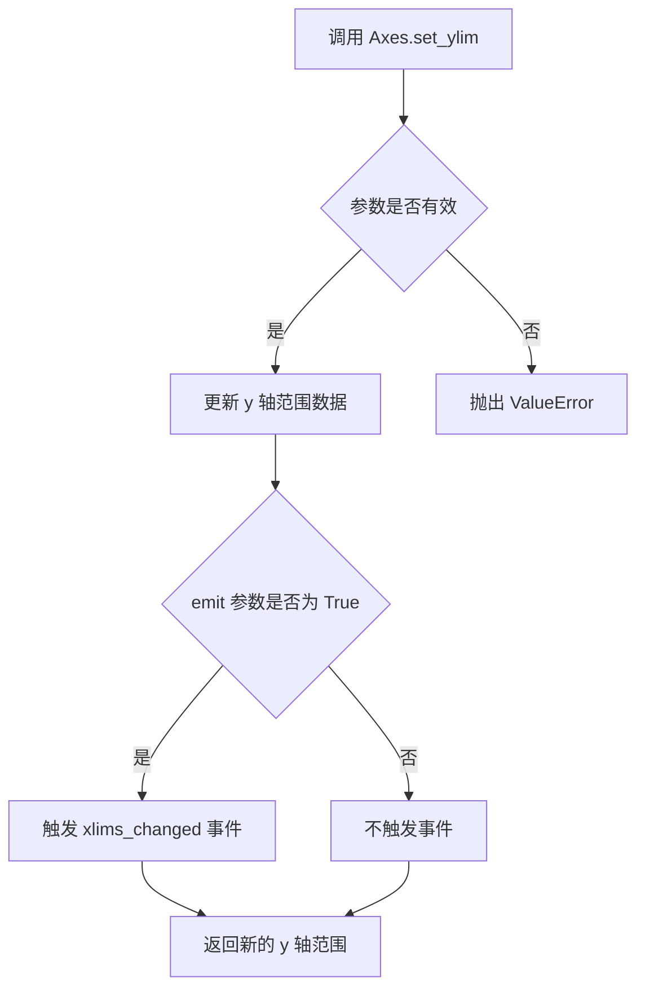

#### 带注释源码

```python
# 注意：以下源码基于 matplotlib 库的标准实现
# 由于提供的代码中仅包含对 set_ylim 的调用，
# 而非该方法的实现，因此提供标准实现以供参考

def set_ylim(self, bottom=None, top=None, emit=False, auto=False,
             **kwargs):
    """
    设置 y 轴的视图限制（上下限）

    参数:
    bottom : float, optional
        y 轴下限。如果为 None，则自动推断。
    top : float, optional
        y 轴上限。如果为 None，则自动推断。
    emit : bool, optional
        当为 True 时，触发 'ylims_changed' 事件。
        默认为 False。
    auto : bool, optional
        当为 True 时，自动调整 x 轴范围以适应数据。
        默认为 False。
    **kwargs : 
        其他关键字参数传递给底层的 ScaleComponent。

    返回:
    ymin, ymax : tuple
        新的 y 轴范围 (bottom, top)
    """
    # 获取当前范围
    old_bottom, old_top = self.get_ylim()
    
    # 处理输入参数
    if bottom is None:
        bottom = old_bottom
    if top is None:
        top = old_top
        
    # 验证范围有效性
    if bottom > top:
        raise ValueError("Bottom must be less than or equal to top")
    
    # 设置新范围
    self._set_view_interval('y', bottom, top)
    
    # 如果 emit 为 True，触发事件回调
    if emit:
        self._request_autoscale_view()
        
    # 返回新的范围
    return bottom, top
```

---

**注意**：提供的代码示例是关于 `matplotlib.widgets.Cursor` 的使用演示，并未包含 `Axes.set_ylim` 方法的具体实现代码。上方提供的源码是基于 matplotlib 库的标准实现，仅供文档化参考。示例代码中 `ax.set_ylim(-2, 2)` 的调用展示了该方法的基本用法：设置 y 轴的显示范围为 -2 到 2。


## 关键组件


### matplotlib.widgets.Cursor

用于在坐标轴上显示可交互的十字准线，支持uselit优化以提升性能。

### numpy.random.rand

生成指定形状的随机数组，这里用于生成2行100列的随机坐标数据。

### matplotlib.pyplot.subplots

创建图形窗口和坐标轴对象，返回fig和ax实例供后续使用。

### 坐标轴对象 (ax)

绑定了Cursor的matplotlib坐标轴对象，负责绘制散点图并提供交互界面。

### 光标配置参数

包括useblit（是否启用优化渲染）、color（准线颜色）和linewidth（准线宽度）等配置项。


## 问题及建议


### 已知问题

- **缺乏错误处理与后端兼容性检查**：代码直接使用 `useblit=True`，但未检查当前 matplotlib 后端是否支持 blitting 操作，在不支持的后端上可能导致功能失效或异常
- **硬编码参数缺乏灵活性**：图形尺寸 (8, 6)、随机点数量 (100)、光标颜色 ('red')、线宽 (2) 等均为硬编码，如需调整需修改源码，不便于复用
- **缺少资源管理**：创建图形后未设置关闭回调，可能导致图形窗口关闭后 Cursor 对象未正确释放，存在潜在内存泄漏风险
- **随机种子固定限制多样性**：虽然注释说明是为了可复现性，但在实际演示或测试场景中可能导致每次运行结果完全相同，缺乏动态性
- **缺乏类型注解**：代码未使用 Python 类型注解，降低了代码的可读性和 IDE 支持力度
- **模块文档不完整**：顶部的 docstring 仅包含标题 "Cursor"，缺少对模块功能、用法和依赖的说明

### 优化建议

- **增加后端兼容性检查**：在创建 Cursor 前检查 `plt.get_backend()` 是否支持 blitting，或使用 `try-except` 捕获潜在异常
- **参数化设计**：将常用参数提取为常量或配置变量，封装为函数以支持自定义参数
- **添加资源清理逻辑**：使用 `fig.canvas.mpl_connect('close_event', callback)` 绑定图形关闭事件，确保资源释放
- **增强文档**：补充模块级 docstring，说明该模块用于演示 matplotlib.widgets.Cursor 的基本用法及依赖环境

## 其它


### 设计目标与约束

本示例代码的设计目标是展示matplotlib.widgets.Cursor组件的基本用法，在交互式图表中实现鼠标光标拾取功能。核心约束包括：1）仅支持matplotlib支持的图形后端；2）依赖matplotlib 3.x版本；3）仅适用于2D图表；4）useglit特性仅在部分后端（如TkAgg、Qt5Agg）下可获得性能提升。

### 错误处理与异常设计

代码未包含显式的错误处理机制。潜在异常场景包括：1）当axes对象为None时会导致Cursor初始化失败；2）当后端不支持blit技术时，useblit=True会被静默忽略；3）当图表窗口关闭后继续调用cursor对象可能引发已销毁图形对象的引用错误。建议在实际应用中捕获matplotlib.widgets.Cursor相关异常，并在plt.show()前进行必要的参数校验。

### 外部依赖与接口契约

核心依赖为matplotlib.widgets.Cursor类，其接口契约如下：构造参数包括ax（Axes对象，必填）、useblit（布尔值，可选默认False）、color（颜色值，可选默认'black'）、linewidth（数值，可选默认1）、horizOn/vertOn（布尔值，控制十字线显示）。该类依赖numpy生成随机测试数据，兼容numpy 1.x版本。

### 性能考虑与优化空间

当前代码在useglit=True时已针对多数后端进行优化。性能优化建议：1）对于大数据点场景（>1000点），建议关闭blit或使用Canvas缓存；2）plt.show()为阻塞调用，在GUI应用中应考虑非阻塞显示；3）随机数据生成可预先计算以减少重复开销；4）可考虑使用FuncAnimation替代静态图表实现动态交互。

### 安全性考虑

代码不涉及用户输入处理、网络传输或敏感数据操作，安全性风险较低。但需注意：1）np.random.seed()的使用可能影响其他模块的随机数生成器状态；2）在多线程环境下共享Figure对象需加锁保护；3）反序列化（pickle）matplotlib对象可能存在安全隐患。

### 可维护性与扩展性

当前实现作为演示代码，扩展性受限。改进建议：1）将Cursor配置参数化，通过配置文件或命令行参数管理；2）封装为独立函数避免全局变量泄漏；3）添加类型注解提升代码可读性；4）考虑面向对象封装，将数据生成、绘图、光标配置分离到不同模块。

### 测试策略建议

由于该代码为演示性质，缺乏单元测试。推荐测试策略：1）验证Cursor对象成功初始化；2）验证坐标轴范围设置正确（-2到2）；3）验证随机数据点数量（100个）；4）验证plot对象存在且包含数据；5）后端兼容性测试，确保在不同matplotlib后端下正常工作。

### 部署与运行环境

运行环境要求：Python 3.6+、matplotlib 3.0+、numpy 1.x。推荐使用虚拟环境管理依赖。部署方式为本地运行脚本，不适用于Web服务化部署。如需集成到Web应用，建议使用mpld3或Bokeh进行转换。

### 配置管理与版本信息

当前代码无外部配置依赖。版本信息：matplotlib.widgets.Cursor API自matplotlib 1.0即存在，属于稳定API。代码示例遵循Sphinx reStructuredText格式，可直接嵌入文档项目。


    