# `matplotlib\galleries\examples\widgets\lasso_selector_demo_sgskip.py` 详细设计文档

This code provides an interactive tool for selecting data points from a scatter plot using the lasso tool in matplotlib.

## 整体流程

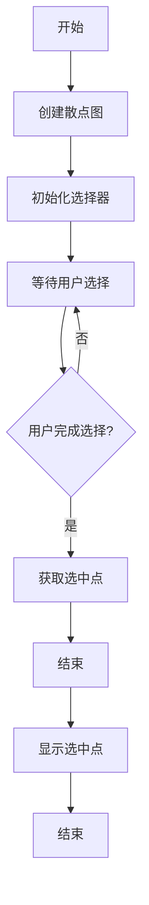

## 类结构

```
SelectFromCollection (主类)
├── matplotlib.path.Path (用于路径选择)
└── matplotlib.widgets.LassoSelector (用于交互选择)
```

## 全局变量及字段


### `data`
    
Randomly generated data points for plotting.

类型：`numpy.ndarray`
    


### `subplot_kw`
    
Keyword arguments for the subplot configuration.

类型：`dict`
    


### `fig`
    
The main figure object.

类型：`matplotlib.figure.Figure`
    


### `ax`
    
The main axes object for plotting.

类型：`matplotlib.axes._subplots.AxesSubplot`
    


### `pts`
    
The scatter plot collection of points.

类型：`matplotlib.collections.Collection`
    


### `selector`
    
The instance of SelectFromCollection for selecting points.

类型：`SelectFromCollection`
    


### `accept`
    
Function to handle the 'enter' key press event to accept selected points.

类型：`function`
    


### `SelectFromCollection.canvas`
    
The canvas of the figure for drawing.

类型：`matplotlib.backends.backend_agg.FigureCanvasAgg`
    


### `SelectFromCollection.collection`
    
The collection to select points from.

类型：`matplotlib.collections.Collection`
    


### `SelectFromCollection.alpha_other`
    
Alpha value for non-selected points.

类型：`float`
    


### `SelectFromCollection.xys`
    
The coordinates of the points in the collection.

类型：`numpy.ndarray`
    


### `SelectFromCollection.Npts`
    
The number of points in the collection.

类型：`int`
    


### `SelectFromCollection.fc`
    
The face colors of the points in the collection.

类型：`numpy.ndarray`
    


### `SelectFromCollection.lasso`
    
The lasso selector widget for selecting points.

类型：`matplotlib.widgets.LassoSelector`
    


### `SelectFromCollection.ind`
    
The indices of the selected points.

类型：`numpy.ndarray`
    
    

## 全局函数及方法


### np.random.seed

`np.random.seed` is a function from the NumPy library that sets the seed for the random number generator. This ensures that the sequence of random numbers generated is reproducible.

参数：

- `seed`：`int`，指定随机数生成器的种子值。如果未指定，则使用当前时间作为种子。

返回值：`None`，该函数没有返回值。

#### 流程图

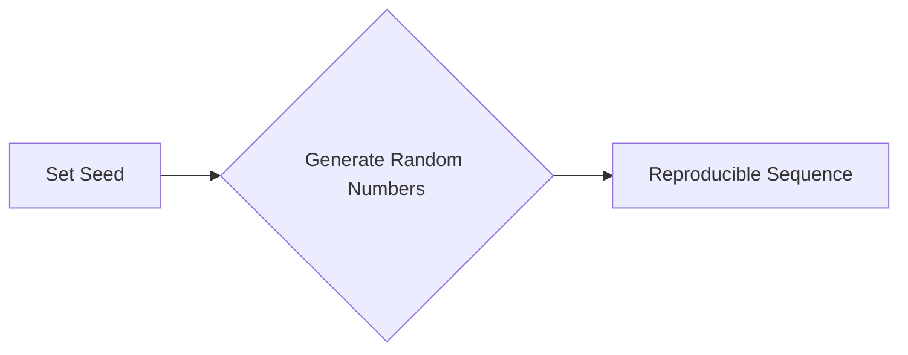

#### 带注释源码

```python
np.random.seed(19680801)
```

该行代码设置了随机数生成器的种子为19680801，确保了后续生成的随机数序列是可复制的。


### plt.subplots

`plt.subplots` 是一个用于创建子图（subplot）的函数，它允许用户在一个图形窗口中创建多个子图，每个子图可以独立于其他子图进行操作。

参数：

- `subplot_kw`：`dict`，用于指定子图的各种关键字参数，如 `xlim`, `ylim`, `autoscale_on` 等。
- `fig`：`matplotlib.figure.Figure`，可选，如果提供，则在该图上创建子图。
- `gridspec_kw`：`dict`，可选，用于指定网格的配置，如 `ncols`, `nrows`, `hspace`, `wspace` 等。

返回值：`fig, ax`，其中 `fig` 是创建的图形对象，`ax` 是子图对象。

#### 流程图

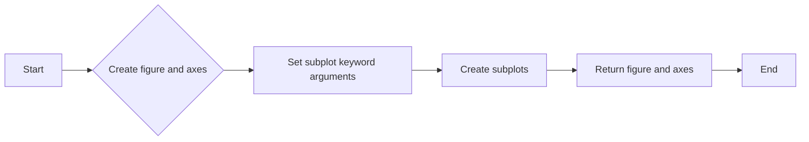

#### 带注释源码

```python
fig, ax = plt.subplots(subplot_kw=subplot_kw)
```

在这个例子中，`subplot_kw` 被设置为 `dict(xlim=(0, 1), ylim=(0, 1), autoscale_on=False)`，这意味着子图的 x 轴和 y 轴的范围被设置为 (0, 1)，并且子图将不会自动调整轴的范围。


### ax.scatter

`ax.scatter` 是一个用于在子图上绘制散点图的函数。

参数：

- `data`：`numpy.ndarray`，包含散点坐标的数组。
- `s`：`int` 或 `numpy.ndarray`，散点的大小。

返回值：`scatter` 对象，它是一个 `matplotlib.collections.PathCollection` 的实例。

#### 流程图

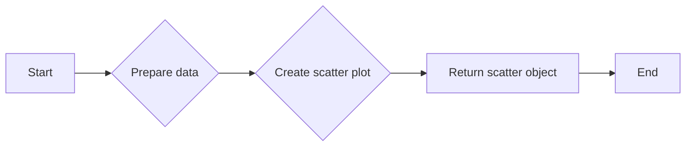

#### 带注释源码

```python
pts = ax.scatter(data[:, 0], data[:, 1], s=80)
```

在这个例子中，`data` 是一个包含 100 个二维点的数组，`s=80` 指定了散点的大小为 80。


### SelectFromCollection

`SelectFromCollection` 是一个类，用于从 `matplotlib.collections.Collection` 子类中选择索引。

参数：

- `ax`：`matplotlib.axes.Axes`，用于交互的轴。
- `collection`：`matplotlib.collections.Collection` 子类，要从中选择的集合。
- `alpha_other`：`float`，用于突出显示选择的 alpha 值。

方法：

- `__init__`：初始化选择器。
- `onselect`：当选择完成时调用。
- `disconnect`：断开事件。

#### 流程图

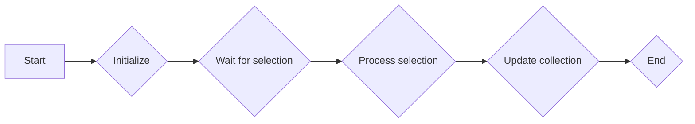

#### 带注释源码

```python
class SelectFromCollection:
    def __init__(self, ax, collection, alpha_other=0.3):
        # Initialization code
        pass

    def onselect(self, verts):
        # Code to process selection
        pass

    def disconnect(self):
        # Code to disconnect events
        pass
```

在这个例子中，`SelectFromCollection` 被用于从散点图中选择点。`verts` 是一个包含选择多边形顶点的列表。


### accept

`accept` 是一个函数，用于处理按键事件。

参数：

- `event`：`matplotlib.event.Event`，包含按键事件的详细信息。

返回值：无。

#### 流程图

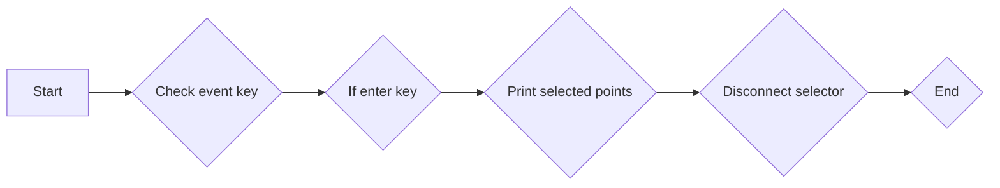

#### 带注释源码

```python
def accept(event):
    if event.key == "enter":
        print("Selected points:")
        print(selector.xys[selector.ind])
        selector.disconnect()
        ax.set_title("")
        fig.canvas.draw()
```

在这个例子中，当用户按下 "Enter" 键时，函数会打印出所选点的坐标，并断开选择器。


### plt.show

`plt.show` 是一个用于显示图形的函数。

参数：无。

返回值：无。

#### 流程图

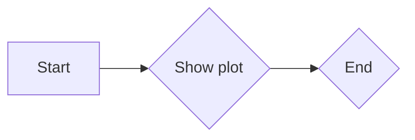

#### 带注释源码

```python
plt.show()
```

在这个例子中，`plt.show()` 被用于显示图形窗口，其中包含散点图和选择器。


### SelectFromCollection.onselect

This method handles the selection of points from a matplotlib collection using the `LassoSelector`.

参数：

- `verts`：`tuple`，The vertices of the lasso selection. It is a tuple of tuples, where each inner tuple represents the (x, y) coordinates of a vertex.

返回值：`None`，This method does not return any value. It modifies the `collection` object directly.

#### 流程图

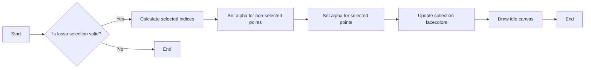

#### 带注释源码

```python
def onselect(self, verts):
    path = Path(verts)
    self.ind = np.nonzero(path.contains_points(self.xys))[0]
    self.fc[:, -1] = self.alpha_other
    self.fc[self.ind, -1] = 1
    self.collection.set_facecolors(self.fc)
    self.canvas.draw_idle()
```


### SelectFromCollection.onselect

This method is called when a lasso selection is made. It updates the alpha values of the points in the collection based on whether they are part of the selection or not.

参数：

- `verts`：`numpy.ndarray`，The vertices of the lasso selection.

返回值：`None`，This method does not return any value.

#### 流程图

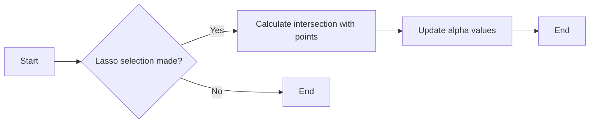

#### 带注释源码

```python
def onselect(self, verts):
    path = Path(verts)
    self.ind = np.nonzero(path.contains_points(self.xys))[0]
    self.fc[:, -1] = self.alpha_other
    self.fc[self.ind, -1] = 1
    self.collection.set_facecolors(self.fc)
    self.canvas.draw_idle()
```


### fig.canvas.mpl_connect

连接一个事件处理函数到matplotlib画布的事件。

描述：

该函数用于将一个事件处理函数连接到matplotlib画布上的特定事件。当指定的事件在画布上发生时，事件处理函数将被调用。

参数：

- `event`: `str`，指定要连接的事件类型。
- `func`: `callable`，事件发生时调用的函数。

返回值：`None`

#### 流程图


#### 带注释源码

```python
fig.canvas.mpl_connect("key_press_event", accept)
```

在这段代码中，`fig.canvas.mpl_connect` 将 "key_press_event" 事件与 `accept` 函数连接起来。这意味着每当用户在画布上按下键盘上的键时，`accept` 函数将被调用。


### plt.show()

`plt.show()` 是一个全局函数，用于显示当前图形窗口。

{描述}

参数：

- 无

返回值：`None`，无返回值，但会显示图形窗口。

#### 流程图

```mermaid
graph LR
A[开始] --> B[调用 plt.show()]
B --> C[显示图形窗口]
C --> D[结束]
```

#### 带注释源码

```python
if __name__ == '__main__':
    import matplotlib.pyplot as plt

    # ... (其他代码)

    plt.show()
```


### SelectFromCollection.__init__

This method initializes the `SelectFromCollection` class, setting up the necessary components for selecting data points from a matplotlib collection using the `LassoSelector`.

参数：

- `ax`：`~matplotlib.axes.Axes`，The axes to interact with.
- `collection`：`matplotlib.collections.Collection` subclass，The collection you want to select from.
- `alpha_other`：`0 <= float <= 1`，To highlight a selection, this tool sets all selected points to an alpha value of 1 and non-selected points to *alpha_other*.

返回值：无

#### 流程图

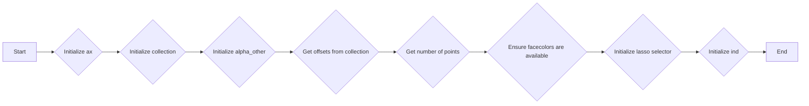

#### 带注释源码

```python
def __init__(self, ax, collection, alpha_other=0.3):
    # Initialize the canvas of the axes
    self.canvas = ax.figure.canvas
    
    # Set the collection to be interacted with
    self.collection = collection
    
    # Set the alpha value for non-selected points
    self.alpha_other = alpha_other
    
    # Get the coordinates of the points in the collection
    self.xys = collection.get_offsets()
    
    # Get the number of points in the collection
    self.Npts = len(self.xys)
    
    # Ensure that we have separate colors for each object
    self.fc = collection.get_facecolors()
    if len(self.fc) == 0:
        raise ValueError('Collection must have a facecolor')
    elif len(self.fc) == 1:
        self.fc = np.tile(self.fc, (self.Npts, 1))
    
    # Initialize the lasso selector for the axes
    self.lasso = LassoSelector(ax, onselect=self.onselect)
    
    # Initialize the list of selected indices
    self.ind = []
```


### SelectFromCollection.onselect

This method is called when a lasso selection is made on the matplotlib collection. It updates the alpha values of the selected and non-selected points.

参数：

- `verts`：`numpy.ndarray`，The vertices of the lasso selection.

返回值：`None`，This method does not return any value.

#### 流程图

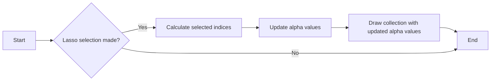

#### 带注释源码

```python
def onselect(self, verts):
    # Create a Path object from the vertices of the lasso selection
    path = Path(verts)
    
    # Find the indices of points that are inside the lasso selection
    self.ind = np.nonzero(path.contains_points(self.xys))[0]
    
    # Update the alpha values of the selected and non-selected points
    self.fc[:, -1] = self.alpha_other
    self.fc[self.ind, -1] = 1
    
    # Update the facecolors of the collection with the new alpha values
    self.collection.set_facecolors(self.fc)
    
    # Redraw the canvas with the updated collection
    self.canvas.draw_idle()
```


### SelectFromCollection.disconnect

`SelectFromCollection.disconnect` 方法用于断开与 LassoSelector 的连接，并重置集合中点的 alpha 值。

参数：

- 无

返回值：无

#### 流程图


#### 带注释源码

```python
def disconnect(self):
    # 断开与 LassoSelector 的连接
    self.lasso.disconnect_events()
    
    # 重置 alpha 值为 1
    self.fc[:, -1] = 1
    
    # 更新集合的 facecolors
    self.collection.set_facecolors(self.fc)
    
    # 绘制画布
    self.canvas.draw_idle()
```


## 关键组件


### 张量索引与惰性加载

张量索引与惰性加载允许在处理大型数据集时，只加载和处理所需的数据部分，从而提高效率。

### 反量化支持

反量化支持使得模型可以在量化过程中保持精度，从而在降低模型大小和计算量的同时，保持性能。

### 量化策略

量化策略定义了如何将浮点数转换为固定点数，以减少模型大小和计算量，同时保持可接受的精度。

## 问题及建议


### 已知问题

-   **全局变量和函数依赖性**：代码中使用了全局变量和函数，如`np.random.seed`和`plt.show`，这可能导致代码的可重用性和可维护性降低。
-   **异常处理**：代码中没有明确的异常处理机制，如果发生错误，可能会导致程序崩溃或不可预期的行为。
-   **代码注释**：代码中缺少详细的注释，这可能会使得其他开发者难以理解代码的意图和逻辑。

### 优化建议

-   **使用局部变量和函数**：将全局变量和函数替换为局部变量和函数，以提高代码的可重用性和可维护性。
-   **添加异常处理**：在代码中添加异常处理机制，以捕获和处理可能发生的错误。
-   **增加代码注释**：在代码中添加详细的注释，以帮助其他开发者理解代码的意图和逻辑。
-   **代码结构优化**：考虑将代码分解为更小的函数和模块，以提高代码的可读性和可维护性。
-   **性能优化**：对于大数据集，可以考虑使用更高效的数据结构和算法来提高代码的性能。
-   **代码测试**：编写单元测试来验证代码的正确性和稳定性。
-   **文档化**：编写详细的文档，包括代码的功能、使用方法、参数说明等，以提高代码的可维护性。

## 其它


### 设计目标与约束

- 设计目标：实现一个交互式选择数据点的工具，允许用户通过绘制lasso形状来选择散点图中的点。
- 约束：确保工具与matplotlib库兼容，并能够在散点图上正常工作。

### 错误处理与异常设计

- 错误处理：当传入的集合没有面颜色时，抛出`ValueError`。
- 异常设计：确保在断开事件连接时，将所有点的alpha值恢复为原始值。

### 数据流与状态机

- 数据流：用户通过鼠标操作选择点，选择结果存储在`ind`属性中。
- 状态机：工具在“选择”和“非选择”状态之间切换，根据用户操作更新点的alpha值。

### 外部依赖与接口契约

- 外部依赖：依赖于matplotlib库中的`LassoSelector`和`Path`类。
- 接口契约：`SelectFromCollection`类提供了一个接口，允许用户通过传入`ax`和`collection`参数来创建选择工具。


    