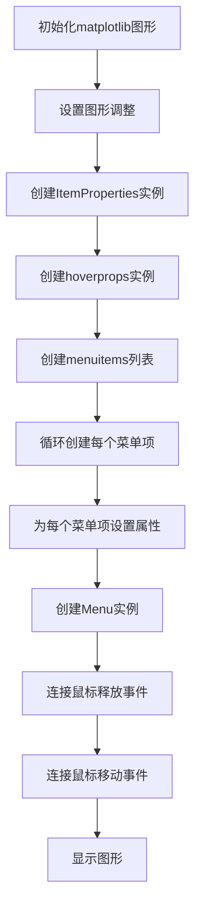
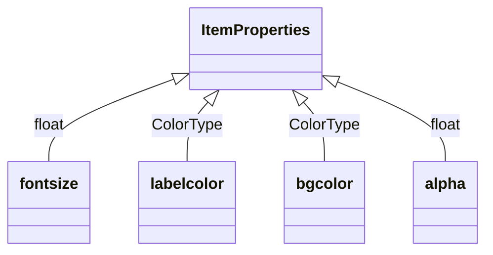
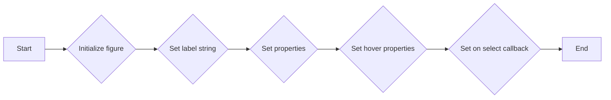
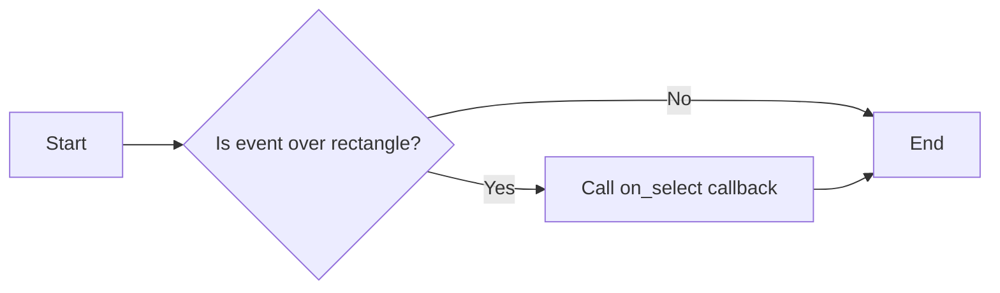
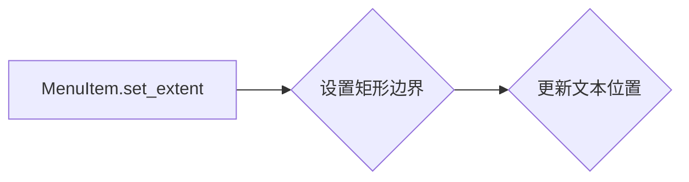
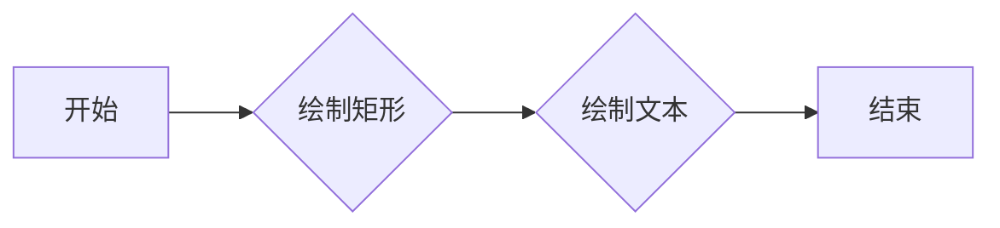
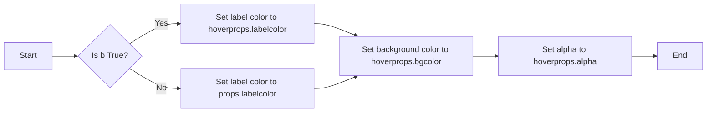
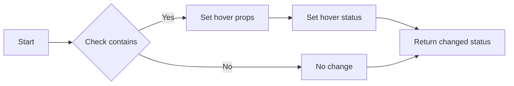
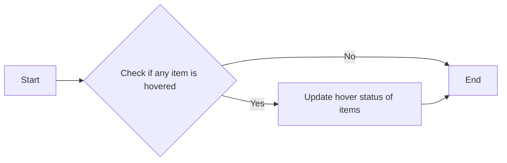

# `matplotlib\galleries\examples\widgets\menu.py` 详细设计文档

This code defines a simple menu system using matplotlib to display and interact with menu items.

## 整体流程



## 类结构

```
ItemProperties (菜单项属性)
├── MenuItem (菜单项)
│   ├── __init__ (初始化方法)
│   ├── check_select (检查选择)
│   ├── set_extent (设置范围)
│   ├── draw (绘制)
│   ├── set_hover_props (设置悬停属性)
│   └── set_hover (设置悬停状态)
└── Menu (菜单)
    ├── __init__ (初始化方法)
    ├── on_move (处理鼠标移动)
    └── on_select (处理选择)
```

## 全局变量及字段


### `fig`
    
The figure object where the menu is drawn.

类型：`matplotlib.figure.Figure`
    


### `props`
    
Properties for the menu item text and background when not hovered.

类型：`ItemProperties`
    


### `hoverprops`
    
Properties for the menu item text and background when hovered.

类型：`ItemProperties`
    


### `menuitems`
    
List of menu items in the menu.

类型：`list of MenuItem`
    


### `fontsize`
    
Font size for the menu item text.

类型：`float`
    


### `labelcolor`
    
Color of the menu item text.

类型：`ColorType`
    


### `bgcolor`
    
Background color of the menu item.

类型：`ColorType`
    


### `alpha`
    
Transparency of the menu item background.

类型：`float`
    


### `padx`
    
Padding on the x-axis for the menu item text.

类型：`float`
    


### `pady`
    
Padding on the y-axis for the menu item text.

类型：`float`
    


### `labelstr`
    
The label string for the menu item.

类型：`str`
    


### `on_select`
    
Function to call when the menu item is selected.

类型：`callable`
    


### `label`
    
The text object representing the menu item label.

类型：`matplotlib.text.Text`
    


### `text_bbox`
    
Bounding box of the menu item text.

类型：`matplotlib.transforms.Bbox`
    


### `rect`
    
Rectangle representing the menu item background.

类型：`matplotlib.patches.Rectangle`
    


### `hover`
    
Flag indicating if the menu item is hovered over.

类型：`bool`
    


### `figure`
    
The figure object where the menu is drawn.

类型：`matplotlib.figure.Figure`
    


### `menuitems`
    
List of menu items in the menu.

类型：`list of MenuItem`
    


### `ItemProperties.fontsize`
    
Font size for the menu item text.

类型：`float`
    


### `ItemProperties.labelcolor`
    
Color of the menu item text.

类型：`ColorType`
    


### `ItemProperties.bgcolor`
    
Background color of the menu item.

类型：`ColorType`
    


### `ItemProperties.alpha`
    
Transparency of the menu item background.

类型：`float`
    


### `MenuItem.fig`
    
The figure object where the menu is drawn.

类型：`matplotlib.figure.Figure`
    


### `MenuItem.labelstr`
    
The label string for the menu item.

类型：`str`
    


### `MenuItem.props`
    
Properties for the menu item text and background when not hovered.

类型：`ItemProperties`
    


### `MenuItem.hoverprops`
    
Properties for the menu item text and background when hovered.

类型：`ItemProperties`
    


### `MenuItem.on_select`
    
Function to call when the menu item is selected.

类型：`callable`
    


### `MenuItem.label`
    
The text object representing the menu item label.

类型：`matplotlib.text.Text`
    


### `MenuItem.text_bbox`
    
Bounding box of the menu item text.

类型：`matplotlib.transforms.Bbox`
    


### `MenuItem.rect`
    
Rectangle representing the menu item background.

类型：`matplotlib.patches.Rectangle`
    


### `MenuItem.hover`
    
Flag indicating if the menu item is hovered over.

类型：`bool`
    


### `Menu.figure`
    
The figure object where the menu is drawn.

类型：`matplotlib.figure.Figure`
    


### `Menu.menuitems`
    
List of menu items in the menu.

类型：`list of MenuItem`
    
    

## 全局函数及方法


### ItemProperties.__init__

初始化`ItemProperties`类实例。

参数：

- `fontsize`：`float`，字体大小，默认为14。
- `labelcolor`：`ColorType`，标签颜色，默认为黑色。
- `bgcolor`：`ColorType`，背景颜色，默认为黄色。
- `alpha`：`float`，透明度，默认为1.0。

返回值：无

#### 流程图



#### 带注释源码

```python
@dataclass
class ItemProperties:
    fontsize: float = 14  # 字体大小
    labelcolor: ColorType = 'black'  # 标签颜色
    bgcolor: ColorType = 'yellow'  # 背景颜色
    alpha: float = 1.0  # 透明度
```


### MenuItem.__init__

MenuItem 类的构造函数，用于初始化一个菜单项。

参数：

- `fig`：`matplotlib.figure.Figure`，当前绘图对象。
- `labelstr`：`str`，菜单项的标签字符串。
- `props`：`ItemProperties`，菜单项的属性，默认为 None。
- `hoverprops`：`ItemProperties`，菜单项的悬停属性，默认为 None。
- `on_select`：`callable`，当菜单项被选中时调用的函数，默认为 None。

返回值：无

#### 流程图



#### 带注释源码

```python
def __init__(self, fig, labelstr, props=None, hoverprops=None,
                 on_select=None):
    super().__init__()

    self.set_figure(fig)
    self.labelstr = labelstr

    self.props = props if props is not None else ItemProperties()
    self.hoverprops = (
        hoverprops if hoverprops is not None else ItemProperties())
    if self.props.fontsize != self.hoverprops.fontsize:
        raise NotImplementedError(
            'support for different font sizes not implemented')

    self.on_select = on_select

    # specify coordinates in inches.
    self.label = fig.text(0, 0, labelstr, transform=fig.dpi_scale_trans,
                          size=props.fontsize)
    self.text_bbox = self.label.get_window_extent(
        fig.canvas.get_renderer())
    self.text_bbox = fig.dpi_scale_trans.inverted().transform_bbox(self.text_bbox)

    self.rect = patches.Rectangle(
        (0, 0), 1, 1, transform=fig.dpi_scale_trans
    )  # Will be updated later.

    self.set_hover_props(False)

    fig.canvas.mpl_connect('button_release_event', self.check_select)
``` 


### MenuItem.check_select

This method checks if the mouse button is released over the MenuItem's rectangle and, if so, triggers the on_select callback if it is defined.

参数：

- `event`：`matplotlib.event.Event`，The event object containing information about the mouse button release.

返回值：`None`，This method does not return a value.

#### 流程图



#### 带注释源码

```python
def check_select(self, event):
    over, _ = self.rect.contains(event)
    if not over:
        return
    if self.on_select is not None:
        self.on_select(self)
```


### MenuItem.set_extent

设置菜单项的矩形边界和文本位置。

参数：

- `x`：`float`，矩形左上角的 x 坐标。
- `y`：`float`，矩形左上角的 y 坐标。
- `w`：`float`，矩形的宽度。
- `h`：`float`，矩形的高度。
- `depth`：`float`，文本相对于矩形底部的深度。

返回值：`None`，无返回值。

#### 流程图



#### 带注释源码

```python
def set_extent(self, x, y, w, h, depth):
    self.rect.set(x=x, y=y, width=w, height=h)
    self.label.set(position=(x + self.padx, y + depth + self.pady / 2))
    self.hover = False
``` 


### MenuItem.draw

`MenuItem.draw` 方法是 `MenuItem` 类的一个实例方法，用于绘制菜单项的矩形和文本。

参数：

- `renderer`：`matplotlib.backends.backend_agg.FigureCanvasAgg`，用于绘制图形的渲染器。

返回值：无

#### 流程图



#### 带注释源码

```python
def draw(self, renderer):
    self.rect.draw(renderer)  # 绘制矩形
    self.label.draw(renderer)  # 绘制文本
``` 


### MenuItem.set_hover_props

This method sets the hover properties for the `MenuItem` object, changing the label color and background color based on whether the item is hovered over.

参数：

- `b`：`bool`，Indicates whether the item is hovered over. If `True`, the hover properties are set to `hoverprops`; if `False`, the properties are set to `props`.

返回值：`None`，This method does not return a value.

#### 流程图



#### 带注释源码

```python
def set_hover_props(self, b):
    props = self.hoverprops if b else self.props
    self.label.set(color=props.labelcolor)
    self.rect.set(facecolor=props.bgcolor, alpha=props.alpha)
``` 


### MenuItem.set_hover

Update the hover status of event and return whether it was changed.

参数：

- `event`：`matplotlib.event.Event`，The event object that triggered the hover action.

返回值：`bool`，Indicates whether the hover status was changed.

#### 流程图



#### 带注释源码

```python
def set_hover(self, event):
    """
    Update the hover status of event and return whether it was changed.
    """
    b, _ = self.rect.contains(event)
    changed = (b != self.hover)
    if changed:
        self.set_hover_props(b)
    self.hover = b
    return changed
``` 


### Menu.__init__

初始化Menu类，创建菜单项并将其添加到matplotlib图形中。

参数：

- `fig`：`matplotlib.figure.Figure`，matplotlib图形对象，用于绘制菜单项。
- `menuitems`：`list`，包含MenuItem对象的列表，每个对象代表一个菜单项。

返回值：无

#### 流程图

```mermaid
classDiagram
    Menu <|-- MenuItem
    Menu {
        figure
        menuitems
    }
    MenuItem {
        labelstr
        props
        hoverprops
        on_select
        rect
        label
    }
    Menu "1. __init__(fig, menuitems)" ->|创建| MenuItem
    MenuItem "1. __init__(fig, labelstr, props, hoverprops, on_select)" ->|设置属性| Menu
    Menu "2. on_move(event)" ->|处理鼠标移动事件| MenuItem
    MenuItem "2. set_hover(event)" ->|设置悬停状态| Menu
    MenuItem "3. check_select(event)" ->|检查是否被选中| Menu
```

#### 带注释源码

```python
class Menu:
    def __init__(self, fig, menuitems):
        self.figure = fig  # 存储matplotlib图形对象
        self.menuitems = menuitems  # 存储菜单项列表

        maxw = max(item.text_bbox.width for item in menuitems)  # 获取最大宽度
        maxh = max(item.text_bbox.height for item in menuitems)  # 获取最大高度
        depth = max(-item.text_bbox.y0 for item in menuitems)  # 获取最大深度

        x0 = 1
        y0 = 4

        width = maxw + 2 * MenuItem.padx  # 计算宽度
        height = maxh + MenuItem.pady  # 计算高度

        for item in menuitems:
            left = x0
            bottom = y0 - maxh - MenuItem.pady  # 计算位置

            item.set_extent(left, bottom, width, height, depth)  # 设置菜单项位置和大小

            fig.artists.append(item)  # 将菜单项添加到图形中
            y0 -= maxh + MenuItem.pady  # 更新y坐标

        fig.canvas.mpl_connect('motion_notify_event', self.on_move)  # 连接鼠标移动事件处理函数
```


### Menu.on_move

This method handles the motion notify event for the menu, updating the hover status of menu items based on the mouse position.

参数：

- `event`：`matplotlib.event.Event`，The event object containing information about the mouse movement.

返回值：`None`，This method does not return a value.

#### 流程图



#### 带注释源码

```python
def on_move(self, event):
    if any(item.set_hover(event) for item in self.menuitems):
        self.figure.canvas.draw()
```


### `MenuItem.on_select`

`MenuItem` 类的 `on_select` 方法被调用时，执行与菜单项相关的操作。

参数：

- `self`：`MenuItem` 对象，表示当前菜单项。
- `event`：`matplotlib.event.Event` 对象，表示触发事件。

返回值：无

#### 流程图

```mermaid
graph LR
A[MenuItem.on_select] --> B{event.contains()}
B -- Yes --> C[执行 on_select 方法]
B -- No --> D[结束]
C --> E[结束]
```

#### 带注释源码

```python
def check_select(self, event):
    over, _ = self.rect.contains(event)
    if not over:
        return
    if self.on_select is not None:
        self.on_select(self)
```


## 关键组件


### 张量索引与惰性加载

用于在菜单项中实现文本标签的惰性加载和动态索引。

### 反量化支持

支持不同量化策略，允许在菜单项中动态调整字体大小。

### 量化策略

定义了字体大小、背景颜色和透明度等属性，用于控制菜单项的外观和行为。


## 问题及建议


### 已知问题

-   **字体大小不一致问题**：`MenuItem` 类中存在 `props` 和 `hoverprops` 字段，它们分别代表正常和悬停时的属性。目前代码中只实现了字体大小不一致的情况，但没有实现其他属性（如颜色、背景色、透明度）的不一致。
-   **事件处理效率**：`Menu` 类中的 `on_move` 方法会遍历所有菜单项来检查悬停状态，这在菜单项数量较多时可能会影响性能。
-   **代码复用性**：`MenuItem` 类中的 `check_select` 和 `set_hover` 方法在处理事件时进行了大量的重复代码，可以考虑将这些逻辑抽象成更通用的方法以提高代码复用性。

### 优化建议

-   **实现多属性不一致**：扩展 `MenuItem` 类，使其能够支持 `props` 和 `hoverprops` 中所有属性的不一致。
-   **优化事件处理**：考虑使用空间分割树（如四叉树或k-d树）来优化悬停状态的检查，减少需要遍历的菜单项数量。
-   **抽象通用方法**：将 `check_select` 和 `set_hover` 方法中的重复逻辑抽象成通用的方法，如 `update_artist_properties`，以提高代码复用性。
-   **异常处理**：在代码中添加异常处理逻辑，以处理可能出现的错误情况，如传入的参数类型不正确等。
-   **代码注释**：增加代码注释，以提高代码的可读性和可维护性。
-   **单元测试**：编写单元测试来验证代码的功能和性能，确保代码的正确性和稳定性。
-   **文档**：编写详细的文档，包括代码的功能、使用方法、参数说明等，以便其他开发者能够更好地理解和使用代码。


## 其它


### 设计目标与约束

- 设计目标：创建一个简单的文本菜单，用户可以通过鼠标点击选择菜单项。
- 约束：
  - 使用matplotlib库进行图形绘制。
  - 菜单项应具有不同的颜色和字体大小，以区分正常状态和悬停状态。
  - 菜单项的选择应触发一个事件，打印出被选中的菜单项。

### 错误处理与异常设计

- 错误处理：在设置悬停属性时，如果字体大小不同，将抛出`NotImplementedError`异常。
- 异常设计：确保在初始化`MenuItem`时，所有必要的属性都已提供。

### 数据流与状态机

- 数据流：用户通过鼠标点击事件触发数据流，`MenuItem`对象检查是否被点击，并更新其状态。
- 状态机：`MenuItem`对象具有正常和悬停两种状态，根据鼠标事件更新状态。

### 外部依赖与接口契约

- 外部依赖：matplotlib库用于图形绘制。
- 接口契约：
  - `MenuItem`类应提供`set_extent`方法来设置菜单项的位置和大小。
  - `Menu`类应提供`on_move`方法来处理鼠标移动事件。


    