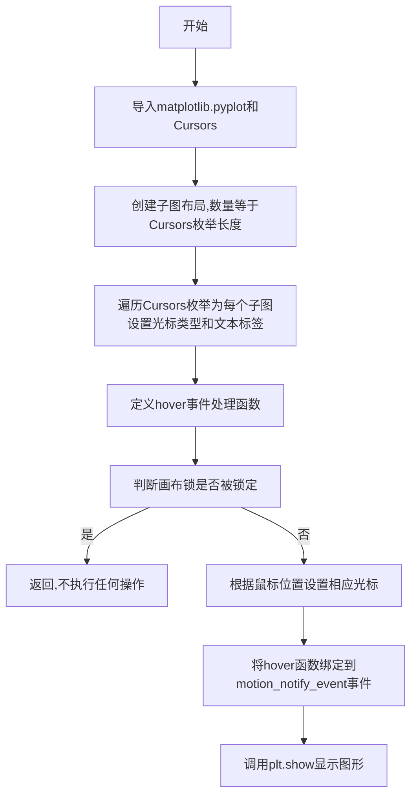
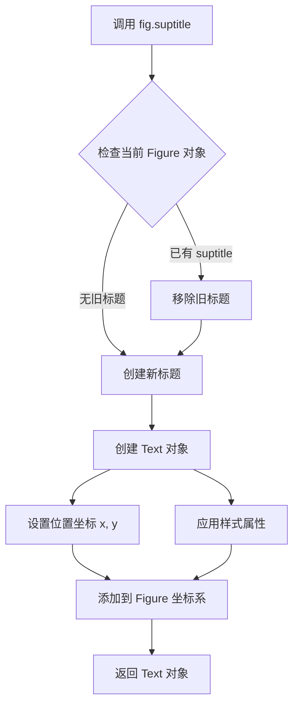
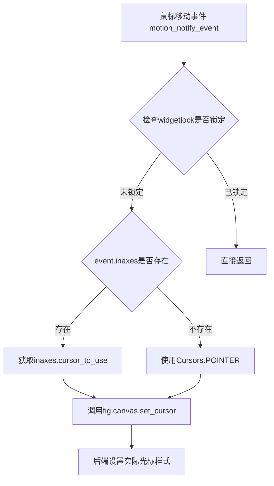
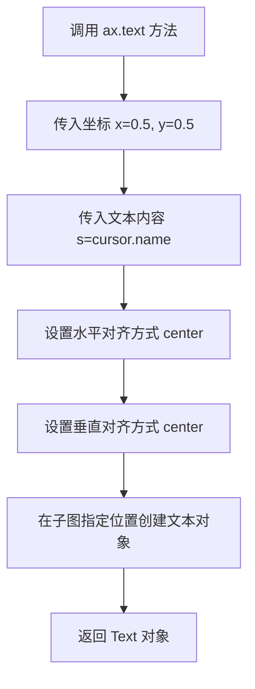
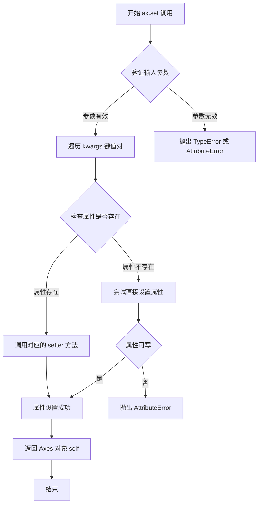
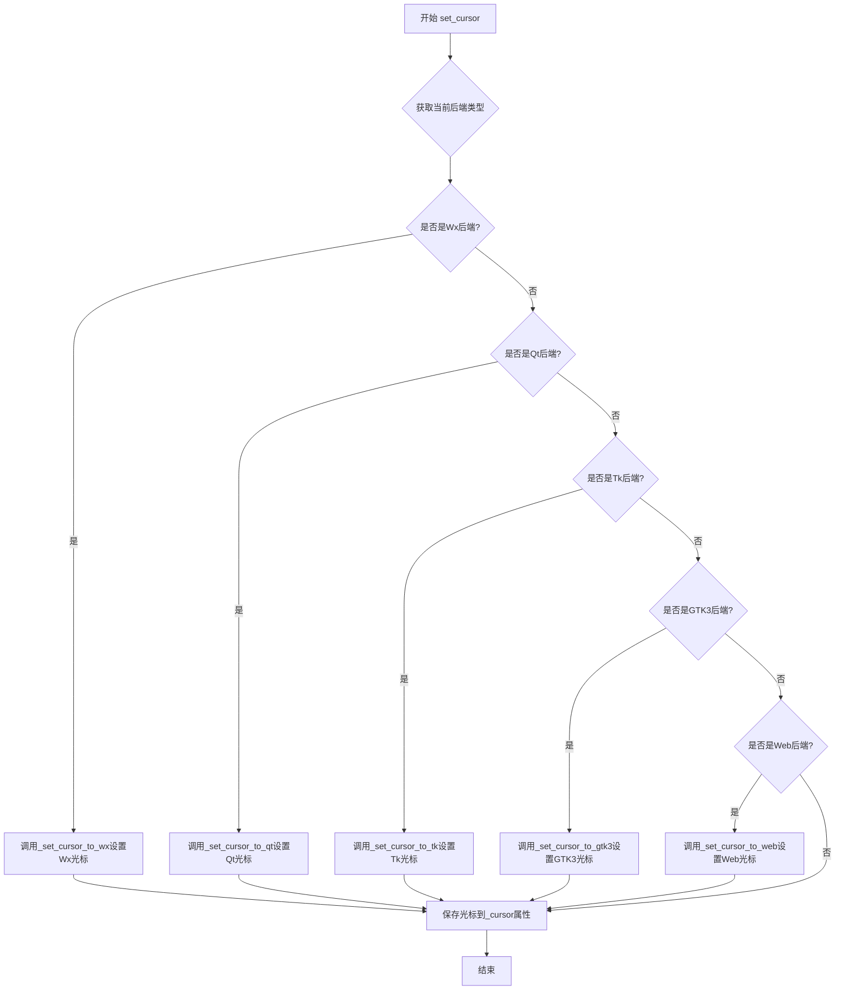
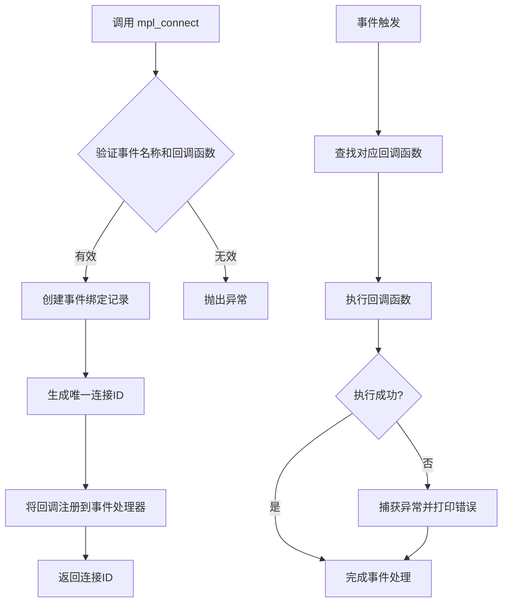
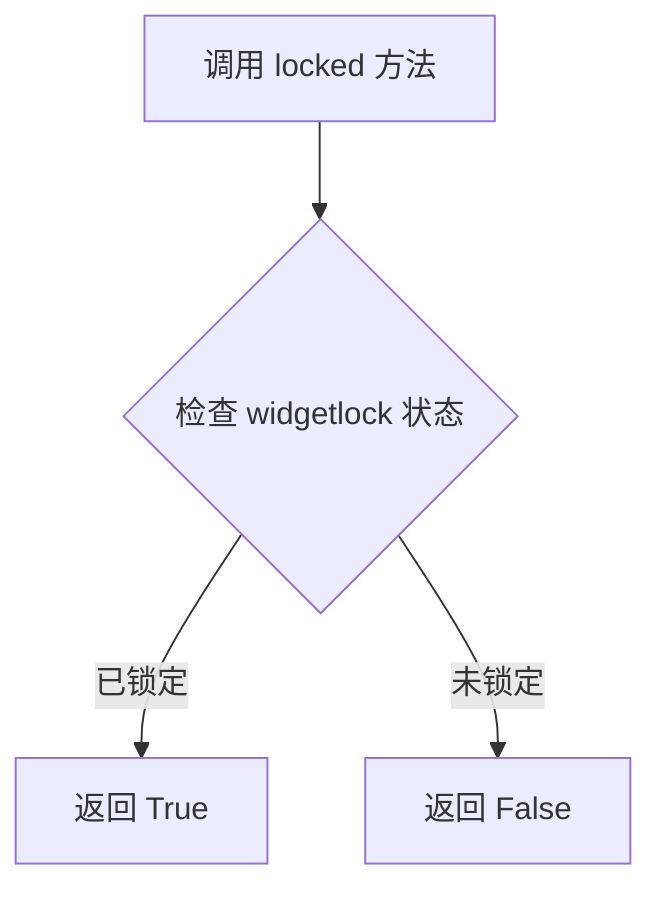
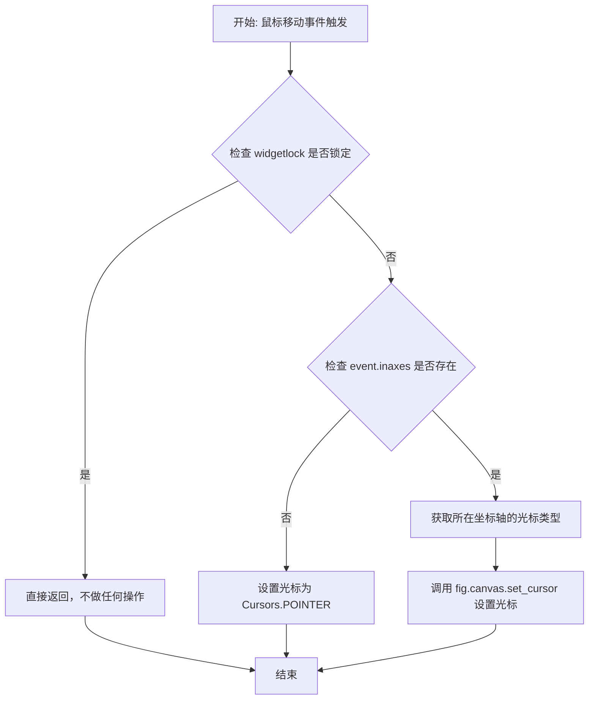

# `matplotlib\galleries\examples\widgets\mouse_cursor.py` 详细设计文档

该代码是一个Matplotlib交互式示例，展示了如何在不同子图上设置替代鼠标光标，并通过监听鼠标移动事件动态更改画布光标类型。

## 整体流程



## 类结构

```
Matplotlib Figure/Axes 层次结构
├── Figure (fig)
│   └── Subplot (axs[]) - 每个子图对应一种Cursors类型
```

## 全局变量及字段


### `fig`
    
Figure对象,整个图形画布

类型：`matplotlib.figure.Figure`
    


### `axs`
    
AxesSubplot数组,存放所有子图

类型：`numpy.ndarray of matplotlib.axes.AxesSubplot`
    


### `cursor`
    
当前遍历的Cursors枚举成员

类型：`matplotlib.backend_tools.Cursors`
    


### `ax`
    
当前遍历的子图对象

类型：`matplotlib.axes.AxesSubplot`
    


### `event`
    
Matplotlib鼠标事件对象

类型：`matplotlib.backend_bases.MouseEvent`
    


### `hover`
    
鼠标悬停事件回调函数,用于根据鼠标位置设置光标

类型：`function(event)`
    


### `matplotlib.axes.Axes.cursor_to_use`
    
每个子图自定义属性,存储该子图对应的光标类型

类型：`matplotlib.backend_tools.Cursors`
    


### `matplotlib.backend_tools.Cursors.Cursors.POINTER`
    
默认指针光标

类型：`Cursors enum`
    


### `matplotlib.backend_tools.Cursors.Cursors.HAND`
    
手型光标,通常表示可点击

类型：`Cursors enum`
    


### `matplotlib.backend_tools.Cursors.Cursors.CROSSHAIR`
    
十字准星光标,用于精确选择

类型：`Cursors enum`
    


### `matplotlib.backend_tools.Cursors.Cursors.TEXT`
    
文本输入光标,I型光标

类型：`Cursors enum`
    


### `matplotlib.backend_tools.Cursors.Cursors.WAIT`
    
等待/加载光标,沙漏或加载图标

类型：`Cursors enum`
    


### `matplotlib.backend_tools.Cursors.Cursors.SPANNING_CROSS`
    
跨区域十字光标,用于选择区域

类型：`Cursors enum`
    


### `matplotlib.backend_tools.Cursors.Cursors.MOVE`
    
移动光标,四向箭头

类型：`Cursors enum`
    


### `matplotlib.backend_tools.Cursors.Cursors.ZOOM_MORE`
    
放大光标,放大镜加号

类型：`Cursors enum`
    


### `matplotlib.backend_tools.Cursors.Cursors.ZOOM_IN`
    
放大光标,放大镜

类型：`Cursors enum`
    


### `matplotlib.backend_tools.Cursors.Cursors.ZOOM_OUT`
    
缩小光标,缩小镜

类型：`Cursors enum`
    
    

## 全局函数及方法


### `plt.subplots`

`plt.subplots` 是 matplotlib.pyplot 模块中的核心函数，用于创建一个包含多个子图的 Figure 对象，并返回 Figure 对象和一个 Axes 对象（或 Axes 数组），支持灵活的子图布局配置。

参数：

- `nrows`：int，可选，子图的行数，默认为 1
- `ncols`：int，可选，子图的列数，默认为 1
- `sharex`：bool or str，可选，是否共享 x 轴，默认为 False
- `sharey`：bool or str，可选，是否共享 y 轴，默认为 False
- `squeeze`：bool，可选，是否压缩返回的 axes 数组，默认为 True
- `width_rights`：array-like，可选，子图宽度的相对比例
- `height_ratios`：array-like，可选，子图高度的相对比例
- `subplot_kw`：dict，可选，传递给 add_subplot 的关键字参数
- `gridspec_kw`：dict，可选，传递给 GridSpec 的关键字参数
- `**fig_kw`：可变关键字参数，传递给 figure() 的关键字参数

返回值：`tuple(Figure, Axes or array of Axes)`，返回创建的 Figure 对象和 Axes 对象（或 Axes 数组）

#### 流程图

```mermaid
flowchart TD
    A[开始 plt.subplots 调用] --> B{传入参数}
    B --> C[创建 GridSpec 布局规格]
    C --> D[调用 figure 创建 Figure 对象]
    D --> E[根据 nrows 和 ncols 创建子图]
    E --> F{gridspec_kw 参数?}
    F -->|是| G[应用 GridSpec 配置]
    F -->|否| H[使用默认布局]
    G --> I[创建 Axes 对象数组]
    H --> I
    I --> J{sharex/sharey 设置?}
    J -->|是| K[配置轴共享属性]
    J -->|否| L[返回 Figure 和 Axes]
    K --> L
    L --> M[结束，返回 (fig, axs)]
```

#### 带注释源码

```python
def subplots(nrows=1, ncols=1, sharex=False, sharey=False, squeeze=True,
             width_ratios=None, height_ratios=None,
             subplot_kw=None, gridspec_kw=None, **fig_kw):
    """
    创建子图布局的函数
    
    参数:
        nrows: int, 子图行数，默认为1
        ncols: int, 子图列数，默认为1
        sharex: bool or str, 是否共享x轴，False/'rows'/'col'/'all'
        sharey: bool or str, 是否共享y轴，False/'rows'/'col'/'all'
        squeeze: bool, 是否压缩返回的axes数组维度
        width_ratios: array-like, 子图宽度的相对比例
        height_ratios: array-like, 子图高度的相对比例
        subplot_kw: dict, 传递给add_subplot的额外参数
        gridspec_kw: dict, 传递给GridSpec的额外参数
        **fig_kw: 传递给figure()的其他关键字参数
    
    返回:
        tuple: (figure, axes) 或 (figure, axes数组)
    """
    
    # 步骤1: 创建Figure对象
    fig = figure(**fig_kw)
    
    # 步骤2: 创建GridSpec对象用于子图布局
    gs = GridSpec(nrows, nrows, 
                  width_ratios=width_ratios,
                  height_ratios=height_ratios,
                  **gridspec_kw)
    
    # 步骤3: 创建axes数组
    axs = np.empty((nrows, ncols), dtype=object)
    
    # 步骤4: 遍历创建每个子图
    for i in range(nrows):
        for j in range(ncols):
            # 使用add_subplot创建子图
            ax = fig.add_subplot(gs[i, j], **subplot_kw)
            axs[i, j] = ax
    
    # 步骤5: 处理轴共享逻辑
    if sharex:
        # 配置x轴共享...
        pass
    if sharey:
        # 配置y轴共享...
        pass
    
    # 步骤6: 根据squeeze参数处理返回值的维度
    if squeeze:
        axs = axs.squeeze()
    
    # 步骤7: 返回结果
    return fig, axs
```

#### 使用示例源码分析

```python
# 从给定的代码示例中提取的 plt.subplots 调用
fig, axs = plt.subplots(len(Cursors), figsize=(6, len(Cursors) + 0.5),
                        gridspec_kw={'hspace': 0})
```

在上述代码中：
- `len(Cursors)` 作为 `nrows` 参数，创建了与 Cursors 枚举成员数量相等的行数
- `figsize=(6, len(Cursors) + 0.5)` 设置图形宽度为6英寸，高度根据光标数量动态计算
- `gridspec_kw={'hspace': 0}` 设置子图之间的垂直间距为0，实现紧凑布局
- 返回的 `fig` 是 Figure 对象，`axs` 是一个包含多个 Axes 对象的数组


### `Figure.suptitle`

设置图形（Figure）的总标题（Super Title），用于在所有子图上方居中显示一个主标题。

参数：

- `s`：`str`，要显示的标题文本内容
- `x`：`float`，标题的横向位置（相对于 subplots 布局的比例，默认 0.5，即居中）
- `y`：`float`，标题的纵向位置（相对于 subplots 布局的比例，默认 0.98，靠近顶部）
- `horizontalalignment` / `ha`：`str`，水平对齐方式，可选 'center'（默认）, 'left', 'right'
- `verticalalignment` / `va`：`str`，垂直对齐方式，可选 'top'（默认）, 'center', 'bottom'
- `fontsize`：`int` 或 `str`，字体大小，如 12, 'large', 'small'
- `fontweight`：`str`，字体粗细，如 'normal', 'bold'
- `fontstyle`：`str`，字体样式，如 'normal', 'italic', 'oblique'
- `color`：`str` 或 `tuple`，标题文本颜色
- `**kwargs`：其他传递给 `matplotlib.text.Text` 的关键字参数

返回值：`matplotlib.text.Text`，返回创建的 Text 文本对象，可用于后续修改标题样式（如颜色、字体等）

#### 流程图



#### 带注释源码

```python
def suptitle(self, s, *args, **kwargs):
    """
    添加一个总标题到子图上方。
    
    参数:
        s: str
            要显示的标题文本。
        x: float, optional
            标题的 x 位置，默认为 0.5（水平居中）。
        y: float, optional
            标题的 y 位置，默认为 0.98（靠近顶部）。
        ha: str, optional
            水平对齐方式，默认为 'center'。
        va: str, optional
            垂直对齐方式，默认为 'top'。
        fontsize: int or str, optional
            字体大小。
        fontweight: int or str, optional
            字体粗细。
        **kwargs:
            其他关键字参数传递给 Text 对象。
    
    返回:
        matplotlib.text.Text
            创建的标题文本对象。
    """
    # 如果已存在 suptitle，先移除旧的
    if self._suptitle is not None:
        self._suptitle.remove()
    
    # 默认参数设置：x=0.5 居中，y=0.98 靠近顶部
    x = kwargs.pop('x', 0.5)
    y = kwargs.pop('y', 0.98)
    
    # 默认对齐方式：水平居中，顶部对齐
    ha = kwargs.pop('ha', 'center')
    va = kwargs.pop('va', 'top')
    
    # 获取 Figure 的 subplotspec 用于定位
    # 使用 gridspec 来确定标题在子图布局中的位置
    if self.subplotspec is not None:
        # 从 gridspec 获取布局信息
        gs = self.subplotpars.hspace if hasattr(self.subplotpars, 'hspace') else 0
    else:
        gs = 0
    
    # 创建 Text 对象，添加到 Figure 的 text 轴上
    # text 轴是专门用于显示文本的坐标系，范围 [0, 1] x [0, 1]
    self._suptitle = self.text(x, y, s,
                                fontsize=kwargs.pop('fontsize', 'large'),
                                fontweight=kwargs.pop('fontweight', 'normal'),
                                ha=ha, va=va,
                                **kwargs)
    
    # 返回创建的 Text 对象，允许用户后续修改
    return self._suptitle
```

#### 使用示例

```python
import matplotlib.pyplot as plt

# 创建 2x2 子图
fig, axs = plt.subplots(2, 2)

# 设置总标题
title = fig.suptitle('Main Title: Data Analysis', 
                     x=0.5,      # 水平居中
                     y=0.98,     # 靠近顶部
                     fontsize=16,
                     fontweight='bold',
                     color='darkblue')

# 可以后续修改标题样式
title.set_color('red')

plt.show()
```


### `Axes.cursor_to_use`

该属性用于存储子图（Axes）使用的光标类型，默认为 `Cursors.HAND`，在鼠标悬停时通过后端方法 `FigureCanvasBase.set_cursor()` 设置实际光标。

属性信息：

- 名称：`cursor_to_use`
- 类型：`matplotlib.backend_tools.Cursors`（枚举类型）
- 所属类：`matplotlib.axes.Axes`
- 描述：子图属性，存储该子图使用的光标类型，用于在鼠标悬停时显示对应的光标样式

参数：无（为类属性，非方法）

返回值：`matplotlib.backend_tools.Cursors`，当前子图配置的光标类型

#### 流程图



#### 带注释源码

```python
# 在 matplotlib.axes.Axes 类中的定义（简化版）

class Axes:
    # ... 其他属性 ...
    
    # cursor_to_use 属性定义
    # 这是一个实例属性，存储当前子图使用的光标类型
    cursor_to_use = Cursors.HAND  # 默认使用 HAND 光标
    
    # 使用示例（在提供的代码中）：
    for cursor, ax in zip(Cursors, axs):
        ax.cursor_to_use = cursor  # 为每个子图设置不同的光标类型
        # 上述代码将 Cursors 枚举中的每个值（如 POINTER, HAND, SELECTION 等）
        # 分配给对应的子图，从而在鼠标悬停时显示不同的光标

# 鼠标事件处理函数中的使用
def hover(event):
    if fig.canvas.widgetlock.locked():
        # 如果 zoom/pan 工具已启用，则不处理光标切换
        return

    # 根据鼠标所在的子图获取其 cursor_to_use 属性
    # 如果鼠标不在任何子图内，则使用默认的 POINTER 光标
    fig.canvas.set_cursor(
        event.inaxes.cursor_to_use if event.inaxes else Cursors.POINTER)
```

#### 补充说明

- **访问方式**：通过 `ax.cursor_to_use` 访问，其中 `ax` 是 `matplotlib.axes.Axes` 实例
- **可修改性**：可写属性，代码中直接赋值 `ax.cursor_to_use = cursor`
- **关联枚举**：`matplotlib.backend_tools.Cursors` 包含多种光标类型，如 `HAND`, `POINTER`, `SELECTION`, `WAIT`, `RESIZE_LR`, `RESIZE_UD` 等
- **实际生效**：需要配合 `FigureCanvasBase.set_cursor()` 方法在鼠标事件中调用才能生效


### `ax.text`

在子图（Axes）上指定位置添加文本标签的方法。

参数：

- `x`：`float`，文本在 Axes 坐标系中的 X 坐标位置
- `y`：`float`，文本在 Axes 坐标系中的 Y 坐标位置
- `s`：`str`，要显示的文本内容
- `horizontalalignment`：`str`，文本在指定坐标点的水平对齐方式（可选，代码中传入 `'center'`）
- `verticalalignment`：`str`，文本在指定坐标点的垂直对齐方式（可选，代码中传入 `'center'`）

返回值：`matplotlib.text.Text`，创建的文本对象，可用于后续修改文本样式或内容

#### 流程图



#### 带注释源码

```python
# 遍历每个光标类型及其对应的子图
for cursor, ax in zip(Cursors, axs):
    # 设置子图使用指定的光标类型
    ax.cursor_to_use = cursor
    
    # 调用 ax.text 方法在子图中心添加文本
    # 参数说明：
    # - 0.5: x 坐标（子图宽度的 50% 位置）
    # - 0.5: y 坐标（子图高度的 50% 位置）
    # - cursor.name: 文本内容（光标类型的名称）
    ax.text(
        0.5,  # x: 水平位置
        0.5,  # y: 垂直位置
        cursor.name,  # s: 要显示的文本
        horizontalalignment='center',  # 水平居中对齐
        verticalalignment='center'      # 垂直居中对齐
    )
```


### `Axes.set`

设置子图（Axes）的属性值，例如刻度、标签、标题等。该方法是matplotlib中用于批量配置Axes对象属性的核心方法，支持通过关键字参数设置x轴刻度、y轴刻度、标题、轴标签等多项属性，并返回 Axes 对象以支持链式调用。

参数：

- `**kwargs`：关键字参数，用于指定要设置的Axes属性。常见的可设置属性包括：
  - `xticks`：`list` 或 `array`，X轴刻度位置
  - `yticks`：`list` 或 `array`，Y轴刻度位置
  - `xlabel`：`str`，X轴标签
  - `ylabel`：`str`，Y轴标签
  - `title`：`str`，子图标题
  - 以及其他Axes属性如`xlim`, `ylim`, `aspect`等

返回值：`matplotlib.axes.Axes`，返回自身（Axes对象），支持链式调用。

#### 流程图



#### 带注释源码

```python
def set(self, *args, **kwargs):
    """
    设置Axes对象的属性。
    
    参数:
        *args: 位置参数（已废弃，仅保留兼容性）
        **kwargs: 关键字参数，用于设置Axes的各种属性
                 例如：xticks, yticks, xlabel, ylabel, title等
    
    返回值:
        Axes: 返回自身，允许链式调用
    
    示例:
        >>> ax.set(title='My Title', xlabel='X Axis')
        >>> ax.set(xticks=[0, 1, 2], yticks=[0, 0.5, 1])
    """
    # 遍历所有关键字参数
    for attr, value in kwargs.items():
        # 获取对应的setter方法名（如 'xticks' -> set_xticks）
        method_name = f'set_{attr}'
        
        # 检查对象是否有该方法
        if hasattr(self, method_name):
            # 调用对应的setter方法
            getattr(self, method_name)(value)
        else:
            # 如果没有对应的setter，尝试直接设置属性
            if hasattr(self, attr):
                setattr(self, attr, value)
            else:
                # 属性不存在，抛出属性错误
                raise AttributeError(f"'Axes' object has no attribute '{attr}'")
    
    # 返回self以支持链式调用
    return self
```

**在示例代码中的具体使用：**

```python
# 在提供的示例代码中，ax.set() 的实际调用如下：
ax.set(xticks=[], yticks=[])

# 等价于分别调用：
# ax.set_xticks([])
# ax.set_yticks([])
# 这两个方法会清空X轴和Y轴的刻度线
```


### `FigureCanvasBase.set_cursor`

设置matplotlib图形画布的光标类型，根据不同的后端（Qt、Wx等）将指定的光标样式应用到画布上。

参数：

- `cursor`：`Cursors`，matplotlib后端工具枚举类型，指定要设置的光标类型（如POINTER、HAND、WAIT等）

返回值：`None`，该方法无返回值，仅执行光标设置操作

#### 流程图



#### 带注释源码

```python
def set_cursor(self, cursor):
    """
    Set the cursor for the figure canvas.

    This method sets the cursor type for the canvas. It supports multiple
    backend implementations and stores the cursor value internally.

    Parameters
    ----------
    cursor : Cursors
        The cursor to use. Should be one of the Cursors enumeration values
        such as Cursors.POINTER, Cursors.HAND, Cursors.WAIT, etc.

    Returns
    -------
    None

    Notes
    -----
    Different backends may have different cursor implementations.
    This method dispatches to the appropriate backend-specific method
    if available, otherwise stores the cursor value for later use.
    """
    # Store the cursor value internally for reference
    self._cursor = cursor

    # Check if running with Wx backend and update Wx cursor
    if self._get_wx_running():
        self._set_cursor_to_wx(self._cursor)
    # Check if running with Qt backend and update Qt cursor
    elif self._get_qt_running():
        self._set_cursor_to_qt(self._cursor)
    # Check if running with Tk backend and update Tk cursor
    elif self._get_tk_running():
        self._set_cursor_to_tk(self._cursor)
    # Check if running with GTK3 backend and update GTK3 cursor
    elif self._get_gtk3_running():
        self._set_cursor_to_gtk3(self._cursor)
    # Check if running with Web backend and update Web cursor
    elif self._get_web_backend():
        self._set_cursor_to_web(self._cursor)
    # For other backends, just store the cursor value
    # (e.g., macosx, notebook backends)
```


### `FigureCanvasBase.mpl_connect`

该方法是 Matplotlib 中 FigureCanvasBase 类的成员方法，用于将回调函数绑定到特定的 Matplotlib 事件（如鼠标移动、按键点击等），返回一个连接 ID 用于后续事件解绑。

参数：

- `event_name`：`str`，要监听的事件名称，如 `'motion_notify_event'`（鼠标移动）、`'button_press_event'`（鼠标按下）等
- `func`：`callable`，事件触发时调用的回调函数，接受一个 `Matplotlib` 事件对象作为参数
- `pickle`：`bool`，可选参数，是否允许序列化该回调（默认为 `True`）

返回值：`int`，连接标识符，用于后续调用 `mpl_disconnect` 断开该事件绑定

#### 流程图



#### 带注释源码

```python
# 绑定 'motion_notify_event'（鼠标移动事件）到 hover 回调函数
# mpl_connect 方法签名: mpl_connect(event_name, func)
fig.canvas.mpl_connect('motion_notify_event', hover)

# 完整方法调用解析：
# 参数1: 'motion_notify_event' - str类型，事件名称
#         可选事件包括: 'button_press_event', 'button_release_event',
#         'motion_notify_event', 'key_press_event', 'key_release_event',
#         'scroll_event', 'figure_enter_event', 'figure_leave_event' 等
# 参数2: hover - callable类型，回调函数
#         该函数接收一个 Matplotlib Event 对象作为参数
# 返回值: int类型的连接ID，可用于 fig.canvas.mpl_disconnect(cid) 断开连接

# 示例回调函数 hover 的实现：
def hover(event):
    """鼠标移动事件回调函数"""
    # 检查画布是否被工具锁定（如缩放/平移工具启用时）
    if fig.canvas.widgetlock.locked():
        return  # 直接返回，不处理事件

    # 根据鼠标所在的坐标轴设置对应的光标类型
    # event.inaxes: 鼠标所在的 Axes 对象，如果不在任何 Axes 内则为 None
    fig.canvas.set_cursor(
        event.inaxes.cursor_to_use if event.inaxes else Cursors.POINTER
    )
    # set_cursor 方法用于设置画布的鼠标光标样式
```


### `fig.canvas.widgetlock.locked`

检查画布是否被锁定，用于确定是否禁用了交互功能（如缩放/平移工具）。

参数：

- 无参数

返回值：`bool`，如果画布被锁定（zoom/pan 工具已启用）则返回 `True`，否则返回 `False`。

#### 流程图



#### 带注释源码

```python
def locked(self):
    """
    Check if the canvas is locked (i.e., if zoom/pan tools are enabled).
    
    This method is part of the WidgetLock class in matplotlib's backend system.
    It returns a boolean indicating whether any interactive tools have locked
    the canvas, preventing other interactive operations like cursor changes.
    
    Returns:
        bool: True if the canvas is locked, False otherwise.
    """
    # In matplotlib's implementation, this typically checks if any lock
    # is currently active on the canvas. When locked, certain operations
    # (like changing cursor on hover) should be skipped.
    return self._lock > 0  # Returns True if lock count is greater than 0
```

#### 使用示例

在给定的代码中，该方法用于鼠标移动事件处理：

```python
def hover(event):
    if fig.canvas.widgetlock.locked():  # 检查画布是否被锁定
        # 如果 zoom/pan 工具已启用，则不执行任何操作
        return

    # 只有在画布未锁定时才设置光标
    fig.canvas.set_cursor(
        event.inaxes.cursor_to_use if event.inaxes else Cursors.POINTER)
```

#### 备注

- **用途**：防止在启用缩放/平移工具时执行冲突的交互操作
- **调用场景**：通常在处理鼠标事件（motion_notify_event、button_press_event 等）前检查
- **内部机制**：通过计数器机制实现，支持多次锁定和释放


### `hover`

自定义鼠标移动事件处理函数，用于在鼠标移动时根据当前所在的坐标轴显示不同的光标样式。

参数：

- `event`：`matplotlib.backend_bases.Event`，鼠标事件对象，包含鼠标位置信息

返回值：`None`，无返回值

#### 流程图



#### 带注释源码

```python
def hover(event):
    """
    自定义鼠标移动事件处理函数
    当鼠标在图形上移动时，根据当前所在的坐标轴显示对应的光标样式
    """
    # 检查画布的widgetlock是否被锁定
    # 如果锁定（例如正在进行缩放或平移操作），则不执行任何操作
    if fig.canvas.widgetlock.locked():
        # Don't do anything if the zoom/pan tools have been enabled.
        return

    # 根据鼠标所在的坐标轴设置相应的光标
    # 如果鼠标在某个坐标轴内，使用该坐标轴指定的光标类型
    # 如果鼠标不在任何坐标轴内，使用默认的POINTER光标
    fig.canvas.set_cursor(
        event.inaxes.cursor_to_use if event.inaxes else Cursors.POINTER)
```

## 关键组件


### Cursors 枚举类

定义 Matplotlib 后端支持的各种鼠标光标类型，如 POINTER、HAND、WAIT、CROSSHAIR 等，用于在图形交互时提供视觉反馈。

### FigureCanvasBase.set_cursor 方法

Matplotlib 后端方法，根据传入的光标类型动态更改画布上的鼠标光标形状，实现交互式光标切换功能。

### motion_notify_event 事件

Matplotlib 的鼠标移动事件，当鼠标在画布上移动时触发，用于实时检测鼠标位置并响应光标变化。

### Axes.cursor_to_use 属性

每个子图（Axes）自定义的光标属性，用于存储该区域应该显示的光标类型，实现分区光标管理。

### fig.canvas.widgetlock 锁定机制

画布的widgetlock用于锁定画布交互，当缩放/平移工具启用时阻止光标更改，防止工具操作与光标切换冲突。

### 事件处理链路

鼠标移动 → hover 回调 → 检查 widgetlock → 判断 inaxes → 读取 cursor_to_use → 调用 set_cursor 切换光标


## 问题及建议


### 已知问题

-   **自定义属性污染**: 使用 `ax.cursor_to_use` 作为自定义属性附加到 Axes 对象上，这种动态添加属性的方式不符合良好的面向对象设计，可能导致IDE无法识别、类型检查失败，且难以维护。
-   **魔法数字**: `gridspec_kw={'hspace': 0}` 中的参数硬编码，缺乏可配置性。
-   **缺少类型提示**: 代码没有任何类型注解，降低了代码的可读性和可维护性。
-   **阻塞式调用**: 使用 `plt.show()` 是阻塞调用，在某些应用场景下可能导致GUI无法正常响应或集成到其他应用时出现问题。
-   **无错误处理**: `hover` 函数未对异常情况进行防御性编程，例如 `event.inaxes` 属性不存在时的处理。
-   **事件处理函数作用域**: `hover` 函数定义在模块级别，但如果需要多个图形实例，该函数无法轻松复用。

### 优化建议

-   **封装为类**: 将光标管理逻辑封装到一个类中，使用实例属性存储光标映射关系，避免污染 Axes 对象。
-   **添加类型提示**: 为函数参数和返回值添加类型注解，提升代码可读性。
-   **配置化**: 将布局参数和默认光标等提取为配置常量或参数。
-   **非阻塞显示**: 考虑使用 `plt.show(block=False)` 并配合适当的事件循环，或在非交互环境中使用 `fig.savefig()` 代替。
-   **防御性编程**: 在 `hover` 函数中添加对 `event` 对象属性的检查，确保必要的属性存在。
-   **清理资源**: 添加注释说明如何断开事件连接，或提供清理函数。


## 其它


### 设计目标与约束

本示例的设计目标是演示如何在Matplotlib中为FigureCanvas上的不同Axes区域设置不同的鼠标光标类型，以便在用户鼠标悬停在不同图表区域时提供视觉反馈。设计约束包括：必须使用matplotlib.backend_tools.Cursors中定义的光标类型；示例为交互式程序，必须在支持图形界面的环境中运行；受widgetlock机制限制，当缩放/平移工具启用时，光标设置功能将被禁用。

### 错误处理与异常设计

代码中包含的错误处理逻辑体现在对widgetlock的检查：当zoom/pan工具启用时（widgetlock.locked()返回True），hover事件处理函数直接返回，不执行任何光标设置操作。此外，代码对event.inaxes进行了空值检查，当鼠标不在任何Axes内时，使用默认的Cursors.POINTER光标。潜在的异常情况包括：matplotlib后端不支持某些光标类型（但Cursors枚举已涵盖所有支持类型）；FigureCanvas.set_cursor方法在某些后端可能不受支持。

### 数据流与状态机

数据流方面，程序首先初始化Figure和Axes列表，然后为每个Ax设置cursor_to_use属性存储对应的光标类型。事件触发时，hover函数接收motion_notify_event事件，获取event.inaxes对象，读取其cursor_to_use属性，最后调用fig.canvas.set_cursor设置实际光标。状态机表现为两个状态：正常状态（widgetlock未锁定）下根据鼠标位置动态切换光标；锁定状态（zoom/pan启用）下不响应光标切换。

### 外部依赖与接口契约

主要外部依赖包括matplotlib.pyplot模块（用于创建图表）、matplotlib.backend_tools.Cursors枚举类（定义可用的光标类型）、matplotlib.backend_bases.FigureCanvasBase.set_cursor方法（实际设置光标的接口）。接口契约方面：cursor_to_use属性应为Cursors枚举类型的值；hover函数接收的event对象应具有inaxes属性；fig.canvas应支持set_cursor方法调用。

### 性能考虑

代码性能开销较小，每次鼠标移动事件触发时仅执行属性读取和方法调用。由于使用if fig.canvas.widgetlock.locked()进行早期返回，当工具锁定时可避免后续计算。光标类型存储在Ax对象的cursor_to_use属性中，避免了每次事件触发时的枚举查找。潜在优化空间：对于大型Figure，可考虑使用更高效的事件过滤机制减少事件触发频率。

### 兼容性考虑

本示例兼容所有支持Matplotlib图形后端的环境（Qt、GTK、MacOSX、WebAgg等）。Cursors枚举定义了跨平台的光标类型，set_cursor方法在各个后端均有实现。代码使用了标准的mpl_connect事件机制，确保与Matplotlib各版本兼容。需要注意的是，某些后端可能对光标类型的支持有所差异，具体行为取决于后端实现。

### 配置与扩展性

代码可通过以下方式进行扩展：可以在Ax对象上添加自定义光标类型的映射逻辑；可以通过修改hover函数实现更复杂的光标切换策略（如根据数据点位置、图表类型等）；可以添加其他事件类型（如click、key_press）的光标响应逻辑。当前实现将光标类型硬编码为cursor_to_use属性，未来可考虑通过配置文件或参数传入光标映射字典。

### 测试策略

由于这是交互式示例，自动化测试相对有限。可行的测试策略包括：验证Cursors枚举包含所有预期光标类型；验证所有Axes正确初始化cursor_to_use属性；验证hover函数在各种输入下的行为（mock event对象）；验证widgetlock锁定时函数正确返回。手动测试需要在图形环境中运行并移动鼠标观察光标变化。

### 使用示例与演示

代码创建了包含所有Cursors类型数量的子图布局，每个子图中央显示对应光标的名称。当用户将鼠标悬停在某个子图上时，该区域的光标会变为对应的类型。例如，悬停在包含"HAND"文本的子图上时，光标将变为手型图标。演示效果直观展示了Matplotlib提供的各种系统光标类型在图表中的实际应用。

### 版本历史与变更日志

本代码为Matplotlib官方示例库的一部分，初始版本用于展示FigureCanvasBase.set_cursor方法的使用。后续可能根据Matplotlib后端API的变更进行相应调整。示例代码保持了简洁的演示风格，重点突出核心功能接口的使用方法。

    