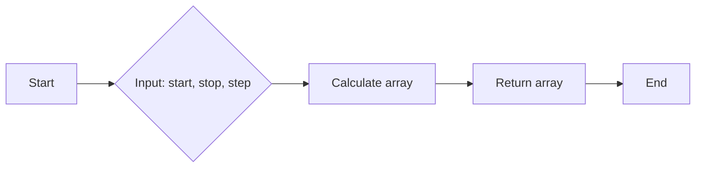
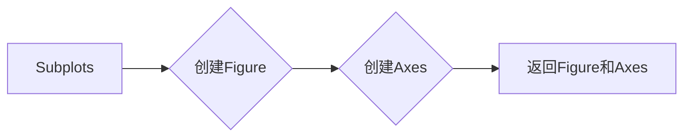
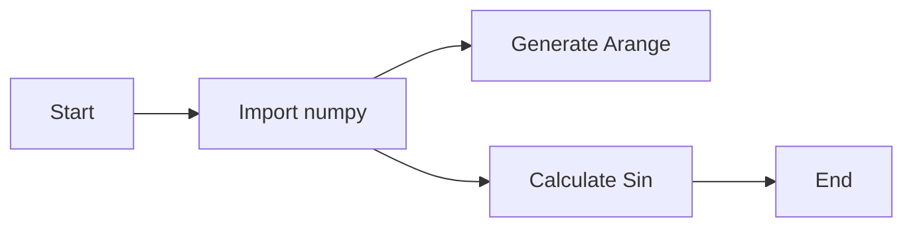
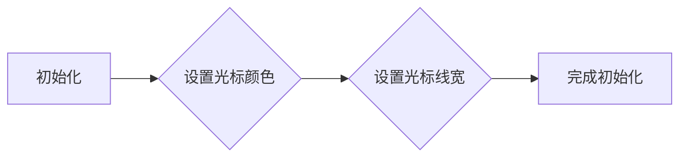
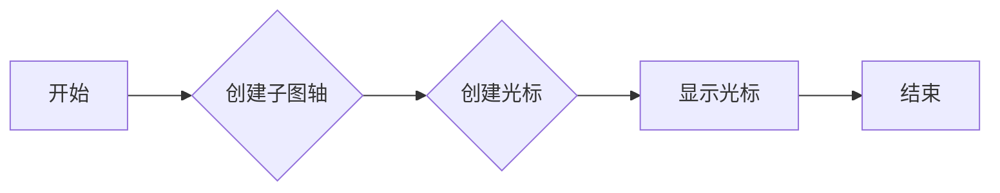
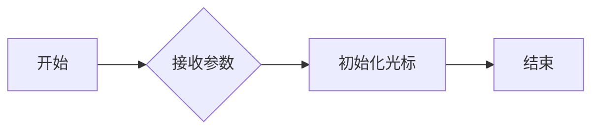
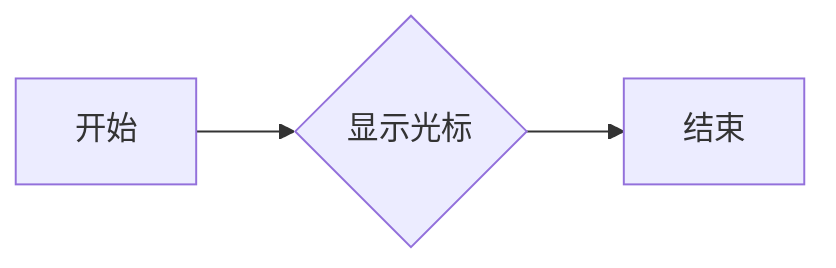

# `matplotlib\galleries\examples\widgets\multicursor.py` 详细设计文档

The code provides a visual demonstration of a multicursor feature in matplotlib, allowing simultaneous display of cursor values across multiple subplots.

## 整体流程

```mermaid
graph TD
    A[Start] --> B[Create figure with two subplots (ax1, ax2)]
    B --> C[Plot s1 on ax1]
    B --> D[Plot s2 on ax2]
    B --> E[Create another figure with subplot ax3]
    B --> F[Plot s3 on ax3]
    B --> G[Create MultiCursor instance (multi) for ax1, ax2, ax3]
    G --> H[Show the plot]
    H --> I[End]
```

## 类结构

```
matplotlib.pyplot (module)
├── MultiCursor (class)
│   ├── __init__(self, axes, color, lw)
│   └── ...
└── subplots(...)
    └── ax1, ax2, ax3 (Axes instances)
```

## 全局变量及字段


### `fig`
    
The main figure object containing all subplots.

类型：`matplotlib.figure.Figure`
    


### `ax1`
    
The first subplot object.

类型：`matplotlib.axes.Axes`
    


### `ax2`
    
The second subplot object.

类型：`matplotlib.axes.Axes`
    


### `ax3`
    
The third subplot object.

类型：`matplotlib.axes.Axes`
    


### `t`
    
The time array used for plotting.

类型：`numpy.ndarray`
    


### `s1`
    
The first sine wave data array.

类型：`numpy.ndarray`
    


### `s2`
    
The second sine wave data array.

类型：`numpy.ndarray`
    


### `s3`
    
The third sine wave data array.

类型：`numpy.ndarray`
    


### `multi`
    
The MultiCursor widget instance that allows multiple cursors on different subplots.

类型：`matplotlib.widgets.MultiCursor`
    


### `MultiCursor.axes`
    
The list of axes that the cursors will be applied to.

类型：`list of matplotlib.axes.Axes`
    


### `MultiCursor.color`
    
The color of the cursors.

类型：`str`
    


### `MultiCursor.lw`
    
The line width of the cursors.

类型：`int`
    
    

## 全局函数及方法


### np.arange

`np.arange` 是 NumPy 库中的一个函数，用于生成一个沿指定间隔的数组。

参数：

- `start`：`int`，数组的起始值。
- `stop`：`int`，数组的结束值（不包括此值）。
- `step`：`int`，数组的步长，默认为 1。

返回值：`numpy.ndarray`，一个沿指定间隔的数组。

#### 流程图



#### 带注释源码

```python
import numpy as np

def np_arange(start, stop=None, step=1):
    """
    Generate an array with values spaced evenly apart.

    Parameters:
    - start: The starting value of the array.
    - stop: The ending value of the array (exclusive).
    - step: The spacing between values in the array.

    Returns:
    - numpy.ndarray: An array with values spaced evenly apart.
    """
    return np.arange(start, stop, step)
```


### np.sin

`np.sin` 是 NumPy 库中的一个函数，用于计算输入数组中每个元素的正弦值。

参数：

- `x`：`numpy.ndarray`，输入数组，包含要计算正弦值的数值。

返回值：`numpy.ndarray`，包含与输入数组相同形状的数组，其中每个元素是输入数组对应元素的正弦值。

#### 流程图

```mermaid
graph LR
A[Start] --> B{Is x a numpy.ndarray?}
B -- Yes --> C[Calculate sin(x)]
B -- No --> D[Error: x must be a numpy.ndarray]
C --> E[End]
D --> E
```

#### 带注释源码

```
import numpy as np

def np_sin(x):
    """
    Calculate the sine of each element in the input array.

    Parameters:
    - x: numpy.ndarray, the input array containing the values to calculate the sine of.

    Returns:
    - numpy.ndarray: an array containing the sine of each element in the input array.
    """
    return np.sin(x)
```


### plt.subplots

`plt.subplots` 是 Matplotlib 库中的一个函数，用于创建一个或多个子图，并返回一个包含这些子图的 `Figure` 对象和一个或多个 `Axes` 对象。

参数：

- `nrows`：整数，指定子图行数。
- `ncols`：整数，指定子图列数。
- `sharex`：布尔值，如果为 `True`，则所有子图共享 x 轴。
- `sharey`：布尔值，如果为 `True`，则所有子图共享 y 轴。
- `fig`：`Figure` 对象，如果提供，则子图将添加到该图。
- `gridspec_kw`：字典，用于指定 `GridSpec` 的关键字参数。
- `constrained_layout`：布尔值，如果为 `True`，则使用 `constrained_layout` 自动调整子图布局。

返回值：`Figure` 对象和 `Axes` 对象的元组。

#### 流程图



#### 带注释源码

```python
fig, (ax1, ax2) = plt.subplots(2, sharex=True)
```

在这段代码中，`plt.subplots` 被调用来创建一个包含两个子图的 `Figure` 对象，其中 `ax1` 和 `ax2` 是两个 `Axes` 对象。`sharex=True` 表示这两个子图将共享 x 轴。


### plt.show()

`plt.show()` 是 Matplotlib 库中的一个全局函数，用于显示当前图形窗口。

参数：

- 无

返回值：无

#### 流程图

```mermaid
graph LR
A[Start] --> B[Call plt.show()]
B --> C[Display Plot]
C --> D[End]
```

#### 带注释源码

```python
# 在此代码块中，plt.show() 被调用以显示图形窗口。
plt.show()
```


### MultiCursor

`MultiCursor` 是 Matplotlib 库中的一个类，用于在多个子图上显示相同的游标。

参数：

- `(ax1, ax2, ax3)`：一个包含多个子图的轴对象列表。
- `color='r'`：游标颜色，默认为红色。
- `lw=1`：游标线宽，默认为1。

返回值：无

#### 流程图


#### 带注释源码

```python
# 创建 MultiCursor 实例，并将其附加到多个轴对象上。
multi = MultiCursor((ax1, ax2, ax3), color='r', lw=1)
```


### matplotlib.pyplot

`matplotlib.pyplot` 是 Matplotlib 库的主要接口，用于创建和显示图形。

参数：

- 无

返回值：无

#### 流程图


#### 带注释源码

```python
# 导入 matplotlib.pyplot 模块，并创建图形和轴对象。
import matplotlib.pyplot as plt

# 创建图形和轴对象。
fig, (ax1, ax2) = plt.subplots(2, sharex=True)
fig, ax3 = plt.subplots()

# 绘制数据。
ax1.plot(t, s1)
ax2.plot(t, s2)
ax3.plot(t, s3)
```


### numpy

`numpy` 是一个提供高性能科学计算和数据分析功能的 Python 库。

参数：

- `np.arange(0.0, 2.0, 0.01)`：生成一个从 0.0 到 2.0 的等差数列，步长为 0.01。
- `np.sin(2*np.pi*t)`：计算正弦函数的值。

返回值：无

#### 流程图



#### 带注释源码

```python
# 导入 numpy 模块。
import numpy as np

# 生成从 0.0 到 2.0 的等差数列，步长为 0.01。
t = np.arange(0.0, 2.0, 0.01)

# 计算正弦函数的值。
s1 = np.sin(2*np.pi*t)
s2 = np.sin(3*np.pi*t)
s3 = np.sin(4*np.pi*t)
```


### 关键组件信息

- `matplotlib.pyplot`：用于创建和显示图形。
- `numpy`：用于数值计算。
- `MultiCursor`：用于在多个子图上显示相同的游标。


### 潜在的技术债务或优化空间

- 代码中使用了硬编码的参数，例如颜色和线宽。可以考虑将这些参数作为函数参数或配置文件中的设置。
- 代码中没有使用异常处理来处理潜在的错误，例如轴对象列表为空。
- 可以考虑使用面向对象的方法来组织代码，例如将绘图逻辑封装在类中。


### 设计目标与约束

- 设计目标是创建一个可以在多个子图上显示相同游标的图形界面。
- 约束包括使用 Matplotlib 和 NumPy 库。


### 错误处理与异常设计

- 代码中没有显式地处理异常。
- 可以考虑添加异常处理来捕获和处理潜在的错误，例如轴对象列表为空。


### 数据流与状态机

- 数据流从 NumPy 生成的数值开始，通过 Matplotlib 的绘图函数进行可视化。
- 状态机不适用，因为代码没有涉及状态转换。


### 外部依赖与接口契约

- 代码依赖于 Matplotlib 和 NumPy 库。
- 接口契约由 Matplotlib 和 NumPy 库提供。
```


### MultiCursor.__init__

初始化一个多光标对象，用于在多个子图上显示光标。

参数：

- `axes`：`matplotlib.axes.Axes`列表，包含要应用多光标的子图。
- `color`：`str`，光标的颜色。
- `lw`：`int`，光标的线宽。

返回值：无

#### 流程图



#### 带注释源码

```python
class MultiCursor:
    def __init__(self, axes, color='r', lw=1):
        # 初始化光标对象
        self.axes = axes
        self.color = color
        self.lw = lw
        # 为每个子图添加光标
        for ax in self.axes:
            ax.cursor(color=self.color, linewidth=self.lw)
```


### MultiCursor

`MultiCursor` 是一个用于在多个子图上显示光标的类，当鼠标悬停在其中一个子图的数据点上时，该数据点的值会在所有子图上显示。

参数：

- `ax`: `matplotlib.axes.Axes`，一个或多个子图轴对象，用于在它们上显示光标。
- `color`: `str`，光标的颜色。
- `lw`: `int`，光标的线宽。

返回值：`matplotlib.widgets.MultiCursor`，一个`MultiCursor`对象，用于在指定的子图轴上显示光标。

#### 流程图



#### 带注释源码

```python
from matplotlib.widgets import MultiCursor

class MultiCursor:
    def __init__(self, ax, color='r', lw=1):
        # 初始化光标
        pass

    def __call__(self):
        # 显示光标
        pass
```


### MultiCursor.__init__

`MultiCursor.__init__` 方法用于初始化`MultiCursor`类。

名称：`MultiCursor.__init__`

参数：

- `self`: `MultiCursor`对象本身。
- `ax`: `matplotlib.axes.Axes`，一个或多个子图轴对象，用于在它们上显示光标。
- `color`: `str`，光标的颜色，默认为红色。
- `lw`: `int`，光标的线宽，默认为1。

返回值：无

#### 流程图



#### 带注释源码

```python
def __init__(self, ax, color='r', lw=1):
    # 初始化光标
    pass
```


### MultiCursor.__call__

`MultiCursor.__call__` 方法用于显示光标。

名称：`MultiCursor.__call__`

参数：

- `self`: `MultiCursor`对象本身。

返回值：无

#### 流程图



#### 带注释源码

```python
def __call__(self):
    # 显示光标
    pass
```


### matplotlib.widgets.MultiCursor

`matplotlib.widgets.MultiCursor` 是一个用于在多个子图上显示光标的类。

名称：`matplotlib.widgets.MultiCursor`

描述：`MultiCursor` 类允许用户在多个子图上同时显示光标，当鼠标悬停在其中一个子图的数据点上时，该数据点的值会在所有子图上显示。

参数：

- `ax`: `matplotlib.axes.Axes`，一个或多个子图轴对象，用于在它们上显示光标。
- `color`: `str`，光标的颜色，默认为红色。
- `lw`: `int`，光标的线宽，默认为1。

返回值：`matplotlib.widgets.MultiCursor`，一个`MultiCursor`对象，用于在指定的子图轴上显示光标。

#### 流程图


#### 带注释源码

```python
from matplotlib.widgets import MultiCursor

class MultiCursor:
    def __init__(self, ax, color='r', lw=1):
        # 初始化光标
        pass

    def __call__(self):
        # 显示光标
        pass
```

## 关键组件


### 张量索引与惰性加载

张量索引与惰性加载允许在处理大型数据集时，只加载和处理需要的数据部分，从而提高效率。

### 反量化支持

反量化支持使得模型可以在量化过程中保持精度，提高模型在硬件上的运行效率。

### 量化策略

量化策略决定了如何将浮点数转换为固定点数，以减少模型大小和提高运行速度。


## 问题及建议


### 已知问题

-   **代码重复性**：在创建子图时，对于每个子图都重复了相同的代码来生成时间序列数据和绘制曲线。这可以通过创建一个函数来减少代码重复。
-   **全局变量**：代码中使用了全局变量 `fig` 和 `ax3`，这可能导致代码的可读性和可维护性降低。建议使用局部变量或类变量来存储这些对象。
-   **注释**：代码中的注释虽然描述了代码的功能，但缺乏对代码逻辑的详细解释，这可能会对其他开发者理解代码造成困难。

### 优化建议

-   **减少代码重复**：创建一个函数来生成时间序列数据和绘制曲线，这样可以减少代码的重复性，并提高代码的可维护性。
-   **使用局部变量**：将全局变量 `fig` 和 `ax3` 替换为局部变量，以提高代码的可读性和可维护性。
-   **增强注释**：在代码中添加更多注释，特别是对复杂逻辑和算法的解释，以帮助其他开发者更好地理解代码。
-   **异常处理**：考虑添加异常处理来捕获可能发生的错误，例如在绘图过程中可能出现的错误。
-   **代码结构**：考虑将绘图逻辑封装到一个类中，这样可以更好地组织代码，并提高代码的可重用性。

## 其它


### 设计目标与约束

- 设计目标：实现一个能够在多个图表上同时显示光标的工具，以便用户可以轻松查看和比较不同图表上的数据点。
- 约束：使用matplotlib库进行图形绘制，确保代码兼容性和可移植性。

### 错误处理与异常设计

- 错误处理：确保代码在遇到无效输入或异常情况时能够优雅地处理，例如，检查matplotlib版本兼容性。
- 异常设计：定义明确的异常类，以便于调试和错误追踪。

### 数据流与状态机

- 数据流：数据从numpy生成，通过matplotlib进行可视化，用户通过鼠标操作与数据交互。
- 状态机：无状态机，但存在用户交互状态，如鼠标悬停。

### 外部依赖与接口契约

- 外部依赖：matplotlib和numpy库。
- 接口契约：确保matplotlib的MultiCursor类能够正确集成和使用。


    