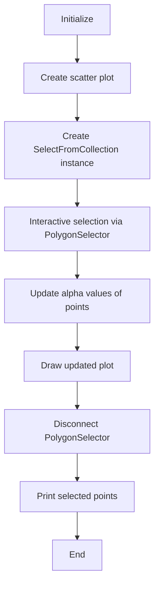
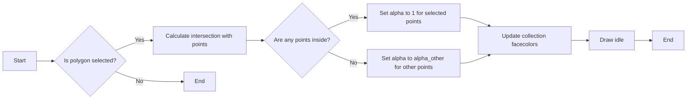
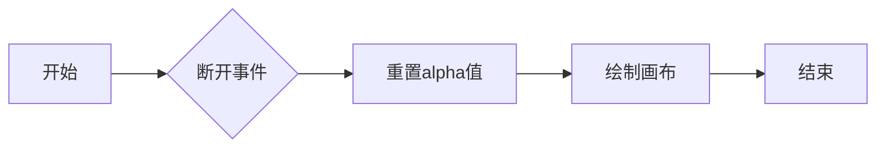
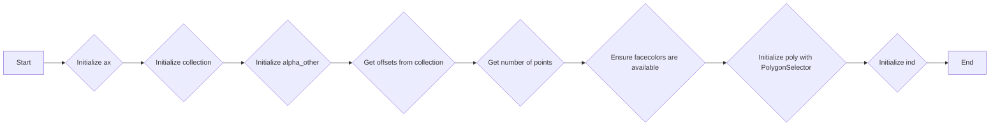
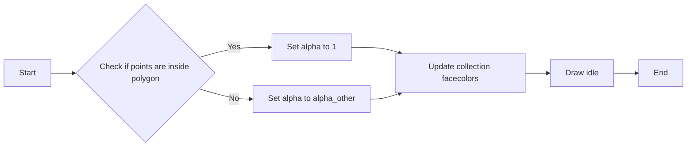
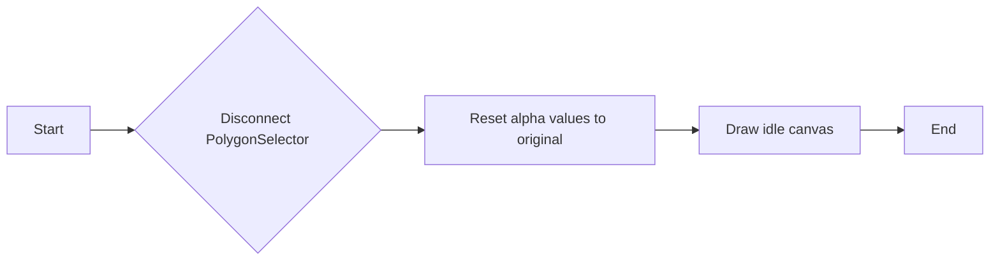

# `matplotlib\galleries\examples\widgets\polygon_selector_demo.py` 详细设计文档

This code provides a tool for selecting indices from a matplotlib collection using `PolygonSelector`. It allows interactive selection of points within a polygon and modifies the alpha values of the selected and non-selected points accordingly.

## 整体流程



## 类结构

```
SelectFromCollection (主类)
├── matplotlib (外部库)
│   ├── widgets (模块)
│   │   └── PolygonSelector (类)
│   └── path (模块)
│       └── Path (类)
└── numpy (外部库)
    └── np (模块)
```

## 全局变量及字段


### `grid_size`
    
The size of the grid used to create points for the scatter plot.

类型：`int`
    


### `grid_x`
    
The x-coordinates of the grid points.

类型：`numpy.ndarray`
    


### `grid_y`
    
The y-coordinates of the grid points.

类型：`numpy.ndarray`
    


### `pts`
    
The scatter plot collection of points.

类型：`matplotlib.collections.Collection`
    


### `selector`
    
The instance of SelectFromCollection used for selecting points from the collection.

类型：`SelectFromCollection`
    


### `verts`
    
The vertices of the polygon used for selection.

类型：`list of tuples`
    


### `path`
    
The Path object representing the polygon used for selection.

类型：`matplotlib.path.Path`
    


### `ind`
    
The indices of the selected points in the collection.

类型：`numpy.ndarray`
    


### `fc`
    
The face colors of the points in the collection.

类型：`numpy.ndarray`
    


### `alpha_other`
    
The alpha value for non-selected points in the collection.

类型：`float`
    


### `xys`
    
The (x, y) coordinates of the points in the collection.

类型：`numpy.ndarray`
    


### `Npts`
    
The number of points in the collection.

类型：`int`
    


### `canvas`
    
The canvas of the matplotlib figure.

类型：`matplotlib.backends.backend_agg.FigureCanvasAgg`
    


### `collection`
    
The collection to be selected from.

类型：`matplotlib.collections.Collection`
    


### `poly`
    
The PolygonSelector widget used for selecting points.

类型：`matplotlib.widgets.PolygonSelector`
    


### `ind`
    
The indices of the selected points in the collection.

类型：`list`
    


### `SelectFromCollection.canvas`
    
The canvas of the matplotlib figure.

类型：`matplotlib.backends.backend_agg.FigureCanvasAgg`
    


### `SelectFromCollection.collection`
    
The collection to be selected from.

类型：`matplotlib.collections.Collection`
    


### `SelectFromCollection.alpha_other`
    
The alpha value for non-selected points in the collection.

类型：`float`
    


### `SelectFromCollection.xys`
    
The (x, y) coordinates of the points in the collection.

类型：`numpy.ndarray`
    


### `SelectFromCollection.Npts`
    
The number of points in the collection.

类型：`int`
    


### `SelectFromCollection.fc`
    
The face colors of the points in the collection.

类型：`numpy.ndarray`
    


### `SelectFromCollection.poly`
    
The PolygonSelector widget used for selecting points.

类型：`matplotlib.widgets.PolygonSelector`
    


### `SelectFromCollection.ind`
    
The indices of the selected points in the collection.

类型：`list`
    
    

## 全局函数及方法


### SelectFromCollection.onselect

This method is called by the `PolygonSelector` when a polygon is selected in the figure. It updates the alpha values of the points in the collection based on whether they are inside the selected polygon.

参数：

- `verts`：`numpy.ndarray`，The vertices of the selected polygon.

返回值：`None`，This method does not return any value.

#### 流程图



#### 带注释源码

```python
def onselect(self, verts):
    path = Path(verts)
    self.ind = np.nonzero(path.contains_points(self.xys))[0]
    self.fc[:, -1] = self.alpha_other
    self.fc[self.ind, -1] = 1
    self.collection.set_facecolors(self.fc)
    self.canvas.draw_idle()
```


### `SelectFromCollection.disconnect`

断开与matplotlib交互的连接，并重置集合的alpha值。

参数：

- `self`：`SelectFromCollection`对象，当前实例

返回值：无

#### 流程图



#### 带注释源码

```python
def disconnect(self):
    # 断开事件
    self.poly.disconnect_events()
    
    # 重置alpha值
    self.fc[:, -1] = 1
    self.collection.set_facecolors(self.fc)
    
    # 绘制画布
    self.canvas.draw_idle()
``` 


### SelectFromCollection.__init__

This method initializes the `SelectFromCollection` class, setting up the necessary components for selecting indices from a matplotlib collection using `PolygonSelector`.

参数：

- `ax`：`~matplotlib.axes.Axes`，The axes to interact with.
- `collection`：`matplotlib.collections.Collection` subclass，The collection you want to select from.
- `alpha_other`：`0 <= float <= 1`，To highlight a selection, this tool sets all selected points to an alpha value of 1 and non-selected points to *alpha_other*.

返回值：无

#### 流程图



#### 带注释源码

```python
def __init__(self, ax, collection, alpha_other=0.3):
    # Initialize the canvas of the axes
    self.canvas = ax.figure.canvas
    
    # Set the collection to be selected from
    self.collection = collection
    
    # Set the alpha value for non-selected points
    self.alpha_other = alpha_other
    
    # Get the coordinates of the points in the collection
    self.xys = collection.get_offsets()
    
    # Get the number of points in the collection
    self.Npts = len(self.xys)
    
    # Ensure that we have separate colors for each object
    self.fc = collection.get_facecolors()
    if len(self.fc) == 0:
        raise ValueError('Collection must have a facecolor')
    elif len(self.fc) == 1:
        self.fc = np.tile(self.fc, (self.Npts, 1))
    
    # Create a PolygonSelector to select points
    self.poly = PolygonSelector(ax, self.onselect, draw_bounding_box=True)
    
    # Initialize the list of selected indices
    self.ind = []
```


### SelectFromCollection.onselect

This method is called when a polygon is selected in the `PolygonSelector`. It determines which points in the collection are inside the selected polygon and updates the alpha values of the points accordingly.

参数：

- `verts`：`numpy.ndarray`，The vertices of the selected polygon.

返回值：`None`，This method does not return a value.

#### 流程图



#### 带注释源码

```python
def onselect(self, verts):
    path = Path(verts)
    self.ind = np.nonzero(path.contains_points(self.xys))[0]
    self.fc[:, -1] = self.alpha_other
    self.fc[self.ind, -1] = 1
    self.collection.set_facecolors(self.fc)
    self.canvas.draw_idle()
```


### SelectFromCollection.disconnect

This method disconnects the `PolygonSelector` from the events and resets the alpha values of the collection to their original state.

参数：

- `self`：`SelectFromCollection`对象，表示当前实例

返回值：无

#### 流程图



#### 带注释源码

```python
def disconnect(self):
    # Disconnect the PolygonSelector from the events
    self.poly.disconnect_events()
    
    # Reset the alpha values to their original state
    self.fc[:, -1] = 1
    self.collection.set_facecolors(self.fc)
    
    # Draw the canvas to update the display
    self.canvas.draw_idle()
```


## 关键组件


### 张量索引与惰性加载

张量索引与惰性加载是代码中用于从集合中选择索引的关键组件。它允许在用户交互式选择多边形时，仅对选定的点进行操作，而不是对整个集合进行操作，从而提高效率。

### 反量化支持

反量化支持是代码中用于处理量化策略的关键组件。它确保在量化过程中，选定的点能够正确地反映其原始值，而不是被量化后的值。

### 量化策略

量化策略是代码中用于调整选定点alpha值的关键组件。它允许根据选定的点是否在多边形内来调整alpha值，从而实现视觉上的高亮显示。


## 问题及建议


### 已知问题

-   **全局变量和函数的缺失**：代码中没有使用全局变量或全局函数，因此不存在此类问题。
-   **异常处理**：代码中没有包含异常处理机制，如果发生错误（例如，matplotlib版本不兼容），程序可能会崩溃。
-   **代码重用性**：`SelectFromCollection` 类的设计使其紧密耦合于 matplotlib 的 `Axes` 和 `Collection` 类，这可能限制了其在其他上下文中的重用性。

### 优化建议

-   **异常处理**：添加异常处理来捕获可能发生的错误，并提供用户友好的错误消息。
-   **代码封装**：将 `SelectFromCollection` 类的依赖性封装在内部，使其更加通用，以便在其他图形库或环境中使用。
-   **文档和注释**：增加详细的文档和代码注释，以提高代码的可读性和可维护性。
-   **性能优化**：如果处理大量点，考虑优化 `contains_points` 方法的性能，因为该方法是计算密集型的。
-   **用户反馈**：提供实时反馈，例如高亮显示选中的点，以增强用户体验。
-   **测试**：编写单元测试以确保代码的稳定性和可靠性。


## 其它


### 设计目标与约束

- 设计目标：实现一个交互式工具，允许用户从matplotlib集合中选择索引。
- 约束：
  - 必须使用matplotlib库中的`PolygonSelector`。
  - 选择操作应基于集合对象的原始位置。
  - 选择后，非选中点的透明度应降低。

### 错误处理与异常设计

- 当集合没有面颜色时，抛出`ValueError`。
- 当用户尝试选择不在集合原始位置内的点时，不执行任何操作。
- 当用户断开连接时，恢复所有点的原始透明度。

### 数据流与状态机

- 数据流：用户通过鼠标操作选择点，状态机根据用户的选择更新点的透明度。
- 状态：
  - 初始状态：所有点透明度正常。
  - 选择状态：部分点透明度降低，部分点透明度提高。

### 外部依赖与接口契约

- 依赖：matplotlib库。
- 接口契约：
  - `SelectFromCollection`类应接受matplotlib的`Axes`对象和集合对象作为参数。
  - `onselect`方法应接受多边形顶点作为参数，并更新集合的透明度。
  - `disconnect`方法应断开事件连接并恢复所有点的透明度。

### 测试与验证

- 测试：确保选择功能按预期工作，包括透明度更改和错误处理。
- 验证：通过用户测试确保工具的易用性和准确性。

### 性能考虑

- 性能：确保工具在处理大量点时仍能保持响应性。
- 资源：避免不必要的内存使用，确保工具在资源有限的环境中也能运行。

### 安全性

- 安全：确保工具不会因为用户输入而崩溃或执行恶意操作。
- 验证：确保所有用户输入都经过验证，防止注入攻击。

### 维护与扩展

- 维护：确保代码清晰、易于理解，便于未来的维护。
- 扩展：设计应允许未来添加新功能，如支持更多类型的集合或选择模式。


    