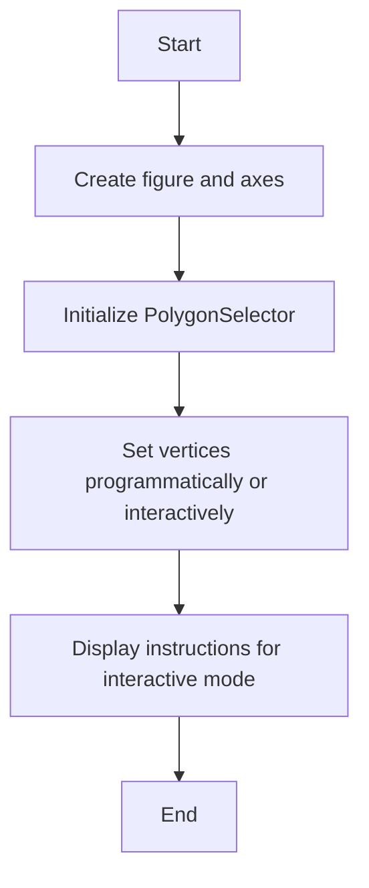
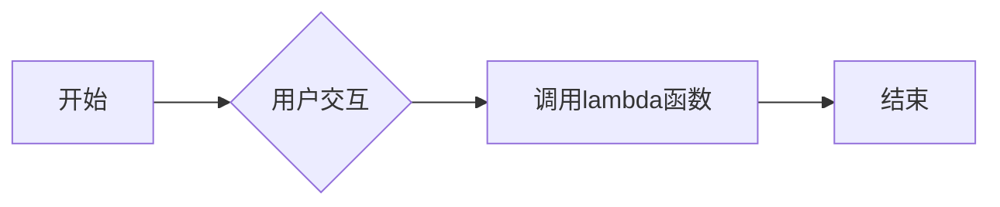
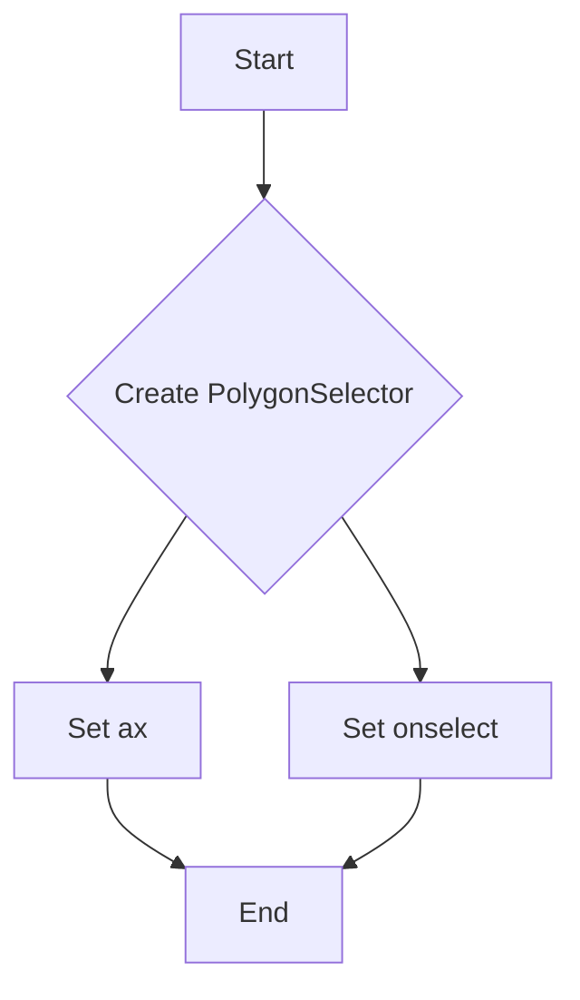
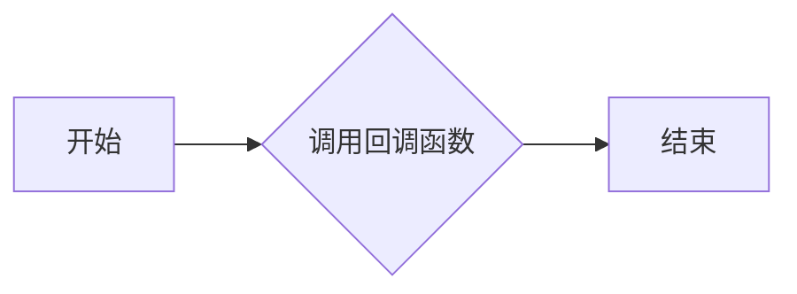
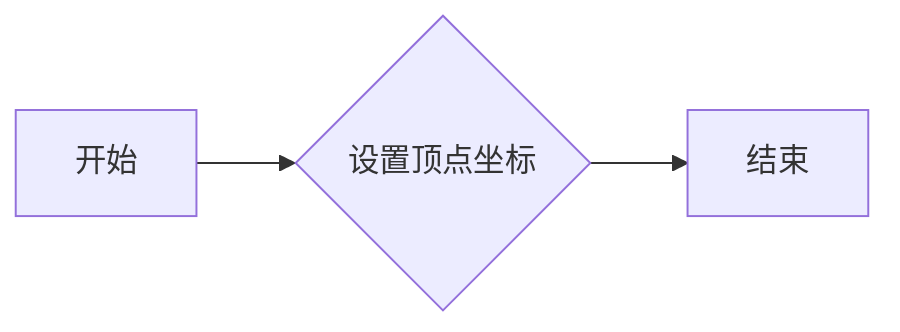
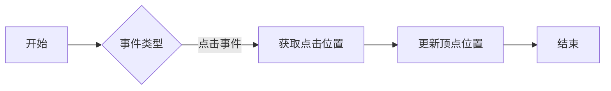
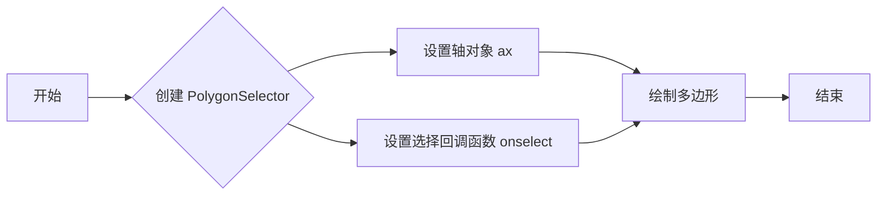

# `matplotlib\galleries\examples\widgets\polygon_selector_simple.py` 详细设计文档

This code provides functionality to create polygons programmatically or interactively using the PolygonSelector from the matplotlib.widgets module.

## 整体流程



## 类结构

```
matplotlib.widgets.PolygonSelector (Component)
```

## 全局变量及字段


### `fig`
    
The main figure object for the plot.

类型：`matplotlib.figure.Figure`
    


### `ax`
    
The axes object where the polygon will be drawn.

类型：`matplotlib.axes.Axes`
    


### `selector`
    
The PolygonSelector object for creating a polygon interactively.

类型：`matplotlib.widgets.PolygonSelector`
    


### `selector2`
    
The PolygonSelector object for creating a polygon interactively in a separate figure.

类型：`matplotlib.widgets.PolygonSelector`
    


### `matplotlib.widgets.PolygonSelector.verts`
    
List of vertices that define the polygon.

类型：`list of tuples`
    
    

## 全局函数及方法


### lambda *args: None

该匿名函数用于matplotlib.widgets.PolygonSelector的回调，当用户与图形交互时被调用。

参数：

- `*args`：`None`，无特定参数，但可以接收任意数量的额外参数。

返回值：`None`，函数不返回任何值。

#### 流程图



#### 带注释源码

```python
selector = PolygonSelector(ax, lambda *args: None)
# lambda函数被用作PolygonSelector的回调函数，当用户与图形交互时，该函数将被调用。
# 由于函数体为空，因此没有具体的代码块。
```


### `PolygonSelector.__init__`

`PolygonSelector` 类的构造函数，用于创建一个多边形选择器。

参数：

- `ax`：`matplotlib.axes.Axes`，用于绘制多边形的轴对象。
- `onselect`：`callable`，当多边形被选中时调用的函数。

返回值：无

#### 流程图



#### 带注释源码

```python
import matplotlib.pyplot as plt

from matplotlib.widgets import PolygonSelector

class PolygonSelector:
    def __init__(self, ax, onselect=lambda *args: None):
        # Initialize the PolygonSelector with the given axis and onselect function
        self.ax = ax
        self.onselect = onselect
        # ... (additional initialization code)
```


### PolygonSelector.draw

`PolygonSelector.draw` 方法用于绘制多边形。

参数：

- `*args`：任意数量的位置参数，这些参数将被传递给回调函数。

返回值：无

#### 流程图



#### 带注释源码

```python
# 假设以下代码是 PolygonSelector 类的一部分，draw 方法可能如下所示：

def draw(self, *args):
    """
    绘制多边形。

    参数：
    *args: 任意数量的位置参数，这些参数将被传递给回调函数。

    返回值：无
    """
    # 获取回调函数
    callback = self.callback

    # 调用回调函数，传递位置参数
    callback(*args)
```


### PolygonSelector.verts

`verts` 是 `matplotlib.widgets.PolygonSelector` 类的一个属性，用于设置多边形的顶点坐标。

参数：

- 无

返回值：`列表`，包含多边形的顶点坐标，每个坐标是一个元组 `(x, y)`。

#### 流程图



#### 带注释源码

```python
# Add three vertices
selector.verts = [(0.1, 0.4), (0.5, 0.9), (0.3, 0.2)]
```

在这段代码中，`selector.verts` 被设置为包含三个顶点坐标的列表，这些顶点坐标定义了多边形的形状。


### PolygonSelector.onpick

`PolygonSelector.onpick` 方法是 `matplotlib.widgets.PolygonSelector` 类的一个方法，用于处理交互式绘图中的点击事件。

参数：

- `event`：`matplotlib.event.Event`，表示点击事件的详细信息。

返回值：无

#### 流程图



#### 带注释源码

```python
from matplotlib.widgets import PolygonSelector

class PolygonSelector:
    # ... 其他代码 ...

    def onpick(self, event):
        """
        处理点击事件。

        :param event: matplotlib.event.Event 对象，包含事件信息。
        """
        # 根据事件类型处理点击事件
        if event.inaxes == self.ax:
            # 获取点击位置
            x, y = event.xdata, event.ydata
            # 更新顶点位置
            self.verts.append((x, y))
            # ... 其他处理 ...
```


### PolygonSelector

`PolygonSelector` 是一个用于在matplotlib图形中创建和选择多边形的工具。

参数：

- `ax`：`matplotlib.axes.Axes`，用于绘制多边形的轴对象。
- `onselect`：`callable`，当多边形被选择时调用的函数。

返回值：`matplotlib.widgets.PolygonSelector`，多边形选择器对象。

#### 流程图



#### 带注释源码

```python
import matplotlib.pyplot as plt
from matplotlib.widgets import PolygonSelector

# 创建图形和轴对象
fig, ax = plt.subplots()

# 创建 PolygonSelector 实例
selector = PolygonSelector(ax, lambda *args: None)

# 设置多边形顶点
selector.verts = [(0.1, 0.4), (0.5, 0.9), (0.3, 0.2)]
```


## 关键组件


### 张量索引与惰性加载

张量索引与惰性加载是用于在创建多边形时处理顶点坐标的方法，它允许在不需要立即计算整个多边形的情况下，仅对需要的部分进行计算。

### 反量化支持

反量化支持是用于处理多边形顶点坐标的一种技术，它允许在创建多边形时使用非整数坐标值。

### 量化策略

量化策略是用于将非整数坐标值转换为整数坐标值的方法，以确保多边形在绘图时能够正确显示。

## 问题及建议


### 已知问题

-   **代码复用性低**：代码中创建了多个 `PolygonSelector` 实例，但每个实例都只是简单地展示了如何使用，没有进行代码复用。
-   **交互性描述不足**：虽然代码提供了交互性操作的描述，但没有提供错误处理或用户反馈机制，例如用户点击错误位置时的提示。
-   **文档注释缺失**：代码中缺少详细的文档注释，难以理解代码的用途和实现细节。

### 优化建议

-   **封装功能**：将 `PolygonSelector` 的创建和使用封装到一个类中，提高代码复用性。
-   **增加错误处理**：在交互式操作中增加错误处理，例如用户点击错误位置时给出提示，并允许用户重新尝试。
-   **完善文档注释**：为代码添加详细的文档注释，包括每个函数和类的用途、参数和返回值描述。
-   **优化用户体验**：考虑添加更多的交互性功能，如动态显示当前选择的顶点、显示顶点坐标等，以增强用户体验。
-   **代码结构优化**：将代码分解为更小的函数或模块，以提高代码的可读性和可维护性。


## 其它


### 设计目标与约束

- 设计目标：实现一个能够通过编程或交互式方式创建多边形的工具。
- 约束条件：使用matplotlib库进行图形绘制，确保代码简洁且易于理解。

### 错误处理与异常设计

- 错误处理：在用户交互过程中，如果用户未正确点击或操作，应提供友好的错误提示。
- 异常设计：对于matplotlib库可能抛出的异常，应进行捕获并给出相应的错误信息。

### 数据流与状态机

- 数据流：用户点击创建多边形，数据流从用户输入到matplotlib的PolygonSelector。
- 状态机：交互式创建多边形时，状态可能包括等待点击、移动顶点、结束创建等。

### 外部依赖与接口契约

- 外部依赖：matplotlib库。
- 接口契约：PolygonSelector类提供的方法和属性，如verts、add_vertex等。


    