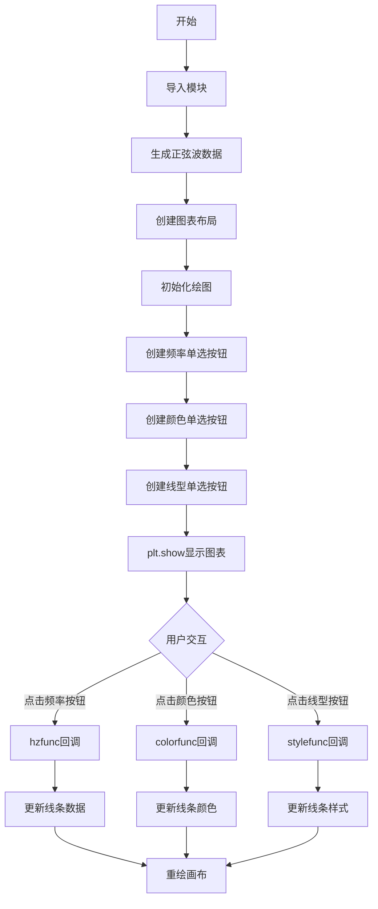
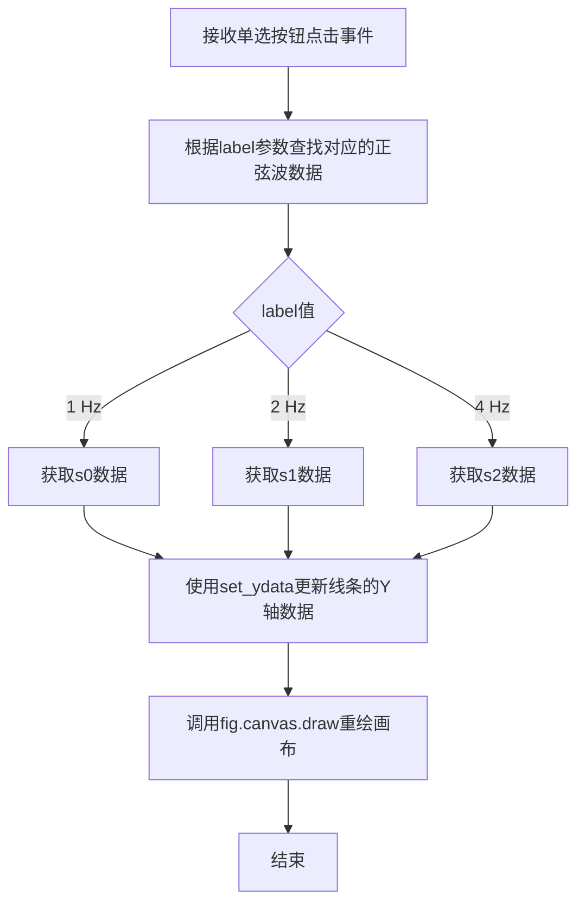
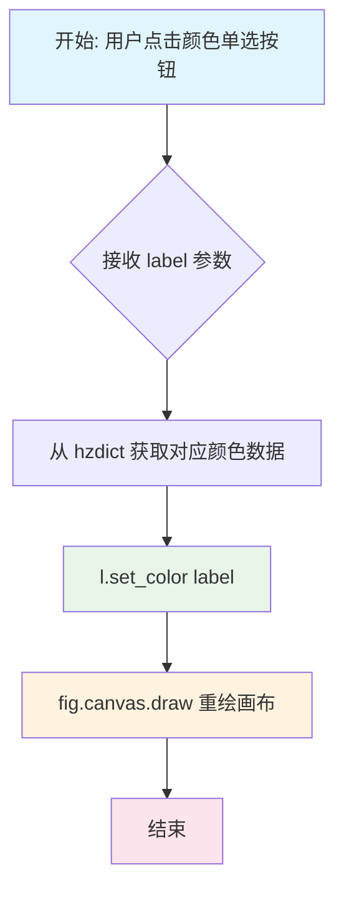
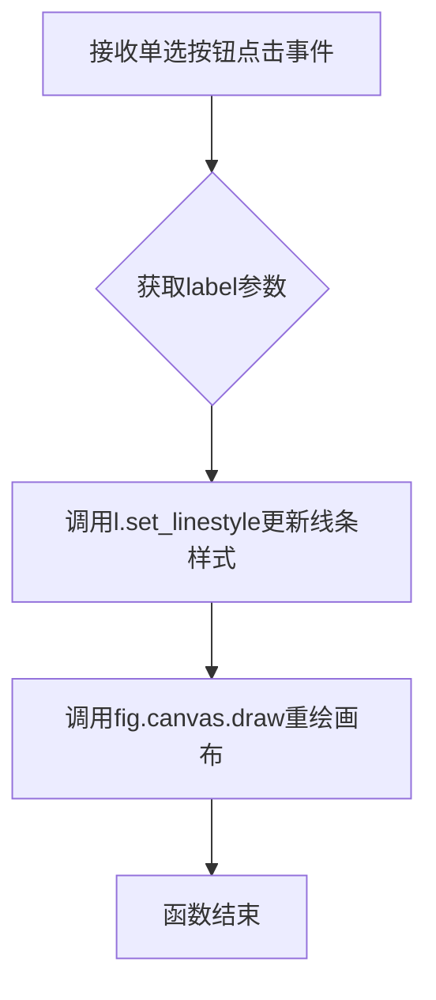

# `matplotlib\galleries\examples\widgets\radio_buttons.py` 详细设计文档

这是一个Matplotlib单选按钮示例程序，通过三个RadioButtons组件分别控制图表显示的正弦波频率、线条颜色和线型，实现交互式图表属性调节功能。

## 整体流程



## 类结构

```
脚本文件（非面向对象）
└── 全局函数/回调函数
    ├── hzfunc (频率切换)
    ├── colorfunc (颜色切换)
    └── stylefunc (线型切换)
```

## 全局变量及字段


### `t`
    
时间轴数组，范围0.0到2.0

类型：`numpy.ndarray`
    


### `s0`
    
1Hz频率的正弦波数据

类型：`numpy.ndarray`
    


### `s1`
    
2Hz频率的正弦波数据

类型：`numpy.ndarray`
    


### `s2`
    
4Hz频率的正弦波数据

类型：`numpy.ndarray`
    


### `fig`
    
图表主对象

类型：`matplotlib.figure.Figure`
    


### `ax`
    
子图字典，包含main/freq/color/linestyle四个子图

类型：`dict`
    


### `l`
    
图表中的线条对象

类型：`matplotlib.lines.Line2D`
    


### `radio_background`
    
单选按钮组的背景色配置

类型：`str`
    


    

## 全局函数及方法


### hzfunc

处理频率单选按钮点击事件，根据用户选择的频率标签更新图表中的线条数据，并重新绘制图表以显示对应的正弦波。

参数：

- `label`：`str`，单选按钮的标签，表示用户选择的频率选项（如"1 Hz"、"2 Hz"或"4 Hz"）

返回值：`None`，该函数仅执行图表更新操作，不返回任何值

#### 流程图



#### 带注释源码

```python
def hzfunc(label):
    """
    处理频率单选按钮点击事件的回调函数
    
    参数:
        label (str): 单选按钮的标签，值为'1 Hz', '2 Hz' 或 '4 Hz'
    
    返回:
        None
    
    说明:
        当用户点击频率单选按钮时，此函数会被调用。
        函数根据label参数从预定义的字典中获取对应的正弦波数据，
        然后更新图表线条的Y轴数据，并重绘画布以显示更新后的图表。
    """
    # 定义频率标签与对应正弦波数据的映射字典
    # 1 Hz 对应 s0 = sin(2*pi*t)
    # 2 Hz 对应 s1 = sin(4*pi*t)
    # 4 Hz 对应 s2 = sin(8*pi*t)
    hzdict = {'1 Hz': s0, '2 Hz': s1, '4 Hz': s2}
    
    # 根据用户选择的标签获取对应的正弦波数据
    ydata = hzdict[label]
    
    # 使用matplotlib的set_ydata方法更新线条对象的Y轴数据
    # 这里 l 是通过 ax['main'].plot() 创建的线条对象
    l.set_ydata(ydata)
    
    # 调用canvas的draw方法重新绘制整个图表
    # 这是一个关键步骤，确保更新后的数据能够在图表中显示出来
    fig.canvas.draw()
```


### `colorfunc`

处理颜色单选按钮点击事件的回调函数，当用户点击颜色单选按钮时，该函数会被触发，更新 plot 中线条的颜色属性并重新绘制画布以显示新颜色。

参数：

- `label`：`str`，单选按钮的标签值，表示用户选择的颜色（如 'red'、'blue'、'green'）

返回值：`None`，该函数无返回值，通过副作用（设置颜色和重绘画布）完成功能

#### 流程图



#### 带注释源码

```python
def colorfunc(label):
    """
    颜色单选按钮点击事件处理函数
    
    参数:
        label (str): 单选按钮的标签，代表用户选择的颜色名称
                     可选值包括 'red', 'blue', 'green'
    
    返回:
        None: 无返回值，通过修改全局对象状态完成功能
    
    全局变量:
        l: matplotlib.lines.Line2D 对象，绑定的线条对象
        fig: matplotlib.figure.Figure 对象，当前图形对象
    """
    # 获取用户选择的颜色标签，并设置为线条的颜色
    # set_color 方法会更新 Line2D 对象的颜色属性
    l.set_color(label)
    
    # 调用 canvas.draw() 重新绘制整个画布
    # 这会触发 matplotlib 的重绘流程，使颜色变更立即可见
    # 在交互式后端中，这会更新图形窗口的显示
    fig.canvas.draw()
```


### `stylefunc`

处理线型单选按钮点击事件的回调函数，根据用户选择的线型标签更新绘图线条的样式，并刷新画布以显示更改。

参数：

- `label`：`str`，被点击的单选按钮的标签文本，表示用户选择的线条样式（如 `'-'`、`'--'`、`'-.'`、':' 等）

返回值：`None`，该函数无返回值，仅通过副作用（修改图表外观）完成功能

#### 流程图



#### 带注释源码

```python
def stylefunc(label):
    """
    处理线型单选按钮点击事件的回调函数
    
    参数:
        label: str, 被点击的单选按钮标签，代表用户选择的线型
    
    返回:
        None
    """
    # 根据label设置折线的线条样式
    # label可为: '-', '--', '-.', ':' 等
    l.set_linestyle(label)
    
    # 刷新画布以显示更新后的线条样式
    fig.canvas.draw()
```

## 关键组件


### RadioButtons (matplotlib.widgets)

Matplotlib的单选按钮小部件，用于在可视化中提供多个互斥选项供用户选择，支持自定义标签和单选按钮的样式属性。

### RadioButtons 回调函数 (hzfunc, colorfunc, stylefunc)

当用户点击单选按钮时触发的回调函数，分别用于更改plot的频率数据、颜色和线型，通过直接修改线对象属性并调用fig.canvas.draw()实现实时更新。

### 线对象更新机制

通过l.set_ydata(), l.set_color(), l.set_linestyle()方法动态修改plot线条的属性，实现图表的交互式更新，无需重新创建图表。

### 布局管理系统 (subplot_mosaic)

使用subplot_mosaic创建2x2的网格布局，左侧为主图表区域，右侧为三个垂直排列的单选按钮面板，通过width_ratios控制宽度比例。

### 属性配置系统 (label_props, radio_props)

提供细粒度的小部件样式定制能力，支持为每个按钮独立设置颜色、字体大小、标记大小等属性，采用字典形式配置。

### 图表数据数组 (t, s0, s1, s2)

预计算的三组不同频率的正弦波数据数组，作为RadioButtons的选项对应数据源，实现不同频率波形的切换显示。


## 问题及建议


### 已知问题

-   **硬编码数据源**：s0、s1、s2变量名缺乏语义化表达，且频率数据与标签('1 Hz', '2 Hz', '4 Hz')分离存储在hzdict中，容易导致同步维护问题
-   **重复代码模式**：三个RadioButtons的创建和回调处理逻辑高度相似，存在大量重复代码，违反DRY原则
-   **频繁的canvas.draw()调用**：每个回调函数中都显式调用fig.canvas.draw()，在交互频繁时可能导致性能问题，应使用draw_idle()或交互式后端的自动刷新机制
-   **缺乏错误处理**：回调函数直接访问字典键，若传入非法label会导致KeyError异常
-   **魔法数字和字符串**：颜色、线型、布局比例等以硬编码形式散布在代码中，缺乏集中配置管理
-   **全局变量滥用**：所有数据和函数都在模块顶层定义，缺乏封装性，影响代码可测试性和可维护性
-   **注释代码引用格式问题**：文档字符串中使用`# %%`作为Jupyter Notebook分割符，但后续的reStructuredText admonition未正确闭合

### 优化建议

-   **封装为类**：将整个交互逻辑封装到PlotController类中，将数据、UI元素和回调方法作为类的属性和方法管理
-   **配置驱动设计**：使用配置字典或数据类集中管理频率、颜色、线型选项，避免多处硬编码
-   **统一回调工厂**：创建通用的回调函数工厂，减少重复的函数定义
-   **性能优化**：将fig.canvas.draw()替换为fig.canvas.draw_idle()，或在RadioButtons配置中启用activecal方法
-   **添加类型注解**：为函数参数和返回值添加类型提示，提升代码可读性和IDE支持
-   **数据与视图分离**：将正弦波数据生成逻辑抽取为独立函数，按需计算而非预先全部生成
-   **错误处理**：在回调函数中添加异常捕获和默认值回退机制


## 其它


### 设计目标与约束

本示例旨在演示如何使用matplotlib的RadioButtons部件创建交互式数据可视化界面。设计目标是让用户能够通过单选按钮动态修改图表的三个属性：正弦波频率、线条颜色和线型。约束条件包括：需要使用matplotlib.widgets.RadioButtons组件，图表布局采用submosaic方式实现多区域管理，所有交互操作必须通过回调函数实现且需要手动调用fig.canvas.draw()刷新画布。

### 错误处理与异常设计

代码中未显式实现错误处理机制。潜在异常场景包括：1) 当label参数不在hzdict字典中时会导致KeyError；2) 当传入无效的颜色或线型值时Matplotlib内部会抛出异常；3) RadioButtons的on_clicked回调函数如果执行失败会阻断后续交互。建议增加异常捕获逻辑，对hzfunc中的label进行存在性检查，对set_color和set_linestyle的参数进行合法性验证，并使用try-except包装回调函数以防止单个按钮操作失败影响整体交互。

### 数据流与状态机

数据流分为三个独立通道：频率通道将t数组与s0/s1/s2映射存储在hzdict中，通过hzfunc回调更新线条的ydata属性；颜色通道接收颜色字符串直接传递给set_color方法；线型通道接收线型标识符传递给set_linestyle方法。状态机模型为：初始状态显示s0（1Hz红色实线），用户点击单选按钮触发状态转换，当前状态存储在RadioButtons组件的active属性中，每次状态变更都需要显式调用fig.canvas.draw()触发重绘。

### 外部依赖与接口契约

主要依赖包括：matplotlib.pyplot模块提供绘图引擎和show方法，numpy模块提供数组操作和三角函数计算，matplotlib.widgets.RadioButtons提供交互式单选按钮组件。接口契约方面：RadioButtons构造函数接受ax参数（axes对象）、labels参数（tuple of strings）、可选的label_props和radio_props字典；on_clicked方法接受单个label参数的回调函数；set_ydata方法接受numpy数组；set_color方法接受颜色字符串；set_linestyle方法接受线型标识符（'-', '--', '-.', ':'）。

### 性能考虑与优化空间

当前实现存在以下性能问题：每次回调都调用fig.canvas.draw()进行全图重绘，在复杂图表中效率较低，可考虑使用set_animated(True)结合blitting技术优化；三个RadioButtons相互独立但共享相同的背景色配置，可提取为配置常量或使用样式表统一管理；hzdict字典在每次hzfunc调用时都被重新创建，建议提升为模块级常量；plot返回的tuple解包方式为(l,)但实际只使用第一个元素，代码略显冗余。

### 用户界面与交互设计

界面布局采用左右分栏结构，左侧主区域（占比5/6）显示图表，右侧控制面板（占比1/6）垂直排列三个单选按钮组。视觉设计方面：背景色统一使用'lightgoldenrodyellow'，颜色单选按钮的标签颜色与选项一致，直径参数s设置为16/32/64像素以区分不同频率选项。交互流程为：用户点击按钮 → 触发on_clicked事件 → 调用对应回调函数 → 更新图表属性 → 手动刷新画布。用户体验缺陷包括：缺少当前选中项的视觉指示器，回调函数执行后无状态反馈，窗口大小变化时布局可能不协调。

### 可扩展性与模块化建议

当前代码为脚本式实现，所有逻辑集中在一个文件中。可扩展性改进方向包括：1) 将三个单选按钮组封装为独立的配置类；2) 将数据生成逻辑提取为数据提供者函数；3) 将回调函数设计为可配置的命令模式；4) 添加新属性（如线条粗细、标记样式）只需增加新的RadioButtons和对应回调；5) 考虑将硬编码的频率值、颜色值、线型值迁移至配置文件或命令行参数，提高代码的灵活性。

### 代码质量与规范

代码中存在若干可改进之处：radio_background变量定义位置靠近使用位置，可考虑统一放在配置区域；回调函数使用全局变量l访问线条对象，可通过闭包或绑定方法传递；RadioButtons的label_props和radio_props参数使用匿名颜色简写（'cmy'），可读性较差；注释中使用# %%分割代码块是Jupyter notebook格式，但当前为纯Python脚本，注释略显冗余。整体代码结构清晰但缺乏面向对象封装，扩展大型应用时建议引入类封装。


    