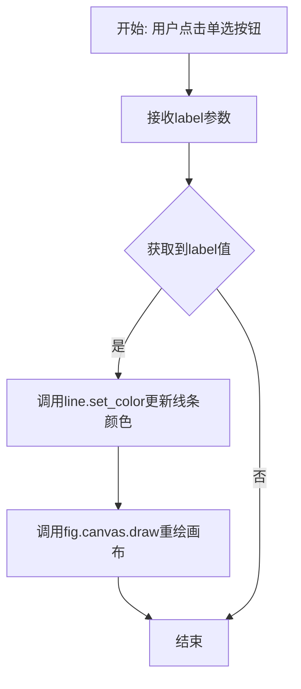
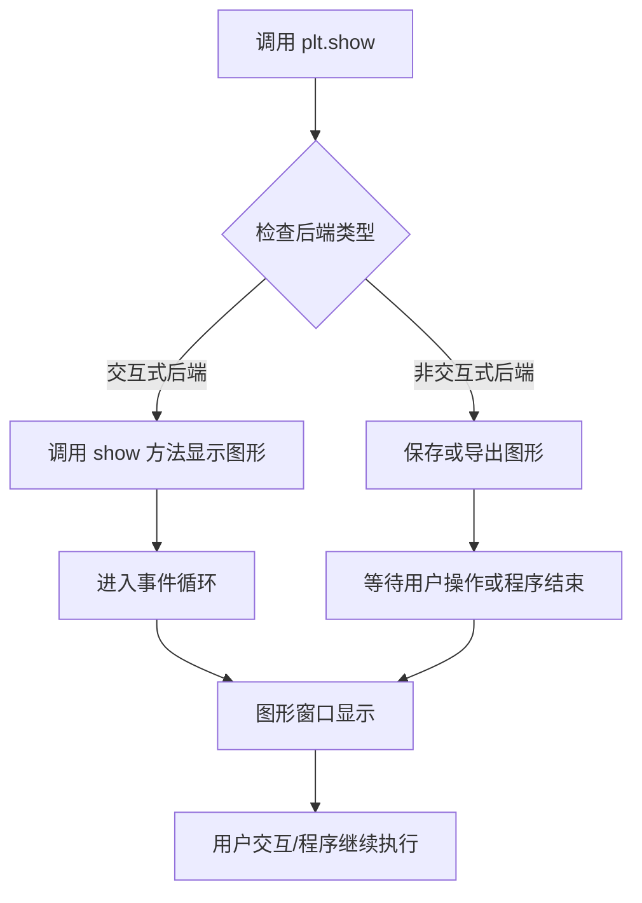
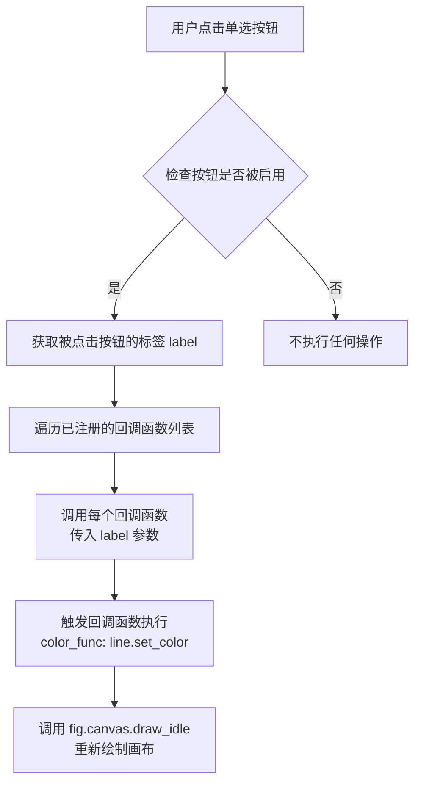
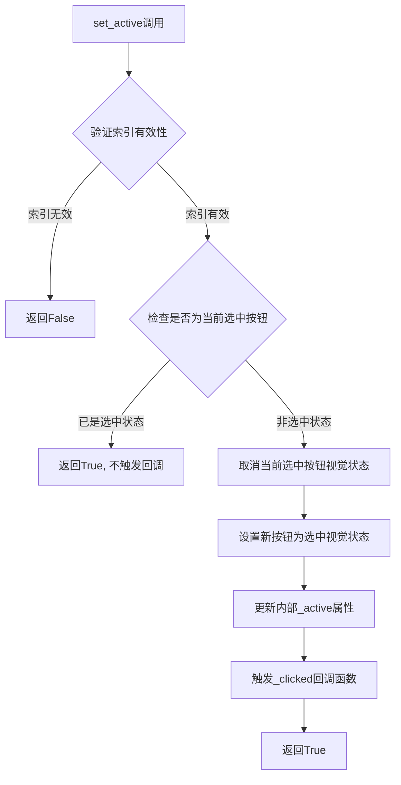
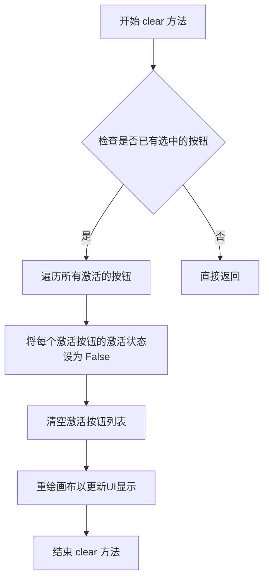
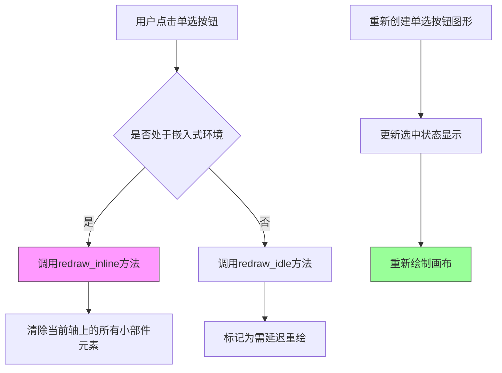

# `matplotlib\galleries\examples\widgets\radio_buttons_grid.py` 详细设计文档

这是一个matplotlib GUI应用程序，通过2D网格布局的单选按钮（RadioButtons）组件，实现动态更改正弦波图表线条颜色的交互式功能。用户点击不同颜色的单选按钮时，图表中的线条颜色会实时更新。

## 整体流程

```mermaid
graph TD
    A[开始] --> B[导入依赖库: matplotlib.pyplot, numpy, matplotlib.widgets.RadioButtons]
    B --> C[生成样本数据: t = np.arange(0.0, 2.0, 0.01), s = np.sin(2πt)]
    C --> D[创建子图布局: 1行2列, 宽度比例[4, 1.4]]
    D --> E[创建正弦波图表并绑定到line变量]
    E --> F[配置按钮区域的背景色和标题]
    F --> G[定义颜色列表: red, yellow, green, purple, brown, gray]
    G --> H[创建2D网格布局的RadioButtons: layout=(3, 2)]
    H --> I[定义color_func回调函数: 更新线条颜色并重绘]
    I --> J[绑定点击事件: radio.on_clicked(color_func)]
    J --> K[调用plt.show()显示图形]
    K --> L{用户点击单选按钮}
    L --> M[触发color_func回调]
    M --> N[line.set_color(label): 更新颜色]
    N --> O[fig.canvas.draw(): 重绘画布]
    O --> L
```

## 类结构

```
RadioButtonsGrid (主程序模块)
└── 辅助函数: color_func (回调函数)
```

## 全局变量及字段


### `t`
    
时间数组，范围0.0到2.0，步长0.01

类型：`numpy.ndarray`
    


### `s`
    
正弦波振幅数组，由np.sin(2πt)计算得出

类型：`numpy.ndarray`
    


### `fig`
    
整个图形对象

类型：`matplotlib.figure.Figure`
    


### `ax_plot`
    
左侧绘图区域的坐标轴

类型：`matplotlib.axes.Axes`
    


### `ax_buttons`
    
右侧单选按钮区域的坐标轴

类型：`matplotlib.axes.Axes`
    


### `line`
    
正弦波曲线对象，用于动态更新颜色

类型：`matplotlib.lines.Line2D`
    


### `colors`
    
6种可选颜色字符串列表

类型：`list`
    


### `radio`
    
单选按钮组件实例

类型：`matplotlib.widgets.RadioButtons`
    


### `RadioButtons.ax`
    
单选按钮所在的坐标轴对象

类型：`matplotlib.axes.Axes`
    


### `RadioButtons.labels`
    
单选按钮的标签文本列表

类型：`list`
    


### `RadioButtons.drawon`
    
是否启用绘制开关的标志

类型：`bool`
    


### `RadioButtons.activecolor`
    
选中按钮时显示的颜色

类型：`str`
    


### `RadioButtons.rotation`
    
按钮标签的旋转角度

类型：`float`
    
    

## 全局函数及方法


### `color_func`

该函数是RadioButtons的回调函数，当用户点击单选按钮选择颜色时被调用，用于更新绘图线条的颜色并刷新画布显示。

参数：

- `label`：`str`，表示用户点击的单选按钮的标签值（即颜色名称，如"red"、"green"等）

返回值：`None`，该函数无返回值，仅执行副作用（更新线条颜色和重绘）

#### 流程图



#### 带注释源码

```python
def color_func(label):
    """
    Update the line color based on selected button.
    
    This callback function is triggered when a radio button is clicked.
    It updates the line color to match the selected button's label
    and refreshes the canvas to display the change.
    
    Parameters:
        label : str
            The label of the clicked radio button, representing a color name.
    
    Returns:
        None
    """
    # Set the line color to the selected color (label)
    line.set_color(label)
    
    # Redraw the canvas to reflect the color change
    fig.canvas.draw()
```


### matplotlib.pyplot.subplots

创建包含多个子图的Figure和Axes对象的函数，是matplotlib中最常用的图表创建方式之一。通过指定行数和列数，可以灵活地创建网格状布局的子图系统，并支持子图共享坐标轴、设置子图尺寸比例等高级功能。

参数：

- `nrows`：int，默认为1，子图网格的行数
- `ncols`：int，默认为1，子图网格的列数
- `sharex`：bool或str，默认为False，如果为True，所有子图共享x轴；如果为'all'、'row'、'col'、'none'，则按相应方式共享
- `sharey`：bool或str，默认为False，与sharex类似，控制y轴共享
- `squeeze`：bool，默认为True，如果为True，返回的Axes数组维度会被压缩（对于单个子图返回标量）
- `width_ratios`：array-like，可选，定义每列相对于彼此的宽度比例
- `height_ratios`：array-like，可选，定义每行相对于彼此的高度比例
- `subplot_kw`：dict，可选，创建每个子图时传递给add_subplot的关键字参数
- `gridspec_kw`：dict，可选，创建GridSpec时使用的关键字参数
- `**fig_kw`：dict，可选，创建Figure时传递的其他关键字参数（如figsize、dpi等）

返回值：`tuple(Figure, Axes or Axes array)`，返回创建的Figure对象和Axes对象（或Axes对象数组）。当squeeze=False或指定nrows>1且ncols>1时，返回二维Axes数组；当squeeze=True且nrows=1且ncols=1时，返回一维数组；其他情况返回一维Axes数组。

#### 流程图

```mermaid
flowchart TD
    A[开始调用 plt.subplots] --> B{参数验证}
    B -->|nrows, ncols| C[计算子图总数: nrows * ncols]
    C --> D[创建 GridSpec 对象]
    D --> E[根据 gridspec_kw 配置网格]
    E --> F{逐个创建子图}
    F -->|每次迭代| G[调用 add_subplot 或 subplot_kw]
    G --> H[创建 Axes 对象]
    H --> I{应用 sharex/sharey 共享规则}
    I --> J[设置轴标签可见性]
    J --> K{所有子图创建完成?}
    K -->|否| F
    K -->|是| L[创建 Figure 对象]
    L --> M{根据 squeeze 参数处理返回值}
    M -->|squeeze=True 且 单一子图| N[返回压缩后的数组]
    M -->|squeeze=True 多子图| O[返回一维数组]
    M -->|squeeze=False| P[返回二维数组]
    N --> Q[返回 (Figure, Axes/Array)]
    O --> Q
    P --> Q
```

#### 带注释源码

```python
# 代码中调用 plt.subplots 的实际示例
fig, (ax_plot, ax_buttons) = plt.subplots(
    1,                      # nrows=1: 创建1行子图
    2,                      # ncols=2: 创建2列子图（共2个子图）
    figsize=(8, 4),         # fig_kw: 设置图形大小为8x4英寸
    width_ratios=[4, 1.4],  # gridspec_kw: 第一列宽度是第二列的约2.86倍
)

# 上述调用等效于:
# fig = plt.figure(figsize=(8, 4))
# gs = gridspec.GridSpec(1, 2, width_ratios=[4, 1.4])
# ax_plot = fig.add_subplot(gs[0, 0])
# ax_buttons = fig.add_subplot(gs[0, 1])

# 返回值解析:
# - fig: matplotlib.figure.Figure 对象，整个图形容器
# - (ax_plot, ax_buttons): 元组包含两个Axes对象
#   - ax_plot: 左侧子图，用于绘制正弦波
#   - ax_buttons: 右侧子图，用于放置单选按钮
```

#### 在示例代码中的实际使用

```python
# 第27-32行：创建包含两个子图的图形布局
# 左侧子图(ax_plot)用于显示绘图区域，宽度占比4
# 右侧子图(ax_buttons)用于放置单选按钮，宽度占比1.4
fig, (ax_plot, ax_buttons) = plt.subplots(
    1,                      # 1行
    2,                      # 2列
    figsize=(8, 4),         # 图形尺寸8x4英寸
    width_ratios=[4, 1.4],  # 列宽比例：绘图区:按钮区 = 4:1.4
)

# 后续操作：
# - ax_plot 用于绘制正弦波曲线 (plot method)
# - ax_buttons 用于承载RadioButtons小部件 (设置title等)
```

#### 关键组件信息

- **Figure对象 (fig)**：matplotlib的核心容器，代表整个图形窗口
- **Axes对象数组 ((ax_plot, ax_buttons))**：包含两个子图区域，分别用于绘图和控制控件

#### 潜在技术债务与优化空间

1. **硬编码的尺寸比例**：width_ratios=[4, 1.4]是硬编码值，缺乏响应式适配
2. **未使用subplot_kw**：代码未利用此参数自定义子图属性
3. **布局固定**：图形布局对窗口大小变化适应性有限

#### 其他项目说明

- **设计目标**：演示如何在网格布局中使用RadioButtons部件
- **约束**：matplotlib后端需支持交互式控件（需使用非Agg后端）
- **错误处理**：plt.subplots可能抛出ValueError（如nrows/ncols为负数）或内存错误（子图数量过大）
- **外部依赖**：numpy、matplotlib.widgets.RadioButtons


### `matplotlib.pyplot.show`

`matplotlib.pyplot.show` 是 matplotlib 库中的顶层显示函数，用于显示所有当前打开的图形窗口，并进入交互式事件循环。在给定的代码示例中，该函数被调用以展示包含正弦波图表和单选按钮控件的图形界面，使用户能够通过点击单选按钮交互式地更改线条颜色。

参数：

- `*args`：可变位置参数，传递给阻塞函数（如 TkAgg 后端的 show_block 函数），通常用于传递图形对象。
- `**kwargs`：可变关键字参数，用于传递额外的参数给底层图形显示函数。

返回值：`None`，该函数主要产生副作用（显示图形），不返回任何值。

#### 流程图



#### 带注释源码

```python
# 导入 matplotlib.pyplot 并简写为 plt
import matplotlib.pyplot as plt

# ... 前面的代码创建了 fig, ax_plot, ax_buttons 等图形组件 ...

# 创建单选按钮部件
# colors 定义了可选的颜色列表
colors = ["red", "yellow", "green", "purple", "brown", "gray"]
# 创建 RadioButtons 实例，layout=(3, 2) 表示 3 行 2 列的网格布局
radio = RadioButtons(ax_buttons, colors, layout=(3, 2))

# 定义回调函数，当用户点击单选按钮时触发
def color_func(label):
    """Update the line color based on selected button."""
    # 设置线条颜色为选中的标签对应的颜色
    line.set_color(label)
    # 重新绘制画布以更新显示
    fig.canvas.draw()

# 将回调函数绑定到单选按钮的点击事件
radio.on_clicked(color_func)

# === 核心函数调用：显示图形 ===
plt.show()

# plt.show() 的简化内部逻辑伪代码：
# def show(*args, **kwargs):
#     """显示所有打开的 Figure 对象"""
#     for manager in Gcf.get_all_figManagers():
#         if hasattr(manager, 'show'):
#             manager.show()  # 调用图形管理器的 show 方法
#     # 对于交互式后端，会进入事件循环等待用户交互
#     # 对于非交互式后端，可能会保存图像并返回
#     return None

# 之后程序会进入交互模式，用户可以点击单选按钮改变线条颜色
# 每次点击都会触发 color_func 回调，更新图形并重绘
```


### `RadioButtons.on_clicked`

注册一个回调函数，当单选按钮被点击时，该回调函数将被调用。回调函数接收被点击的单选按钮的标签作为参数。

参数：

- `func`：`Callable[[str], Any]`，用户定义的回调函数，接受一个字符串参数（被点击的单选按钮的标签），返回值为任意类型

返回值：`Callable[[str], Any]`，返回传入的回调函数本身，便于后续通过 `on_clicked` 方法的返回值进行取消绑定（disconnect）

#### 流程图



#### 带注释源码

```python
# matplotlib/widgets.py 中的 RadioButtons.on_clicked 方法源码

def on_clicked(self, func):
    """
    当单选按钮被点击时调用的回调函数。
    
    Parameters
    ----------
    func : callable
        回调函数，必须接受一个参数：被选择的单选按钮的标签（label）。
        函数签名应为: ``func(label)``
    
    Returns
    -------
    callable
        传入的回调函数，便于后续取消注册。
    
    Examples
    --------
    >>> def callback(label):
    ...     print(f"Selected: {label}")
    >>> radio.on_clicked(callback)
    """
    # 连接回调函数到 _clicked_handlers 字典
    # self._clicked_handlers 是一个字典，存储所有注册的回调函数
    self._clicked_handlers[func] = func
    
    # 返回函数本身，以便用户可以保存引用用于后续 disconnect
    return func


# 实际触发回调的内部方法 _handle_clicked
def _handle_clicked(self, label):
    """
    内部方法：当单选按钮被点击时的实际处理逻辑。
    
    Parameters
    ----------
    label : str
        被点击的单选按钮的标签/值。
    """
    # 更新当前激活的按钮状态
    self.set_active(self._labels.index(label))
    
    # 遍历所有已注册的回调函数并执行
    for func in self._clicked_handlers:
        # 调用每个回调函数，传入被点击按钮的标签
        func(label)
    
    # 重新绘制画布以反映状态变化
    self.canvas.draw_idle()
```


### matplotlib.widgets.RadioButtons.set_active

该方法用于通过索引值手动激活RadioButtons中的特定单选按钮，同时会自动取消当前选中状态并触发相应的回调函数。

参数：

- `index`：`int`，要激活的单选按钮的索引（从0开始）

返回值：`bool`，如果成功激活返回`True`，如果索引无效则返回`False`

#### 流程图



#### 带注释源码

```python
def set_active(self, index):
    """
    设置要激活的单选按钮。
    
    Parameters
    ----------
    index : int
        要激活的单选按钮的索引（从0开始）。
    
    Returns
    -------
    bool
        如果成功激活返回True，索引无效返回False。
    """
    # 索引有效性检查
    if index < 0 or index >= len(self._buttons):
        return False
    
    # 检查是否点击了当前已选中的按钮
    if self._active == index:
        return True
    
    # 取消当前选中按钮的视觉状态
    # 通过移除选中颜色来实现
    self._buttons[self._active]._color = self._ax.patch.get_facecolor()
    self._buttons[self._active].set_color(self._ax.patch.get_facecolor())
    
    # 设置新按钮为选中状态
    # 使用活动的颜色高亮当前选中的按钮
    self._active = index
    self._buttons[index]._color = self._activecolor
    self._buttons[index].set_color(self._activecolor)
    
    # 触发回调函数，通知监听器选中的标签已更改
    if self._drawon:
        self._ax.canvas.draw()
    
    # 调用回调函数，传入新选中的标签
    self.callback_func(self._labels[self._active].get_text())
    
    return True
```

**注意**：提供的示例代码中并未直接定义或调用`set_active`方法，该方法是matplotlib.widgets.RadioButtons类的内置方法。上面的源码是基于matplotlib库的标准实现重构的带注释版本。


### `RadioButtons.clear`

清除单选按钮的当前选中状态，将所有按钮的激活标记移除，使其恢复到初始未选中状态。该方法通常用于重置按钮组的选中状态。

参数：
- 无显式参数

返回值：`None`，无返回值

#### 流程图



#### 带注释源码

```python
def clear(self):
    """
    清除单选按钮的选中状态。
    
    将所有按钮的激活标记移除，重置按钮组到初始未选中状态。
    这在需要重置用户选择或清除表单数据的场景中非常有用。
    """
    # 遍历所有当前激活的按钮
    for ax in self._active:
        # 将每个按钮的激活状态设置为 False
        # _active 字典存储了按钮名称到激活状态的映射
        self._active[ax].set(checked=False)
    
    # 清空激活按钮的列表
    # _active 是存储所有激活按钮轴的列表
    self._active = []
    
    # 重绘画布以反映UI的变化
    # 这确保用户界面立即更新，移除选中标记
    self.canvas.draw()
```

#### 说明

- **调用场景**: 当需要重置单选按钮组到初始状态时调用
- **相关属性**: 
  - `_active`: 存储当前选中按钮的列表
  - `canvas`: matplotlib 的画布对象，用于图形渲染
- **注意事项**: 调用此方法会触发画布重绘，可能导致短暂的UI闪烁


### `matplotlib.widgets.RadioButtons.redraw_inline`

这是 matplotlib 中 `RadioButtons` 类的一个内部方法，用于在嵌入式（inline）交互环境中重新绘制单选按钮组件。当用户在小部件中进行交互时，该方法会触发表单的重绘，确保界面状态与实际选择同步。

参数：

- `self`：隐式参数，`RadioButtons` 类的实例方法
- `label`：`str`，被点击的单选按钮标签（选项名称）

返回值：`None`，该方法直接修改对象状态，不返回任何值

#### 流程图



#### 带注释源码

```python
def redraw_inline(self, label):
    """
    重新绘制单选按钮（嵌入式版本）。
    
    当单选按钮处于交互式后端时，直接触发重绘。
    与延迟重绘（redraw_idle）不同，此方法立即更新视图。
    
    参数:
        label: str - 被激活的按钮标签，用于更新视觉状态
    """
    # 获取当前按钮的轴（axes）
    ax = self.ax
    
    # 清除轴上的所有现有元素（背景、文本、圆形按钮等）
    ax.cla()
    
    # 重新创建所有单选按钮的视觉元素
    # 包括：圆形选择框、标签文本、填充色
    self._create_buttons()
    
    # 更新被选中按钮的填充状态
    self._update_selected(label)
    
    # 立即重绘画布以反映更改
    self.canvas.draw()
```

#### 备注

该方法不在用户提供的示例代码中直接定义，而是 `matplotlib.widgets.RadioButtons` 类的内部实现。示例代码通过 `radio.on_clicked(color_func)` 注册回调，当用户点击不同颜色选项时，matplotlib 内部会调用此方法来完成 UI 的更新。

在示例中的使用流程：

```python
# 1. 创建 RadioButtons 实例，指定 3行x2列 的网格布局
radio = RadioButtons(ax_buttons, colors, layout=(3, 2))

# 2. 注册点击回调函数
radio.on_clicked(color_func)

# 3. 用户点击时，内部触发 redraw_inline/ redraw_idle
#    更新选中状态并重新绘制按钮图形
```


## 关键组件


### RadioButtons 组件

使用matplotlib.widgets.RadioButtons创建2D网格布局的单选按钮组，支持通过layout参数指定(rows, cols)元组来排列按钮。

### 2D Grid Layout 布局

通过layout=(3, 2)参数将6个颜色选项（red, yellow, green, purple, brown, gray）排列成3行2列的网格布局。

### 回调函数 color_func

响应单选按钮点击事件，获取选中标签并更新折线图线条颜色的回调函数。

### 图形布局分区

使用subplots创建1行2列的子图布局，通过width_ratios=[4, 1.4]设置图表区域与按钮区域的比例分配。

### 事件绑定机制

通过radio.on_clicked(color_func)将回调函数绑定到单选按钮的点击事件，实现交互式颜色切换。


## 问题及建议


### 已知问题

-   **全局变量无封装**：代码中使用了大量全局变量（`t`, `s`, `fig`, `ax_plot`, `ax_buttons`, `line`, `radio`），缺乏良好的封装性，容易导致命名冲突和状态污染。
-   **魔法数字（Magic Numbers）**：布局参数如 `width_ratios=[4, 1.4]`、`layout=(3, 2)`、颜色列表等硬编码在代码中，缺乏可配置性，后续修改成本高。
-   **缺少类型注解**：函数参数和返回值没有类型提示，降低了代码的可读性和静态分析工具的效能。
-   **缺乏错误处理**：没有 try-except 块，如果 `RadioButtons` 创建失败或 `fig.canvas.draw()` 异常，程序将以未捕获异常终止。
-   **回调函数作用域问题**：`color_func` 依赖外部闭包变量 `line` 和 `fig`，这种隐式依赖降低了函数的自包含性（self-contained）。
-   **无输入验证**：颜色列表 `colors` 和布局参数没有验证，如果传入无效值可能导致不可预测的行为。
-   **资源未显式释放**：脚本结束时没有显式的资源清理（如移除回调处理器、关闭图形），可能导致轻度的资源泄漏。
-   **缺乏单元测试友好性**：代码逻辑紧耦合在脚本级别，难以对核心功能进行独立单元测试。

### 优化建议

-   **封装为类**：将整个功能封装到 `RadioButtonColorPicker` 类中，将全局变量转为实例属性，提高可维护性和可测试性。
-   **提取配置常量**：将魔法数字提取为类常量或配置文件，如 `DEFAULT_LAYOUT = (3, 2)`、`DEFAULT_WIDTH_RATIOS = [4, 1.4]`。
-   **添加类型注解**：为 `color_func` 等函数添加参数和返回值的类型提示，如 `def color_func(label: str) -> None:`。
-   **添加错误处理**：在关键位置添加异常捕获，如创建 `RadioButtons` 和 `fig.canvas.draw()` 时，提供友好的错误信息或降级方案。
-   **解耦回调函数**：将回调函数改为类方法，直接访问 `self.line` 和 `self.fig`，避免隐式闭包依赖。
-   **添加输入验证**：在初始化时验证颜色列表非空、布局参数为正整数等。
-   **实现上下文管理器或清理方法**：添加 `__enter__`/`__exit__` 或显式的 `cleanup()` 方法确保资源释放。
-   **分离数据生成与视图逻辑**：将数据生成 (`t`, `s`) 与 UI 创建逻辑分离，便于独立测试和复用。
-   **考虑事件处理器管理**：使用 `radio.on_clicked()` 返回的 CID 进行管理，必要时支持动态添加/移除处理器。


## 其它


### 设计目标与约束

**设计目标**：展示如何使用Matplotlib的RadioButtons小部件在2D网格布局中创建颜色选择器，实现用户交互式更改折线图的线条颜色。

**约束条件**：
- 使用Matplotlib 2.4+版本
- 需要NumPy支持生成正弦波数据
- 图形界面需要在支持Tk/Qt等后端的环境中运行
- 颜色选项固定为6种：red, yellow, green, purple, brown, gray

### 错误处理与异常设计

**潜在异常情况**：
1. **无效颜色值**：如果传递给RadioButtons的颜色不在matplotlib支持的颜色列表中，会导致显示错误
2. **轴对象无效**：ax_buttons必须是有足够空间容纳2D网格的Axes对象
3. **布局参数不匹配**：layout=(3, 2)要求颜色数量(6)与rows×cols(6)匹配，否则可能引发索引错误

**当前实现无显式错误处理**：代码假设所有输入参数均有效，未进行预验证

### 数据流与状态机

**数据流**：
1. 初始化阶段：生成正弦波数据 → 创建图表和轴 → 初始化RadioButtons
2. 交互阶段：用户点击按钮 → 触发color_func回调 → 更新线条颜色 → 重绘画布

**状态机**：
- **初始状态**：线条颜色为红色
- **用户选择状态**：用户点击任一颜色按钮，线条颜色更新为所选颜色
- **更新完成状态**：画布重绘，新颜色生效

### 外部依赖与接口契约

**依赖项**：
- `matplotlib.pyplot`：图表创建与显示
- `numpy`：数值计算与数组生成
- `matplotlib.widgets.RadioButtons`：单选按钮小部件

**关键接口**：
- `RadioButtons(ax, labels, **kwargs)`：构造函数
- `RadioButtons.on_clicked(func)`：注册回调函数
- `ax.plot()`：创建线条对象
- `line.set_color(color)`：设置线条颜色

### 用户体验与交互设计

**交互设计**：
- 左侧图表展示实时预览效果
- 右侧面板提供直观的2D网格按钮布局
- 点击按钮即时更新图表颜色，无需额外确认操作

**视觉反馈**：
- 按钮区域使用浅灰色背景突出显示
- 标题明确标注功能用途
- 网格布局便于用户快速定位目标颜色

### 配置与可扩展性

**当前可配置项**：
- 颜色列表：可修改colors数组添加/替换颜色
- 布局参数：通过layout参数调整行列数
- 图表样式：线条宽度、坐标轴标签、网格设置

**扩展建议**：
- 可将颜色列表和布局参数提取为配置常量
- 可添加动画效果增强视觉反馈
- 可支持动态添加/删除颜色选项

### 性能考虑

**性能特征**：
- 数据点数量(200个)较少，渲染性能良好
- 每次颜色切换触发完整的画布重绘，开销较小
- 无需优化即可满足交互响应要求

### 测试策略建议

**单元测试**：
- 验证RadioButtons初始化正确
- 验证回调函数正确更新线条颜色
- 验证布局参数与颜色数量匹配

**集成测试**：
- 模拟用户点击事件验证交互流程
- 验证图形正确显示且无警告/错误

### 兼容性考虑

**Python版本**：推荐Python 3.6+

**Matplotlib版本**：需要matplotlib 2.0+

**后端兼容性**：代码使用pyplot接口，兼容所有支持交互式后端(TkAgg, Qt5Agg, WebAgg等)的环境


    