# `matplotlib\galleries\examples\widgets\range_slider.py` 详细设计文档

该代码使用Matplotlib的RangeSlider部件创建一个交互式图像阈值控制应用,通过滑块动态调整图像的显示范围(对比度),同时在直方图上显示对应的阈值线。

## 整体流程

```mermaid
graph TD
    A[开始] --> B[导入matplotlib.pyplot和numpy]
    B --> C[生成128x128随机图像数据]
    C --> D[创建1x2子图布局]
    D --> E[在左侧显示图像,右侧显示直方图]
    E --> F[创建RangeSlider控件]
    F --> G[在直方图上绘制上下阈值垂直线]
    G --> H[定义update回调函数]
    H --> I[将update函数绑定到slider的changed事件]
    I --> J[调用plt.show()显示图形]
    J --> K{用户交互}
    K -->|拖动滑块| L[触发update回调]
    L --> M[更新图像的vmin和vmax]
    L --> N[更新垂直线位置]
    L --> O[重绘画布]
    O --> K
```

## 类结构

```
Matplotlib图形组件
├── Figure (画布)
├── Axes (子图数组: axs[0]图像, axs[1]直方图)
├── RangeSlider (范围滑块部件)
├── Image (图像显示对象)
└── Line2D (垂直线对象)
```

## 全局变量及字段


### `N`
    
图像尺寸(128)

类型：`int`
    


### `img`
    
128x128随机正态分布图像数据

类型：`ndarray`
    


### `fig`
    
Matplotlib画布对象

类型：`Figure`
    


### `axs`
    
子图数组(2个Axes)

类型：`ndarray`
    


### `im`
    
图像显示对象

类型：`AxesImage`
    


### `slider_ax`
    
滑块所在坐标轴

类型：`Axes`
    


### `slider`
    
范围滑块实例

类型：`RangeSlider`
    


### `lower_limit_line`
    
下阈值垂直线

类型：`Line2D`
    


### `upper_limit_line`
    
上阈值垂直线

类型：`Line2D`
    


### `update`
    
滑块值变化回调函数

类型：`function`
    


### `Figure.canvas`
    
画布对象，用于绘制图形

类型：`Canvas`
    


### `Figure.axes`
    
画布上的坐标轴列表

类型：`list`
    


### `Axes.images`
    
坐标轴上的图像对象列表

类型：`list`
    


### `Axes.lines`
    
坐标轴上的线条对象列表

类型：`list`
    


### `Axes.patches`
    
坐标轴上的补丁对象列表

类型：`list`
    


### `RangeSlider.val`
    
滑块值(下阈值, 上阈值)元组

类型：`tuple`
    


### `RangeSlider.ax`
    
滑块所在的坐标轴

类型：`Axes`
    


### `Image.norm`
    
图像归一化对象，控制颜色映射范围

类型：`Normalize`
    
    

## 全局函数及方法


### `np.random.seed`

设置随机数生成器的种子，确保每次运行代码时生成相同的随机数序列，从而实现结果的可复现性。这是机器学习和科学实验中常用的技术，用于调试和结果验证。

参数：

- `seed`：`int` 或 `array_like`，可选参数，用于初始化随机数生成器的种子值。常见的取值包括整数或与随机数生成器兼容的数组。

返回值：`None`，该函数无返回值，直接修改全局随机数生成器的状态。

#### 流程图

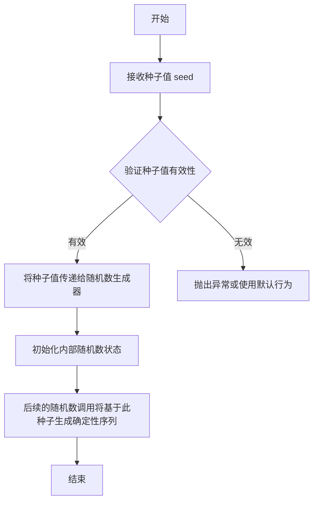

#### 带注释源码

```python
# 设置随机数种子为 19680801
# 这个特定的数值是 Matplotlib 官方示例中常用的种子值
# 目的是确保每次运行代码时，生成的随机图像数据完全一致
# 19680801 是 Matplotlib 仓库创建的日期 (1968年8月1日)
np.random.seed(19680801)

# 生成一个 128x128 的随机图像数组
# 由于设置了固定的种子，这个随机数组在每次程序运行时都相同
N = 128
img = np.random.randn(N, N)
```

#### 相关说明

- **设计目标**：确保随机实验的可重复性，方便代码调试和结果验证
- **约束条件**：种子值必须是 NumPy 随机数生成器支持的类型
- **错误处理**：如果传入无效的种子值，NumPy 会抛出异常
- **使用场景**：科学计算、机器学习模型训练、随机实验的基准测试等需要结果可复现的场景
- **注意事项**：种子设置对全局随机数生成器生效，在多线程环境下可能产生竞态条件


### `np.random.randn`

生成指定形状的标准正态分布（高斯分布）随机数数组。

参数：

-  `*shape`：`int`，可变数量参数，指定输出数组的维度，例如 `N, N` 表示生成 N×N 的二维数组

返回值：`ndarray`，返回包含标准正态分布随机数的多维数组，数组数据类型为 `float64`

#### 流程图

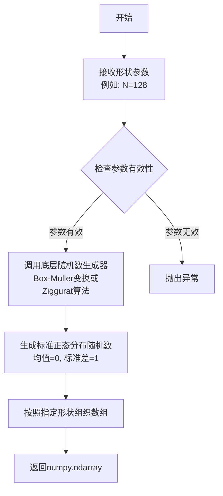

#### 带注释源码

```python
# 设置随机种子以确保可重现性
np.random.seed(19680801)

# 定义图像尺寸
N = 128

# 使用 np.random.randn 生成 N×N 的标准正态分布随机数数组
# 返回值: shape=(128, 128) 的 float64 类型数组
# 每个元素服从均值0、标准差1的正态分布
img = np.random.randn(N, N)
```


### `plt.subplots`

创建子图布局，返回一个 Figure 对象和一个包含 Axes 对象的数组，用于在单个图形窗口中展示多个子图。

参数：

- `nrows`：`int`，可选，默认值为 1。子图网格的行数。
- `ncols`：`int`，可选，默认值为 1。子图网格的列数。
- `sharex`：`bool` 或 `str`，可选，默认值为 `False`。如果为 `True`，则所有子图共享 x 轴；如果为 `'col'`，则每列子图共享 x 轴；如果为 `'row'`，则每行子图共享 x 轴。
- `sharey`：`bool` 或 `str`，可选，默认值为 `False`。如果为 `True`，则所有子图共享 y 轴；如果为 `'col'`，则每列子图共享 y 轴；如果为 `'row'`，则每行子图共享 y 轴。
- `squeeze`：`bool`，可选，默认值为 `True`。如果为 `True`，则压缩返回的 Axes 数组维度：当只有一行或一列时，返回一维数组而不是二维数组。
- `width_riments`：`array-like`，可选。子图列的宽度比例。
- `height_ratios`：`array-like`，可选。子图行的高度比例。
- `subplot_kw`：字典，可选。传递给每个子图的关键字参数。
- `gridspec_kw`：字典，可选。传递给 GridSpec 构造器的关键字参数。
- `figsize`：元组，可选。图形的大小，以英寸为单位，格式为 (宽度, 高度)。
- `dpi`：整数，可选。图形的分辨率（每英寸点数）。
- `**kwargs`：其他关键字参数传递给 `figure()` 函数。

返回值：`tuple`，包含 (Figure, Axes 或 Axes 数组)。第一个返回值是 Figure 对象，第二个返回值是 Axes 对象（或多个 Axes 对象组成的数组）。

#### 流程图

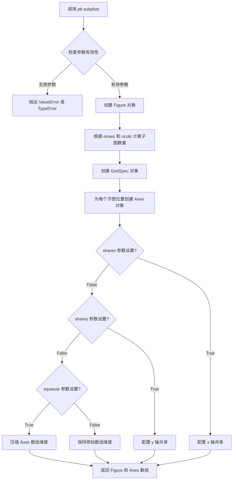

#### 带注释源码

```python
# 创建 1 行 2 列的子图布局，图形大小为 10x5 英寸
fig, axs = plt.subplots(1, 2, figsize=(10, 5))

# fig: matplotlib.figure.Figure 对象 - 整个图形容器
# axs: numpy.ndarray 对象 - 包含 2 个 Axes 对象的数组
# 参数说明:
#   - 1: nrows=1，表示 1 行子图
#   - 2: ncols=2，表示 2 列子图
#   - figsize=(10, 5): 图形宽度 10 英寸，高度 5 英寸
```

#### 在代码中的实际使用

```python
# 从给定的代码中提取
fig, axs = plt.subplots(1, 2, figsize=(10, 5))
fig.subplots_adjust(bottom=0.25)

# 创建了 1 行 2 列的子图
# axs[0] 用于显示图像 (imshow)
# axs[1] 用于显示直方图 (hist)
```


### `Figure.subplots_adjust`

调整 Figure 中子图的布局参数，用于控制子图之间的间距和边距。

参数：

- `left`：`float`，可选，左边距（相对于图形宽度），默认值为 0.125
- `right`：`float`，可选，右边距（相对于图形宽度），默认值为 0.9
- `bottom`：`float`，可选，下边距（相对于图形高度），默认值为 0.11
- `top`：`float`，可选，上边距（相对于图形高度），默认值为 0.88
- `wspace`：`float`，可选，子图之间的水平间距（相对于子图宽度），默认值为 0.2
- `hspace`：`float`，可选，子图之间的垂直间距（相对于子图高度），默认值为 0.2

返回值：`None`，该方法直接修改 Figure 对象的布局属性，不返回任何值

#### 流程图

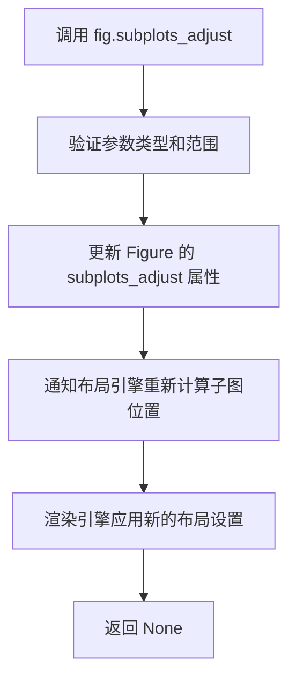

#### 带注释源码

```python
# 在用户代码中的调用示例
fig, axs = plt.subplots(1, 2, figsize=(10, 5))  # 创建1行2列的子图
fig.subplots_adjust(bottom=0.25)  # 调整子图底部边距为图形高度的25%

# 以下是 Matplotlib 内部实现的伪代码说明
# def subplots_adjust(self, left=None, right=None, bottom=None, top=None, wspace=None, hspace=None):
#     """
#     更新子图的布局参数
#     
#     参数:
#         left: 子图区域左侧位置（0-1之间的浮点数）
#         right: 子图区域右侧位置
#         bottom: 子图区域底部位置
#         top: 子图区域顶部位置
#         wspace: 子图间的水平间距
#         hspace: 子图间的垂直间距
#     """
#     # 1. 获取当前的布局参数
#     subplotspars = self.subplotpars
#     
#     # 2. 更新传入的参数
#     if left is not None:
#         subplotspars.left = left
#     if right is not None:
#         subplotspars.right = right
#     if bottom is not None:
#         subplotspars.bottom = bottom
#     if top is not None:
#         subplotspars.top = top
#     if wspace is not None:
#         subplotspars.wspace = wspace
#     if hspace is not None:
#         subplotspars.hspace = hspace
#     
#     # 3. 触发重新布局
#     self._axstack.clear()
#     self._axobservers.process("_axes_change", self)
#     
#     # 4. 重新绘制画布
#     self.canvas.draw_idle()
```


### `Axes.imshow`

在 matplotlib 中，`Axes.imshow` 是绑定到 Axes 对象上的方法，用于在 Axes 子图区域显示图像或二维数据。它接受图像数据数组和多个显示参数（如颜色映射、归一化、插值方式等），并返回一个 `AxesImage` 对象，该对象可进一步用于配置图像显示属性（如颜色范围、透明度等）。

参数：

- `X`：`array-like`，要显示的图像数据。可以是 MxN（灰度图像）、MxNx3（RGB 图像）或 MxNx4（RGBA 图像）格式。
- `cmap`：`str` 或 `Colormap`，可选，颜色映射（colormap）名称，用于灰度图像的着色。默认为 `None`。
- `norm`：`Normalize`，可选，用于灰度数据的归一化实例。如果提供，会忽略 `vmin` 和 `vmax`。默认为 `None`。
- `aspect`：`float` 或 `'auto'`，可选，控制图像的纵横比（aspect ratio）。默认为 `None`（通常为 'auto'）。
- `interpolation`：`str`，可选，图像渲染时的插值方法，如 `'bilinear'`、`'nearest'`、`'bicubic'` 等。默认为 `None`。
- `alpha`：`float` 或 `array-like`，可选，图像的透明度，范围 0-1。默认为 `None`。
- `vmin`、`vmax`：`float`，可选，与 `norm` 一起使用，用于归一化的最小值和最大值，控制颜色映射的范围。默认为 `None`。
- `origin`：`{'upper', 'lower'}`，可选，图像原点的位置。默认为 `None`（从 rcParams 读取）。
- `extent`：`tuple`，可选，图像在 Axes 坐标系中的扩展范围 `(left, right, bottom, top)`。默认为 `None`。
- `filternorm`：`float`，可选，滤波器归一化参数。默认为 1。
- `filterrad`：`float`，可选，滤波器半径参数。默认为 4.0。
- `resample`：`bool`，可选，是否重采样。默认为 `None`。
- `url`：`str`，可选，设置图像元素的 URL。默认为 `None`。
- `data`：`keyword parameter`，可选，如果传入了 `**kwargs`，且指定了 `data` 参数，则会使用 `data` 中对应的数据。默认为 `None`。
- `**kwargs`：`keyword parameters`，其他关键字参数，会传递给 `AxesImage` 构造函数。

返回值：`matplotlib.image.AxesImage`，返回创建的 AxesImage 对象。该对象封装了图像数据和相关属性，可用于后续的图像配置和更新（如本例中的 `im.norm.vmin` 和 `im.norm.vmax` 修改）。

#### 流程图

```mermaid
flowchart TD
    A[调用 axs[0].imshow] --> B{验证输入数据 X}
    B -->|有效| C[根据参数创建 AxesImage 对象]
    B -->|无效| D[抛出异常]
    C --> E[应用颜色映射 cmap]
    C --> F[应用归一化 norm 或 vmin/vmax]
    C --> G[设置原点 origin 和范围 extent]
    C --> H[配置插值方式 interpolation]
    C --> I[设置透明度 alpha]
    J[将 AxesImage 添加到 Axes]
    G --> J
    H --> J
    I --> J
    J --> K[返回 AxesImage 对象]
    E --> F
```

#### 带注释源码

```python
# 在代码中的调用方式
im = axs[0].imshow(img)

# 详细参数解析：
# img: 是一个 128x128 的随机生成的正态分布数据 (numpy.ndarray)
#     形状为 (128, 128)，数据类型为 float64
#     数值范围大致在 -3 到 3 之间（因为是标准正态分布）

# axs[0]: 是 matplotlib.subplots 创建的 Axes 对象数组中的第一个元素
#         代表左侧的子图，用于显示图像

# 调用 imshow 后：
# - img 数据被转换为可视化图像
# - 使用默认的 colormap（通常是 'viridis' 对于数值数据）
# - 自动确定 vmin 和 vmax（如果没有显式指定）
# - 返回一个 AxesImage 对象赋值给变量 im

# 后续可以通过 im.norm.vmin 和 im.norm.vmax 动态调整显示范围
# 这在 RangeSlider 回调函数中实现，用于阈值控制
im.norm.vmin = val[0]  # 设置显示的最小值（阈值下限）
im.norm.vmax = val[1]  # 设置显示的最大值（阈值上限）
```


### `axs[1].hist` / `matplotlib.axes.Axes.hist`

绘制直方图，用于可视化图像像素强度的分布情况。该函数接收一个一维数据数组和bin参数，计算数据的频率分布并生成直方图图形。

参数：

- `x`：`numpy.ndarray`，要绘制直方图的数据，在代码中为 `img.flatten()`，即展平后的128x128图像数组（包含16384个像素值）
- `bins`：`int or str or sequence`，直方图的bin数量或bin的设置方式，代码中使用 `'auto'` 表示自动选择最优的bin数量

返回值：`tuple of (n, bins, patches)`

- `n`：`numpy.ndarray`，每个bin中的计数数组
- `bins`：`numpy.ndarray`，bin的边缘值数组，长度为 n+1
- `patches`：`BarContainer` or list of `Polygon`，直方图的图形对象（条形），可用于后续图形样式的修改

#### 流程图

```mermaid
flowchart TD
    A[开始调用 hist 方法] --> B[接收数据 img.flatten]
    B --> C[接收 bins='auto' 参数]
    C --> D[计算最优bin数量]
    D --> E[遍历数据统计每个bin的计数]
    E --> F[创建直方图图形对象 patches]
    F --> G[返回 n, bins, patches 元组]
    G --> H[设置标题 axs[1].set_title]
    H --> I[结束]
```

#### 带注释源码

```python
# 代码中的调用方式
im = axs[0].imshow(img)  # 在左侧Axes显示图像
axs[1].hist(img.flatten(), bins='auto')  # 在右侧Axes绘制像素强度的直方图
axs[1].set_title('Histogram of pixel intensities')  # 设置直方图标题

# hist 方法的完整调用形式（参数详解）
# axs[1].hist(
#     x=img.flatten(),        # 输入数据：一维numpy数组
#     bins='auto',            # bin设置：自动确定最优bin数量
#     range=None,            # 数据范围：默认使用数据的min和max
#     density=False,         # 是否归一化：False返回计数，True返回概率密度
#     weights=None,          # 权重数组：可选，为每个数据点指定权重
#     cumulative=False,      # 是否累积直方图
#     bottom=None,           # 条形图的基线偏移
#     histtype='bar',        # 直方图类型：'bar', 'barstacked', 'step', 'stepfilled'
#     align='mid',           # 条形对齐方式：'left', 'mid', 'right'
#     orientation='vertical',# 方向：'vertical' 或 'horizontal'
#     color=None,            # 颜色
#     label=None,            # 图例标签
#     stacked=False          # 是否堆叠
# )
```


### `axs[1].set_title`

设置直方图的标题，用于在直方图子图上显示文本标题"Histogram of pixel intensities"，帮助用户理解该图表展示的是像素强度分布信息。

参数：

- `s`：`str`，标题文本内容，此处为`'Histogram of pixel intensities'`
- `loc`：`str`（可选），标题对齐方式，默认为`'center'`
- `pad`：`float`（可选），标题与Axes顶部的偏移距离，默认为`None`
- `**kwargs`：其他关键字参数传递给`matplotlib.text.Text`对象

返回值：`matplotlib.text.Text`，返回创建的Text对象，可用于后续修改标题样式

#### 流程图

```mermaid
flowchart TD
    A[调用 axs[1].set_title] --> B{传入参数 s}
    B -->|s 为字符串| C[创建 Text 对象]
    B -->|s 为 None| D[清除现有标题]
    C --> E[应用 loc 对齐方式]
    E --> F[应用 pad 偏移]
    F --> G[应用其他样式参数]
    G --> H[返回 Text 对象]
    D --> H
    H --> I[渲染到图表上]
```

#### 带注释源码

```python
# axs[1] 是直方图所在的 Axes 对象
# set_title 方法用于设置该 Axes 的标题

axs[1].set_title('Histogram of pixel intensities')
# 参数 'Histogram of pixel intensities' (str): 要显示的标题文本
# 返回值: matplotlib.text.Text 实例，表示创建的文字对象
# 
# 内部实现逻辑：
# 1. 接收字符串标题作为第一个位置参数
# 2. 创建 Text 对象并设置文本内容
# 3. 根据 loc 参数设置对齐方式（left/center/right）
# 4. 根据 pad 参数设置与顶部的偏移
# 5. 应用 **kwargs 传递的样式属性（如 fontsize, fontweight, color 等）
# 6. 返回 Text 对象供后续操作
```


### `fig.add_axes`

在 Matplotlib 中，`Figure.add_axes` 方法用于向图形添加新的坐标轴（Axes）。在给定的代码中，它用于创建一个新的坐标轴来放置 RangeSlider 滑块部件。

参数：

- `rect`：`list` 或 `tuple` of 4 floats，定义新坐标轴的位置和大小，格式为 `[left, bottom, width, height]`，所有值都是相对于图形宽度的比例（0 到 1 之间）。

返回值：`matplotlib.axes.Axes`，返回新创建的坐标轴对象。

#### 流程图

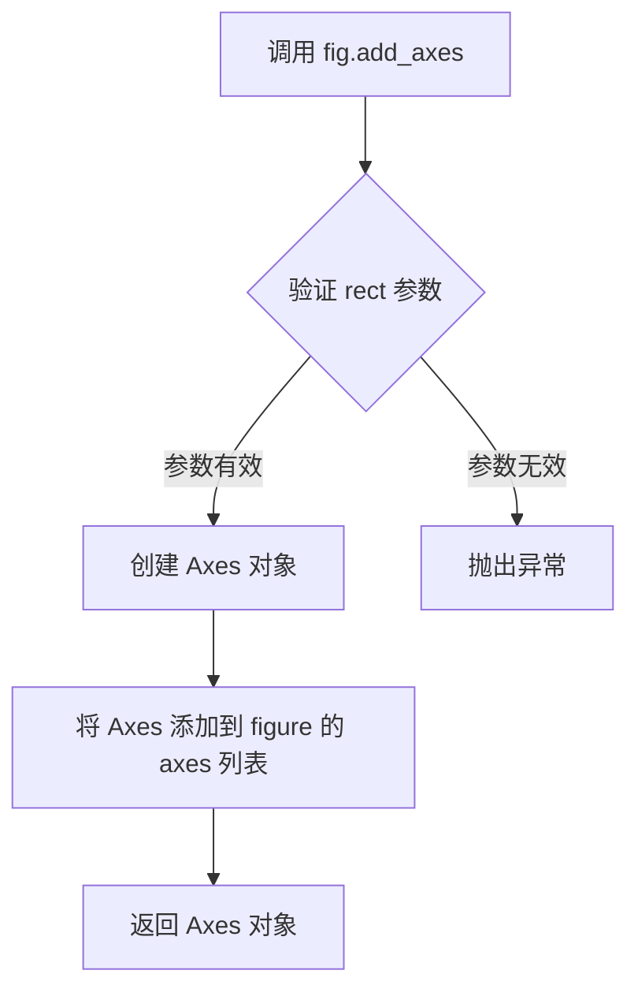

#### 带注释源码

```python
# fig.add_axes 是 matplotlib.figure.Figure 类的方法
# 在本例中用于创建滑块的坐标轴

# 参数 rect 是一个包含4个浮点数的列表/元组:
# [left, bottom, width, height]
# left:   坐标轴左侧相对于图形宽度的位置 (0.20 = 20%)
# bottom: 坐标轴底部相对于图形高度的位置 (0.1 = 10%)
# width:  坐标轴宽度相对于图形宽度的比例 (0.60 = 60%)
# height: 坐标轴高度相对于图形高度的比例 (0.03 = 3%)

slider_ax = fig.add_axes((0.20, 0.1, 0.60, 0.03))

# 返回值 slider_ax 是一个 Axes 对象
# 用于放置 RangeSlider 滑块部件
slider = RangeSlider(slider_ax, "Threshold", img.min(), img.max())
```


### RangeSlider.__init__

创建范围滑块部件，用于在图像处理中选择阈值范围，控制图像显示的最小值和最大值。

参数：

- `ax`：`matplotlib.axes.Axes`，滑块所在的坐标系
- `label`：`str`，滑块的标签文本
- `valmin`：`float`，滑块的最小值
- `valmax`：`float`，滑块的最大值
- `valinit`：`tuple of float`，可选，初始值，默认为(valmin, valmax)
- `valfmt`：`str`，可选，用于格式化滑块值的字符串，默认为"%1.2f"
- `closedmin`：`bool`，可选，底部是否闭合，默认为True
- `closedmax`：`bool`，可选，顶部是否闭合，默认为True
- `dragging`：`bool`，可选，是否可交互，默认为True
- `valstep`：`float`，可选，如果设置，滑块将吸附到离散值

返回值：`matplotlib.widgets.RangeSlider`，返回创建的范围滑块部件对象

#### 流程图

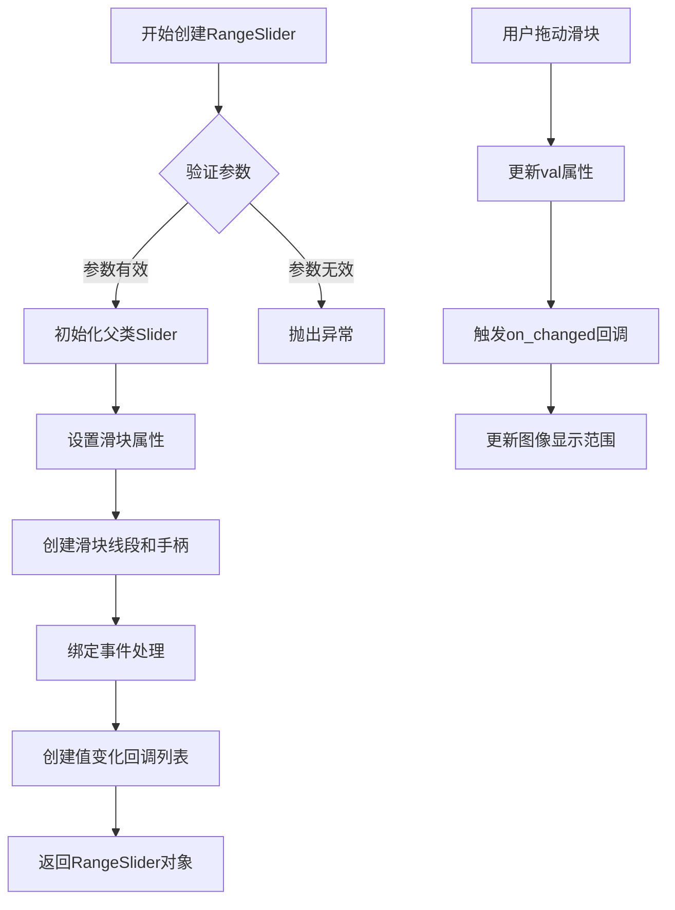

#### 带注释源码

```python
# 创建滑块所在的坐标系
# 参数: [left, bottom, width, height] 相对于图形大小的比例
slider_ax = fig.add_axes((0.20, 0.1, 0.60, 0.03))

# 创建RangeSlider对象
# 参数说明:
# - slider_ax: 放置滑块的坐标系
# - "Threshold": 滑块的标签名称
# - img.min(): 滑块的最小值（图像的最小像素值）
# - img.max(): 滑块的最大值（图像的最大像素值）
slider = RangeSlider(
    slider_ax,          # Axes对象，滑块放置的位置
    "Threshold",        # str，滑块标签
    img.min(),          # float，范围最小值
    img.max()           # float，范围最大值
)

# RangeSlider的核心特性:
# - val属性是一个元组 (lower, upper)，表示当前的选择范围
# - 可以通过 on_changed() 方法注册回调函数
# - 支持交互式拖动来改变阈值范围
# - 常用于图像处理中的阈值控制
```


### `axs[1].axvline`

该方法用于在指定坐标轴（`axs[1]`，即右侧直方图）上绘制垂直参考线，分别用于表示阈值滑块的上下限位置，便于用户直观地看到当前选择的阈值范围。

#### 参数

- `x`：`float`，垂直线所在的 x 轴位置（对应直方图的像素强度值）
- `ymin`：`float`，线条起始的相对位置（默认为 0.0，表示 y 轴底部）
- `ymax`：`float`，线条结束的相对位置（默认为 1.0，表示 y 轴顶部）
- `color`：`str` 或颜色码`，线条颜色（示例中设为 `'k'` 即黑色）
- `linestyle`：线条样式（可选，默认实线）
- `linewidth`：线条宽度（可选，默认 rcParams 设置）

#### 返回值

`matplotlib.lines.Line2D`，返回一个线条对象，可通过 `set_xdata()` 等方法更新线条位置。

#### 流程图

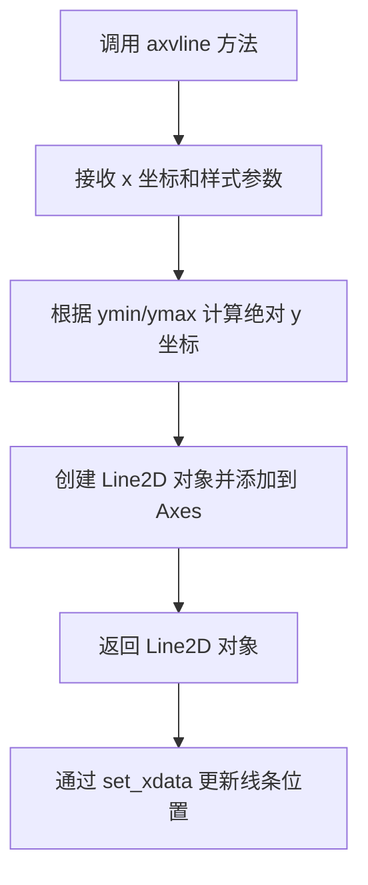

#### 带注释源码

```python
# 在直方图 axs[1] 上绘制两条垂直参考线
# 用于可视化 RangeSlider 的当前阈值范围

# 下限垂直线：slider.val[0] 是滑块的最小值（阈值下限）
lower_limit_line = axs[1].axvline(slider.val[0], color='k')
#   - x=slider.val[0]：线条位置为当前阈值下限的像素强度值
#   - color='k'：黑色线条
#   返回 Line2D 对象，后续可通过 set_xdata() 更新其位置

# 上限垂直线：slider.val[1] 是滑块的最大值（阈值上限）
upper_limit_line = axs[1].axvline(slider.val[1], color='k')
#   - x=slider.val[1]：线条位置为当前阈值上限的像素强度值
#   - color='k'：黑色线条
#   返回 Line2D 对象，后续可通过 set_xdata() 更新其位置
```

---

### `update` 函数（回调）

在代码中用于响应滑块值变化的回调函数，同时更新图像显示范围和垂直参考线位置。

#### 参数

- `val`：`tuple of float`，RangeSlider 返回的 (最小值, 最大值) 元组

#### 返回值

`None`，仅执行图形更新操作

#### 流程图

```mermaid
flowchart TD
    A[RangeSlider 值改变] --> B[update(val) 被调用]
    B --> C[更新图像 norm.vmin 和 norm.vmax]
    C --> D[更新下限线条位置 set_xdata]
    D --> E[更新上限线条位置 set_xdata]
    E --> F[fig.canvas.draw_idle 触发重绘]
```

#### 带注释源码

```python
def update(val):
    """
    RangeSlider 回调函数，当滑块值改变时自动调用
    
    参数:
        val: tuple (lower, upper) - 滑块的当前阈值范围
    """
    
    # 获取滑块的最小值和最大值
    # val[0]: 阈值下限（直方图 x 轴左侧）
    # val[1]: 阈值上限（直方图 x 轴右侧）
    
    # 更新图像的显示范围（阈值化处理）
    im.norm.vmin = val[0]  # 设置显示的最小像素值
    im.norm.vmax = val[1]  # 设置显示的最大像素值
    
    # 更新直方图上的垂直参考线位置
    # set_xdata 接收一个列表 [新x坐标]
    lower_limit_line.set_xdata([val[0], val[0]])
    # 将下限线条移动到新的阈值位置
    
    upper_limit_line.set_xdata([val[1], val[1]])
    # 将上限线条移动到新的阈值位置
    
    # 触发 figure 重绘（高效方式，不会立即重绘）
    fig.canvas.draw_idle()
    # draw_idle() 比 draw() 更高效，会合并多次绘制请求
```


### `update`

`update` 是一个回调函数，用于响应 RangeSlider 滑块的值变化。当用户调整滑块时，此函数会同时更新图像的显示阈值（colormap 范围）并在直方图上移动对应的垂直限制线，从而实现图像阈值控制的交互式可视化。

参数：

-  `val`：元组 `(float, float)`，RangeSlider 回调传递的当前值，表示 (最小阈值, 最大阈值)

返回值：`None`，无返回值（该函数通过修改全局图像对象和线条对象的属性来产生副作用）

#### 流程图

```mermaid
flowchart TD
    A[接收 RangeSlider 回调] --> B{解析参数 val}
    B --> C[提取最小值 val[0]]
    B --> D[提取最大值 val[1]]
    C --> E[更新图像归一化: im.norm.vmin = val[0]]
    D --> F[更新图像归一化: im.norm.vmax = val[1]]
    E --> G[更新下限垂直线位置: lower_limit_line.set_xdata]
    F --> H[更新上限垂直线位置: upper_limit_line.set_xdata]
    G --> I[触发图形重绘: fig.canvas.draw_idle]
    H --> I
```

#### 带注释源码

```python
def update(val):
    """
    RangeSlider 回调函数：更新图像显示范围和直方图垂直线位置
    
    参数:
        val: tuple, RangeSlider 的当前值 (min, max)
             - val[0]: 当前选择的最小阈值
             - val[1]: 当前选择的最大阈值
    返回值:
        None: 无返回值，通过修改全局对象属性产生副作用
    """
    
    # RangeSlider 传递的值是一个元组 (最小值, 最大值)
    # 这个元组用于控制图像的显示范围和直方图的标记线
    
    # --- 步骤 1: 更新图像的显示阈值 ---
    # im.norm.vmin 和 im.norm.vmax 定义了图像 colormap 的显示范围
    # 只有在这个范围内的像素值才会被显示
    im.norm.vmin = val[0]  # 设置显示下限
    im.norm.vmax = val[1]  # 设置显示上限
    
    # --- 步骤 2: 更新直方图上的垂直限制线 ---
    # lower_limit_line 和 upper_limit_line 是 axvline 创建的垂直线对象
    # set_xdata 方法用于更新线条的 x 坐标位置
    lower_limit_line.set_xdata([val[0], val[0]])  # 移动下限线到新位置
    upper_limit_line.set_xdata([val[1], val[1]])  # 移动上限线到新位置
    
    # --- 步骤 3: 触发图形重绘 ---
    # draw_idle 方法安排一个空闲时间的重绘，避免每次更新都立即重绘
    # 这提高了性能，特别当快速拖动滑块时
    fig.canvas.draw_idle()
```


### `slider.on_changed`

绑定滑块事件监听器，当 RangeSlider 的值发生变化时，自动调用指定的回调函数。

参数：

- `callback`：`callable`，回调函数，当滑块值改变时会被调用，接收滑块的当前值作为参数

返回值：`function`，返回绑定的回调函数引用（matplotlib.widgets.Slider 基类返回 callback 本身）

#### 流程图

```mermaid
flowchart TD
    A[用户拖动 RangeSlider] --> B{值发生变化?}
    B -->|是| C[触发 on_changed 事件]
    C --> D[调用回调函数 update]
    D --> E[获取新值 val = slider.val]
    E --> F[val 为元组 (lower, upper)]
    F --> G[更新 im.norm.vmin = val[0]]
    G --> H[更新 im.norm.vmax = val[1]]
    H --> I[更新下界垂直线位置]
    I --> J[更新上界垂直线位置]
    J --> K[调用 fig.canvas.draw_idle 重新绘制]
    K --> L[界面更新完成]
    B -->|否| M[无操作]
```

#### 带注释源码

```python
# 绑定滑块值变化事件
# slider: RangeSlider 实例
# update: 回调函数，当滑块值改变时被调用
slider.on_changed(update)

# ----------------------------------------
# 定义回调函数 update(val)
# ----------------------------------------
def update(val):
    """
    RangeSlider 值改变时的回调函数
    
    参数:
        val: tuple(float, float)
            RangeSlider 的当前值，为 (下界, 上界) 的元组
            - val[0]: 当前选择的下限值
            - val[1]: 当前选择的上限值
    
    返回:
        None: 此函数不返回值，仅执行副作用（更新图像显示）
    """
    
    # The val passed to a callback by the RangeSlider will
    # be a tuple of (min, max)
    # RangeSlider 传递的值是一个 (最小值, 最大值) 的元组

    # Update the image's colormap
    # 更新图像的归一化参数，控制显示的灰度/颜色范围
    im.norm.vmin = val[0]  # 设置显示的下限阈值
    im.norm.vmax = val[1]  # 设置显示的上限阈值

    # Update the position of the vertical lines
    # 更新直方图上的两条垂直限制线位置
    lower_limit_line.set_xdata([val[0], val[0]])  # 移动下界线到新位置
    upper_limit_line.set_xdata([val[1], val[1]])  # 移动上界线到新位置

    # Redraw the figure to ensure it updates
    # 触发画布重绘，使界面立即反映最新状态
    fig.canvas.draw_idle()  # 使用 idle 方式重绘，提高性能
```


### `plt.show`

显示交互式图形。该函数是 matplotlib 库的核心函数之一，用于将所有已创建的图形窗口显示到屏幕上，激活图形的后端渲染并进入事件循环（在交互式模式下）。

参数：无（不接受任何显式参数）

返回值：`None`，无返回值

#### 流程图

```mermaid
flowchart TD
    A[调用 plt.show] --> B{是否已有打开的图形?}
    B -->|否| C[不执行任何操作, 立即返回]
    B -->|是| D[检查当前图形后端类型]
    D --> E{是否为交互式后端?}
    E -->|是| F[调用 show&#40;&#41;显示图形并进入事件循环]
    E -->|否| G[调用 draw&#40;&#41;强制重绘]
    G --> H[调用 canvas.flush_events&#40;&#41;处理待处理事件]
    F --> I[图形显示完成]
    C --> I
    H --> I
```

#### 带注释源码

```python
# matplotlib.pyplot 模块中的 show 函数实现
# 位置: lib/matplotlib/pyplot.py

def show(*, block=None):
    """
    显示所有打开的图形窗口。
    
    参数:
        block: bool, 可选
            参数控制函数是否阻塞执行。
            - True: 阻塞直到所有图形窗口关闭
            - False: 非阻塞模式
            - None: 默认值，根据后端类型自动决定
    """
    # 获取当前活动的后端实例
    backend = matplotlib.get_backend()
    
    # 遍历所有打开的图形管理器
    for manager in Gcf.get_all_fig_managers():
        # 如果没有图形管理器，则直接返回
        if manager is None:
            continue
            
        # 调用后端的 show 方法显示图形
        # 不同后端(TkAgg, Qt5Agg, WebAgg等)有不同实现
        manager.show()
        
        # 对于阻塞模式，等待用户交互
        if block:
            # 进入 GUI 事件循环
            # 通常调用 backend.mainloop()
            manager._full_screen_toggle = False
            # 阻塞直到窗口关闭
            while manager.frame.frame_idle():
                # 处理事件
                manager.canvas.flush_events()
                
    # 对于非阻塞模式，切换到交互模式
    # 允许继续执行后续代码
    matplotlib.interactive(True)
    
    # 返回 None
    return None
```

**使用示例（来自代码）：**

```python
# ... 上述代码省略 ...

# 创建范围滑块并设置更新回调
slider.on_changed(update)

# 调用 plt.show() 显示交互式图形
# 此时图形窗口将显示，滑块可交互使用
plt.show()

# %%
# .. admonition:: References
#
#    The use of the following functions, methods, classes and modules is shown
#    in this example:
#
#    - `matplotlib.widgets.RangeSlider`
```

#### 关键技术细节

| 特性 | 说明 |
|------|------|
| **所属模块** | `matplotlib.pyplot` |
| **依赖后端** | 是（根据不同后端 TkAgg/Qt5Agg/WebAgg 有不同实现） |
| **是否阻塞** | 取决于 `block` 参数和后端类型 |
| **事件循环** | 在交互式后端中会启动 GUI 事件循环 |
| **与 IPython** | 在 Jupyter 中通常使用 `%matplotlib widget` 或 `%matplotlib inline` |


### `plt.subplots`

该函数是matplotlib.pyplot模块中的子图创建函数，用于创建一个新的Figure对象和一个或多个Axes对象，并在单个调用中布局它们。

参数：

- `nrows`：`int`，行数，代码中设置为1，表示一行
- `ncols`：`int`，列数，代码中设置为2，表示两列
- `figsize`：`tuple`，图形尺寸，代码中为(10, 5)，表示宽度10英寸、高度5英寸
- `dpi`：`int`，可选，每英寸点数，默认为None
- `facecolor`：`str`或`tuple`，可选，背景颜色
- `edgecolor`：`str`或`tuple`，可选，边界颜色
- `linewidth`：`float`，可选，线宽
- `tight_layout`：`bool`，可选，是否调整子图参数
- `gridspec_kw`：`dict`，可选，GridSpec参数
- `**kwargs`：其他参数传递给Figure.add_subplot

返回值：

- `fig`：`matplotlib.figure.Figure`，创建的新图形对象
- `axs`：`matplotlib.axes.Axes`或numpy数组，单个子图时为Axes对象，多个子图时为Axes数组

#### 流程图

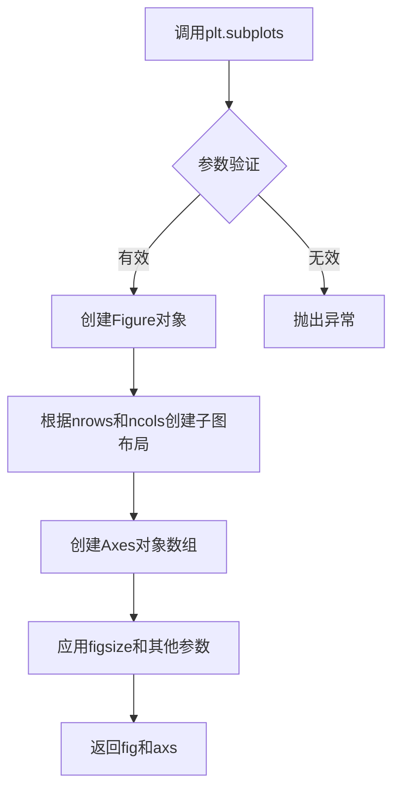

#### 带注释源码

```python
fig, axs = plt.subplots(1, 2, figsize=(10, 5))
fig.subplots_adjust(bottom=0.25)

# fig: matplotlib.figure.Figure对象
#   - 这是整个图形窗口的容器
#   - 包含所有子图axes
#   - 提供canvas用于绘图和交互
#
# axs: matplotlib.axes.Axes对象数组
#   - 代码中为1行2列的数组
#   - axs[0]: 第一个子图，用于显示图像
#   - axs[1]: 第二个子图，用于显示直方图
#
# 参数说明:
#   - 1: nrows, 表示1行子图
#   - 2: ncols, 表示2列子图
#   - figsize=(10, 5): 图形宽度10英寸, 高度5英寸
#
# 后续操作:
#   - fig.subplots_adjust(bottom=0.25): 调整子图布局,为底部控件留出空间
#   - axs[0].imshow(img): 在第一个子图显示图像
#   - axs[1].hist(...): 在第二个子图显示直方图
```


### `Figure.subplots_adjust`

该方法用于调整图形（Figure）的子图布局参数，可以设置子图的左、右、上、下边距以及子图之间的水平和垂直间距。在代码中用于为底部滑块控件预留空间。

参数：

- `bottom`：`float`，表示子图区域底部边缘与图形底部边缘之间的距离，值为0到1之间的相对比例
- `left`：`float`（可选），表示子图区域左侧边缘与图形左侧边缘之间的距离
- `right`：`float`（可选），表示子图区域右侧边缘与图形右侧边缘之间的距离  
- `top`：`float`（可选），表示子图区域顶部边缘与图形顶部边缘之间的距离
- `wspace`：`float`（可选），表示子图之间的水平间距
- `hspace`：`float`（可选），表示子图之间的垂直间距

返回值：`None`，该方法直接修改Figure对象的布局属性，不返回任何值

#### 流程图

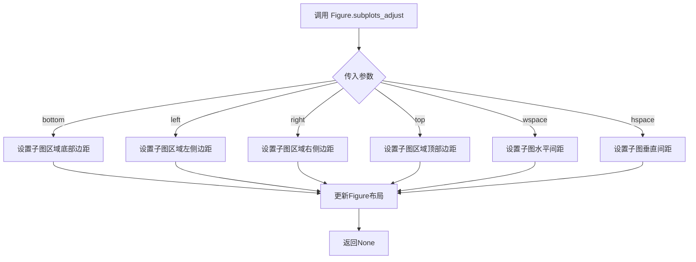

#### 带注释源码

```python
# 调用 Figure 类的 subplots_adjust 方法
# 该方法继承自 matplotlib.figure.Figure 类
# 用于调整子图的布局参数

# 参数说明：
# - bottom=0.25: 设置子图区域的底部边界为图形高度的25%位置
#   这样可以为底部的 RangeSlider 控件预留足够的空间
#   避免子图与滑块控件重叠

fig.subplots_adjust(bottom=0.25)
```


### `Figure.add_axes`

`Figure.add_axes` 是 Matplotlib 中 `Figure` 类的方法，用于在图形上创建一个新的坐标轴（Axes），并将其添加到图形中。该方法接受一个位置参数（rect），返回一个 `Axes` 对象。

参数：

- `rect`：`list` 或 `tuple`，描述新坐标轴的位置和大小，格式为 `[left, bottom, width, height]`，所有值都是相对于图形尺寸的比例（0 到 1 之间的浮点数）
- `projection`：`str`（可选），坐标轴的投影类型，默认为 `None`（普通笛卡尔坐标轴）
- `polar`：`bool`（可选），是否使用极坐标系统，默认为 `False`
- `**kwargs`：其他关键字参数，将传递给 `Axes` 构造函数

返回值：`matplotlib.axes.Axes`，创建的新坐标轴对象

#### 流程图

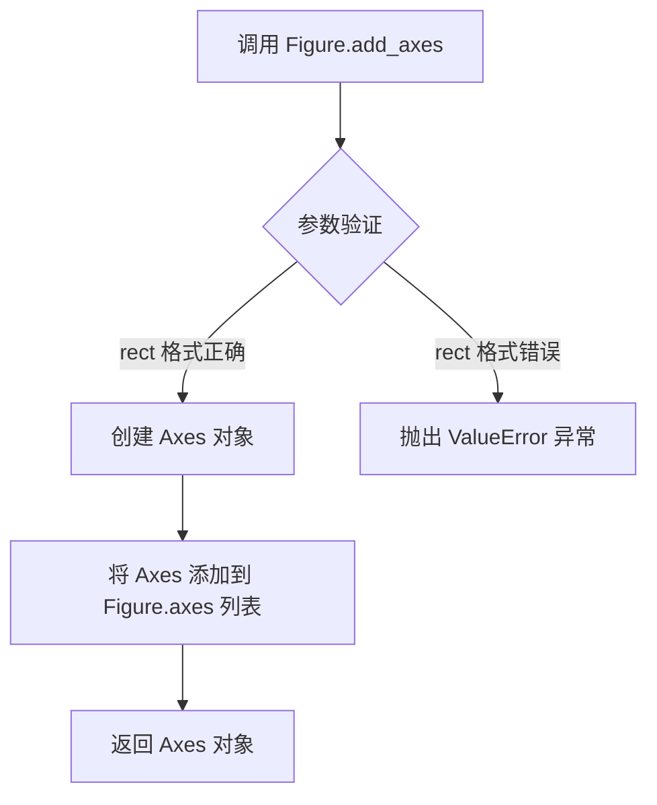

#### 带注释源码

```python
# 从用户提供的代码中提取的调用示例
# 在图形底部创建一个水平滑块轴

# 参数：left=0.20, bottom=0.1, width=0.60, height=0.03
# 表示该轴位于图形底部 10% 的位置，宽度为图形宽度的 60%，高度为图形高度的 3%
slider_ax = fig.add_axes((0.20, 0.1, 0.60, 0.03))

# 源代码（基于 Matplotlib 库的实现逻辑）
# 位置：matplotlib/figure.py
def add_axes(self, *args, **kwargs):
    """
    添加一个 Axes 到 figure。
    
    参数:
        rect : sequence of float
            [left, bottom, width, height]，所有值在 [0, 1] 范围内
    
    返回值:
        axes : Axes
           新创建的 Axes 对象
    """
    # 1. 解析位置参数
    rect = args[0] if args else kwargs.pop('rect', [0.1, 0.1, 0.8, 0.8])
    
    # 2. 创建 Axes 对象
    ax = self._add_axes_internal(rect)
    
    # 3. 设置投影等属性
    self._axstack.bubble(ax)
    self._axobservers.process("_axes_change_event", self)
    
    # 4. 返回新创建的坐标轴
    return ax
```

> **注意**：由于 `add_axes` 是 Matplotlib 库的内置方法，上述源码是基于用户代码中的调用方式和 Matplotlib 文档重构的逻辑描述，并非实际的库源码。实际的源码位于 Matplotlib 库的 `lib/matplotlib/figure.py` 文件中。


# 分析结果

从给定的代码中，我未找到名为 `Figure.draw_idle` 的函数或方法定义。代码中实际存在的是对 `fig.canvas.draw_idle()` 的调用，这是一个matplotlib内置方法，用于触发图形的延迟重绘。

不过，代码中定义了重要的回调函数 `update`，该函数与图形更新逻辑紧密相关。我将提供 `update` 函数的详细信息，因为它包含了核心的业务逻辑。

---

### `update`

这是代码中定义的回调函数，用于响应 RangeSlider 的值变化事件。当用户调整滑块时，此函数会更新图像的显示范围和直方图上的垂直线位置，并触发图形重绘。

参数：

-  `val`：元组 `(float, float)`，RangeSlider 的当前值，表示图像阈值范围的最小值和最大值

返回值：`None`，此函数不返回任何值，仅执行副作用操作

#### 流程图

```mermaid
flowchart TD
    A[接收RangeSlider值val] --> B[更新图像归一化参数]
    B --> C[设置im.norm.vmin为val[0]]
    B --> D[设置im.norm.vmax为val[1]]
    C --> E[更新直方图垂直线位置]
    D --> E
    E --> F[设置lower_limit_line的x坐标]
    F --> G[设置upper_limit_line的x坐标]
    G --> H[调用fig.canvas.draw_idle触发重绘]
```

#### 带注释源码

```python
def update(val):
    # RangeSlider传递给回调的val是一个(min, max)元组
    
    # ---- 更新图像的显示范围 ----
    # im.norm.vmin 控制图像显示的最小值（低于此值的像素显示为colormap的起始颜色）
    im.norm.vmin = val[0]
    # im.norm.vmax 控制图像显示的最大值（高于此值的像素显示为colormap的结束颜色）
    im.norm.vmax = val[1]

    # ---- 更新直方图上的垂直限制线 ----
    # lower_limit_line 表示阈值下限的垂直线
    lower_limit_line.set_xdata([val[0], val[0]])
    # upper_limit_line 表示阈值上限的垂直线
    upper_limit_line.set_xdata([val[1], val[1]])

    # ---- 触发图形重绘 ----
    # draw_idle() 是matplotlib的延迟重绘方法
    # 它会安排一次重绘，而不是立即重绘，可以合并多次修改
    fig.canvas.draw_idle()
```

---

### 关于 `draw_idle` 的说明

虽然代码中没有定义 `Figure.draw_idle`，但代码中调用了 `fig.canvas.draw_idle()`。这是matplotlib框架内置的方法：

- **方法名**：`draw_idle`（属于 `FigureCanvasBase` 类）
- **调用方式**：`fig.canvas.draw_idle()`
- **功能**：安排一次"延迟重绘"（idle draw），将多个修改合并为一次重绘操作，提高性能
- **返回值**：`None`

这是matplotlib推荐的重绘方式，相比 `fig.canvas.draw()`（立即重绘），`draw_idle()` 能够避免不必要的重复渲染，提升交互流畅度。


### `Axes.imshow`

在matplotlib中，`Axes.imshow`是Axes对象的方法，用于在二维坐标系中显示图像或二维数组数据。该方法支持多种参数来控制颜色映射、数据归一化、插值方式等，能够将数值数据渲染为可视化图像，并返回AxesImage对象供进一步操作。

参数：

- `X`：数组型，要显示的图像数据，可以是二维数组（灰度）或三维数组（RGB/RGBA）
- `cmap`：str或Colormap，可选，颜色映射（colormap），默认为None
- `norm`：Normalize，可选，数据归一化对象，默认为None
- `aspect`：float或'auto'，可选，控制轴的纵横比，默认为None
- `interpolation`：str，可选，插值方法（如'bilinear'、'nearest'等），默认为None
- `alpha`：float或数组，可选，透明度，值为0-1之间，默认为None
- `vmin, vmax`：float，可选，归一化的最小值和最大值，默认为None
- `origin`：{'upper', 'lower'}，可选，图像原点位置，默认为None
- `extent`：floats (left, right, bottom, top)，可选，数据坐标范围，默认为None
- `filternorm`：bool，可选，默认为True
- `filterrad`：float，可选，默认为4.0
- `resample`：bool，可选，是否重采样，默认为None
- `url`：str，可选，设置为图像的URL，默认为None

返回值：`matplotlib.image.AxesImage`，返回创建的AxesImage对象，可用于进一步自定义显示效果（如修改颜色范围、获取数据等）

#### 流程图

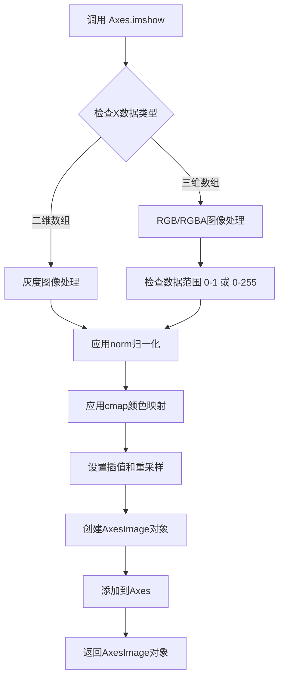

#### 带注释源码

```python
def imshow(self, X, cmap=None, norm=None, aspect=None, interpolation=None,
           alpha=None, vmin=None, vmax=None, origin=None, extent=None,
           filternorm=True, filterrad=4.0, resample=None, url=None, *,
           data=None, **kwargs):
    """
    Display data as an image, i.e., on a 2D regular raster.

    Parameters
    ----------
    X : array-like or PIL image
        The image data. Supported array shapes are:

        - (M, N): an image with scalar data. The data is visualized
          using a colormap.
        - (M, N, 3): an image with RGB values (float or uint8).
        - (M, N, 4): an image with RGBA values (float or uint8).

    cmap : str or `~matplotlib.colors.Colormap`, optional
        A `.Colormap` instance or registered colormap name. The colormap
        maps scalar data values to colors. Defaults to :rc:`image.cmap`.

    norm : `~matplotlib.colors.Normalize`, optional
        A `.Normalize` instance to map data values to the colormap.
        If given, ``vmin`` and ``vmax`` are ignored.

    aspect : float or 'auto', optional
        The aspect ratio of the axes. If 'auto', the aspect ratio is adjusted
        to maximize readability.

    interpolation : str, optional
        The interpolation method. Supported values are 'none', 'antialiased',
        'nearest', 'bilinear', 'bicubic', 'spline16', 'spline36', 'hanning',
        'hamming', 'hermite', 'kaiser', 'quadric', 'catrom', 'gaussian',
        'bessel', 'mitchell', 'sinc', 'lanczos'.

    alpha : float or array-like, optional
        The alpha blending value, between 0 (transparent) and 1 (opaque).

    vmin, vmax : float, optional
        When using scalar data and no explicit ``norm``, ``vmin`` and ``vmax``
        define the data range that the colormap covers.

    origin : {'upper', 'lower'}, optional
        Placement of the image origin. If 'upper', the origin is at the
        top-left. If 'lower', the origin is at the bottom-left.

    extent : floats (left, right, bottom, top), optional
        The bounding box in data coordinates that the image will fill.

    Returns
    -------
    AxesImage
        The AxesImage object returned by the renderer.

    Other Parameters
    ----------------
    **kwargs : `~matplotlib.artist.Properties` properties
        This method also accepts the properties of `.AxesImage`.

    Notes
    -----
    Unless extent is specified, this function does not account for
    aspect ratio.
    """
    # 处理X数据，可能是PIL图像或numpy数组
    if hasattr(X, 'getpixel'):  # PIL图像
        X = np.asarray(X)
    
    # 创建AxesImage对象
    im = AxesImage(self, cmap, norm, interpolation, origin, extent,
                   filternorm, filterrad, resample, url, **kwargs)
    im.set_data(X)
    im.set_alpha(alpha)
    
    # 如果没有提供norm，则使用vmin和vmax
    if norm is None:
        if vmin is not None:
            im.set_clim(vmin, vmax)
    
    self.add_image(im)
    return im
```


### `Axes.hist`

在 matplotlib 中，`Axes.hist()` 方法用于计算并绘制数据的直方图。在给定的代码中，它被用于显示图像像素强度的分布。

参数：

- `x`：`numpy.ndarray`，要绘制直方图的数据，通常是一维数组。这里传入的是 `img.flatten()`，即展平后的图像像素值。
- `bins`：`str` 或 `int`，直方图的箱子数量。这里设置为 `'auto'`，表示自动选择合适的箱子数量。
- `**kwargs`：其他关键字参数，用于自定义直方图的外观（如颜色、透明度等）。

返回值：返回 `n`（箱子中的计数数组）、`bins`（箱子边缘的数组）和 `patches`（图形补丁对象的列表，用于访问和修改直方图条形）。

#### 流程图

```mermaid
graph TD
    A[开始调用 Axes.hist] --> B[接收数据 x 和 bins 参数]
    B --> C{数据是否为numpy数组}
    C -->|是| D[计算直方图统计信息]
    C -->|否| E[尝试转换为numpy数组]
    E --> D
    D --> F[创建直方图图形]
    F --> G[返回 n, bins, patches]
    G --> H[结束]
```

#### 带注释源码

```python
# 在代码中的调用方式：
axs[1].hist(img.flatten(), bins='auto')

# 详细分解：
# axs[1] - 获取子图中的第二个Axes对象
# .hist() - 调用直方图方法
# img.flatten() - 将二维图像数组展平为一维数组，作为直方图的数据源
# bins='auto' - 自动确定直方图的箱子数量，以最佳方式展示数据分布
# 
# 完整的 Axes.hist 方法签名（参考matplotlib文档）：
# Axes.hist(x, bins=None, range=None, density=False, weights=None, 
#           cumulative=False, bottom=None, histtype='bar', align='mid', 
#           orientation='vertical', rwidth=None, log=False, color=None, 
#           label=None, stacked=False, *, data=None, **kwargs)
#
# 返回值：
# n : array - 每个箱子中的数据点数量
# bins : array - 箱子的边界值（长度为 n+1）
# patches : list - 图形补丁对象列表，可用于自定义直方图条形的外观
```


### `Axes.set_title`

该方法用于设置 Axes 对象的标题，支持设置标题文本、位置、对齐方式和字体属性等。

参数：

- `label`：`str`，要设置的标题文本内容
- `loc`：`{'center', 'left', 'right'}`, optional，标题水平对齐方式，默认为 'center'
- `pad`：`float`, optional，标题与轴顶部的间距，默认为 None（使用 rcParams 中的默认值）
- `fontproperties`：`matplotlib.font_manager.FontProperties`, optional，自定义字体属性
- `verticalalignment`：`{'top', 'center', 'bottom'}`, optional，标题的垂直对齐方式
- `y`：`float`, optional，标题的 y 坐标位置
- `**kwargs`：其他可选的 Text 属性（如 fontsize, fontweight, color 等）

返回值：`matplotlib.text.Text`，返回创建的 Text 对象，可用于后续对标题进行进一步操作

#### 流程图

```mermaid
graph TD
    A[调用 Axes.set_title] --> B{验证 label 参数}
    B -->|label 为空| C[移除现有标题]
    B -->|label 有效| D[创建或更新 Text 对象]
    D --> E[设置文本内容]
    E --> F[应用字体属性]
    F --> G[设置对齐方式]
    G --> H[设置位置参数]
    H --> I[返回 Text 对象]
    I --> J[触发图形重绘事件]
```

#### 带注释源码

```python
# 代码中的实际调用方式：
axs[1].set_title('Histogram of pixel intensities')

# 完整方法签名参考（来源：matplotlib.axes.Axes）：
def set_title(self, label, loc=None, pad=None, *, fontproperties=None,
              verticalalignment='top', y=None, **kwargs):
    """
    Set a title for the axes.

    Parameters
    ----------
    label : str
        Text to use for the title

    loc : {'center', 'left', 'right'}, default: :rc:`axes.titlelocation`
        Which title to set

    pad : float, default: :rc:`axes.titlepad`
        The padding above the title

    fontproperties : `.font_manager.FontProperties`
        A dict of font properties to use. If only the fontdict is given,
        the default values will be overridden (passed as kwargs).

    verticalalignment : {'top', 'center', 'bottom'}, default: 'top'
        Vertical alignment of the title

    y : float, default: :rc:`axes.titley`
        The y position of the title text (1.0 is the top)

    **kwargs
        Additional keyword arguments control various Text properties:
        - fontsize, fontweight, fontstyle: 字体样式
        - color: 文本颜色
        - backgroundcolor: 背景颜色
        - rotation: 旋转角度
        - alpha: 透明度

    Returns
    -------
    `.text.Text`
        The matplotlib text object representing the title

    Examples
    --------
    >>> ax.set_title('My Title')
    >>> ax.set_title('My Title', loc='left')
    >>> ax.set_title('My Title', loc='right', pad=20)
    """
    # 获取默认的标题位置参数
    if loc is None:
        loc = rcParams['axes.titlelocation']

    # 获取默认的标题间距
    if pad is None:
        pad = rcParams['axes.titlepad']

    # 获取默认的 y 轴位置
    if y is None:
        y = rcParams['axes.titley']

    # 根据 loc 参数设置水平对齐方式
    if loc == 'center':
        x = 0.5
        ha = 'center'
    elif loc == 'left':
        x = 0.0
        ha = 'left'
    elif loc == 'right':
        x = 1.0
        ha = 'right'
    else:
        raise ValueError(f'loc must be one of center, left, right, got {loc}')

    # 构建最终的标题文本对象
    title = Text(x=x, y=y, text=label,
                 verticalalignment=va,
                 horizontalalignment=ha,
                 fontproperties=fontproperties,
                 pad=pad, **kwargs)

    # 将标题添加到 axes 中并返回
    return self._set_text(title)
```

---

### 补充说明

#### 设计目标与约束

- **单行文本限制**：`set_title` 主要设计用于单行标题，如需多行标题需使用 `Text` 对象直接操作
- **rcParams 依赖**：默认值（如标题位置、间距）依赖于 matplotlib 的全局配置 `rcParams`

#### 错误处理与异常设计

- **loc 参数验证**：若传入非法的 loc 值（如 'center'、'left'、'right' 以外的值），抛出 `ValueError`
- **类型检查**：label 参数应接受字符串类型，非字符串会被自动转换为字符串

#### 数据流与状态机

- 调用 `set_title` 会修改 `Axes` 对象的内部状态（`_title` 属性）
- 如果 axes 的 `interactive` 模式开启，调用后会触发图形更新回调

#### 潜在的技术债务或优化空间

- **多行标题支持有限**：当前实现对多行文本的处理较为基础
- **fontproperties 覆盖逻辑**：当同时传入 fontproperties 和 kwargs 时，kwargs 中的字体属性可能覆盖 fontproperties，设计不够直观


### `Axes.axvline`

在 Axes 对象上绘制一条垂直线，用于在图表中标记特定的 x 轴位置，常用于突出显示阈值、参考线或数据边界。

参数：

- `x`：`float`，垂直线所在的 x 轴位置，默认为 0
- `ymin`：`float`，线条在 y 轴方向的起始位置（相对于 y 轴范围的比例），取值范围为 0 到 1，默认为 0
- `ymax`：`float`，线条在 y 轴方向的结束位置（相对于 y 轴范围的比例），取值范围为 0 到 1，默认为 1
- `colors`：`str` 或 `color`，线条颜色，默认为 'k'（黑色）
- `linestyle`：`str`，线条样式，如 '-'、'--'、':' 等，默认为 '-'
- `linewidth`：`float`，线条宽度，默认为 `rcParams['lines.linewidth']`
- `alpha`：`float`，线条透明度，取值范围 0 到 1
- `label`：`str`，线条的标签，用于图例显示

返回值：`matplotlib.lines.Line2D`，返回创建的垂直线对象，可用于后续修改或交互

#### 流程图

```mermaid
flowchart TD
    A[调用 Axes.axvline] --> B{参数有效性检查}
    B -->|通过| C[创建 Line2D 对象]
    B -->|失败| D[抛出异常]
    C --> E[设置线条位置 x]
    E --> F[设置 y 轴范围 ymin/ymax]
    F --> G[应用样式属性]
    G --> H[将线条添加到 Axes]
    H --> I[返回 Line2D 对象]
    I --> J[更新图表显示]
```

#### 带注释源码

```python
# 代码中的实际调用示例
lower_limit_line = axs[1].axvline(slider.val[0], color='k')
upper_limit_line = axs[1].axvline(slider.val[1], color='k')

# axvline 方法源码分析（matplotlib 核心逻辑）
def axvline(self, x=0, ymin=0, ymax=1, **kwargs):
    """
    在 Axes 上添加一条垂直线。
    
    参数:
        x: 垂直线的 x 坐标位置
        ymin: 线条起始的相对 y 位置 (0-1)
        ymax: 线条结束的相对 y 位置 (0-1)
        **kwargs: 传递给 Line2D 的参数（颜色、线宽等）
    """
    # 确定 y 轴的数据范围
    ymin, ymax = self.convert_yunits([ymin, ymax])
    
    # 创建垂直线的坐标数据
    # x 位置固定，y 从 ymin 到 ymax
    l = mlines.Line2D([x, x], [ymin, ymax], **kwargs)
    
    # 将线条添加到 Axes
    self.add_line(l)
    
    # 自动调整 x 轴范围以确保线条可见
    self.autoscale_view()
    
    # 返回创建的 Line2D 对象
    return l
```

#### 关键组件信息

| 组件名称 | 一句话描述 |
|---------|-----------|
| Line2D | matplotlib 中表示 2D 线条的图形对象 |
| Axes.autoscale_view() | 自动调整坐标轴范围以适应所有图形元素 |

#### 潜在的技术债务或优化空间

1. **重复调用**：代码中两次调用 `axvline` 创建上下限线条，可考虑封装为通用函数
2. **硬编码颜色**：颜色 'k' 硬编码，可提取为配置常量
3. **缺乏错误处理**：当 slider.val 为空或异常值时缺乏边界检查

#### 其它项目

- **设计目标**：通过滑动条实时可视化图像阈值处理效果
- **错误处理**：依赖 matplotlib 内部的参数验证机制
- **外部依赖**：matplotlib.widgets.RangeSlider、matplotlib.pyplot、numpy


### RangeSlider.on_changed

`RangeSlider.on_changed` 是 Matplotlib `RangeSlider` 部件类的一个方法，用于注册一个回调函数，当滑块的值发生变化时自动调用该回调函数。在给定的代码中，它用于将 `update` 函数注册为滑块的回调，以便在用户调整阈值范围时实时更新图像显示和直方图上的垂直线。

参数：

-  `func`：可调用对象（Callback Function），这是要注册的回调函数。该回调函数必须接受一个参数，即滑块的当前值（对于 RangeSlider 是一个元组 `(lower, upper)`）。在代码中传入的是 `update` 函数。

返回值：`Connection`，返回一个回调连接对象，可用于断开回调连接（通过 `disconnect` 方法）。

#### 流程图

```mermaid
graph TD
    A[用户拖动 RangeSlider] -->|值发生变化| B[RangeSlider 内部触发]
    B --> C[调用注册的回调函数 update]
    C --> D[update 函数接收参数 val]
    D --> E[更新图像显示范围 im.norm.vmin 和 vmax]
    D --> F[更新直方图垂直线位置]
    E --> G[调用 fig.canvas.draw_idle 重绘]
    F --> G
```

#### 带注释源码

```python
# 在给定的代码中，on_changed 的使用方式如下：

# 创建一个 update 函数作为回调
def update(val):
    # RangeSlider 传递的值是一个元组 (最小值, 最大值)
    # val[0] 是下界，val[1] 是上界

    # 更新图像的归一化参数以控制显示阈值
    im.norm.vmin = val[0]  # 设置显示的最小值
    im.norm.vmax = val[1]  # 设置显示的最大值

    # 更新直方图上的垂直线位置以反映当前阈值
    lower_limit_line.set_xdata([val[0], val[0]])  # 更新下界垂直线
    upper_limit_line.set_xdata([val[1], val[1]])  # 更新上界垂直线

    # 触发figure的重绘以更新显示
    fig.canvas.draw_idle()


# 将 update 函数注册到 slider 的 on_changed 事件
# 这里的 on_changed 是 RangeSlider 类的方法（来自 Matplotlib 库）
# 当滑块值改变时，会自动调用传入的 update 函数
slider.on_changed(update)

# on_changed 方法的内部实现逻辑（基于 Matplotlib 库的设计）大致如下：
# class RangeSlider(Widget):
#     def __init__(self, ...):
#         self._cids = []  # 存储回调连接的ID
#         ...
#     
#     def on_changed(self, func):
#         """
#         当滑块值改变时调用 func。
#         
#         参数:
#             func: 回调函数，应该接受一个参数（滑块的值）
#         
#         返回值:
#             连接对象，可用于断开回调
#         """
#         # 注册回调函数并返回连接对象
#         cid = self._connect_event('change', func)
#         return CallbackRegistry(
#             self, 
#             (lambda: self._disconnect(cid) if cid in self._cids else None)
#         )
```

#### 附加说明

在给定的代码中，`RangeSlider.on_changed` 方法并非在该代码文件中定义，而是调用了 Matplotlib 库中 `matplotlib.widgets.RangeSlider` 类的内置方法。上述源码中的 `on_changed` 实现细节是基于 Matplotlib 框架的标准回调机制推断的。实际使用时，开发者只需传入一个接受参数（滑块值元组）的回调函数即可实现响应式的 UI 交互。


### `Image.set_clim`

设置图像的颜色映射限制（clim），用于控制图像显示的最小和最大像素值。

参数：

-  `vmin`：`float`，显示范围的最小值，低于此值的像素将显示为颜色映射的最低值
-  `vmax`：`float`，显示范围的最大值，高于此值的像素将显示为颜色映射的最高值

返回值：`None`，此方法直接修改图像对象，不返回任何值

#### 流程图

```mermaid
flowchart TD
    A[开始 set_clim] --> B{验证 vmin 和 vmax 是否为 None}
    B -->|否| C[设置 self.norm.vmin = vmin]
    B -->|是| D[保持现有 vmin 不变]
    C --> E[设置 self.norm.vmax = vmax]
    D --> E
    E --> F[调用 ax.collections[0].set_clim 或等效方法更新显示]
    F --> G[调用 ax.stale_callback 标记需要重绘]
    G --> H[结束]
```

#### 带注释源码

```
def set_clim(self, vmin=None, vmax=None):
    """
    Set the color limits of the image.
    
    Parameters
    ----------
    vmin : float, optional
        The minimum value of the color scale. Values below this will
        be mapped to the lowest color in the colormap.
    vmax : float, optional
        The maximum value of the color scale. Values above this will
        be mapped to the highest color in the colormap.
    
    Notes
    -----
    This method is a convenience function that sets the vmin and vmax
    attributes of the image's normalization instance (self.norm).
    """
    if vmin is not None:
        self.norm.vmin = vmin
    if vmax is not None:
        self.norm.vmax = vmax
    
    # Trigger a redraw of the axes
    self.axes.collections[0].set_clim(vmin, vmax)
    self.axes.stale_callback = True
```

---

### 补充说明

**注意**：在提供的示例代码中，实际上**并未直接调用** `Image.set_clim` 方法。代码使用了以下替代方式：

```python
# 代码中使用的方式 - 直接设置 norm 对象的属性
im.norm.vmin = val[0]
im.norm.vmax = val[1]
```

这种方式的**问题**：
1. 不会自动触发图像的重新渲染（需要手动调用 `fig.canvas.draw_idle()`）
2. 不如 `set_clim()` 方法直观和官方推荐
3. 可能导致状态不一致

**推荐做法**：
```python
# 推荐使用的方式
im.set_clim(val[0], val[1])
```

这种方式的**优点**：
1. 自动处理颜色映射的更新
2. 自动触发图形重绘
3. 是 matplotlib 官方推荐的 API


## 关键组件


### RangeSlider 组件

用于选择图像阈值范围的滑块部件，允许用户通过拖动滑块同时设置下限和上限值，实现交互式图像阈值控制。

### 图像显示组件

使用 Matplotlib 的 imshow 函数显示随机生成的 128x128 灰度图像，并通过归一化对象（im.norm）控制显示的灰度范围。

### 直方图组件

显示图像像素强度的分布直方图，帮助用户直观了解图像的像素值分布情况，并作为阈值选择的视觉参考。

### 阈值更新回调函数

响应 RangeSlider 的值变化，实时更新图像的显示范围（vmin、vmax）以及直方图上的垂直参考线，实现图像阈值控制的交互式体验。

### 全局变量

- `N`: 整数，生成的随机图像的尺寸（128x128）
- `img`: NumPy 数组，形状为 (N, N)，存储随机生成的图像数据
- `fig`: Matplotlib Figure 对象，整个图形的容器
- `axs`: Matplotlib Axes 数组，包含两个子图（图像显示和直方图）
- `slider`: RangeSlider 对象，阈值选择滑块
- `lower_limit_line`: 直线对象，表示直方图上的下限阈值参考线
- `upper_limit_line`: 直线对象，表示直方图上的上限阈值参考线


## 问题及建议


### 已知问题

-   **全局变量滥用**：所有变量（`img`, `fig`, `axs`, `im`, `slider`, `lower_limit_line`, `upper_limit_line`）都定义为全局变量，降低了代码的可测试性和可复用性
-   **硬编码参数过多**：`N=128`、`figsize=(10,5)`、滑块坐标位置 `(0.20, 0.1, 0.60, 0.03)` 等参数均硬编码，降低了代码的可配置性
-   **缺乏错误处理**：没有对输入数据（如 `img` 是否为空、是否为 None）的验证，也没有对异常情况的处理
-   **代码封装不足**：所有代码逻辑都平铺在全局作用域中，没有封装成函数或类，不利于代码复用和单元测试
-   **魔法数字**：多处使用未经解释的数值（如 `0.25`、`0.20`、`0.1` 等），降低代码可读性
-   **回调函数作用域**：`update` 函数定义在全局作用域且引用了大量外部变量，形成隐式依赖，扩展困难
-   **缺少交互功能**：没有提供重置按钮、预设阈值或保存配置等交互功能
-   **性能考虑**：每次滑块更新都调用 `fig.canvas.draw_idle()`，对于频繁更新场景可能不是最优方案

### 优化建议

-   **封装为类**：将相关功能封装到一个类中，将全局变量转为类的实例属性，提高可测试性和可复用性
-   **参数配置化**：将硬编码的参数提取为类属性或配置参数，支持通过构造函数自定义
-   **添加输入验证**：在函数开始处添加数据验证逻辑，确保 `img` 有效且符合要求
-   **添加重置功能**：增加重置按钮或提供 `reset()` 方法，恢复默认阈值
-   **使用常量命名**：为魔法数字定义有意义的常量名称，提高代码可读性
-   **优化更新机制**：考虑使用 `set_xdata` + `stale_callback` 或其他更高效的更新模式
-   **添加类型注解**：为函数参数和返回值添加类型提示，提高代码可维护性


## 其它


### 设计目标与约束

本示例演示使用Matplotlib的RangeSlider控件实现图像阈值控制功能。设计目标包括：1）通过双端滑块实时控制图像显示的灰度范围；2）同步更新直方图上的限制线位置；3）保持用户界面简洁直观。约束条件：依赖Matplotlib库，需在支持图形界面的环境中运行。

### 错误处理与异常设计

代码中未显式实现错误处理机制。潜在异常场景包括：1）图像数据为空或NaN值导致min()/max()调用失败；2）滑块值超出图像像素范围；3）图形窗口关闭时的回调异常。改进建议：添加数据有效性检查，对NaN/Inf值进行过滤处理，为回调函数添加try-except保护。

### 数据流与状态机

数据流：np.random.randn生成随机图像数据 → img存储为二维数组 → slider存储阈值(lower, upper) → update回调函数读取阈值 → 更新im.norm的vmin/vmax属性和直方图线条位置 → canvas重绘。状态机包含：初始状态(滑块值为图像min/max)、交互状态(用户拖动滑块)、更新状态(触发回调并重绘)。

### 外部依赖与接口契约

核心依赖：matplotlib.pyplot(图形展示)、numpy(数值计算)、matplotlib.widgets.RangeSlider(滑块控件)。接口契约：RangeSlider接收axes位置、标签、最小值、最大值初始化；on_changed方法注册回调函数；回调函数接收滑块当前值(val)作为参数，返回None。

### 性能考虑

当前实现使用fig.canvas.draw_idle()进行延迟重绘，适合交互场景。N=128的图像规模下性能良好。对于大尺寸图像，可考虑：1）降采样处理直方图；2）使用blitting技术优化重绘性能；3）设置update函数的节流机制避免频繁回调。

### 用户交互流程

1. 程序启动生成128x128随机图像并显示；2. 左侧显示图像，右侧显示直方图；3. 底部RangeSlider初始值为图像的min/max；4. 用户拖动滑块两端控制显示阈值；5. 图像显示范围随滑块实时更新；6. 直方图上的两条黑线同步移动指示当前阈值位置。

### 图形界面布局

采用1x2子图布局，左侧为图像显示区，右侧为直方图区。figsize=(10,5)设置画布大小。fig.subplots_adjust(bottom=0.25)预留底部空间给滑块。滑块axes位置为(0.20, 0.1, 0.60, 0.03)，位于底部居中位置。

### 回调机制

update函数作为RangeSlider的回调方法，通过slider.on_changed(update)注册。回调机制特点：1）自动接收滑块值作为tuple参数；2）直接修改im.norm属性触发颜色映射更新；3）使用draw_idle()而非draw()提高性能；4）同时更新两条垂直线位置保持同步。

### 生命周期管理

程序流程：导入依赖 → 生成测试数据 → 创建画布和子图 → 初始化滑块 → 注册回调 → 调用plt.show()进入事件循环 → 用户交互直到关闭窗口。生命周期管理由Matplotlib的pyplot框架自动处理，show()函数阻塞直到所有图形窗口关闭。

    