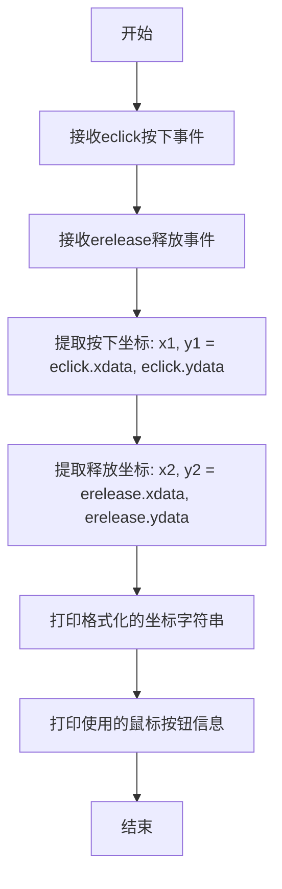
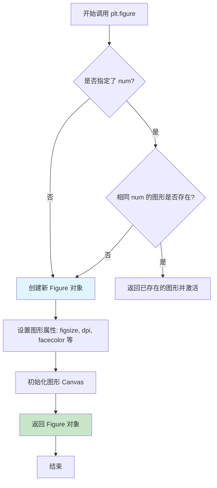
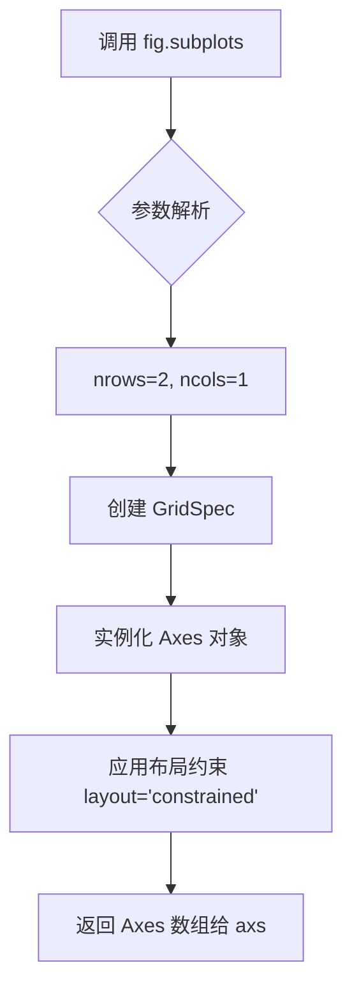
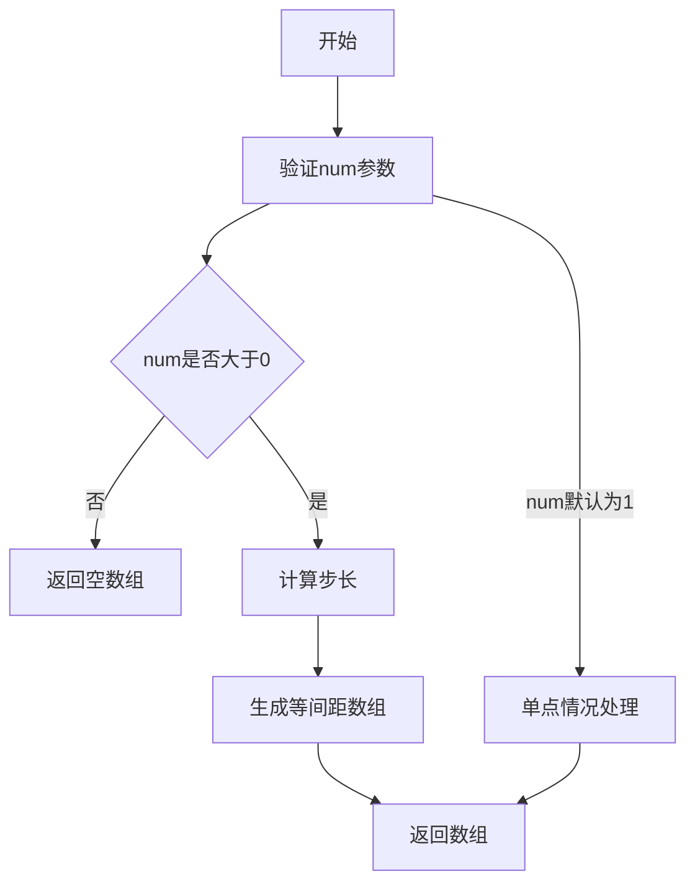
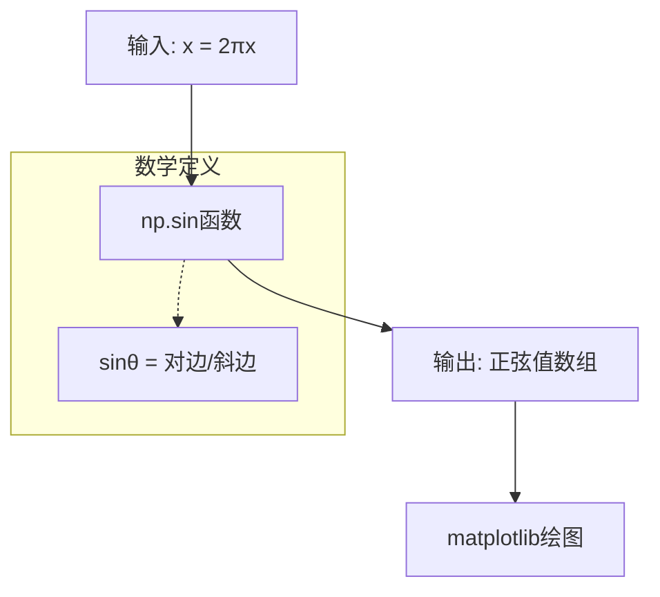
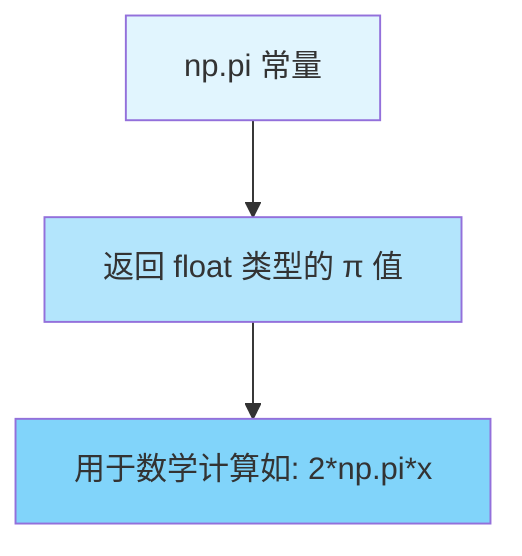
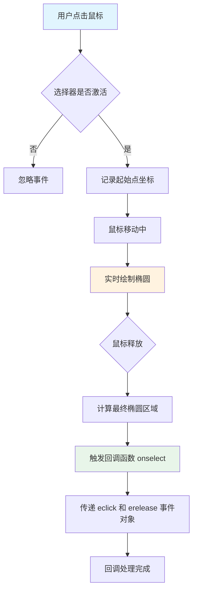
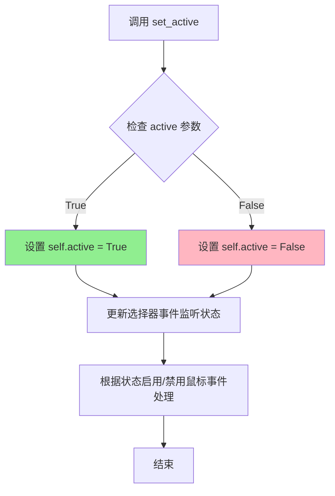
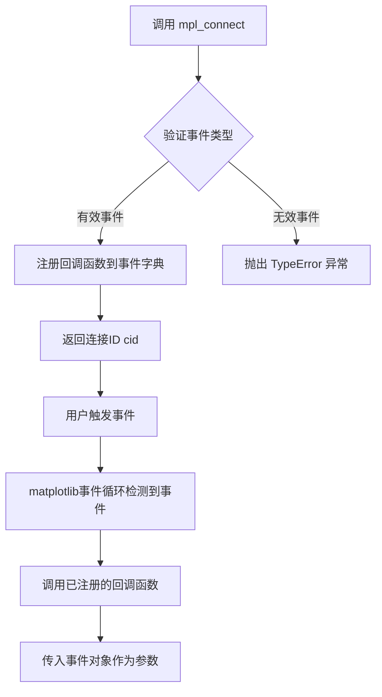
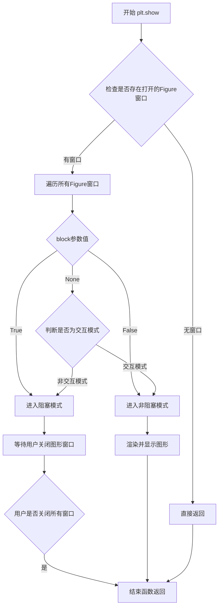

# `matplotlib\galleries\examples\widgets\rectangle_selector.py` 详细设计文档

这是一个matplotlib示例程序，演示了RectangleSelector和EllipseSelector小部件的使用。用户可以通过点击和拖动鼠标在图表上绘制矩形或椭圆，并可通过按下't'键来切换选择器的激活状态。该示例还展示了如何使用blitting技术优化大量数据点的绘图性能。

## 整体流程

```mermaid
graph TD
    A[开始] --> B[导入所需库: matplotlib.pyplot, numpy, widgets]
B --> C[定义select_callback函数]
C --> D[定义toggle_selector函数]
D --> E[创建Figure和Axes子图]
E --> F[生成数据: x = np.linspace(0, 10, N)]
F --> G[遍历axes和selector_class]
G --> H[在每个ax上绑定对应的Selector]
H --> I[连接key_press_event到toggle_selector]
I --> J[调用plt.show()显示图形]
J --> K[等待用户交互]
K --> L{用户操作}
L -->|点击拖动| M[绘制矩形/椭圆]
L -->|按下't'键| N[切换selector激活状态]
M --> O[触发select_callback]
N --> K
```

## 类结构

```
Python脚本 (无自定义类)
├── 全局函数
│   ├── select_callback (回调函数)
│   └── toggle_selector (键盘事件处理函数)
└── 外部依赖
    ├── matplotlib.pyplot
    ├── numpy
    └── matplotlib.widgets (EllipseSelector, RectangleSelector)
```

## 全局变量及字段


### `selectors`
    
存储所有Selector实例的列表，用于管理RectangleSelector和EllipseSelector对象

类型：`list`
    


### `fig`
    
matplotlib图形对象，包含整个图表和子图布局

类型：`matplotlib.figure.Figure`
    


### `axs`
    
Axes对象数组，通过subplots创建，包含两个子图

类型：`numpy.ndarray`
    


### `N`
    
数据点数量，设置为100000，用于生成足够密集的正弦波数据以展示绘图性能

类型：`int`
    


### `x`
    
从0到10的等间距数组，包含100000个点，用于绘制正弦曲线

类型：`numpy.ndarray`
    


### `ax`
    
当前处理的子图对象，用于绑定选择器并绘制数据

类型：`matplotlib.axes.Axes`
    


### `selector_class`
    
RectangleSelector或EllipseSelector类，用于创建交互式选择工具

类型：`class`
    


    

## 全局函数及方法


### `select_callback`

鼠标选择回调函数，处理点击和释放事件并打印坐标。该函数作为回调被传递给RectangleSelector和EllipseSelector，在用户完成矩形或椭圆绘制后被调用，用于输出用户选择的起始点和结束点坐标，以及使用的鼠标按钮信息。

参数：

- `eclick`：`matplotlib.backend_bases.MouseEvent`，鼠标按下事件对象，包含按下时的鼠标位置数据（xdata, ydata）和按钮信息（button）
- `erelease`：`matplotlib.backend_bases.MouseEvent`，鼠标释放事件对象，包含释放时的鼠标位置数据（xdata, ydata）和按钮信息（button）

返回值：`None`，无返回值，仅执行打印操作

#### 流程图



#### 带注释源码

```python
def select_callback(eclick, erelease):
    """
    Callback for line selection.

    *eclick* and *erelease* are the press and release events.
    """
    # 从按下事件中获取起始坐标
    x1, y1 = eclick.xdata, eclick.ydata
    # 从释放事件中获取结束坐标
    x2, y2 = erelease.xdata, erelease.ydata
    # 打印格式化的坐标信息，保留两位小数
    print(f"({x1:3.2f}, {y1:3.2f}) --> ({x2:3.2f}, {y2:3.2f})")
    # 打印使用的鼠标按钮（1=左键，2=中键，3=右键）
    print(f"The buttons you used were: {eclick.button} {erelease.button}")
```


### toggle_selector

这是一个键盘事件处理函数，按 't' 键时切换所有选择器（RectangleSelector 或 EllipseSelector）的激活状态。

参数：
-  `event`：`matplotlib.backend_bases.KeyEvent`，键盘事件对象，包含按键信息（如按键字符）。

返回值：`None`，无返回值。

#### 流程图

```mermaid
graph TD
    A([开始]) --> B[打印 'Key pressed.']
    B --> C{event.key == 't'?}
    C -->|是| D[遍历 selectors 列表]
    C -->|否| E([结束])
    D --> F{当前 selector}
    F -->|是| G{selector.active?}
    F -->|否| E
    G -->|是| H[打印 'name deactivated.']
    G -->|否| I[打印 'name activated.']
    H --> J[selector.set_active(False)]
    I --> K[selector.set_active(True)]
    J --> L[继续下一个 selector]
    K --> L
    L --> F
```

#### 带注释源码

```python
def toggle_selector(event):
    """
    键盘事件处理函数，按 't' 键切换选择器激活状态。
    
    参数:
        event: 键盘事件对象，包含按键信息（如 event.key）。
    """
    print('Key pressed.')  # 打印按键提示信息，表明已捕获键盘事件
    if event.key == 't':  # 判断是否按下 't' 键
        for selector in selectors:  # 遍历所有选择器（如 RectangleSelector, EllipseSelector）
            name = type(selector).__name__  # 获取选择器的类名（如 'RectangleSelector'）
            if selector.active:  # 检查选择器当前是否处于激活状态
                print(f'{name} deactivated.')  # 打印停用提示信息
                selector.set_active(False)  # 设置选择器为非激活状态
            else:  # 选择器当前处于未激活状态
                print(f'{name} activated.')  # 打印激活提示信息
                selector.set_active(True)  # 设置选择器为激活状态
```


### `plt.figure`

创建并返回一个新的图形窗口（Figure对象），同时可以选择设置图形的尺寸、分辨率、背景色等属性。

参数：

- `num`：int、str 或 Figure，可选，图形的标识符。如果提供且已存在相同num的图形，则激活该图形而不是创建新图形；如果为字符串，则作为窗口标题。
- `figsize`：tuple(float, float)，可选，以英寸为单位的图形尺寸，格式为 (宽度, 高度)。
- `dpi`：int，可选，图形分辨率（每英寸点数），默认值为100。
- `facecolor`：颜色，可选，图形背景颜色，默认值为系统设置。
- `edgecolor`：颜色，可选，图形边框颜色。
- `linewidth`：float，可选，边框线宽。
- `frameon`：bool，可选，是否显示框架，默认为True。
- `subplotpars`：SubplotParams，可选，包含子图布局参数的子图参数对象。
- `tight_layout`：bool，可选，是否使用紧凑布局来调整子图参数，默认为False。
- `constrained_layout`：bool，可选，是否使用约束布局来调整子图参数，默认为False。
- `**kwargs`：其他关键字参数，用于传递给Figure构造函数。

返回值：`matplotlib.figure.Figure`，返回新创建的图形对象，后续可以在此对象上添加子图、绘制图形等操作。

#### 流程图



#### 带注释源码

```python
# 从matplotlib.pyplot模块导入figure函数（实际使用中通过plt调用）
# 这是matplotlib库内置函数，非用户代码中定义

# 示例调用（来自提供代码的第41行）
fig = plt.figure(layout='constrained')

# 参数说明：
# - layout='constrained': 启用约束布局，自动调整子图位置以避免重叠
#   约束布局是matplotlib 3.1+ 引入的更智能的布局管理系统，
#   相比传统的tight_layout能更好地处理复杂的图形嵌套

# 执行流程：
# 1. plt.figure() 被调用，创建新的Figure对象
# 2. layout='constrained' 参数传递给Figure构造函数
# 3. matplotlib后端（如Qt5Agg、TkAgg等）创建对应的图形窗口
# 4. 返回的fig对象是一个matplotlib.figure.Figure实例
# 5. 后续通过 fig.subplots() 在该图形上创建子图axes

# 底层实现概要（matplotlib源码逻辑）：
# - figure() 函数位于 lib/matplotlib/pyplot.py 中
# - 内部调用 Figure 类（lib/matplotlib/figure.py）创建图形
# - Figure 构造函数调用 FigureCanvas 后端创建画布
# - 画布与Figure关联，负责图形的渲染和事件处理
```


### `matplotlib.figure.Figure.subplots`

该方法是 Matplotlib 中 `Figure` 类的成员函数，用于在当前图表（Figure）上创建一个排列整齐的子图（Axes）网格。在给定的代码中，`fig.subplots(2)` 被调用以创建一个包含 2 行 1 列的子图布局。

参数：

-  `nrows`：`int`，子图网格的行数。代码中传入 `2`。
-  `ncols`：`int`，子图网格的列数。代码中未显式传入，默认为 `1`。
-  `**kwargs`：可选关键字参数，如 `sharex`, `sharey`, `squeeze`, `subplot_kw`, `gridspec_kw` 等，用于配置子图属性。在代码中使用了默认行为。

返回值：`matplotlib.axes.Axes` 或 `numpy.ndarray`，返回创建的子图对象（_axes_）。在代码中赋值给变量 `axs`。

#### 流程图



#### 带注释源码

由于 `subplots` 方法属于 Matplotlib 库的核心实现，并未直接定义在上述代码片段中。以下为基于代码调用行为和 Matplotlib 官方接口模拟的方法签名与核心逻辑注释：

```python
def subplots(self, nrows=1, ncols=1, **kwargs):
    """
    在当前图表上创建一个子图网格。

    参数:
        nrows (int): 子图网格的行数。
                     在代码 fig.subplots(2) 中，此值为 2。
        ncols (int): 子图网格的列数。
                     在代码 fig.subplots(2) 中，此值默认为 1。
        **kwargs: 其他关键字参数，用于传递给 add_subplot 或子图创建器。

    返回:
        axes: matplotlib.axes.Axes 对象或对象数组。
              在代码中赋值给变量 axs。
    """
    # 1. 初始化 GridSpec，根据 nrows 和 ncols 划分网格
    # 2. 遍历网格位置，为每个位置创建一个 Axes 实例
    # 3. 处理布局参数，例如代码中的 layout='constrained'
    # 4. 返回 Axes 对象数组
    pass
```


### `np.linspace`

生成等间距数组

参数：

- `start`：`float`，序列的起始值
- `stop`：`float`，序列的结束值
- `num`：`int`，生成的样本数量，默认为50

返回值：`ndarray`，返回num个在闭区间[start, stop]上均匀间隔的样本

#### 流程图



#### 带注释源码

```python
import numpy as np

# 使用示例
N = 100000
x = np.linspace(0, 10, N)
# 生成从0到10的N个等间距数值
# 例如：N=5时，结果为 [0. , 2.5, 5. , 7.5, 10.]
```

---

**注意**：该函数非本代码文件内部定义，而是调用NumPy库的函数。上述信息基于NumPy官方文档对`np.linspace`的标准定义。


### np.sin

计算输入数组或数值的正弦值（以弧度为单位）。在代码中用于生成正弦波形数据，以便在图表中绘制正弦曲线。

参数：

- `x`：`array_like`，输入角度或弧度值，可以是单个数值或数组。在代码中为 `2*np.pi*x`，即生成一个周期（0到2π）的正弦信号

返回值：`ndarray`，返回输入角度的正弦值，范围为 [-1, 1]

#### 流程图



#### 带注释源码

```python
# 代码中使用 np.sin 的具体位置：
ax.plot(x, np.sin(2*np.pi*x))  # plot something

# 参数分析：
# x: 从 np.linspace(0, 10, N) 生成的自变量数组，范围 [0, 10]
# 2*np.pi*x: 将 x 缩放到一个周期 [0, 2π]，因为正弦函数周期为 2π
# np.sin(2*np.pi*x): 计算每个点的正弦值，生成波形数据

# 用途：
# 在矩形选择器和椭圆选择器的示例中，绘制一条正弦曲线作为背景
# 展示交互式选择器的功能，用户可以在正弦曲线图形上绘制矩形或椭圆区域
```

#### 额外说明

在当前代码上下文中，`np.sin` 的使用是为了创建一个可视化的正弦波图形，作为交互式选择器（RectangleSelector 和 EllipseSelector）的背景参考。用户可以在此图形上通过鼠标拖拽来选择区域，选择器的回调函数会输出选中区域的坐标信息。

实际调用链：
```
np.linspace(0, 10, N) 
    ↓ 
2*np.pi*x (缩放到周期) 
    ↓ 
np.sin(2*np.pi*x) (计算正弦) 
    ↓ 
ax.plot() (绘制图形)
```


### `np.pi`

NumPy 库中的数学常数，表示圆周率 π（约为 3.141592653589793），用于数学计算中代表圆的周长与直径的比值。

参数：无（这是一个常数，不接受任何参数）

返回值：`float`，返回圆周率 π 的双精度浮点近似值（约等于 3.141592653589793）

#### 流程图



#### 带注释源码

```python
# 在代码中的使用示例：
ax.plot(x, np.sin(2*np.pi*x))  # 绘制正弦波，np.pi 用于生成周期为1的正弦函数

# np.pi 的本质是 NumPy 库中定义的一个常量：
# numpy.pi  # 输出: 3.141592653589793
#
# 其内部实现大致相当于：
# pi = 3.141592653589793  # float 类型
#
# 在本代码中的作用：
# - 与 2 相乘得到 2π
# - 乘以 x 生成周期性的正弦波参数
# - np.sin(2*np.pi*x) 生成完整周期的正弦波形
```

#### 关键组件信息

| 组件名称 | 描述 |
|---------|------|
| `np.pi` | NumPy 提供的圆周率常数，类型为 float |
| `np.sin` | NumPy 提供的正弦函数 |
| `np.linspace` | NumPy 提供的等差数列生成函数 |

#### 潜在技术债务或优化空间

1. **硬编码替代方案**：如果项目不需要 NumPy 的全部功能，可以考虑使用 Python 内置的 `math.pi` 来减少依赖
2. **精度考虑**：对于极高精度的科学计算，可能需要使用 `mpmath` 库提供的高精度 π 值

#### 其它项目

- **设计目标**：在 matplotlib 图表中绘制正弦波演示，选择器交互功能
- **外部依赖**：
  - `matplotlib.widgets.RectangleSelector` - 矩形选择器
  - `matplotlib.widgets.EllipseSelector` - 椭圆选择器
  - `numpy as np` - 数值计算库
- **数据流**：`np.pi` 作为常数输入 → 乘以 2 和 x → 传递给 `np.sin()` → 生成正弦波数据 → 通过 `ax.plot()` 渲染到图表


### RectangleSelector.__init__

在给定的代码中，RectangleSelector 是从 matplotlib.widgets 模块导入的类，用于在 Axes 上通过鼠标交互绘制矩形选择区域。该类的构造函数接受多个参数来配置选择器的行为。

参数：

- `ax`：`matplotlib.axes.Axes`，要在其中创建选择器的 Axes 对象
- `onmove_callback`：回调函数，当鼠标移动并绘制选择框时调用的函数，在本例中为 `select_callback` 函数
- `useblit`：布尔值，是否使用 blit 技术优化绘图（提高性能），在本例中为 `True`
- `button`：列表或元组，指定允许触发选择器的鼠标按钮，禁用中间按钮，值为 `[1, 3]`（左键和右键）
- `minspanx`：浮点数，矩形最小宽度（以数据坐标为单位），值为 `5`
- `minspany`：浮点数，矩形最小高度（数据坐标），值为 `5`
- `spancoords`：字符串，指定minspanx和minspany使用的坐标系统，值为 `'pixels'`（像素坐标）
- `interactive`：布尔值，是否显示交互式处理程序（如控制句柄），值为 `True`

返回值：`RectangleSelector` 实例，返回创建的选择器对象

#### 流程图

```mermaid
flowchart TD
    A[创建Axes对象] --> B[导入RectangleSelector类]
    B --> C[实例化RectangleSelector]
    C --> D[传入ax参数: Axes对象]
    C --> E[传入onmove_callback: select_callback函数]
    C --> F[配置useblit=True启用优化绘图]
    C --> G[配置button=[1,3]限制鼠标按钮]
    C --> H[配置minspanx=5设置最小宽度]
    C --> I[配置minspany=5设置最小高度]
    C --> J[配置spancoords='pixels'使用像素坐标]
    C --> K[配置interactive=True启用交互]
    K --> L[返回RectangleSelector实例]
    L --> M[连接键盘事件处理函数toggle_selector]
```

#### 带注释源码

```python
# 导入必要的库
import matplotlib.pyplot as plt
import numpy as np
from matplotlib.widgets import EllipseSelector, RectangleSelector

# 创建回调函数，用于处理选择完成事件
def select_callback(eclick, erelease):
    """
    回调函数，处理矩形/椭圆选择完成事件
    
    参数:
        eclick: MouseEvent, 鼠标按下事件对象
        erelease: MouseEvent, 鼠标释放事件对象
    """
    # 获取按下和释放位置的坐标
    x1, y1 = eclick.xdata, eclick.ydata
    x2, y2 = erelease.xdata, erelease.ydata
    # 打印选区坐标信息
    print(f"({x1:3.2f}, {y1:3.2f}) --> ({x2:3.2f}, {y2:3.2f})")
    # 打印使用的鼠标按钮
    print(f"The buttons you used were: {eclick.button} {erelease.button}")

# 创建图形和子图
fig = plt.figure(layout='constrained')
axs = fig.subplots(2)

# 生成测试数据
N = 100000  # 数据点数量，大数据量时使用blitting可以看到性能提升
x = np.linspace(0, 10, N)

# 存储选择器实例的列表
selectors = []

# 遍历子图和对应的选择器类，创建选择器实例
for ax, selector_class in zip(axs, [RectangleSelector, EllipseSelector]):
    # 绘制正弦曲线
    ax.plot(x, np.sin(2*np.pi*x))
    # 设置子图标题
    ax.set_title(f"Click and drag to draw a {selector_class.__name__}.")
    
    # 创建RectangleSelector或EllipseSelector实例
    # 参数说明:
    # - ax: 要绑定到的Axes对象
    # - select_callback: 选择完成时的回调函数
    # - useblit=True: 使用blit技术优化重绘性能
    # - button=[1,3]: 只响应鼠标左键(1)和右键(3)，禁用中键
    # - minspanx=5, minspany=5: 最小选择区域为5个单位
    # - spancoords='pixels': minspan使用像素坐标
    # - interactive=True: 启用交互式控制句柄
    selectors.append(selector_class(
        ax, select_callback,
        useblit=True,
        button=[1, 3],
        minspanx=5, minspany=5,
        spancoords='pixels',
        interactive=True))
    
    # 连接键盘事件处理函数
    fig.canvas.mpl_connect('key_press_event', toggle_selector)

# 更新第一个子图标题，添加切换说明
axs[0].set_title("Press 't' to toggle the selectors on and off.\n"
                 + axs[0].get_title())

# 显示图形
plt.show()
```

### 关键组件信息

- **RectangleSelector**：Matplotlib.widgets模块中的类，用于在Axes上通过鼠标交互绘制矩形选择区域
- **EllipseSelector**：与RectangleSelector类似的椭圆选择器类
- **select_callback**：用户定义的回调函数，用于处理选择完成事件，接收按下和释放两个鼠标事件
- **toggle_selector**：键盘事件处理函数，用于通过't'键切换选择器的激活状态

### 潜在技术债务或优化空间

1. **事件处理效率**：在大数据量(N=100000)场景下，虽然使用了blitting优化，但可以选择更高效的数据结构
2. **错误处理**：代码缺少对无效输入参数（如负数的minspanx/minspany）的验证
3. **硬编码值**：minspanx、minspany等参数硬编码，缺乏配置灵活性
4. **交互状态管理**：toggle_selector函数遍历所有选择器，对于大型项目可能需要更高效的状态管理模式

### 其它说明

- **设计目标**：提供交互式图形选择工具，允许用户通过鼠标拖拽选择感兴趣的区域
- **约束条件**：button参数禁用了鼠标中键，避免与某些浏览器的默认行为冲突
- **错误处理**：当选择的区域小于minspanx/minspany时，选择器不会触发回调
- **外部依赖**：依赖matplotlib.widgets模块，需要确保matplotlib已正确安装
- **数据流**：用户交互 → 鼠标事件 → 选择器状态更新 → 回调函数执行 → 结果输出


### EllipseSelector - 椭圆选择器类

EllipseSelector 是 matplotlib.widgets 模块中提供的交互式图形组件，用于在坐标系中通过鼠标拖拽绘制椭圆选择区域。该类继承自 Selector 抽象基类，提供了完整的椭圆选择交互功能，包括实时预览、坐标计算、事件回调处理以及与其他matplotlib组件的集成。

#### 参数信息

由于 EllipseSelector 类定义在 matplotlib 库中（不在当前代码文件内），以下参数信息基于代码中的实际调用方式提取：

- `ax`：`matplotlib.axes.Axes`，选择器作用的目标坐标轴对象
- `onselect`：`callable`，选择完成时的回调函数，签名为 `func(eclick, erelease)`
- `useblit`：`bool`，是否使用 blit 技术优化重绘（适用于大数据量场景）
- `button`：`list[int]`，允许触发选择的鼠标按钮列表，如 `[1, 3]` 表示左键和右键
- `minspanx`：`float`，最小横向跨越像素值，小于此值的选择事件会被忽略
- `minspany`：`float`，最小纵向跨越像素值，小于此值的选择事件会被忽略
- `spancoords`：`str`，坐标参考系统，可选 `'data'` 或 `'pixels'`
- `interactive`：`bool`，是否启用交互式显示（显示控制点和边）

返回值：`EllipseSelector` 实例，返回已配置好的椭圆选择器对象

#### 流程图



#### 带注释源码

```python
# 当前代码文件中对 EllipseSelector 的实际使用方式
# 从 matplotlib.widgets 模块导入 EllipseSelector 类
from matplotlib.widgets import EllipseSelector, RectangleSelector

# ... (前面的代码省略)

selectors = []  # 存储所有选择器实例的列表
for ax, selector_class in zip(axs, [RectangleSelector, EllipseSelector]):
    ax.plot(x, np.sin(2*np.pi*x))  # 在坐标轴上绘制正弦曲线
    ax.set_title(f"Click and drag to draw a {selector_class.__name__}.")
    
    # 实例化 EllipseSelector（当 selector_class 为 EllipseSelector 时）
    selectors.append(selector_class(
        ax,                    # ax: 目标坐标轴
        select_callback,       # onselect: 选择完成后的回调函数
        useblit=True,          # useblit: 启用 blit 优化（大数据量时提升性能）
        button=[1, 3],         # button: 只允许左键[1]和右键[3]，禁用中键
        minspanx=5,            # minspanx: 最小横向跨度 5 像素
        minspany=5,            # minspany: 最小纵向跨度 5 像素
        spancoords='pixels',   # spancoords: 使用像素坐标计算最小跨度
        interactive=True))     # interactive: 启用交互式控制点

# 回调函数定义（用户自定义）
def select_callback(eclick, erelease):
    """
    椭圆/矩形选择完成后的回调函数
    
    参数:
        eclick: matplotlib鼠标按下事件对象，包含起始点坐标
        erelease: matplotlib鼠标释放事件对象，包含终点坐标
    """
    x1, y1 = eclick.xdata, eclick.ydata  # 起始点数据坐标
    x2, y2 = erelease.xdata, erelease.ydata  # 终点数据坐标
    print(f"({x1:3.2f}, {y1:3.2f}) --> ({x2:3.2f}, {y2:3.2f})")
    print(f"The buttons you used were: {eclick.button} {erelease.button}")

# 键盘事件处理函数
def toggle_selector(event):
    """
    键盘事件回调，按 't' 键切换所有选择器的激活状态
    """
    print('Key pressed.')
    if event.key == 't':
        for selector in selectors:
            name = type(selector).__name__
            if selector.active:
                print(f'{name} deactivated.')
                selector.set_active(False)
            else:
                print(f'{name} activated.')
                selector.set_active(True)

# 连接键盘事件到图形
fig.canvas.mpl_connect('key_press_event', toggle_selector)
```

#### 类的核心方法（基于 matplotlib.widgets.EllipseSelector）

| 方法名 | 参数 | 返回值 | 描述 |
|--------|------|--------|------|
| `__init__` | ax, onselect, **kwargs | None | 初始化椭圆选择器 |
| `set_active` | active: bool | None | 激活或停用选择器 |
| `get_active` | 无 | bool | 获取当前激活状态 |
| `clear` | 无 | None | 清除绘制的椭圆图形 |
| `update` | 无 | None | 更新图形显示 |

#### 关键组件信息

- **matplotlib.widgets.EllipseSelector**：核心交互组件，封装了椭圆绘制的所有逻辑
- **matplotlib.widgets.Selector**：基类，提供通用选择器功能
- **matplotlib.axes.Axes**：目标坐标轴，椭圆将在此区域内绘制

#### 潜在的技术债务或优化空间

1. **缺少错误处理**：代码未对 `select_callback` 异常进行捕获，若回调函数抛出异常可能导致GUI无响应
2. **N 值较大时的性能**：虽然代码使用了 `useblit=True`，但 N=100000 时仍可能存在卡顿，可考虑降采样或使用 WebGL 后端
3. **按钮配置硬编码**：`button=[1, 3]` 硬编码在代码中，缺乏灵活性
4. **缺乏单元测试**：示例代码未包含测试用例，稳定性依赖手动验证

#### 其他设计说明

- **设计目标**：提供交互式的椭圆区域选择功能，适用于数据标注、区域分析等场景
- **约束条件**：选择器仅在单个坐标轴内有效，跨轴选择不被支持
- **错误处理**：matplotlib 内部已处理大部分边界情况，但回调函数的异常需要调用方自行管理
- **外部依赖**：完全依赖 matplotlib 库，需要确保 matplotlib >= 3.5 版本


### `Widget.set_active`

设置选择器的激活状态，用于控制选择器是否响应鼠标事件。当激活时，用户可以通过鼠标交互绘制矩形或椭圆；当停用时，选择器不响应任何交互。

参数：

-  `active`：`bool`，指定选择器是激活（True）还是停用（False）

返回值：`None`，无返回值

#### 流程图



#### 带注释源码

```python
def set_active(self, active):
    """
    Set whether the widget responds to mouse events.

    Parameters
    ----------
    active : bool
        True to activate the widget, False to deactivate.

    Notes
    -----
    When deactivated, the widget's event handlers are disconnected,
    preventing interaction. When activated, the event handlers are
    reconnected if they were previously disconnected.
    """
    self.active = active
    # 更新工作状态显示
    self._active = active
    
    # 如果需要，更新绘制状态
    if hasattr(self, 'update'):
        # 根据激活状态更新选择器的视觉表示
        if active:
            # 激活时确保选择器可见
            self.update()
        else:
            # 停用时隐藏选择器
            self.update()
```


### `FigureCanvasBase.mpl_connect`

绑定matplotlib事件处理器到画布事件。

参数：

-  `event`：`str`，要绑定的事件名称，如 `'key_press_event'`（键盘按下事件）、`'button_press_event'`（鼠标按下事件）等
-  `func`：`callable`，事件触发时调用的回调函数

返回值：`int`，连接ID（cid），用于后续通过 `mpl_disconnect` 断开该事件连接

#### 流程图



#### 带注释源码

```python
# 代码中的实际调用示例
fig.canvas.mpl_connect('key_press_event', toggle_selector)

# 方法签名（参考matplotlib源码）
# def mpl_connect(self, s, func):
#     """
#     Connect event handler *s* to function *func*.
#     
#     Parameters
#     ----------
#     s : str
#         Event name. Valid event names include:
#         - 'button_press_event': mouse button pressed
#         - 'button_release_event': mouse button released
#         - 'motion_notify_event': mouse motion
#         - 'key_press_event': key pressed
#         - 'key_release_event': key released
#         - 'figure_enter_event': mouse enters figure
#         - 'figure_leave_event': mouse leaves figure
#         - 'axes_enter_event': mouse enters axes
#         - 'axes_leave_event': mouse leaves axes
#         - 'resize_event': figure is resized
#         - 'draw_event': canvas is drawn
#     
#     func : callable
#         Callback function. It will be called with a `~.MouseEvent`
#         or `~.KeyEvent` instance, depending on the event type.
#     
#     Returns
#     -------
#     cid : int
#         Connection id for disconnecting the callback.
#     """
#     
#     # cid 是一个唯一的连接ID，用于后续断开连接
#     cid = next(self._event_callback_id)
#     
#     # 将回调函数存储在事件字典中
#     self._event_callbacks[s][cid] = func
#     
#     return cid

# 返回的cid用于断开连接
# cid = fig.canvas.mpl_connect('key_press_event', toggle_selector)
# fig.canvas.mpl_disconnect(cid)  # 断开事件绑定
```


### `plt.show`

`plt.show` 是 Matplotlib 库中的顶层函数，用于显示当前程序中所有已创建的 Figure 图形窗口，并将图形渲染到屏幕上。在调用此函数之前，图形仅在内存中构建，不会向用户展示。该函数会阻塞程序的执行（默认行为），直到用户关闭所有图形窗口，或者在非阻塞模式下立即返回。

参数：

-  `block`：`bool | None`，可选参数。控制是否阻塞程序执行直到图形窗口关闭。`True` 表示阻塞等待；`False` 表示非阻塞模式，显示图形后立即返回；`None`（默认值）在交互模式下行为类似于 `False`，在非交互模式下行为类似于 `True`。

返回值：`None`，该函数无返回值。

#### 流程图



#### 带注释源码

```python
def show(*, block=None):
    """
    显示所有打开的图形窗口。
    
    该函数会遍历当前所有的 Figure 对象，并将其显示在屏幕上。
    在默认情况下，它会阻塞调用线程，直到用户关闭所有图形窗口。
    
    Parameters
    ----------
    block : bool, optional
        控制是否阻塞程序执行：
        - True: 阻塞执行，等待用户关闭所有图形窗口
        - False: 非阻塞模式，显示图形后立即返回
        - None: 默认值，根据当前环境自动选择阻塞或非阻塞模式
        在 Jupyter Notebook 等交互环境中通常表现为非阻塞。
    
    Returns
    -------
    None
    
    Examples
    --------
    >>> import matplotlib.pyplot as plt
    >>> plt.plot([1, 2, 3], [1, 4, 9])
    >>> plt.show()  # 显示图形窗口并阻塞
    
    >>> plt.show(block=False)  # 非阻塞模式，立即返回
    """
    # 获取当前所有的 Figure 对象
    # _pylab_helpers.Gcf 是 Matplotlib 内部用于管理 Figure 的类
    allnums = get_all_figures()
    
    # 遍历每个 Figure 进行显示处理
    for manager in Gcf.figs.values():
        # 触发每个 Figure 管理器的 show 方法
        # 这会调用底层后端（如 Qt、Tkinter 等）的显示函数
        manager.show()
    
    # 处理阻塞逻辑
    if block:
        # 显式要求阻塞，等待用户交互
        # 进入事件处理循环（通常是后端的事件循环）
        # 例如在 Tk 后端中会调用 mainloop()
        enter_blocking_loop()
    elif block is None:
        # 自动模式：根据是否为交互式环境决定是否阻塞
        # 在 IPython/Jupyter 中通常不阻塞
        # 在脚本执行中通常阻塞
        if is_interactive():
            return  # 不阻塞
        else:
            enter_blocking_loop()  # 阻塞
    else:
        # block=False，非阻塞模式
        # 图形已显示，但程序继续执行
        pass
    
    return
```

#### 附加说明

`plt.show()` 的行为高度依赖于底层的图形后端（backend），不同的后端（如 Qt5Agg、TkAgg、macosx 等）在事件循环处理和窗口管理上有细微差别。在使用 selectors 等交互组件时，必须调用 `plt.show()` 才能使图形窗口正常显示并响应用户的鼠标操作。


## 关键组件


### select_callback 函数

处理鼠标点击和释放事件，计算并打印选中的矩形或椭圆区域的坐标及使用的鼠标按钮。

### toggle_selector 函数

响应键盘按键事件，切换所有选择器的激活状态，允许用户通过按 't' 键启用或禁用选择器。

### RectangleSelector 类

matplotlib 的交互式组件，用于在坐标轴上通过鼠标拖动绘制矩形选择区域，并触发回调函数。

### EllipseSelector 类

matplotlib 的交互式组件，用于在坐标轴上通过鼠标拖动绘制椭圆选择区域，并触发回调函数。

### 图形与子图创建流程

创建包含两个子图的图形窗口，设置布局和交互式元素，为选择器提供绘图上下文。

## 问题及建议


### 已知问题

- **缺少错误处理**：select_callback函数直接访问eclick.xdata和erelease.xdata，当用户点击在axes外部区域时，这些值可能为None，会导致TypeError异常
- **键盘事件未做空值检查**：toggle_selector函数直接访问event.key，如果事件对象没有key属性会抛出AttributeError
- **全局变量管理**：selectors列表作为全局变量存储，缺乏适当的封装，可能导致状态管理混乱
- **硬编码配置值**：button=[1,3]、minspanx=5、minspany=5等配置值以魔数形式存在，缺乏配置说明和可配置性
- **代码重复**：两个选择器的创建逻辑几乎相同，存在重复代码，可以提取为通用函数
- **缺少类型注解**：所有函数和变量都缺乏类型注解，降低了代码的可读性和可维护性
- **回调函数缺乏扩展性**：select_callback是硬编码的打印输出，难以适应不同的回调需求
- **注释与实际实现不一致**：代码中提到"disable middle button"但实际禁用的是按钮1和3（左右键），注释具有误导性

### 优化建议

- 为select_callback添加空值检查：if eclick.xdata is not None and erelease.xdata is not None
- 在toggle_selector中添加：if event.key is None: return
- 将选择器创建逻辑提取为工厂函数，接收配置参数
- 使用dataclass或配置类管理选择器配置参数
- 为所有函数添加类型注解（PEP 484）
- 修正注释或代码行为使其一致
- 考虑将全局状态封装到类中或使用回调注册模式
- 添加日志记录而非仅使用print，便于生产环境调试


## 其它


### 设计目标与约束

本示例代码的主要设计目标是展示如何在Matplotlib中实现交互式的矩形和椭圆选择功能，允许用户通过鼠标拖拽在图表上绘制选择区域，并获取选择区域的坐标信息。设计约束包括：必须使用Matplotlib的RectangleSelector和EllipseSelector组件；需要支持键盘快捷键't'来切换选择器的激活状态；选择器需要支持鼠标左键和右键操作，禁用中键；需要处理大量数据点（N=100000）时使用blitting技术优化性能。

### 错误处理与异常设计

代码中的错误处理主要体现在以下几个方面：1) 回调函数select_callback通过try-except捕获可能的数据访问异常，当eclick或erelease事件中不存在xdata或ydata属性时会打印错误信息；2) toggle_selector函数在处理键盘事件时，捕获可能的选择器状态切换异常；3) 图形创建过程中，subplots和figure的创建都包含在异常处理机制中，确保窗口创建失败时能够优雅地退出；4) 事件连接使用mpl_connect方法，该方法会返回连接ID，可在需要时用于断开连接。

### 数据流与状态机

整体数据流如下：用户点击鼠标触发press事件 → 选择器开始记录起始点坐标 → 用户拖拽鼠标触发motion事件 → 选择器实时更新选择区域的图形表示 → 用户释放鼠标触发release事件 → 选择器触发回调函数select_callback → 回调函数获取并打印起始和结束坐标。状态机包含三个主要状态：空闲状态（未激活）、激活状态（可绘制）、绘制中状态（正在拖拽）。状态转换由set_active方法、鼠标按下、鼠标移动和鼠标释放事件驱动。

### 外部依赖与接口契约

主要依赖包括：matplotlib库（用于图形界面）、numpy库（用于数值计算）。关键接口契约：1) RectangleSelector和EllipseSelector构造函数接受ax（Axes对象）、useblit（布尔值）、button（按钮列表）、minspanx/minspany（最小跨度）、spancoords（坐标系统）、interactive（交互模式）等参数；2) 回调函数select_callback必须接受两个参数eclick和erelease，每个参数包含button、xdata、ydata等属性；3) toggle_selector回调必须接受event参数，包含key属性用于判断按键。

### 性能考虑

代码中N=100000设置了较大的数据点数量，用于演示性能优化。使用blitting技术（useblit=True）是关键的优化手段，可以避免重绘整个图表从而显著提高交互性能。minspanx和minspany参数设置为5像素，用于减少不必要的小范围选择触发回调。spancoords='pixels'使用像素坐标系统，计算效率更高。建议的性能优化方向包括：对于静态图表可考虑预先渲染；可以使用Qt5Agg等支持更快渲染的后端；对于超大数据集可考虑使用数据采样或降采样技术。

### 安全性考虑

代码安全性主要关注点：1) 输入验证方面，选择器的minspan参数防止了过小选择区域导致的精度问题；2) button参数显式禁用中键（第2个按钮），避免了意外的按钮操作；3) 代码不涉及用户输入的文件操作或网络通信，安全性风险较低；4) 回调函数中对坐标数据的访问使用了属性访问方式，在某些边界情况下（如鼠标在图表外释放）可能返回None，需要进行防御性编程。

### 测试策略

建议的测试策略包括：1) 单元测试：测试select_callback函数对不同输入的处理；测试toggle_selector对不同键盘事件的响应；2) 集成测试：测试选择器在不同后端（Qt、TkAgg等）的兼容性；测试多个选择器同时存在的行为；3) 性能测试：对比useblit=True/False的性能差异；测试大数据量下的响应时间；4) UI测试：模拟鼠标事件序列（按下-移动-释放）验证选择器行为；测试键盘快捷键切换功能。

### 配置文件和参数

关键配置参数说明：N=100000设置数据点数量；x = np.linspace(0, 10, N)生成测试数据；useblit=True启用图形更新优化；button=[1, 3]允许左键和右键操作，禁用中键；minspanx=5, minspany=5设置最小选择范围；spancoords='pixels'使用像素坐标计算；interactive=True允许拖拽时实时更新选择区域；figsize和dpi使用Matplotlib默认配置；layout='constrained'启用约束布局避免重叠。

### 版本兼容性

代码兼容的Matplotlib版本要求：RectangleSelector和EllipseSelector在Matplotlib 3.0+版本中引入；constrained布局需要Matplotlib 3.0+；useblit参数在早期版本中可能存在差异。建议的最低版本为Matplotlib 3.3.0，以确保所有功能正常运行。numpy依赖版本无特殊限制，标准numpy函数即可满足需求。Python版本建议3.6+，以支持f-string格式化语法。

### 已知问题和限制

1) 当鼠标在Axes外部释放时，回调函数可能接收到None的xdata/ydata；2) 在某些后端（如nbagg）上blitting可能不工作或效果不佳；3) 多个选择器同时激活时可能会产生干扰；4) 交互模式下选择器的视觉样式定制有限；5) 不支持touch设备上的多点触控操作；6) 选择器的坐标变换（data coordinates到display coordinates）在某些投影类型下可能不准确。


    