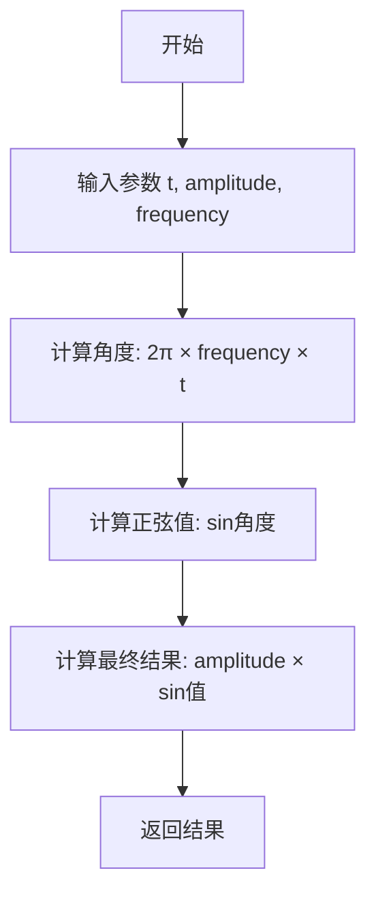
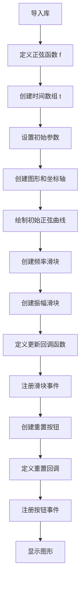
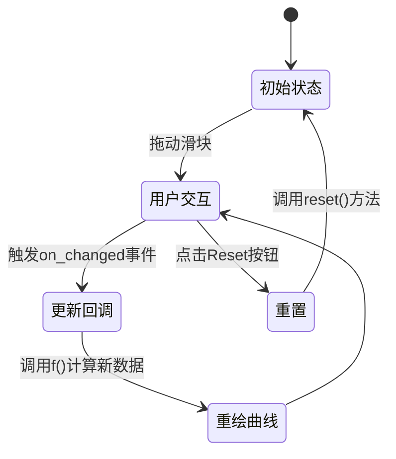
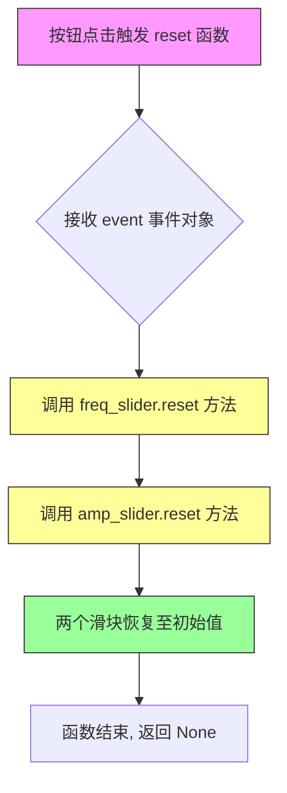

# `matplotlib\galleries\examples\widgets\slider_demo.py` 详细设计文档

这是一个使用matplotlib滑块控件的交互式数据可视化程序，通过频率和振幅滑块实时控制正弦波的参数，用户可以动态调整波形并通过重置按钮恢复初始设置。

## 整体流程

```mermaid
graph TD
    A[开始] --> B[导入库: matplotlib.pyplot, numpy, matplotlib.widgets]
    B --> C[定义正弦波函数 f(t, amplitude, frequency)]
    C --> D[创建时间数组 t = np.linspace(0, 1, 1000)]
    D --> E[设置初始参数: init_amplitude=5, init_frequency=3]
    E --> F[创建图形 fig 和坐标轴 ax]
    F --> G[绘制初始正弦波线条]
    G --> H[创建频率滑块 freq_slider]
    H --> I[创建振幅滑块 amp_slider]
    I --> J[定义更新函数 update(val)]
    J --> K[为滑块注册回调函数]
    K --> L[创建重置按钮 Button]
    L --> M[定义重置函数 reset(event)]
    M --> N[为按钮注册回调函数]
    N --> O[调用 plt.show() 显示图形]
    O --> P{用户交互}
    P -->|滑块值改变| Q[调用 update(val) 更新线条]
    Q --> P
    P -->|点击重置| R[调用 reset(event) 重置滑块]
    R --> P
```

## 类结构

```
该代码为脚本式程序，无自定义类层次结构
主要使用 matplotlib.widgets 中的组件类:
├── Slider (滑块控件)
└── Button (按钮控件)
```

## 全局变量及字段


### `t`
    
时间序列数组，范围0到1，共1000个点

类型：`numpy.ndarray`
    


### `init_amplitude`
    
正弦波的初始振幅值5

类型：`float`
    


### `init_frequency`
    
正弦波的初始频率值3

类型：`float`
    


### `fig`
    
matplotlib图形对象

类型：`matplotlib.figure.Figure`
    


### `ax`
    
matplotlib坐标轴对象

类型：`matplotlib.axes.Axes`
    


### `line`
    
绘制的正弦波线条对象

类型：`matplotlib.lines.Line2D`
    


### `axfreq`
    
频率滑块的坐标轴

类型：`matplotlib.axes.Axes`
    


### `freq_slider`
    
频率控制滑块

类型：`matplotlib.widgets.Slider`
    


### `axamp`
    
振幅滑块的坐标轴

类型：`matplotlib.axes.Axes`
    


### `amp_slider`
    
振幅控制滑块

类型：`matplotlib.widgets.Slider`
    


### `resetax`
    
重置按钮的坐标轴

类型：`matplotlib.axes.Axes`
    


### `button`
    
重置按钮对象

类型：`matplotlib.widgets.Button`
    


    

## 全局函数及方法


### `f(t, amplitude, frequency)`

该函数是一个正弦波参数化函数，接收时间、振幅和频率三个参数，计算并返回振幅乘以2π乘以频率乘以时间的正弦值，用于生成可调节的正弦波形数据。

参数：

- `t`：`float`，时间参数，表示正弦波的横坐标（单位：秒）
- `amplitude`：`float`，振幅参数，控制正弦波的峰值高度
- `frequency`：`float`，频率参数，控制正弦波的振荡频率（单位：Hz）

返回值：`float`，返回计算得到的正弦波瞬时值

#### 流程图



#### 带注释源码

```python
def f(t, amplitude, frequency):
    """
    正弦波参数化函数
    
    参数:
        t: 时间参数，表示正弦波的横坐标
        amplitude: 振幅，控制波的峰值高度
        frequency: 频率，控制波的振荡次数
    
    返回:
        振幅乘以2π乘以频率乘以时间的正弦值
    """
    return amplitude * np.sin(2 * np.pi * frequency * t)
```

---

## 完整设计文档

### 一、代码核心功能概述

该代码是一个交互式matplotlib正弦波演示程序，通过滑块（Slider）控件实时控制正弦波的振幅和频率，用户可以直观地观察波形随参数变化的效果，并可通过重置按钮恢复初始参数值。

### 二、文件整体运行流程



### 三、全局变量和全局函数详细信息

#### 1. 全局变量

| 名称 | 类型 | 描述 |
|------|------|------|
| `t` | `numpy.ndarray` | 时间数组，范围0到1秒，共1000个采样点 |
| `init_amplitude` | `float` | 初始振幅值，设为5 |
| `init_frequency` | `float` | 初始频率值，设为3 Hz |
| `fig` | `matplotlib.figure.Figure` | Matplotlib图形对象 |
| `ax` | `matplotlib.axes.Axes` | 主坐标轴对象 |
| `line` | `matplotlib.lines.Line2D` | 正弦曲线线条对象 |
| `freq_slider` | `matplotlib.widgets.Slider` | 频率滑块控件 |
| `amp_slider` | `matplotlib.widgets.Slider` | 振幅滑块控件 |
| `button` | `matplotlib.widgets.Button` | 重置按钮控件 |

#### 2. 全局函数

| 函数名 | 参数 | 返回值 | 描述 |
|--------|------|--------|------|
| `f(t, amplitude, frequency)` | t: float, amplitude: float, frequency: float | float | 正弦波参数化计算函数 |

### 四、关键组件信息

| 组件名称 | 一句话描述 |
|----------|------------|
| `matplotlib.widgets.Slider` | 用于交互式调整数值的滑块控件 |
| `matplotlib.widgets.Button` | 用于触发重置操作的按钮控件 |
| `matplotlib.pyplot` | Python可视化库的核心模块 |
| `numpy` | Python数值计算库 |

### 五、潜在技术债务或优化空间

1. **硬编码值问题**：时间范围、采样点数、初始参数等均为硬编码，可考虑提取为配置文件或命令行参数
2. **魔法数字**：数值如0.25、0.1、0.65等布局参数缺乏明确语义，建议使用命名常量
3. **缺乏类型注解**：函数和变量缺少类型注解，不利于代码维护和IDE支持
4. **更新效率**：每次滑块变化都调用`fig.canvas.draw_idle()`，对于大数据量可考虑节流处理
5. **缺少错误处理**：未对输入参数进行有效性验证（如频率为负数等情况）

### 六、其它项目

#### 设计目标与约束

- **目标**：提供一个交互式的正弦波参数可视化工具
- **约束**：依赖matplotlibwidgets模块，需在支持图形界面的环境中运行

#### 错误处理与异常设计

- 当前代码未包含显式的错误处理逻辑
- 建议添加：频率和振幅的边界值验证

#### 数据流与状态机



#### 外部依赖与接口契约

- `numpy`：用于数值计算和数组生成
- `matplotlib`：用于图形绘制和交互控件
- 无需API密钥或网络连接


### `update(val)`

该函数是滑块值改变时的回调函数，当用户拖动频率或振幅滑块时触发，获取两个滑块的当前值，重新计算正弦波数据并更新图表线条，随后触发画布重绘以显示新数据。

参数：

-  `val`：`float`，滑块的新值（由滑块组件自动传入，当前未使用，函数直接读取两个滑块的实时值）

返回值：`None`，无返回值，仅执行副作用（更新线条数据和重绘画布）

#### 流程图

```mermaid
flowchart TD
    A[滑块值改变触发回调] --> B[获取振幅滑块值 amp_slider.val]
    B --> C[获取频率滑块值 freq_slider.val]
    C --> D[调用f函数计算新数据<br/>f(t, amp_slider.val, freq_slider.val)]
    D --> E[更新线条的Y轴数据<br/>line.set_ydata]
    E --> F[触发画布重绘<br/>fig.canvas.draw_idle]
    F --> G[结束]
```

#### 带注释源码

```python
def update(val):
    """
    滑块值改变时的回调函数，更新线条数据并重绘画布。
    
    参数:
        val: float, 滑块的新值（由Slider.on_changed自动传入）
    """
    # 使用f函数结合当前振幅和频率滑块的值计算新的正弦波数据
    # t: 时间数组（1000个点）
    # amp_slider.val: 振幅滑块的当前值（0-10）
    # freq_slider.val: 频率滑块的当前值（0.1-30）
    line.set_ydata(f(t, amp_slider.val, freq_slider.val))
    
    # 标记线条数据已更新，触发下一次事件循环时重绘
    # draw_idle比draw更高效，避免频繁重绘
    fig.canvas.draw_idle()
```


### reset

按钮点击时的回调函数，重置两个滑块到初始值。

参数：

- `event`：`matplotlib.backend_bases.Event`，鼠标点击按钮时触发的事件对象，包含事件相关的信息（如鼠标位置、按键状态等）

返回值：`None`，该函数不返回任何值，仅通过调用 Slider 对象的 reset() 方法来重置滑块状态

#### 流程图



#### 带注释源码

```python
def reset(event):
    """
    按钮点击时的回调函数，用于重置两个滑块到初始值。
    
    该函数作为 matplotlib.widgets.Button 的点击回调被注册，
    当用户点击 'Reset' 按钮时自动调用。
    
    参数:
        event: 鼠标点击事件对象，包含触发事件的相关信息
               (如鼠标位置、按键状态等)，由 matplotlib 自动生成并传入
    
    返回值:
        None: 该函数不返回任何值，纯粹作为副作用函数使用
              通过调用 Slider 对象的 reset() 方法实现重置功能
    """
    # 重置频率滑块 (freq_slider) 到初始值
    # Slider.reset() 方法会将滑块的值重置为 valinit 参数指定的初始值
    freq_slider.reset()
    
    # 重置振幅滑块 (amp_slider) 到初始值
    # 两个滑块的 reset() 调用没有先后顺序要求，
    # 因为它们之间没有依赖关系
    amp_slider.reset()
```

## 关键组件


### Slider (频率滑块)

用于控制正弦波频率的滑块小部件，标签为"Frequency [Hz]"，取值范围为0.1到30，初始值为3。

### Slider (振幅滑块)

用于控制正弦波振幅的滑块小部件，标签为"Amplitude"，取值范围为0到10，初始值为5，垂直方向排列。

### Button (重置按钮)

用于将滑块重置为初始值的按钮，标签为"Reset"，点击后调用reset函数。

### f函数

核心数学函数，接受时间t、振幅amplitude和频率frequency作为参数，返回振幅乘以2π乘以频率乘以时间的正弦值。

### update函数

滑块值变化时的回调函数，获取两个滑块的当前值，调用f函数更新线条的y轴数据，并触发图形重绘。

### reset函数

按钮点击时的回调函数，调用freq_slider.reset()和amp_slider.reset()将滑块重置为初始值。

### fig和ax对象

Matplotlib创建的图形对象和坐标轴对象，用于承载正弦波曲线和滑块小部件。

### line对象

通过ax.plot()创建的线条对象，用于显示正弦波曲线，可以通过set_ydata方法动态更新y轴数据。

### t数组

numpy生成的线性间隔数组，范围从0到1，包含1000个点，作为正弦波的时间轴。


## 问题及建议


### 已知问题

-   **全局作用域污染**：所有代码都在模块顶层定义，缺乏适当的封装，变量（t、init_amplitude、init_frequency、update函数等）暴露在全局命名空间中，容易产生命名冲突
-   **硬编码的布局参数**：滑块位置和尺寸（0.25, 0.1, 0.65, 0.03, 0.0225, 0.63等）使用魔法数字，缺乏常量定义，可维护性差
-   **缺乏输入验证**：update函数直接使用滑块值，没有对val进行类型或范围检查
-   **无类型注解**：代码中没有任何类型提示，影响代码可读性和IDE支持
-   **重复代码模式**：如果需要添加更多滑块，代码会重复创建类似的逻辑，缺乏可扩展的滑块管理机制
-   **缺少错误处理**：没有try-except保护GUI操作，网络/资源加载失败时可能导致程序崩溃
-   **缺乏文档字符串**：核心函数（update、reset）没有docstring，后续维护困难
-   **紧耦合设计**：update函数直接引用全局的amp_slider和freq_slider对象，难以单独测试

### 优化建议

-   **封装为类**：将相关功能封装到SliderApp类中，使用实例变量管理状态，提高代码组织性和可测试性
-   **使用配置常量**：将布局参数定义为具名常量或配置字典，提高可维护性
-   **添加类型注解**：为函数参数和返回值添加类型提示，提升代码可读性
-   **增强错误处理**：为文件操作、GUI回调添加try-except异常处理
-   **添加文档字符串**：为关键函数（update、reset）添加docstring说明参数和返回值含义
-   **解耦设计**：将update函数设计为可接受参数的形式，便于单元测试
-   **考虑状态管理**：如果需要更复杂的功能，可引入观察者模式或状态机管理滑块状态
-   **添加单元测试**：将核心逻辑抽取为纯函数，便于编写测试用例


## 其它


### 设计目标与约束

本示例的设计目标是创建一个交互式的正弦波可视化工具，允许用户通过滑块实时调整波的振幅和频率，并通过重置按钮恢复初始参数值。设计约束包括：必须使用matplotlibWidgets模块提供的交互组件；滑块数值范围限制为频率0.1-30Hz、振幅0-10；图形界面布局需预留足够空间放置控件；必须保持与matplotlib后端的兼容性。

### 错误处理与异常设计

代码采用了防御性编程设计，主要体现在以下几个方面：Slider组件内置了valmin和valmax参数自动限制输入范围，防止用户输入超出物理意义的数值；update回调函数中未进行显式的异常捕获，假设f函数的计算始终合法；plt.show()会阻塞主线程直到窗口关闭，这是matplotlib的标准行为。潜在的改进空间包括：在update函数中添加try-except处理数值计算异常；为Button的回调添加超时保护机制；处理窗口关闭时的资源释放逻辑。

### 数据流与状态机

系统的核心状态包含三个部分：当前振幅值（amp_slider.val）、当前频率值（freq_slider.val）以及图形对象（line和fig）。数据流动遵循以下路径：用户拖动滑块 → Slider发出value-changed信号 → 调用update函数 → 读取两个滑块当前值 → 调用f函数计算新数据点 → 更新line对象的ydata属性 → 调用fig.canvas.draw_idle()触发重绘。状态转换由matplotlib的事件循环驱动，每次滑块值变化都会触发完整的数据流循环。重置功能通过调用Slider.reset()方法将状态恢复为init_amplitude和init_frequency的初始值。

### 外部依赖与接口契约

本代码直接依赖两个外部库：numpy提供linspace数组生成和sin数学函数计算；matplotlib提供图形渲染和Widgets组件。关键接口契约包括：Slider构造函数接收ax、label、valmin、valmax、valinit、orientation参数；Slider.on_changed(callback)方法注册回调函数，回调接收单一参数val代表当前滑块值；Button.on_clicked(callback)方法注册点击回调，回调接收event参数；update函数签名必须符合on_changed的回调约定，接收滑块当前值作为唯一参数。

### 性能考虑与优化空间

当前实现使用draw_idle()进行延迟绘制，这是matplotlib推荐的优化方式。f函数在每次update时重新计算全部1000个数据点，对于简单正弦波足够高效，但若扩展为更复杂的函数或增加数据点数量，可考虑使用functools.lru_cache缓存计算结果或采用向量化操作。滑块的连续拖动可能产生大量回调调用，可通过添加节流（throttle）机制限制更新频率。重置功能调用reset()方法会触发两次value-changed事件（分别来自两个滑块），可通过临时禁用回调来优化。

### 可扩展性设计

代码结构具有良好的可扩展性：f函数采用参数化设计，可轻松替换为其他数学函数；图形可以从单线扩展为多线显示；可以添加更多Slider控制相位、阻尼等参数；可以集成其他Widget如RadioButtons、CheckButtons实现更复杂的交互。Slider的orientation参数支持horizontal和vertical两种方向，提供了布局灵活性。


    