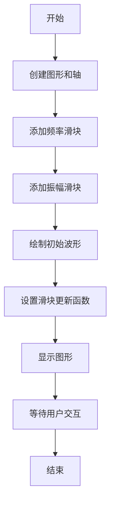
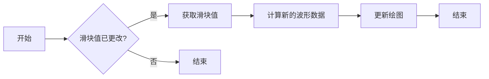
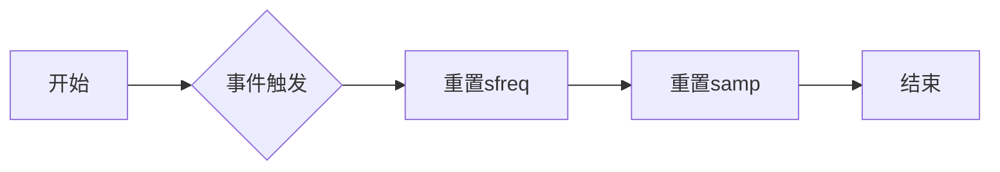
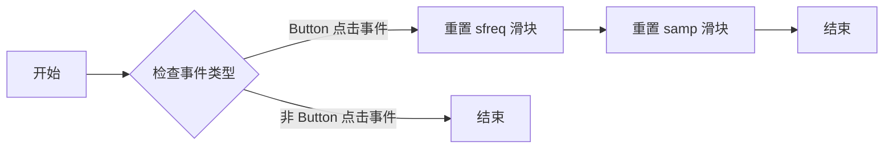
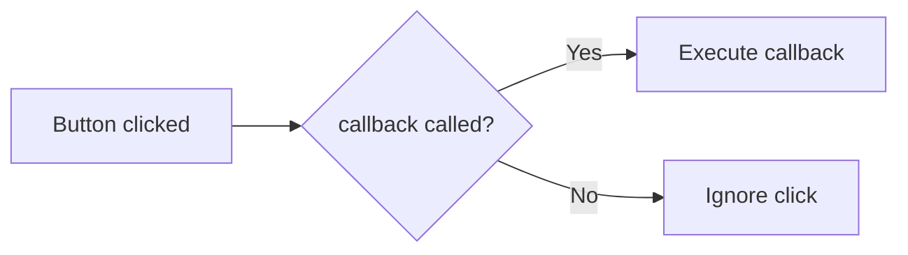
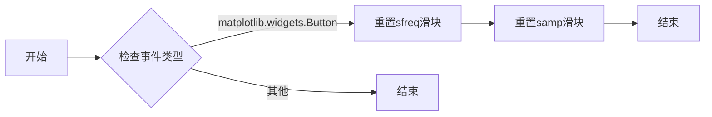

# `matplotlib\galleries\examples\widgets\slider_snap_demo.py` 详细设计文档

This code provides an interactive demonstration of using sliders to control the amplitude and frequency of a sine wave, with the ability to snap the slider values to discrete values.

## 整体流程



## 类结构

```
matplotlib.pyplot (matplotlib模块)
├── Button (matplotlib.widgets模块)
│   ├── reset(event)
│   └── on_clicked(callback)
├── Slider (matplotlib.widgets模块)
│   ├── __init__(ax, label, valmin, valmax, valinit, valstep, color, ...)
│   ├── on_changed(callback)
│   └── reset()
└── numpy (numpy模块)
    └── linspace(start, stop, num, endpoint, dtype=None, like=None)
```

## 全局变量及字段


### `t`
    
Time array for the sine wave.

类型：`numpy.ndarray`
    


### `a0`
    
Amplitude of the sine wave.

类型：`float`
    


### `f0`
    
Frequency of the sine wave.

类型：`float`
    


### `s`
    
Sine wave data.

类型：`numpy.ndarray`
    


### `fig`
    
The main figure object.

类型：`matplotlib.figure.Figure`
    


### `ax`
    
The main axes object for plotting.

类型：`matplotlib.axes.Axes`
    


### `l`
    
The line object representing the sine wave.

类型：`matplotlib.lines.Line2D`
    


### `ax_freq`
    
Axes for the frequency slider.

类型：`matplotlib.axes.Axes`
    


### `ax_amp`
    
Axes for the amplitude slider.

类型：`matplotlib.axes.Axes`
    


### `allowed_amplitudes`
    
Array of allowed amplitudes for the slider.

类型：`numpy.ndarray`
    


### `samp`
    
Amplitude slider object.

类型：`matplotlib.widgets.Slider`
    


### `sfreq`
    
Frequency slider object.

类型：`matplotlib.widgets.Slider`
    


### `ax_reset`
    
Axes for the reset button.

类型：`matplotlib.axes.Axes`
    


### `button`
    
Reset button object.

类型：`matplotlib.widgets.Button`
    


### `Button.ax`
    
Axes on which the button is drawn.

类型：`matplotlib.axes.Axes`
    


### `Button.label`
    
Label of the button.

类型：`str`
    


### `Button.valmin`
    
Minimum value of the button's action range.

类型：`float`
    


### `Button.valmax`
    
Maximum value of the button's action range.

类型：`float`
    


### `Button.valinit`
    
Initial value of the button's action range.

类型：`float`
    


### `Button.valstep`
    
Step size of the button's action range.

类型：`float`
    


### `Button.color`
    
Color of the button.

类型：`str`
    


### `Button.hovercolor`
    
Color of the button when hovered.

类型：`str`
    


### `Slider.ax`
    
Axes on which the slider is drawn.

类型：`matplotlib.axes.Axes`
    


### `Slider.label`
    
Label of the slider.

类型：`str`
    


### `Slider.valmin`
    
Minimum value of the slider's range.

类型：`float`
    


### `Slider.valmax`
    
Maximum value of the slider's range.

类型：`float`
    


### `Slider.valinit`
    
Initial value of the slider.

类型：`float`
    


### `Slider.valstep`
    
Step size of the slider.

类型：`float`
    


### `Slider.color`
    
Color of the slider.

类型：`str`
    


### `Slider.initcolor`
    
Initial color of the slider's line marking the value.

类型：`str`
    
    

## 全局函数及方法


### update(val)

更新绘图，根据滑块的值重新计算并绘制波形。

参数：

- `val`：`None`，表示滑块的值已更改，需要重新计算并更新绘图。

返回值：`None`，没有返回值。

#### 流程图



#### 带注释源码

```python
def update(val):
    # 获取滑块的值
    amp = samp.val
    freq = sfreq.val
    
    # 计算新的波形数据
    l.set_ydata(amp * np.sin(2 * np.pi * freq * t))
    
    # 更新绘图
    fig.canvas.draw_idle()
``` 


### reset(event)

重置滑块到初始值。

参数：

- `event`：`matplotlib.widgets.Button`，点击按钮时触发的事件。

返回值：无

#### 流程图



#### 带注释源码

```python
def reset(event):
    sfreq.reset()
    samp.reset()
```


### reset(event)

重置滑块到初始值。

参数：

- `event`：`matplotlib.widgets.Button`，点击按钮时触发的事件。

返回值：无

#### 流程图



#### 带注释源码

```python
def reset(event):
    # 重置 sfreq 滑块
    sfreq.reset()
    # 重置 samp 滑块
    samp.reset()
```


### Button.on_clicked(callback)

该函数将一个回调函数绑定到按钮的点击事件上。

参数：

- `callback`：`function`，一个函数，当按钮被点击时会被调用。

返回值：无

#### 流程图



#### 带注释源码

```python
def reset(event):
    sfreq.reset()
    samp.reset()
button.on_clicked(reset)
```

在这段代码中，`reset` 函数被作为回调函数传递给 `button.on_clicked(reset)`。当按钮被点击时，`reset` 函数会被调用，它将重置 `sfreq` 和 `samp` 的值。


### Slider.on_changed(callback)

该函数用于将一个回调函数绑定到滑块的值变化事件上。

参数：

- `callback`：`function`，一个函数，当滑块的值发生变化时会被调用。

返回值：无

#### 流程图

```mermaid
graph LR
A[Slider.on_changed(callback)] --> B{回调函数被调用}
B --> C[更新滑块值]
```

#### 带注释源码

```python
sfreq.on_changed(update)
samp.on_changed(update)

def update(val):
    amp = samp.val
    freq = sfreq.val
    l.set_ydata(amp*np.sin(2*np.pi*freq*t))
    fig.canvas.draw_idle()
```

在这段代码中，`Slider.on_changed(update)` 将 `update` 函数绑定到 `sfreq` 和 `samp` 滑块的值变化事件上。当滑块的值发生变化时，`update` 函数会被调用，并更新图表的显示。


### reset()

重置滑块到初始值。

参数：

- `event`：`matplotlib.widgets.Button`，点击按钮时触发的事件。

返回值：无

#### 流程图



#### 带注释源码

```python
def reset(event):
    sfreq.reset()
    samp.reset()
```


## 关键组件


### 张量索引与惰性加载

张量索引与惰性加载允许在处理大型数据集时，只加载和处理需要的数据部分，从而提高效率。

### 反量化支持

反量化支持使得模型可以在量化后仍然保持其精度，这对于提高模型在资源受限设备上的性能至关重要。

### 量化策略

量化策略决定了如何将浮点数转换为固定点数，以减少模型的大小和加速计算，同时保持可接受的精度。

## 问题及建议


### 已知问题

-   **全局变量和函数的文档缺失**：代码中使用了全局变量 `t` 和全局函数 `plt.show()`，但没有在文档中说明其用途和作用。
-   **代码复用性低**：`update` 函数和 `reset` 函数在两个不同的上下文中执行相同的任务，可以考虑将它们封装到类中以提高代码复用性。
-   **错误处理**：代码中没有错误处理机制，如果用户输入非法值，可能会导致程序崩溃。

### 优化建议

-   **添加文档注释**：为全局变量和函数添加文档注释，说明其用途和作用。
-   **封装函数**：将 `update` 和 `reset` 函数封装到类中，以便在需要时重用。
-   **增加输入验证**：在 `update` 和 `reset` 函数中增加输入验证，确保用户输入的值是合法的。
-   **使用面向对象编程**：将滑块和按钮封装为类，以便更好地管理状态和行为。
-   **优化性能**：如果滑块更新频率很高，可以考虑使用缓存或延迟更新的技术来提高性能。


## 其它


### 设计目标与约束

- 设计目标：实现一个滑动条控件，允许用户将滑动条的值限制为离散值。
- 约束条件：滑动条的值必须符合预定义的离散值列表，且滑动条的初始值和步长也应符合这一约束。

### 错误处理与异常设计

- 错误处理：当用户尝试设置一个不在预定义离散值列表中的值时，应提供反馈，并阻止该值被设置。
- 异常设计：确保在滑动条更新或重置时，任何可能的异常都能被捕获并妥善处理，以避免程序崩溃。

### 数据流与状态机

- 数据流：用户通过滑动条调整值，这些值通过事件处理函数传递给更新函数，进而更新图表。
- 状态机：滑动条控件的状态由其当前值和步长决定，状态变化通过事件触发。

### 外部依赖与接口契约

- 外部依赖：依赖于matplotlib库中的Slider和Button控件。
- 接口契约：Slider和Button控件必须遵循matplotlib的API规范，确保代码的兼容性和可维护性。


    