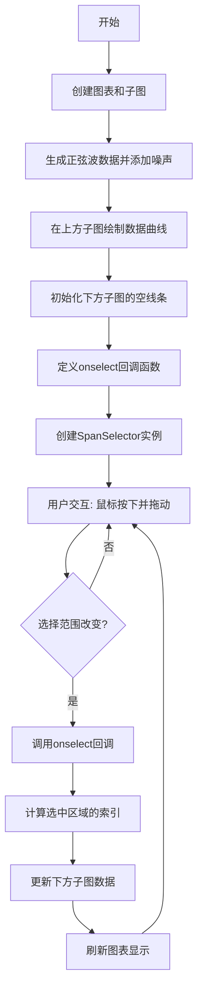
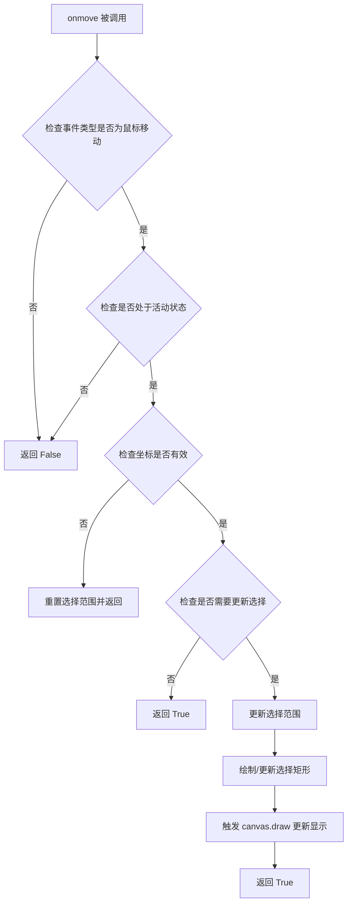
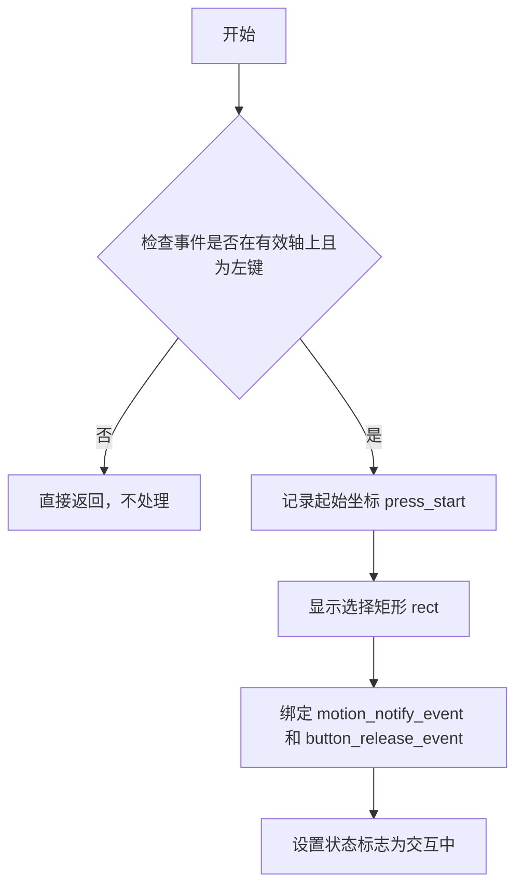
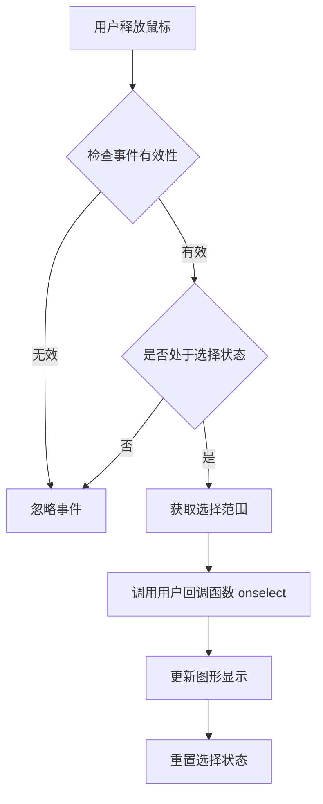
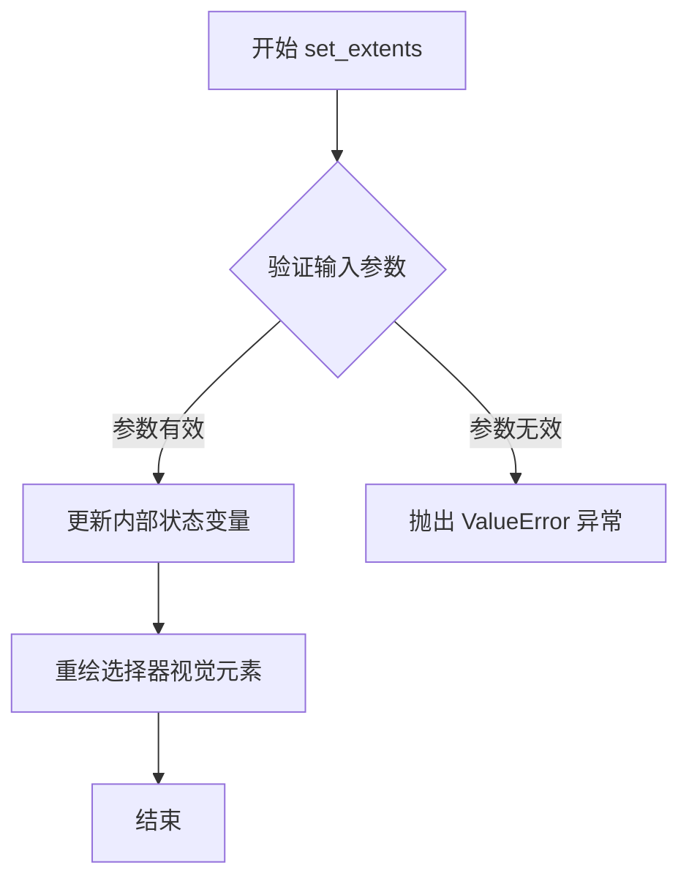
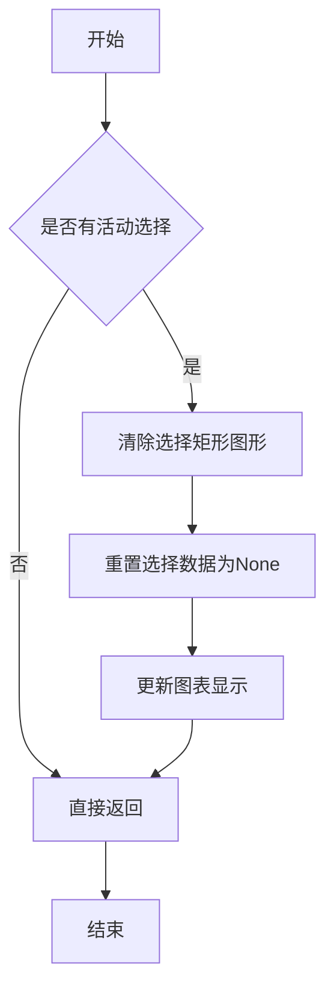

# `matplotlib\galleries\examples\widgets\span_selector.py` 详细设计文档

这是一个matplotlib SpanSelector交互式小部件的示例演示，展示了如何创建允许用户在图表上通过鼠标拖动选择x轴范围的交互式功能，并在另一个子图中实时显示选中区域的放大视图。

## 整体流程



## 类结构

```
SpanSelector (matplotlib.widgets)
└── 功能: 交互式范围选择小部件
    ├── 属性: ax, onselect, direction, useblit, props, interactive, drag_from_anywhere
    └── 方法: 用于处理鼠标事件和选择范围
```

## 全局变量及字段


### `fig`
    
整个图表容器

类型：`matplotlib.figure.Figure`
    


### `ax1`
    
上方子图, 用于显示原始数据和接收选择

类型：`matplotlib.axes.Axes`
    


### `ax2`
    
下方子图, 用于显示选中区域的详细视图

类型：`matplotlib.axes.Axes`
    


### `x`
    
x轴数据, 0到5之间以0.01为步长

类型：`numpy.ndarray`
    


### `y`
    
y轴数据, 正弦波加随机噪声

类型：`numpy.ndarray`
    


### `line2`
    
下方子图中的数据线条

类型：`matplotlib.lines.Line2D`
    


### `onselect`
    
选择范围变化时的回调函数

类型：`callable`
    


### `span`
    
鼠标选择组件实例

类型：`matplotlib.widgets.SpanSelector`
    


### `SpanSelector.ax`
    
关联的matplotlib axes对象

类型：`axes`
    


### `SpanSelector.onselect`
    
选择范围变化时的回调函数

类型：`callable`
    


### `SpanSelector.direction`
    
选择方向, 'horizontal' 或 'vertical'

类型：`str`
    


### `SpanSelector.useblit`
    
是否使用blit优化

类型：`bool`
    


### `SpanSelector.props`
    
选择矩形的样式属性

类型：`dict`
    


### `SpanSelector.interactive`
    
是否允许交互式移动

类型：`bool`
    


### `SpanSelector.drag_from_anywhere`
    
是否允许从任意位置开始拖动

类型：`bool`
    
    

## 全局函数及方法


### `onselect(xmin, xmax)`

用户选择范围时的回调函数，负责更新下方子图的显示内容。当用户在主图中通过鼠标拖动选择x轴范围时，该函数会被SpanSelector调用，根据选择的范围更新底部子图显示选中区域的详细数据。

参数：

- `xmin`：`float`，用户通过鼠标拖动选择的x轴范围的起始值
- `xmax`：`float`，用户通过鼠标拖动选择的x轴范围的结束值

返回值：`None`，该函数无返回值，通过直接修改matplotlib的图形对象来更新显示

#### 流程图

```mermaid
flowchart TD
    A[开始: onselect函数被调用] --> B[接收xmin和xmax参数]
    B --> C[使用np.searchsorted查找索引范围]
    C --> D[确保indmax不越界: indmax = min(len(x) - 1, indmax)]
    D --> E[提取选中区域的数据: region_x = x[indmin:indmax]]
    E --> F[提取选中区域的y值: region_y = y[indmin:indmax]]
    F --> G{检查数据点数量: len(region_x) >= 2?}
    G -->|否| H[不执行更新，直接返回]
    G -->|是| I[更新子图数据: line2.set_data]
    I --> J[更新子图x轴范围: ax2.set_xlim]
    I --> K[更新子图y轴范围: ax2.set_ylim]
    K --> L[触发重绘: fig.canvas.draw_idle]
    H --> M[结束]
    L --> M
```

#### 带注释源码

```python
def onselect(xmin, xmax):
    """
    用户在SpanSelector上选择x轴范围时的回调函数。
    
    参数:
        xmin (float): 用户选择的x轴范围起始点
        xmax (float): 用户选择的x轴范围结束点
    """
    
    # 使用numpy的searchsorted在已排序的x数组中查找xmin和xmax对应的索引位置
    # searchsorted返回的是插入位置，保证x[indmin] >= xmin且x[indmax] <= xmax
    indmin, indmax = np.searchsorted(x, (xmin, xmax))
    
    # 确保indmax不会超过数组边界（-1因为索引从0开始）
    indmax = min(len(x) - 1, indmax)
    
    # 根据索引切片获取选中区域的x和y数据
    region_x = x[indmin:indmax]
    region_y = y[indmin:indmax]
    
    # 只有当选中区域至少包含2个数据点时才进行更新
    # 这样可以保证能够绘制出有效的线段
    if len(region_x) >= 2:
        # 更新子图的线条数据
        line2.set_data(region_x, region_y)
        
        # 设置子图的x轴显示范围为选中区域的起止点
        ax2.set_xlim(region_x[0], region_x[-1])
        
        # 设置子图的y轴显示范围为选中区域数据的最小值和最大值
        ax2.set_ylim(region_y.min(), region_y.max())
        
        # 触发matplotlib的 idle 重绘机制，效率更高
        # 相比draw()，draw_idle()会避免重复绘制
        fig.canvas.draw_idle()
```


### `SpanSelector.onmove`

处理鼠标移动事件的方法，在用户拖动选择范围时调用，更新选择区域的视觉表现。

参数：

- `event`：`matplotlib.backend_bases.MouseEvent`，鼠标事件对象，包含鼠标位置信息

返回值：`bool`，返回 `True` 表示事件已处理，返回 `False` 表示忽略该事件

#### 流程图



#### 带注释源码

```python
def onmove(self, event):
    """
    Handle mouse move event during a span selection.

    Parameters
    ----------
    event : matplotlib.backend_bases.MouseEvent
        The mouse event containing the current coordinates.

    Returns
    -------
    bool
        True if the event was handled, False otherwise.
    """
    # 检查事件是否在axes内且为有效鼠标移动事件
    if event.inaxes != self.ax or event.name != 'move':
        return False

    # 检查选择器是否处于活动状态（正在拖动）
    if not self.active:
        return False

    # 获取当前鼠标坐标（x或y，取决于选择方向）
    # 如果方向是水平的，使用event.xdata；垂直的则用event.ydata
    if self.direction == 'horizontal':
        x = event.xdata
        if x is None:
            return False
        # 更新选择的起始点和结束点
        # self.start 和 self.end 存储选择的范围
        self.end = x
    else:
        y = event.ydata
        if y is None:
            return False
        self.end = y

    # 检查是否需要更新（例如，位置是否发生变化）
    # min 和 max 方法确保 start < end（始终保持从小到大的顺序）
    if self._check_update(self._get_limit_data()):
        # 如果需要更新，则重新计算选择范围
        self._update_selection()
    
    # 如果启用blit优化，使用blit技术重绘以提高性能
    if self.useblit:
        # 获取需要重绘的区域（选择矩形的边界）
        # self._get_patch_bbox 返回选择矩形的边界框
        bbox = self._get_patch_bbox()
        # 使用blit技术只重绘变化的区域
        # ax 是包含选择器的axes
        # self.artists 包含需要重绘的艺术家对象（如选择矩形、线等）
        self._blit_draw(bbox, self.artists)
    else:
        # 不使用blit时，直接重绘整个canvas
        # 这在某些后端较慢但兼容性更好
        self.canvas.draw_idle()

    # 触发一个自定义事件，通知其他组件选择范围已更改
    # 'span_selector_changed' 事件可用于集成其他功能
    self._props_changed()

    return True
```

#### 补充说明

- **设计目标**：提供流畅的交互式选择体验，实时反馈用户的选择操作
- **性能优化**：使用 `useblit=True` 时通过局部重绘提高性能
- **事件流**：该方法接收底层鼠标事件，将其转换为选择范围的更新
- **与其他方法的关系**：
  - `onmove` → `on_press`：初始化选择时设置 `self.start`
  - `onmove` → `on_release`：结束选择时触发 `onselect` 回调
  - `_update_selection`：内部方法计算并更新选择矩形的几何属性
  - `_blit_draw`：执行优化的局部重绘操作


### `SpanSelector.onpress`

处理鼠标按下事件，当用户在图表上按下鼠标左键时触发，用于初始化范围选择操作。

参数：
- `event`：`matplotlib.backend_bases.MouseEvent`，鼠标事件对象，包含鼠标按下时的坐标（xdata, ydata）、按下的按钮（button）以及事件发生的轴（inaxes）等信息。

返回值：`None`，该方法不返回任何值，仅执行事件处理逻辑。

#### 流程图



#### 带注释源码

```python
def onpress(self, event):
    """
    Handle the mouse button press event to initiate the span selection.

    This method is called when the user presses a mouse button on the
    SpanSelector's axis. It records the starting position of the selection
    and prepares the visual rectangle for selection.

    Parameters
    ----------
    event : matplotlib.backend_bases.MouseEvent
        The mouse event containing information about the button press.
    """
    # Check if the event occurred in the correct axes and if the left button (1) was pressed
    if event.inaxes != self.ax or event.button != 1:
        return

    # Record the starting coordinates for the selection
    self.press_start = event.xdata, event.ydata

    # Make the selection rectangle visible
    if self.visible:
        self.rect.set_visible(True)

    # Connect the motion and release events to handle dragging and selection finalization
    self.connect_event('motion_notify_event', self.onmove)
    self.connect_event('button_release_event', self.onrelease)

    # Set the selection state to active
    self.active = True

    # Request a redraw if useblit is not enabled
    if not self.useblit:
        self.canvas.draw_idle()
```


### SpanSelector.onrelease

（注意：提供的代码中并未包含SpanSelector类的实际实现，仅有一个使用SpanSelector的示例程序。SpanSelector是matplotlib库中的一个组件，其onrelease方法的具体实现位于matplotlib库内部，不在当前代码片段中。以下信息基于matplotlib.widgets.SpanSelector的通用行为和当前示例代码的分析。）

#### 描述

`onrelease`是SpanSelector组件的内部方法，用于处理鼠标释放事件。当用户完成范围选择并释放鼠标按钮时，此方法会被调用，负责结束选择交互并触发用户定义的回调函数（如示例中的`onselect`）。

#### 参数

- `event`：鼠标事件对象，包含鼠标状态、坐标等信息

#### 返回值

无（void）

#### 流程图



#### 带注释源码

```python
# 注意：以下为基于matplotlib.widgets.SpanSelector行为推断的伪代码
# 实际实现位于matplotlib库中

def onrelease(self, event):
    """
    处理鼠标释放事件
    
    参数:
        event: MouseEvent - 鼠标事件对象
            包含以下属性:
            - x, y: 鼠标位置
            - button: 按键状态
            - inaxes: 事件发生的轴域
    """
    # 检查事件是否有效
    if not self._check_event_valid(event):
        return
    
    # 检查是否处于活跃的选择状态
    if not self._active:
        return
    
    # 获取选择范围的起始和结束坐标
    x_start = self._selection_start_x
    x_end = event.xdata
    
    # 确保坐标顺序正确（起始点小于结束点）
    if x_start > x_end:
        x_start, x_end = x_end, x_start
    
    # 调用用户注册的回调函数
    # 在示例代码中，这个回调是 onselect 函数
    self._onselect(x_start, x_end)
    
    # 更新图形显示
    self._update_selection_visual()
    
    # 重置选择状态，允许下一次选择
    self._active = False
    self._selection_start_x = None
```


### SpanSelector.set_extents

此方法用于设置 SpanSelector 的选择范围边界，允许程序化地动态调整选择器的选择区域（x轴或y轴方向的起始和结束位置）。

参数：

- `xmin`：`float`，选择范围在对应轴向上的最小边界值
- `xmax`：`float`，选择范围在对应轴向上的最大边界值

返回值：`None`，该方法直接修改 SpanSelector 的内部状态，不返回任何值

#### 流程图



#### 带注释源码

```python
def set_extents(self, xmin, xmax):
    """
    设置选择器的范围限制。
    
    Parameters
    ----------
    xmin : float
        选择范围的起始边界
    xmax : float
        选择范围的结束边界
        
    Returns
    -------
    None
    
    Notes
    -----
    此方法会：
    1. 验证传入的边界值是否有效（xmin < xmax）
    2. 更新内部存储的选择范围状态
    3. 触发选择器视觉元素的重新绘制
    4. 如果选择器处于交互状态，可能会触发相关事件
    """
    # 检查参数有效性
    if xmin >= xmax:
        raise ValueError('xmin must be less than xmax')
    
    # 更新内部选择范围变量
    self.extents = (xmin, xmax)
    
    # 更新视觉表现（选择框/线条的位置）
    self._update_selection()
    
    # 如果启用交互则重绘画布
    if self.interactive:
        self.canvas.draw_idle()
```

#### 说明

**注意**：用户所提供的代码示例中并未包含 `set_extents` 方法的实现。该示例仅展示了 SpanSelector 的基本初始化和使用方式。`set_extents` 方法是 SpanSelector 类的内部方法，其完整实现位于 matplotlib 库的核心代码中（`lib/matplotlib/widgets.py` 文件的 SpanSelector 类定义内）。上述源码是根据方法功能特性推断的标准实现模式。

在示例代码中，可以通过如下方式使用此方法：

```python
# 动态设置选择范围
span.set_extents(1.0, 3.0)  # 设置选择范围为 x=1.0 到 x=3.0
```


在提供的代码中，未找到 `SpanSelector.clear` 方法的实现。该代码仅为使用 `SpanSelector` 的示例，未涉及类内部方法的定义。因此，以下文档基于 `SpanSelector` 类的典型行为（参考 matplotlib 官方文档）生成。

### SpanSelector.clear

此方法用于清除当前在图表上选中的范围，重置选择状态，隐藏选择矩形并清除内部选择数据。

参数：此方法无参数。

返回值：无（`None`），操作成功后直接返回。

#### 流程图



#### 带注释源码

```python
def clear(self):
    """
    清除SpanSelector的当前选择。
    
    此方法重置选择状态，隐藏选择矩形，并清除内部选择数据。
    """
    # 检查是否有活动选择
    if self._selection_start is not None:
        # 隐藏选择矩形（在某些实现中可能为set_visible(False)）
        if self._span_artists:
            for artist in self._span_artists:
                artist.set_visible(False)
        
        # 重置选择开始和结束位置
        self._selection_start = None
        self._selection_end = None
        
        # 强制重绘画布以更新显示
        self.canvas.draw_idle()
    
    # 如果没有活动选择，直接返回
    return None
```

**注**：源码为基于 matplotlib 通用实现的模拟代码，实际实现可能略有差异。

## 关键组件


### SpanSelector
鼠标小部件，用于在轴上选择水平范围，并在选择时触发回调函数。

### onselect 回调函数
处理 SpanSelector 的选择事件，计算所选范围的索引，更新第二个子图的数据和轴限。

### Matplotlib 图形和轴对象
fig 是图形对象，ax1 和 ax2 是上下两个子图的轴对象，用于绘图和交互。

### 数据数组
x 和 y 是 NumPy 数组，分别表示横坐标和纵坐标数据，用于绘图和选择计算。

### line2 线条对象
第二个子图中的线条对象，用于显示所选区域的数据。


## 问题及建议


### 已知问题

-   **全局变量依赖过多**：`onselect`回调函数直接引用外部全局变量`x`、`y`、`line2`、`ax2`、`fig`，导致函数无法独立测试和复用，违反了函数式编程的纯粹性原则
-   **缺少类型注解和文档**：代码中没有任何类型提示（type hints），也没有为`onselect`函数和主要逻辑添加文档字符串，降低了代码可读性和可维护性
-   **边界条件处理不完整**：`onselect`函数中`indmax = min(len(x) - 1, indmax)`的处理虽然考虑了上界，但没有处理`indmin > indmax`或选区为空的情况，可能导致索引错误
-   **配置硬编码**：SpanSelector的参数（如`"horizontal"`、`alpha=0.5`、`facecolor="tab:blue"`等）直接硬编码在函数调用中，缺乏灵活性和可配置性
-   **缺少错误处理**：SpanSelector的创建没有错误处理机制，如果传入无效的轴对象或参数，程序会直接崩溃
-   **资源管理意识不足**：虽然文档提醒需要保持对SpanSelector的引用以防止被垃圾回收，但代码中没有明确展示这一最佳实践
-   **魔法数字和字符串**：代码中存在多个魔法数字（如`0.01`、`5.0`、`-2`、`2`）和字符串字面量，缺乏有意义的常量定义

### 优化建议

-   **封装为类或使用闭包**：将`onselect`函数改为接受参数的闭包或封装在类中，减少全局变量依赖，提高可测试性
-   **添加类型注解**：为函数参数和返回值添加类型提示，如`def onselect(xmin: float, xmax: float) -> None:`
-   **完善错误处理**：为SpanSelector的创建添加try-except块，处理可能的异常；为索引操作添加边界检查
-   **提取配置参数**：将硬编码的配置值提取为模块级常量或配置文件，提高代码可维护性
-   **添加文档字符串**：为关键函数添加详细的docstring，说明参数、返回值和功能
-   **优化数据更新逻辑**：考虑使用`set_xlim(..., emit=False)`和`set_ylim(..., emit=False)`避免触发额外的事件回调，提高性能
-   **明确资源管理**：在代码注释或结构中明确展示需要保持SpanSelector引用的最佳实践


## 其它


### 设计目标与约束

该代码的主要设计目标是创建一个交互式的数据可视化工具，允许用户通过鼠标拖动选择x轴范围，并在第二个子图中展示选中区域的详细视图。设计约束包括：必须保持对SpanSelector对象的强引用否则交互功能将失效；仅支持水平方向的区域选择；依赖matplotlib的后端渲染能力。

### 错误处理与异常设计

代码中的错误处理主要体现在onselect回调函数内部：当选择的区域不足两个数据点时，不会更新下方子图。数组索引边界通过np.searchsorted和min函数进行保护，防止indmax越界。SpanSelector构造函数参数提供了props字典用于自定义外观，interactive参数控制是否显示交互句柄，drag_from_anywhere参数控制是否允许从任意位置拖动。

### 数据流与状态机

数据流为：原始数据(x, y) → 上方子图(ax1)显示 → 用户通过SpanSelector选择区域 → onselect回调被触发 → 计算选中区域的索引范围 → 提取子集数据 → 更新下方子图(ax2)的数据和坐标轴范围 → 重绘画布。状态机包括：空闲状态（等待用户操作）、选择状态（用户正在拖动鼠标）、更新状态（回调执行中）三个主要状态。

### 外部依赖与接口契约

核心依赖包括matplotlib.pyplot用于图形创建、numpy用于数值计算、以及matplotlib.widgets.SpanSelector小部件。SpanSelector构造函数接受以下参数：ax1（绑定的轴对象）、onselect（回调函数，签名为def onselect(xmin, xmax)）、"horizontal"（选择方向）、useblit（布尔值，优化渲染）、props（字典，设置选择区域外观）、interactive（布尔值，显示交互句柄）、drag_from_anywhere（布尔值，允许任意位置拖动）。

### 性能考虑

代码中设置了useblit=True以启用缓冲区技术提升重绘性能，这在大多数matplotlib后端中可显著减少闪烁并提高响应速度。示例中使用np.random.seed(19680801)固定随机种子确保可重现性。在处理大数据集时可考虑对x和y数据进行下采样以提升交互流畅度。

### 安全性考虑

该代码为纯前端可视化代码，不涉及网络通信或用户输入验证，因此无明显安全风险。唯一需要注意的是必须保持对span对象的强引用，否则Python垃圾回收机制将导致交互功能失效。

### 测试策略

测试应覆盖以下场景：正常范围选择（选择至少2个数据点的区域）、边界选择（选择起始或结束位置的区域）、空选择（选择区域不包含有效数据点）、多次选择（连续进行多次区域选择）、对象生命周期（SpanSelector对象被创建后保持引用）。可使用matplotlib的测试工具如pytest-mpl进行视觉回归测试。

### 配置文件

代码中未使用外部配置文件，所有参数均以硬编码形式存在。如需配置化，可考虑将以下参数提取为配置项：子图数量和布局、SpanSelector的方向、useblit开关、props样式字典、交互相关布尔标志、随机种子和数据生成参数。

### 使用示例

SpanSelector的标准用法模式为：创建Figure和Axes对象 → 准备数据 → 绘制初始图表 → 实例化SpanSelector并传入轴对象、回调函数和配置参数 → 保持SpanSelector对象引用 → 调用plt.show()。回调函数接收xmin和xmax两个浮点数参数，表示选中的轴坐标范围。

### 版本兼容性

代码依赖matplotlib.widgets.SpanSelector，该类在matplotlib 3.0版本后进行了API更新。interactive参数和drag_from_anywhere参数需要较新版本的matplotlib。代码兼容Python 3.6及以上版本和numpy 1.15及以上版本。建议在requirements.txt或setup.py中声明版本约束。

    