# `matplotlib\galleries\plot_types\3D\bar3d_simple.py` 详细设计文档

The code generates a 3D bar plot using matplotlib and numpy libraries.

## 整体流程

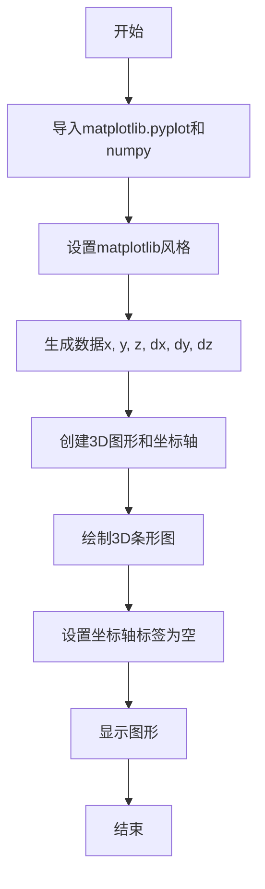

## 类结构

```
bar3d.py (主脚本)
```

## 全局变量及字段


### `plt`
    
matplotlib.pyplot module for plotting

类型：`module`
    


### `np`
    
numpy module for numerical operations

类型：`module`
    


### `x`
    
List of x coordinates for the bar3d plot

类型：`list`
    


### `y`
    
List of y coordinates for the bar3d plot

类型：`list`
    


### `z`
    
List of z coordinates for the bar3d plot

类型：`list`
    


### `dx`
    
Array of widths for the bars in the x direction

类型：`numpy.ndarray`
    


### `dy`
    
Array of widths for the bars in the y direction

类型：`numpy.ndarray`
    


### `dz`
    
List of heights for the bars in the z direction

类型：`list`
    


### `fig`
    
Figure object for the plot

类型：`matplotlib.figure.Figure`
    


### `ax`
    
3D subplot object for the plot

类型：`matplotlib.axes._subplots.Axes3DSubplot`
    


### `matplotlib.pyplot.style`
    
Style object for customizing matplotlib plots

类型：`matplotlib.style.core.Style`
    


### `matplotlib.pyplot.subplots`
    
Function to create a figure and a set of subplots

类型：`function`
    


### `matplotlib.pyplot.show`
    
Function to display the figure

类型：`function`
    


### `numpy.ones_like`
    
Function to create an array of ones with the same shape as the input array

类型：`function`
    
    

## 全局函数及方法


### bar3d(x, y, z, dx, dy, dz)

该函数用于在3D坐标系中绘制三维条形图。

参数：

- `x`：`list`，表示条形图在x轴上的位置。
- `y`：`list`，表示条形图在y轴上的位置。
- `z`：`list`，表示条形图在z轴上的高度。
- `dx`：`numpy.ndarray`，表示条形图在x轴上的宽度。
- `dy`：`numpy.ndarray`，表示条形图在y轴上的宽度。
- `dz`：`list`，表示条形图在z轴上的深度。

返回值：`None`，该函数不返回任何值。

#### 流程图

```mermaid
graph LR
A[Start] --> B{Call bar3d()}
B --> C[End]
```

#### 带注释源码

```python
"""
==========================
bar3d(x, y, z, dx, dy, dz)
==========================

See `~mpl_toolkits.mplot3d.axes3d.Axes3D.bar3d`.
"""
import matplotlib.pyplot as plt
import numpy as np

plt.style.use('_mpl-gallery')

# Make data
x = [1, 1, 2, 2]
y = [1, 2, 1, 2]
z = [0, 0, 0, 0]
dx = np.ones_like(x)*0.5
dy = np.ones_like(x)*0.5
dz = [2, 3, 1, 4]

# Plot
fig, ax = plt.subplots(subplot_kw={"projection": "3d"})
ax.bar3d(x, y, z, dx, dy, dz)

ax.set(xticklabels=[],
       yticklabels=[],
       zticklabels=[])

plt.show()
```


### bar3d()

该函数用于在3D坐标系中绘制三维条形图。

参数：

- `x`：`list`，x轴坐标列表。
- `y`：`list`，y轴坐标列表。
- `z`：`list`，z轴坐标列表。
- `dx`：`numpy.ndarray`，x轴方向上的条形宽度。
- `dy`：`numpy.ndarray`，y轴方向上的条形宽度。
- `dz`：`list`，z轴方向上的条形高度。

返回值：`None`，该函数不返回任何值。

#### 流程图

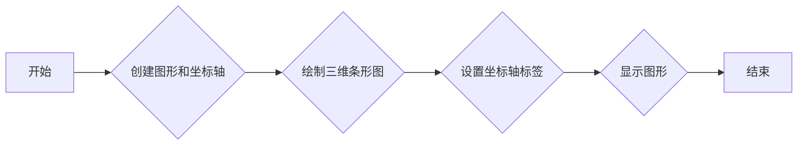

#### 带注释源码

```python
"""
==========================
bar3d(x, y, z, dx, dy, dz)
==========================

See `~mpl_toolkits.mplot3d.axes3d.Axes3D.bar3d`.
"""
import matplotlib.pyplot as plt
import numpy as np

plt.style.use('_mpl-gallery')

# Make data
x = [1, 1, 2, 2]
y = [1, 2, 1, 2]
z = [0, 0, 0, 0]
dx = np.ones_like(x)*0.5
dy = np.ones_like(x)*0.5
dz = [2, 3, 1, 4]

# Plot
fig, ax = plt.subplots(subplot_kw={"projection": "3d"})
ax.bar3d(x, y, z, dx, dy, dz)

ax.set(xticklabels=[],
       yticklabels=[],
       zticklabels=[])

plt.show()
```


### bar3d

该函数用于在3D坐标系中绘制三维条形图。

参数：

- `x`：`numpy.ndarray`，x轴坐标数组。
- `y`：`numpy.ndarray`，y轴坐标数组。
- `z`：`numpy.ndarray`，z轴坐标数组。
- `dx`：`numpy.ndarray`，x轴方向条形图的宽度。
- `dy`：`numpy.ndarray`，y轴方向条形图的高度。
- `dz`：`numpy.ndarray`，z轴方向条形图的深度。

返回值：无，该函数直接在matplotlib图形界面中绘制三维条形图。

#### 流程图

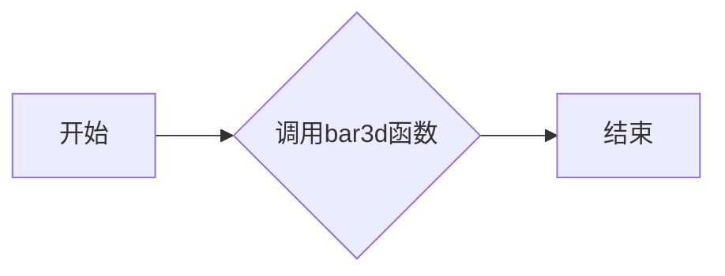

#### 带注释源码

```python
"""
==========================
bar3d(x, y, z, dx, dy, dz)
==========================

See `~mpl_toolkits.mplot3d.axes3d.Axes3D.bar3d`.
"""
import matplotlib.pyplot as plt
import numpy as np

plt.style.use('_mpl-gallery')

# Make data
x = [1, 1, 2, 2]
y = [1, 2, 1, 2]
z = [0, 0, 0, 0]
dx = np.ones_like(x)*0.5
dy = np.ones_like(x)*0.5
dz = [2, 3, 1, 4]

# Plot
fig, ax = plt.subplots(subplot_kw={"projection": "3d"})
ax.bar3d(x, y, z, dx, dy, dz)

ax.set(xticklabels=[],
       yticklabels=[],
       zticklabels=[])

plt.show()
```


### plt.style.use('_mpl-gallery')

该函数用于设置matplotlib的样式为'_mpl-gallery'，这是一个预定义的样式，通常用于创建美观的图表。

参数：

- `_mpl-gallery`：`str`，指定matplotlib的样式为'_mpl-gallery'。

返回值：`None`，该函数不返回任何值。

#### 流程图

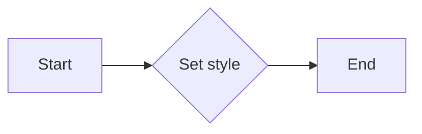

#### 带注释源码

```
plt.style.use('_mpl-gallery')  # 设置matplotlib的样式为'_mpl-gallery'
```


### bar3d

该函数用于在3D坐标系中绘制三维条形图。

参数：

- `x`：`list`，x轴坐标列表。
- `y`：`list`，y轴坐标列表。
- `z`：`list`，z轴坐标列表。
- `dx`：`numpy.ndarray`，x轴方向条形图的宽度。
- `dy`：`numpy.ndarray`，y轴方向条形图的高度。
- `dz`：`list`，z轴方向条形图的深度。

返回值：`None`，该函数不返回任何值。

#### 流程图

```mermaid
graph LR
A[开始] --> B{调用matplotlib.pyplot.subplots}
B --> C{调用matplotlib.pyplot.subplots(subplot_kw={"projection": "3d"})}
C --> D{创建fig和ax}
D --> E{调用ax.bar3d(x, y, z, dx, dy, dz)}
E --> F{设置轴标签}
F --> G{显示图形}
G --> H[结束]
```

#### 带注释源码

```python
"""
==========================
bar3d(x, y, z, dx, dy, dz)
==========================

See `~mpl_toolkits.mplot3d.axes3d.Axes3D.bar3d`.
"""
import matplotlib.pyplot as plt
import numpy as np

plt.style.use('_mpl-gallery')

# Make data
x = [1, 1, 2, 2]
y = [1, 2, 1, 2]
z = [0, 0, 0, 0]
dx = np.ones_like(x)*0.5
dy = np.ones_like(x)*0.5
dz = [2, 3, 1, 4]

# Plot
fig, ax = plt.subplots(subplot_kw={"projection": "3d"})
ax.bar3d(x, y, z, dx, dy, dz)

ax.set(xticklabels=[],
       yticklabels=[],
       zticklabels=[])

plt.show()
```


### bar3d

该函数用于在3D坐标系中绘制三维条形图。

参数：

- `x`：`list`，x轴坐标列表。
- `y`：`list`，y轴坐标列表。
- `z`：`list`，z轴坐标列表。
- `dx`：`numpy.ndarray`，x轴方向条形图的宽度。
- `dy`：`numpy.ndarray`，y轴方向条形图的高度。
- `dz`：`list`，z轴方向条形图的深度。

返回值：`None`，该函数不返回任何值。

#### 流程图

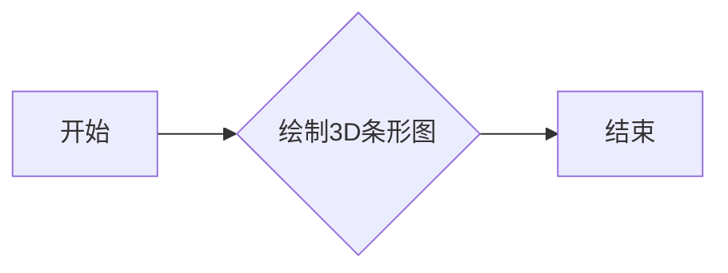

#### 带注释源码

```python
"""
==========================
bar3d(x, y, z, dx, dy, dz)
==========================

See `~mpl_toolkits.mplot3d.axes3d.Axes3D.bar3d`.
"""
import matplotlib.pyplot as plt
import numpy as np

plt.style.use('_mpl-gallery')

# Make data
x = [1, 1, 2, 2]
y = [1, 2, 1, 2]
z = [0, 0, 0, 0]
dx = np.ones_like(x)*0.5
dy = np.ones_like(x)*0.5
dz = [2, 3, 1, 4]

# Plot
fig, ax = plt.subplots(subplot_kw={"projection": "3d"})
ax.bar3d(x, y, z, dx, dy, dz)

ax.set(xticklabels=[],
       yticklabels=[],
       zticklabels=[])

plt.show()
```


### bar3d

该函数用于在3D坐标系中绘制三维条形图。

参数：

- `x`：`list`，x轴坐标点列表。
- `y`：`list`，y轴坐标点列表。
- `z`：`list`，z轴坐标点列表。
- `dx`：`numpy.ndarray`，x轴方向上的条形宽度。
- `dy`：`numpy.ndarray`，y轴方向上的条形宽度。
- `dz`：`list`，z轴方向上的条形高度。

返回值：`None`，该函数不返回任何值。

#### 流程图

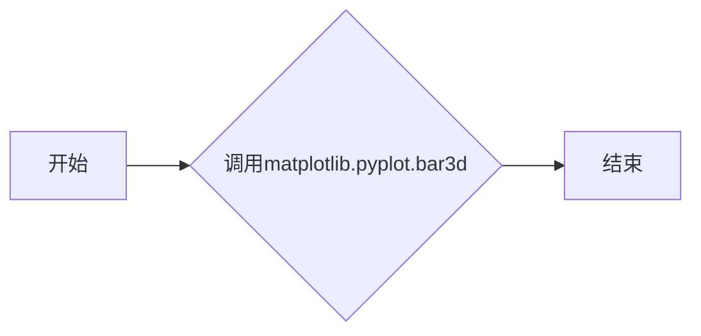

#### 带注释源码

```python
"""
==========================
bar3d(x, y, z, dx, dy, dz)
==========================

See `~mpl_toolkits.mplot3d.axes3d.Axes3D.bar3d`.
"""
import matplotlib.pyplot as plt
import numpy as np

plt.style.use('_mpl-gallery')

# Make data
x = [1, 1, 2, 2]
y = [1, 2, 1, 2]
z = [0, 0, 0, 0]
dx = np.ones_like(x)*0.5
dy = np.ones_like(x)*0.5
dz = [2, 3, 1, 4]

# Plot
fig, ax = plt.subplots(subplot_kw={"projection": "3d"})
ax.bar3d(x, y, z, dx, dy, dz)

ax.set(xticklabels=[],
       yticklabels=[],
       zticklabels=[])

plt.show()
```


### bar3d

该函数用于在3D坐标系中绘制三维条形图。

参数：

- `x`：`list`，x轴坐标点
- `y`：`list`，y轴坐标点
- `z`：`list`，z轴坐标点
- `dx`：`numpy.ndarray`，x轴方向条形图的宽度
- `dy`：`numpy.ndarray`，y轴方向条形图的高度
- `dz`：`list`，z轴方向条形图的深度

返回值：`None`，该函数不返回任何值，直接在图中绘制三维条形图

#### 流程图


#### 带注释源码

```python
import matplotlib.pyplot as plt
import numpy as np

plt.style.use('_mpl-gallery')

# Make data
x = [1, 1, 2, 2]
y = [1, 2, 1, 2]
z = [0, 0, 0, 0]
dx = np.ones_like(x)*0.5
dy = np.ones_like(x)*0.5
dz = [2, 3, 1, 4]

# Plot
fig, ax = plt.subplots(subplot_kw={"projection": "3d"})
ax.bar3d(x, y, z, dx, dy, dz)

ax.set(xticklabels=[],
       yticklabels=[],
       zticklabels=[])

plt.show()
```


### dx

该变量用于设置三维条形图中x轴方向条形图的宽度。

参数：

- `x`：`list`，x轴坐标点

返回值：`numpy.ndarray`，x轴方向条形图的宽度

#### 流程图

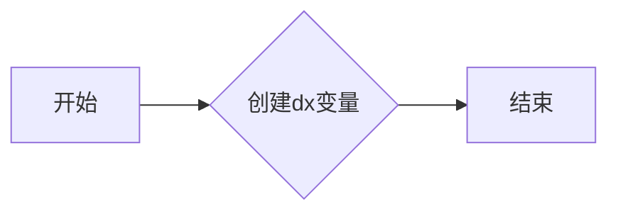

#### 带注释源码

```python
dx = np.ones_like(x)*0.5
```


### `np.ones_like(x)*0.5`

创建一个与输入数组 `x` 形状相同，但所有元素值为 0.5 的数组。

参数：

- `x`：`numpy.ndarray`，输入数组，用于确定新数组的形状。
- ...

返回值：`numpy.ndarray`，与输入数组 `x` 形状相同，但所有元素值为 0.5 的数组。

#### 流程图

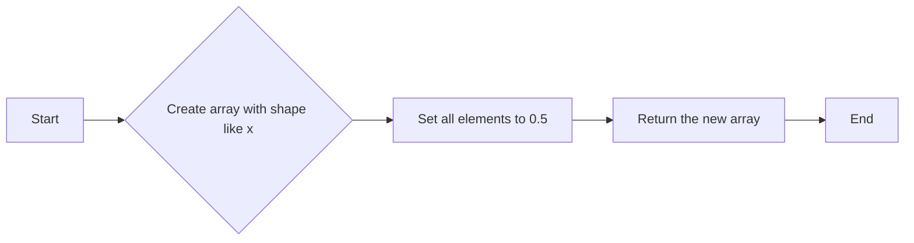

#### 带注释源码

```
import numpy as np

# 创建一个与 x 形状相同，但所有元素值为 0.5 的数组
dy = np.ones_like(x)*0.5
``` 


### bar3d

该函数用于在3D坐标系中绘制三维条形图。

参数：

- `x`：`list`，x轴坐标列表。
- `y`：`list`，y轴坐标列表。
- `z`：`list`，z轴坐标列表。
- `dx`：`numpy.ndarray`，x轴方向条形图的宽度。
- `dy`：`numpy.ndarray`，y轴方向条形图的高度。
- `dz`：`list`，z轴方向条形图的深度。

返回值：`None`，该函数不返回任何值。

#### 流程图


#### 带注释源码

```python
"""
==========================
bar3d(x, y, z, dx, dy, dz)
==========================

See `~mpl_toolkits.mplot3d.axes3d.Axes3D.bar3d`.
"""
import matplotlib.pyplot as plt
import numpy as np

plt.style.use('_mpl-gallery')

# Make data
x = [1, 1, 2, 2]
y = [1, 2, 1, 2]
z = [0, 0, 0, 0]
dx = np.ones_like(x)*0.5
dy = np.ones_like(x)*0.5
dz = [2, 3, 1, 4]

# Plot
fig, ax = plt.subplots(subplot_kw={"projection": "3d"})
ax.bar3d(x, y, z, dx, dy, dz)

ax.set(xticklabels=[],
       yticklabels=[],
       zticklabels=[])
plt.show()
```


### plt.subplots

该函数用于创建一个图形和一个轴，并返回它们。

参数：

- `subplot_kw`：`dict`，关键字参数字典，用于传递给`Subplot`构造函数的参数。在这个例子中，它被用来设置子图的投影为3D。

返回值：

- `fig`：`Figure`对象，表示整个图形。
- `ax`：`Axes3D`对象，表示3D子图。

#### 流程图

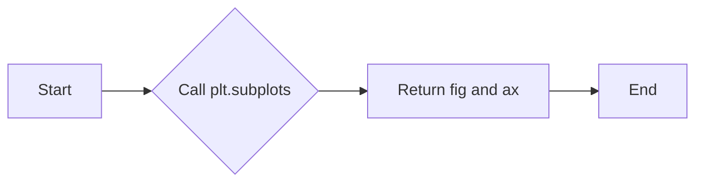

#### 带注释源码

```python
fig, ax = plt.subplots(subplot_kw={"projection": "3d"})
```


### ax.bar3d(x, y, z, dx, dy, dz)

该函数用于在3D坐标系中绘制三维条形图。

参数：

- `x`：`numpy.ndarray`，x轴坐标数组，表示条形图在x轴上的位置。
- `y`：`numpy.ndarray`，y轴坐标数组，表示条形图在y轴上的位置。
- `z`：`numpy.ndarray`，z轴坐标数组，表示条形图在z轴上的位置。
- `dx`：`numpy.ndarray`，x轴方向上的条形宽度。
- `dy`：`numpy.ndarray`，y轴方向上的条形宽度。
- `dz`：`numpy.ndarray`，z轴方向上的条形高度。

返回值：无，该函数直接在当前轴（Axes）上绘制三维条形图。

#### 流程图

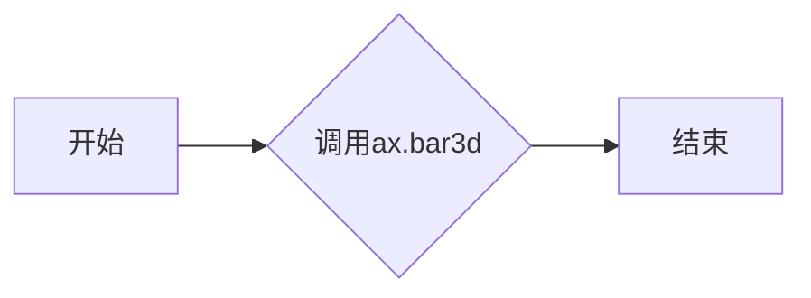

#### 带注释源码

```python
import matplotlib.pyplot as plt
import numpy as np

plt.style.use('_mpl-gallery')

# Make data
x = [1, 1, 2, 2]
y = [1, 2, 1, 2]
z = [0, 0, 0, 0]
dx = np.ones_like(x)*0.5
dy = np.ones_like(x)*0.5
dz = [2, 3, 1, 4]

# Plot
fig, ax = plt.subplots(subplot_kw={"projection": "3d"})
ax.bar3d(x, y, z, dx, dy, dz)  # 绘制三维条形图
ax.set(xticklabels=[], yticklabels=[], zticklabels=[])  # 设置坐标轴标签
plt.show()  # 显示图形
```


### ax.set(xticklabels=[], yticklabels=[], zticklabels=[]) 

设置3D图形的x轴、y轴和z轴的刻度标签为空。

参数：

- xticklabels：`list`，用于设置x轴的刻度标签列表，这里设置为空列表，表示不显示x轴的刻度标签。
- yticklabels：`list`，用于设置y轴的刻度标签列表，这里设置为空列表，表示不显示y轴的刻度标签。
- zticklabels：`list`，用于设置z轴的刻度标签列表，这里设置为空列表，表示不显示z轴的刻度标签。

返回值：`None`，该方法没有返回值。

#### 流程图

```mermaid
graph LR
A[开始] --> B{调用 ax.set()}
B --> C[设置参数]
C --> D[设置 xticklabels]
D --> E[设置 yticklabels]
E --> F[设置 zticklabels]
F --> G[结束]
```

#### 带注释源码

```
ax.set(xticklabels=[], yticklabels=[], zticklabels=[])
```


### plt.show()

显示当前图形的窗口。

参数：

- 无

返回值：无

#### 流程图

```mermaid
graph LR
A[开始] --> B{调用plt.show()}
B --> C[结束]
```

#### 带注释源码

```
plt.show()
```


### matplotlib.pyplot

matplotlib.pyplot 是一个用于创建静态、交互式和动画图表的库。

#### plt.style.use('_mpl-gallery')

设置绘图风格为 '_mpl-gallery'。

#### fig, ax = plt.subplots(subplot_kw={"projection": "3d"})

创建一个新的图形和一个 3D 子图。

#### ax.bar3d(x, y, z, dx, dy, dz)

在 3D 子图上绘制三维条形图。

#### ax.set(xticklabels=[], yticklabels=[], zticklabels=[])

设置坐标轴标签为空。

#### plt.show()

显示当前图形的窗口。
```python
import matplotlib.pyplot as plt
import numpy as np

plt.style.use('_mpl-gallery')

# Make data
x = [1, 1, 2, 2]
y = [1, 2, 1, 2]
z = [0, 0, 0, 0]
dx = np.ones_like(x)*0.5
dy = np.ones_like(x)*0.5
dz = [2, 3, 1, 4]

# Plot
fig, ax = plt.subplots(subplot_kw={"projection": "3d"})
ax.bar3d(x, y, z, dx, dy, dz)

ax.set(xticklabels=[],
       yticklabels=[],
       zticklabels=[])

plt.show()
```


### matplotlib.pyplot.use

matplotlib.pyplot.use 是一个全局函数，用于设置matplotlib的样式。

参数：

- 无参数

返回值：无返回值

#### 流程图

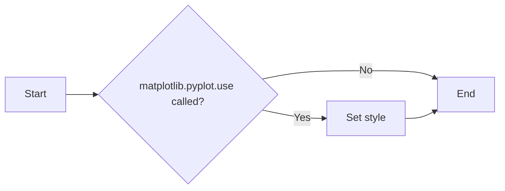

#### 带注释源码

```
# Set the style of matplotlib
plt.style.use('_mpl-gallery')
```


### plt.style.use

plt.style.use 是一个全局函数，用于设置matplotlib的样式。

参数：

- `style`: `str`，指定要使用的样式名称。

参数描述：`style` 参数是一个字符串，它指定了matplotlib的样式名称，例如 '_mpl-gallery'。

返回值：无返回值

#### 流程图

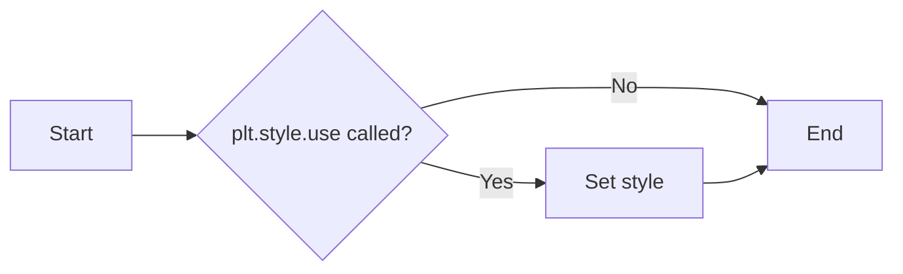

#### 带注释源码

```
# Set the style of matplotlib to '_mpl-gallery'
plt.style.use('_mpl-gallery')
```


### matplotlib.pyplot.subplots

matplotlib.pyplot.subplots 是一个全局函数，用于创建一个图形和一个轴。

参数：

- `subplot_kw`: `dict`，关键字参数字典，用于传递给 `subplots` 函数的参数。

返回值：`fig, ax`，其中 `fig` 是图形对象，`ax` 是轴对象。

#### 流程图

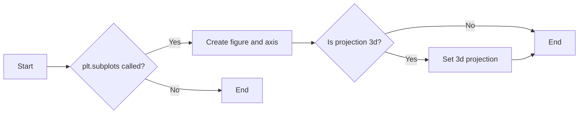

#### 带注释源码

```
# Create a figure and an axis with 3D projection
fig, ax = plt.subplots(subplot_kw={"projection": "3d"})
```


### mpl_toolkits.mplot3d.axes3d.Axes3D.bar3d

mpl_toolkits.mplot3d.axes3d.Axes3D.bar3d 是一个方法，用于在3D轴上绘制三维条形图。

参数：

- `x`: `array_like`，x坐标。
- `y`: `array_like`，y坐标。
- `z`: `array_like`，z坐标。
- `dx`: `array_like`，x方向上的条形宽度。
- `dy`: `array_like`，y方向上的条形宽度。
- `dz`: `array_like`，z方向上的条形高度。

返回值：无返回值

#### 流程图

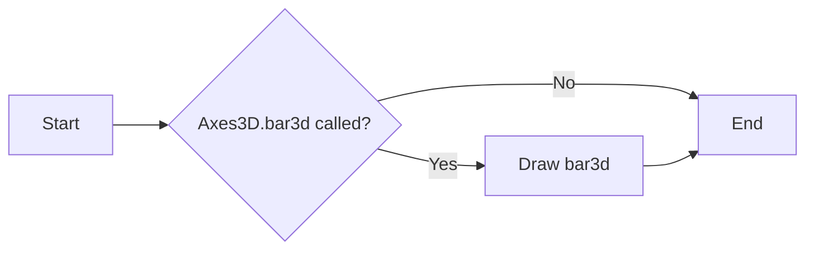

#### 带注释源码

```
# Draw a 3D bar plot
ax.bar3d(x, y, z, dx, dy, dz)
```


### plt.show

plt.show 是一个全局函数，用于显示图形。

参数：无参数

返回值：无返回值

#### 流程图

```mermaid
graph LR
A[Start] --> B{plt.show called?}
B -- Yes --> C[Show figure]
B -- No --> D[End]
C --> D
```

#### 带注释源码

```
# Show the figure
plt.show()
```


### 关键组件信息

- matplotlib.pyplot：matplotlib的pyplot模块，用于创建图形和轴。
- mpl_toolkits.mplot3d：matplotlib的3D绘图工具包。
- numpy：用于数值计算的Python库。

一句话描述：matplotlib.pyplot模块提供了创建图形和轴的功能，mpl_toolkits.mplot3d模块提供了3D绘图功能，numpy用于数值计算。


### 潜在的技术债务或优化空间

- 代码中使用了硬编码的样式名称 '_mpl-gallery'，这可能会限制样式的灵活性。
- 代码中没有使用异常处理来捕获可能发生的错误，例如在创建图形或轴时。
- 代码中没有使用日志记录来记录关键操作或错误。


### 设计目标与约束

设计目标是创建一个简单的3D条形图，用于展示数据。约束包括使用matplotlib和numpy库。


### 错误处理与异常设计

代码中没有包含错误处理和异常设计。在实际应用中，应该添加异常处理来捕获和处理可能发生的错误。


### 数据流与状态机

数据流从创建数据开始，然后创建图形和轴，接着绘制3D条形图，最后显示图形。


### 外部依赖与接口契约

外部依赖包括matplotlib和numpy库。接口契约定义了这些库的API，用于创建图形、轴和3D条形图。


### `subplots`

`subplots` 是 `matplotlib.pyplot` 模块中的一个函数，用于创建一个图形和一个轴（Axes）对象。

参数：

- `subplot_kw`：`dict`，关键字参数字典，用于传递给 `Axes` 的构造函数。在这个例子中，`subplot_kw` 包含一个 `projection` 关键字，其值为 `"3d"`，表示创建一个三维投影的轴。

返回值：`fig`：`Figure` 对象，包含创建的图形和轴。`ax`：`Axes3D` 对象，用于绘制三维图形。

#### 流程图

```mermaid
graph LR
A[Start] --> B{Create figure and axes}
B --> C[Set subplot keyword arguments]
C --> D[Create 3D Axes]
D --> E[Set x, y, z tick labels]
E --> F[Show plot]
F --> G[End]
```

#### 带注释源码

```python
fig, ax = plt.subplots(subplot_kw={"projection": "3d"})
```


### `bar3d`

`bar3d` 是 `mpl_toolkits.mplot3d.axes3d.Axes3D` 类中的一个方法，用于在三维空间中绘制三维条形图。

参数：

- `x`：`array_like`，条形图在 x 轴上的位置。
- `y`：`array_like`，条形图在 y 轴上的位置。
- `z`：`array_like`，条形图在 z 轴上的高度。
- `dx`：`array_like`，条形图在 x 轴上的宽度。
- `dy`：`array_like`，条形图在 y 轴上的宽度。
- `dz`：`array_like`，条形图在 z 轴上的深度。

返回值：无

#### 流程图

```mermaid
graph LR
A[Start] --> B{Call bar3d method}
B --> C[End]
```

#### 带注释源码

```python
ax.bar3d(x, y, z, dx, dy, dz)
```


### `set`

`set` 是 `mpl_toolkits.mplot3d.axes3d.Axes3D` 类中的一个方法，用于设置轴的属性。

参数：

- `xticklabels`：`list` 或 `None`，x 轴的标签列表。
- `yticklabels`：`list` 或 `None`，y 轴的标签列表。
- `zticklabels`：`list` 或 `None`，z 轴的标签列表。

返回值：无

#### 流程图

```mermaid
graph LR
A[Start] --> B{Set tick labels}
B --> C[End]
```

#### 带注释源码

```python
ax.set(xticklabels=[], yticklabels=[], zticklabels=[])
```


### `show`

`show` 是 `matplotlib.pyplot` 模块中的一个函数，用于显示图形。

参数：无

返回值：无

#### 流程图

```mermaid
graph LR
A[Start] --> B{Show plot}
B --> C[End]
```

#### 带注释源码

```python
plt.show()
```


### plt.show()

显示当前图形的窗口。

参数：

- 无

返回值：无

#### 流程图

```mermaid
graph LR
A[开始] --> B{调用plt.show()}
B --> C[结束]
```

#### 带注释源码

```
plt.show()
```


### plt.subplots(subplot_kw={"projection": "3d"})

创建一个图形和一个轴，并返回它们。

参数：

- subplot_kw：`dict`，关键字参数字典，用于设置子图的位置和属性。
  - projection：`str`，指定轴的投影类型，这里为"3d"，表示创建一个3D轴。

返回值：`fig`：`matplotlib.figure.Figure`，当前图形对象。
         `ax`：`matplotlib.axes.Axes`，当前轴对象。

#### 流程图

```mermaid
graph LR
A[开始] --> B{创建图形和轴}
B --> C[设置投影为3D]
C --> D[返回fig和ax]
D --> E[结束]
```

#### 带注释源码

```
fig, ax = plt.subplots(subplot_kw={"projection": "3d"})
```


### ax.bar3d(x, y, z, dx, dy, dz)

在3D轴上绘制三维条形图。

参数：

- x：`array_like`，条形图在x轴上的位置。
- y：`array_like`，条形图在y轴上的位置。
- z：`array_like`，条形图在z轴上的位置。
- dx：`array_like`，条形图在x轴上的宽度。
- dy：`array_like`，条形图在y轴上的宽度。
- dz：`array_like`，条形图在z轴上的高度。

返回值：无

#### 流程图

```mermaid
graph LR
A[开始] --> B{绘制三维条形图}
B --> C[结束]
```

#### 带注释源码

```
ax.bar3d(x, y, z, dx, dy, dz)
```


### ax.set(xticklabels=[], yticklabels=[], zticklabels=[])
设置轴的刻度标签。

参数：

- xticklabels：`list`，x轴的刻度标签列表。
- yticklabels：`list`，y轴的刻度标签列表。
- zticklabels：`list`，z轴的刻度标签列表。

返回值：无

#### 流程图

```mermaid
graph LR
A[开始] --> B{设置轴的刻度标签}
B --> C[结束]
```

#### 带注释源码

```
ax.set(xticklabels=[], yticklabels=[], zticklabels=[])
```


### 关键组件信息

- matplotlib.pyplot：matplotlib的绘图模块，提供绘图功能。
- numpy：提供数值计算功能。
- mpl_toolkits.mplot3d：matplotlib的3D绘图工具包。

#### 一句话描述

matplotlib.pyplot.show()是matplotlib库中的一个函数，用于显示当前图形的窗口。它通过调用plt.subplots()创建图形和轴，然后使用ax.bar3d()绘制三维条形图，并通过ax.set()设置轴的刻度标签，最后显示图形窗口。


### numpy.ones_like

`numpy.ones_like` 是一个全局函数，用于创建一个与输入数组形状相同且元素值为1的数组。

参数：

- `x`：`numpy.ndarray`，输入数组，用于确定输出数组的形状。

返回值：`numpy.ndarray`，与输入数组形状相同且元素值为1的数组。

#### 流程图

```mermaid
graph LR
A[Start] --> B{Is x a numpy.ndarray?}
B -- Yes --> C[Create array with shape of x and value 1]
B -- No --> D[Error: x is not a numpy.ndarray]
C --> E[End]
D --> E
```

#### 带注释源码

```python
import numpy as np

def ones_like(x):
    """
    Return an array of ones with the same shape and type as the input.
    
    Parameters
    ----------
    x : numpy.ndarray
        Input array to determine the shape of the output array.
    
    Returns
    -------
    numpy.ndarray
        Array with the same shape and type as x, with all elements set to 1.
    """
    return np.ones(x.shape, dtype=x.dtype)
```


## 关键组件


### 张量索引

张量索引用于在多维数组中定位和访问元素。

### 惰性加载

惰性加载是一种延迟计算或资源分配的策略，直到实际需要时才进行。

### 反量化支持

反量化支持允许在代码中处理未量化或部分量化的数据。

### 量化策略

量化策略涉及将浮点数数据转换为固定点数表示，以减少计算资源消耗。


## 问题及建议


### 已知问题

-   {问题1}：代码中使用了硬编码的坐标值和尺寸，这可能导致代码的可重用性降低。如果需要绘制不同的数据，需要手动修改这些值。
-   {问题2}：代码没有进行任何错误处理，如果绘图过程中出现异常（例如，matplotlib库未安装），程序可能会崩溃。
-   {问题3}：代码没有提供任何用户交互，例如，没有提供输入参数来允许用户自定义坐标、尺寸或颜色。

### 优化建议

-   {建议1}：将坐标值和尺寸作为函数参数传递，以提高代码的可重用性和灵活性。
-   {建议2}：添加异常处理来捕获并处理可能发生的错误，例如，检查matplotlib库是否已安装。
-   {建议3}：实现用户交互功能，允许用户通过命令行或图形界面输入自定义参数。
-   {建议4}：考虑使用面向对象编程方法来封装绘图逻辑，以便更好地组织代码并提高可维护性。
-   {建议5}：如果绘图数据量很大，可以考虑使用更高效的绘图库或优化绘图算法来提高性能。


## 其它


### 设计目标与约束

- 设计目标：实现一个3D条形图绘制功能，用于可视化三维空间中的数据。
- 约束条件：使用matplotlib库进行绘图，确保代码简洁且易于理解。

### 错误处理与异常设计

- 错误处理：对输入数据进行类型检查，确保x、y、z、dx、dy、dz均为数值类型。
- 异常设计：在数据类型不正确时抛出异常，提示用户输入正确的数据类型。

### 数据流与状态机

- 数据流：输入数据通过参数传递给绘图函数，经过处理后在3D坐标系中绘制条形图。
- 状态机：程序从数据准备到绘图展示，经历数据准备、绘图、展示三个状态。

### 外部依赖与接口契约

- 外部依赖：matplotlib库用于绘图，numpy库用于数值计算。
- 接口契约：函数bar3d接受六个参数，分别为x、y、z、dx、dy、dz，返回一个3D条形图。


    