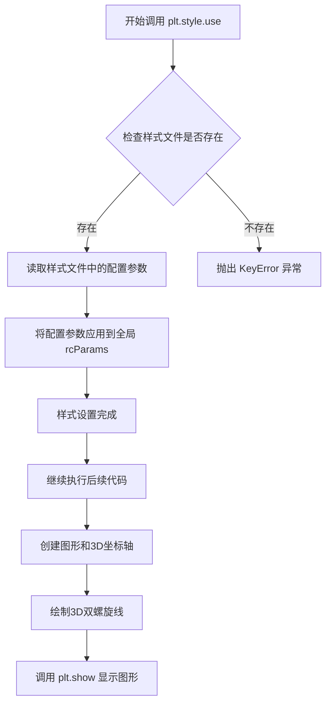
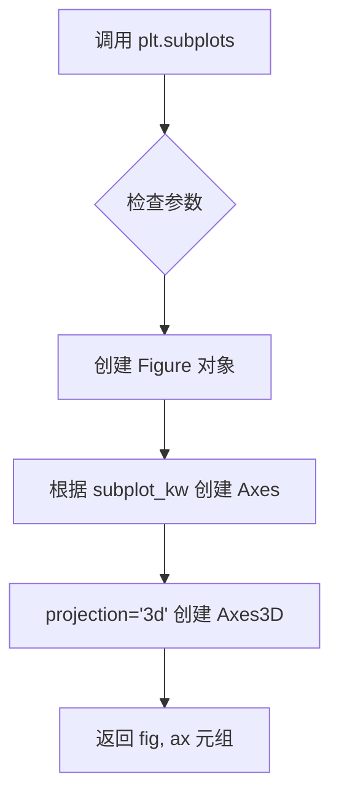
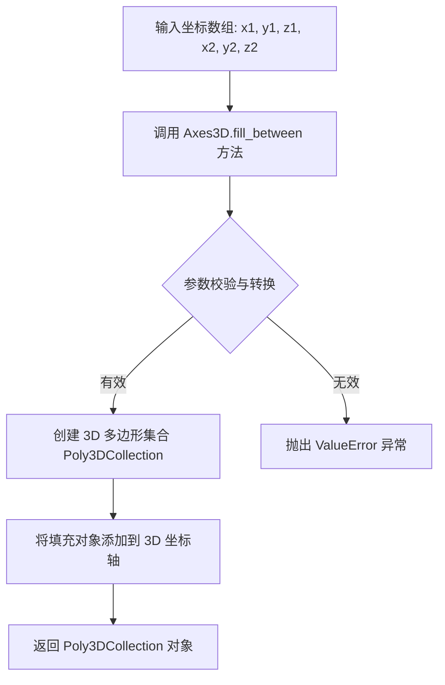
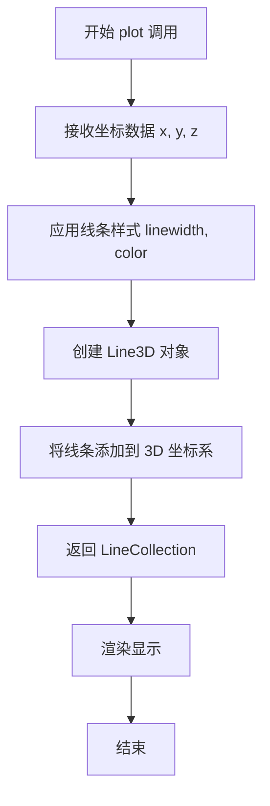
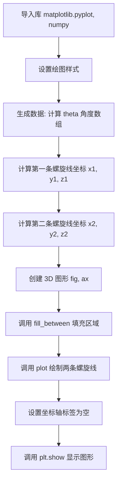
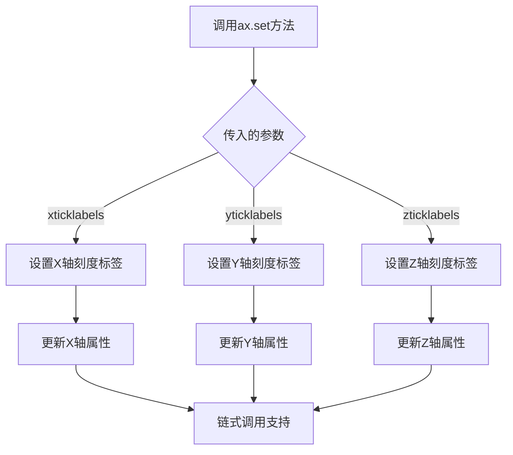
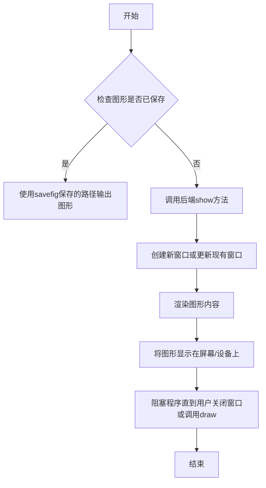
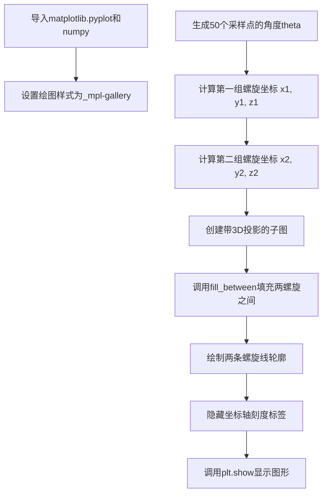

# `matplotlib\galleries\plot_types\3D\fill_between3d_simple.py` 详细设计文档

该代码使用 Matplotlib 的 3D 绘图功能创建一个双螺旋（double helix）可视化，通过 fill_between 方法在两个螺旋之间填充半透明颜色，形成一个带状的 3D 螺旋结构，并使用 plot 方法绘制螺旋线轮廓。

## 整体流程

```mermaid
graph TD
    A[开始] --> B[导入库: matplotlib.pyplot, numpy]
B --> C[设置 Matplotlib 样式: plt.style.use('_mpl-gallery')]
C --> D[生成数据: n=50, theta=0到2π的50个点]
D --> E[计算螺旋1坐标: x1=cos(θ), y1=sin(θ), z1=0到1线性分布]
E --> F[计算螺旋2坐标: x2=cos(θ+π), y2=sin(θ+π), z2=z1]
F --> G[创建3D图表: fig, ax = plt.subplots(subplot_kw={'projection': '3d'})]
G --> H[绘制填充面: ax.fill_between(x1,y1,z1,x2,y2,z2, alpha=0.5)]
H --> I[绘制螺旋1线: ax.plot(x1,y1,z1, linewidth=2, color='C0')]
I --> J[绘制螺旋2线: ax.plot(x2,y2,z2, linewidth=2, color='C0')]
J --> K[设置坐标轴标签为空: ax.set(xticklabels=[], ...)]
K --> L[显示图表: plt.show()]
```

## 类结构

```
此脚本为单文件脚本，无自定义类定义
主要使用第三方库的类和函数：
├── matplotlib.pyplot (绘图库)
│   ├── style (样式模块)
│   ├── subplots (创建子图)
│   └── show (显示图表)
└── numpy (数值计算库)
    └── linspace (生成线性间隔数组)
```

## 全局变量及字段


### `n`
    
螺旋点的数量(50)

类型：`int`
    


### `theta`
    
从0到2π的角度数组

类型：`ndarray`
    


### `x1`
    
第一个螺旋的x坐标(cos函数)

类型：`ndarray`
    


### `y1`
    
第一个螺旋的y坐标(sin函数)

类型：`ndarray`
    


### `z1`
    
第一个螺旋的z坐标(线性分布)

类型：`ndarray`
    


### `x2`
    
第二个螺旋的x坐标(cos函数,相位偏移π)

类型：`ndarray`
    


### `y2`
    
第二个螺旋的y坐标(sin函数,相位偏移π)

类型：`ndarray`
    


### `z2`
    
第二个螺旋的z坐标(与z1相同)

类型：`ndarray`
    


### `fig`
    
Matplotlib图形对象

类型：`Figure`
    


### `ax`
    
3D坐标轴对象

类型：`Axes3D`
    


    

## 全局函数及方法


### `plt.style.use`

设置Matplotlib绘图样式为指定的样式文件，代码中使用的样式为`_mpl-gallery`，该样式提供画廊风格的默认绘图配置，使3D图形的视觉效果更加专业。

参数：

-  `style`：字符串，要使用的样式名称。代码中传入 `'_mpl-gallery'`，表示使用mpl-gallery样式
-  `after`：字符串（可选），指定在应用样式后恢复的样式名称，默认为空

返回值：`None`，该函数直接修改matplotlib的rcParams配置，不返回任何值

#### 流程图



#### 带注释源码

```python
# 设置Matplotlib的绘图样式为'_mpl-gallery'
# 该样式是matplotlib内置的画廊风格样式
# 会修改全局的rcParams配置，影响后续所有图表的默认外观
plt.style.use('_mpl-gallery')

# 样式效果说明：
# - 背景色变为白色
# - 网格线样式调整
# - 字体和线条粗细优化
# - 颜色主题更适合演示和出版
```

#### 补充说明

由于`plt.style.use`是matplotlib库的内部函数，非本项目代码定义，因此无法提供其完整的内部实现源码。上方展示的是该函数在本项目代码中的调用方式及其效果说明。

**相关配置参数**（样式应用后影响的rcParams项）：

- `axes.facecolor`：坐标轴背景色
- `figure.facecolor`：图形背景色  
- `lines.linewidth`：线条宽度
- `font.size`：字体大小
- `axes.grid`：是否显示网格
- `grid.alpha`：网格透明度


### `np.linspace`

生成指定范围内的等间隔数组

参数：

- `start`：`array_like`，序列的起始值
- `stop`：`array_like`，序列的结束值，除非`endpoint`设置为`False`
- `num`：`int`，生成的样本数量，默认为50
- `endpoint`：`bool`，如果为`True`，则包含结束值，默认为`True`
- `retstep`：`bool`，如果为`True`，则返回步长，默认为`False`
- `dtype`：`dtype`，输出数组的数据类型
- `axis`：`int`，结果数组的轴（当`start`和`stop`是数组时使用）

返回值：`ndarray`，等间隔的样本数组

#### 流程图

```mermaid
graph TD
    A[开始] --> B[接收参数 start, stop, num]
    B --> C[确定样本数量]
    C --> D{endpoint=True?}
    D -->|是| E[包含结束值]
    D -->|否| F[不包含结束值]
    E --> G[计算步长: (stop - start) / (num - 1)]
    F --> H[计算步长: (stop - start) / num]
    G --> I[生成等间隔数组]
    H --> I
    I --> J{retstep=True?}
    J -->|是| K[返回数组和步长]
    J -->|否| L[仅返回数组]
    K --> M[结束]
    L --> M
```

#### 带注释源码

```python
def linspace(start, stop, num=50, endpoint=True, retstep=False, dtype=None, axis=0):
    """
    生成指定范围内的等间隔数组
    
    参数:
        start: 序列的起始值
        stop: 序列的结束值
        num: 生成的样本数量，默认为50
        endpoint: 是否包含结束值，默认为True
        retstep: 是否返回步长，默认为False
        dtype: 输出数组的数据类型
        axis: 结果数组的轴
    
    返回值:
        ndarray: 等间隔的样本数组
    """
    # 确定是否包含结束值
    if endpoint:
        # 包含结束值时，步长为 (stop - start) / (num - 1)
        step = (stop - start) / (num - 1)
    else:
        # 不包含结束值时，步长为 (stop - start) / num
        step = (stop - start) / num
    
    # 使用NumPy的arange生成数组，加上步长确保包含结束值
    if endpoint:
        y = arange(start, stop + step, step, dtype=dtype)
    else:
        y = arange(start, stop, step, dtype=dtype)
    
    # 根据dtype调整数组类型
    if dtype is not None and y.dtype != dtype:
        y = y.astype(dtype)
    
    if retstep:
        # 返回数组和步长
        return y, step
    else:
        # 仅返回数组
        return y
```


### np.cos

计算数组元素的余弦值（以弧度为单位）。

参数：

-  `x`：`ndarray` 或 `scalar`，输入的角度值（弧度制），可以是单个数值或数组

返回值：`ndarray` 或 `scalar`，输入角度的余弦值，返回值形状与输入相同

#### 流程图


#### 带注释源码

```python
# 生成从0到2*pi的等差数组，作为角度输入
theta = np.linspace(0, 2*np.pi, n)

# 计算theta数组的余弦值，得到第一个螺旋的x坐标
x1 = np.cos(theta)

# 计算theta+π数组的余弦值，得到第二个螺旋的x坐标（与第一个螺旋相反）
x2 = np.cos(theta + np.pi)
```


### `np.sin`

计算数组元素的正弦值，用于将输入的角度（弧度）转换为对应的正弦值。该函数是NumPy库的核心数学函数之一，支持标量和数组输入，并返回相应形状的正弦结果。

参数：
- `x`：`ndarray` 或 `scalar`，输入角度（弧度），可以是单个数值或NumPy数组。在提供的代码中，实际参数为`theta`和`theta + np.pi`。

返回值：`ndarray` 或 `scalar`，输入角度对应的正弦值，类型与输入相同。

#### 流程图

```mermaid
graph LR
A[输入 x (角度)] --> B[计算正弦值]
B --> C[输出 y (正弦值)]
```

#### 带注释源码

```python
# NumPy.sin 函数调用示例（基于提供的代码）
import numpy as np

# 创建角度数组（弧度）
theta = np.linspace(0, 2*np.pi, n)  # n=50，从0到2π的50个等差点

# 第一次调用：计算theta的正弦值
y1 = np.sin(theta)  # 返回与theta形状相同的正弦值数组

# 第二次调用：计算theta+π的正弦值（利用正弦函数的周期性）
y2 = np.sin(theta + np.pi)  # 等价于 -np.sin(theta)

# 注意：np.sin内部使用C语言实现，上述代码展示了在Python中的典型用法
```


### plt.subplots

`plt.subplots` 是 matplotlib 库中用于创建一个新的图形窗口及其包含的坐标轴的函数。在本代码中，它被用于创建一个带有 3D 投影的子图，返回一个 Figure 对象和一个 3D Axes 对象，用于后续的 3D 图形绘制操作。

#### 流程图



#### 带注释源码

```python
# 使用 plt.subplots 创建图形和3D坐标轴
# 参数说明：
#   nrows=1, ncols=1: 默认创建一个子图
#   subplot_kw: 传递给 add_subplot 的关键字参数
#     projection='3d': 指定为3D投影类型，创建Axes3D对象
# 返回值：
#   fig: matplotlib.figure.Figure 对象，表示整个图形
#   ax: mpl_toolkits.mplot3d.axes3d.Axes3D 对象，表示3D坐标轴
fig, ax = plt.subplots(subplot_kw={"projection": "3d"})
```

---

## 文件整体运行流程

1. **导入模块**：导入 `matplotlib.pyplot` 作为 plt，导入 `numpy` 作为 np
2. **设置绘图风格**：使用 `plt.style.use('_mpl-gallery')` 设置绘图样式
3. **生成数据**：创建双螺旋线的数据点，包括 x1, y1, z1 和 x2, y2, z2
4. **创建画布和坐标轴**：调用 `plt.subplots` 创建 3D 图形窗口和坐标轴
5. **绑定图形**：
   - 使用 `ax.fill_between` 填充两条螺旋线之间的区域
   - 使用 `ax.plot` 绘制两条螺旋线的轮廓线
6. **设置坐标轴**：隐藏坐标轴刻度标签
7. **显示图形**：调用 `plt.show()` 渲染并显示图形

---

## 关键组件信息

| 组件名称 | 描述 |
|---------|------|
| `plt.subplots` | 创建图形窗口和坐标轴的核心函数，支持 3D 投影 |
| `ax.fill_between` | 在 3D 空间中填充两条曲线之间的区域 |
| `ax.plot` | 在 3D 空间中绘制线条 |
| `np.linspace` | 生成线性间隔的数组，用于创建螺旋线数据 |

---

## 潜在的技术债务或优化空间

1. **硬编码参数**：3D 投影类型 `"3d"` 被硬编码，缺乏灵活性
2. **魔法数值**：如 `n=50`、`alpha=0.5` 等数值应提取为常量或配置参数
3. **缺乏错误处理**：没有对输入数据维度、类型进行检查
4. **重复代码**：两次调用 `ax.plot` 绘制螺旋线，可考虑封装为函数

---

## 其它项目

### 设计目标与约束

- **目标**：绘制一个双螺旋结构的 3D 可视化图形，展示两条螺旋线及其填充区域
- **约束**：使用 matplotlib 的 3D 工具包 `mpl_toolkits.mplot3d`

### 错误处理与异常设计

- 当前代码未包含显式的错误处理机制
- 潜在异常：数据维度不匹配会导致 `fill_between` 或 `plot` 失败
- 建议：添加数据验证，确保 x, y, z 数组长度一致

### 数据流与状态机

- **数据流**：NumPy 数组 → fill_between/plot → 3D 渲染器 → 图形窗口
- **状态**：初始 → 数据生成 → 图形绑定 → 渲染显示

### 外部依赖与接口契约

- **matplotlib**：图形渲染核心库
- **numpy**：数值计算和数据生成
- **接口**：返回 `(Figure, Axes3D)` 元组，调用者负责管理生命周期


### `Axes3D.fill_between`

在3D坐标轴上填充两条3D曲线之间的区域，常用于可视化两个螺旋之间的空间。

参数：
-  `x1`：`numpy.ndarray` 或 `array-like`，第一个螺旋的x坐标数组
-  `y1`：`numpy.ndarray` 或 `array-like`，第一个螺旋的y坐标数组
-  `z1`：`numpy.ndarray` 或 `array-like`，第一个螺旋的z坐标数组
-  `x2`：`numpy.ndarray` 或 `array-like`，第二个螺旋的x坐标数组
-  `y2`：`numpy.ndarray` 或 `array-like`，第二个螺旋的y坐标数组
-  `z2`：`numpy.ndarray` 或 `array-like`，第二个螺旋的z坐标数组
-  `alpha`：`float`，可选，填充区域的透明度，默认为0.5

返回值：`matplotlib.collections.Poly3DCollection`，返回填充的多边形集合对象，可用于进一步自定义样式。

#### 流程图



#### 带注释源码

```python
# 调用 fill_between 方法填充两个螺旋之间的区域
# 参数：第一个螺旋的坐标 (x1, y1, z1)，第二个螺旋的坐标 (x2, y2, z2)，透明度 alpha=0.5
ax.fill_between(x1, y1, z1, x2, y2, z2, alpha=0.5)
```


### `ax.plot`

在3D坐标系中绘制螺旋线线条，将两条相位相反的螺旋线绘制为可视化线条，呈现双螺旋结构的轮廓。

参数：

-  `x`：`numpy.ndarray`，X轴坐标数组
-  `y`：`numpy.ndarray`，Y轴坐标数组  
-  `z`：`numpy.ndarray`，Z轴坐标数组
-  `linewidth`：`float`，线条宽度（可选，默认1.5）
-  `color`：`str`，线条颜色（可选）

返回值：`matplotlib.collections.LineCollection`，返回3D线条集合对象，用于后续图形设置或获取线条属性

#### 流程图



#### 带注释源码

```python
# 绘制第一条螺旋线
# x1, y1, z1: 第一条螺旋线的三维坐标
# linewidth=2: 设置线条宽度为2
# color='C0': 使用matplotlib的第一个默认颜色
ax.plot(x1, y1, z1, linewidth=2, color='C0')

# 绘制第二条螺旋线（与第一条相位相反）
# x2, y2, z2: 第二条螺旋线的三维坐标，通过 theta+π 实现相位偏移
ax.plot(x2, y2, z2, linewidth=2, color='C0')
```

---

### 整体代码设计文档

#### 1. 核心功能概述
该脚本使用 Matplotlib 在3D空间中绘制双螺旋线结构，通过 `fill_between` 填充两条螺旋线之间的区域形成立体感，并使用 `plot` 绘制螺旋线轮廓线条，呈现类似 DNA 双螺旋的可视化效果。

#### 2. 文件运行流程



#### 3. 类与全局信息

| 类别 | 名称 | 类型 | 描述 |
|------|------|------|------|
| 全局变量 | `n` | `int` | 采样点数量，控制螺旋线的平滑度 |
| 全局变量 | `theta` | `numpy.ndarray` | 角度数组，从0到2π均匀分布 |
| 全局变量 | `x1, y1, z1` | `numpy.ndarray` | 第一条螺旋线的三维坐标 |
| 全局变量 | `x2, y2, z2` | `numpy.ndarray` | 第二条螺旋线的三维坐标（相位相反） |
| 全局变量 | `fig` | `matplotlib.figure.Figure` | 图形对象 |
| 全局变量 | `ax` | `mpl_toolkits.mplot3d.axes3d.Axes3D` | 3D坐标轴对象 |

#### 4. 关键组件信息

| 组件名称 | 一句话描述 |
|----------|------------|
| `fill_between` | 在3D空间中填充两条曲线之间的区域 |
| `plot` | 在3D坐标系中绘制线条 |
| `Axes3D` | Matplotlib 3D 坐标轴，支持 x, y, z 三维绘图 |

#### 5. 潜在技术债务与优化空间

1. **硬编码参数**：采样点数量 `n=50`、透明度 `alpha=0.5` 等参数应提取为可配置常量
2. **坐标计算冗余**：`z2 = z1` 可直接引用，避免重复创建数组
3. **缺少错误处理**：未对输入数组维度一致性进行检查
4. **样式配置**：颜色和线宽重复定义，可提取为配置变量
5. **可扩展性不足**：双螺旋生成逻辑可封装为函数，支持不同参数的双螺旋生成

#### 6. 其它设计说明

- **设计目标**：可视化双螺旋结构，展示3D填充与线条绘制的结合
- **约束**：依赖 Matplotlib 3D 扩展库 (`mpl_toolkits.mplot3d`)
- **数据流**：NumPy 数组生成 → 坐标变换 → Matplotlib 3D 渲染
- **外部依赖**：`matplotlib`, `numpy`


### `ax.set`

设置3D坐标轴属性，用于隐藏坐标轴的刻度标签。

参数：

-  `xticklabels`：列表类型，用于设置x轴刻度标签，传入空列表 `[]` 表示隐藏x轴刻度标签
-  `yticklabels`：列表类型，用于设置y轴刻度标签，传入空列表 `[]` 表示隐藏y轴刻度标签
-  `zticklabels`：列表类型，用于设置z轴刻度标签，传入空列表 `[]` 表示隐藏z轴刻度标签

返回值：`matplotlib.axes._axes.Axes` 或其子类对象，返回坐标轴对象本身，支持链式调用。

#### 流程图



#### 带注释源码

```python
# 调用Axes3D对象的set方法设置坐标轴属性
# 用于隐藏3D图中所有坐标轴的刻度标签
ax.set(xticklabels=[],       # 设置X轴刻度标签为空列表,隐藏X轴刻度
       yticklabels=[],       # 设置Y轴刻度标签为空列表,隐藏Y轴刻度
       zticklabels=[])       # 设置Z轴刻度标签为空列表,隐藏Z轴刻度

# 底层实现原理（matplotlib内部逻辑简化）:
# 1. set方法接收可变关键字参数 **kwargs
# 2. 遍历参数键值对
# 3. 根据参数名调用对应的setter方法
# 4. 如 xticklabels 会调用 set_xticklabels([]) 方法
# 5. 返回self对象,支持链式调用
```


### `plt.show`

`plt.show` 是 Matplotlib 库中的全局函数，用于显示所有当前打开的图形窗口，并将图形渲染到屏幕或后端设备。在调用此函数之前，图形内容会被缓存到内存中，只有调用 `plt.show()` 才会真正将图形呈现给用户。

参数：此函数没有参数。

返回值：`None`，该函数无返回值。

#### 流程图



#### 带注释源码

```python
def show(*, block=None):
    """
    显示所有打开的图形窗口。
    
    此函数会调用当前后端的show方法，将所有Figure对象
    渲染并显示在屏幕上。通常在脚本末尾调用。
    
    参数:
        block: 布尔值或None，控制是否阻塞程序执行。
               如果为True，则阻塞直到所有窗口关闭；
               如果为False，则立即返回；
               如果为None（默认），则根据后端决定是否阻塞。
    
    返回值:
        None
    """
    # 获取全局的PyPlot状态对象
    global _plt
    
    # 遍历所有已创建的Figure对象
    for figure_manager in Gcf.get_all_fig_managers():
        # 调用后端的show方法显示每个图形
        figure_manager.show()
    
    # 根据block参数决定是否阻塞
    if block:
        # 进入事件循环，等待用户交互
        plt.interact()
```

---

### 代码整体概述

该代码演示了如何使用 Matplotlib 的 3D 绘图功能创建一个双螺旋（double helix）结构，并使用 `fill_between` 方法填充两个螺旋之间的空间。首先通过 NumPy 生成螺旋线的坐标数据，然后创建 3D 坐标系，调用 `fill_between` 绘制填充区域，最后使用 `plt.show()` 将图形显示出来。

### 文件运行流程



### 关键组件信息

| 组件名称 | 一句话描述 |
|---------|-----------|
| `plt.subplots` | 创建包含Axes3D对象的Figure和Axes |
| `ax.fill_between` | 在3D空间中填充两组曲线之间的区域 |
| `ax.plot` | 在3D空间中绘制线条 |
| `plt.show` | 渲染并显示图形窗口 |
| `np.linspace` | 生成等间隔的数值序列 |
| `np.cos` / `np.sin` | 计算三角函数值 |

### 潜在技术债务或优化空间

1. **图形性能**：对于更大的数据集（n>50），每次调用 `fill_between` 可能会导致渲染变慢，可以考虑使用更高效的渲染方式。
2. **参数硬编码**：采样点数 `n=50` 和透明度 `alpha=0.5` 被硬编码，建议提取为配置参数以提高代码可维护性。
3. **缺少错误处理**：代码未对空数组或无效投影参数进行处理。
4. **标签隐藏方式**：使用空列表 `[]` 隐藏刻度标签的方式不够优雅，可以使用 `set_axis_off()` 方法。

### 其它说明

#### 设计目标
- 演示 3D `fill_between` 的用法
- 展示双螺旋结构的空间填充效果

#### 数据流
```
numpy数组生成 → 3D坐标计算 → 图形对象创建 → 填充渲染 → 线条绘制 → 图形显示
```

#### 外部依赖
- `matplotlib.pyplot`：2D/3D绘图库
- `numpy`：数值计算库

## 关键组件


### 数据生成模块

使用 NumPy 生成双螺旋线的坐标数据，包括 x1, y1, z1 和 x2, y2, z2，通过参数方程计算余弦和正弦值来构建螺旋形状。

### fill_between3D 函数

Matplotlib 的 3D 填充函数，用于在 3D 空间中填充两个曲面之间的区域，接收坐标数组并绘制填充多边形。

### 3D 投影设置

通过 Matplotlib 的 `subplot_kw={"projection": "3d"}` 创建 3D 坐标轴，支持在三维空间中可视化数据。

### 样式与可视化配置

使用 Matplotlib 的样式设置和轴标签管理，配置图形的整体外观和坐标轴刻度标签。


## 问题及建议


### 已知问题

-   **3D `fill_between` API误用**：代码使用 `ax.fill_between(x1, y1, z1, x2, y2, z2)` 在3D坐标系中，但matplotlib 3D Axes并不原生支持6参数形式的`fill_between`来填充两个3D曲面/曲线之间的区域，该函数主要用于2D填充。
-   **缺少错误处理**：代码未对输入数据进行验证（如数组形状一致性检查），也未对可能的运行时错误进行捕获处理。
-   **硬编码配置**：数据点数量 `n=50`、透明度 `alpha=0.5` 等参数直接硬编码，缺乏可配置性。
-   **返回值未利用**：`fill_between` 返回的 Poly3DCollection 对象未被捕获或利用，无法进行后续样式修改或交互操作。
-   **坐标轴标签隐藏方式不当**：使用空列表 `[]` 隐藏坐标轴标签的方式较为粗糙，可通过设置 `set_axis_off()` 或配置参数更优雅地实现。
-   **注释与实际功能不符**：文件头部注释引用 `~mpl_toolkits.mplot3d.axes3d.Axes3D.fill_between`，但未提供该函数的具体文档链接或实现细节说明。

### 优化建议

-   **使用正确的3D填充API**：将 `fill_between` 替换为 `plot_surface` 或 `plot_trisurf` 来正确渲染两个螺旋之间的填充区域，或使用 `Poly3DCollection` 手动构建填充多边形。
-   **添加输入验证**：在绘图前验证 x1, y1, z1, x2, y2, z2 的形状一致性，确保数据维度匹配。
-   **参数化配置**：将 n、alpha、颜色等参数提取为配置变量或函数参数，提高代码复用性。
-   **捕获返回值**：保存 `fill_between` 或替代方法的返回值，以便后续修改属性（如颜色、透明度）。
-   **改进坐标轴隐藏方式**：使用 `ax.set_axis_off()` 方法隐藏坐标轴，提升代码可读性。
-   **增强文档**：添加代码功能说明、依赖版本要求及matplotlib 3D绘图的最佳实践参考。


## 其它


### 设计目标与约束

本代码旨在演示 matplotlib 3D 绘图中 `fill_between` 函数的用法，创建一个双螺旋结构的可视化效果。设计目标包括：生成数学上精确的双螺旋几何形状、通过半透明填充增强视觉效果、展示 3D 坐标系的设置方法。约束条件包括：依赖 matplotlib 3D 扩展库、使用固定的 50 个采样点、仅支持标准的 matplotlib 后端渲染。

### 错误处理与异常设计

代码未包含显式的错误处理机制。潜在的运行时错误包括：导入错误（matplotlib 或 numpy 未安装）、图形后端初始化失败、内存不足（对于更大的 n 值）。建议添加：导入库的版本检查、plt.figure() 返回值的错误验证、参数合法性验证（n 值范围检查）。

### 外部依赖与接口契约

本代码依赖两个核心外部库：matplotlib（版本 3.0+）和 numpy（版本 1.20+）。关键接口包括：`plt.style.use()` 接受样式名称字符串、`plt.subplots()` 返回 (figure, axes) 元组、`ax.fill_between()` 方法签名需匹配 3D 坐标系要求。接口契约：x1/y1/z1 和 x2/y2/z2 数组长度必须一致且维度匹配。

### 性能考虑与优化空间

当前实现使用 50 个采样点，性能表现良好。优化方向：对于大规模数据点（n > 10000），建议使用 `ax.plot_trisurf()` 替代 `fill_between()` 以提升渲染性能；可考虑使用 `numpy.vectorize` 预计算坐标以减少重复计算；alpha 混合在某些后端可能影响性能。

### 安全性考虑

代码不涉及用户输入、网络请求或文件操作，无明显安全风险。建议：在生产环境中移除 `plt.show()` 的阻塞调用、使用非交互式后端（如 Agg）进行服务端渲染。

### 可维护性与扩展性分析

代码结构简单但扩展性有限。改进建议：将数据生成逻辑封装为独立函数以提高可复用性、使用配置文件管理绘图参数（颜色、透明度、采样点数）、添加类型注解提高代码可读性。

### 测试策略建议

由于这是演示代码，建议的测试方法包括：单元测试验证坐标计算的正确性、视觉回归测试确保渲染一致性、参数边界测试（n=0、n=1 的情况）。


    