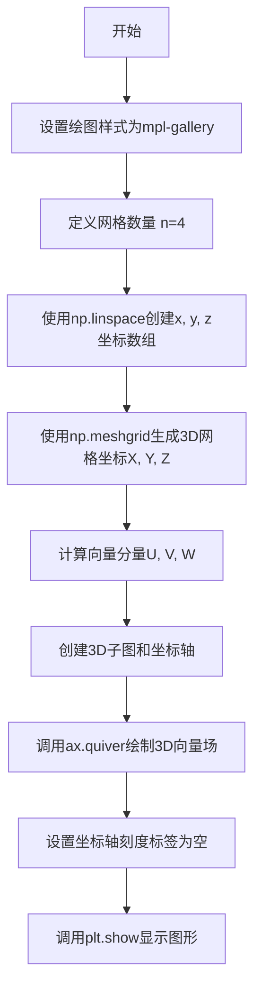
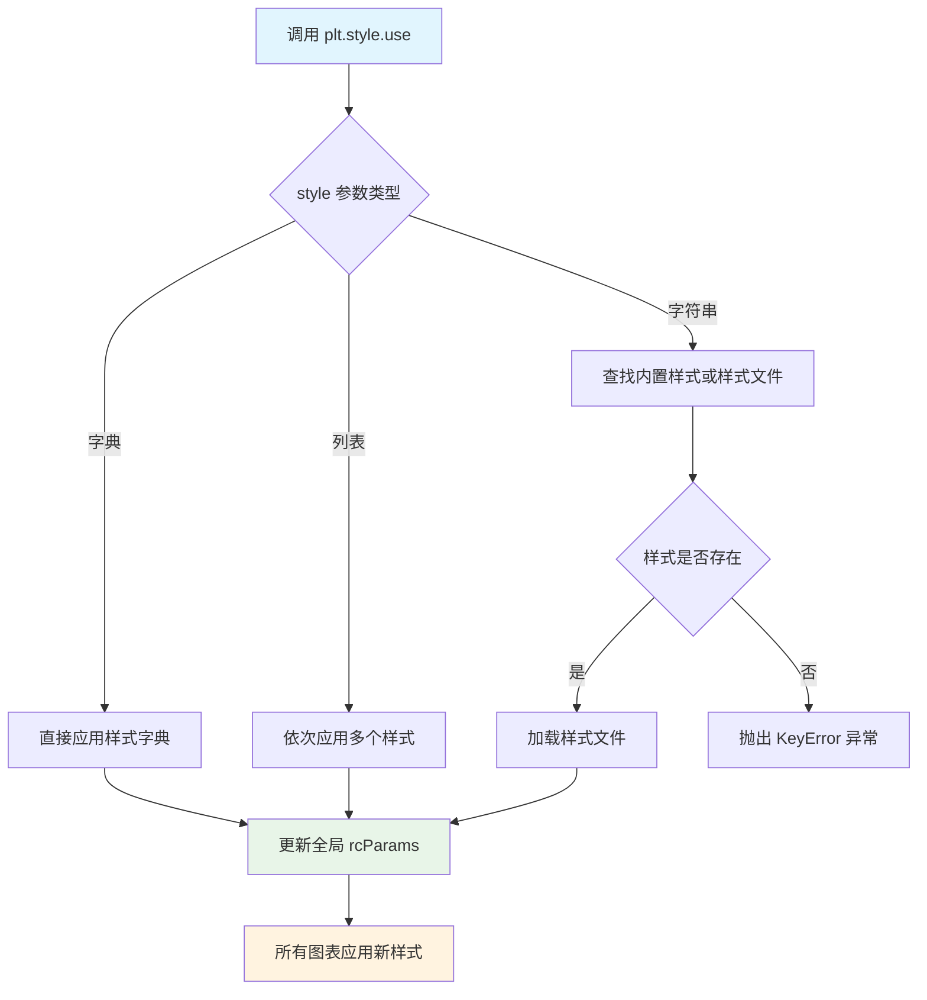
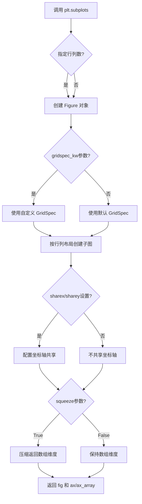
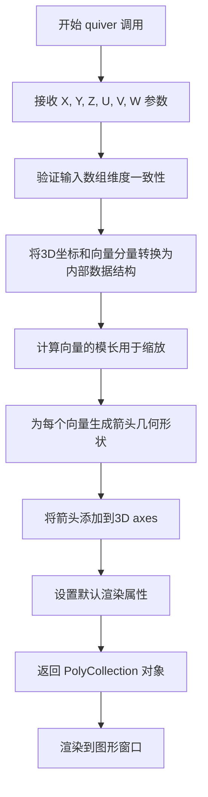
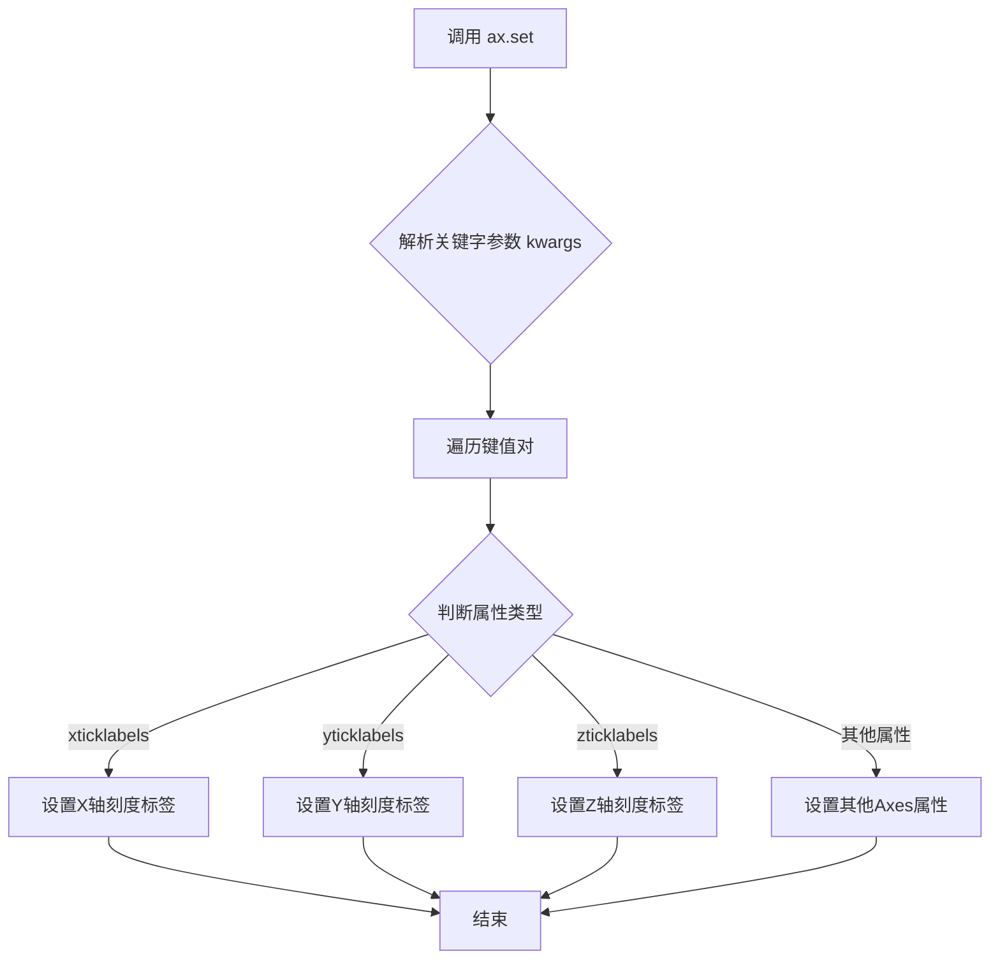
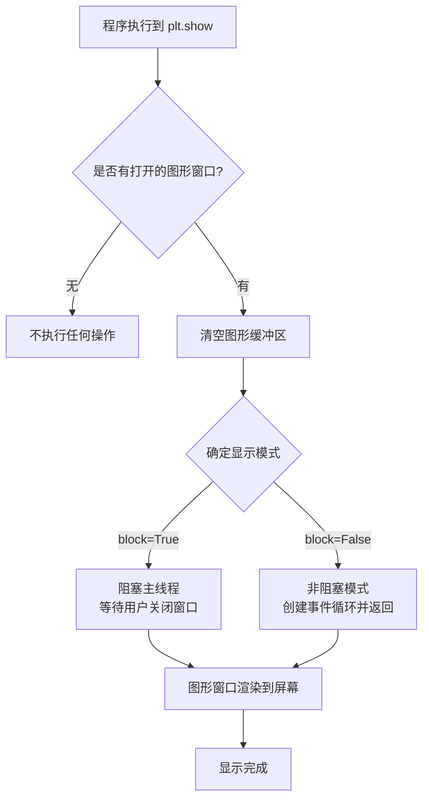

# `matplotlib\galleries\plot_types\3D\quiver3d_simple.py` 详细设计文档

该代码是一个使用matplotlib和numpy创建3D向量场（quiver plot）的可视化示例程序，通过生成网格数据和计算向量分量，在3D空间中展示向量箭头。

## 整体流程



## 类结构

```
Python脚本 (无面向对象结构)
├── 导入模块: matplotlib.pyplot, numpy
└── 主要流程: 数据准备 --> 图形创建 --> 绘图 --> 显示
```

## 全局变量及字段


### `n`
    
网格数量常量

类型：`int`
    


### `x`
    
x轴坐标数组

类型：`numpy.ndarray`
    


### `y`
    
y轴坐标数组

类型：`numpy.ndarray`
    


### `z`
    
z轴坐标数组

类型：`numpy.ndarray`
    


### `X`
    
3D网格x坐标

类型：`numpy.ndarray`
    


### `Y`
    
3D网格y坐标

类型：`numpy.ndarray`
    


### `Z`
    
3D网格z坐标

类型：`numpy.ndarray`
    


### `U`
    
向量x分量

类型：`numpy.ndarray`
    


### `V`
    
向量y分量

类型：`numpy.ndarray`
    


### `W`
    
向量z分量

类型：`numpy.ndarray`
    


### `fig`
    
图形对象

类型：`matplotlib.figure.Figure`
    


### `ax`
    
3D坐标轴对象

类型：`mpl_toolkits.mplot3d.axes3d.Axes3D`
    


    

## 全局函数及方法


### `numpy.linspace`

#### 描述

`numpy.linspace` 是 NumPy 库中的一个核心函数，用于在指定的间隔内生成等间距的数值序列（即数组）。在给定的代码中，它被用于生成 3D 坐标系的 x, y, z 轴的坐标向量。

#### 1. 文件的整体运行流程

该代码文件的主要功能是绘制一个 3D 向量场（Quiver Plot）。

1.  **数据准备阶段**：
    *   定义变量 `n = 4`。
    *   调用 `np.linspace(-1, 1, n)` 三次，分别生成 x, y, z 轴上 -1 到 1 之间的 4 个等间距点。
    *   使用 `np.meshgrid` 将这些一维坐标转换为三维网格坐标 `X, Y, Z`。
    *   根据公式计算向量分量 `U, V, W`。
2.  **绘图阶段**：
    *   创建画布 `fig` 和 3D 坐标轴 `ax`。
    *   调用 `ax.quiver(X, Y, Z, U, V, W)` 绘制向量箭头。
    *   隐藏坐标轴刻度标签。
3.  **展示阶段**：调用 `plt.show()` 显示图形。

#### 2. 类的详细信息（函数信息）

`numpy.linspace` 不是一个类，而是一个模块级函数（Module-level function）。

##### 全局变量与参数

- `start`：`array_like`。序列的起始值。在代码 `np.linspace(-1, 1, n)` 中为 `-1`。
- `stop`：`array_like`。序列的结束值。在代码 `np.linspace(-1, 1, n)` 中为 `1`。
- `num`：`int`（默认 50）。要生成的样本数量。在代码中为 `n`（值为 4）。
- `endpoint`：`bool`（默认 True）。如果为 True，则 `stop` 值包含在序列中（即步长为 `(stop-start)/(num-1)`）；否则不包含（步长为 `stop-start/num`）。
- `retstep`：`bool`（默认 False）。如果为 True，返回的数组会附带一个 `step`（步长）值。
- `dtype`：`dtype`（可选）。输出数组的数据类型。如果未指定，则从 `start` 和 `stop` 推断。
- `axis`：`int`（默认 0）。结果数组中存储样本的轴。仅当 `start` 或 `stop` 是数组形式时使用。

##### 返回值

- **`ndarray`**：如果 `retstep` 为 False（默认），返回一个包含 `num` 个样本的一维数组。
- **`tuple` of ndarrays**：如果 `retstep` 为 True，返回一个元组 `(samples, step)`，其中 `samples` 是样本数组，`step` 是样本之间的步长。

#### 3. 流程图

```mermaid
graph TD
    A[输入: start, stop, num] --> B{num <= 0?}
    B -- 是 --> C[抛出 ValueError]
    B -- 否 --> D[计算步长 step]
    D --> E{endpoint == True?}
    E -- 是 --> F[step = (stop - start) / (num - 1)]
    E -- 否 --> G[step = (stop - start) / num]
    F --> H[生成序列数组]
    G --> H
    H --> I{是否指定 dtype?}
    I -- 是 --> J[转换为指定 dtype]
    I -- 否 --> K[推断 dtype]
    J --> L{retstep == True?}
    K --> L
    L -- 是 --> M[返回: (数组, step)]
    L -- 否 --> N[返回: 数组]
```

#### 4. 带注释源码

以下是 `numpy.linspace` 的标准实现逻辑（基于 NumPy 源码 `numpy/core/function_base.py`）：

```python
import numpy as np

def linspace(start, stop, num=50, endpoint=True, retstep=False, dtype=None, axis=0):
    """
    在指定的间隔内返回均匀间隔的数字。
    
    参数:
        start: 序列的起始值。
        stop: 序列的结束值。
        num: 要生成的样本数（默认50）。
        endpoint: 如果为真，stop是最后一个样本（默认真）。
        retstep: 如果为真，返回('samples', step)，step是样本之间的间距。
    """
    # 1. 参数校验与类型处理
    if num <= 0:
        return np.empty(0, dtype=dtype) # 返回空数组
    
    # 2. 步长计算
    # 核心逻辑：根据是否包含终点来计算 step 大小
    if endpoint:
        # 包含终点：step = (stop - start) / (num - 1)
        # 例如：start=0, stop=1, num=3 -> [0, 0.5, 1], step=0.5
        step = (stop - start) / (num - 1)
    else:
        # 不包含终点：step = (stop - start) / num
        # 例如：start=0, stop=1, num=3 -> [0, 0.33, 0.66], step=0.33
        step = (stop - start) / num
        
    # 3. 生成数组
    # 利用广播机制和简单的加法生成序列
    # 序列 = start + step * arange(num)
    _arange = np.arange(num, dtype=dtype)
    
    # 注意：实际源码中会处理 dtype 推断和 array_like 的 start/stop
    # 这里简化展示核心生成逻辑
    y = _arange * step + start
    
    # 4. 返回处理
    if retstep:
        # 如果需要返回步长
        return y, step
    else:
        return y

# 示例用法 (对应代码中的调用)
# x = linspace(-1, 1, 4) => [-1. -0.33, 0.33, 1.]
```

#### 5. 关键组件信息

- **核心算法**：等差数列生成算法。通过 `start + step * index` 的方式利用 NumPy 的向量化操作高效生成数组，而非使用 Python 循环。
- **广播机制 (Broadcasting)**：支持 `start` 和 `stop` 为数组（此时会生成网格数组，配合 `axis` 参数使用），但在本例提供的代码片段中仅作为一维向量生成使用。

#### 6. 潜在的技术债务或优化空间

- **浮点精度**：在 `endpoint=False` 且 `num` 很大时，由于浮点数精度限制，最后一个点可能无法精确等于 `stop`。这是等间距采样的常见理论限制。
- **性能**：对于极大的 `num`（例如数百万），当前实现已经非常高效，但在极低端场景下可能不如编译后的 C 代码快（NumPy 源码即 C 实现）。

#### 7. 其它项目

- **设计约束**：`num` 必须为非负整数。如果 `num` 为 0，返回空数组。
- **错误处理**：如果 `num` 为负数，应抛出异常。
- **数据流**：输入标量或数组，经过步长计算和乘法运算，输出 NumPy ndarray。


### `np.meshgrid`

生成3D网格坐标，用于创建坐标数组以评估三维空间中的函数。

参数：

- `x`：`array_like`，第一个维度的一维数组
- `y`：`array_like`，第二个维度的一维数组
- `z`：`array_like`，第三个维度的一维数组
- `indexing`：`{'xy', 'ij'}`，可选，默认为'xy'，指定输出坐标系类型
- `sparse`：`bool`，可选，默认为False，是否返回稀疏矩阵
- `copy`：`bool`，可选，默认为False，是否返回副本

返回值：

- `X`：`ndarray`，三维坐标数组，第一个维度扩展
- `Y`：`ndarray`，三维坐标数组，第二个维度扩展
- `Z`：`ndarray`，三维坐标数组，第三个维度扩展

#### 流程图

```mermaid
flowchart TD
    A[开始] --> B[接收输入数组 x, y, z]
    B --> C{indexing='xy'?}
    C -->|Yes| D[使用笛卡尔坐标系<br/>X.shape = len(y)×len(x)×len(z)]
    C -->|No| E[使用矩阵坐标系<br/>X.shape = len(x)×len(y)×len(z)]
    D --> F[创建网格坐标数组]
    E --> F
    F --> G{稀疏模式?}
    G -->|Yes| H[返回稀疏矩阵]
    G -->|No| I[返回密集矩阵]
    H --> J{副本模式?}
    I --> J
    J -->|Yes| K[返回副本]
    J -->|No| L[返回视图]
    K --> M[结束: 返回 X, Y, Z]
    L --> M
```

#### 带注释源码

```python
# np.meshgrid 函数核心逻辑示例
# 以下为简化版实现原理说明

# 输入参数
# x = np.linspace(-1, 1, n)  # 例如: array([-1., -0.333, 0.333, 1.])
# y = np.linspace(-1, 1, n)  # 例如: array([-1., -0.333, 0.333, 1.])
# z = np.linspace(-1, 1, n)  # 例如: array([-1., -0.333, 0.333, 1.])

# 创建3D网格坐标
X, Y, Z = np.meshgrid(x, y, z)

# 实际执行过程:
# 1. X = np.meshgrid(x, y, z, indexing='xy')[0]
#    X 的形状为 (len(y), len(x), len(z))
#    X[i,j,k] = x[j]
#    
# 2. Y = np.meshgrid(x, y, z, indexing='xy')[1]
#    Y 的形状为 (len(y), len(x), len(z))
#    Y[i,j,k] = y[i]
#
# 3. Z = np.meshgrid(x, y, z, indexing='xy')[2]
#    Z 的形状为 (len(y), len(x), len(z))
#    Z[i,j,k] = z[k]

# 示例结果 (n=2):
# x = [0, 1], y = [0, 1], z = [0, 1]
# X = [[[0, 0], [1, 1]], [[0, 0], [1, 1]]]  # shape (2,2,2)
# Y = [[[0, 0], [0, 0]], [[1, 1], [1, 1]]]
# Z = [[[0, 1], [0, 1]], [[0, 1], [0, 1]]]

# 在示例代码中的使用:
# X, Y, Z = np.meshgrid(x, y, z)
# U = (X + Y)/5  # 基于网格计算U分量
# V = (Y - X)/5  # 基于网格计算V分量
# W = Z*0        # W分量为零
```


### `plt.style.use`

设置 matplotlib 的全局绘图样式，用于定义图表的外观主题，包括颜色、字体、线型等视觉元素。该函数允许用户通过样式名称、样式字典、样式文件路径或样式列表来切换不同的视觉主题。

参数：

- `style`：str / dict / Path / list，样式参数，可以是样式名称字符串（如 'ggplot'、'dark_background'）、样式字典、样式文件路径（.mplstyle 文件）或样式名称列表
- `name`（可选）：str，仅在使用上下文管理器时使用，指定样式的名称

返回值：`None`，无返回值，直接修改 matplotlib 的 rcParams 全局配置

#### 流程图



#### 带注释源码

```python
# matplotlib.pyplot.style.use 源码分析

def use(style, name=None):
    """
    设置 matplotlib 的全局样式/主题。
    
    参数:
        style: 样式参数，支持多种格式:
               - str: 样式名称如 'ggplot', 'dark_background', '_mpl-gallery'
               - dict: 直接传递 rcParams 字典
               - Path: .mplstyle 文件路径
               - list: 样式名称列表，从左到右依次应用
        name: 样式名称，用于上下文管理器模式
    """
    
    # 导入样式上下文管理器
    from matplotlib.style.core import _StyleLibrary
    
    # 处理样式参数（可能是列表、字符串或字典）
    if isinstance(style, str):
        # 单一样式名称：从样式库中查找
        style = _StyleLibrary[style]
    elif hasattr(style, 'resolve'):
        # Path 对象：加载样式文件
        style = style.resolve()
    elif isinstance(style, dict):
        # 字典：直接作为 rcParams 使用
        pass
    elif iterable(style) and not isinstance(style, str):
        # 列表：递归应用多个样式
        # 从第一个样式开始，逐步覆盖
        for s in style:
            use(s)
        return
    else:
        raise ValueError(f"样式必须是字符串、字典、路径或列表，而不是 {type(style)}")
    
    # 更新全局 rcParams
    # rcParams 是 matplotlib 的全局配置字典
    rcParams.update(style)
    
    # 如果在上下文中运行，记录样式名称
    if name is not None:
        _style_stack.append(name)
```

#### 使用示例（基于代码）

```python
import matplotlib.pyplot as plt
import numpy as np

# 使用 plt.style.use 设置绘图样式为 '_mpl-gallery'
# 这是一个内置的轻量级图表样式
plt.style.use('_mpl-gallery')

# 后续所有图表都会应用该样式
fig, ax = plt.subplots(subplot_kw={"projection": "3d"})
ax.quiver(X, Y, Z, U, V, W)

plt.show()
```

#### 关键技术细节

| 特性 | 说明 |
|------|------|
| 样式优先级 | 列表中后出现的样式会覆盖先前的同名参数 |
| 内置样式 | matplotlib 提供多种内置样式，如 ggplot、dark_background、seaborn 等 |
| 样式文件 | 用户可创建 .mplstyle 文件自定义样式 |
| 影响范围 | 修改全局 rcParams，影响后续所有图表 |
| 样式恢复 | 使用 `plt.style.reload_context()` 或 `plt.rcdefaults()` 恢复默认 |


### `plt.subplots`

`plt.subplots` 是 matplotlib 库中用于创建包含多个子图的图形和坐标轴的函数。它可以一次性创建指定行列数量的子图，并返回图形对象和坐标轴对象（可以是单个轴或轴数组），支持共享坐标轴、自定义布局比例等高级配置。

参数：

-  `nrows`：`int`，默认值为 1，表示子图的行数
-  `ncols`：`int`，默认值为 1，表示子图的列数
-  `sharex`：`bool` 或 `str`，默认值为 False，是否共享 x 轴，可选 'row'、'col' 或 'all'
-  `sharey`：`bool` 或 `str`，默认值为 False，是否共享 y 轴，可选 'row'、'col' 或 'all'
-  `squeeze`：`bool`，默认值为 True，是否压缩返回的轴数组维度
-  `width_ratios`：`array-like`，可选，定义每列的宽度比例
-  `height_ratios`：`array-like`，可选，定义每行的宽度比例
-  `subplot_kw`：`dict`，可选，传递给每个子图创建函数（如 `add_subplot`）的关键字参数
-  `gridspec_kw`：`dict`，可选，传递给 GridSpec 构造函数的关键字参数
-  `figsize`：`tuple`，可选，图形尺寸，格式为 (宽度, 高度)
-  `dpi`：`int`，可选，图形分辨率
-  `facecolor`：`str` 或 `tuple`，可选，图形背景色
-  `edgecolor`：`str` 或 `tuple`，可选，图形边框色

返回值：`tuple(fig, ax)` 或 `(fig, ax_array)` 或 `fig`，返回图形对象和坐标轴对象。当 `squeeze=False` 时，总是返回二维 NumPy 数组；当 `squeeze=True` 时：
- 如果只创建一个子图，返回单个 Axes 对象
- 如果创建多个子图，返回一维或二维数组
- 单行或单列情况返回一维数组

#### 流程图



#### 带注释源码

```python
# plt.subplots 是 matplotlib.pyplot 模块中的函数
# 以下为调用示例及参数说明

# 基本用法：创建 1 行 1 列的子图（相当于 plt.figure + plt.axes）
fig, ax = plt.subplots()

# 创建 2 行 2 列的子图，返回 2x2 的坐标轴数组
fig, axes = plt.subplots(nrows=2, ncols=2)

# 共享 x 轴，所有子图共享相同的 x 轴刻度
fig, axes = plt.subplots(nrows=2, ncols=2, sharex=True)

# 设置图形大小和分辨率
fig, ax = plt.subplots(figsize=(10, 6), dpi=100)

# 传入子图关键字参数，例如设置投影为 3D
fig, ax = plt.subplots(subplot_kw={"projection": "3d"})

# 设置行列宽度/高度比例
fig, axes = plt.subplots(nrows=2, ncols=2, 
                         width_ratios=[1, 2], 
                         height_ratios=[1, 2])

# squeeze=False 始终返回二维数组，即使只有 1 个子图
fig, axes = plt.subplots(squeeze=False)  # axes 总是二维数组
```


### `ax.quiver`

绘制3D向量箭头图（quiver plot），用于在三维空间中可视化向量场。该函数接受位置坐标(X, Y, Z)和对应的向量分量(U, V, W)，在三维坐标系中绘制表示向量方向和大小的箭头。

参数：

- `X`：`numpy.ndarray`，表示向量起点的x坐标，通常通过meshgrid生成
- `Y`：`numpy.ndarray`，表示向量起点的y坐标，通常通过meshgrid生成
- `Z`：`numpy.ndarray`，表示向量起点的z坐标，通常通过meshgrid生成
- `U`：`numpy.ndarray`，表示向量在x方向上的分量
- `V`：`numpy.ndarray`，表示向量在y方向上的分量
- `W`：`numpy.ndarray`，表示向量在z方向上的分量

返回值：`matplotlib.collections.PolyCollection`，返回创建的箭头集合对象，可用于进一步定制（如设置颜色、透明度等）

#### 流程图



#### 带注释源码

```python
"""
========================
quiver(X, Y, Z, U, V, W)
========================

See `~mpl_toolkits.mplot3d.axes3d.Axes3D.quiver`.
"""
# 导入matplotlib用于绘图
import matplotlib.pyplot as plt
# 导入numpy用于数值计算
import numpy as np

# 使用matplotlib内置样式
plt.style.use('_mpl-gallery')

# ========================================
# 数据准备阶段
# ========================================

# 定义采样点数量
n = 4
# 创建从-1到1的等间距采样点
x = np.linspace(-1, 1, n)
y = np.linspace(-1, 1, n)
z = np.linspace(-1, 1, n)

# 生成3D网格坐标 X, Y, Z
# meshgrid将1D数组转换为3D网格，用于向量化计算
X, Y, Z = np.meshgrid(x, y, z)

# 计算向量分量 U, V, W
# U = (X + Y)/5  表示x方向分量，与x和y坐标相关
# V = (Y - X)/5  表示y方向分量，与y和x坐标相关  
# W = Z*0        表示z方向分量，此处全为0（平面向量场）
U = (X + Y)/5
V = (Y - X)/5
W = Z*0

# ========================================
# 绘图阶段
# ========================================

# 创建图形和3D axes
fig, ax = plt.subplots(subplot_kw={"projection": "3d"})

# 调用quiver绘制3D向量箭头
# X, Y, Z: 箭头起点坐标
# U, V, W: 箭头方向和长度分量
ax.quiver(X, Y, Z, U, V, W)

# 设置坐标轴刻度标签为空列表（隐藏刻度标签）
ax.set(xticklabels=[],
       yticklabels=[],
       zticklabels=[])

# 显示图形
plt.show()
```

---

#### 关键组件信息

| 组件名称 | 一句话描述 |
|---------|-----------|
| `np.meshgrid` | 将一维坐标数组转换为三维网格坐标，用于向量化计算向量场 |
| `plt.subplots(subplot_kw={"projection": "3d"})` | 创建具有3D投影的matplotlib子图axes对象 |
| `PolyCollection` | quiver函数的返回值类型，包含所有箭头多边形的集合 |

#### 潜在技术债务与优化空间

1. **坐标轴标签隐藏**：代码中直接设置刻度标签为空数组，视觉上不够优雅，可考虑使用`ax.set_axis_off()`或自定义刻度格式
2. **硬编码参数**：采样点数`n=4`、向量缩放因子`/5`等参数硬编码，可提取为配置变量
3. **缺少颜色映射**：未根据向量模长设置颜色，可使用`cmap`参数增强可视化效果
4. **无错误处理**：缺少对输入数组维度匹配性的显式检查

#### 其他项目

- **设计目标**：演示matplotlib 3D quiver plot的基本用法，展示三维向量场的可视化
- **约束条件**：依赖matplotlib和numpy库，需要安装`mpl_toolkits.mplot3d`
- **数据流**：数据从numpy数组 → meshgrid网格化 → 向量计算 → quiver渲染
- **外部依赖**：
  - `matplotlib.pyplot`：绘图库
  - `numpy`：数值计算和数组操作
  - `mpl_toolkits.mplot3d`：3D绘图扩展（matplotlib内置）


### `ax.set`

`ax.set` 是 Matplotlib 中 Axes 类的核心方法，用于通过关键字参数批量设置坐标轴的多种属性（如标题、刻度标签、范围等），支持链式调用并返回 Axes 对象本身。

参数：

-  `**kwargs`：可变关键字参数，接受多个键值对来设置不同的 Axes 属性。在本代码中具体使用：
  - `xticklabels`：`list`，设置 x 轴刻度标签为空列表 `[]`
  - `yticklabels`：`list`，设置 y 轴刻度标签为空列表 `[]`
  - `zticklabels`：`list`，设置 z 轴刻度标签为空列表 `[]`

返回值：`matplotlib.axes.Axes`，返回 Axes 对象本身，支持链式调用

#### 流程图



#### 带注释源码

```python
# ax.set 方法的典型实现逻辑（简化版）
def set(self, **kwargs):
    """
    设置坐标轴的多个属性
    
    参数:
        **kwargs: 关键字参数，例如:
            - xticklabels: X轴刻度标签列表
            - yticklabels: Y轴刻度标签列表  
            - zticklabels: Z轴刻度标签列表
            - xlim, ylim, zlim: 坐标轴范围
            - xlabel, ylabel, zlabel: 坐标轴标签
            - title: 图表标题等
    
    返回:
        Axes: 返回自身，支持链式调用
    """
    
    # 遍历所有传入的关键字参数
    for attr, value in kwargs.items():
        
        # 处理刻度标签设置
        if attr == 'xticklabels':
            # 设置X轴刻度标签为空列表（隐藏刻度标签）
            self.set_xticklabels(value)
            
        elif attr == 'yticklabels':
            # 设置Y轴刻度标签为空列表
            self.set_yticklabels(value)
            
        elif attr == 'zticklabels':
            # 设置Z轴刻度标签为空列表（3D图表专用）
            self.set_zticklabels(value)
            
        # 处理其他属性（如xlabel, title等）
        else:
            # 通过setter方法或直接设置属性
            setter_method = f'set_{attr}'
            if hasattr(self, setter_method):
                getattr(self, setter_method)(value)
            else:
                setattr(self, attr, value)
    
    # 返回Axes对象本身，支持链式调用如 ax.set(...).set(...)
    return self


# 在代码中的实际调用示例：
ax.set(xticklabels=[],
       yticklabels=[],
       zticklabels=[])
```


### `plt.show`

`plt.show()` 是 Matplotlib 库中的一个核心函数，用于显示当前已创建的所有图形窗口，并将图形渲染到屏幕上。在图形显示之前，所有之前的绘图命令（如 `plot()`、`quiver()` 等）积累在缓冲区中，`show()` 函数将这些命令执行并呈现给用户。

参数：

-  `block`：`bool`，可选参数，默认为 `None`。如果设置为 `True`，则显示窗口时会阻塞主程序执行，直到用户关闭窗口；如果设置为 `False`，则非阻塞显示；在某些交互式环境（如 Jupyter Notebook）下会有特殊行为。

返回值：`None`，该函数不返回任何值，仅用于图形展示的副作用。

#### 流程图



#### 带注释源码

```python
def show(*, block=None):
    """
    显示所有打开的图形窗口。
    
    参数:
        block (bool, optional): 
            控制是否阻塞程序执行。
            - True: 阻塞直到用户关闭窗口
            - False: 非阻塞模式
            - None: 默认值，行为取决于运行环境
    
    返回值:
        None
    
    注意:
        在调用 show() 之前，所有绘图命令（如 plot, quiver 等）
        会在内存中累积，不会立即显示。show() 会将这些绘图命令
        实际渲染到窗口中。
    """
    # 获取全局显示管理器
    _backend_mod = new_figure_manager()
    
    # 如果 block 参数未指定，根据环境判断
    if block is None:
        # 在交互式解释器中通常不阻塞
        # 在脚本中通常阻塞
        block = _in_interactive_script()
    
    # 根据 block 参数决定是否阻塞
    if block:
        # 进入主事件循环，阻塞当前线程
        # 用户必须关闭窗口才能继续执行
        _backend_mod.show_block()
    else:
        # 非阻塞模式，短暂显示后返回
        # 图形窗口会保持打开但程序继续执行
        _backend_mod.show_non_block()
    
    # 关闭所有图形的显示资源（可选）
    # 在某些后端会清理临时文件或内存
    return None
```

---

## 补充说明

### 设计目标与约束

- **目标**：提供统一的图形显示接口，屏蔽不同后端（Qt、TkAgg、MacOSX 等）的差异
- **约束**：必须在所有绘图命令执行完成后调用，否则图形不会显示

### 错误处理与异常设计

- 如果没有可显示的图形，函数静默返回，不抛异常
- 如果图形后端未正确安装，会抛出 `RuntimeError: No available backend`

### 外部依赖与接口契约

- 依赖 `matplotlib.backends` 模块
- 契约：调用前需确保已创建至少一个图形（通过 `plt.figure()` 或 `plt.subplots()`）

### 潜在的技术债务与优化空间

1. **阻塞行为不一致**：在不同操作系统和后端下 `block=None` 的行为可能不同，导致跨平台问题
2. **事件循环管理**：在某些 IDE（如 Spyder）中多次调用 `show()` 可能导致事件循环问题
3. **资源清理**：缺少显式的图形窗口资源清理机制，可能导致内存泄漏


## 关键组件


### 张量网格生成 (np.meshgrid)

使用np.meshgrid将一维坐标数组x, y, z转换为三维网格坐标X, Y, Z，用于表示3D空间中的格点。

### 向量场计算 (U, V, W)

基于网格坐标计算三个方向的速度分量：U=(X+Y)/5, V=(Y-X)/5, W=Z*0，形成一个简单的旋转对称向量场。

### 3D箭头图绘制 (ax.quiver)

调用matplotlib的Axes3D.quiver方法，将向量场可视化绘制为3D空间中的箭头，表示每个格点处的向量方向和大小。

### 坐标轴标签配置 (set)

通过set方法将x、y、z轴的刻度标签设置为空列表，隐藏默认刻度标签以获得更清晰的视觉效果。


## 问题及建议


### 已知问题

- **缺乏错误处理**：代码未对输入数据进行验证（如 n 是否为正整数、数据是否为空等），可能导致运行时错误
- **硬编码的魔法数字**：n=4、/5 等数值直接写死，缺乏可配置性，降低了代码的通用性
- **重复代码模式**：xticklabels、yticklabels、zticklabels 设置逻辑重复，可封装为循环或统一方法
- **数据生成效率**：meshgrid 可能生成超出实际需求的网格数据，未考虑性能优化
- **坐标轴标签处理方式不当**：使用空列表 [] 清除标签不是最佳实践，可能影响交互功能
- **无文档注释**：代码缺乏对参数含义、计算逻辑、预期输出等关键信息的说明
- **无函数/类封装**：代码以脚本形式存在，未封装为可复用的函数，难以集成到更大项目中

### 优化建议

- 将数据生成和绘图逻辑封装为函数，接收 n、坐标范围等参数以提高复用性
- 使用配置对象或参数化方式替代魔法数字，增强代码可维护性
- 添加输入数据验证逻辑，确保数据有效性后再进行绘图
- 使用 ax.set_axis_off() 或 ax.axis('off') 替代空标签列表来隐藏坐标轴
- 增加类型注解和详细的 docstring，提升代码可读性和可维护性
- 考虑使用 np.zeros_like(z) 替代 Z*0 以提高代码清晰度

## 其它


### 设计目标与约束

本代码的核心设计目标是可视化一个三维向量场，通过quiver函数展示向量(X+Y)/5、(Y-X)/5和Z*0在三维空间中的分布。设计约束包括：使用matplotlib作为唯一的可视化依赖，数据范围限制在[-1,1]的立方体内，向量计算采用简单的线性组合且W分量恒为零。

### 错误处理与异常设计

本代码为脚本式演示程序，未实现显式的错误处理机制。潜在的异常场景包括：numpy数据生成过程中的内存溢出、matplotlib图形窗口创建失败、3D投影不支持的旧版本兼容问题。改进建议：添加try-except块捕获数据生成和绘图异常，对非法输入值进行校验，版本检查确保matplotlib支持3D绘图。

### 数据流与状态机

数据流分为三个阶段：初始化阶段创建网格坐标(X,Y,Z)，计算阶段生成向量分量(U,V,W)，渲染阶段调用ax.quiver()进行可视化。状态机转换路径为：IDLE → DATA_GENERATION → VECTOR_COMPUTATION → RENDERING → DISPLAY → TERMINATED。各阶段无回退或分支选择，属于线性流程。

### 外部依赖与接口契约

代码依赖两个外部包：matplotlib.pyplot提供绘图API，numpy提供数值计算能力。关键接口契约包括：np.meshgrid返回三个三维数组，plt.subplots的subplot_kw参数指定3D投影类型，ax.quiver接收六个相同形状的数组参数(X,Y,Z,U,V,W)。版本要求：matplotlib需支持3D axes，numpy需支持meshgrid函数。

### 关键组件信息

关键组件包括：np.meshgrid用于生成三维网格坐标，ax.quiver是核心3D向量绘制方法，plt.style.use设置无样式的简约外观。meshgrid生成广播后的三维坐标数组，quiver内部调用WireframePatch3D或类似3D Artist进行渲染。

### 潜在的技术债务或优化空间

当前代码存在以下技术债务：硬编码的网格大小n=4和坐标范围[-1,1]缺乏可配置性；向量计算逻辑(W=Z*0)产生全零场无实际意义；坐标轴标签手动置空而非使用内置方法；未保存图形到文件；缺少类型注解和文档字符串；未使用面向对象封装而是过程式编程。优化方向：参数化配置、添加类型提示、封装为可复用的函数或类、支持输出到文件。

### 配置与可扩展性设计

当前代码缺少配置管理层，硬编码值分散。改进方案：引入配置类或配置文件管理n值、坐标范围、图形尺寸等参数；添加输出路径配置支持保存为PNG/SVG；预留数据源接口支持从文件或API加载向量数据；设计插件机制允许自定义向量计算函数。


    