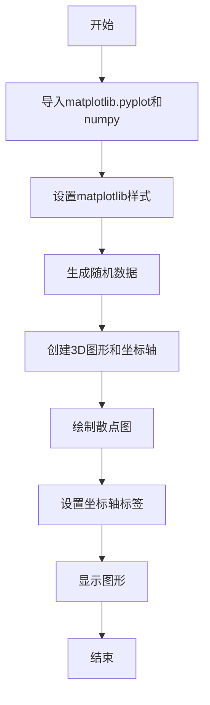
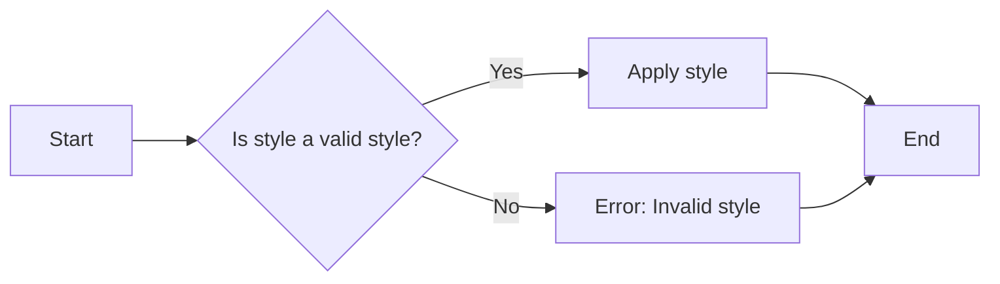
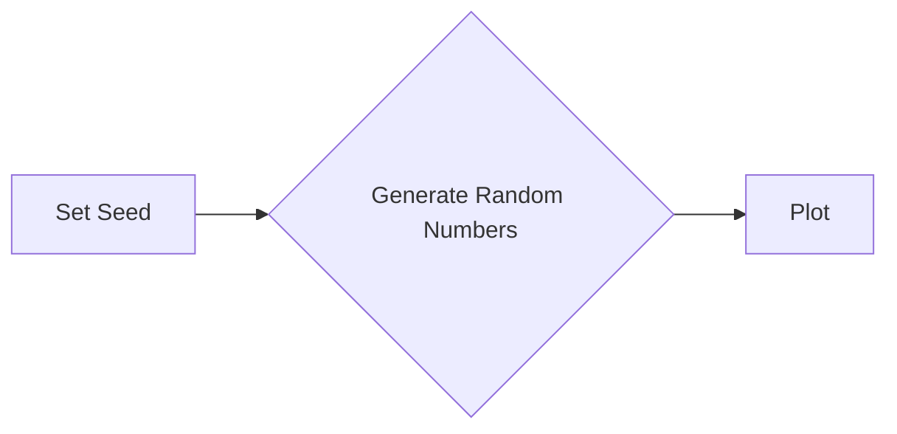
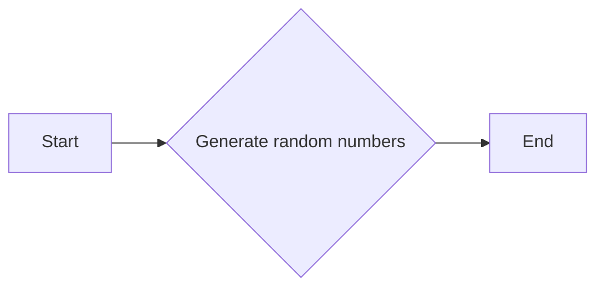
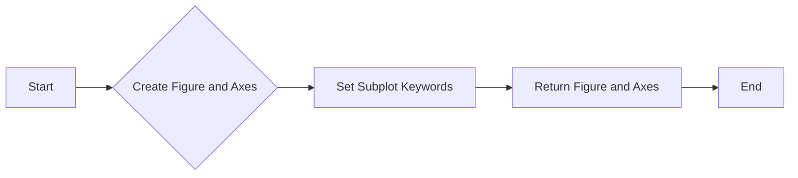
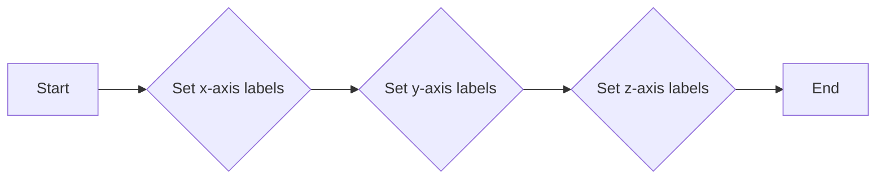
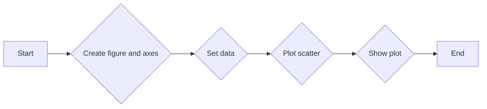

# `matplotlib\galleries\plot_types\3D\scatter3d_simple.py` 详细设计文档

This code generates a 3D scatter plot using matplotlib and numpy, plotting random data points in three dimensions.

## 整体流程



## 类结构

```
scatter(xs, ys, zs)
```

## 全局变量及字段


### `fig`
    
The main figure object containing the plot.

类型：`matplotlib.figure.Figure`
    


### `ax`
    
The 3D subplot object where the scatter plot is drawn.

类型：`matplotlib.axes._subplots.Axes3DSubplot`
    


### `n`
    
The number of points to generate for the scatter plot.

类型：`int`
    


### `rng`
    
The random number generator used to create the data points.

类型：`numpy.random.Generator`
    


### `xs`
    
The x-coordinates of the scatter plot points.

类型：`numpy.ndarray`
    


### `ys`
    
The y-coordinates of the scatter plot points.

类型：`numpy.ndarray`
    


### `zs`
    
The z-coordinates of the scatter plot points.

类型：`numpy.ndarray`
    


### `scatter.scatter.xs`
    
The x-coordinates of the scatter plot points.

类型：`numpy.ndarray`
    


### `scatter.scatter.ys`
    
The y-coordinates of the scatter plot points.

类型：`numpy.ndarray`
    


### `scatter.scatter.zs`
    
The z-coordinates of the scatter plot points.

类型：`numpy.ndarray`
    
    

## 全局函数及方法


### plt.style.use

`plt.style.use` 是一个全局函数，用于设置 Matplotlib 的样式。

参数：

- `style`：`str`，指定要使用的样式名称。

返回值：无

#### 流程图



#### 带注释源码

```python
"""
Set the style of the matplotlib plots.

Parameters:
    style: str
        The name of the style to use.

Returns:
    None
"""
import matplotlib.pyplot as plt

def plt_style_use(style):
    plt.style.use(style)
```


### np.random.seed

设置NumPy随机数生成器的种子，确保每次生成的随机数序列相同。

参数：

- `seed`：`int`，用于初始化随机数生成器的种子值。

返回值：`None`，该函数没有返回值。

#### 流程图



#### 带注释源码

```python
# 设置随机数生成器的种子
np.random.seed(19680801)
```


### np.random.uniform

`np.random.uniform` 是一个全局函数，用于生成指定范围内的均匀分布的随机浮点数。

参数：

- `low`：`float`，随机数的下限（包含）。
- `high`：`float`，随机数的上限（包含）。
- `size`：`int` 或 `tuple`，生成随机数的数量或形状。

返回值：`numpy.ndarray`，包含生成的随机浮点数。

#### 流程图



#### 带注释源码

```python
import numpy as np

# np.random.seed(19680801)  # 设置随机数种子，确保结果可复现
n = 100  # 需要生成的随机数的数量
rng = np.random.default_rng()  # 创建一个随机数生成器实例
xs = rng.uniform(23, 32, n)  # 生成23到32之间的均匀分布的随机浮点数，数量为n
ys = rng.uniform(0, 100, n)  # 生成0到100之间的均匀分布的随机浮点数，数量为n
zs = rng.uniform(-50, -25, n)  # 生成-50到-25之间的均匀分布的随机浮点数，数量为n
```


### plt.subplots

`plt.subplots` 是一个用于创建一个或多个子图的函数。

参数：

- `subplot_kw`：`dict`，关键字参数字典，用于传递给 `Axes` 对象的构造函数。
- ...

返回值：`fig, ax`，`fig` 是 `Figure` 对象，`ax` 是 `Axes` 对象。

#### 流程图



#### 带注释源码

```python
"""
===================
scatter(xs, ys, zs)
===================

See `~mpl_toolkits.mplot3d.axes3d.Axes3D.scatter`.
"""
import matplotlib.pyplot as plt
import numpy as np

plt.style.use('_mpl-gallery')

# Make data
np.random.seed(19680801)
n = 100
rng = np.random.default_rng()
xs = rng.uniform(23, 32, n)
ys = rng.uniform(0, 100, n)
zs = rng.uniform(-50, -25, n)

# Plot
fig, ax = plt.subplots(subplot_kw={"projection": "3d"})
ax.scatter(xs, ys, zs)

ax.set(xticklabels=[],
       yticklabels=[],
       zticklabels=[])

plt.show()
```


### ax.scatter

该函数用于在3D坐标系中绘制散点图。

参数：

- `xs`：`numpy.ndarray`，x坐标数组，表示散点在x轴上的位置。
- `ys`：`numpy.ndarray`，y坐标数组，表示散点在y轴上的位置。
- `zs`：`numpy.ndarray`，z坐标数组，表示散点在z轴上的位置。

返回值：无，该函数直接在当前轴（Axes）上绘制散点图。

#### 流程图

```mermaid
graph LR
A[Start] --> B{Call ax.scatter(xs, ys, zs)}
B --> C[End]
```

#### 带注释源码

```python
"""
scatter(xs, ys, zs)
===================

See `~mpl_toolkits.mplot3d.axes3d.Axes3D.scatter`.
"""
import matplotlib.pyplot as plt
import numpy as np

plt.style.use('_mpl-gallery')

# Make data
np.random.seed(19680801)
n = 100
rng = np.random.default_rng()
xs = rng.uniform(23, 32, n)
ys = rng.uniform(0, 100, n)
zs = rng.uniform(-50, -25, n)

# Plot
fig, ax = plt.subplots(subplot_kw={"projection": "3d"})
ax.scatter(xs, ys, zs)  # Draw scatter plot
ax.set(xticklabels=[], yticklabels=[], zticklabels=[])  # Set no labels for axes
plt.show()  # Display the plot
```


### ax.set

`ax.set` 是一个用于设置matplotlib中3D散点图轴标签的函数。

参数：

- `xticklabels`：`list`，用于设置x轴的标签列表。默认为空列表，不显示x轴标签。
- `yticklabels`：`list`，用于设置y轴的标签列表。默认为空列表，不显示y轴标签。
- `zticklabels`：`list`，用于设置z轴的标签列表。默认为空列表，不显示z轴标签。

返回值：`None`，该函数没有返回值。

#### 流程图



#### 带注释源码

```python
ax.set(xticklabels=[], yticklabels=[], zticklabels=[])
```


### plt.show()

显示当前图形。

参数：

- 无

返回值：无

#### 流程图

```mermaid
graph LR
A[开始] --> B{调用plt.show()}
B --> C[结束]
```

#### 带注释源码

```
plt.show()
```


### scatter(xs, ys, zs)

该函数用于在3D坐标系中绘制散点图，其中xs、ys和zs分别代表x、y和z轴的数据点。

参数：

- `xs`：`numpy.ndarray`，x轴的数据点
- `ys`：`numpy.ndarray`，y轴的数据点
- `zs`：`numpy.ndarray`，z轴的数据点

返回值：`None`，该函数不返回任何值，它直接在图形界面上显示散点图

#### 流程图



#### 带注释源码

```python
"""
===================
scatter(xs, ys, zs)
===================

See `~mpl_toolkits.mplot3d.axes3d.Axes3D.scatter`.
"""
import matplotlib.pyplot as plt
import numpy as np

plt.style.use('_mpl-gallery')

# Make data
np.random.seed(19680801)
n = 100
rng = np.random.default_rng()
xs = rng.uniform(23, 32, n)
ys = rng.uniform(0, 100, n)
zs = rng.uniform(-50, -25, n)

# Plot
fig, ax = plt.subplots(subplot_kw={"projection": "3d"})
ax.scatter(xs, ys, zs)

ax.set(xticklabels=[], yticklabels=[], zticklabels=[])
plt.show()
```


## 关键组件


### 张量索引

张量索引用于在多维数组中定位和访问特定元素。

### 惰性加载

惰性加载是一种延迟计算或资源分配的策略，直到实际需要时才进行。

### 反量化支持

反量化支持允许在代码中动态地调整量化参数，以适应不同的量化需求。

### 量化策略

量化策略定义了如何将浮点数转换为固定点数，以减少计算资源的使用。


## 问题及建议


### 已知问题

-   {问题1}：代码中使用了硬编码的随机种子和数值范围，这可能导致可重复性问题和数据分布的局限性。
-   {问题2}：代码没有提供任何错误处理机制，如果matplotlib库不可用或发生其他异常，程序可能会崩溃。
-   {问题3}：代码没有提供任何用户输入或配置选项，这限制了代码的灵活性和可定制性。
-   {问题4}：代码没有提供任何注释或文档，这降低了代码的可读性和可维护性。

### 优化建议

-   {建议1}：移除硬编码的随机种子和数值范围，允许用户指定这些参数，以提高代码的可重复性和灵活性。
-   {建议2}：添加异常处理机制，确保在matplotlib库不可用或其他异常发生时，程序能够优雅地处理错误。
-   {建议3}：提供用户输入或配置选项，允许用户自定义数据生成和绘图参数，以增加代码的适用性和可定制性。
-   {建议4}：添加注释和文档，解释代码的功能、方法和参数，以提高代码的可读性和可维护性。
-   {建议5}：考虑使用更高级的绘图选项，如自定义颜色、标记和线型，以增强图表的视觉效果和信息的传达。
-   {建议6}：如果代码是库的一部分，考虑添加单元测试以确保代码的稳定性和可靠性。
-   {建议7}：如果代码用于生产环境，考虑添加日志记录功能以跟踪程序执行和潜在的问题。


## 其它


### 设计目标与约束

- 设计目标：实现一个3D散点图绘制功能，用于可视化三维空间中的数据点。
- 约束条件：使用matplotlib库进行绘图，不使用额外的第三方库。

### 错误处理与异常设计

- 错误处理：代码中未包含显式的错误处理机制，但应确保输入数据类型正确，避免运行时错误。
- 异常设计：未定义特定的异常类，但应捕获并处理matplotlib绘图过程中可能出现的异常。

### 数据流与状态机

- 数据流：数据通过随机数生成器生成，然后传递给matplotlib的scatter函数进行绘图。
- 状态机：代码执行过程中没有状态变化，属于单线程执行流程。

### 外部依赖与接口契约

- 外部依赖：代码依赖于matplotlib和numpy库。
- 接口契约：matplotlib的scatter函数用于绘制散点图，其接口契约由matplotlib库定义。

### 测试与验证

- 测试策略：应编写单元测试来验证散点图绘制的正确性，包括数据类型、绘图范围等。
- 验证方法：通过可视化检查绘制的散点图是否符合预期。

### 性能考量

- 性能指标：绘制散点图的时间复杂度主要取决于数据点的数量。
- 性能优化：对于大量数据点，可以考虑使用更高效的绘图方法或优化数据结构。

### 安全性与隐私

- 安全性：代码本身不涉及安全性问题，但应确保使用的数据来源安全可靠。
- 隐私：代码不处理任何个人或敏感数据。

### 可维护性与可扩展性

- 可维护性：代码结构清晰，易于理解和维护。
- 可扩展性：可以通过添加新的数据生成方法或绘图选项来扩展功能。

### 文档与注释

- 文档：提供详细的设计文档和代码注释，以便其他开发者理解和使用。
- 注释：代码中应包含必要的注释，解释关键代码段的功能和目的。

### 用户界面与交互

- 用户界面：代码不提供用户界面，通过命令行执行。
- 交互：用户可以通过修改输入参数来调整散点图的数据和外观。

### 部署与分发

- 部署：代码可以通过打包成可执行文件或模块进行部署。
- 分发：代码可以通过版本控制系统或打包工具进行分发。


    