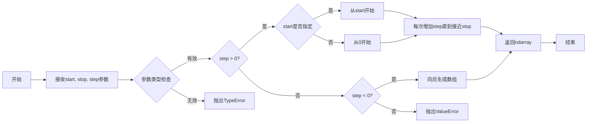
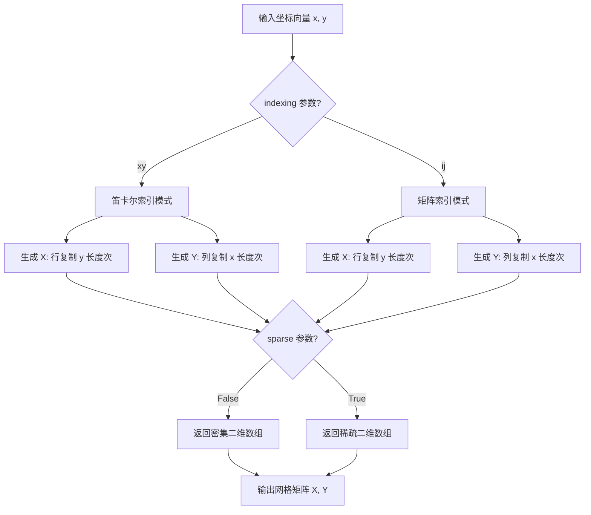
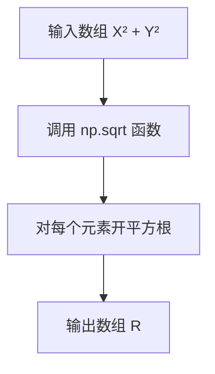
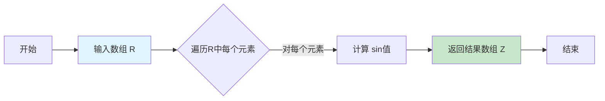
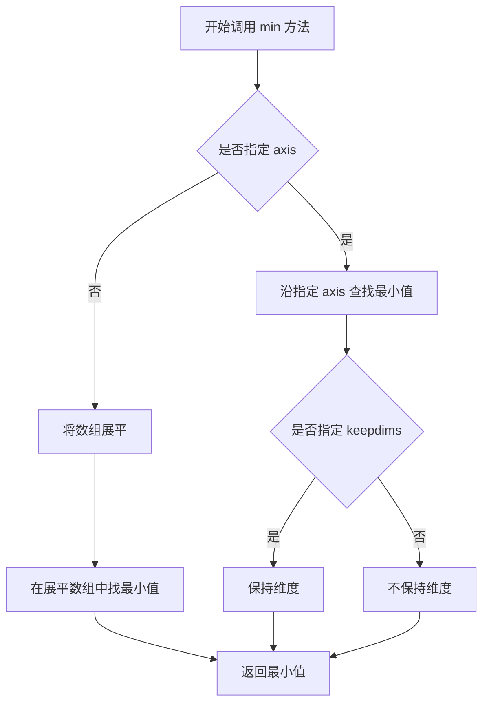
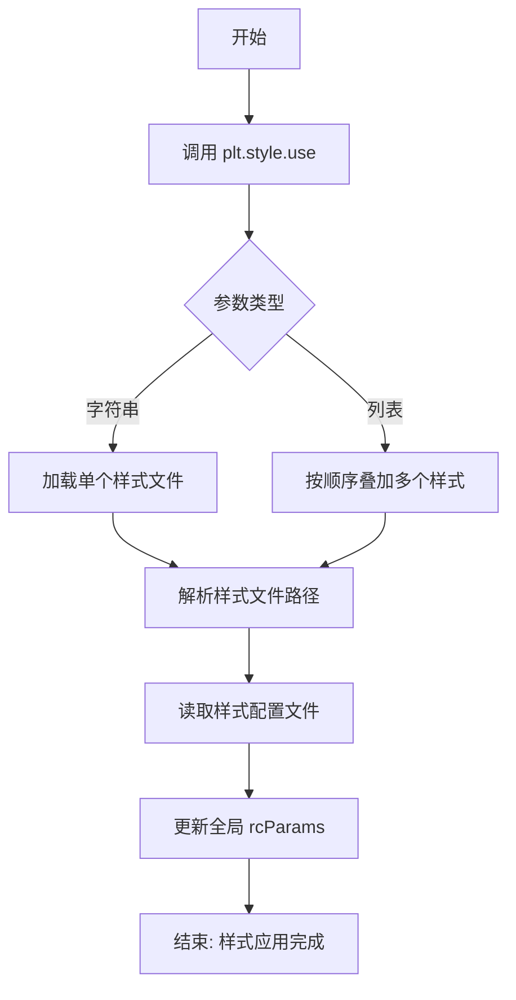
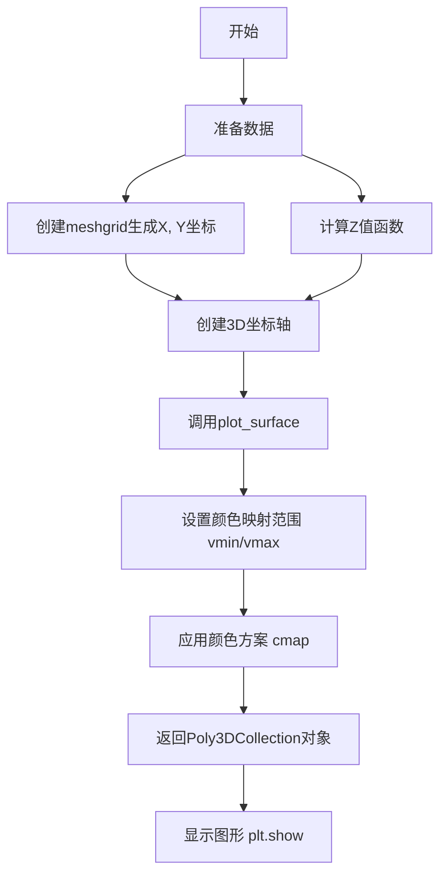
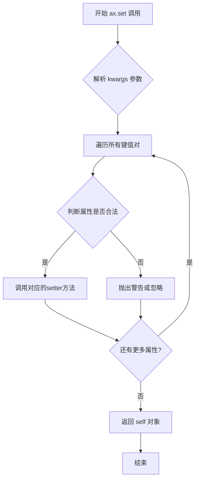
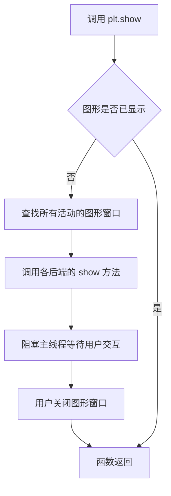

# `matplotlib\galleries\plot_types\3D\surface3d_simple.py` 详细设计文档

该脚本使用matplotlib和numpy生成一个3D表面图，展示sin(R)的视觉效果，其中R是坐标点到原点的欧氏距离，通过meshgrid创建网格并使用plot_surface绘制3D表面。

## 整体流程

```mermaid
graph TD
    A[开始] --> B[导入依赖库]
    B --> C[设置matplotlib样式为mpl-gallery]
    C --> D[生成X轴数据: np.arange(-5, 5, 0.25)]
    D --> E[生成Y轴数据: np.arange(-5, 5, 0.25)]
    E --> F[创建网格: np.meshgrid(X, Y)]
    F --> G[计算距离R = sqrt(X^2 + Y^2)]
    G --> H[计算Z值: Z = sin(R)]
    H --> I[创建3D坐标轴: plt.subplots(subplot_kw={projection: 3d})]
    I --> J[绘制表面图: ax.plot_surface]
    J --> K[设置坐标轴标签为空]
    K --> L[显示图形: plt.show]
```

## 类结构

```
该脚本为脚本式Python代码，无面向对象结构
所有操作均为过程式调用
```

## 全局变量及字段


### `X`
    
X轴坐标数组

类型：`ndarray`
    


### `Y`
    
Y轴坐标数组

类型：`ndarray`
    


### `R`
    
到原点距离的网格数组

类型：`ndarray`
    


### `Z`
    
sin(R)的计算结果数组

类型：`ndarray`
    


### `fig`
    
matplotlib图形对象

类型：`Figure`
    


### `ax`
    
3D坐标轴对象

类型：`Axes3D`
    


    

## 全局函数及方法


### `np.arange`

`np.arange` 是 NumPy 库中的一个函数，用于生成等差数组（arange 是 "array range" 的缩写）。该函数接受起始值、结束值和步长作为参数，返回一个包含等差数列的 NumPy 数组。

参数：

- `start`：`int` 或 `float`，起始值（包含），默认为 0
- `stop`：`int` 或 `float`，结束值（不包含）
- `step`：`int` 或 `float`，步长，默认为 1

返回值：`numpy.ndarray`，包含等差数列的 NumPy 数组

#### 流程图



#### 带注释源码

```python
# np.arange 是 NumPy 库中的函数，用于生成等差数组
# 在本代码中的调用方式：
X = np.arange(-5, 5, 0.25)
Y = np.arange(-5, 5, 0.25)

# 参数说明：
# 第一个参数 -5: start，起始值（包含）
# 第二个参数 5: stop，结束值（不包含）
# 第三个参数 0.25: step，步长
# 
# 生成的数组将包含从 -5 开始，以 0.25 为步长，
# 一直增加到但不包括 5 的值
# 例如：[-5.0, -4.75, -4.5, -4.25, ..., 4.75]
# 
# 返回值类型：numpy.ndarray
# 返回值描述：包含等差数列的一维数组
```


### `np.meshgrid`

从坐标向量创建网格矩阵，用于生成坐标矩阵，以便对向量化函数进行求值。

**注意**：提供的代码是 `np.meshgrid` 的使用示例，而非其底层实现源码。以下信息基于 NumPy 官方文档和代码使用场景提取。

#### 参数

- `x`：`array_like`，一维数组，表示第一个维度的坐标向量
- `y`：`array_like`，一维数组，表示第二个维度的坐标向量
- `indexing`：`{'xy', 'ij'}`，可选，默认 `'xy'`，索引模式（'xy' 为笛卡尔坐标系，'ij' 为矩阵索引）
- `sparse`：`bool`，可选，默认 `False`，是否返回稀疏矩阵
- `copy`：`bool`，可选，默认 `False`，是否返回副本

#### 返回值

- `X`：`ndarray`，二维数组（当 `sparse=False` 时），第一个维度为 `y` 的长度，第二个维度为 `x` 的长度
- `Y`：`ndarray`，二维数组（当 `sparse=False` 时），第一个维度为 `y` 的长度，第二个维度为 `x` 的长度

#### 流程图



#### 带注释源码

```python
"""
=====================
plot_surface(X, Y, Z)
=====================

See `~mpl_toolkits.mplot3d.axes3d.Axes3D.plot_surface`.
"""
# 导入必要的库：matplotlib用于绘图，numpy用于数值计算
import matplotlib.pyplot as plt
import numpy as np

# 使用matplotlib的内置样式
plt.style.use('_mpl-gallery')

# ============================================
# 创建数据 - 演示 np.meshgrid 的使用
# ============================================

# 生成一维坐标向量（x轴）
# 从-5到5（不包含5），步长0.25
X = np.arange(-5, 5, 0.25)

# 生成一维坐标向量（y轴）
# 从-5到5（不包含5），步长0.25
Y = np.arange(-5, 5, 0.25)

# 核心函数：np.meshgrid
# 从两个一维坐标向量创建二维网格矩阵
# 输入：两个一维数组
# 输出：两个二维数组 X 和 Y
# X 的每一行是 x 向量，Y 的每一列是 y 向量
X, Y = np.meshgrid(X, Y)

# 计算每个点到原点的距离 R = sqrt(x^2 + y^2)
R = np.sqrt(X**2 + Y**2)

# 基于距离计算Z值（使用正弦函数）
Z = np.sin(R)

# ============================================
# 绘制3D表面图
# ============================================

# 创建图形和3D坐标轴
fig, ax = plt.subplots(subplot_kw={"projection": "3d"})

# 绘制表面图
# 参数：X, Y, Z为网格数据，vmin/vmax控制颜色映射范围，cmap指定颜色方案
ax.plot_surface(X, Y, Z, vmin=Z.min() * 2, cmap="Blues")

# 设置刻度标签为空
ax.set(xticklabels=[],
       yticklabels=[],
       zticklabels=[])

# 显示图形
plt.show()
```

---

### 关键组件信息

| 组件名称 | 一句话描述 |
|---------|-----------|
| `np.arange` | 生成一维等差数组的函数 |
| `np.meshgrid` | 从坐标向量创建网格矩阵的核心函数 |
| `np.sqrt` | 计算数组元素的平方根 |
| `ax.plot_surface` | 在3D坐标轴上绘制表面图 |

### 潜在技术债务或优化空间

1. **步长选择**：`0.25` 的步长可能导致数据点过多（40x40=1600个点），在数据量大时可考虑使用 `sparse=True` 参数减少内存占用
2. **性能优化**：对于更大的网格，可考虑使用向量化操作替代 `meshgrid`，或使用 `np.ogrid` / `np.mgrid` 获得更高效的稀疏网格
3. **缺乏错误处理**：未对输入数据进行有效性验证（如检查是否为数值类型、是否有NaN值等）

### 其它项目

**设计目标与约束**：
- 目标：创建可用于3D可视化的网格数据
- 约束：输入必须是一维数组，输出为二维网格

**错误处理与异常设计**：
- 建议在生产环境中添加输入类型检查
- 对空数组或单元素数组进行处理

**数据流与状态机**：
```
一维向量 → meshgrid → 二维网格 → 数学运算 → 绘图数据 → 可视化
```

**外部依赖与接口契约**：
- 依赖 NumPy 库
- 依赖 Matplotlib 库
- `np.meshgrid` 返回的数组维度由输入向量的长度决定


### `np.sqrt`

计算输入数组（矩阵）中每个元素的平方根。

参数：

-  `x`：`array_like`，需要计算平方根的数组或标量值

返回值：`ndarray`，返回与输入数组形状相同的数组，其中每个元素是输入对应元素的平方根

#### 流程图



#### 带注释源码

```python
# 导入 NumPy 库
import numpy as np

# ... 前面的代码生成 X, Y 网格坐标 ...

# 计算 R = √(X² + Y²)
# 对网格上每个点计算到原点的距离（欧几里得距离）
R = np.sqrt(X**2 + Y**2)  # np.sqrt 对数组中的每个元素开平方根

# 参数说明：
#   - X**2 + Y²: 输入数组，表示每个网格点到原点的距离平方
#   - 返回值: R，同样形状的数组，每个元素是输入元素的平方根
# 
# 原理：np.sqrt 是 NumPy 的向量化函数
#   - 输入: 任意形状的数组（或可转换为数组的数值）
#   - 输出: 逐元素计算平方根后的新数组
# 
# 例如：
#   np.sqrt([4, 9, 16])  返回 array([2., 3., 4.])
#   np.sqrt(25)          返回 5.0
```


### `np.sin`

计算给定数组中每个元素的正弦值。在本代码中，用于将径向距离转换为正弦值，生成波浪形的3D表面。

参数：

- `R`：`ndarray`，由 `np.sqrt(X**2 + Y**2)` 计算得出的径向距离数组，表示每个点到原点的欧几里得距离（弧度制）

返回值：`ndarray`，与输入数组形状相同的正弦值数组，表示R中每个角度的正弦值

#### 流程图



#### 带注释源码

```python
# 计算径向距离 R
# X, Y 是由 np.meshgrid 生成的网格坐标
# R = sqrt(X² + Y²)，表示每个点到原点的距离
R = np.sqrt(X**2 + Y**2)

# 对径向距离数组 R 中的每个元素计算正弦值
# np.sin 接受弧度制输入，返回每个角度的正弦值
# 结果 Z 是一个与 R 形状相同的数组，用于绘制3D表面的高度
Z = np.sin(R)
```

#### 代码上下文

在完整代码中，`np.sin(R)` 的作用是将径向距离转换为正弦波形，从而创建环形波浪效果：

1. **X, Y 生成**：使用 `np.arange` 创建坐标范围，`np.meshgrid` 生成网格
2. **径向距离计算**：`R = np.sqrt(X**2 + Y**2)` 计算每个点到原点的距离
3. **正弦变换**：`Z = np.sin(R)` 将距离映射为高度，生成波浪表面
4. **可视化**：`ax.plot_surface(X, Y, Z)` 绘制3D表面图


### `np.ndarray.min`

返回数组沿指定轴的最小值。

参数：

- `axis`：`int` 或 `tuple of int`，可选，指定沿哪个轴计算最小值。如果为 `None`，则在展平数组上计算。
- `out`：`ndarray`，可选，用于放置结果的数组，必须具有适当的形状。
- `keepdims`：`bool`，可选，如果为 `True`，减少的轴将作为维度大小为1的维度保留在结果中。

返回值：`ndarray` 或 `scalar`，返回数组的最小值。如果指定了 `axis`，则返回沿该轴的最小值；如果没有指定 `axis`，则返回数组的全局最小值。

#### 流程图



#### 带注释源码

```python
# 代码中使用 np.ndarray.min 的方式
Z = np.sin(R)  # 生成一个二维数组

# 调用 min() 方法获取数组的最小值
min_value = Z.min()  # 返回 Z 数组中的最小值

# 带参数的调用示例
# axis 参数：沿第一个轴（列方向）找最小值，返回每列的最小值
min_along_axis0 = Z.min(axis=0)

# axis 参数：沿第二个轴（行方向）找最小值，返回每行的最小值
min_along_axis1 = Z.min(axis=1)

# keepdims 参数：保持维度，结果形状为 (1, n) 而非 (n,)
min_keepdims = Z.min(axis=0, keepdims=True)

# 在 plot_surface 中的实际使用
ax.plot_surface(X, Y, Z, vmin=Z.min() * 2, cmap="Blues")
# vmin 参数指定颜色映射的最小值，这里设为数组最小值的2倍
```

#### 关键组件信息

| 组件名称 | 一句话描述 |
|---------|-----------|
| `np.ndarray.min` | 返回数组沿指定轴的最小值方法 |
| `axis` 参数 | 控制沿哪个维度计算最小值 |
| `keepdims` 参数 | 控制结果是否保持原始维度 |

#### 潜在技术债务或优化空间

1. **性能优化**：对于大型数组，可以考虑使用 `np.nanmin()` 处理包含 NaN 值的情况，避免意外结果。
2. **边界处理**：当数组为空时，会抛出警告而非明确异常，可以考虑更友好的错误处理。
3. **类型一致性**：返回值类型可能因输入类型不同而变化（标量或数组），使用时应注意类型检查。

#### 其它说明

- **设计目标**：提供快速、高效的数组极值查找功能，是 NumPy 统计函数家族的核心成员。
- **约束条件**：对于复数数组，比较的是绝对值。
- **错误处理**：空数组会引发 `RuntimeWarning`，浮点数组包含 NaN 时会返回 NaN。
- **外部依赖**：该方法是 NumPy 库的核心实现，不依赖外部 C 扩展，跨平台兼容。


### `plt.style.use`

这是matplotlib库中的一个函数，用于设置matplotlib的样式/主题。

参数：

-  `style`：`str` 或 `list`，要使用的样式名称（或多个样式名称列表），代码中传入 `'_mpl-gallery'`（matplotlib内置的画廊样式）

返回值：`None`，该函数直接修改matplotlib的全局rcParams配置，不返回任何值

#### 流程图



#### 带注释源码

```python
# 在代码中使用 plt.style.use 设置matplotlib的视觉样式
plt.style.use('_mpl-gallery')

# 注释：'_mpl-gallery' 是matplotlib内置的样式
# 该样式定义了绘图的颜色、字体、线宽等默认参数
# 调用此函数后，后续所有的matplotlib图表都将使用该样式
```

---

### 代码整体分析

#### 一段话描述

该脚本使用matplotlib创建了一个3D表面图，展示了一个基于距离的正弦波曲面，通过`plt.style.use`设置画廊样式，并使用蓝色配色方案渲染Z轴数值。

#### 文件的整体运行流程

```mermaid
flowchart TD
    A[开始] --> B[导入matplotlib.pyplot和numpy]
    B --> C[调用plt.style.use设置样式为'_mpl-gallery']
    C --> D[生成X轴数据: -5到5,步长0.25]
    D --> E[生成Y轴数据: -5到5,步长0.25]
    E --> F[使用np.meshgrid生成网格坐标]
    F --> G[计算R = sqrt(X² + Y²)]
    G --> H[计算Z = sin(R) 得到高度数据]
    H --> I[创建fig和ax,指定3D投影]
    I --> J[调用plot_surface绘制3D表面]
    J --> K[设置刻度标签为空列表]
    K --> L[调用plt.show显示图形]
```

#### 关键组件信息

| 组件名称 | 描述 |
|---------|------|
| `plt.style.use` | 设置matplotlib的全局样式主题 |
| `np.arange` | 创建均匀间隔的数值序列 |
| `np.meshgrid` | 从坐标向量创建坐标矩阵 |
| `np.sqrt` | 计算数组元素的平方根 |
| `np.sin` | 计算数组元素的正弦值 |
| `fig, ax = plt.subplots` | 创建图形和坐标轴对象 |
| `ax.plot_surface` | 绘制3D表面图 |
| `plt.show` | 显示图形 |

#### 潜在的技术债务或优化空间

1. **硬编码参数**：X、Y的范围和步长、配色方案等都是硬编码，缺乏可配置性
2. **缺少错误处理**：没有对输入数据有效性进行检查
3. **魔法数值**：如`vmin=Z.min() * 2`中的`*2`缺乏明确含义
4. **刻度标签隐藏**：使用空列表隐藏刻度标签不是最佳实践，应考虑使用`ax.set_xticks([])`或设置`ax.axis('off')`

#### 其它项目

- **设计目标**：快速创建美观的3D可视化图表
- **约束**：依赖matplotlib和numpy库
- **外部依赖**：
  - `matplotlib.pyplot` - 2D绘图库
  - `numpy` - 数值计算库
- **数据流**：NumPy数组 → Matplotlib 3D坐标 → 渲染为3D表面图形


### `plt.subplots`

`plt.subplots` 是 matplotlib.pyplot 模块中的核心函数，用于创建一个新的图形（Figure）和一组子图（Axes），支持一次性创建多个排列规则的子图，是进行数据可视化时最常用的初始化图形窗口的函数。

参数：

- `nrows`：`int`，默认值 1，子图的行数
- `ncols`：`int`，默认值 1，子图的列数
- `sharex`：`bool` 或 `{'none', 'all', 'row', 'col'}`，默认值 False，控制是否共享 x 轴
- `sharey`：`bool` 或 `{'none', 'all', 'row', 'col'}`，默认值 False，控制是否共享 y 轴
- `squeeze`：`bool`，默认值 True，是否压缩返回的轴数组维度
- `width_ratios`：`array-like`，可选，子图列的宽度比例
- `height_ratios`：`array-like`，可选，子图行的高度比例
- `subplot_kw`：`dict`，可选，传递给每个子图的关键字参数（如 projection='3d'）
- `gridspec_kw`：`dict`，可选，传递给 GridSpec 的关键字参数
- `**fig_kw`：可选，传递给 figure() 函数的关键字参数

返回值：`tuple`，返回 (Figure, Axes) 元组，其中 Figure 是图形对象，Axes 是单个 Axes 对象或 Axes 数组

#### 流程图

```mermaid
flowchart TD
    A[调用 plt.subplots] --> B{传入参数}
    B --> C[创建 Figure 对象]
    C --> D[创建 GridSpec 布局]
    D --> E[根据 nrows 和 ncols 创建子图]
    E --> F{是否有 projection 参数?}
    F -->|是| G[创建 3D 坐标轴]
    F -->|否| H[创建 2D 坐标轴]
    G --> I[返回 fig 和 ax]
    H --> I
    I --> J[返回 (fig, ax) 元组]
```

#### 带注释源码

```python
# 以下为 plt.subplots 的典型使用方式（基于示例代码）
fig, ax = plt.subplots(subplot_kw={"projection": "3d"})
# 说明：
# 1. plt.subplots() 创建图形窗口和坐标轴
# 2. subplot_kw={"projection": "3d"} 指定创建 3D 投影坐标轴
# 3. 返回 fig（图形对象）和 ax（坐标轴对象）的元组
# 4. fig 类型为 matplotlib.figure.Figure
# 5. ax 类型为 mpl_toolkits.mplot3d.axes3d.Axes3D（3D场景）
```

#### 补充信息

在示例代码中的实际应用：

```python
# 示例代码片段解析
fig, ax = plt.subplots(subplot_kw={"projection": "3d"})
ax.plot_surface(X, Y, Z, vmin=Z.min() * 2, cmap="Blues")

# 关键点：
# - 使用 subplot_kw 传递 projection='3d' 参数
# - 这会创建一个 3D 坐标轴对象而非默认的 2D 坐标轴
# - 返回的 ax 是 Axes3D 对象，拥有 plot_surface() 方法
```


### `ax.plot_surface`

绘制3D表面图是matplotlib库中mplot3d工具包的核心功能，用于在三维坐标系中将X、Y、Z数据作为表面进行可视化展示，支持自定义颜色映射、坐标轴范围等参数。

参数：

- `X`：`numpy.ndarray` 或类数组结构，二维数组，表示表面图的X坐标数据，通常通过meshgrid生成
- `Y`：`numpy.ndarray` 或类数组结构，二维数组，表示表面图的Y坐标数据，通常通过meshgrid生成
- `Z`：`numpy.ndarray` 或类数组结构，二维数组，表示表面图在Z轴的高度值，与X、Y对应
- `cmap`：`str` 或 `Colormap`，可选，颜色映射方案，用于指定表面的填充颜色（如"Blues"、"viridis"等）
- `vmin`：`float`，可选，色彩映射的最小值，低于此值的Z值将使用最小颜色
- `vmax`：`float`，可选，色彩映射的最大值，高于此值的Z值将使用最大颜色

返回值：`mpl_toolkits.mplot3d.artlines3d.Poly3DCollection`，返回三维多边形集合对象，可用于进一步自定义表面图的外观（如透明度、边线颜色等）

#### 流程图



#### 带注释源码

```python
"""
=====================
plot_surface(X, Y, Z)
=====================

See `~mpl_toolkits.mplot3d.axes3d.Axes3D.plot_surface`.
"""
import matplotlib.pyplot as plt  # 导入matplotlib.pyplot用于绘图
import numpy as np  # 导入numpy用于数值计算

plt.style.use('_mpl-gallery')  # 使用mpl-gallery样式

# ========== 步骤1: 生成数据 ==========
# 使用arange创建从-5到5（不含5），步长0.25的等差数列
X = np.arange(-5, 5, 0.25)
Y = np.arange(-5, 5, 0.25)

# 使用meshgrid将一维X,Y坐标转换为二维网格坐标矩阵
# X矩阵: 每行相同，列递增
# Y矩阵: 每列相同，行递增
X, Y = np.meshgrid(X, Y)

# 计算径向距离R（从原点到每个点的距离）
R = np.sqrt(X**2 + Y**2)

# 计算Z值（使用正弦函数创建波纹效果）
Z = np.sin(R)

# ========== 步骤2: 创建3D图表 ==========
# 创建画布和3D坐标轴
# subplot_kw参数指定使用3D投影
fig, ax = plt.subplots(subplot_kw={"projection": "3d"})

# 调用plot_surface绘制3D表面图
# X, Y: 网格坐标矩阵
# Z: 高度值矩阵
# vmin: 设置颜色映射最小值为Z最小值的2倍（用于增强对比度）
# cmap: 使用"Blues"蓝色色阶进行颜色映射
ax.plot_surface(X, Y, Z, vmin=Z.min() * 2, cmap="Blues")

# ========== 步骤3: 调整坐标轴标签 ==========
ax.set(xticklabels=[],       # 隐藏X轴刻度标签
       yticklabels=[],       # 隐藏Y轴刻度标签
       zticklabels=[])       # 隐藏Z轴刻度标签

# ========== 步骤4: 显示图形 ==========
plt.show()  # 渲染并显示最终图形
```


### `ax.set`

设置坐标轴的属性。该方法是Matplotlib中Axes类的核心方法，用于批量设置坐标轴的多个属性，如标题、刻度标签、轴范围等。在这个示例中，用于隐藏3D坐标轴的刻度标签。

参数：

- `**kwargs`：关键字参数，用于指定要设置的坐标轴属性。接受任意数量的键值对，键为坐标轴属性名，值为要设置的值。在这个示例中使用了：
  - `xticklabels`：`list`，设置x轴刻度标签，传入空列表表示隐藏x轴刻度标签
  - `yticklabels`：`list`，设置y轴刻度标签，传入空列表表示隐藏y轴刻度标签
  - `zticklabels`：`list`，设置z轴刻度标签，传入空列表表示隐藏z轴刻度标签

返回值：`self`，返回坐标轴对象本身，支持链式调用。

#### 流程图



#### 带注释源码

```python
# ax.set() 是 matplotlib.axes.Axes 类的通用属性设置方法
# 在 3D 图表中，实际调用的是 mpl_toolkits.mplot3d.axes3d.Axes3D.set()

# 在示例代码中的调用方式：
ax.set(xticklabels=[],       # 设置 x 轴刻度标签为空列表，隐藏刻度标签
       yticklabels=[],       # 设置 y 轴刻度标签为空列表，隐藏刻度标签
       zticklabels=[])       # 设置 z 轴刻度标签为空列表，隐藏刻度标签

# 方法内部实现逻辑（简化版）：
def set(self, **kwargs):
    """
    Set multiple properties of the axes.
    
    Parameters
    ----------
    **kwargs : dict
        Properties to be set. Keys are the property names, values are the values.
        
    Returns
    -------
    self : Axes
        The axes object.
    """
    # 遍历所有传入的关键字参数
    for attr, value in kwargs.items():
        # 获取对应的setter方法
        setter = getattr(self, f'set_{attr}', None)
        if setter is not None:
            # 调用setter方法设置属性
            setter(value)
        else:
            # 如果属性不存在，抛出警告
            warnings.warn(f'Unknown property: {attr}')
    
    # 返回自身，支持链式调用
    return self
```


### `plt.show`

显示当前图形窗口，将所有待渲染的图形内容呈现给用户。

参数：

- 无参数

返回值：`None`，该函数不返回任何值，仅用于图形渲染

#### 流程图



#### 带注释源码

```python
# 导入必要的库
import matplotlib.pyplot as plt
import numpy as np

# 设置 matplotlib 样式
plt.style.use('_mpl-gallery')

# ============================================
# 生成数据
# ============================================

# 创建 X 坐标数组，范围从 -5 到 5，步长 0.25
X = np.arange(-5, 5, 0.25)

# 创建 Y 坐标数组，范围从 -5 到 5，步长 0.25
Y = np.arange(-5, 5, 0.25)

# 使用 meshgrid 生成网格矩阵
X, Y = np.meshgrid(X, Y)

# 计算径向距离 R = sqrt(X^2 + Y^2)
R = np.sqrt(X**2 + Y**2)

# 计算 Z 值（使用正弦函数）
Z = np.sin(R)

# ============================================
# 绘制 3D 表面图
# ============================================

# 创建图形和坐标轴，指定为 3D 投影
fig, ax = plt.subplots(subplot_kw={"projection": "3d"})

# 绘制表面图，设定最小值和颜色映射
# X, Y: 网格坐标
# Z: 高度值
# vmin: 颜色映射的最小值（Z.min() * 2）
# cmap: 颜色方案（"Blues" 蓝色渐变）
ax.plot_surface(X, Y, Z, vmin=Z.min() * 2, cmap="Blues")

# 设置坐标轴刻度标签为空列表（隐藏刻度标签）
ax.set(xticklabels=[],
       yticklabels=[],
       zticklabels=[])

# ============================================
# 显示图形（核心函数）
# ============================================

# plt.show() 会：
# 1. 扫描所有已创建的 Figure 对象
# 2. 调用底层图形后端（如 TkAgg, Qt5Agg, MacOSX 等）的渲染方法
# 3. 创建图形窗口并显示内容
# 4. 阻塞主线程直到用户关闭窗口（或调用 plt.close()）
plt.show()
```

## 关键组件


### 数据网格生成

使用 NumPy 的 arange 和 meshgrid 函数生成二维网格数据，X 和 Y 从 -5 到 5，步长 0.25，形成规则的空间采样点。

### 极坐标转换与函数计算

通过 sqrt(X**2 + Y**2) 计算每个点到原点的距离 R，然后使用 sin(R) 生成 Z 值，形成以原点为中心的同心波纹图案。

### 3D 表面图绘制

使用 matplotlib 的 subplot_kw 参数设置 projection="3d" 创建三维坐标轴，调用 plot_surface 方法绘制由 X、Y、Z 定义的三维表面。

### 颜色映射配置

通过 vmin 参数将颜色映射的最小值设为 Z 最小值的 2 倍，结合 cmap="Blues" 实现表面颜色的视觉增强效果。

### 坐标轴标签清除

通过设置 xticklabels、yticklabels、zticklabels 为空列表，隐藏三维坐标轴的刻度标签，简化图表视觉效果。


## 问题及建议


### 已知问题

- **硬编码参数**：X、Y 的范围（-5, 5）和步长（0.25）以及 vmin 的计算（Z.min() * 2）均为硬编码，缺乏可配置性
- **魔法数字**：步长 0.25 和乘数 2 是魔法数字（magic numbers），缺乏语义化命名，代码可读性差
- **变量命名不规范**：使用大写变量名（X, Y, Z）不符合 Python 命名惯例（PEP 8），大写通常用于类和常量
- **重复计算**：Z.min() 被调用两次（一次用于 vmin 计算，虽在代码中只调用一次但逻辑上可优化）
- **缺少类型注解**：代码缺乏类型提示（type hints），不利于静态分析和IDE支持
- **内存未释放**：创建 fig 后未调用 plt.close()，在循环或多次调用场景下可能导致内存泄漏
- **无错误处理**：缺少对 numpy 和 matplotlib 可能异常的捕获（如内存不足、渲染失败等）
- **无返回值**：fig 和 ax 对象未返回，调用者无法进一步自定义或保存图像
- **样式未恢复**：使用 plt.style.use() 后未恢复原始样式，影响调用者的绘图环境
- **坐标轴标签设置冗余**：使用空列表清除刻度标签的方式不够优雅

### 优化建议

- 将硬编码参数提取为函数参数或配置文件，添加可选参数如 x_range, y_range, step, cmap 等
- 使用具名常量替代魔法数字：STEP = 0.25, VMIN_MULTIPLIER = 2
- 遵循 Python 命名规范，将 X, Y, Z 改为 x, y, z 或 data_x, data_y, data_z
- 添加类型注解：def create_surface_plot(x_range, y_range, step: float = 0.25) -> Tuple[Figure, Axes]
- 使用缓存变量存储 Z.min() 结果：z_min = Z.min(); vmin=z_min * 2
- 在函数结束时添加 plt.close(fig) 或返回 fig 让调用者管理生命周期
- 添加 try-except 块处理可能的异常，提供有意义的错误信息
- 使用 with plt.style.context(): 临时应用样式，函数结束后自动恢复
- 考虑使用 ax.set_xticklabels([]) 而非 ax.set(xticklabels=[])
- 将数据生成和绘图逻辑分离为独立函数，提高代码可测试性和可复用性


## 其它


### 设计目标与约束

本代码旨在演示如何使用matplotlib的3D绘图功能绘制表面图。设计目标是创建一个可视化的3D正弦波表面，展示从中心向外扩散的波纹效果。约束条件包括：依赖matplotlib和numpy两个外部库，需要在支持3D图形渲染的环境中运行，且演示代码未包含交互功能。

### 错误处理与异常设计

代码采用Python标准库的错误传播机制。当numpy.arange参数设置不当（如步长为0或负值导致空数组）时会触发ValueError；meshgrid函数输入维度不匹配时抛出异常；plt.subplots的projection参数不支持时抛出KeyError。建议在生产环境中添加数据验证逻辑，检查数组维度和数值范围，并为matplotlib的绘图操作添加try-except块捕获渲染异常。

### 数据流与状态机

数据流从numpy.arange生成一维数组开始，经过meshgrid转换为二维网格坐标，计算R（到原点的距离），然后通过sin函数生成Z值（高度），最终传递给ax.plot_surface进行渲染。状态机方面，代码经历初始化状态（导入库）、数据准备状态（生成坐标）、绘图配置状态（设置图形参数）、渲染状态（plot_surface调用）、显示状态（plt.show）五个阶段。

### 外部依赖与接口契约

本代码依赖两个核心外部库：numpy（版本建议1.20+）提供数值计算功能，matplotlib（版本建议3.5+）提供绘图功能。关键接口包括plt.style.use()接受样式名称字符串，np.arange()接受起始、结束、步长三个浮点或整数参数，np.meshgrid()返回两个二维数组，ax.plot_surface()接受X、Y、Z三个同维度数组以及可选的vmin、cmap等渲染参数，ax.set()接受键值对设置图形属性。

### 性能考虑与优化空间

当前实现使用全量数据计算，对于大范围数据集可考虑使用稀疏采样减少数据点数量以提升性能。plot_surface的cmap参数使用字符串形式指定，可在重复调用场景下缓存Colormap对象。R = np.sqrt(X**2 + Y**2)可优化为R = np.hypot(X, Y)获得更好的数值稳定性。刻度标签设置为空列表可考虑使用ax.set_xticks([])的等效写法提高可读性。

### 代码组织与模块化建议

当前代码为单文件脚本形式，适合演示但不利于复用。建议将数据生成逻辑封装为generate_surface_data(start, end, step)函数，绘图逻辑封装为plot_3d_surface(X, Y, Z, **kwargs)函数，主程序仅保留调用流程。这样便于单元测试和在不同场景下重用，同时便于添加参数验证和自定义选项。


    