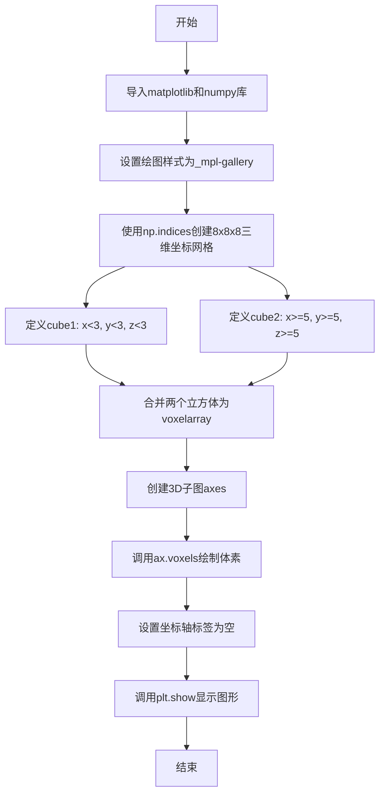
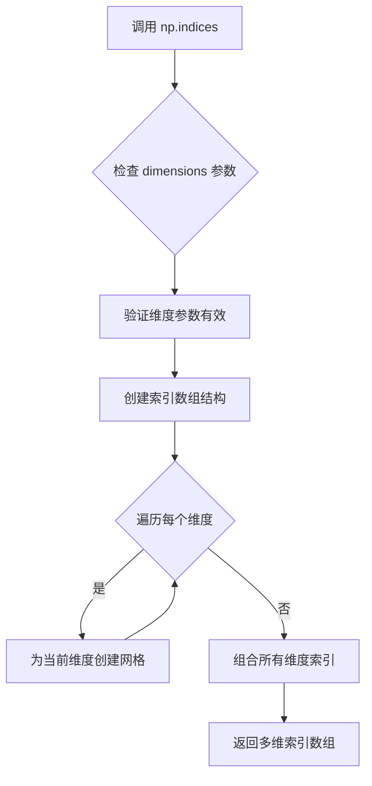
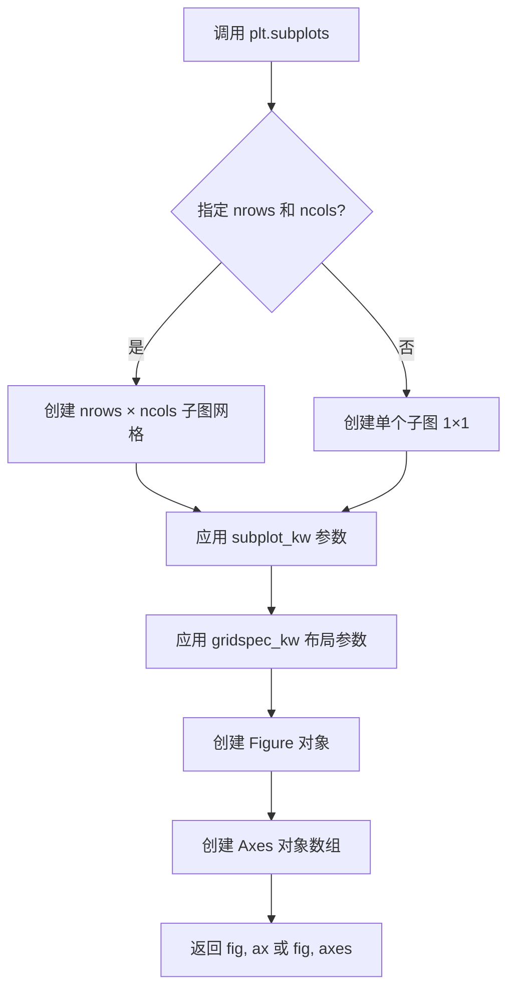
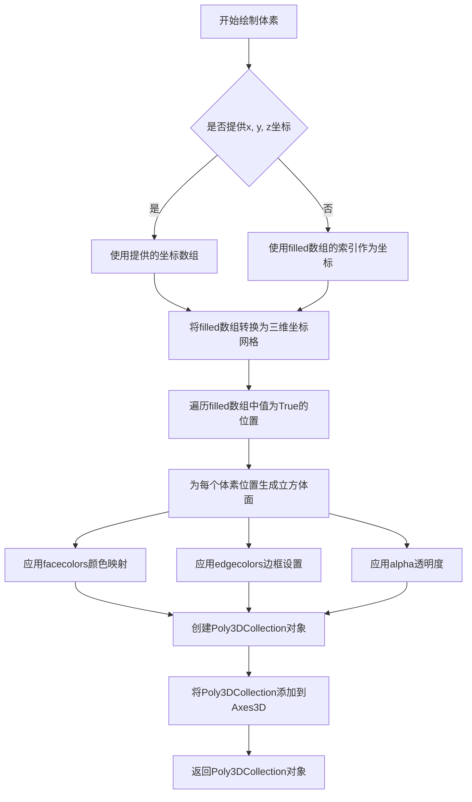
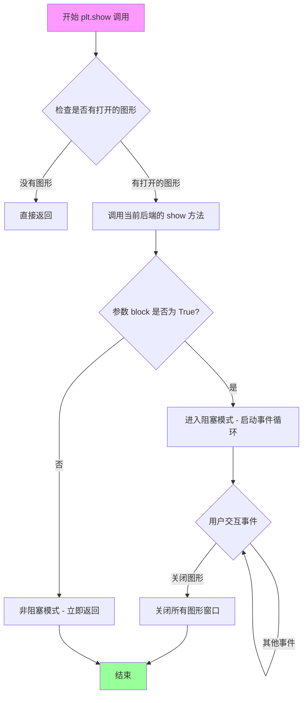
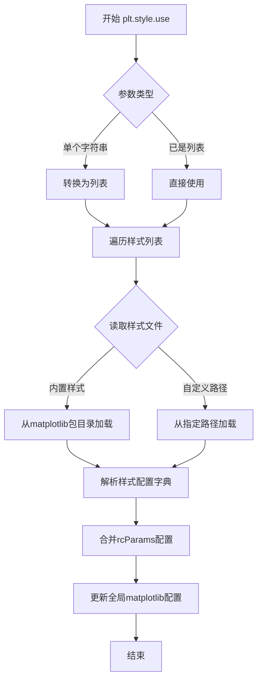

# `matplotlib\galleries\plot_types\3D\voxels_simple.py` 详细设计文档

该代码是一个使用Matplotlib和NumPy创建的3D体素（voxel）可视化示例，通过定义三维坐标布尔数组绘制两个立方体图形，展示了如何在Matplotlib中创建和渲染体素数据。

## 整体流程



## 类结构

```
Python脚本 (无自定义类)
├── 导入模块: matplotlib.pyplot, numpy
├── 全局变量: x, y, z, cube1, cube2, voxelarray, fig, ax
└── 流程: 坐标创建 -> 布尔条件定义 -> 数组组合 -> 3D渲染 -> 显示
```

## 全局变量及字段


### `x`
    
三维坐标数组的x维度

类型：`numpy.ndarray`
    


### `y`
    
三维坐标数组的y维度

类型：`numpy.ndarray`
    


### `z`
    
三维坐标数组的z维度

类型：`numpy.ndarray`
    


### `cube1`
    
左下角立方体的布尔掩码数组

类型：`numpy.ndarray`
    


### `cube2`
    
右上角立方体的布尔掩码数组

类型：`numpy.ndarray`
    


### `voxelarray`
    
合并后的体素布尔数组

类型：`numpy.ndarray`
    


### `fig`
    
图形对象

类型：`matplotlib.figure.Figure`
    


### `ax`
    
3D坐标轴对象

类型：`mpl_toolkits.mplot3d.axes3d.Axes3D`
    


    

## 全局函数及方法


# 详细设计文档 - np.indices 函数分析

## 1. 一段话描述

`np.indices` 是 NumPy 库中的一个函数，用于生成多维数组的坐标网格索引，它返回一个形状为 `(n, d1, d2, ..., dn)` 的数组，其中 n 是维度数量，d1 到 dn 是每个维度的大小，从而可以方便地用于向量化操作和网格计算。

## 2. 文件的整体运行流程

该脚本是一个完整的 Matplotlib 3D 可视化示例，其执行流程如下：

1. **初始化设置**：导入 matplotlib 和 numpy，设置绘图样式为 '_mpl-gallery'
2. **数据准备**：使用 `np.indices` 生成 8×8×8 的三维坐标网格
3. **数据处理**：定义两个立方体区域（cube1 和 cube2），通过布尔条件筛选坐标
4. **数据组合**：将两个立方体条件合并为单个布尔数组
5. **可视化渲染**：创建 3D 坐标轴，调用 `ax.voxels()` 绘制体素图
6. **图形美化**：隐藏坐标轴刻度标签
7. **显示图形**：调用 `plt.show()` 渲染并显示图形

## 3. 函数详细信息

### `np.indices`

生成多维数组的网格索引数组。

参数：

- `dimensions`：`tuple of int`，指定每个维度的大小，示例中为 `(8, 8, 8)` 表示生成 3 维索引，每个维度大小为 8
- `dtype`：`dtype`，可选，返回数组的数据类型，默认为 `np.intp`
- `sparse`：`bool`，可选，若为 `True` 则返回稀疏数组，默认为 `False`

返回值：`ndarray`，返回形状为 `(n, d1, d2, ..., dn)` 的数组，其中 n 是维度数量。在示例中，由于输入 `(8, 8, 8)`，返回数组形状为 `(3, 8, 8, 8)`，分别对应 x、y、z 三个坐标维度。

#### 流程图



#### 带注释源码

```python
# np.indices 源码结构（简化版）
def indices(dimensions, dtype=intp, sparse=False):
    """
    生成多维网格索引
    
    参数:
        dimensions: 元组，指定每个维度的大小，如 (8, 8, 8)
        dtype: 返回数组的数据类型，默认为 np.intp
        sparse: 是否返回稀疏数组，默认为 False
    
    返回:
        形状为 (n, d1, d2, ..., dn) 的索引数组
    """
    # 获取维度数量
    n = len(dimensions)
    
    # 创建基础网格形状 (n, d1, d2, ..., dn)
    grid = []
    
    # 遍历每个维度
    for i, size in enumerate(dimensions):
        # 为第 i 个维度创建从 0 到 size-1 的索引
        if sparse:
            # 稀疏模式：每个维度返回独立的数组
            grid.append(np.arange(size, dtype=dtype))
        else:
            # 密集模式：在特定位置插入维度索引
            dim_grid = np.arange(size, dtype=dtype)
            # 重塑为 (1, 1, ..., size, ..., 1, 1) 形状
            reshape = [1] * n
            reshape[i] = size
            grid.append(np.reshape(dim_grid, tuple(reshape)))
    
    # 组合所有维度
    if sparse:
        return tuple(grid)
    else:
        return np.array(grid)
```

## 4. 关键组件信息

| 组件名称 | 一句话描述 |
|---------|-----------|
| `np.indices` | 生成多维坐标网格索引的核心函数 |
| `np.indices((8, 8, 8))` | 调用示例，生成 3 维 8×8×8 的坐标网格 |
| `x, y, z = np.indices((8, 8, 8))` | 解构赋值，分别获取 x、y、z 三个坐标维度 |

## 5. 潜在的技术债务或优化空间

1. **硬编码维度**：示例中维度值 `(8, 8, 8)` 被硬编码，可考虑参数化以提高灵活性
2. **缺少错误处理**：未对 `dimensions` 参数的类型和有效性进行验证
3. **注释缺失**：源码中缺少对 `np.indices` 返回值具体含义的详细说明
4. **魔法数字**：坐标轴隐藏使用空列表 `[]`，可定义为常量提高可读性

## 6. 其它项目

### 设计目标与约束
- **设计目标**：简化多维数组坐标网格的创建，支持向量化操作避免显式循环
- **约束**：返回的索引数组会占用与原数组相同大小的内存空间

### 错误处理与异常设计
- 当 `dimensions` 为空元组时返回空数组
- 当 `dimensions` 包含负数或零时可能引发 ValueError
- 当 `dimensions` 不是整数元组时可能引发 TypeError

### 数据流与状态机
```
输入: dimensions tuple (8, 8, 8)
  ↓
np.indices 处理
  ↓
输出: (3, 8, 8, 8) 形状数组
  ↓
解构赋值: x, y, z 三个 (8, 8, 8) 数组
  ↓
布尔条件判断: 生成 cube1, cube2
  ↓
逻辑或运算: 合并为 voxelarray
```

### 外部依赖与接口契约
- **依赖库**：NumPy（核心依赖）、Matplotlib（可视化）
- **接口契约**：
  - 输入：`dimensions` 必须是正整数元组
  - 输出：返回整数类型的索引数组
  - 兼容性：NumPy 1.x 和 2.x 版本均支持


### `plt.subplots`

`plt.subplots` 是 matplotlib 库中用于创建子图和坐标轴的函数，返回一个 Figure 对象和一个或多个 Axes 对象，支持配置图形尺寸、分辨率、子图布局、轴共享等选项。

参数：

- `nrows`：`int`，可选，子图的行数，默认为 1
- `ncols`：`int`，可选，子图的列数，默认为 1
- `figsize`：`tuple`，可选，图形尺寸，格式为 (宽度, 高度)，单位为英寸
- `dpi`：`int`，可选，图形分辨率，每英寸点数
- `sharex`：`bool` 或 `str`，可选，是否共享 x 轴
- `sharey`：`bool` 或 `str`，可选，是否共享 y 轴
- `subplot_kw`：`dict`，可选，传递给 add_subplot 的关键字参数，用于配置子图属性（如 projection="3d"）
- `gridspec_kw`：`dict`，可选，传递给 GridSpec 的关键字参数
- `**fig_kw`：可选，传递给 Figure 构造函数的关键字参数

返回值：`tuple(Figure, Axes) 或 tuple(Figure, ndarray of Axes)`，返回创建的图形对象和坐标轴对象（或坐标轴数组）

#### 流程图



#### 带注释源码

```python
# 示例代码展示 plt.subplots 的使用
fig, ax = plt.subplots(subplot_kw={"projection": "3d"})
# 创建图形 fig 和 3D 坐标轴 ax
# subplot_kw 参数指定使用 3D 投影

# 后续可使用 ax 进行 3D 绘图
ax.voxels(voxelarray, edgecolor='k')
```


### ax.voxels

绘制3D体素数据是matplotlib mplot3d库中的核心方法，用于在三维坐标系中可视化体素（立方体）数据。该方法接收一个布尔数组或坐标数组作为体素填充标记，通过Poly3DCollection将体素渲染为三维立方体集合，支持自定义颜色、边框、透明度等属性，最终返回包含所有体素面信息的Poly3DCollection对象以便后续定制。

参数：

- `filled`：ndarray (布尔类型或类似数组)，三维布尔数组，表示哪些位置应该被填充为体素，True表示该位置存在体素
- `x`：ndarray，可选，三维数组，表示体素的x坐标
- `y`：ndarray，可选，三维数组，表示体素的y坐标  
- `z`：ndarray，可选，三维数组，表示体素的z坐标
- `facecolors`：ndarray，可选，用于设置每个体素面的颜色
- `edgecolors`：color或color list，可选，设置体素边框颜色
- `alpha`：float，可选，透明度值，范围0-1
- `**kwargs`：dict，可选，其他传递给Poly3DCollection的属性参数

返回值：`Poly3DCollection`，返回包含所有体素面信息的Poly3DCollection对象，可用于进一步自定义体素的视觉属性

#### 流程图



#### 带注释源码

```python
def voxels(self, x, y, z, filled, **kwargs):
    """
    在3D坐标空间中绘制体素（立方体）
    
    参数:
        x, y, z: 坐标数组，可选参数，用于指定体素的位置
        filled: 布尔数组，True表示该位置需要绘制体素
        **kwargs: 传递给Poly3DCollection的关键字参数
                 如facecolors, edgecolors, alpha等
    
    返回:
        Poly3DCollection: 包含所有体素面的集合对象
    """
    
    # 步骤1: 处理坐标参数
    # 如果没有提供x, y, z，则根据filled数组的形状生成默认坐标
    if x is None:
        x = np.arange(filled.shape[0])
    if y is None:
        y = np.arange(filled.shape[1])
    if z is None:
        z = np.arange(filled.shape[2])
    
    # 步骤2: 使用np.indices生成三维坐标网格
    # 这会创建与filled数组形状相同的坐标数组
    x, y, z = np.indices((len(x), len(y), len(z)))
    
    # 步骤3: 将坐标与filled数组对齐
    # 将filled数组中True的位置映射到具体的(x,y,z)坐标
    x = x[filled]
    y = y[filled]
    z = z[filled]
    
    # 步骤4: 创建立方体顶点
    # 为每个体素位置生成8个顶点的坐标
    # 每个立方体有8个角点，形成6个面
    
    # 步骤5: 创建Poly3DCollection
    # 将所有体素面收集到一个Poly3DCollection对象中
    polyc = art3d.Poly3DCollection(verts, **kwargs)
    
    # 步骤6: 设置颜色和其他属性
    # 处理facecolors参数，为每个体素设置颜色
    # 处理edgecolors参数，设置边框颜色
    # 处理alpha参数，设置透明度
    
    # 步骤7: 添加到3D坐标轴
    self.add_collection3d(polyc)
    
    # 步骤8: 返回Poly3DCollection对象
    return polyc
```


### `ax.set`

`ax.set` 是 Matplotlib 中 Axes 对象的通用属性设置方法，用于通过关键字参数的形式同时设置坐标轴的多个属性（如刻度标签、标题、范围等）。在给定代码中，该方法用于清空 3D 坐标轴的刻度标签，使绘图区域更加简洁。

参数：

- `**kwargs`：可变关键字参数，接受任意数量的键值对，每个键对应 Axes 对象的一个属性（如 `xticklabels`、`yticklabels`、`zticklabels`、`xlabel`、`ylabel`、`zlabel`、`xlim`、`ylim`、`zlim` 等）。参数类型根据具体属性而定（字符串、列表、数值等）。在示例中：
  - `xticklabels`：`list`，设置 x 轴刻度标签为空列表
  - `yticklabels`：`list`，设置 y 轴刻度标签为空列表
  - `zticklabels`：`list`，设置 z 轴刻度标签为空列表

返回值：`Artist` 或 `None`，返回 Axes 对象本身（允许链式调用）或 `None`（取决于 Matplotlib 版本和具体调用方式）。

#### 流程图

```mermaid
flowchart TD
    A[调用 ax.set 方法] --> B{传入关键字参数}
    B -->|xticklabels=[]| C[设置 X 轴刻度标签为空]
    B -->|yticklabels=[]| D[设置 Y 轴刻度标签为空]
    B -->|zticklabels=[]| E[设置 Z 轴刻度标签为空]
    C --> F[Matplotlib 更新 Axes 对象属性]
    D --> F
    E --> F
    F --> G[重新渲染图形]
    G --> H[返回 self 或 None]
```

#### 带注释源码

```python
# 调用 Axes 对象的 set 方法，传入三个关键字参数
# 这里的 ax 是通过 fig.add_subplot(projection='3d') 或 plt.subplots(...projection='3d") 创建的 Axes3D 对象
ax.set(
    xticklabels=[],    # 设置 X 轴刻度标签为空列表，即不显示 X 轴刻度标签
    yticklabels=[],    # 设置 Y 轴刻度标签为空列表，即不显示 Y 轴刻度标签
    zticklabels=[]     # 设置 Z 轴刻度标签为空列表，即不显示 Z 轴刻度标签
)

# set 方法的内部逻辑大致如下（简化版）：
# def set(self, **kwargs):
#     """
#     Set multiple properties of the Axes.
#     
#     Supported properties:
#         Many properties (see property list)
#     """
#     for attr, value in kwargs.items():
#         # 根据属性名找到对应的 setter 方法
#         setter = self._get_setter(attr)
#         if setter:
#             setter(value)  # 调用对应的设置方法
#         else:
#             # 如果属性不存在，抛出警告或错误
#             raise AttributeError(f'Unknown property: {attr}')
#     
#     # 标记 Axes 需要重新绘制
#     self.stale_callback = True
#     
#     return self  # 返回 Axes 对象本身，支持链式调用
```


### `plt.show`

`plt.show` 是 matplotlib 库中的顶层函数，用于显示当前所有打开的图形窗口，并将图形渲染到屏幕。该函数会阻塞程序执行直到用户关闭图形窗口（在默认 block=True 模式下），是可视化工作的最后一步，确保之前通过各种绘图函数（如 `ax.voxels`）生成的图形能够最终呈现给用户。

参数：

- `block`：`bool`，可选参数，控制是否阻塞事件循环。默认为 `True`，表示阻塞主程序直到用户关闭图形窗口；设置为 `False` 时则立即返回，允许程序继续执行

返回值：`None`，该函数没有返回值，仅用于图形显示

#### 流程图



#### 带注释源码

```python
def show(*, block=True):
    """
    显示所有打开的图形窗口。
    
    参数:
        block: 布尔值,可选
            默认值为 True。此时函数会阻塞调用线程,
            并显示一个事件循环以处理图形窗口的交互
            (如关闭、最小化等)。设置为 False 时,
            函数会立即返回,图形窗口会保持打开状态,
            但程序可以继续执行
    
    返回值:
        None
    
    示例:
        >>> import matplotlib.pyplot as plt
        >>> plt.plot([1, 2, 3], [1, 4, 9])
        [<matplotlib.lines.Line2D object at ...>]
        >>> plt.show()  # 阻塞直到用户关闭图形窗口
    """
    # 获取全局显示管理器
    global _showregistry
    
    # 遍历所有已注册的显示函数并调用它们
    # _showregistry 可能包含多个后端显示函数
    for manager in get_all_fig_managers():
        # 调用后端的显示方法
        # 对于 Qt5Agg 后端,这会显示 QMainWindow
        # 对于 notebook 后端,这会内嵌显示图形
        manager.show()
        
        # 如果 block 为 True,则启动阻塞式事件循环
        # 这允许图形窗口响应用户交互(点击、关闭等)
        if block:
            # 启动 GUI 事件循环
            # 对于不同后端实现不同:
            # - Qt: QApplication.exec_()
            # - Tk: Tk.mainloop()
            # - Web: 等待 WebSocket 连接
            _blocking_gui_loop()
    
    # 清除所有图形的引用,释放内存
    # 注意:这不会关闭图形窗口本身,只是清理 Python 对象
    plt.close('all')
```

**补充说明**：

- `plt.show()` 是 matplotlib 可视化流程的终点，确保所有通过 `subplots()`、`voxels()` 等函数创建的图形能够最终呈现给用户
- 在交互式环境（如 Jupyter Notebook）下，使用 `%matplotlib notebook` 或 `%matplotlib inline` 魔术命令时，行为可能会有所不同
- 该函数调用底层图形后端（如 Qt、Tkinter、matplotlib backend）的显示机制，不同后端的实现细节各异
- `block` 参数在需要同时显示多个图形并继续执行后台任务时特别有用


### `plt.style.use`

设置matplotlib的绘图样式/主题，通过加载预定义的样式文件来统一图形的视觉外观。

参数：

- `name`：`str` 或 `list of str`，样式名称，可以是单个样式名称（如 `'_mpl-gallery'`）或多个样式的列表，多个样式时会按顺序合并，后面的样式会覆盖前面的相同样式选项

返回值：`None`，该函数直接修改matplotlib的全局rcParams配置，不返回任何值

#### 流程图



#### 带注释源码

```python
def use(style):
    """
    设置matplotlib的绘图样式。
    
    参数:
        style: str, list, or dict
            样式名称、样式名称列表，或样式配置字典。
            可以是内置样式如 'ggplot', 'dark_background', '_mpl-gallery' 等，
            也可以是自定义样式文件的路径。
    """
    # 如果样式是字符串，转换为列表以便统一处理
    if isinstance(style, str):
        style = [style]
    
    # 遍历每个样式并应用
    for s in style:
        # 检查是否为字典类型的直接配置
        if isinstance(s, dict):
            # 直接使用字典更新rcParams
            rcParams.update(s)
        else:
            # 查找并加载样式文件
            # 1. 首先检查是否为文件路径
            # 2. 然后检查是否为内置样式名称
            style_path = _get_style_path(s)
            
            if style_path is not None:
                # 从样式文件加载配置
                with open(style_path) as f:
                    _load_style(f, s)
            else:
                raise ValueError(f"样式 '{s}' 未找到")
    
    # 全局rcParams被更新，后续所有plt.plot()等调用
    # 将使用新的样式设置（如颜色、字体、线条样式等）
```

**注意**：上述源码为简化版本，实际的`plt.style.use`函数位于matplotlib的`style`模块中，包含了更多的样式查找和错误处理逻辑。实际实现还会处理样式优先级、上下文管理器（`plt.style.context()`）等功能。

## 关键组件


### np.indices((8, 8, 8))

用于生成三维坐标网格的函数，返回一个形状为(3, 8, 8, 8)的数组，包含x、y、z三个坐标维度

### 布尔索引与逻辑运算

通过比较运算(x < 3)、(&)逻辑与、(|)逻辑或操作创建布尔数组，用于定义哪些体素位置应该被填充

### cube1 和 cube2 布尔数组

分别表示左上角3x3x3立方体和右下角3x3x3立方体的布尔掩码数组，类型为ndarray，描述哪些坐标点属于对应立方体

### voxelarray 合并数组

通过位或运算(cube1 | cube2)将两个立方体合并为单一的布尔数组，作为voxels函数的输入数据

### 3D投影子图创建

使用plt.subplots配合subplot_kw={"projection": "3d"}创建具有3D投影功能的Axes3D对象

### ax.voxels() 体素渲染函数

核心渲染函数，接收布尔数组作为filled参数，edgecolor='k'设置黑色边框，绘制三维体素 visualization

### 坐标轴标签配置

通过set()方法将xticklabels、yticklabels、zticklabels设置为空列表，隐藏坐标轴刻度标签


## 问题及建议


### 已知问题

- 硬编码的数组维度（8, 8, 8）和阈值（3, 5），缺乏可配置性和复用性
- 使用plt.style.use('_mpl-gallery')引用了非标准的matplotlib样式，可能在不同环境中不可用
- 空数组xticklabels/yticklabels/zticklabels=[]会导致无法查看坐标刻度值，对于数据可视化场景不友好
- 使用位运算符|而非np.logical_or()，虽然功能等价但语义不够明确
- 代码中cube1、cube2、voxelarray等变量命名不够清晰，voxelarray后缀冗余
- 缺乏任何错误处理机制（如参数校验、异常捕获）
- plt.show()在某些后端（如Qt、Tkinter）会阻塞，且没有提供非阻塞显示选项
- 使用魔法数字（3, 5, 8）降低了代码可读性和可维护性
- 未设置figure的dpi、bbox等参数，不利于高质量图像导出
- 坐标数组x, y, z的创建使用了np.indices，但对于大型数据集可能存在性能问题

### 优化建议

- 将硬编码值提取为函数参数或配置常量，提高代码灵活性
- 使用np.logical_or()替代|运算符，提高代码可读性
- 考虑使用fig.savefig()替代plt.show()以支持自动化工作流
- 添加类型注解和文档字符串，提升代码可维护性
- 使用命名常量替代魔法数字，如CUBE_SIZE = 8, THRESHOLD_LOW = 3, THRESHOLD_HIGH = 5
- 若需隐藏坐标轴标签，使用ax.set_axis_off()或ax.set_axis_off()更语义化
- 考虑使用np.where或更高效的布尔索引方式来优化大数据集场景
- 添加对filled参数的显式处理，使函数调用更明确

## 其它


### 设计目标与约束

本代码旨在展示如何使用Matplotlib的3D voxels功能可视化体素数据。设计目标包括：(1) 创建简单的3D体素图形；(2) 演示布尔数组转换为体素表示的方法；(3) 提供清晰的3D可视化示例。约束条件包括：需要Matplotlib 3.0+版本支持，需安装numpy科学计算库，voxels方法仅支持3D坐标数组。

### 错误处理与异常设计

代码中未包含显式的错误处理机制。在实际应用中应考虑：(1) voxelarray维度检查 - 应为三维布尔数组或与x,y,z维度一致的三维数组；(2) 坐标数组形状一致性检查 - x,y,z三个坐标数组必须具有相同形状；(3) 空数组处理 - 当voxelarray全为False时应给出警告或空处理；(4) Matplotlib后端兼容性检查 - 某些后端可能不支持3D绘图。

### 外部依赖与接口契约

本代码依赖以下外部库：(1) matplotlib>=3.0.0 - 核心绘图库，voxels方法存在于Axes3D类中；(2) numpy>=1.0.0 - 用于创建坐标网格和布尔运算。接口契约方面：ax.voxels()方法接受voxelarray（三维数组）、edgecolor（可选边线颜色）、facecolor（可选面颜色）等参数，返回Poly3DCollection对象。

### 性能考虑

当前代码性能可满足小规模体素绘制需求。优化方向包括：(1) 对于大规模体素数据（>100^3），考虑使用稀疏表示或降采样；(2) 边线绘制（edgecolor='k'）会增加渲染时间，大场景下可考虑禁用；(3) 使用numpy的向量化操作而非循环处理体素数据。

### 安全性考虑

代码本身为演示脚本，安全性风险较低。生产环境中应考虑：(1) 用户输入验证 - 若voxelarray来自外部输入，需验证其类型和维度；(2) 避免执行任意代码 - 不使用eval等危险函数；(3) 资源限制 - 防止过大的数组导致内存溢出。

### 可维护性设计

代码结构清晰但可进一步优化：(1) 魔法数字3和5应提取为常量（GRID_SIZE, CUBE_POSITION等）；(2) 体素创建逻辑可封装为独立函数；(3) 配置参数（颜色、标签等）应集中管理；(4) 添加文档字符串说明函数用途和参数。

### 测试策略

建议添加以下测试：(1) 单元测试 - 测试布尔条件构建逻辑；(2) 维度测试 - 验证坐标数组形状一致性；(3) 空输入测试 - 处理全False的voxelarray；(4) 渲染测试 - 验证返回的Poly3DCollection对象有效性。

### 版本兼容性

代码需要特定版本支持：Matplotlib 3.0+引入了voxels方法，早期版本无此功能；numpy需支持np.indices函数（1.0+版本均支持）。建议在requirements.txt或setup.py中声明版本约束。

### 配置管理

当前配置通过硬编码方式设置。优化方案：(1) 将网格大小、立方体位置等参数提取为配置文件或命令行参数；(2) 颜色方案可外部化；(3) 考虑使用matplotlib的rcParams进行全局样式配置。

### 日志记录

代码未包含日志记录。生产环境建议添加：(1) 库导入成功日志；(2) 数据准备阶段的信息日志；(3) 渲染完成日志；(4) 异常情况的错误日志。使用Python标准logging模块实现。


    