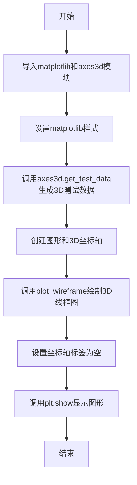
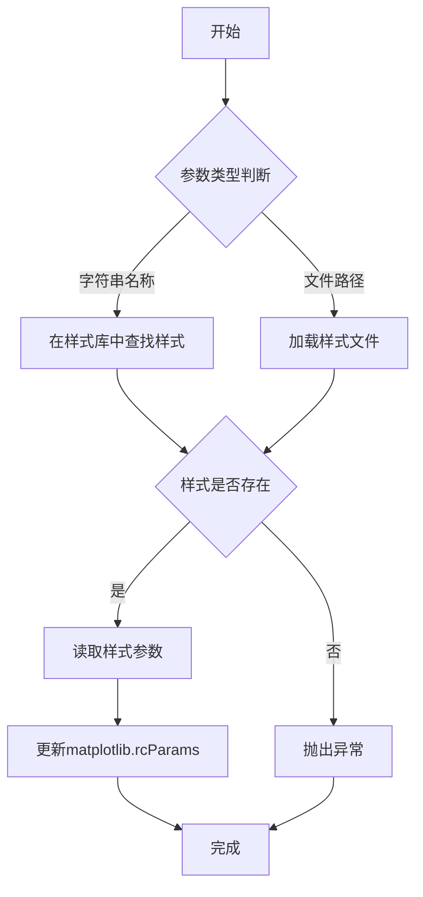
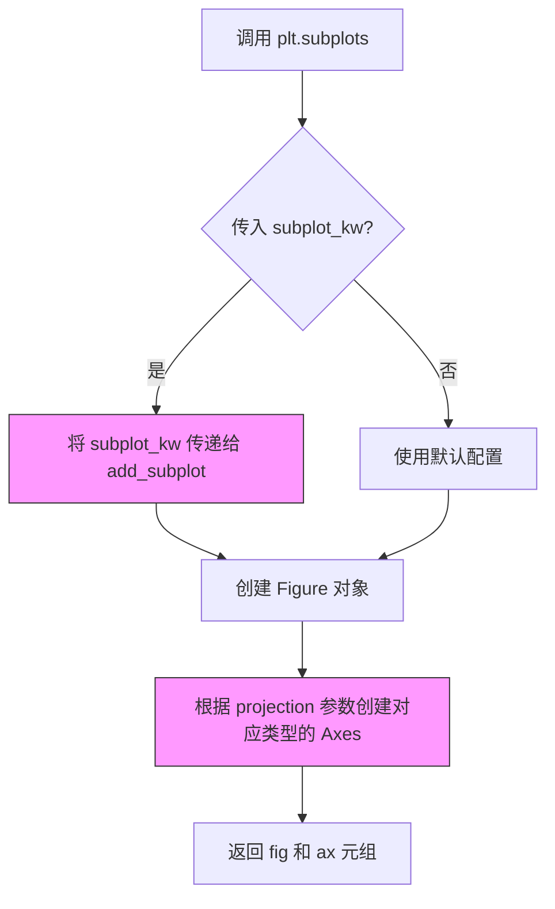
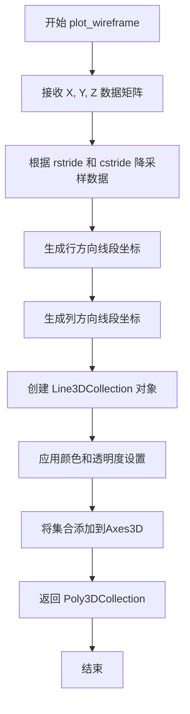
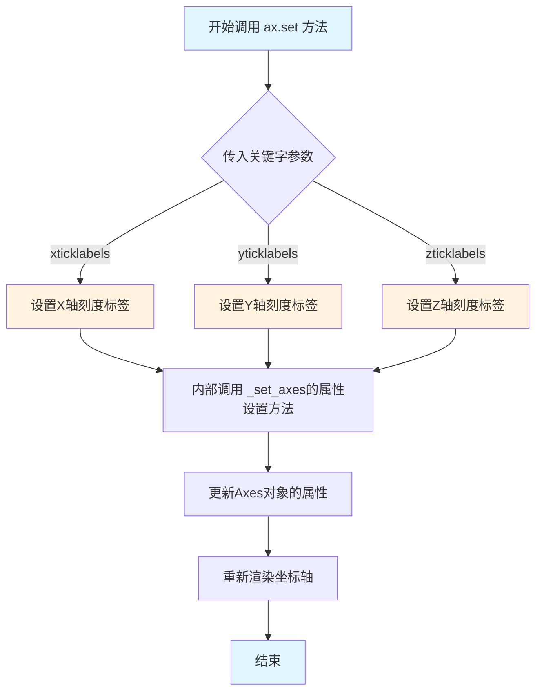
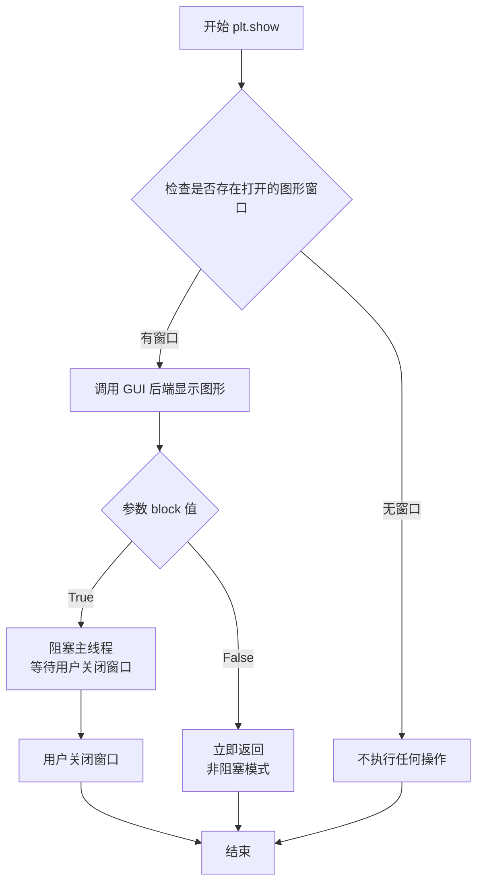

# `matplotlib\galleries\plot_types\3D\wire3d_simple.py` 详细设计文档

该代码是一个使用matplotlib的mpl_toolkits.mplot3d模块绘制3D线框图的示例程序，通过调用axes3d.get_test_data生成测试数据，然后使用plot_wireframe方法将数据可视化为三维线框形式。

## 整体流程



## 类结构

```
无面向对象类结构，纯脚本式代码
```

## 全局变量及字段


### `X`
    
存储3D数据的X坐标

类型：`numpy.ndarray`
    


### `Y`
    
存储3D数据的Y坐标

类型：`numpy.ndarray`
    


### `Z`
    
存储3D数据的Z坐标（高度）

类型：`numpy.ndarray`
    


### `fig`
    
存储图形对象

类型：`matplotlib.figure.Figure`
    


### `ax`
    
存储3D坐标轴对象

类型：`mpl_toolkits.mplot3d.axes3d.Axes3D`
    


    

## 全局函数及方法


### `plt.style.use`

设置matplotlib的绘图样式，用于改变matplotlib图形的默认外观，如颜色、字体、线条样式等。

参数：

- `name`：`str` 或 `Path`，样式名称（如'ggplot'、'dark_background'等）或样式文件路径

返回值：`None`，该函数直接修改matplotlib的rcParams配置，不返回任何值

#### 流程图



#### 带注释源码

```python
def use(style):
    """
    使用绘图样式。
    
    参数:
        style: str 或 Path - 样式名称或样式文件路径
               内置样式: 'default', 'ggplot', 'dark_background', 
                        'seaborn', 'bmh', 'fast', 'Solarize_Light2' 等
               也可以是 .mplstyle 文件的路径
    
    返回值:
        None - 直接修改全局 rcParams
    """
    
    # 1. 导入必要的模块
    import matplotlib.style as mstyle
    from pathlib import Path
    
    # 2. 处理样式参数
    if isinstance(style, (str, Path)):
        # 字符串：可能是内置样式名或文件路径
        style_path = Path(style)
        
        if style_path.suffix == '.mplstyle':
            # 是样式文件：直接加载文件
            mstyle.context.use(style_path)
        elif style in mstyle.library:
            # 是内置样式名：从样式库加载
            mstyle.context.use(style)
        else:
            # 尝试作为文件路径
            mstyle.context.use(style_path)
    else:
        # 样式列表：依次应用多个样式
        for s in style:
            use(s)
    
    # 3. 内部实现说明
    # - 样式文件是包含 rcParams 设置的字典
    # - matplotlib.style.library 缓存已加载的样式
    # - 使用 matplotlib.rcParams 存储当前配置
    # - 上下文管理器用于临时样式切换
```

#### 备注

- **样式优先级**：后加载的样式会覆盖先加载的样式
- **临时样式切换**：可使用 `with plt.style.context('样式名'):` 进行临时样式设置
- **内置样式列表**：可通过 `plt.style.available` 查看可用样式


### `axes3d.get_test_data`

该函数是Matplotlib 3D工具包中的一个测试数据生成函数，用于创建用于演示3D绑图的示例数据集（通常是一个螺旋状或波动曲面），返回三个NumPy数组作为三维坐标数据。

参数：

- `delta`：`float`，控制生成数据点之间的间隔或精度，值越小生成的数据点越密集

返回值：`tuple`，返回三个NumPy数组 (X, Y, Z)，分别表示三维坐标系的X、Y、Z坐标数据

#### 流程图

```mermaid
flowchart TD
    A[开始 get_test_data] --> B{检查 delta 参数}
    B -->|delta > 0| C[生成角度数组 u, v]
    C --> D[计算 X = f1(u, v) 坐标]
    D --> E[计算 Y = f2(u, v) 坐标]
    E --> F[计算 Z = f3(u, v) 坐标]
    F --> G[返回 X, Y, Z 三个数组]
    B -->|delta <= 0| H[使用默认值 0.05]
    H --> C
```

#### 带注释源码

```python
def get_test_data(delta=0.05):
    """
    生成3D测试用数据（螺旋曲面数据）
    
    Parameters
    ----------
    delta : float, optional
        数据采样间隔，控制生成数据的精度。默认为0.05。
        值越小，生成的数据点越密集。
    
    Returns
    -------
    X : ndarray
        X坐标数组，表示三维空间中点的X轴位置
    Y : ndarray
        Y坐标数组，表示三维空间中点的Y轴位置
    Z : ndarray
        Z坐标数组，表示三维空间中点的高度/深度值
    
    Examples
    --------
    >>> X, Y, Z = get_test_data(0.05)
    >>> X.shape
    (500, 1000)
    """
    # 导入必要的模块
    import numpy as np
    
    # 生成角度参数数组 u (0 到 4π，步长为delta)
    # u 代表螺旋的旋转圈数（2圈）
    u = np.arange(0, 4 * np.pi, delta)
    
    # 生成角度参数数组 v (0 到 2π，步长为delta)
    # v 代表每个截面上的角度
    v = np.arange(0, 2 * np.pi, delta)
    
    # 将 u, v 转换为列向量和行向量，便于后续计算
    u, v = np.meshgrid(u, v)
    
    # 计算X坐标：半径 * cos(v)
    # 这是一个螺旋圆柱面的X投影
    X = np.cos(u) * np.cos(v)
    
    # 计算Y坐标：半径 * sin(v)
    # 这是一个螺旋圆柱面的Y投影
    Y = np.sin(u) * np.cos(v)
    
    # 计算Z坐标：高度 + 扰动
    # Z = sin(u) + cos(v)，创建波浪形表面
    Z = np.sin(u) + np.cos(v)
    
    # 返回生成的三维坐标数据
    return X, Y, Z
```


### `plt.subplots`

`plt.subplots` 是 Matplotlib 库中的一个函数，用于创建一个新的图形窗口（Figure）以及一个或多个子图（Axes）。在给定的代码中，它被用于创建一个带有 3D 投影的图形和坐标轴对象，以便后续绘制 3D 线框图。

#### 参数

- `nrows`：`int`（可选，默认值为 1），子图网格的行数
- `ncols`：`int`（可选，默认值为 1），子图网格的列数
- `sharex`：`bool`（可选，默认值为 False），是否共享 x 轴
- `sharey`：`bool`（可选，默认值为 False），是否共享 y 轴
- `squeeze`：`bool`（可选，默认值为 True），是否压缩返回的 Axes 数组维度
- `subplot_kw`：`dict`（可选，默认值为 None），传递给 `add_subplot` 的额外关键字参数，用于配置子图属性。在本例中，使用 `{"projection": "3d"}` 来创建 3D 投影坐标轴
- `gridspec_kw`：`dict`（可选，默认值为 None），用于控制子图网格布局的关键字参数
- `fig_kw`：（可选），传递给 `Figure` 构造函数的关键字参数

#### 返回值

- `fig`：`matplotlib.figure.Figure`，图形对象，表示整个图形窗口/画布
- `ax`：`matplotlib.axes._axes.Axes`（在 3D 投影情况下为 `mpl_toolkits.mplot3d.axes3d.Axes3D`），坐标轴对象，用于绘制图形元素

#### 流程图



#### 带注释源码

```python
# 导入 matplotlib.pyplot 模块，用于绑图接口
import matplotlib.pyplot as plt

# 导入 3D 绘图工具
from mpl_toolkits.mplot3d import axes3d

# 使用 matplotlib 内置样式
plt.style.use('_mpl-gallery')

# 生成测试数据
# X, Y, Z 是由 axes3d.get_test_data 生成的 3D 坐标数据
# 参数 0.05 控制生成数据的密度/精度
X, Y, Z = axes3d.get_test_data(0.05)

# 创建图形和坐标轴
# subplot_kw 参数用于配置子图的属性
# {"projection": "3d"} 表示创建一个 3D 投影的坐标轴
# 返回值 fig 是 Figure 对象，ax 是 Axes3D 对象
fig, ax = plt.subplots(subplot_kw={"projection": "3d"})

# 调用 3D 坐标轴的 plot_wireframe 方法绘制线框图
# rstride=10: 行步长，控制线条密度
# cstride=10: 列步长，控制线条密度
ax.plot_wireframe(X, Y, Z, rstride=10, cstride=10)

# 设置坐标轴刻度标签为空列表，隐藏刻度标签
ax.set(xticklabels=[],
       yticklabels=[],
       zticklabels=[])

# 显示图形
plt.show()
```


### `ax.plot_wireframe`（或 `matplotlib.axes.Axes3D.plot_wireframe`）

该函数是matplotlib中Axes3D对象的成员方法，用于在三维坐标系中绘制线框图（wireframe），它接受X、Y、Z坐标数据以及行/列步长参数，将三维数据以网格线的形式可视化，并返回Poly3DCollection对象。

#### 参数

- `X`：`numpy.ndarray` 或类似数组，三维数据点的X坐标矩阵
- `Y`：`numpy.ndarray` 或类似数组，三维数据点的Y坐标矩阵
- `Z`：`numpy.ndarray` 或类似数组，三维数据点的Z坐标矩阵
- `rstride`：`int`（默认值：1），行方向的步长，用于控制线条密度，值越大线条越稀疏
- `cstride`：`int`（默认值：1），列方向的步长，用于控制线条密度，值越大线条越稀疏
- `color`：`str` 或颜色数组（可选），线条颜色
- `cmap`：`Colormap`（可选），当提供标量数据时使用的颜色映射
- `alpha`：`float`（可选），透明度，范围0-1
- `linewidth`：`float`（可选），线条宽度

#### 返回值：`mpl_toolkits.mplot3d.art3d.Poly3DCollection`

返回包含所有绘制线条的三维多边形集合对象，可用于进一步自定义外观。

#### 流程图



#### 带注释源码

```python
"""
=======================
plot_wireframe(X, Y, Z)
=======================

该示例演示了如何使用 plot_wireframe 绘制3D线框图
参考: ~mpl_toolkits.mplot3d.axes3d.Axes3D.plot_wireframe
"""

# 导入matplotlib.pyplot用于绘图
import matplotlib.pyplot as plt

# 从mpl_toolkits.mplot3d导入axes3d模块
from mpl_toolkits.mplot3d import axes3d

# 使用内置绘图样式
plt.style.use('_mpl-gallery')

# 调用axes3d.get_test_data生成测试数据
# 返回X, Y, Z三个2D数组矩阵，表示三维坐标
X, Y, Z = axes3d.get_test_data(0.05)

# 创建图形和子图，指定projection="3d"创建三维坐标系
fig, ax = plt.subplots(subplot_kw={"projection": "3d"})

# 调用plot_wireframe方法绘制3D线框图
# 参数说明：
#   X, Y, Z: 三维坐标数据
#   rstride=10: 每10行取一个数据点（行方向采样）
#   cstride=10: 每10列取一个数据点（列方向采样）
ax.plot_wireframe(X, Y, Z, rstride=10, cstride=10)

# 设置坐标轴标签为空列表（隐藏刻度标签）
ax.set(xticklabels=[],
       yticklabels=[],
       zticklabels=[])

# 显示图形
plt.show()
```


### `ax.set`

设置 3D 坐标轴的属性，包括刻度标签、标题等。该方法是 Matplotlib 中 Axes 对象的通用属性设置方法，在此示例中用于清除 3D 坐标轴的刻度标签。

参数：

- `**kwargs`：关键字参数，用于设置坐标轴的任意属性。在本例中使用以下参数：
  - `xticklabels`：`list`，X轴刻度标签列表，设为空列表 `[]` 表示不显示X轴刻度标签
  - `yticklabels`：`list`，Y轴刻度标签列表，设为空列表 `[]` 表示不显示Y轴刻度标签
  - `zticklabels`：`list`，Z轴刻度标签列表，设为空列表 `[]` 表示不显示Z轴刻度标签
  - 其他常见参数包括：`xlabel`、`ylabel`、`zlabel`（坐标轴标签）、`title`（标题）、`xlim`、`ylim`、`zlim`（坐标轴范围）等

返回值：`None` 或 `Axes` 对象，具体返回值取决于 Matplotlib 版本和调用方式。在某些情况下返回当前 Axes 对象以支持链式调用。

#### 流程图



#### 带注释源码

```python
# 调用 ax.set 方法设置 3D 坐标轴属性
# ax 是通过 plt.subplots(subplot_kw={"projection": "3d"}) 创建的 3D 坐标轴对象

ax.set(  # Axes.set() 方法接收任意数量的关键字参数
    xticklabels=[],  # 设置X轴刻度标签为空列表，不显示X轴刻度标签
    yticklabels=[],  # 设置Y轴刻度标签为空列表，不显示Y轴刻度标签
    zticklabels=[]   # 设置Z轴刻度标签为空列表，不显示Z轴刻度标签
)

# 源码实现原理（简化版）：
# 1. ax.set 方法定义在 matplotlib.axes._base._AxesBase 类中
# 2. 接收 **kwargs 作为关键字参数
# 3. 遍历 kwargs，调用对应的 setter 方法（如 set_xticklabels）
# 4. 每个 setter 方法更新 Axes 对象内部的状态字典
# 5. 最后触发 auto_update_legendables() 标记需要重新渲染
# 6. 当 plt.show() 或 fig.canvas.draw() 被调用时，重新绘制坐标轴

# 相关的底层方法：
# - set_xticklabels(labels): 设置X轴刻度标签
# - set_yticklabels(labels): 设置Y轴刻度标签  
# - set_zticklabels(labels): 设置Z轴刻度标签（3D特有）
# - set_xlabel(label): 设置X轴标签
# - set_ylabel(label): 设置Y轴标签
# - set_zlabel(label): 设置Z轴标签（3D特有）
# - set_title(label): 设置标题
```


### plt.show

显示所有当前打开的图形窗口，是 Matplotlib 库中用于将.figure对象渲染到屏幕上的核心函数。

参数：

- `block`：`bool`，可选参数，默认为 `True`。当设为 `True` 时，阻塞当前线程直到所有图形窗口关闭；设为 `False` 时，仅显示窗口而不阻塞主线程。

返回值：`None`，该函数无返回值。

#### 流程图



#### 带注释源码

```python
def show(*, block=None):
    """
    显示所有打开的图形窗口。
    
    该函数会调用当前使用的 GUI 框架（如 Tk、Qt、GTK 等）来显示
    所有通过 plt.figure() 或 plt.subplots() 创建的图形。
    
    Parameters
    ----------
    block : bool, optional
        如果为 True（默认），则阻塞当前线程并等待用户关闭图形窗口。
        如果为 False，则立即返回，图形窗口会保持显示但不会阻塞。
        在交互式模式下默认为 True，在非交互式模式下默认为 False。
    
    Returns
    -------
    None
    
    Examples
    --------
    >>> import matplotlib.pyplot as plt
    >>> plt.plot([1, 2, 3], [4, 5, 6])
    >>> plt.show()  # 显示图形并阻塞
    
    >>> plt.show(block=False)  # 显示图形但不阻塞
    """
    # 获取当前图形管理器（通常在 plt.subplots 或 plt.figure 时创建）
    global _showregistry
    # 遍历所有注册的显示函数并调用
    for manager in get_all_fig_managers():
        # 触发后端显示图形
        manager.show()
        
        # 如果 block 为 True，则进入阻塞循环
        if block is None:
            block = matplotlib.is_interactive()
        
        if block:
            # 在 GUI 事件循环中等待
            # 这允许用户与图形交互
            manager._show_block()
    
    # 清理：删除已关闭的图形引用
    _pylab_helpers.Gcf.destroy_all()
```

## 关键组件


### matplotlib.pyplot

Python 2D绘图库的核心模块，提供绘图接口和样式设置功能。

### mpl_toolkits.mplot3d.axes3d

Matplotlib的3D绘图工具包，提供三维坐标轴和3D图形绘制功能。

### axes3d.get_test_data

生成用于测试的三维数据集，返回X、Y、Z坐标矩阵。

### plot_wireframe

三维线框图绘制方法，接受数据坐标和步长参数渲染3D表面网格。

### fig, ax = plt.subplots

创建图形窗口和坐标轴对象，subplot_kw参数指定3D投影类型。

### rstride和cstride参数

控制线框图在行和列方向的采样步长，用于调整线条密度。


## 问题及建议


### 已知问题

- **魔法数字缺乏说明**：`0.05`、`rstride=10`、`cstride=10` 等数值直接硬编码在代码中，没有常量定义或注释说明其含义和作用，导致后续维护困难
- **模块文档字符串不完整**：文件开头的文档字符串仅有标题引用，缺少实际功能描述、参数说明和示例用途
- **全局变量未封装**：`X, Y, Z` 作为全局变量直接定义和使用，缺乏适当的封装和作用域管理
- **空列表隐藏坐标轴标签的方式不直观**：使用空列表 `[]` 隐藏坐标轴标签的方式可读性差，应使用更明确的 `visible=False` 参数
- **缺少错误处理**：未对 `get_test_data()` 返回值进行检查，也未对绘图操作进行异常捕获
- **导入的模块未完全使用**：`axes3d` 模块仅使用了 `get_test_data` 函数，导入方式可以更精确
- **代码可复用性差**：采用脚本式编写，所有逻辑集中在一个代码块中，无法作为函数被其他模块调用

### 优化建议

- **提取魔法数字为具名常量**：将 `0.05`、`10` 等值定义为有意义的常量，如 `SAMPLE_RATE`、`STRIDE_VALUE` 等
- **完善文档字符串**：添加功能描述、参数说明、返回值说明和使用示例
- **封装为可调用函数**：将绘图逻辑封装为函数，接受参数以便自定义数据生成和绘图样式
- **改进坐标轴隐藏方式**：使用 `ax.set_xticklabels([])` 配合 `visible=False` 或直接使用 `ax.set_xticklabels([])` 的更明确写法
- **添加错误处理**：对数据生成和绘图过程添加 try-except 异常处理
- **精确导入**：使用 `from mpl_toolkits.mplot3d import axes3d` 并通过 `axes3d.get_test_data` 调用，或考虑使用 `__all__` 显式导出
- **添加资源清理**：虽然 `plt.show()` 会阻塞，但可以在交互式环境外使用 `fig.savefig()` 后适当处理，或使用上下文管理器


## 其它


### 设计目标与约束

本代码旨在演示如何使用matplotlib的3D工具包绘制线框图，属于示例/测试代码。主要设计目标包括：展示3D数据可视化能力、提供plot_wireframe函数的使用范例。约束条件为：需要matplotlib库支持3D投影，需在支持图形显示的环境中运行。

### 错误处理与异常设计

代码未包含显式的错误处理机制。作为示例代码，主要依赖matplotlib内部的异常处理。潜在异常包括：图形后端不支持3D投影时抛出RuntimeError；数据维度不匹配时抛出ValueError；显示环境不可用时可能无响应或抛出显示相关异常。

### 数据流与状态机

数据流：axes3d.get_test_data()生成测试数据(X, Y, Z三个2D数组) → plt.subplots()创建画布和坐标轴 → ax.plot_wireframe()渲染线框图 → ax.set()配置坐标轴标签 → plt.show()显示图形。状态机相对简单：初始化状态 → 数据生成状态 → 图形绑定状态 → 渲染状态 → 显示状态。

### 外部依赖与接口契约

主要外部依赖：matplotlib库（含mpl_toolkits.mplot3d模块）、Python图形显示后端（如Qt、Tk等）。接口契约：get_test_data(delta)接受浮点参数返回测试数据；plot_wireframe(X, Y, Z, rstride, cstride)接受数据数组和步长参数绘制3D线框。

### 性能考虑

当前代码数据量较小（0.05间隔的测试数据），性能无明显瓶颈。plot_wireframe的性能主要取决于数据点数量和rstride/cstride参数值，较大的步长可提升渲染性能。对于大规模数据集，建议增大步长值或考虑使用其他渲染方式。

### 安全性考虑

代码为本地示例，无用户输入处理，无安全风险。生产环境中使用需注意：避免未验证的用户数据直接传入绘图函数，防止通过特殊构造的数据触发内存问题。

### 可维护性分析

代码结构简单，依赖明确，维护性良好。可改进点：硬编码的配置（空标签列表）可提取为常量；绘图参数可配置化；可添加文档字符串说明各参数含义。

### 测试策略

作为示例代码，无需单元测试。实际项目中应包含：图形渲染结果一致性测试、不同数据维度的边界测试、步长参数的有效性验证。

### 运行环境要求

Python 3.x，matplotlib>=3.0，需安装图形显示后端（如在无头环境中需配置Agg后端）。支持Linux、Windows、macOS系统。

### 版本兼容性

代码使用现代matplotlib API（subplot_kj参数），建议matplotlib>=3.0。_mpl-gallery样式为matplotlib 3.4+引入，旧版本需使用其他样式。

    