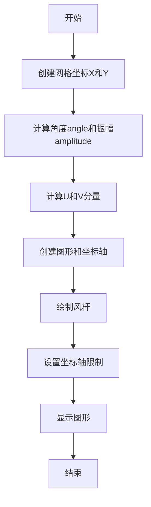
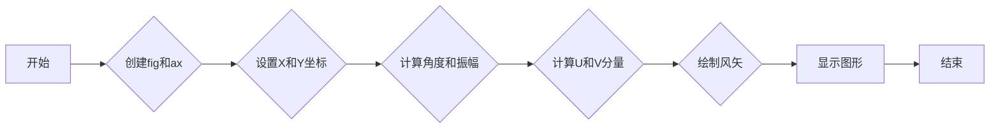

# `matplotlib\galleries\plot_types\arrays\barbs.py` 详细设计文档

The code defines a function to plot a 2D field of wind barbs using matplotlib and numpy, representing wind speed and direction.

## 整体流程



## 类结构

```
BarbsPlotter
```

## 全局变量及字段


### `plt`
    
matplotlib.pyplot module for plotting

类型：`module`
    


### `np`
    
numpy module for numerical operations

类型：`module`
    


### `X`
    
2D array representing the x-coordinates of the grid

类型：`numpy.ndarray`
    


### `Y`
    
2D array representing the y-coordinates of the grid

类型：`numpy.ndarray`
    


### `angle`
    
2D array representing the angles of the wind vectors

类型：`numpy.ndarray`
    


### `amplitude`
    
2D array representing the amplitudes of the wind vectors

类型：`numpy.ndarray`
    


### `U`
    
2D array representing the u-component of the wind vectors

类型：`numpy.ndarray`
    


### `V`
    
2D array representing the v-component of the wind vectors

类型：`numpy.ndarray`
    


### `fig`
    
matplotlib figure object

类型：`matplotlib.figure.Figure`
    


### `ax`
    
matplotlib axes object

类型：`matplotlib.axes._subplots.AxesSubplot`
    


### `BarbsPlotter.X`
    
2D array representing the x-coordinates of the grid

类型：`numpy.ndarray`
    


### `BarbsPlotter.Y`
    
2D array representing the y-coordinates of the grid

类型：`numpy.ndarray`
    


### `BarbsPlotter.angle`
    
2D array representing the angles of the wind vectors

类型：`numpy.ndarray`
    


### `BarbsPlotter.amplitude`
    
2D array representing the amplitudes of the wind vectors

类型：`numpy.ndarray`
    


### `BarbsPlotter.U`
    
2D array representing the u-component of the wind vectors

类型：`numpy.ndarray`
    


### `BarbsPlotter.V`
    
2D array representing the v-component of the wind vectors

类型：`numpy.ndarray`
    


### `BarbsPlotter.fig`
    
matplotlib figure object

类型：`matplotlib.figure.Figure`
    


### `BarbsPlotter.ax`
    
matplotlib axes object

类型：`matplotlib.axes._subplots.AxesSubplot`
    
    

## 全局函数及方法


### barbs(X, Y, U, V)

Plot a 2D field of wind barbs.

参数：

- `X`：`numpy.ndarray`，二维网格的X坐标。
- `Y`：`numpy.ndarray`，二维网格的Y坐标。
- `U`：`numpy.ndarray`，二维网格的U分量（风速沿X轴方向的分量）。
- `V`：`numpy.ndarray`，二维网格的V分量（风速沿Y轴方向的分量）。

返回值：`None`，该函数不返回任何值，它仅用于绘制图形。

#### 流程图


#### 带注释源码

```python
"""
=================
barbs(X, Y, U, V)
=================
Plot a 2D field of wind barbs.

See `~matplotlib.axes.Axes.barbs`.
"""
import matplotlib.pyplot as plt
import numpy as np

plt.style.use('_mpl-gallery-nogrid')

# make data:
X, Y = np.meshgrid([1, 2, 3, 4], [1, 2, 3, 4])
angle = np.pi / 180 * np.array([[15., 30, 35, 45],
                                [25., 40, 55, 60],
                                [35., 50, 65, 75],
                                [45., 60, 75, 90]])
amplitude = np.array([[5, 10, 25, 50],
                      [10, 15, 30, 60],
                      [15, 26, 50, 70],
                      [20, 45, 80, 100]])
U = amplitude * np.sin(angle)
V = amplitude * np.cos(angle)

# plot:
fig, ax = plt.subplots()

ax.barbs(X, Y, U, V, barbcolor='C0', flagcolor='C0', length=7, linewidth=1.5)

ax.set(xlim=(0, 4.5), ylim=(0, 4.5))

plt.show()
```


### BarbsPlotter.plot

该函数用于绘制二维风场图，使用风矢表示风速和风向。

参数：

- `X`：`numpy.ndarray`，表示风场在X轴上的坐标。
- `Y`：`numpy.ndarray`，表示风场在Y轴上的坐标。
- `U`：`numpy.ndarray`，表示风场在X轴方向上的风速分量。
- `V`：`numpy.ndarray`，表示风场在Y轴方向上的风速分量。

返回值：`None`，该函数不返回任何值。

#### 流程图



#### 带注释源码

```python
"""
=================
barbs(X, Y, U, V)
=================
Plot a 2D field of wind barbs.

See `~matplotlib.axes.Axes.barbs`.
"""
import matplotlib.pyplot as plt
import numpy as np

plt.style.use('_mpl-gallery-nogrid')

# make data:
X, Y = np.meshgrid([1, 2, 3, 4], [1, 2, 3, 4])
angle = np.pi / 180 * np.array([[15., 30, 35, 45],
                                [25., 40, 55, 60],
                                [35., 50, 65, 75],
                                [45., 60, 75, 90]])
amplitude = np.array([[5, 10, 25, 50],
                      [10, 15, 30, 60],
                      [15, 26, 50, 70],
                      [20, 45, 80, 100]])
U = amplitude * np.sin(angle)
V = amplitude * np.cos(angle)

# plot:
fig, ax = plt.subplots()

ax.barbs(X, Y, U, V, barbcolor='C0', flagcolor='C0', length=7, linewidth=1.5)

ax.set(xlim=(0, 4.5), ylim=(0, 4.5))

plt.show()
```


## 关键组件


### 张量索引

张量索引用于在多维数组（张量）中定位和访问特定元素。

### 惰性加载

惰性加载是一种编程技术，它延迟对象的初始化，直到实际需要时才进行。这有助于提高性能和减少资源消耗。

### 反量化支持

反量化支持是指系统或库能够处理和解释量化数据的能力，通常用于优化模型大小和加速推理过程。

### 量化策略

量化策略是指将浮点数数据转换为固定点数表示的方法，以减少模型大小和提高计算效率。


## 问题及建议


### 已知问题

-   {问题1}：代码中使用了硬编码的样式设置 `plt.style.use('_mpl-gallery-nogrid')`，这可能导致在不同环境中样式不一致的问题。
-   {问题2}：数据生成部分使用了固定的网格和角度，这限制了代码的通用性，无法处理不同大小的网格或不同的风向数据。
-   {问题3}：代码没有提供任何错误处理机制，如果输入数据有问题，可能会导致程序崩溃。

### 优化建议

-   {建议1}：移除硬编码的样式设置，改为使用配置文件或环境变量来控制样式。
-   {建议2}：将数据生成部分抽象为一个函数，允许用户指定网格大小和风向数据，提高代码的通用性。
-   {建议3}：添加异常处理机制，确保在输入数据有问题时程序能够优雅地处理错误，并提供有用的错误信息。
-   {建议4}：考虑将绘图功能封装成一个类，以便更好地管理绘图状态和配置。
-   {建议5}：如果该代码是库的一部分，应该提供文档说明如何使用该函数，包括参数的详细说明和示例代码。


## 其它


### 设计目标与约束

- 设计目标：实现一个能够绘制二维风场条形图的函数，用于可视化风速和风向。
- 约束条件：使用matplotlib库进行绘图，数据输入为风速和风向角度，输出为图形化的风场条形图。

### 错误处理与异常设计

- 错误处理：函数应能够处理无效输入，如非数值类型或超出预期范围的数值。
- 异常设计：使用try-except语句捕获可能发生的异常，并给出清晰的错误信息。

### 数据流与状态机

- 数据流：输入数据（风速和风向角度）通过函数处理，生成绘图数据，最终通过matplotlib库绘制图形。
- 状态机：函数执行过程中没有明确的状态转换，但存在输入处理、绘图和显示的顺序。

### 外部依赖与接口契约

- 外部依赖：matplotlib库用于绘图，numpy库用于数学运算。
- 接口契约：函数`barbs`接受四个参数（X, Y, U, V），返回一个matplotlib图形对象。

### 测试用例

- 测试用例：提供不同风速和风向角度的数据，验证函数能否正确绘制风场条形图。

### 性能考量

- 性能考量：函数应尽可能高效地处理数据，减少不必要的计算和内存占用。

### 安全性考量

- 安全性考量：确保输入数据的有效性，防止恶意输入导致程序崩溃或数据泄露。

### 可维护性与可扩展性

- 可维护性：代码结构清晰，易于理解和修改。
- 可扩展性：函数设计允许未来添加更多功能，如不同类型的条形图或自定义样式。

### 文档与注释

- 文档：提供详细的函数文档，包括参数描述、返回值描述和示例。
- 注释：在代码中添加必要的注释，解释复杂逻辑和关键步骤。

### 代码风格与规范

- 代码风格：遵循PEP 8编码规范，确保代码可读性和一致性。
- 规范：使用适当的命名约定和代码组织结构，提高代码质量。


    