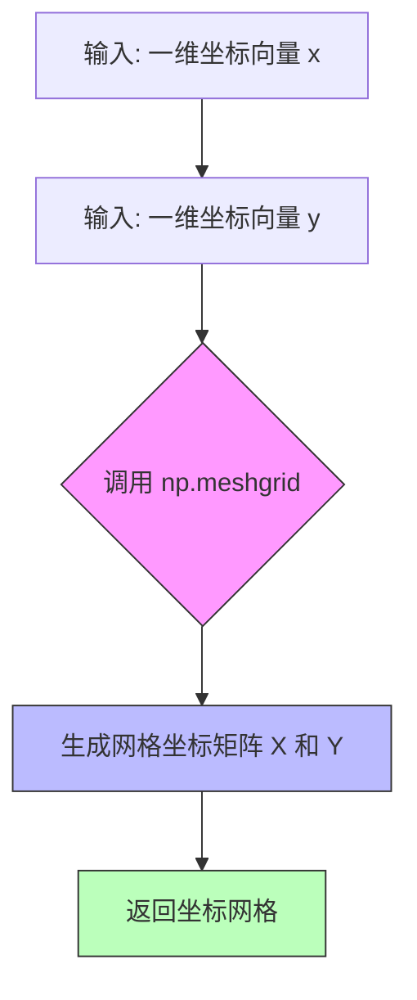
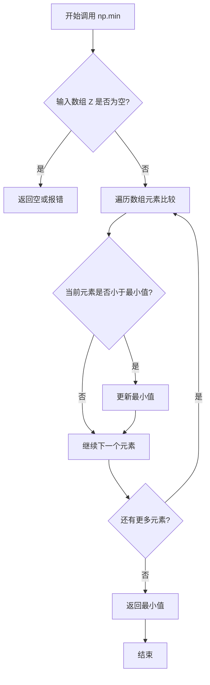
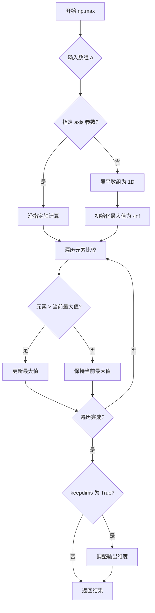
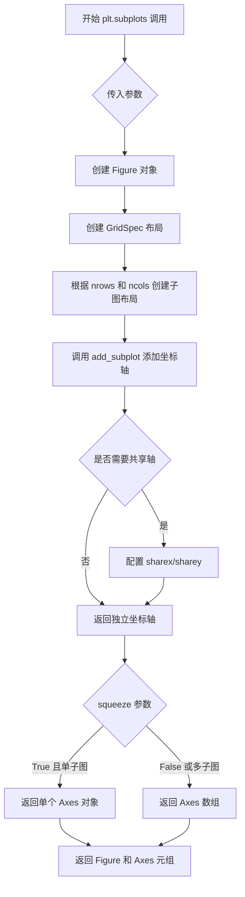
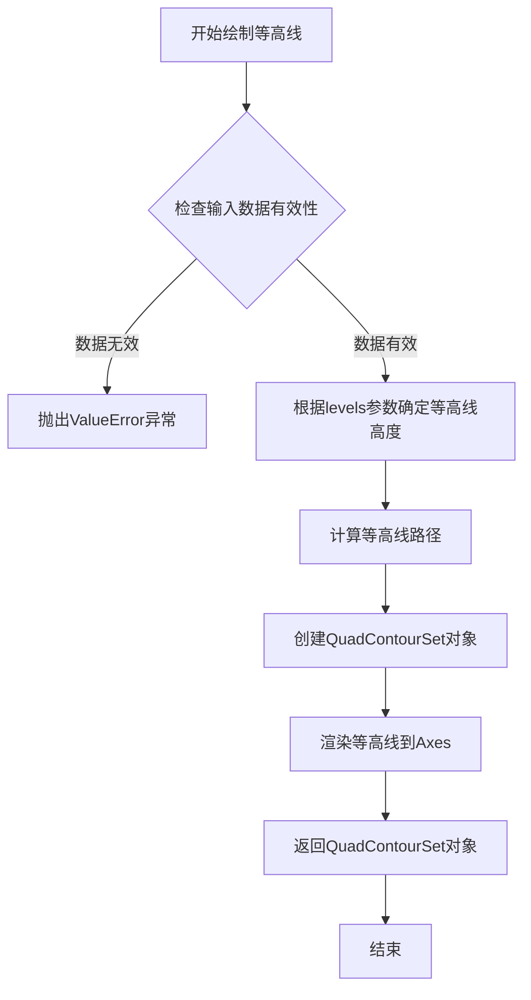
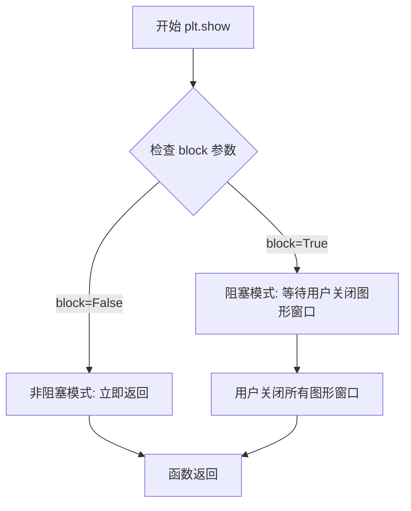

# `matplotlib\galleries\plot_types\arrays\contour.py` 详细设计文档

该代码是一个使用matplotlib绘制等高线图的可视化脚本，通过numpy生成网格数据和数学函数计算Z值，然后使用ax.contour绘制等高线并展示图形。

## 整体流程

```mermaid
graph TD
    A[开始] --> B[导入依赖库]
    B --> C[设置matplotlib样式]
    C --> D[生成网格数据X, Y]
    D --> E[计算Z值: (1-X/2+X^5+Y^3)*exp(-X^2-Y^2)]
    E --> F[计算等高线级别levels]
    F --> G[创建图形和坐标轴]
G --> H[绘制等高线: ax.contour]
    H --> I[显示图形: plt.show()]
    I --> J[结束]
```

## 类结构

```
该代码为过程式脚本，无类层次结构
仅包含模块级变量和函数调用
```

## 全局变量及字段


### `X`
    
网格X坐标，由np.meshgrid生成

类型：`numpy.ndarray`
    


### `Y`
    
网格Y坐标，由np.meshgrid生成

类型：`numpy.ndarray`
    


### `Z`
    
对应网格点的函数值，使用复杂数学公式计算

类型：`numpy.ndarray`
    


### `levels`
    
等高线的级别数组，从Z的最小值到最大值等分为7个级别

类型：`numpy.ndarray`
    


### `fig`
    
图形对象，用于管理整个图形

类型：`matplotlib.figure.Figure`
    


### `ax`
    
坐标轴对象，用于绑定绘图元素

类型：`matplotlib.axes.Axes`
    


    

## 全局函数及方法


### `np.meshgrid`

生成坐标网格矩阵，用于创建二维或三维网格坐标。

参数：

- `np.linspace(-3, 3, 256)`：`ndarray`，第一个维度的一维坐标向量，从-3到3生成256个等间距点
- `np.linspace(-3, 3, 256)`：`ndarray`，第二个维度的一维坐标向量，从-3到3生成256个等间距点

返回值：`tuple`，包含两个二维数组 (X, Y)，分别表示网格的 x 坐标和 y 坐标

#### 流程图



#### 带注释源码

```python
# 调用 np.meshgrid 生成坐标网格
# 输入: 两个一维数组 (向量)，定义 x 和 y 轴的坐标范围
# 输出: 两个二维矩阵，分别包含每个网格点的 x 坐标和 y 坐标

X, Y = np.meshgrid(
    np.linspace(-3, 3, 256),  # 参数1: x轴坐标向量，范围[-3, 3]，共256个点
    np.linspace(-3, 3, 256)   # 参数2: y轴坐标向量，范围[-3, 3]，共256个点
)

# 结果:
# X 矩阵: 每行相同，包含x坐标
# Y 矩阵: 每列相同，包含y坐标
# 两个矩阵形状均为 (256, 256)，构成 256x256 的网格
```


### `np.linspace`

`np.linspace` 是 NumPy 库中的一个函数，用于在指定的间隔内生成等间距的数值序列，返回一个一维数组。该函数常用于创建测试数据、坐标轴和数值插值场景。

参数：

- `start`：`array_like`，序列的起始值
- `stop`：`array_like`，序列的结束值（除非 `endpoint` 为 False）
- `num`：`int`，要生成的样本数量，默认为 50
- `endpoint`：`bool`，如果为 True，则 stop 是最后一个样本；否则不包括在内，默认为 True
- `retstep`：`bool`，如果为 True，则返回 (samples, step)，其中 step 是样本之间的间距
- `dtype`：`dtype`，输出数组的数据类型
- `axis`：`int`，当 stop 是类似数组的情况时，插值所沿的轴

返回值：`ndarray`，等间距的数值序列

#### 流程图

```mermaid
flowchart TD
    A[开始 np.linspace] --> B{检查参数有效性}
    B --> C{num > 0?}
    C -->|否| D[抛出 ValueError]
    C -->|是| E{endpoint = True?}
    E -->|是| F[计算样本数 = num]
    E -->|否| G[计算样本数 = num - 1]
    F --> H{retstep = True?}
    G --> H
    H -->|是| I[计算步长 step = (stop - start) / (num - 1)]
    H -->|否| J[计算步长 step = (stop - start) / num]
    I --> K[生成等间距数组]
    J --> K
    K --> L{需要 dtype 转换?}
    L -->|是| M[转换为指定 dtype]
    L -->|否| N{retstep = True?}
    M --> N
    N -->|是| O[返回 数组 和 step 元组]
    N -->|否| P[返回数组]
    O --> Q[结束]
    P --> Q
```

#### 带注释源码

```python
def linspace(start, stop, num=50, endpoint=True, retstep=False, dtype=None, axis=0):
    """
    返回指定间隔内的等间距数字序列。
    
    参数:
        start: 序列的起始值
        stop: 序列的结束值（取决于endpoint参数）
        num: 要生成的样本数量，默认为50
        endpoint: 是否包含结束点，默认为True
        retstep: 是否返回步长，默认为False
        dtype: 输出数组的数据类型
        axis: 当start/stop是数组时，沿此轴进行插值
    
    返回:
        ndarray: 等间距的数字序列
    """
    # 步骤1：验证num参数的有效性
    if num <= 0:
        return np.empty(0, dtype=dtype)
    
    # 步骤2：计算样本数
    # 如果endpoint为True，则包含结束点，样本数为num
    # 如果endpoint为False，则不包含结束点，样本数为num-1
    delta = stop - start
    if endpoint:
        num -= 1
    
    # 步骤3：生成等间距数组
    # 使用arange生成序列，然后乘以步长并加上起始值
    step = delta / num if num > 0 else delta * 0
    y = np.arange(num + 1, dtype=dtype) * step + start
    
    # 步骤4：处理endpoint=False的情况
    # 当endpoint=False时，需要移除最后一个元素
    if not endpoint:
        y = y[:-1]
    
    # 步骤5：根据retstep决定返回值
    if retstep:
        return y, step
    else:
        return y
```


### `np.min`

计算数组中的最小值，沿指定轴或所有元素返回最小值。

参数：

-  `a`：`array_like`，输入数组，即代码中的变量 `Z`，包含网格数据的二维数组
-  `axis`：`int`（可选），沿指定轴计算最小值，默认为 None 表示展平数组
-  `out`：`ndarray`（可选），存放结果的输出数组
-  `keepdims`：`bool`（可选），是否保持维度
-  `initial`：`scalar`（可选），初始值
-  `where`：`array_like`（可选），用于比较的元素

返回值：`numpy scalar 或 ndarray`，返回数组中的最小值。如果输入是整数数组，返回值类型为 numpy 整数类型；如果是浮点数数组，返回浮点类型。

#### 流程图



#### 带注释源码

```python
# 代码中实际调用方式
levels = np.linspace(np.min(Z), np.max(Z), 7)

# np.min 函数内部简化逻辑（注释说明）
def np_min(a, axis=None, out=None, keepdims=False, initial=None, where=True):
    """
    计算最小值函数的核心逻辑：
    
    a: 输入的数组 Z，形状为 (256, 256) 的二维网格数据
       Z = (1 - X/2 + X**5 + Y**3) * np.exp(-X**2 - Y**2)
       
    1. 函数接收输入数组 a（即 Z）
    2. 根据 axis 参数决定计算方式：
       - axis=None: 将数组展平后找全局最小值
       - axis=0/1: 沿指定轴找最小值
    3. 逐元素比较，找到最小值
    4. 返回最小值给 np.linspace 使用
    
    在本例中：np.min(Z) 返回 Z 数组中的最小值（约 -1.0 左右）
    用于确定等高线图的最低等高线级别
    """
    pass  # 实际实现由 NumPy 提供
```


### `np.max`

`np.max` 是 NumPy 库中的核心函数之一，用于计算数组元素中的最大值。该函数支持沿指定轴计算最大值，并可返回最大值及其索引位置。

参数：

- `a`：`array_like`，输入数组，要计算最大值的数组或数组类对象
- `axis`：`int` 或 `tuple`（可选），指定计算最大值的轴，默认为 `None` 表示展平数组
- `out`：`ndarray`（可选），放置结果的替代输出数组
- `keepdims`：`bool`（可选），如果为 `True`，输出的维度将与输入相同
- `initial`：`scalar`（可选），用于比较的初始值
- `where`：`array_like of bool`（可选），元素参与最大值计算的掩码

返回值：``ndarray` 或 `scalar`，返回数组的最大值，如果 `axis` 为 `None` 则返回标量

#### 流程图



#### 带注释源码

```python
def max(a, axis=None, out=None, keepdims=np._NoValue, initial=np._NoValue, where=np._NoValue):
    """
    返回数组的最大值或沿轴的最大值。
    
    参数:
        a: array_like
            要查找最大值的数组。
        axis: int, optional
            沿着哪个轴计算最大值。默认是展平数组。
        out: ndarray, optional
            替代输出数组，用于存放结果。
        keepdims: bool, optional
            如果为True，减少的轴在结果中保留为维度为1的维度。
        initial: scalar, optional
            最小值的初始值。
        where: array_like of bool, optional
            元素参与比较的掩码。
    
    返回:
        max: ndarray or scalar
            返回数组的最大值。如果指定了axis，则返回沿该轴的最大值。
    """
    if axis is None:
        # 未指定轴：将数组展平为1D并计算最大值
        return _amax._core_impl(a, axis=axis, out=out, keepdims=keepdims,
                                initial=initial, where=where)
    else:
        # 指定轴：沿指定轴计算最大值
        return _amax._core_impl(a, axis=axis, out=out, keepdims=keepdims,
                                initial=initial, where=where)

# 实际实现（在 C 级别优化）
def _core_impl(a, axis=None, out=None, keepdims=False, initial=-inf, where=None):
    """
    核心实现逻辑：
    1. 处理输入数组，转换为 ndarray
    2. 处理 axis 参数，确定计算维度
    3. 使用向量化操作找到最大值
    4. 处理 where 掩码（如提供）
    5. 应用 keepdims 调整输出形状
    """
    arr = asanyarray(a)
    
    # 处理 where 参数
    if where is not None:
        # 仅在满足条件的元素中找最大值
        arr = where(arr, arr, initial)
    
    # 处理 initial 参数（Python 3.9+）
    if initial is not np._NoValue:
        # 将 initial 与数组元素比较
        arr = maximum(arr, initial)
    
    # 调用底层的 ufunc maximum 获取结果
    res = _maximum(arr, axis=axis, out=out, keepdims=keepdims)
    
    return res
```


### `plt.style.use`

设置 matplotlib 的绘图样式，通过修改全局 rcParams 参数来改变图形的视觉外观，如背景色、网格、字体等。

参数：

- `name`：str 或 str 列表或 Path 或 dict，要使用的样式名称、样式文件路径、样式字典或样式列表。常见的内置样式包括 `'default'`、`' seaborn-v0_8'`、`'_mpl-gallery-nogrid'` 等。
- `after`：str，可选参数，指定在应用新样式之前还是之后执行，值为 `'default'` 表示重置后再应用，或 `'before'` 表示在当前样式之前插入。

返回值：`None`，该函数直接修改 matplotlib 的全局配置，不返回任何值。

#### 流程图

```mermaid
flowchart TD
    A[开始 plt.style.use] --> B{判断 name 类型}
    B --> C[str 类型}
    B --> D[list 类型]
    B --> E[dict 类型}
    B --> F[Path 类型}
    C --> G{是否为 'default'}
    G -->|是| H[调用 _set_style 重置为默认样式]
    G -->|否| I[构建样式文件路径]
    I --> J[读取样式文件]
    J --> K[解析样式参数]
    K --> L[更新全局 rcParams]
    D --> M[遍历列表递归调用 style.use]
    E --> N[直接解析字典参数]
    F --> O[将 Path 转换为字符串路径]
    O --> J
    L --> P[完成样式应用]
    M --> P
    N --> P
    H --> P
```

#### 带注释源码

```python
def use(style, after='default'):
    """
    使用给定的样式参数设置 matplotlib 的 rcParams。
    
    Parameters
    ----------
    style : str, list, dict, or Path
        样式名称、样式文件路径、样式字典或样式列表。
        - str: 内置样式名或样式文件路径
        - list: 多个样式的列表，按顺序应用
        - dict: 直接提供 rcParams 字典
        - Path: 样式文件路径对象
    after : str, optional
        指定应用顺序:
        - 'default': 先重置为默认样式，再应用新样式
        - 'before': 在当前样式之前插入新样式
    """
    # 导入必要的模块
    import matplotlib.style as mstyle
    from matplotlib import RcParams
    
    # 处理样式列表
    if isinstance(style, list):
        for s in style:
            use(s, after=after)
        return
    
    # 处理字典类型的样式配置
    if isinstance(style, dict):
        # 直接使用字典更新 rcParams
        # after 参数在此情况下不适用
        _set_style(style)
        return
    
    # 处理 Path 对象
    style = _load_style_file_from_path(style)
    
    # 'default' 是一个特殊值，表示重置所有样式
    if style == 'default':
        _set_style(default_params)
        return
    
    # 读取并解析样式文件
    # 样式文件通常是 Python 脚本，定义 rcParams 字典
    style_dict = _read_style_file(style)
    
    # 根据 after 参数决定应用方式
    if after == 'default':
        # 先重置为默认，再应用新样式
        _set_style(default_params)
        _set_style(style_dict)
    elif after == 'before':
        # 在当前样式之前插入
        # 将新样式合并到现有样式的前面
        _set_style(style_dict, merge=True)
    else:
        raise ValueError("'after' must be 'default' or 'before'")
```

#### 样式文件解析示例

```python
def _read_style_file(style):
    """
    读取并执行样式文件，返回 rcParams 字典。
    """
    # 样式文件路径通常位于 matplotlib/mpl-data/stylelib/
    # 用户自定义样式可以在当前目录或 matplotlib 配置目录中
    
    # 使用 exec 执行样式文件
    # 样式文件应该定义一个名为 'style' 的字典变量
    style_dict = {}
    with open(style) as f:
        exec(compile(f.read(), style, 'exec'), {}, style_dict)
    
    return style_dict

def _set_style(style, merge=False):
    """
    将样式参数应用到全局 rcParams。
    
    Parameters
    ----------
    style : dict
        要应用的 rcParams 字典
    merge : bool
        是否与现有参数合并，False 表示完全覆盖
    """
    if merge:
        # 合并模式：更新现有参数
        rcParams.update(style)
    else:
        # 覆盖模式：先清空，再设置新值
        for key in list(rcParams.keys()):
            del rcParams[key]
        rcParams.update(style)
```

#### 关键技术细节

1. **全局状态修改**：该函数直接修改 `matplotlib.rcParams` 全局字典，影响后续所有绘图操作。

2. **样式查找路径**：
   - 内置样式：`matplotlib/mpl-data/stylelib/`
   - 用户样式：`~/.config/matplotlib/` (Linux) 或 `%USERPROFILE%\.matplotlib\` (Windows)
   - 当前工作目录

3. **样式文件格式**：通常是 Python 脚本，定义包含 rcParams 键值对的字典。

4. **样式继承**：可以基于现有样式创建新样式，只需导入并修改部分参数。


### `plt.subplots`

plt.subplots 是 matplotlib.pyplot 模块中的函数，用于创建一个新的图形窗口（Figure）以及一个或多个坐标轴（Axes）对象。该函数是 Matplotlib 中最常用的绘图初始化方法之一，它封装了 Figure 创建、子图布局和坐标轴生成的完整流程，使用户能够快速准备绘图环境。

参数：

- `nrows`：`int`，默认值 1，表示子图的行数
- `ncols`：`int`，默认值 1，表示子图的列数
- `sharex`：`bool` 或 `str`，默认值 False，是否共享 x 轴
- `sharey`：`bool` 或 `str`，默认值 False，是否共享 y 轴
- `squeeze`：`bool`，默认值 True，是否压缩返回的 Axes 数组维度
- `width_ratios`：`array-like`，子图宽度比例
- `height_ratios`：`array-like`，子图高度比例
- `subplot_kw`：`dict`，传递给 add_subplot 的关键字参数
- `gridspec_kw`：`dict`，传递给 GridSpec 的关键字参数
- `**fig_kw`：传递给 Figure 构造函数的关键字参数

返回值：`tuple`，返回 (Figure, Axes) 元组，其中 Figure 是图形对象，Axes 是坐标轴对象（当 nrows > 1 或 ncols > 1 时为数组）

#### 流程图



#### 带注释源码

```python
"""
plt.subplots 函数使用示例
"""
import matplotlib.pyplot as plt
import numpy as np

# 使用默认参数创建图形和坐标轴
# 等价于 fig, ax = plt.subplots(1, 1, squeeze=True)
# 返回一个 Figure 对象和一个 Axes 对象
fig, ax = plt.subplots()

# 准备等高线图数据
# 使用 meshgrid 创建网格坐标
X, Y = np.meshgrid(
    np.linspace(-3, 3, 256),  # x 方向从 -3 到 3，共 256 个点
    np.linspace(-3, 3, 256)  # y 方向从 -3 到 3，共 256 个点
)

# 计算 Z 值（使用给定的数学公式）
Z = (1 - X/2 + X**5 + Y**3) * np.exp(-X**2 - Y**2)

# 生成等高线级别（levels）
# 从 Z 的最小值到最大值，均匀分布 7 个级别
levels = np.linspace(np.min(Z), np.max(Z), 7)

# 调用坐标轴对象的 contour 方法绘制等高线
# 参数：X, Y 为坐标网格，Z 为高度数据，levels 为等高线级别
ax.contour(X, Y, Z, levels=levels)

# 显示图形
plt.show()
```


### `ax.contour`

绘制二维等高线图，返回一个`QuadContourSet`对象，用于表示计算出的等高线集合。该方法接受X、Y坐标网格和对应的Z值数组，并可根据指定的levels参数绘制特定高度的等高线。

参数：

- `X`：`numpy.ndarray` 或 array-like，表示X坐标网格，通常通过`np.meshgrid`生成
- `Y`：`numpy.ndarray` 或 array-like，表示Y坐标网格，通常通过`np.meshgrid`生成
- `Z`：`numpy.ndarray` 或 array-like，表示Z坐标值（高度/数值），需要与X、Y形状匹配
- `levels`：`array-like`（可选），指定等高线的高度值列表，默认为自动计算

返回值：`matplotlib.contour.QuadContourSet`，包含所有等高线线段的对象，可用于进一步自定义等高线样式或获取等高线数据

#### 流程图



#### 带注释源码

```python
"""
================
contour(X, Y, Z)
================
Plot contour lines.

See `~matplotlib.axes.Axes.contour`.
"""
# 导入matplotlib绘图库
import matplotlib.pyplot as plt
# 导入numpy数值计算库
import numpy as np

# 使用内置无网格样式
plt.style.use('_mpl-gallery-nogrid')

# ==================== 数据准备阶段 ====================
# 使用meshgrid生成二维坐标网格
# np.linspace创建从-3到3的256个等间距点
X, Y = np.meshgrid(np.linspace(-3, 3, 256), np.linspace(-3, 3, 256))

# 计算Z值：使用数学公式 (1 - X/2 + X**5 + Y**3) * exp(-X**2 - Y^2)
# 这是一个典型的测试函数，产生多个峰值和谷值
Z = (1 - X/2 + X**5 + Y**3) * np.exp(-X**2 - Y**2)

# 从Z的最小值到最大值，创建7个等间距的level值
levels = np.linspace(np.min(Z), np.max(Z), 7)

# ==================== 绘图阶段 ====================
# 创建figure和axes对象
fig, ax = plt.subplots()

# 调用contour方法绘制等高线
# 参数X: 二维X坐标网格
# 参数Y: 二维Y坐标网格  
# 参数Z: 对应每个(X,Y)点的高度值
# 参数levels: 指定要绘制的等高线高度值数组
ax.contour(X, Y, Z, levels=levels)

# 显示图形
plt.show()
```


### `plt.show`

`plt.show` 是 matplotlib 库中的函数，用于显示当前打开的所有图形窗口，并将图形渲染到屏幕。在调用此函数之前，图形内容会被存储在内存中，只有调用 `show()` 后才会实际显示。

参数：此函数没有必需参数。

- `block`：布尔值（可选），默认为 `True`。如果设置为 `True`，则函数会阻塞程序执行，直到用户关闭所有图形窗口；如果设置为 `False`，则非阻塞模式运行。

返回值：`None`，该函数不返回任何值，仅用于图形显示。

#### 流程图



#### 带注释源码

```python
# plt.show() 是 matplotlib.pyplot 模块的函数
# 这不是用户代码，而是 matplotlib 库的内置函数
# 下面是调用示例：

plt.show()  # 阻塞模式显示图形，程序会暂停直到用户关闭图形窗口

# 或者

plt.show(block=False)  # 非阻塞模式，图形显示后程序继续执行
```

> **注意**：`plt.show` 是 matplotlib 库的内部函数，上述源码并非该函数的具体实现，而是展示其调用方式。该函数属于第三方库，不应提供其内部实现源码。

## 关键组件


### 数据网格生成 (meshgrid)

使用numpy的meshgrid函数生成了256x256的二维网格坐标矩阵X和Y，范围从-3到3，用于后续数学函数的输入

### 数学函数计算 (Z = (1 - X/2 + X**5 + Y**3) * np.exp(-X**2 - Y**2))

定义了一个复杂的二维数学函数，计算每个网格点上的Z值，该函数结合了多项式和指数衰减特性，用于生成等高线图的高度数据

### 等高线级别计算 (levels)

使用numpy的linspace函数从Z的最小值到最大值生成7个等间距的等高线级别，用于控制等高线的绘制密度和范围

### 等高线绘制 (ax.contour)

调用matplotlib Axes对象的contour方法，根据网格数据X、Y、Z和指定的levels绘制二维等高线图

### 图形展示 (plt.show)

使用matplotlib的show函数将绑定的图形窗口显示出来，完成整个可视化流程


## 问题及建议


### 已知问题

-   样式依赖问题：使用`plt.style.use('_mpl-gallery-nogrid')`依赖特定样式文件，在未安装matplotlib扩展库或样式文件缺失时会导致`FileNotFoundError`或样式不生效
-   硬编码参数过多：网格分辨率(256)、层级数(7)、坐标范围(-3, 3)等参数直接写死，降低代码可维护性和可配置性
-   图形信息不完整：缺少标题、坐标轴标签、颜色条等必要元素，图形可读性差
-   阻塞式显示：使用`plt.show()`会阻塞程序执行，不利于批量处理或GUI集成
-   无错误处理：缺乏对输入数据有效性、内存分配失败等情况的异常捕获
-   表达式复杂：Z值的计算表达式`(1 - X/2 + X**5 + Y**3) * np.exp(-X**2 - Y**2)`可读性差且难以复用
-   函数/类封装缺失：所有代码处于模块级，不利于测试和复用
-   魔法数值：数值7作为level数量缺乏明确语义

### 优化建议

-   移除`plt.style.use()`调用或添加fallback机制，使用默认样式
-   将网格参数、level数量等提取为配置常量或函数参数
-   添加`ax.set_title()`、`ax.set_xlabel()`、`ax.set_ylabel()`完善图形信息
-   考虑添加`fig.colorbar()`增强可视化效果
-   将Z值计算提取为独立函数`compute_Z(X, Y)`提高可读性和可测试性
-   使用面向对象方式封装为可复用的绘图函数或类
-   添加try-except异常处理，特别是对大规模数组内存分配失败的情况
-   考虑使用`plt.savefig()`替代或补充`plt.show()`以便自动化保存
-   可选：使用`contourf`添加填充等高线图增强视觉效果


## 其它


### 设计目标与约束

本代码的核心设计目标是生成一张可视化等高线图，展示二维函数Z=(1-X/2+X^5+Y^3)*exp(-X^2-Y^2)在指定区域内的值分布。主要约束包括：依赖matplotlib和numpy两个科学计算库；需要预先配置绘图样式；图形窗口会阻塞程序执行直到关闭。

### 错误处理与异常设计

当前代码缺乏显式的错误处理机制。潜在的异常情况包括：numpy.meshgrid在输入参数为负数或非数值时可能产生警告；np.linspace参数顺序错误可能导致空数组；matplotlib后端缺失或图形界面不可用时会失败；内存不足时meshgrid可能抛出MemoryError。建议添加数据验证、异常捕获和降级处理逻辑。

### 数据流与状态机

数据流经过三个主要阶段：数据生成阶段（meshgrid创建网格、函数计算Z值、linspace计算等高线级别）→ 图形初始化阶段（创建figure和axes对象）→ 渲染绘制阶段（contour计算等高线、show显示图形）。状态转换顺序为：IDLE → DATA_GENERATED → FIGURE_CREATED → CONTOUR_RENDERED → VISIBLE。

### 外部依赖与接口契约

主要依赖包括：matplotlib.pyplot库（版本3.0+）用于绘图；numpy库（版本1.15+）用于数值计算。ax.contour()方法签名：contour(X, Y, Z, levels=None, ...) → QuadContourSet对象，返回的等高线集合对象可进一步用于添加标签或修改颜色映射。

### 性能考虑

当前实现对于256x256网格性能可接受，但更大网格会导致显著性能下降。潜在优化点：使用np.meshgrid的indexing='ij'参数避免内存复制；对Z值计算结果进行缓存；使用更少的等高线级别（当前7级）；对于实时应用考虑使用contourf代替contour减少计算量。

### 可维护性与扩展性

代码采用脚本形式，缺乏模块化设计。主要改进方向：将数据生成、绘图配置、样式设置分离为独立函数；将硬编码的参数（网格大小256、级别数量7）提取为配置常量；添加类型注解提高可读性；使用argparse或配置文件管理参数。

### 测试策略

当前代码缺少测试用例。建议添加：单元测试验证数据生成函数的正确性（边界值、空输入）；集成测试验证图形输出（检查返回的QuadContourSet对象非空）；性能测试监控大数据集下的响应时间；回归测试确保样式变更不影响输出。

### 版本兼容性

代码使用了plt.style.use('_mpl-gallery-nogrid')，这是matplotlib 3.4+引入的样式。np.meshgrid在numpy 1.4+支持indexing参数。需在项目requirements中明确matplotlib>=3.4、numpy>=1.15的版本约束。

### 安全性考虑

当前代码不涉及用户输入、文件操作或网络通信，安全性风险较低。但plt.show()会加载图形界面，在无头服务器环境可能失败，建议添加环境检测逻辑或提供非交互式后端（如Agg）作为备选。

    