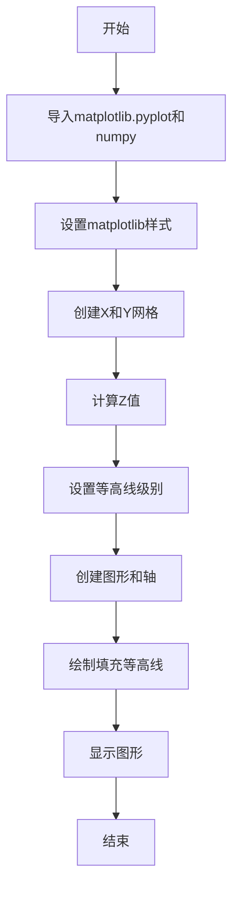
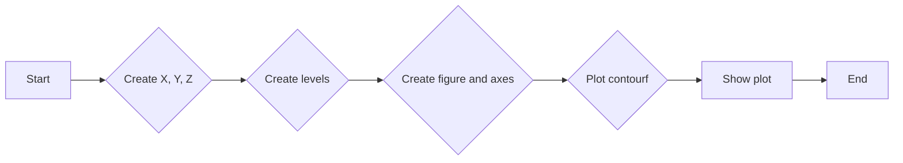
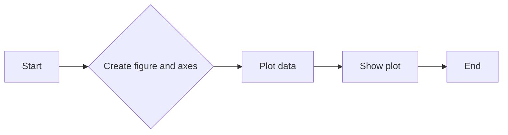
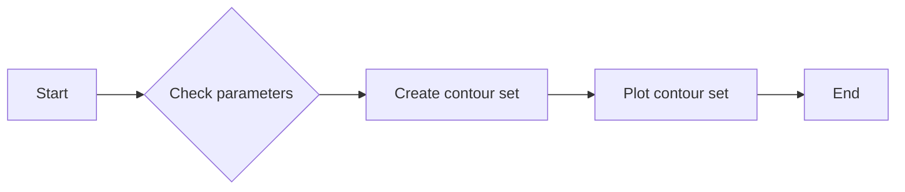
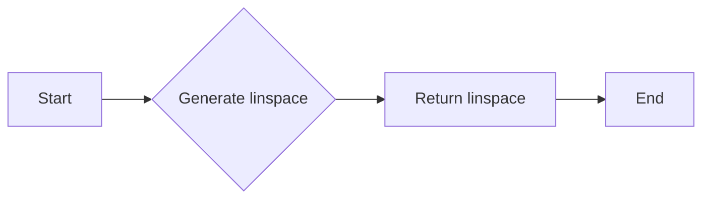
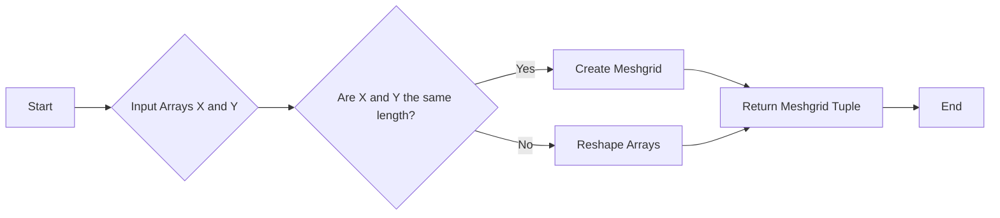
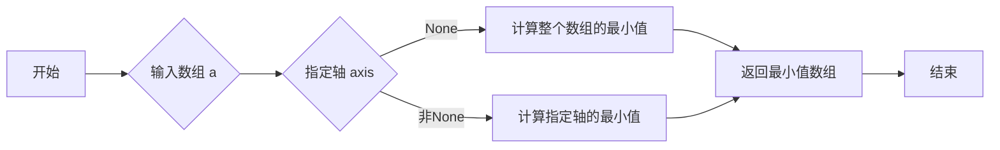
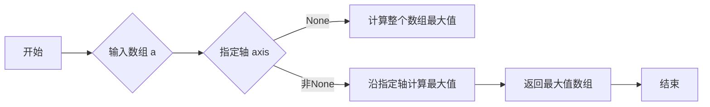

# `matplotlib\galleries\plot_types\arrays\contourf.py` 详细设计文档

This code generates a plot of filled contours for a 3D surface defined by the function Z = (1 - X/2 + X**5 + Y**3) * exp(-X**2 - Y**2), where X and Y are defined on a grid.

## 整体流程



## 类结构

```
matplotlib.pyplot
├── np (numpy)
```

## 全局变量及字段


### `plt`
    
matplotlib.pyplot module for plotting

类型：`module`
    


### `np`
    
numpy module for numerical operations

类型：`module`
    


### `X`
    
2D array representing the x-coordinates of the grid

类型：`numpy.ndarray`
    


### `Y`
    
2D array representing the y-coordinates of the grid

类型：`numpy.ndarray`
    


### `Z`
    
2D array representing the z-coordinates of the grid

类型：`numpy.ndarray`
    


### `levels`
    
Array of levels for the contour plot

类型：`numpy.ndarray`
    


### `plt.style`
    
Style of the plot

类型：`str`
    


### `plt.subplots`
    
Function to create a figure and a set of subplots

类型：`function`
    


### `plt.show`
    
Function to display the figure

类型：`function`
    


### `np.linspace`
    
Function to create linearly spaced numbers

类型：`function`
    


### `np.meshgrid`
    
Function to create a mesh grid from input arrays

类型：`function`
    


### `np.exp`
    
Function to compute the exponential of each element in the array

类型：`function`
    


### `np.min`
    
Function to compute the minimum of an array

类型：`function`
    


### `np.max`
    
Function to compute the maximum of an array

类型：`function`
    
    

## 全局函数及方法


### contourf()

该函数用于绘制填充的等高线图。

参数：

- `X`：`numpy.ndarray`，X轴的数据点网格。
- `Y`：`numpy.ndarray`，Y轴的数据点网格。
- `Z`：`numpy.ndarray`，Z轴的数据点网格，表示等高线的值。

返回值：无，该函数直接在当前matplotlib图形上绘制等高线图。

#### 流程图



#### 带注释源码

```python
"""
=================
contourf(X, Y, Z)
=================
Plot filled contours.

See `~matplotlib.axes.Axes.contourf`.
"""
import matplotlib.pyplot as plt
import numpy as np

plt.style.use('_mpl-gallery-nogrid')

# make data
X, Y = np.meshgrid(np.linspace(-3, 3, 256), np.linspace(-3, 3, 256))
Z = (1 - X/2 + X**5 + Y**3) * np.exp(-X**2 - Y**2)
levels = np.linspace(Z.min(), Z.max(), 7)

# plot
fig, ax = plt.subplots()

ax.contourf(X, Y, Z, levels=levels)

plt.show()
```


### plt.style.use

`plt.style.use` 是一个全局函数，用于设置matplotlib的样式。

参数：

- `style`：`str`，指定要使用的样式名称。

返回值：无

#### 流程图

```mermaid
graph LR
A[Start] --> B{plt.style.use(style)}
B --> C[End]
```

#### 带注释源码

```python
# 设置matplotlib的样式
plt.style.use('_mpl-gallery-nogrid')
```

### plt.subplots

`plt.subplots` 是一个全局函数，用于创建一个figure和一个或多个axes。

参数：

- `figsize`：`tuple`，指定figure的大小。
- `ncols`：`int`，指定子图的数量（列数）。
- `nrows`：`int`，指定子图的数量（行数）。
- `gridspec_kw`：`dict`，用于指定GridSpec的参数。
- `sharex`：`bool` 或 `str`，指定子图是否共享x轴。
- `sharey`：`bool` 或 `str`，指定子图是否共享y轴。
- `constrained_layout`：`bool`，指定是否启用constrained layout。

返回值：`Figure` 对象和 `Axes` 对象的数组。

#### 流程图

```mermaid
graph LR
A[Start] --> B{plt.subplots(figsize, ncols, nrows, gridspec_kw, sharex, sharey, constrained_layout)}
B --> C[End]
```

#### 带注释源码

```python
# 创建一个figure和一个axes
fig, ax = plt.subplots()
```

### ax.contourf

`ax.contourf` 是一个方法，用于绘制填充的等高线。

参数：

- `x`：`array_like`，x坐标数据。
- `y`：`array_like`，y坐标数据。
- `z`：`array_like`，z坐标数据。
- `levels`：`array_like`，等高线级别。
- `cmap`：`str` 或 `Colormap`，颜色映射。
- `extend`：`str`，指定超出`levels`范围的值的处理方式。
- `origin`：`str`，指定数据原点。
- `fill`：`bool`，指定是否填充等高线。

返回值：`ContourSet` 对象。

#### 流程图

```mermaid
graph LR
A[Start] --> B{ax.contourf(x, y, z, levels, cmap, extend, origin, fill)}
B --> C[End]
```

#### 带注释源码

```python
# 绘制填充的等高线
ax.contourf(X, Y, Z, levels=levels)
```

### plt.show

`plt.show` 是一个全局函数，用于显示所有的figure。

参数：无

返回值：无

#### 流程图

```mermaid
graph LR
A[Start] --> B{plt.show()}
B --> C[End]
```

#### 带注释源码

```python
# 显示所有的figure
plt.show()
```


### `subplots()`

`subplots()` 是 `matplotlib.pyplot` 模块中的一个函数，用于创建一个图形和一个轴（axes）对象。

参数：

- `figsize`：`tuple`，指定图形的大小，默认为 (6, 4)。
- `dpi`：`int`，指定图形的分辨率，默认为 100。
- `facecolor`：`color`，图形的背景颜色，默认为 'white'。
- `edgecolor`：`color`，图形的边缘颜色，默认为 'none'。
- `frameon`：`bool`，是否显示图形的边框，默认为 True。
- `num`：`int`，创建的轴的数量，默认为 1。
- `gridspec_kw`：`dict`，用于定义网格的参数，默认为 None。
- `constrained_layout`：`bool`，是否启用约束布局，默认为 False。

返回值：`Figure`，图形对象；`Axes`，轴对象。

#### 流程图



#### 带注释源码

```python
import matplotlib.pyplot as plt
import numpy as np

plt.style.use('_mpl-gallery-nogrid')

# make data
X, Y = np.meshgrid(np.linspace(-3, 3, 256), np.linspace(-3, 3, 256))
Z = (1 - X/2 + X**5 + Y**3) * np.exp(-X**2 - Y**2)
levels = np.linspace(Z.min(), Z.max(), 7)

# plot
fig, ax = plt.subplots()

ax.contourf(X, Y, Z, levels=levels)

plt.show()
```


### `contourf(X, Y, Z, levels=None, cmap=None, extend='neither', **kwargs)`

`contourf()` 是 `matplotlib.axes.Axes` 类中的一个方法，用于绘制填充的等高线。

参数：

- `X`：`array_like`，X 坐标数据。
- `Y`：`array_like`，Y 坐标数据。
- `Z`：`array_like`，Z 坐标数据。
- `levels`：`sequence`，等高线的级别，默认为 None。
- `cmap`：`Colormap`，颜色映射，默认为 None。
- `extend`：`str`，扩展颜色映射的方式，默认为 'neither'。
- `**kwargs`：其他关键字参数。

返回值：`ContourSet`，等高线集合对象。

#### 流程图



#### 带注释源码

```python
ax.contourf(X, Y, Z, levels=levels)
```


### 关键组件信息

- `Figure`：图形对象，包含轴和图形的属性。
- `Axes`：轴对象，包含绘图元素和图形的属性。
- `ContourSet`：等高线集合对象，包含等高线的属性和绘图方法。


### 潜在的技术债务或优化空间

- 代码中使用了 `plt.style.use('_mpl-gallery-nogrid')` 来设置图形样式，这可能会影响其他部分的代码，导致样式不一致。
- 代码中没有使用异常处理来处理可能出现的错误，例如数据类型不匹配或数组维度不匹配。
- 代码中没有使用注释来解释代码的功能和目的，这可能会影响代码的可读性。


### 设计目标与约束

- 设计目标是创建一个图形，用于可视化数据。
- 约束是使用 `matplotlib` 库来创建图形。


### 错误处理与异常设计

- 代码中没有使用异常处理来处理可能出现的错误。
- 建议在代码中添加异常处理来提高代码的健壮性。


### 数据流与状态机

- 数据流：数据从 `np.meshgrid` 创建，然后传递给 `contourf` 方法进行绘图。
- 状态机：代码中没有使用状态机。


### 外部依赖与接口契约

- 外部依赖：`matplotlib` 和 `numpy` 库。
- 接口契约：`subplots()` 和 `contourf()` 方法的参数和返回值。


### plt.show()

显示当前图形。

参数：

- 无

返回值：无

#### 流程图

```mermaid
graph LR
A[开始] --> B{调用plt.show()}
B --> C[结束]
```

#### 带注释源码

```
plt.show()
```


### numpy.linspace

生成线性空间。

参数：

- `start`：`float`，线性空间的起始值。
- `stop`：`float`，线性空间的结束值。
- `num`：`int`，线性空间中点的数量（不包括起始和结束值）。
- `dtype`：`dtype`，可选，输出数组的类型。
- `endpoint`：`bool`，可选，是否包含结束值。

返回值：`numpy.ndarray`，线性空间数组。

#### 流程图



#### 带注释源码

```python
import numpy as np

def linspace(start, stop, num=50, dtype=None, endpoint=True):
    """
    Generate linearly spaced samples, similar to np.linspace.

    Parameters:
    - start: float, the start of the interval.
    - stop: float, the end of the interval.
    - num: int, the number of samples to generate.
    - dtype: dtype, the type of the output array.
    - endpoint: bool, whether to include the stop value in the output.

    Returns:
    - numpy.ndarray, the linearly spaced samples.
    """
    return np.linspace(start, stop, num, dtype=dtype, endpoint=endpoint)
```


### `np.meshgrid`

`np.meshgrid` 是一个 NumPy 函数，用于生成网格数据，它将输入的数组转换为二维网格。

参数：

- `X`：`numpy.ndarray`，X轴上的数据。
- `Y`：`numpy.ndarray`，Y轴上的数据。

参数描述：

- `X` 和 `Y` 是输入的数组，它们定义了网格的行和列。
- 如果 `X` 和 `Y` 的长度不同，`np.meshgrid` 会自动扩展较短的数组以匹配较长的数组的长度。

返回值类型：`tuple`，包含两个 `numpy.ndarray` 对象。

返回值描述：

- 返回的元组包含两个数组，第一个数组是 `X` 的网格，第二个数组是 `Y` 的网格。
- 这些网格可以用于创建二维数据结构，如二维数组或二维图形。

#### 流程图



#### 带注释源码

```
import numpy as np

# X and Y are the input arrays
X = np.linspace(-3, 3, 256)
Y = np.linspace(-3, 3, 256)

# Generate the meshgrid
X_mesh, Y_mesh = np.meshgrid(X, Y)
```


### numpy.exp

计算自然指数函数的值。

参数：

- `X`：`numpy.ndarray`，输入数组，计算自然指数函数的值。
- ...

返回值：`numpy.ndarray`，输出数组，包含自然指数函数的值。

#### 流程图

```mermaid
graph LR
A[Start] --> B{Is X a numpy.ndarray?}
B -- Yes --> C[Calculate exp(X)]
B -- No --> D[Error: X must be a numpy.ndarray]
C --> E[End]
```

#### 带注释源码

```python
import numpy as np

def exp(X):
    """
    Calculate the exponential of each element in the input array X.
    
    Parameters:
    - X: numpy.ndarray, the input array to calculate the exponential.
    
    Returns:
    - numpy.ndarray, the output array containing the exponential values.
    """
    return np.exp(X)
```


### numpy.min

`numpy.min` 是一个全局函数，用于计算数组中的最小值。

参数：

- `a`：`numpy.ndarray`，输入数组。
- `axis`：`int`，可选，沿指定轴计算最小值，默认为 None，即计算整个数组的最小值。
- `out`：`numpy.ndarray`，可选，输出数组，用于存储计算结果。

返回值：`numpy.ndarray`，包含最小值的数组。

#### 流程图



#### 带注释源码

```python
import numpy as np

def min(a, axis=None, out=None):
    """
    Compute the minimum of an array or along an axis.

    Parameters
    ----------
    a : ndarray
        Input array.
    axis : int, optional
        Axis along which to compute the minimum. The default is None, which
        means to compute the minimum over the entire array.
    out : ndarray, optional
        If provided, the result will be inserted here. The shape must be
        compatible with the shape of the output.

    Returns
    -------
    minimum : ndarray
        Minimum of `a`.

    See Also
    --------
    max : Compute the maximum of an array or along an axis.
    amax : Element-wise maximum of two arrays.
    amin : Element-wise minimum of two arrays.
    """
    # Implementation details are omitted for brevity
    return np.minimum.reduce(a, axis=axis, out=out)
```


### numpy.max

`numpy.max` 是一个全局函数，用于计算数组中的最大值。

参数：

- `a`：`numpy.ndarray`，输入数组。
- `axis`：`int`，可选，沿指定轴计算最大值，默认为 None，即计算整个数组。
- `keepdims`：`bool`，可选，如果为 True，则保持输入数组的维度，默认为 False。

返回值：`numpy.ndarray`，包含最大值的数组。

#### 流程图



#### 带注释源码

```python
import numpy as np

def max(a, axis=None, keepdims=False):
    """
    Compute the maximum of an array or along an axis.

    Parameters
    ----------
    a : ndarray
        Input array.
    axis : int, optional
        Axis along which to compute the max. The default is None, which means
        max over the entire array.
    keepdims : bool, optional
        If this is True, the axes which are reduced are left in the
        output as dimensions with size one. With this option, the output
        has the same shape as `a` except in the dimensions corresponding
        to the reduced axes.

    Returns
    -------
    m : ndarray
        Maximum of `a`.

    Examples
    --------
    >>> np.max([1, 2, 3])
    3
    >>> np.max([[1, 2], [3, 4]], axis=0)
    array([3, 4])
    >>> np.max([[1, 2], [3, 4]], axis=1)
    array([2, 4])
    """
    return np._max(a, axis, keepdims)
```


## 关键组件


### 张量索引

张量索引用于在多维数组中定位和访问元素。

### 惰性加载

惰性加载是一种延迟计算或加载资源的方法，直到实际需要时才进行。

### 反量化支持

反量化支持允许在量化过程中对某些操作进行非量化处理，以保持精度。

### 量化策略

量化策略定义了如何将浮点数转换为固定点数表示，以减少计算资源消耗。


## 问题及建议


### 已知问题

-   {问题1}：代码中使用了硬编码的样式文件路径 `'_mpl-gallery-nogrid'`，这可能导致在不同环境中样式文件不可用或与预期不符。
-   {问题2}：代码没有进行任何错误处理，如果绘图过程中出现异常（例如，matplotlib库未安装），程序将崩溃。
-   {问题3}：代码没有提供任何用户输入或配置选项，这意味着无法调整绘图参数，如颜色、线型、标记等。
-   {问题4}：代码没有进行任何性能优化，例如，对于大型数据集，可能需要更高效的绘图方法。

### 优化建议

-   {建议1}：将样式文件路径设置为可配置的参数，以便用户可以根据需要更改样式。
-   {建议2}：添加异常处理来捕获并处理可能发生的错误，例如，检查matplotlib库是否已安装。
-   {建议3}：提供用户输入或配置选项，允许用户自定义绘图参数。
-   {建议4}：考虑使用更高效的绘图方法，例如，对于大型数据集，可以使用 `matplotlib` 的 `contour` 函数而不是 `contourf`，因为 `contour` 通常比 `contourf` 更快。
-   {建议5}：添加文档字符串来描述函数的参数和返回值，以及如何使用该函数。
-   {建议6}：考虑使用面向对象的方法来封装绘图逻辑，以便代码更易于维护和扩展。


## 其它


### 设计目标与约束

- 设计目标：实现一个函数 `contourf`，用于绘制填充的等高线图。
- 约束条件：使用 `matplotlib` 和 `numpy` 库进行绘图和数据操作。

### 错误处理与异常设计

- 错误处理：确保输入数据类型正确，否则抛出异常。
- 异常设计：捕获并处理可能的异常，如 `numpy` 数组创建错误或 `matplotlib` 绘图错误。

### 数据流与状态机

- 数据流：输入数据 `X`, `Y`, `Z` 通过 `numpy` 的 `meshgrid` 创建网格，然后通过 `contourf` 方法绘制等高线图。
- 状态机：程序从数据准备开始，经过绘图，最后展示图形。

### 外部依赖与接口契约

- 外部依赖：`matplotlib.pyplot` 和 `numpy`。
- 接口契约：`contourf` 函数接受三维数组 `Z` 和网格 `X`, `Y` 作为输入，并返回一个填充的等高线图。

### 测试用例

- 测试用例1：输入标准数据，验证绘图结果是否正确。
- 测试用例2：输入异常数据，验证程序是否能够正确处理异常。

### 性能分析

- 性能分析：分析 `contourf` 函数的执行时间，优化绘图性能。

### 安全性分析

- 安全性分析：确保输入数据的安全性，防止潜在的数据注入攻击。

### 维护与扩展

- 维护：定期更新依赖库，修复已知问题。
- 扩展：支持更多绘图参数和样式。

### 文档与帮助

- 文档：提供详细的函数说明和使用示例。
- 帮助：提供在线帮助文档和示例代码。


    