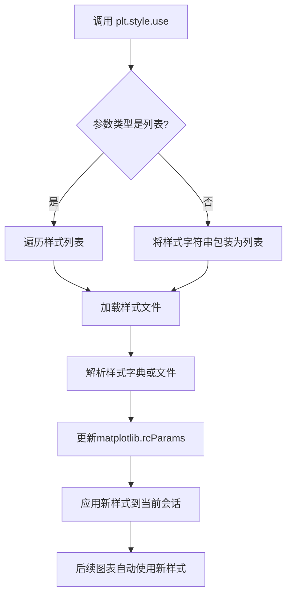
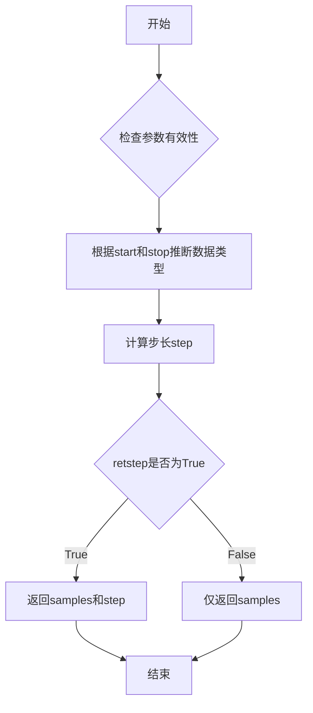
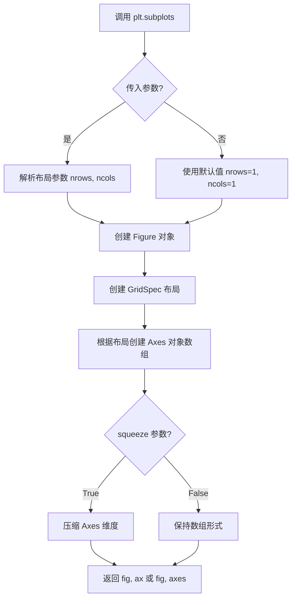
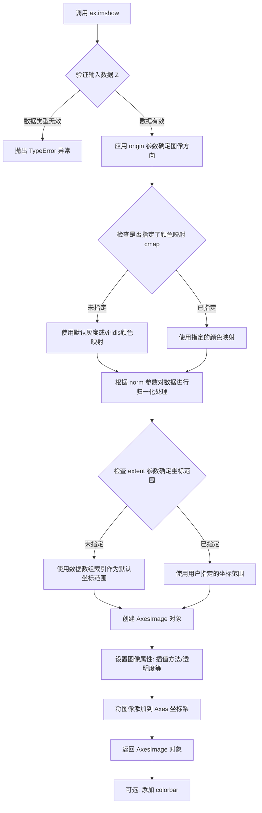
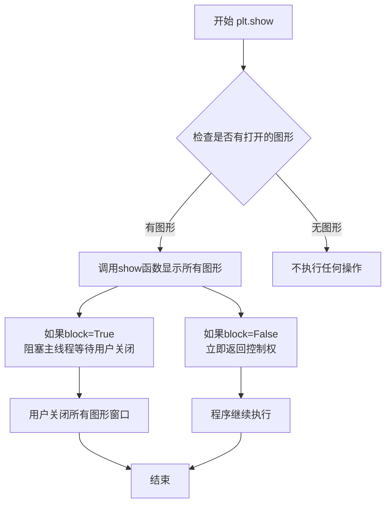

# `matplotlib\galleries\plot_types\arrays\imshow.py` 详细设计文档

该代码是一个matplotlib可视化示例，通过meshgrid生成网格坐标，计算数学函数表达式生成2D数据矩阵，并使用imshow函数将其渲染为图像显示。

## 整体流程

```mermaid
graph TD
    A[开始] --> B[导入 matplotlib.pyplot 和 numpy]
    B --> C[设置绘图样式为 '_mpl-gallery-nogrid']
    C --> D[使用 np.linspace 创建 -3 到 3 的等差数列]
    D --> E[使用 np.meshgrid 生成网格坐标 X 和 Y]
    E --> F[计算 Z = (1 - X/2 + X**5 + Y**3) * exp(-X**2 - Y**2)]
    F --> G[使用 plt.subplots 创建 fig 和 ax 对象]
    G --> H[调用 ax.imshow 显示 Z 数据, origin='lower']
    H --> I[调用 plt.show() 渲染并显示图形]
    I --> J[结束]
```

## 类结构

```
无自定义类结构
该脚本为脚本文件，仅使用第三方库的API
主要依赖: matplotlib.pyplot, numpy
```

## 全局变量及字段


### `X`
    
meshgrid 生成的 x 坐标网格

类型：`np.ndarray`
    


### `Y`
    
meshgrid 生成的 y 坐标网格

类型：`np.ndarray`
    


### `Z`
    
基于数学公式计算的 2D 图像数据矩阵

类型：`np.ndarray`
    


### `fig`
    
图形对象

类型：`matplotlib.figure.Figure`
    


### `ax`
    
坐标轴对象

类型：`matplotlib.axes.Axes`
    


    

## 全局函数及方法


### `plt.style.use`

设置matplotlib的全局绘图样式，用于控制图表的外观主题，包括颜色、线型、字体等视觉元素。

参数：

- `style`：`str` 或 `list`，样式名称（字符串）或样式名称列表（如 `'ggplot'`、`['default', 'seaborn']`）

返回值：`None`，该函数直接修改matplotlib的rcParams配置，不返回任何值。

#### 流程图



#### 带注释源码

```python
# matplotlib.pyplot.style.use 源码分析

def use(style):
    """
    使用指定的样式文件设置matplotlib的rcParams。
    
    参数:
        style : str 或 list
            - str: 单个样式名称，如 'ggplot', 'dark_background', 'seaborn'
            - list: 样式名称列表，按顺序应用，后面的样式会覆盖前面的
    
    返回值:
        None
    
    使用示例:
        plt.style.use('ggplot')           # 使用单个样式
        plt.style.use(['default', 'dark']) # 使用多个样式
    """
    
    # 样式来源可以是:
    # 1. 内置样式: 'default', 'ggplot', 'dark_background', 'seaborn'等
    # 2. 自定义样式文件: 路径字符串
    # 3. 样式字典: 直接传递rcParams字典
    
    # 内部实现步骤:
    # 1. 如果style是列表，循环应用每个样式
    # 2. 查找样式文件位置（可能在mpl_configdir/stylelib/）
    # 3. 读取样式文件（.mplstyle格式，纯文本RC参数）
    # 4. 解析RC参数为字典
    # 5. 调用 rcParams.update() 更新全局配置
    # 6. 所有后续创建的图表自动使用新样式
    
    # 在示例代码中的使用:
    plt.style.use('_mpl-gallery-nogrid')  # 设置为无网格的gallery样式
    # 这会影响后续所有plt.imshow()等绘图函数的默认行为
```

#### 关键信息说明

| 项目 | 说明 |
|------|------|
| **函数位置** | `matplotlib.pyplot.style` 模块 |
| **样式文件位置** | `~/.matplotlib/stylelib/` 目录 |
| **样式文件格式** | `.mplstyle` 文件，包含RC参数键值对 |
| **内置样式数量** | 约10+种（default, ggplot, dark_background, seaborn等） |
| **作用域** | 全局修改，影响当前Python进程的所有图表 |

#### 技术债务与优化空间

1. **样式冲突处理**：当使用多个样式时，后定义的样式会覆盖先前的，可能导致意外行为
2. **无样式回退机制**：样式加载失败时缺乏友好的错误提示和自动回退
3. **样式隔离缺失**：样式修改是全局的，无法局部应用到特定图表


### `np.meshgrid`

从一维坐标向量生成二维网格坐标矩阵，用于创建坐标网格以进行向量化计算和可视化。

参数：

- `x`：`array_like`，一维数组，表示 x 轴的坐标向量
- `y`：`array_like`，一维数组，表示 y 轴的坐标向量

返回值：`tuple`，返回两个二维数组 (X, Y)，其中 X 是按行重复的 x 坐标矩阵，Y 是按列重复的 y 坐标矩阵

#### 流程图

```mermaid
flowchart TD
    A[开始] --> B[输入一维坐标向量 x 和 y]
    B --> C[根据 indexing 参数确定网格排列方式]
    C --> D[生成 X 矩阵: x 向量按行重复]
    C --> E[生成 Y 矩阵: y 向量按列重复]
    D --> F[返回网格坐标矩阵 tuple(X, Y)]
    F --> G[结束]
```

#### 带注释源码

```python
# np.meshgrid 函数的核心实现逻辑
# 示例代码展示其在 matplotlib 绘图中的典型用法

# Step 1: 创建一维坐标向量
# np.linspace(-3, 3, 16) 生成从 -3 到 3 的 16 个等间距点
x_coords = np.linspace(-3, 3, 16)  # array([-3., -2., -1., ..., 2., 3.])
y_coords = np.linspace(-3, 3, 16)  # array([-3., -2., -1., ..., 2., 3.])

# Step 2: 调用 meshgrid 生成网格矩阵
# X 的每一行都是完整的 x_coords，Y 的每一列都是完整的 y_coords
X, Y = np.meshgrid(x_coords, y_coords)

# Step 3: 使用网格进行向量化计算
# (1 - X/2 + X**5 + Y**3) * np.exp(-X**2 - Y**2)
# 这相当于对网格上每个点应用相同的数学公式
Z = (1 - X/2 + X**5 + Y**3) * np.exp(-X**2 - Y**2)

# 结果:
# X 矩阵 shape: (16, 16)，每行相同
# Y 矩阵 shape: (16, 16)，每列相同
# Z 矩阵 shape: (16, 16)，存储每个网格点的计算结果
```


### `np.linspace`

创建等差数列（线性间隔的数值序列）

参数：

- `start`：`array_like`，序列的起始值
- `stop`：`array_like`，序列的结束值，除非`endpoint`设为`False`
- `num`：`int`，要生成的样本数量，默认值为50
- `endpoint`：`bool`，如果为`True`，则包含结束值（stop），默认为`True`
- `retstep`：`bool`，如果为`True`，则返回步长（samples和step），默认为`False`
- `dtype`：`dtype`，输出数组的数据类型，如果没有指定，则从输入推断
- `axis`：`int`，当start和stop是array_like时，结果存储的轴（默认为0）

返回值：

- `samples`：`ndarray`，返回num个样本，在闭区间[start, stop]或半开区间[start, stop)（取决于endpoint）中均匀分布
- `step`：`float`（可选），当`retstep`为`True`时返回，表示样本间的步长

#### 流程图



#### 带注释源码

```python
def linspace(start, stop, num=50, endpoint=True, retstep=False, dtype=None, axis=0):
    """
    创建等差数列（线性间隔的数值序列）
    
    参数:
        start: 序列的起始值
        stop: 序列的结束值
        num: 要生成的样本数量，默认50
        endpoint: 是否包含结束值，默认True
        retstep: 是否返回步长，默认False
        dtype: 输出数组的数据类型
        axis: 当start和stop是数组时，结果存储的轴
    
    返回:
        samples: 均匀分布的数值序列
        step: 步长（仅当retstep=True时返回）
    """
    # 检查num参数的有效性
    if num <= 0:
        return np.empty(0, dtype=dtype)
    
    # 计算步长
    if endpoint:
        step = (stop - start) / (num - 1) if num > 1 else 0.0
    else:
        step = (stop - start) / num
    
    # 生成序列
    if num == 1:
        y = np.array([start], dtype=dtype)
    else:
        y = np.arange(num, dtype=dtype) * step + start
    
    # 根据axis参数重塑数组（处理array_like输入的情况）
    # ... 省略部分实现细节
    
    if retstep:
        return y, step
    return y
```


### `plt.subplots`

`plt.subplots` 是 matplotlib.pyplot 模块中的核心函数，用于创建一个新的图形窗口及其包含的一个或多个坐标轴对象，支持灵活的多子图布局配置，是进行数据可视化的基础入口函数。

参数：

- `nrows`：`int`，默认值 1，子图网格的行数
- `ncols`：`int`，默认值 1，子图网格的列数
- `sharex`：`bool` 或 `{'none', 'all', 'row', 'col'}`，默认值 False，控制子图之间是否共享 x 轴
- `sharey`：`bool` 或 `{'none', 'all', 'row', 'col'}`，默认值 False，控制子图之间是否共享 y 轴
- `squeeze`：`bool`，默认值 True，如果为 True，则返回的坐标轴对象维度会被压缩
- `width_ratios`：`array-like`，可选，表示列宽比，长度等于 ncols
- `height_ratios`：`array-like`，可选，表示行高比，长度等于 nrows
- `subplot_kw`：字典，可选，传递给每个子图的关键字参数
- `gridspec_kw`：字典，可选，传递给 GridSpec 构造函数的关键字参数
- `**fig_kw`：关键字参数，传递给 figure() 构造函数的其他参数

返回值：`tuple(Figure, Axes)` 或 `tuple(Figure, ndarray of Axes)`，返回创建的图形对象和坐标轴对象（或坐标轴数组）

#### 流程图



#### 带注释源码

```python
import matplotlib.pyplot as plt
import numpy as np

# 设置绘图样式为无网格的 gallery 样式
plt.style.use('_mpl-gallery-nogrid')

# ========== 数据准备阶段 ==========
# 使用 meshgrid 创建网格坐标
# np.linspace(-3, 3, 16) 创建从 -3 到 3 的 16 个等间距点
X, Y = np.meshgrid(
    np.linspace(-3, 3, 16),  # x 方向 16 个点
    np.linspace(-3, 3, 16)   # y 方向 16 个点
)

# 计算 Z 值：使用复杂的数学公式生成测试数据
# 公式: (1 - X/2 + X**5 + Y**3) * exp(-X**2 - Y**2)
Z = (1 - X/2 + X**5 + Y**3) * np.exp(-X**2 - Y**2)

# ========== 绘图阶段 ==========
# 创建图形和坐标轴
# plt.subplots() 等价于 fig = plt.figure() + ax = fig.add_subplot(111)
# 返回值：fig - Figure 对象（整个图形容器）
#         ax - Axes 对象（坐标轴，用于绘制数据）
fig, ax = plt.subplots()

# 使用 imshow 在坐标轴上显示图像数据
# 参数 origin='lower' 表示将数组的第一个元素显示在左下角
# 默认 origin='upper'，第一个元素显示在左上角
ax.imshow(Z, origin='lower')

# 显示图形窗口
plt.show()
```

#### 关键组件信息

| 组件名称 | 一句话描述 |
|---------|-----------|
| `plt.subplots` | 创建图形容器和坐标轴的核心工厂函数 |
| `fig` | Figure 对象，代表整个图形窗口容器 |
| `ax` | Axes 对象，代表坐标轴，用于承载数据可视化元素 |
| `ax.imshow` | 在坐标轴上渲染二维数组数据为图像的函数 |
| `np.meshgrid` | 生成二维网格坐标的函数 |
| `plt.show()` | 显示所有已创建的图形窗口 |

#### 潜在的技术债务或优化空间

1. **硬编码参数**：图像尺寸 (16x16)、数据范围 (-3 到 3) 均硬编码在代码中，建议提取为配置参数
2. **魔法数字**：公式中的系数 (1, 2, 5, 3) 缺乏语义化命名，可封装为独立函数或配置
3. **错误处理缺失**：未对空数据、非法数值进行校验
4. **样式依赖**：`plt.style.use('_mpl-gallery-nogrid')` 依赖特定样式文件，跨环境可能失效
5. **资源未释放**：未显式调用 `plt.close(fig)` 释放图形资源

#### 其它项目

**设计目标与约束**
- 目标：展示二维函数图像的可视化效果
- 约束：依赖 matplotlib 和 numpy 库，需保证环境已安装

**错误处理与异常设计**
- 若 Z 为空数组，imshow 可能显示空白或抛出警告
- 若 origin 参数值非法，会抛出 ValueError
- 未显式捕获异常，建议添加 try-except 块

**数据流与状态机**
```
数据生成 → 图形创建 → 坐标轴绑定 → 图像渲染 → 图形显示
```

**外部依赖与接口契约**
- 依赖：`matplotlib.pyplot`, `numpy`
- 接口：plt.subplots() 返回 (Figure, Axes) 元组
- 兼容性：适用于 matplotlib 1.0+ 版本


### `matplotlib.axes.Axes.imshow`

在 matplotlib 中，`Axes.imshow` 是 `Axes` 类的一个方法，用于在二维坐标系上渲染图像数据（即 2D 常规栅格）。该方法接收图像数组、颜色映射、坐标范围等参数，创建一个 `AxesImage` 对象并将其添加到坐标系中显示。

参数：

- `Z`：`numpy.ndarray` 或类似数组对象，要显示的图像数据，可以是 2D 数组（灰度）或 3D 数组（RGB/RGBA）
- `origin`：`str`，图像原点的位置，可选 `'upper'`（默认）或 `'lower'`，`'lower'` 表示坐标原点位于左下角
- `cmap`：`str` 或 `Colormap`，可选，颜色映射名称或 Colormap 对象，用于将数值映射为颜色
- `norm`：`Normalize`，可选，数据归一化对象，用于将数据值映射到 [0, 1] 范围
- `aspect`：`str` 或 `float`，可选，控制坐标轴纵横比，可选 `'auto'`、`'equal'` 或具体数值
- `interpolation`：`str`，可选，图像插值方法，如 `'nearest'`、`'bilinear'`、`'bicubic'` 等
- `alpha`：`float`，可选，透明度，值在 0 到 1 之间
- `extent`：`tuple`，可选，图像在坐标系中的范围，格式为 `(xmin, xmax, ymin, ymax)`
- 其他可选参数：`vmin`, `vmax`, `origin`, `filternorm`, `filterrad`, `resample`, `url`, `\*\*kwargs`

返回值：`matplotlib.image.AxesImage`，返回创建的 `AxesImage` 对象，可用于进一步操作（如添加颜色条、获取数据范围等）

#### 流程图



#### 带注释源码

```python
# 示例代码展示 ax.imshow 的使用方式
import matplotlib.pyplot as plt
import numpy as np

# 使用无网格风格的绘图样式
plt.style.use('_mpl-gallery-nogrid')

# 创建网格数据和计算图像数据
# np.meshgrid 生成二维网格坐标
X, Y = np.meshgrid(
    np.linspace(-3, 3, 16),  # X 坐标: 从 -3 到 3 的 16 个点
    np.linspace(-3, 3, 16)   # Y 坐标: 从 -3 到 3 的 16 个点
)

# 计算 Z 值: 使用复杂的数学公式生成图像数据
# 公式: (1 - X/2 + X**5 + Y**3) * exp(-X**2 - Y**2)
Z = (1 - X/2 + X**5 + Y**3) * np.exp(-X**2 - Y**2)

# 创建图形和坐标轴对象
fig, ax = plt.subplots()

# 调用 imshow 方法在坐标系中显示图像
# 参数 Z: 图像数据数组 (16x16 的二维数组)
# 参数 origin='lower': 将坐标原点设置在左下角 (默认是 'upper' 左上角)
ax.imshow(Z, origin='lower')

# 显示图形窗口
plt.show()
```

#### 关键技术细节

1. **数据流向**：输入的 2D 数组 Z 经过归一化处理后，通过颜色映射（colormap）转换为 RGBA 颜色值，最后渲染到画布上

2. **origin 参数影响**：
   - `origin='upper'`: 数组第一行显示在图像顶部（坐标系 y 轴正向向上）
   - `origin='lower'`: 数组第一行显示在图像底部（坐标系 y 轴正向向上）

3. **extent 参数**：如果不指定 extent，默认使用数组索引作为坐标 (0 到 cols, 0 到 rows)

4. **返回值的应用**：可以通过返回的 AxesImage 对象调用 `set_clim()` 调整显示范围、`get_array()` 获取原始数据等


### `plt.show`

显示当前所有打开的图形窗口，是matplotlib中用于将figure对象渲染到屏幕上的最终操作。

参数：

- `block`：`bool`，可选参数（代码中未使用），默认为True。控制是否阻塞主线程直到窗口关闭。

返回值：`None`，无返回值描述

#### 流程图



#### 带注释源码

```python
# matplotlib.pyplot 的 show 函数源码结构

def show(*, block=True):
    """
    显示所有打开的图形窗口。
    
    参数:
        block (bool): 如果为True（默认值），则阻塞并等待所有窗口关闭。
                      如果为False，则立即返回，允许非阻塞显示。
    """
    # 1. 获取全局显示管理器
    # _pylab_helpers.Gcf 存储所有活动的图形数字
    managers = Gcf.get_all_fig_managers()
    
    # 2. 如果没有打开的图形，直接返回
    if not managers:
        return
    
    # 3. 对于每个图形管理器，调用其show方法
    for manager in managers:
        # 渲染图形到屏幕
        manager.show()
    
    # 4. 根据block参数决定是否阻塞
    if block:
        # 5. 阻塞主线程，进入事件循环
        # 等待用户交互关闭图形窗口
        # 这是一个内部循环，处理窗口事件
        _tight_backend.show_block()
    
    # 6. 立即返回（如果block=False）
    return None
```

在用户提供的代码上下文中的调用：

```python
# 第16行：调用 plt.show() 显示之前通过 ax.imshow(Z) 创建的图像
plt.show()

# 代码执行流程：
# 1. 导入 matplotlib.pyplot 和 numpy
# 2. 设置绘图样式为无网格
# 3. 生成网格数据 X, Y 和图像数据 Z
# 4. 创建 figure 和 axes 对象
# 5. 使用 imshow 在 axes 上绘制图像数据
# 6. 调用 plt.show() 阻塞显示图形窗口，等待用户交互
```


## 关键组件


### 数据生成模块

使用 numpy 的 meshgrid 和数学表达式生成二维网格数据 X、Y 和对应的函数值 Z。

### 图形渲染模块

使用 matplotlib 的 subplots 创建图形和坐标轴，并通过 imshow 方法将数据 Z 渲染为图像。

### 样式管理模块

通过 matplotlib 的 style.use 设置绘图样式为无网格。


## 问题及建议


### 已知问题

-   **魔法数字缺乏说明**：代码中使用了多个硬编码数值（如16、-3、3），这些关键参数的意义不明确，可维护性差
-   **NumPy全量导入**：使用 `import numpy as np` 会导入整个numpy命名空间，对于简单脚本而言，增加了不必要的内存开销和启动时间
-   **缺少异常处理机制**：数据生成和图像渲染过程没有任何错误捕获，运行时错误会导致程序直接崩溃
-   **图形资源未显式管理**：创建了fig和ax对象但未在完成后显式关闭，在长期运行或批量处理场景下可能导致资源泄漏
-   **样式依赖风险**：依赖 `_mpl-gallery-nogrid` 样式文件，如果该样式不存在或不兼容，程序将失败且错误信息不明确
-   **返回值未使用**：subplots() 返回的 fig 和 ax 对象未被利用，代码结构不够清晰

### 优化建议

-   **参数化配置**：将硬编码的网格点数16、范围-3到3等提取为常量或配置变量，提升代码可读性和可维护性
-   **按需导入**：使用 `from numpy import meshgrid, linspace, exp` 仅导入所需函数，减少内存占用
-   **添加异常处理**：使用 try-except 包裹数据生成和绘图逻辑，提供友好的错误提示
-   **上下文管理器**：使用 `with plt.style.context():` 或显式调用 `fig.close()` 管理图形生命周期
-   **样式容错处理**：在调用 `plt.style.use()` 前检查样式是否存在，或提供备用样式方案
-   **类型注解**：为函数参数和返回值添加类型提示，提升代码的可读性和可维护性


## 其它


### 设计目标与约束
本代码旨在演示matplotlib的imshow函数基本用法，以2D正则网格形式可视化数学表达式生成的数据。设计约束包括：仅依赖matplotlib和numpy两个核心库，需保持代码简洁以作为Gallery示例，目标Python版本为3.6+，兼容matplotlib 3.0+版本。

### 错误处理与异常设计
代码未显式实现错误处理机制。潜在异常包括：ImportError（缺少matplotlib或numpy依赖）、MemoryError（数据量过大导致内存不足）、TypeError（数据类型不支持）。建议改进：添加try-except块捕获导入异常，验证输入数据类型，对大数据集考虑降采样处理。

### 数据流与状态机
数据流为：numpy生成网格坐标(X,Y) → 数学公式计算生成Z矩阵 → matplotlib创建Figure和Axes对象 → imshow将Z矩阵渲染为图像 → pyplot显示图形。状态机包含：初始化状态（导入库）→ 数据准备状态（生成X,Y,Z）→ 图形创建状态（创建fig, ax）→ 渲染状态（调用imshow）→ 显示状态（plt.show()）。

### 外部依赖与接口契约
核心依赖包括：matplotlib.pyplot模块（版本≥3.0）、numpy模块（版本≥1.15）、_mpl-gallery-nogrid样式表。接口契约：meshgrid返回坐标网格数组，imshow接受Z数组和origin参数，返回AxesImage对象。样式表_mpl-gallery-nogrid为matplotlib内部样式，移除网格线显示。

### 性能考虑与优化空间
当前代码数据量较小（16x16网格），性能无明显问题。优化方向：对于更大数据集（>1000x1000），可考虑使用interpolation参数控制渲染质量，启用rasterized=True减少矢量输出体积，数据类型可选float32减少内存占用，colormap可根据数据特征选择更合适的配色方案。

### 可维护性与扩展性
代码结构清晰但扩展性有限。改进建议：将数据生成逻辑封装为函数以支持不同参数，图像配置参数提取为配置文件或命令行参数，考虑添加docstring说明各参数含义，样例代码可扩展为支持动态数据更新或交互式可视化。

### 测试策略建议
由于为示例代码，建议测试包括：导入测试（验证依赖可用性）、数据类型测试（验证Z为2D数值数组）、图形生成测试（验证返回fig和ax对象非空）、渲染测试（验证imshow调用无异常）。可使用pytest框架配合matplotlib的Agg后端进行无GUI测试。

### 版本兼容性说明
代码兼容Python 3.6+、matplotlib 3.0+、numpy 1.15+。需注意：plt.style.use在matplotlib 1.5+可用，_mpl-gallery-nogrid样式表在matplotlib 3.3+引入，origin参数默认值在不同版本可能有变化（建议显式指定origin='lower'）。

### 使用场景与最佳实践
本代码适用于：快速数据可视化原型开发、教学演示matplotlib基础功能、Gallery示例展示。最佳实践建议：显式指定figsize和dpi参数控制输出尺寸，明确设置cmap和aspect参数，添加colorbar增强可读性，考虑添加标题和轴标签提升文档化程度。

    