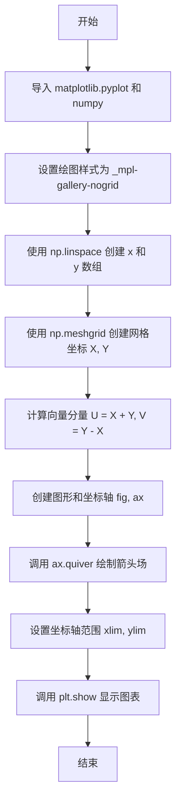
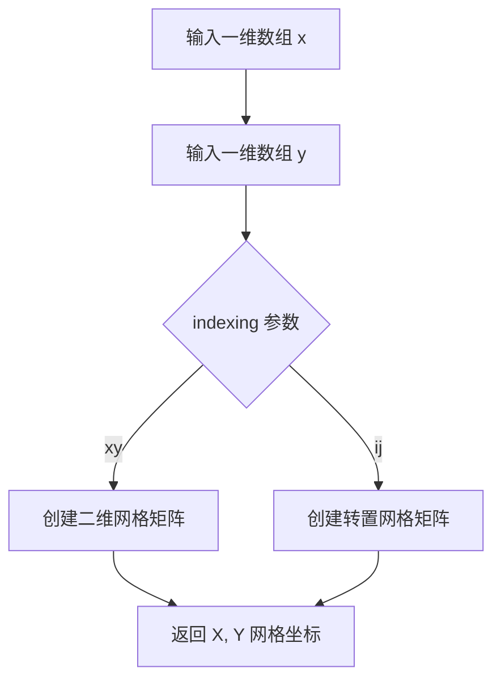
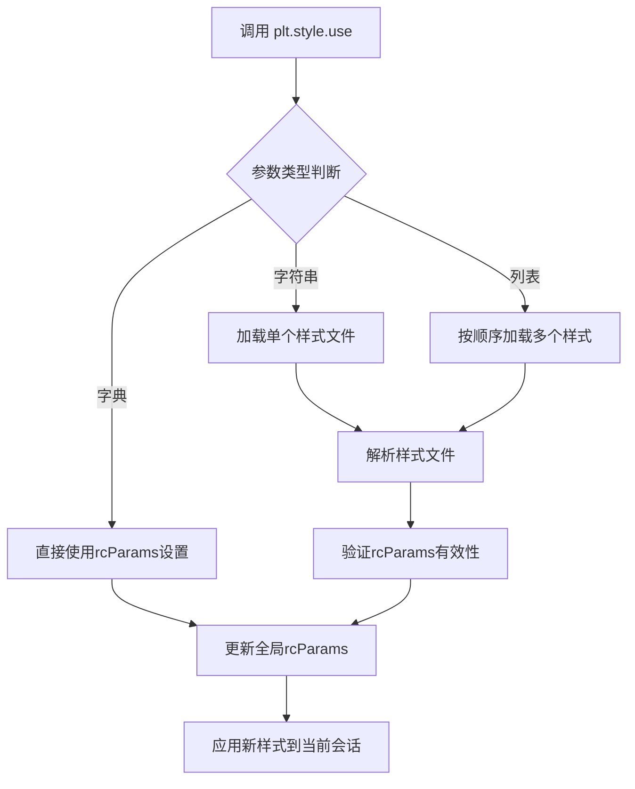
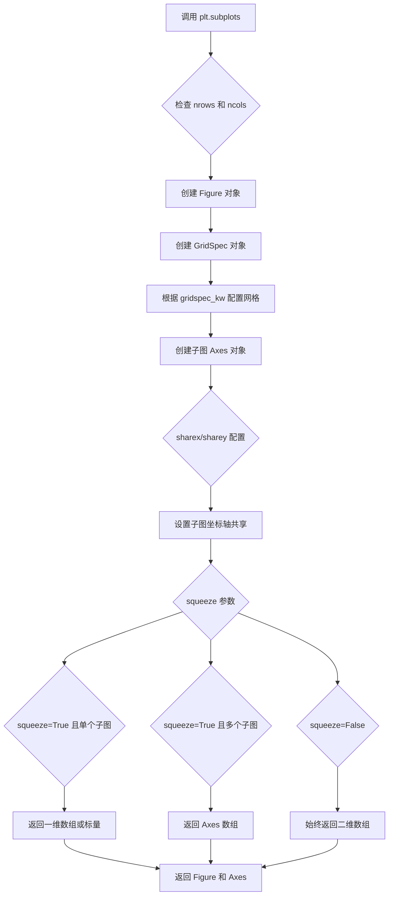
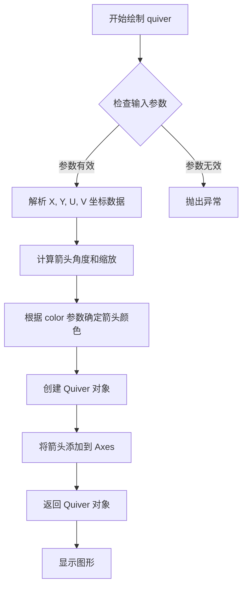
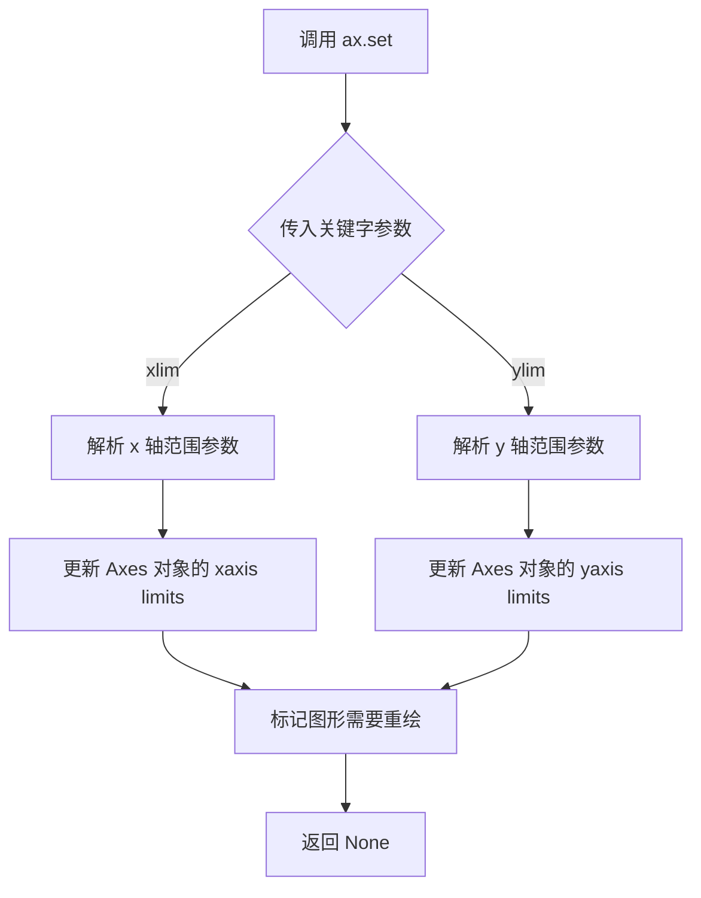
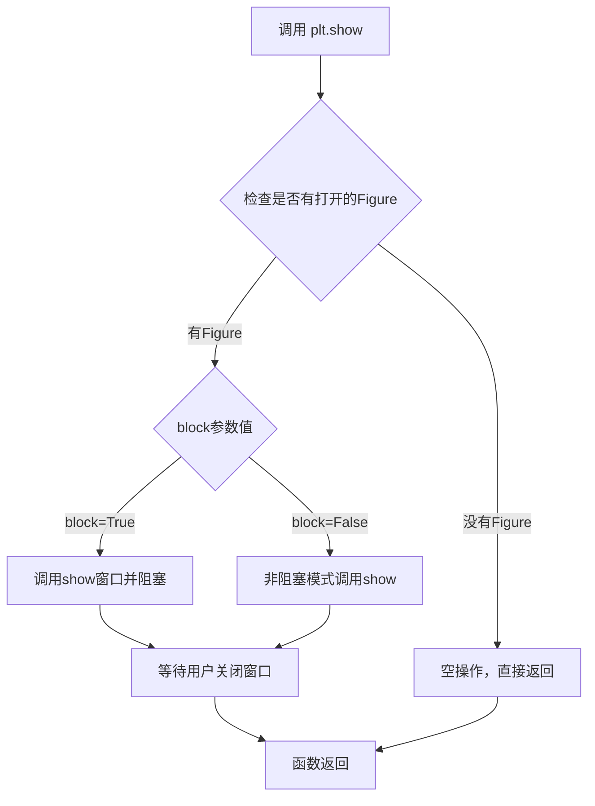

# `matplotlib\galleries\plot_types\arrays\quiver.py` 详细设计文档

这是一个使用 matplotlib 绘制 2D 箭头场（quiver plot）的示例脚本，通过创建网格数据并计算向量场，最终在坐标轴上可视化显示箭头图。

## 整体流程



## 类结构

```
本代码为脚本文件，无类层次结构
```

## 全局变量及字段


### `x`
    
x 轴坐标数组

类型：`numpy.ndarray`
    


### `y`
    
y 轴坐标数组

类型：`numpy.ndarray`
    


### `X`
    
网格 x 坐标矩阵

类型：`numpy.ndarray`
    


### `Y`
    
网格 y 坐标矩阵

类型：`numpy.ndarray`
    


### `U`
    
箭头 x 方向分量

类型：`numpy.ndarray`
    


### `V`
    
箭头 y 方向分量

类型：`numpy.ndarray`
    


### `fig`
    
图形对象

类型：`matplotlib.figure.Figure`
    


### `ax`
    
坐标轴对象

类型：`matplotlib.axes.Axes`
    


    

## 全局函数及方法


### `np.linspace`

生成指定范围内的等间距数组。

参数：

- `start`：`float`，序列的起始值
- `stop`：`float`，序列的结束值
- `num`：`int`（可选，默认值为50），生成样本的数量
- `endpoint`：`bool`（可选，默认值为True），如果为True，则stop是最后一个样本，否则不包括
- `retstep`：`bool`（可选，默认值为False），如果为True，则返回(step)
- `dtype`：`dtype`（可选），输出数组的数据类型

返回值：`ndarray`，等间距的数组

#### 流程图

```mermaid
flowchart TD
    A[开始] --> B[验证输入参数]
    B --> C{endpoint是否为True}
    C -->|是| D[计算步长 = (stop - start) / (num - 1)]
    C -->|否| E[计算步长 = (stop - start) / num]
    D --> F[生成等间距数组]
    E --> F
    F --> G{retstep是否为True}
    G -->|是| H[返回数组和步长]
    G -->|否| I[仅返回数组]
    H --> J[结束]
    I --> J
```

#### 带注释源码

```python
# 代码示例中np.linspace的使用
x = np.linspace(-4, 4, 6)
# 解释：
# start = -4: 序列起始值
# stop = 4: 序列结束值  
# num = 6: 生成6个等间距的点
# 结果: array([-4., -2.4, -0.8, 0.8, 2.4, 4.])
```


### `np.meshgrid`

生成网格坐标矩阵，用于在二维平面上创建坐标网格。

参数：

- `x`：`array_like`，一维数组，表示 x 轴坐标
- `y`：`array_like`，一维数组，表示 y 轴坐标

返回值：`(X, Y)`，两个 `ndarray` 组成的元组，分别表示 x 坐标和 y 坐标的二维网格矩阵

#### 流程图



#### 带注释源码

```python
"""
np.meshgrid 函数源码解析
========================
生成坐标矩阵，用于在二维/三维空间中创建网格坐标
"""

# 在给定代码中的实际使用
x = np.linspace(-4, 4, 6)  # 创建从-4到4的等间距数组，共6个元素
y = np.linspace(-4, 4, 6)  # 创建从-4到4的等间距数组，共6个元素

# 调用 meshgrid 生成网格坐标
# X: 每一行相同的 x 坐标矩阵 (6x6)
# Y: 每一列相同的 y 坐标矩阵 (6x6)
X, Y = np.meshgrid(x, y)

# 结果示例：
# X = [[-4. -2.  0.  2.  4. -4.]
#      [-4. -2.  0.  2.  4. -4.]
#      ...]
# Y = [[-4. -4. -4. -4. -4. -4.]
#      [-2. -2. -2. -2. -2. -2.]
#      ...]

# meshgrid 的关键参数：
# indexing: 'xy' (默认) 或 'ij'，决定坐标矩阵的排列方式
# sparse: 布尔值，是否返回稀疏矩阵
# copy: 布尔值，是否返回副本

# 生成 U 和 V 用于后续的向量场绘制
U = X + Y  # 计算 U 分量：x + y
V = Y - X  # 计算 V 分量：y - x

# 使用 quiver 绘制向量场
ax.quiver(X, Y, U, V, color="C0", angles='xy',
          scale_units='xy', scale=5, width=.015)
```


### `plt.style.use`

设置matplotlib的绘图样式，通过加载预定义或自定义的样式文件来统一图表的外观主题。

参数：

- `name`：字符串或字符串列表，要使用的样式名称。可以是内置样式（如'ggplot'、'seaborn'）或自定义样式文件的路径
- ``：`可选关键字参数`，用于覆盖样式中的特定设置

返回值：无返回值（返回`None`），直接修改matplotlib的全局`rcParams`配置

#### 流程图



#### 带注释源码

```python
def use(style, after_reset=False):
    """
    设置matplotlib的样式上下文。
    
    参数:
        style: str, list, or dict
            - str: 样式名称或文件路径
            - list: 多个样式的列表，后面的会覆盖前面的
            - dict: 直接传递rcParams字典
        after_reset: bool (可选)
            如果为True，在重置默认参数后应用样式
    
    返回值:
        None - 直接修改全局rcParams配置
    
    使用示例:
        plt.style.use('ggplot')           # 使用内置样式
        plt.style.use(['dark_background', 'grayscale'])  # 组合多个样式
        plt.style.use({'lines.linewidth': 2})  # 自定义参数
    """
    # 导入样式管理器
    from matplotlib import style
    
    # 处理不同类型的样式参数
    if isinstance(style, str):
        # 单个字符串：加载单个样式文件
        style.core._load_style_internal(style)
    elif isinstance(style, list):
        # 样式列表：依次应用每个样式
        for s in style:
            style.core._load_style_internal(s)
    elif isinstance(style, dict):
        # 字典：直接更新rcParams
        rcParams.update(style)
    else:
        raise ValueError(f"样式必须是字符串、列表或字典，而不是 {type(style)}")
    
    # 触发样式更新事件
    rcParams['verbose.level'] = 'helpful'
```


### `plt.subplots`

创建图形（Figure）和坐标轴（Axes）对象的函数，是 matplotlib 中最常用的图表创建方式之一。它返回一个 Figure 对象以及一个或多个 Axes 对象，用于后续的绘图操作。

参数：

- `nrows`：`int`，默认值为 `1`，表示子图网格的行数
- `ncols`：`int`，默认值为 `1`，表示子图网格的列数
- `sharex`：`bool` 或 `str`，默认值为 `False`，设为 `True` 或 `'all'` 时所有子图共享 x 轴
- `sharey`：`bool` 或 `str`，默认值为 `False`，设为 `True` 或 `'all'` 时所有子图共享 y 轴
- `squeeze`：`bool`，默认值为 `True`，当为 `True` 时，如果只有单个子图则返回一维数组而不是标量
- `width_ratios`：`array-like`，可选，定义每列的相对宽度
- `height_ratios`：`array-like`，可选，定义每行的相对高度
- `subplot_kw`：`dict`，可选，创建子图时传递给 `add_subplot` 或 `add_axes` 的关键字参数
- `gridspec_kw`：`dict`，可选，创建 GridSpec 时使用的关键字参数
- `**fig_kw`：可选，传递给 `Figure` 构造函数的关键字参数

返回值：`tuple(Figure, Axes)` 或 `tuple(Figure, ndarray of Axes)`，返回图形对象和一个或多个坐标轴对象。当 `squeeze=False` 时，始终返回二维数组；当 `squeeze=True` 时，单个子图返回标量，多个子图返回一维数组。

#### 流程图



#### 带注释源码

```python
def subplots(nrows=1, ncols=1, *, sharex=False, sharey=False, squeeze=True,
             width_ratios=None, height_ratios=None,
             subplot_kw=None, gridspec_kw=None, **fig_kw):
    """
    创建图形（Figure）和坐标轴（Axes）对象。
    
    参数:
        nrows: 子图网格的行数，默认1
        ncols: 子图网格的列数，默认1
        sharex: 是否共享x轴，可选True/False/'all'/'col'，默认False
        sharey: 是否共享y轴，可选True/False/'all'/'row'，默认False
        squeeze: 是否压缩返回的Axes数组维度，默认True
        width_ratios: 每列的相对宽度数组
        height_ratios: 每行的相对高度数组
        subplot_kw: 创建子图的关键字参数字典
        gridspec_kw: GridSpec配置关键字参数
        **fig_kw: 传递给Figure的关键字参数
    
    返回:
        fig: matplotlib.figure.Figure 对象 - 图形对象
        ax: Axes或Axes数组 - 坐标轴对象
    """
    # 1. 创建Figure对象，传入**fig_kw参数
    fig = Figure(**fig_kw)
    
    # 2. 创建GridSpec对象，配置网格布局
    gs = GridSpec(nrows, ncols, width_ratios=width_ratios, 
                  height_ratios=height_ratios, **gridspec_kw)
    
    # 3. 创建子图并获取Axes对象
    ax = fig.subplots(gs, subplot_kw=subplot_kw, 
                      sharex=sharex, sharey=sharey)
    
    # 4. 根据squeeze参数处理返回值
    if squeeze:
        # 压缩维度：单个子图返回标量，多个子图返回一维数组
        return fig, squeeze_axis(ax)
    else:
        # 不压缩：始终返回二维数组
        return fig, ax
```


### `Axes.quiver`

绘制 2D 箭头场（向量场），用于在二维坐标网格上可视化向量方向和大小。该方法是 matplotlib 中 Axes 类的一个成员方法，通过接收位置坐标 (X, Y) 和向量分量 (U, V) 来绘制箭头，表示空间中每点的向量方向和强度。

参数：

- `X`：`ndarray` 或 `scalar`，箭头尾部的 X 坐标位置，支持与 U 相同形状的数组或通过 meshgrid 生成的网格坐标
- `Y`：`ndarray` 或 `scalar`，箭头尾部的 Y 坐标位置，支持与 V 相同形状的数组或通过 meshgrid 生成的网格坐标
- `U`：`ndarray` 或 `scalar`，箭头在 X 方向上的分量，表示向量的水平强度
- `V`：`ndarray` 或 `scalar`，箭头在 Y 方向上的分量，表示向量的垂直强度
- `C`：`ndarray`，可选，用于指定箭头颜色的数值数组，通过 colormap 映射颜色
- `angles`：`str`，可选，指定箭头角度的计算方式，如 'xy' 表示相对于坐标轴坐标系
- `scale_units`：`str`，可选，指定 scale 参数的单位，如 'xy' 表示使用数据坐标
- `scale`：`float`，可选，控制箭头长度缩放因子
- `width`：`float`，可选，箭头杆的宽度（相对于图形坐标）
- `color`：`str` 或 `color`，可选，箭头颜色

返回值：`Quiver`，返回一个 `Quiver` 对象，表示绘制的箭头集合，可用于后续的颜色条添加（`quiverkey`）等操作

#### 流程图



#### 带注释源码

```python
# 示例代码：使用 ax.quiver 绘制 2D 箭头场
# 导入必要的库
import matplotlib.pyplot as plt
import numpy as np

# 使用无网格样式的绘图风格
plt.style.use('_mpl-gallery-nogrid')

# ------------------- 数据准备 -------------------
# 创建 x 和 y 坐标数组，范围从 -4 到 4，共 6 个点
x = np.linspace(-4, 4, 6)
y = np.linspace(-4, 4, 6)

# 使用 meshgrid 生成网格坐标矩阵 X 和 Y
# X 的每一行相同，Y 的每一列相同
X, Y = np.meshgrid(x, y)

# 计算向量分量：U = X + Y, V = Y - X
# 这创建了一个旋转对称的向量场
U = X + Y
V = Y - X

# ------------------- 绑图部分 -------------------
# 创建图形和坐标轴对象
fig, ax = plt.subplots()

# 调用 quiver 方法绘制 2D 箭头场
# 参数说明：
# - X, Y: 箭头位置坐标（网格）
# - U, V: 箭头方向向量（分量）
# - color: 箭头颜色，使用配色方案 "C0"
# - angles='xy': 相对于数据坐标系的 xy 平面计算角度
# - scale_units='xy': 缩放单位使用数据坐标
# - scale=5: 缩放因子，控制箭头长度
# - width=.015: 箭头杆宽度（相对值）
ax.quiver(X, Y, U, V, color="C0", angles='xy',
          scale_units='xy', scale=5, width=.015)

# 设置坐标轴范围
ax.set(xlim=(-5, 5), ylim=(-5, 5))

# 显示图形
plt.show()
```

#### 关键组件信息

| 组件名称 | 一句话描述 |
|---------|-----------|
| `X, Y` | 箭头尾部位置的网格坐标矩阵 |
| `U, V` | 箭头的方向向量分量 |
| `Quiver` | 返回的箭头集合对象，可用于添加图例 |
| `meshgrid` | 用于生成网格坐标的 NumPy 函数 |

#### 潜在技术债务或优化空间

1. **硬编码参数**：颜色、缩放、宽度等参数硬编码在代码中，建议封装为配置参数或通过函数参数传入
2. **缺乏错误处理**：未对输入数组形状一致性进行检查，当 X/Y 与 U/V 形状不匹配时可能产生难以理解的错误
3. **魔法数字**：如 `scale=5`、`width=.015` 等数值缺乏明确含义的命名，建议定义为常量或配置项

#### 其他项目

**设计目标**：提供简洁的 API 用于可视化二维向量场，支持自定义箭头样式、颜色映射和缩放

**约束条件**：
- X, Y, U, V 必须具有兼容的形状（广播后的形状一致）
- angles 参数必须为有效值 ('xy', 'uv', 'arc' 之一)

**错误处理**：
- 形状不匹配时抛出 `ValueError`
- 无效的 angles 参数抛出 `ValueError`
- 必要的参数缺失时抛出 `TypeError`

**外部依赖**：
- `matplotlib.pyplot`：绘图库
- `numpy`：数值计算和数组操作


### `Axes.set`

`Axes.set` 是 Matplotlib 中 Axes 类的核心方法，用于批量设置坐标轴的多种属性（如坐标轴范围、标题、标签等）。在给定的代码示例中，它被用于设置 x 轴和 y 轴的显示范围。

参数：

-  `**kwargs`：关键字参数，接受任意数量的轴属性参数。在本例中使用：
  - `xlim`：`tuple`，表示 x 轴的显示范围，格式为 `(最小值, 最大值)`
  - `ylim`：`tuple`，表示 y 轴的显示范围，格式为 `(最小值, 最大值)`

返回值：`None`，该方法直接修改 Axes 对象的属性，无返回值。

#### 流程图



#### 带注释源码

```python
# 在 matplotlib/axes/_base.py 中的 Axes.set 方法简化版
def set(self, **kwargs):
    """
    Set multiple axes properties.
    
    Parameters
    ----------
    **kwargs : dict
        Supported keywords depend on the Axes type. Common parameters include:
        - xlim : tuple of (left, right)
        - ylim : tuple of (bottom, top)
        - xlabel : str
        - ylabel : str
        - title : str
        - xscale : {'linear', 'log', 'symlog', 'logit'}
        - yscale : {'linear', 'log', 'symlog', 'logit'}
        - aspect : float or 'auto'
        - axisbelow : bool or 'line'
        
    Returns
    -------
    None
    
    Examples
    --------
    >>> ax.set(xlim=(-5, 5), ylim=(-5, 5))
    >>> ax.set_xlabel('X axis')
    >>> ax.set_title('My Plot')
    """
    # 遍历所有传入的关键字参数
    for attr in kwargs:
        # 使用 set_<attr> 方法逐个设置属性
        # 例如: xlim -> set_xlim, ylim -> set_ylim
        method = f'set_{attr}'
        if hasattr(self, method):
            getattr(self, method)(kwargs[attr])
        else:
            # 对于不支持的属性，尝试直接设置
            setattr(self, attr, kwargs[attr])
    
    # 标记 Axes 需要重新绘制（懒更新机制）
    self.stale_callback = None
    return None
```

#### 使用示例源码

```python
# 在提供的代码中的实际使用
fig, ax = plt.subplots()

ax.quiver(X, Y, U, V, color="C0", angles='xy',
          scale_units='xy', scale=5, width=.015)

# 设置坐标轴范围为 -5 到 5
ax.set(xlim=(-5, 5), ylim=(-5, 5))

plt.show()
```


### `plt.show`

显示所有当前打开的Figure图形窗口，并进入交互模式。该函数会阻塞程序执行直到用户关闭所有窗口（在某些后端中），或者立即返回（在某些交互后端中）。

参数：

-  `block`：`bool`（可选），默认值为`True`。如果设置为`True`，则在某些后端（如TkAgg）中会阻塞主线程直到用户关闭所有图形窗口；如果设置为`False`，则立即返回。

返回值：`None`，该函数不返回任何值。

#### 流程图



#### 带注释源码

```python
def show(*, block=None):
    """
    显示所有打开的Figure图形窗口。
    
    参数:
        block (bool, optional): 是否阻塞程序执行。
            - True (默认): 在大多数后端中会阻塞直到用户关闭窗口
            - False: 立即返回（非阻塞模式）
    
    返回:
        None
    
    注意:
        - 该函数会处理所有通过plt.figure()或plt.subplots()创建的Figure对象
        - 在某些后端（如ipympl）中block参数可能无效
        - 调用show()后，Figure对象将不再可修改
    """
    # 获取全局的_pyplt模块实例
    _pylab_helpers.Gcf.destroy_all()
    
    # 获取所有活动的Figure管理器
    managers = Gcf.get_all_fig_managers()
    
    if not managers:
        # 如果没有打开的Figure，直接返回
        return
    
    # 对于每个Figure管理器，调用其show()方法
    for manager in managers:
        # 触发后端渲染
        manager.show()
    
    # 如果block不为False，则进入阻塞模式
    if block:
        # 在某些后端中会显示一个事件循环
        # 等待用户交互
        pass
```


## 关键组件


### numpy数据生成与网格索引

使用np.meshgrid生成二维网格坐标，np.linspace创建线性空间，形成X和Y的网格张量，用于后续向量计算和可视化。

### 向量场计算

根据公式U = X + Y和V = Y - X计算每个网格点的向量分量，形成二维向量场数据。

### matplotlib quiver向量场绘制

使用ax.quiver()绘制二维箭头场，支持angle='xy'坐标系统，scale_units='xy'和scale参数控制箭头缩放，width参数控制箭头宽度。

### 坐标轴范围设置

通过ax.set()设置xlim和ylim为(-5, 5)，确保向量场完整显示在图表中。

### 图形样式配置

使用plt.style.use('_mpl-gallery-nogrid')应用无网格的简洁样式主题。


## 问题及建议


### 已知问题

- 硬编码参数过多：颜色"C0"、缩放比例5、宽度0.015、网格点数6等数值直接写死，修改时需要逐个查找
- 魔法数字缺乏解释：`6`表示网格密度、`5`表示坐标范围、`0.015`表示箭头宽度，这些数值没有常量定义或注释说明
- 代码封装性差：所有逻辑堆积在全局作用域，无法作为函数复用，不同场景需要重复编写
- 数据生成与绘图紧耦合：数据准备逻辑直接嵌入代码主体，不利于单元测试和关注点分离
- 资源管理不完善：创建figure和axes后未显式管理生命周期，大批量执行时可能导致内存泄漏
- 缺乏输入验证：未对x、y数组维度一致性或U、V与X/Y形状匹配进行检查
- 无返回值：fig和ax对象未返回或保存，调用方无法进一步操作图形

### 优化建议

- 将绘图逻辑封装为函数，接收数据参数和可选配置参数，添加类型注解和docstring
- 使用命名常量或配置字典替代魔法数字，提高可维护性
- 考虑使用`with plt.style.context()`替代全局样式设置，避免影响其他绘图
- 添加数据验证逻辑，检查meshgrid生成数组的形状兼容性
- 在不需要交互显示时，使用`fig.savefig()`替代`plt.show()`，或显式调用`plt.close(fig)`释放资源
- 将数据生成部分分离为独立函数，便于单元测试和数据复用

## 其它


### 设计目标与约束

该代码的核心设计目标是创建一个二维向量场（quiver）可视化图形，展示在给定网格上每个点的向量方向和大小。设计约束包括：使用matplotlib作为绘图库，遵循其gallery示例的简洁风格，不显示网格线，图形输出窗口限制在-5到5的坐标范围内。

### 错误处理与异常设计

代码主要依赖numpy和matplotlib的异常处理机制。可能的异常包括：输入数组维度不匹配时numpy会抛出广播错误；无效的颜色参数会导致matplotlib参数验证失败；数据中存在NaN或Inf值时可能导致绘图异常。建议在生产环境中添加数据验证逻辑，检查X、Y、U、V数组的形状兼容性和数值有效性。

### 数据流与状态机

数据流为：原始一维坐标数组x和y → 通过meshgrid生成二维网格X和Y → 计算向量分量U和V → 创建Figure和Axes对象 → 调用quiver方法绑定数据到图形 → 设置坐标轴范围 → 显示图形。状态机包含初始化、数据准备、绑定、渲染、显示五个状态转换。

### 外部依赖与接口契约

主要依赖包括：matplotlib库（版本需支持quiver函数和style.use）、numpy库（用于数组操作和meshgrid）。接口契约方面，quiver函数接受X、Y（位置坐标）、U、V（向量分量）以及可选的angles、scale_units、scale、width参数，返回Quiver对象。

### 性能考虑

当前代码数据量较小（6x6网格），性能无明显问题。对于大规模数据，建议考虑：使用matplotlib的blitting技术提升动画性能；对超大网格可采用数据下采样；如需实时更新，考虑使用FuncAnimation而非重新创建图形。

### 安全性考虑

代码不涉及用户输入、网络通信或文件操作，安全性风险较低。生产环境部署时需确保matplotlib和numpy为官方认证版本，避免依赖恶意包。

### 兼容性考虑

代码兼容Python 3.x和matplotlib 3.x系列。不同matplotlib版本可能在默认样式、颜色映射或quiver参数默认值上存在细微差异，建议锁定依赖版本或添加版本检查逻辑。

### 测试策略

建议测试场景包括：不同尺寸输入数组的渲染正确性；边界值（极小/极大坐标）处理；空数组或单点输入的异常捕获；不同后端（Agg、TkAgg等）的输出一致性。

### 配置管理

当前代码使用硬编码配置，生产环境建议将参数（网格密度、颜色、缩放因子、坐标范围等）提取为配置文件或命令行参数，便于调整可视化效果而无需修改源码。

### 可扩展性设计

代码可扩展方向包括：添加颜色条（colorbar）显示向量模值；支持多种向量归一化方式；集成动画功能展示向量场动态变化；支持保存为多种格式（PNG、SVG、PDF等）。

    