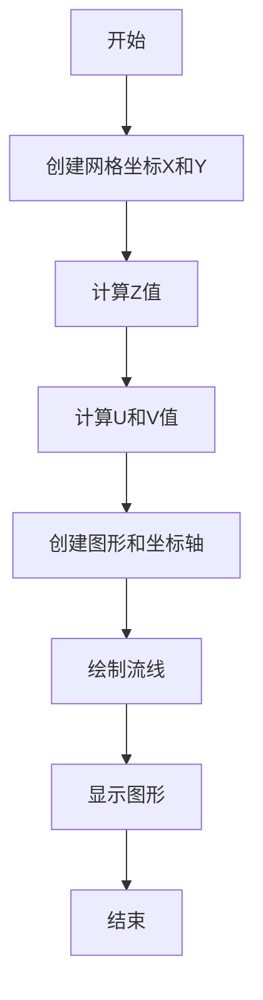
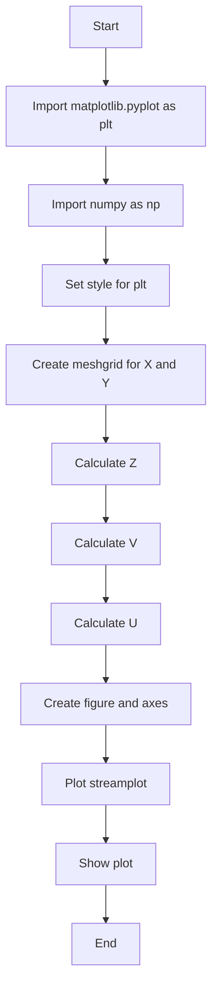
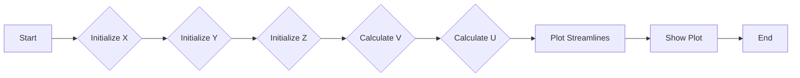
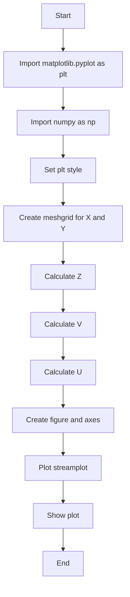

# `matplotlib\galleries\plot_types\arrays\streamplot.py` 详细设计文档

This code defines a function `streamplot` that generates and displays streamlines of a vector field using matplotlib and numpy.

## 整体流程



## 类结构

```
Streamplot (主函数)
```

## 全局变量及字段


### `np`
    
NumPy module for numerical operations.

类型：`module`
    


### `plt`
    
Matplotlib module for plotting.

类型：`module`
    


### `fig`
    
Figure object for the plot.

类型：`matplotlib.figure.Figure`
    


### `ax`
    
Axes object for the plot.

类型：`matplotlib.axes._subplots.AxesSubplot`
    


### `X`
    
Grid of x-coordinates.

类型：`numpy.ndarray`
    


### `Y`
    
Grid of y-coordinates.

类型：`numpy.ndarray`
    


### `U`
    
Grid of u-component of the vector field.

类型：`numpy.ndarray`
    


### `V`
    
Grid of v-component of the vector field.

类型：`numpy.ndarray`
    


### `Streamplot.X`
    
Grid of x-coordinates for the streamplot.

类型：`numpy.ndarray`
    


### `Streamplot.Y`
    
Grid of y-coordinates for the streamplot.

类型：`numpy.ndarray`
    


### `Streamplot.U`
    
Grid of u-component of the vector field for the streamplot.

类型：`numpy.ndarray`
    


### `Streamplot.V`
    
Grid of v-component of the vector field for the streamplot.

类型：`numpy.ndarray`
    


### `Streamplot.fig`
    
Figure object for the streamplot.

类型：`matplotlib.figure.Figure`
    


### `Streamplot.ax`
    
Axes object for the streamplot.

类型：`matplotlib.axes._subplots.AxesSubplot`
    
    

## 全局函数及方法


### streamplot()

Draw streamlines of a vector flow.

参数：

- `X`：`numpy.ndarray`，二维网格的X坐标。
- `Y`：`numpy.ndarray`，二维网格的Y坐标。
- `U`：`numpy.ndarray`，二维网格的U分量。
- `V`：`numpy.ndarray`，二维网格的V分量。

返回值：`None`，该函数不返回任何值，它直接在屏幕上绘制流线图。

#### 流程图



#### 带注释源码

```python
"""
======================
streamplot(X, Y, U, V)
======================
Draw streamlines of a vector flow.

See `~matplotlib.axes.Axes.streamplot`.
"""
import matplotlib.pyplot as plt
import numpy as np

plt.style.use('_mpl-gallery-nogrid')

# make a stream function:
X, Y = np.meshgrid(np.linspace(-3, 3, 256), np.linspace(-3, 3, 256))
Z = (1 - X/2 + X**5 + Y**3) * np.exp(-X**2 - Y**2)
# make U and V out of the streamfunction:
V = np.diff(Z[1:, :], axis=1)
U = -np.diff(Z[:, 1:], axis=0)

# plot:
fig, ax = plt.subplots()

ax.streamplot(X[1:, 1:], Y[1:, 1:], U, V)

plt.show()
```

### 关键组件信息

- `matplotlib.pyplot`：用于创建图形和可视化。
- `numpy`：用于数值计算和数组操作。

### 潜在的技术债务或优化空间

- 代码中使用了`np.diff`来计算U和V分量，这可能会在大型数据集上效率较低。可以考虑使用更高效的算法或库来处理这个问题。
- 代码中没有进行错误处理，例如检查输入数据的类型和形状。在实际应用中，应该添加适当的错误处理来确保代码的健壮性。

### 设计目标与约束

- 设计目标是绘制向量场的流线图。
- 约束是使用matplotlib和numpy库。

### 错误处理与异常设计

- 代码中没有显式的错误处理机制。
- 应该添加异常处理来确保输入数据的正确性。

### 数据流与状态机

- 数据流从输入的X、Y、U、V开始，经过计算得到Z，然后计算V和U，最后绘制流线图。
- 状态机可以描述为：初始化 -> 计算Z -> 计算V -> 计算U -> 绘制流线图 -> 显示 -> 结束。

### 外部依赖与接口契约

- 依赖于matplotlib和numpy库。
- 接口契约是函数`streamplot`的参数和返回值。


### Streamplot.__init__

Streamplot.__init__ is a constructor method for the Streamplot class, which initializes the streamplot object with the necessary parameters to draw streamlines of a vector flow.

参数：

- `X`：`numpy.ndarray`，网格X坐标
- `Y`：`numpy.ndarray`，网格Y坐标
- `U`：`numpy.ndarray`，水平方向的速度分量
- `V`：`numpy.ndarray`，垂直方向的速度分量

返回值：无

#### 流程图



#### 带注释源码

```python
"""
======================
streamplot(X, Y, U, V)
======================
Draw streamlines of a vector flow.

See `~matplotlib.axes.Axes.streamplot`.
"""
import matplotlib.pyplot as plt
import numpy as np

plt.style.use('_mpl-gallery-nogrid')

# make a stream function:
X, Y = np.meshgrid(np.linspace(-3, 3, 256), np.linspace(-3, 3, 256))
Z = (1 - X/2 + X**5 + Y**3) * np.exp(-X**2 - Y**2)
# make U and V out of the streamfunction:
V = np.diff(Z[1:, :], axis=1)
U = -np.diff(Z[:, 1:], axis=0)

# plot:
fig, ax = plt.subplots()

ax.streamplot(X[1:, 1:], Y[1:, 1:], U, V)

plt.show()
```


### Streamplot.plot

Streamplot.plot is a function that generates and displays streamlines of a vector field using matplotlib.

参数：

- `X`：`numpy.ndarray`，网格X坐标
- `Y`：`numpy.ndarray`，网格Y坐标
- `U`：`numpy.ndarray`，网格U分量
- `V`：`numpy.ndarray`，网格V分量

返回值：`None`，该函数不返回任何值，它直接在屏幕上显示流线图

#### 流程图



#### 带注释源码

```python
"""
======================
streamplot(X, Y, U, V)
======================
Draw streamlines of a vector flow.

See `~matplotlib.axes.Axes.streamplot`.
"""
import matplotlib.pyplot as plt
import numpy as np

plt.style.use('_mpl-gallery-nogrid')

# make a stream function:
X, Y = np.meshgrid(np.linspace(-3, 3, 256), np.linspace(-3, 3, 256))
Z = (1 - X/2 + X**5 + Y**3) * np.exp(-X**2 - Y**2)
# make U and V out of the streamfunction:
V = np.diff(Z[1:, :], axis=1)
U = -np.diff(Z[:, 1:], axis=0)

# plot:
fig, ax = plt.subplots()

ax.streamplot(X[1:, 1:], Y[1:, 1:], U, V)

plt.show()
```

### 关键组件信息

- `matplotlib.pyplot`：用于创建图形和显示结果
- `numpy`：用于数学计算和数组操作

### 潜在的技术债务或优化空间

- 代码中使用了`np.diff`来计算U和V分量，这可能会在大型数据集上效率较低。可以考虑使用更高效的算法或库来处理这个问题。
- 代码中没有进行错误处理，例如检查输入数据的类型和大小。在实际应用中，应该添加适当的错误处理来提高代码的健壮性。

### 设计目标与约束

- 设计目标是生成并显示向量场的流线图。
- 约束是使用matplotlib和numpy库。

### 错误处理与异常设计

- 代码中没有进行错误处理。
- 建议添加错误处理来确保输入数据的正确性。

### 数据流与状态机

- 数据流从输入的X、Y、U、V开始，经过计算Z、V、U，最后生成并显示流线图。
- 状态机可以描述为：初始化 -> 计算数据 -> 绘制图形 -> 显示图形 -> 结束。

### 外部依赖与接口契约

- 代码依赖于matplotlib和numpy库。
- 接口契约包括输入参数的类型和大小，以及函数的返回值。


## 关键组件


### 张量索引与惰性加载

张量索引与惰性加载用于高效地访问和操作大型数据结构，如网格数据，而无需一次性将整个数据加载到内存中。

### 反量化支持

反量化支持允许代码在执行时动态调整量化参数，以适应不同的量化需求。

### 量化策略

量化策略定义了如何将浮点数数据转换为固定点数表示，以减少计算资源消耗和提高执行速度。


## 问题及建议


### 已知问题

-   {问题1}：代码中使用了 `np.diff` 来计算速度场 U 和 V，这可能导致边界条件处理不当，因为 `np.diff` 会丢弃边界值。这可能导致在边界附近的速度场计算不准确。
-   {问题2}：代码没有进行任何错误处理，如果输入的 X, Y, U, V 参数不符合预期，可能会导致程序崩溃或产生不正确的结果。
-   {问题3}：代码没有进行任何性能优化，例如，对于大型数据集，计算速度场 U 和 V 可能会非常耗时。

### 优化建议

-   {建议1}：使用边界条件来填充速度场 U 和 V 的边界值，以确保整个速度场在边界处是连续的。
-   {建议2}：添加错误处理来验证输入参数的有效性，并在参数无效时提供有用的错误信息。
-   {建议3}：考虑使用更高效的数据结构或算法来计算速度场，例如，使用循环而不是 `np.diff`，或者使用数值积分方法。
-   {建议4}：如果代码被频繁调用，可以考虑将计算结果缓存起来，以避免重复计算。
-   {建议5}：为了提高代码的可读性和可维护性，可以考虑将计算速度场 U 和 V 的逻辑封装到一个函数中。


## 其它


### 设计目标与约束

- 设计目标：实现一个能够绘制向量流线图的函数，用于可视化向量场。
- 约束条件：使用matplotlib库进行绘图，不使用额外的第三方库。

### 错误处理与异常设计

- 错误处理：函数应能够处理输入参数类型错误或无效的情况，抛出相应的异常。
- 异常设计：定义自定义异常类，如`InvalidInputError`，用于处理无效输入。

### 数据流与状态机

- 数据流：输入参数X、Y、U、V经过计算生成流函数Z，然后计算U和V，最后使用matplotlib绘制流线图。
- 状态机：该函数没有状态机，它是一个简单的数据处理和绘图流程。

### 外部依赖与接口契约

- 外部依赖：matplotlib和numpy库。
- 接口契约：函数`streamplot`接受四个数组作为输入，并返回一个matplotlib图形对象。

### 测试用例

- 测试用例：提供一组测试用例，包括不同类型的输入数据，以验证函数的正确性和鲁棒性。

### 性能分析

- 性能分析：分析函数的运行时间和内存消耗，优化性能瓶颈。

### 安全性

- 安全性：确保函数不会因为输入数据的问题导致程序崩溃或泄露敏感信息。

### 可维护性

- 可维护性：代码结构清晰，易于理解和修改，遵循良好的编程实践。

### 文档与注释

- 文档：提供详细的文档说明，包括函数的用途、参数、返回值和示例。
- 注释：在代码中添加必要的注释，解释复杂逻辑和算法。

### 用户界面

- 用户界面：该函数没有用户界面，它是一个命令行工具。

### 部署与分发

- 部署：将函数打包成可执行文件或库，方便用户安装和使用。
- 分发：通过代码库或包管理器进行分发。


    