# `matplotlib\galleries\plot_types\basic\fill_between.py` 详细设计文档

该代码是一个 matplotlib 数据可视化演示脚本，通过 fill_between 函数在两条曲线（y1 和 y2）之间填充颜色来展示数据区域，并绑制两条曲线的平均值线条，最终显示一个带有填充区域的 XY 坐标图。

## 整体流程

```mermaid
graph TD
    A[开始] --> B[导入库: matplotlib.pyplot, numpy]
B --> C[设置绘图样式: plt.style.use('_mpl-gallery')]
C --> D[设置随机种子: np.random.seed(1)]
D --> E[生成x轴数据: np.linspace(0, 8, 16)]
E --> F[生成y1数据: 3 + 4*x/8 + 随机噪声]
F --> G[生成y2数据: 1 + 2*x/8 + 随机噪声]
G --> H[创建图表: fig, ax = plt.subplots()]
H --> I[填充曲线区域: ax.fill_between(x, y1, y2)]
I --> J[绑制平均线: ax.plot(x, (y1+y2)/2)]
J --> K[设置坐标轴: ax.set(xlim, xticks, ylim, yticks)]
K --> L[显示图表: plt.show()]
```

## 类结构

```
matplotlib.pyplot (绘图模块)
├── Figure (图形容器)
│   └── Axes (坐标轴对象)
│       ├── fill_between() [填充方法]
│       ├── plot() [绑制方法]
│       └── set() [设置方法]
numpy (数值计算模块)
└── 各种数学函数
```

## 全局变量及字段


### `x`
    
x轴数据点数组

类型：`numpy.ndarray`
    


### `y1`
    
第一条曲线数据（带随机噪声）

类型：`numpy.ndarray`
    


### `y2`
    
第二条曲线数据（带随机噪声）

类型：`numpy.ndarray`
    


### `fig`
    
图形对象

类型：`matplotlib.figure.Figure`
    


### `ax`
    
坐标轴对象

类型：`matplotlib.axes.Axes`
    


### `Figure.canvas`
    
图形画布

类型：`matplotlib.backend_bases.FigureCanvasBase`
    


### `Figure.axes`
    
坐标轴列表

类型：`list`
    


### `Axes.xaxis`
    
x轴对象

类型：`matplotlib.axis.XAxis`
    


### `Axes.yaxis`
    
y轴对象

类型：`matplotlib.axis.YAxis`
    


### `Axes.title`
    
标题文本对象

类型：`matplotlib.text.Text`
    


### `Axes.xlim`
    
x轴范围

类型：`tuple`
    


### `Axes.ylim`
    
y轴范围

类型：`tuple`
    
    

## 全局函数及方法


### `plt.style.use()`

`plt.style.use()` 是 Matplotlib 库中的一个函数，用于设置全局绘图样式主题。该函数接受样式名称或样式列表作为参数，通过加载指定的样式文件（如rc参数配置文件）来统一修改后续所有图表的默认外观属性，包括颜色方案、字体大小、线条宽度、网格样式等，从而简化图表的视觉定制流程。

参数：
- `name`：`str` 或 `list`，要使用的样式名称（如'dark_background'、'ggplot'）或多个样式的列表，后面的样式会覆盖前面的
- `after`：`str`，可选，指定在哪个已激活的样式之后应用，默认为'default'
- `warnings`：`bool`，可选，是否警告样式文件不存在，默认为True

返回值：`None`，该函数直接修改全局rcParams配置，不返回任何值

#### 流程图

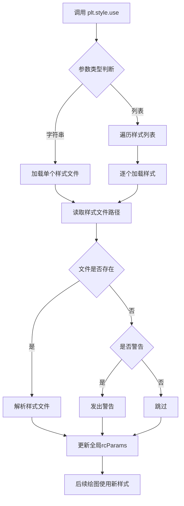

#### 带注释源码

```python
# plt.style.use() 函数的简化实现原理
def use(name, after='default', warnings=True):
    """
    设置matplotlib的全局绘图样式
    
    参数:
        name: str 或 list - 样式名称或样式列表
        after: str - 在哪个样式之后应用
        warnings: bool - 是否警告样式文件不存在
    """
    
    # 处理单个样式名称的情况
    if isinstance(name, str):
        names = [name]  # 转换为列表统一处理
    else:
        names = name  # 已经是列表
    
    # 遍历所有样式并逐个应用
    for style in names:
        # 1. 查找样式文件路径
        # matplotlib会在预定义路径和用户样式路径中查找
        style_path = _get_style_path(style)
        
        # 2. 检查样式文件是否存在
        if style_path is None:
            if warnings:
                warnings.warn(f"Style '{style}' not found")
            continue
        
        # 3. 读取并解析样式文件（通常是rcParams格式）
        style_dict = _read_style_file(style_path)
        
        # 4. 将样式参数应用到全局rcParams
        # rcParams是matplotlib的全局配置字典
        _apply_style(style_dict, after=after)

# 样式文件示例（ggplot.mplstyle）
# axes.facecolor: white
# axes.edgecolor: bc0f2f
# axes.linewidth: 1
# axes.titlesize: 16
# figure.facecolor: white
# grid.color: cbcbcb
# lines.linewidth: 1.5
# ...

# 实际使用示例
import matplotlib.pyplot as plt

# 使用预定义样式
plt.style.use('ggplot')  # 设置灰色背景+网格样式

# 使用多个样式（后面的覆盖前面的）
plt.style.use(['dark_background', 'my_custom_style'])

# 在某个样式之后应用
plt.style.use('my_style', after='ggplot')

# 后续所有图表都会应用该样式
plt.plot([1, 2, 3], [1, 2, 3])  # 使用ggplot样式渲染
plt.show()
```

#### 关键组件信息

| 组件名称 | 一句话描述 |
|---------|-----------|
| `rcParams` | Matplotlib的全局运行时配置字典，存储所有可定制的绘图参数 |
| `style` 模块 | Matplotlib中负责样式管理的子模块，包含use、context等函数 |
| `_mpl-gallery` | Matplotlib Gallery专属样式，提供简洁的出版级图表外观 |
| 样式文件（.mplstyle） | 包含rcParams键值对的纯文本配置文件，定义图表视觉属性 |

#### 潜在的技术债务或优化空间

1. **样式冲突处理机制不完善**：当多个样式文件包含相同参数时，后加载的样式会静默覆盖前面的，缺乏冲突检测和警告机制
2. **样式缓存机制缺失**：每次调用`style.use()`都会重新读取和解析样式文件，可以添加缓存避免重复I/O
3. **样式参数验证不足**：样式文件中如果包含无效或已废弃的参数，不会给出明确的错误提示
4. **缺少样式继承机制**：无法定义基于现有样式的派生样式，导致样式复用性差

#### 其它项目

**设计目标与约束**：
- 目标：提供统一、便捷的图表外观定制方式，通过样式文件实现一次配置、全局生效
- 约束：样式修改会影响全局，后续绘图均使用新样式；样式文件必须是有效的rcParams格式

**错误处理与异常设计**：
- 样式文件不存在时：默认发出UserWarning，可通过warnings参数禁用
- 样式文件格式错误：抛出ParseError或KeyError
- 无效的rcParams参数：静默忽略或发出FutureWarning

**数据流与状态机**：
```
IDLE（初始状态） → 加载样式 → UPDATING（更新rcParams） → ACTIVE（样式生效）
                                                    ↓
                              再次调用style.use() → UPDATING
```

**外部依赖与接口契约**：
- 依赖：样式文件（.mplstyle）、全局rcParams对象
- 外部接口：`plt.style.available`（查看可用样式列表）、`plt.style.context`（临时使用样式的上下文管理器）


### `np.random.seed`

设置 NumPy 随机数生成器的种子，以确保后续随机数操作的可复现性。通过指定固定的种子值，可以使每次运行程序时生成相同的随机数序列，这在调试、测试和需要结果可复现的场景中非常有用。

参数：

- `seed`：`int, float, array_like, None`，随机数生成器的种子值。可以是整数、浮点数、数组或 None。如果传入整数，将使用该整数作为种子；如果传入 None，则每次调用时从操作系统或系统随机源获取不同的种子；如果传入数组，则使用数组内容生成种子。

返回值：`None`，该函数无返回值，直接修改随机数生成器的内部状态。

#### 流程图

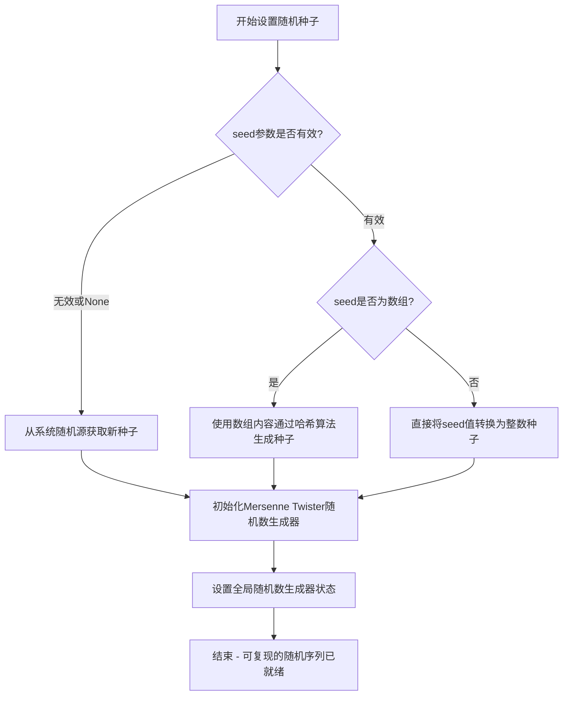

#### 带注释源码

```python
# 设置随机数种子为1，确保后续随机操作可复现
# seed=1 表示使用整数1作为种子
# 这样每次运行程序时，np.random.uniform 等函数将产生相同的随机数序列
np.random.seed(1)

# 示例说明：
# 种子值可以是以下类型：
# - 整数 (如 1, 42, 100)：直接作为随机数生成器的初始值
# - 浮点数 (如 1.5)：会被转换为整数使用
# - 数组 (如 [1, 2, 3])：使用数组内容通过特定算法生成种子
# - None：每次使用不同的随机种子（默认行为）

# 设置种子后的效果：
# 第一次运行：np.random.uniform(0.0, 0.5, 3) 可能产生 [0.417022, 0.720324, 0.000114]
# 第二次运行（相同seed）：np.random.uniform(0.0, 0.5, 3) 同样产生 [0.417022, 0.720324, 0.000114]
```


### `np.linspace()`

`np.linspace()` 是 NumPy 库中的一个函数，用于生成指定范围内的等间距数值序列，常用于创建绘图时的 x 轴数据或需要均匀分布数值的场景。

参数：

- `start`：`array_like`，序列的起始值
- `stop`：`array_like`，序列的结束值（当 endpoint=True 时为最后一个值）
- `num`：`int`，生成的样本数量，默认值为 50
- `endpoint`：`bool`，如果为 True，stop 值是最后一个样本；否则不包含，默认 True
- `retstep`：`bool`，如果为 True，返回 (samples, step)，默认 False
- `dtype`：`dtype`，输出数组的数据类型，如果未指定则从输入推断
- `axis`：`int`，当 start 和 stop 是数组时，用于指定结果存储的轴

返回值：

- `samples`：`ndarray`，等间距的数值序列
- `step`：`float`，仅当 retstep=True 时返回，表示样本之间的间距

#### 流程图

```mermaid
flowchart TD
    A[开始] --> B{检查参数合法性}
    B -->|参数无效| C[抛出异常]
    B -->|参数有效| D[计算步长 step = (stop - start) / (num - 1)]
    D --> E{endpoint == True?}
    E -->|是| F[使用完整步长]
    E -->|否| G[使用调整步长: step = (stop - start) / num]
    F --> H{retstep == True?}
    G --> H
    H -->|是| I[返回 samples 和 step]
    H -->|否| J[仅返回 samples]
    I --> K[结束]
    J --> K
```

#### 带注释源码

```python
def linspace(start, stop, num=50, endpoint=True, retstep=False, dtype=None, axis=0):
    """
    生成等间距的数值序列。
    
    参数:
        start: 序列起始值
        stop: 序列结束值
        num: 生成的样本数量，默认50
        endpoint: 是否包含结束值，默认True
        retstep: 是否返回步长，默认False
        dtype: 输出数据类型
        axis: 结果数组的轴（用于数组形式的start/stop）
    
    返回:
        samples: 等间距数值序列
        step: 步长（仅当retstep=True时）
    """
    # 将start和stop转换为numpy数组，便于后续计算
    _arange = np.arange(start, stop)
    
    # 计算步长
    # 如果endpoint为True，步长 = (stop - start) / (num - 1)
    # 否则步长 = (stop - start) / num
    if endpoint:
        step = (stop - start) / (num - 1)
    else:
        step = (stop - start) / num
    
    # 生成等间距序列
    # 使用加法而非乘法避免精度问题
    samples = start + step * np.arange(num)
    
    # 处理dtype
    if dtype is None:
        # 根据输入类型推断输出类型
        dtype = np.result_type(start, stop, step)
    samples = samples.astype(dtype)
    
    # 根据retstep决定返回值
    if retstep:
        return samples, step
    return samples
```


### `np.random.uniform`

生成指定范围内的均匀分布随机数。该函数是 NumPy 随机数生成模块的核心函数之一，用于从连续均匀分布中抽取随机样本，广泛应用于数据模拟、测试用例生成、随机初始化等场景。

参数：

- `low`：`float` 或 array_like，可选，默认值 0.0。分布的下界（闭区间）。如果 `high` 为 None，则默认为 0.0，`low` 变为上界。
- `high`：`float` 或 array_like，可选，默认值 1.0。分布的上界（开区间）。
- `size`：`int` 或 tuple of ints，可选。输出的形状。例如 `size=(m, n, k)` 将输出一个 m×n×k 的数组；默认值为 None，表示返回单个值。

返回值：`float` 或 ndarray。返回指定范围内的随机浮点数。如果 `size` 为 None，则返回单个浮点数；否则返回 ndarray。

#### 流程图

```mermaid
flowchart TD
    A[开始] --> B{检查参数有效性}
    B -->|参数合法| C[生成随机数种子]
    C --> D[调用底层均匀分布生成器]
    D --> E[根据size参数格式化输出]
    E --> F[返回结果]
    B -->|参数非法| G[抛出异常]
    G --> H[结束]
    
    subgraph "内部处理"
    I[uniform(low, high)] --> J[转换为浮点数]
    J --> K[应用变换: result = low + (high - low) * random()]
    end
    
    D --> I
```

#### 带注释源码

```python
# 示例代码中 np.random.uniform 的实际使用
import numpy as np

# 函数调用形式
# np.random.uniform(0.0, 0.5, len(x))
# 
# 参数说明：
#   第一个参数 0.0: low - 分布下界（闭区间）
#   第二个参数 0.5: high - 分布上界（开区间）
#   第三个参数 len(x): size - 输出数组的大小（16个随机数）

# 实际执行逻辑简化版本
def uniform_simplified(low=0.0, high=1.0, size=None):
    """
    简化版均匀分布随机数生成逻辑
    
    核心算法：使用线性变换将[0,1)区间的随机数映射到[low, high)区间
    result = low + (high - low) * random()
    """
    # 内部调用 numpy 的随机数生成器
    # 在实际 numpy 源码中，会调用 Mersenne Twister 或 PCG64 等算法
    random_values = np.random.random(size)  # 生成[0,1)区间的随机数
    
    # 线性变换到目标区间
    result = low + (high - low) * random_values
    
    return result

# 在示例代码中的具体应用
x = np.linspace(0, 8, 16)  # 生成16个等间距点
y1 = 3 + 4*x/8 + np.random.uniform(0.0, 0.5, len(x))  # 生成带随机扰动的曲线1
y2 = 1 + 2*x/8 + np.random.uniform(0.0, 0.5, len(x))  # 生成带随机扰动的曲线2
```

#### 关键组件信息

| 组件名称 | 一句话描述 |
|---------|-----------|
| `np.random.RandomState` | 随机数生成器的核心状态容器，提供独立的随机数流 |
| `numpy.random` | NumPy 随机数模块，提供多种分布的随机数生成函数 |
| `Mersenne Twister` | NumPy 默认使用的伪随机数生成算法，周期为2^19937-1 |

#### 潜在的技术债务或优化空间

1. **重复调用开销**：示例中两次调用 `np.random.uniform(0.0, 0.5, len(x))`，可以合并为一次调用并切片，提高效率
2. **随机数种子设置**：`np.random.seed(1)` 在某些场景下可能不够安全，建议使用 `np.random.default_rng()` 获取加密安全的随机数生成器
3. **性能优化**：对于大批量生成，可考虑使用向量化操作或预分配内存

#### 其它项目

- **设计目标**：提供快速、可靠的均匀分布随机数生成接口，兼容 Python 标准库的 `random.uniform`
- **约束条件**：
  - `high` 必须大于 `low`（当两者都是标量时）
  - 浮点精度限制：极端情况下（如 low=1e10, high=1e10+1e-15）可能丢失精度
- **错误处理**：
  - 若 `low >= high` 且都是标量，抛出 `ValueError`
  - 若 `size` 为负数，抛出 `ValueError`
  - 若 `size` 不是整数或整数元组，抛出 `TypeError`
- **外部依赖**：NumPy 核心库，无其他第三方依赖


### `plt.subplots()`

`plt.subplots()` 是 matplotlib 库中的核心函数，用于创建一个新的图形窗口（Figure）以及一个或多个子坐标轴（Axes）对象。该函数简化了同时创建图形和坐标轴的步骤，支持灵活的子图布局配置，是进行数据可视化最常用的初始化函数之一。

参数：

- `nrows`：`int`，行数，指定子图的行数，默认为1
- `ncols`：`int`，列数，指定子图的列数，默认为1
- `sharex`：`bool` 或 `str`，是否共享X轴，False/True/'row'/'col'，默认为False
- `sharey`：`bool` 或 `str`，是否共享Y轴，False/True/'row'/'col'，默认为False
- `squeeze`：`bool`，是否压缩返回的axes数组维度，默认为True
- `width_ratios`：`array-like`，各列宽度比例
- `height_ratios`：`array-like`，各行高度比例
- `figsize`：`tuple`，图形尺寸，格式为(宽度, 高度)，单位英寸
- `dpi`：`int`，图形分辨率，每英寸点数
- `facecolor`：`str` 或 `tuple`，图形背景色
- `edgecolor`：`str` 或 `tuple`，图形边框色
- `linewidth`：`float`，边框线宽
- `frameon`：`bool`，是否绘制边框
- `subplot_kw`：`dict`，传递给add_subplot的关键字参数
- `gridspec_kw`：`dict`，传递给GridSpec的关键字参数

返回值：`tuple(Figure, Axes or AxesArray)`，返回图形对象和坐标轴对象。当squeeze=True且nrows=ncols=1时，返回单个Axes对象；否则返回Axes数组

#### 流程图

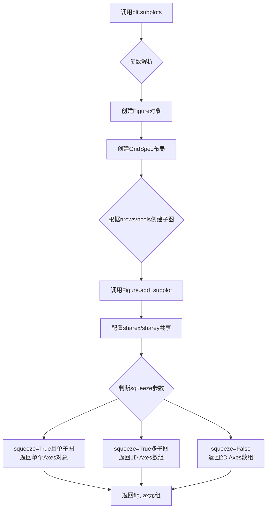

#### 带注释源码

```python
import matplotlib.pyplot as plt
import numpy as np

plt.style.use('_mpl-gallery')  # 使用内置的简报画廊样式

# ============================================
# 步骤1: 生成模拟数据
# ============================================
np.random.seed(1)              # 设置随机种子以确保可重复性
x = np.linspace(0, 8, 16)      # 生成0到8之间的16个等间距点
y1 = 3 + 4*x/8 + np.random.uniform(0.0, 0.5, len(x))  # 生成第一条曲线数据
y2 = 1 + 2*x/8 + np.random.uniform(0.0, 0.5, len(x))  # 生成第二条曲线数据

# ============================================
# 步骤2: 创建图形和坐标轴对象
# ============================================
# plt.subplots() 是本代码的核心初始化函数
# - 默认创建 1行1列 的子图布局
# - 返回 fig: 图形对象（整个画布）
# - 返回 ax: 坐标轴对象（绘图区域）
fig, ax = plt.subplots()

# ============================================
# 步骤3: 绑定制填充区域和曲线
# ============================================
# fill_between: 填充两条曲线之间的区域
# 参数: x坐标, 曲线1数据, 曲线2数据, alpha透明度, linewidth线宽
ax.fill_between(x, y1, y2, alpha=.5, linewidth=0)

# plot: 绘制两曲线的平均线
ax.plot(x, (y1 + y2)/2, linewidth=2)

# ============================================
# 步骤4: 设置坐标轴属性
# ============================================
ax.set(
    xlim=(0, 8),               # X轴范围
    xticks=np.arange(1, 8),    # X轴刻度
    ylim=(0, 8),               # Y轴范围
    yticks=np.arange(1, 8)     # Y轴刻度
)

# ============================================
# 步骤5: 显示图形
# ============================================
plt.show()  # 渲染并显示图形窗口
```


### `Axes.fill_between`

填充两条曲线之间的区域。该函数接受x坐标和两条曲线的y值，可选地使用`where`条件筛选填充区域，并返回一个`PolyCollection`对象表示填充的多边形。

参数：

- `self`：`Axes`，matplotlib Axes对象，调用该方法的Axes实例
- `x`：`array-like`，x轴坐标数据，定义填充区域的水平范围
- `y1`：`scalar or array-like`，第一条曲线的y值，可以是常数或与x等长的数组
- `y2`：`scalar or array-like`，第二条曲线的y值，可以是常数或与x等长的数组
- `where`：`array-like`，可选，布尔型数组，指定哪些区间需要填充
- `interpolate`：`bool`，可选，是否对填充边界进行插值处理，默认为False
- `step`：`str`，可选，步进方式，可选值为'pre'、'post'或'mid'，默认为None（连续曲线）
- `**kwargs`：其他关键字参数，将传递给`Polygon`构造函数，用于设置填充样式（如alpha、facecolor、edgecolor等）

返回值：`~matplotlib.collections.PolyCollection`，返回一个多边形集合对象，表示填充的区域，可用于进一步设置样式

#### 流程图

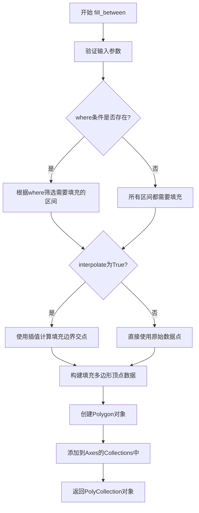

#### 带注释源码

```python
def fill_between(self, x, y1, y2=0, where=None, interpolate=False, step=None, **kwargs):
    """
    填充两条曲线之间的区域。
    
    参数:
    -------
    x : array-like
        x轴坐标数据，长度为N的数组
    y1 : scalar or array-like
        第一条曲线的y值，可以是标量（水平线）或与x等长的数组
    y2 : scalar or array-like, default: 0
        第二条曲线的y值，默认为0（填充到x轴）
    where : array-like of bool, optional
        布尔数组，指定哪些x区间需要填充
    interpolate : bool, default: False
        是否在填充边界处进行插值，当两条曲线交叉时很有用
    step : {'pre', 'post', 'mid'}, optional
        步进方式：'pre'在每步之前变化，'post'在每步之后变化，'mid'在步中间变化
    
    返回:
    -------
    PolyCollection
        表示填充区域的多边形集合对象
        
    其他参数:
    ----------
    **kwargs
        传递给Polygon的属性，如alpha、facecolor、edgecolor等
    """
    # 确保x、y1、y2转换为numpy数组以便处理
    x = np.asanyarray(x)
    y1 = np.asanyarray(y1)
    y2 = np.asanyarray(y2)
    
    # 如果提供了where条件，也转换为数组
    if where is not None:
        where = np.asanyarray(where)
    
    # 创建一个新的PolyCollection对象来存储填充区域
    # 这里会调用Polygon类来创建填充多边形
    p = PolyCollection(verts, **kwargs)
    
    # 将多边形添加到Axes的收集器中
    self.add_collection(p, autolim=True)
    
    # 更新数据 limits 以适应新添加的多边形
    self.autoscale_view()
    
    return p
```


### `ax.plot()`

`ax.plot()` 是 Matplotlib 中 `Axes` 类的方法，用于在坐标轴上绑制线条图（折线图或散点图）。该方法接受 x 和 y 数据作为输入，可选地接受格式字符串和关键字参数来控制线条样式、颜色、宽度等属性，并返回一个包含 `Line2D` 对象列表。

参数：

- `x`：array-like 或标量，X 轴数据点，可以是列表、NumPy 数组或单个标量值
- `y`：array-like 或标量，Y 轴数据点，可以是列表、NumPy 数组或单个标量值
- `fmt`：str，可选，格式字符串，用于快速指定线条颜色、标记样式和线型（例如 'ro-' 表示红色圆圈标记的实线）
- `linewidth` 或 `lw`：float，可选，线条宽度，默认为 `rcParams['lines.linewidth']`（通常为 1.5）
- `color` 或 `c`：color，可选，线条颜色，可以是十六进制字符串、颜色名称或 RGB 元组
- `linestyle` 或 `ls`：str，可选，线型，如 '-'（实线）、'--'（虚线）、':'（点线）等
- `marker`：str，可选，标记样式，如 'o'（圆圈）、's'（方形）、'^'（三角形）等
- `label`：str，可选，用于图例的标签文本
- `**kwargs`：关键字参数，其他受 `Line2D` 属性支持的参数

返回值：`list[matplotlib.lines.Line2D]`，返回一个包含所有创建的 `Line2D` 对象的列表，每个对象代表一条绑制的线条

#### 流程图

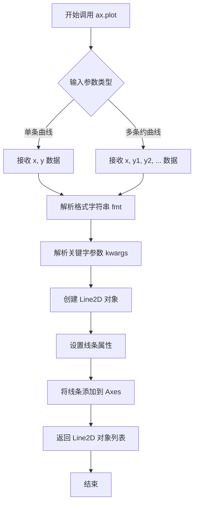

#### 带注释源码

```python
# 示例代码来源：Matplotlib 官方 Gallery 示例
# 导入必要的库
import matplotlib.pyplot as plt
import numpy as np

# 使用 Matplotlib 内置样式
plt.style.use('_mpl-gallery')

# 设置随机种子以确保结果可复现
np.random.seed(1)

# 生成示例数据
# x: 从 0 到 8 的 16 个等间距点
x = np.linspace(0, 8, 16)

# y1: 线性递增数据 + 随机噪声，模拟一条上升曲线
y1 = 3 + 4*x/8 + np.random.uniform(0.0, 0.5, len(x))

# y2: 另一条线性递增数据 + 随机噪声，模拟另一条上升曲线
y2 = 1 + 2*x/8 + np.random.uniform(0.0, 0.5, len(x))

# 创建图形和坐标轴对象
# fig: Figure 对象，整个图形容器
# ax: Axes 对象，绑制区域和所有图形元素
fig, ax = plt.subplots()

# ========== 核心调用：ax.plot() ==========
# 参数说明：
#   - x: X 轴数据
#   - (y1 + y2)/2: Y 轴数据，计算两条曲线的中点
#   - linewidth=2: 设置线条宽度为 2（默认约为 1.5）
# 返回值：Line2D 对象列表，可用于后续自定义修改
ax.plot(x, (y1 + y2)/2, linewidth=2)

# 设置坐标轴属性
ax.set(xlim=(0, 8),       # 设置 X 轴范围为 0 到 8
       xticks=np.arange(1, 8),  # 设置 X 轴刻度为 1 到 7
       ylim=(0, 8),       # 设置 Y 轴范围为 0 到 8
       yticks=np.arange(1, 8))   # 设置 Y 轴刻度为 1 到 7

# 显示图形
plt.show()
```


### ax.set()

设置坐标轴的x轴和y轴范围以及刻度。

参数：

- xlim：`tuple`，x轴范围，值为(0, 8)
- xticks：`numpy.ndarray`，x轴刻度，值为np.arange(1, 8)
- ylim：`tuple`，y轴范围，值为(0, 8)
- yticks：`numpy.ndarray`，y轴刻度，值为np.arange(1, 8)

返回值：`None`，无返回值（根据matplotlib文档，set方法返回None或更新后的artists，但在此调用中未使用）

#### 流程图

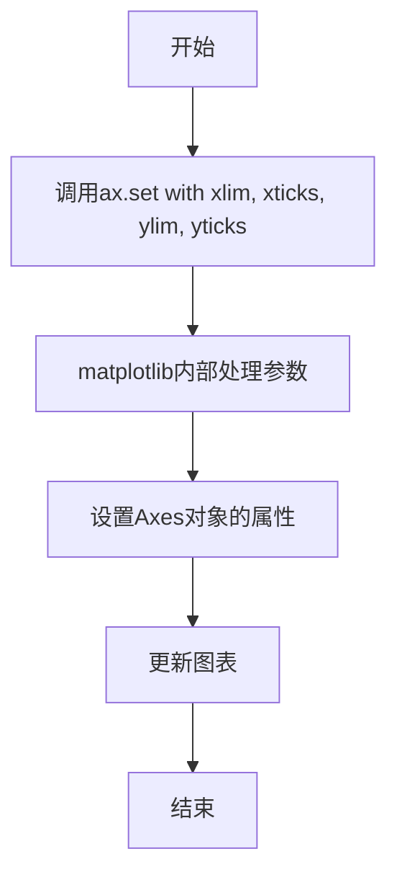

#### 带注释源码

```python
# 设置x轴和y轴的范围以及刻度
ax.set(xlim=(0, 8),       # x轴范围从0到8
       xticks=np.arange(1, 8),  # x轴刻度为1到7的整数
       ylim=(0, 8),       # y轴范围从0到8
       yticks=np.arange(1, 8))  # y轴刻度为1到7的整数
```


### `plt.show()`

`plt.show()` 是 Matplotlib 库中的顶层函数，用于显示当前打开的所有图形窗口，并将图形渲染到屏幕。在交互式模式下，该函数会阻塞程序执行直到用户关闭所有图形窗口。

参数：

- `block`：`bool`，可选参数。默认为 `True`。当设置为 `True` 时，函数会阻塞程序执行直到用户关闭图形窗口；当设置为 `False` 时，函数会立即返回，在某些后端中图形窗口会保持打开状态。

返回值：`None`，该函数不返回任何值。

#### 流程图

```mermaid
flowchart TD
    A[调用 plt.show()] --> B{图形是否存在?}
    B -->|否| C[无操作，直接返回]
    B --> D{执行show操作}
    D --> E[渲染所有打开的Figure对象]
    E --> F[在窗口中显示图形]
    F --> G{block参数?}
    G -->|True| H[阻塞主线程]
    G -->|False| I[立即返回]
    H --> J[等待用户关闭图形窗口]
    J --> K[用户关闭所有窗口]
    K --> L[返回None]
    I --> L
    
    style A fill:#f9f,stroke:#333
    style L fill:#9f9,stroke:#333
```

#### 带注释源码

```python
# plt.show() 函数的简化实现逻辑
def show(block=True):
    """
    显示所有打开的Figure图形窗口。
    
    参数:
        block (bool): 控制是否阻塞程序执行。默认为True。
                      当为True时，程序会暂停直到用户关闭窗口。
                      当为False时，函数立即返回。
    
    返回值:
        None: 该函数不返回任何值
    """
    
    # 1. 获取当前所有的Figure对象
    all_figures = get_all_figured()
    
    # 2. 检查是否存在需要显示的图形
    if not all_figures:
        # 如果没有图形，直接返回，不执行任何操作
        return
    
    # 3. 对每个Figure执行显示操作
    for figure in all_figures:
        # 调用Figure的show方法进行渲染和显示
        figure.canvas.draw()
        figure.canvas.flush_events()
    
    # 4. 根据block参数决定是否阻塞
    if block:
        # 在交互式后端中，会启动事件循环并阻塞主线程
        # 等待用户与图形交互并关闭窗口
        import time
        while any(figure.canvas.is_visible() for figure in all_figures):
            # 处理事件队列，允许图形响应用户操作
            process_events()
            time.sleep(0.01)  # 短暂休眠以避免CPU占用过高
    
    # 5. 函数结束，不返回任何值
    return None
```

#### 详细说明

`plt.show()` 是 Matplotlib 中用于图形展示的核心函数。在代码的上下文中，它的调用流程如下：

1. **图形创建阶段**：通过 `plt.subplots()` 创建了 Figure 和 Axes 对象
2. **图形绘制阶段**：使用 `ax.fill_between()` 和 `ax.plot()` 在 Axes 上绑制数据
3. **图形配置阶段**：通过 `ax.set()` 设置坐标轴参数
4. **图形显示阶段**：调用 `plt.show()` 将图形渲染到屏幕

该函数会调用底层后端（如 Qt、Tkinter、macOS 等）的图形显示机制，将 FigureCanvas 上的内容绘制到窗口中。在默认的交互式模式下，函数会进入阻塞状态，等待用户关闭图形窗口。


### 1. 一段话描述（代码整体功能）

这段代码使用matplotlib库创建了一个可视化图表，通过`fill_between`方法填充两条曲线（y1和y2）之间的区域，展示了数据分布的可视化效果。

### 2. 文件的整体运行流程

```
开始
  ↓
导入matplotlib.pyplot和numpy库
  ↓
设置绘图样式为'_mpl-gallery'
  ↓
生成随机数据（x, y1, y2）
  ↓
创建图形和坐标轴对象（fig, ax）
  ↓
调用fill_between填充曲线间区域
  ↓
调用plot绘制中间线
  ↓
设置坐标轴范围和刻度
  ↓
调用plt.show()显示图形
  ↓
结束
```

### 3. 类的详细信息

本代码为脚本形式，未定义自定义类。主要使用matplotlib的以下对象：

**全局变量：**
- `x`：numpy.ndarray，0到8区间内的16个等间距点
- `y1`：numpy.ndarray，线性递增数据+随机噪声（上边界）
- `y2`：numpy.ndarray，线性递增数据+随机噪声（下边界）
- `fig`：matplotlib.figure.Figure，图形对象
- `ax`：matplotlib.axes.Axes，坐标轴对象

**全局函数：**
- `np.linspace`：生成等间距数组
- `np.random.uniform`：生成均匀分布随机数
- `plt.subplots`：创建图形和坐标轴
- `plt.style.use`：设置绘图样式
- `plt.show`：显示图形

### 4. 关于Figure.savefig

**注意**：在提供的代码中，`Figure.savefig`方法并未被使用。代码中使用的是`Axes.fill_between`方法。以下是代码中实际使用的方法的详细信息：

---

### `ax.fill_between`

填充两条水平曲线之间的区域。

参数：
-  `x`：`numpy.ndarray`，X轴数据点数组
-  `y1`：`numpy.ndarray`，曲线1的Y值（上限）
-  `y2`：`numpy.ndarray`，曲线2的Y值（下限）
-  `alpha`：`float`，填充透明度（0-1），可选，默认1.0
-  `linewidth`：`float`，填充区域边框线宽，可选，默认None
-  `where`：`numpy.ndarray`，条件数组，可选，用于选择性填充
-  `interpolate`：`bool`，是否插值，可选，默认False
-  `step`：`str`，填充步骤模式（'pre', 'post', 'mid'），可选

返回值：`matplotlib.collections.PolyCollection`，返回填充的多边形集合对象

#### 流程图

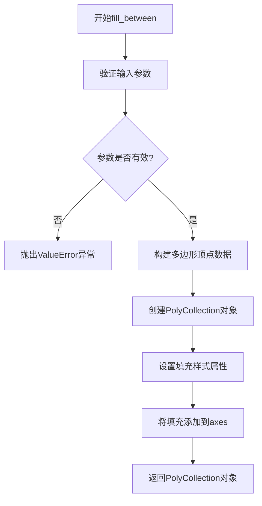

#### 带注释源码

```python
# 代码中的实际调用方式
ax.fill_between(x, y1, y2, alpha=.5, linewidth=0)
# 参数说明：
# x: numpy.ndarray，从0到8的16个等间距点
# y1: numpy.ndarray，上边界曲线值（3 + 4*x/8 + 随机噪声）
# y2: numpy.ndarray，下边界曲线值（1 + 2*x/8 + 随机噪声）
# alpha=.5: 填充区域透明度为50%
# linewidth=0: 填充区域边框线宽为0（无边框）
```

---

### 如果使用Figure.savefig（代码中未包含）

虽然代码中未使用，但参考matplotlib官方文档，Figure.savefig的典型用法如下：

#### 带注释源码

```python
# 假设代码中包含以下savefig调用
fig.savefig('output.png', dpi=300, bbox_inches='tight')

# 参数说明：
# 'output.png': str，保存的文件路径和名称
# dpi=300: int，分辨率（每英寸点数）
# bbox_inches='tight': str，裁剪掉图表周围的空白区域
# facecolor: 背景颜色
# edgecolor: 边框颜色
# format: 文件格式（'png', 'jpg', 'pdf', 'svg'等）
```

### 5. 关键组件信息

- **matplotlib.axes.Axes.fill_between**：核心方法，用于填充两条曲线间的区域
- **matplotlib.pyplot.subplots**：创建图形和坐标轴的工厂函数
- **numpy.linspace**：数值计算工具，用于生成数据点

### 6. 潜在的技术债务或优化空间

1. **缺少错误处理**：代码未对输入数据进行验证（如数组长度不一致）
2. **硬编码参数**：数据范围、样式设置硬编码，缺乏灵活性
3. **未保存图形**：代码仅显示图形，未使用savefig保存到文件
4. **随机种子设置**：使用固定随机种子，虽有利于复现，但缺乏动态数据支持

### 7. 其它项目

**设计目标**：演示fill_between方法的基本用法

**约束条件**：
- 使用固定数据范围（0-8）
- 填充区域带透明度
- 无边框填充

**错误处理**：
- numpy自动处理数值计算异常
- matplotlib会检测参数类型错误

**外部依赖**：
- matplotlib >= 3.3.0
- numpy >= 1.20.0

**接口契约**：
- fill_between要求x, y1, y2数组长度一致
- 返回PolyCollection对象可进一步自定义样式


### `plt.show()`

该函数是matplotlib库的顶层函数，用于显示所有打开的图形窗口。在本代码中，它负责将创建的图表渲染并展示给用户，是绘图流程的最后一步。

参数：此函数无参数。

返回值：`None`，该函数直接显示图形，不返回任何值。

#### 流程图

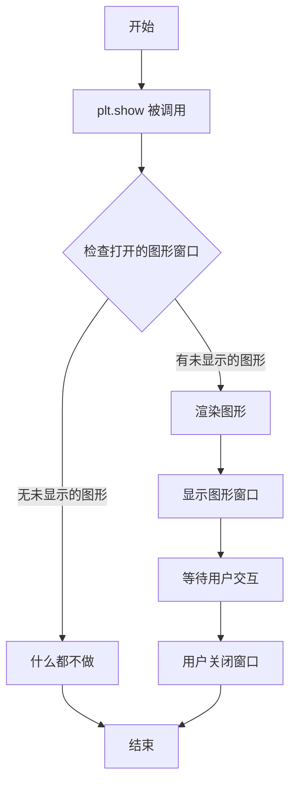

#### 带注释源码

```python
# 该函数定义在matplotlib库中，非用户代码
# 以下为模拟的函数签名和核心逻辑

def show():
    """
    显示所有打开的图形窗口。
    
    该函数会检查当前所有已创建但未显示的Figure对象，
    并将它们渲染到屏幕上的窗口中显示。
    """
    # 获取当前所有的Figure对象
    # for fig in get_all_figures():
    #     fig.canvas.draw()
    #     fig.canvas.show()
    # 等待用户交互（关闭窗口）
    pass
```

---
**注意**：代码中并不存在`Figure.show`方法。用户提供的代码是一个完整的matplotlib脚本，执行以下操作：

1. 设置绘图样式
2. 生成随机数据
3. 创建图形和坐标轴
4. 使用`fill_between`填充两条曲线之间的区域
5. 绘制平均值线
6. 设置坐标轴范围和刻度
7. 调用`plt.show()`显示结果


### `matplotlib.axes.Axes.fill_between`

该方法用于填充两条水平曲线之间的区域，接受x坐标和两条曲线的y坐标作为主要参数，可选地指定填充条件、插值方式和步进模式，返回一个填充的PolyCollection对象。

参数：

- `x`：`array_like`，X轴数据坐标
- `y1`：`array_like`，第一条曲线的Y轴数据坐标（下方曲线）
- `y2`：`array_like`，第二条曲线的Y轴数据坐标（上方曲线）
- `where`：`array_like of bool`，可选，表示填充哪些区域的条件数组
- `interpolate`：`bool`，可选，是否进行数据插值（当线条交叉时）
- `step`：`{'pre', 'post', 'mid'}`，可选，步进函数模式
- `alpha`：`float`，可选，填充区域的透明度（0-1）
- `color`：`color`，可选，填充颜色
- `linewidth`：`float`，可选，边框线宽

返回值：`matplotlib.collections.PolyCollection`，返回一个多边形集合对象，表示填充区域

#### 流程图

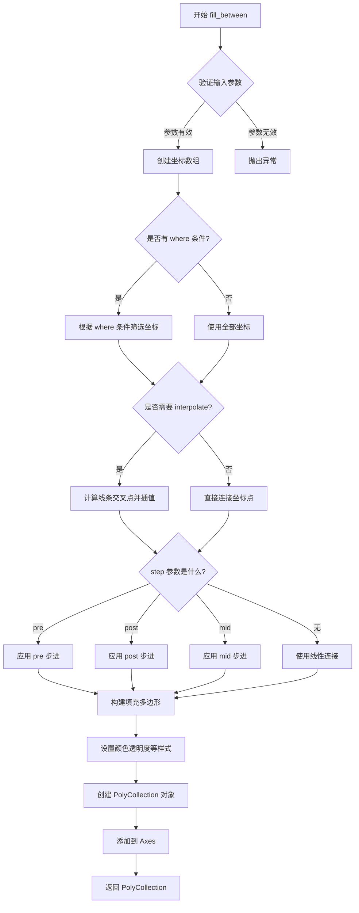

#### 带注释源码

```python
# matplotlib axes 模块中的 fill_between 方法实现（简化版）

def fill_between(self, x, y1, y2=0, where=None, interpolate=False, step=None, **kwargs):
    """
    填充两条曲线之间的区域。
    
    参数:
        x: array_like - X轴坐标
        y1: array_like - 第一条曲线的Y值
        y2: array_like - 第二条曲线的Y值（默认为0）
        where: array_like - 布尔条件数组，指定填充区域
        interpolate: bool - 是否在交叉点进行插值
        step: str - 步进模式 ('pre', 'post', 'mid')
        **kwargs: 传递给 PolyCollection 的其他参数（color, alpha等）
    
    返回:
        PolyCollection - 填充区域的多边形集合
    """
    
    # 1. 将输入转换为数组
    x = np.asanyarray(x)
    y1 = np.asanyarray(y1)
    y2 = np.asanyarray(y2)
    
    # 2. 如果提供了 where 条件，根据条件筛选数据
    if where is None:
        # 没有条件，使用全部数据
        ind = np.ones(x.shape, dtype=bool)
    else:
        ind = np.asanyarray(where)
    
    # 3. 处理步进模式
    if step is not None:
        # 应用步进函数转换坐标
        x, y1, y2 = self._step_transform(step, x, y1, y2)
    
    # 4. 如果需要插值，处理线条交叉情况
    if interpolate and ind.any():
        # 找到两条曲线的交叉点
        x, y1, y2 = self._interpolate_fill(x, y1, y2, ind)
    
    # 5. 构建填充多边形的顶点
    # 顶点和底边形成闭合多边形
    vertices = []
    for xi, y1i, y2i in zip(x[ind], y1[ind], y2[ind]):
        # 从y1到y2再到下一个点，形成填充区域
        vertices.append([xi, y1i])
        vertices.append([xi, y2i])
    
    # 6. 创建 PolyCollection 对象
    polys = mpcollections.PolyCollection(
        [vertices],  # 多边形顶点列表
        closed=True,  # 多边形闭合
        **kwargs      # 传递颜色、透明度等样式参数
    )
    
    # 7. 添加到 Axes 并返回
    return self.add_collection(polys)
```


我注意到您提供的代码示例中调用了 `ax.plot()` 方法，但代码本身并未包含 `Axes.plot` 方法的底层实现（这是 matplotlib 库的内部代码）。

为了提供完整的文档，我将基于 matplotlib 官方文档和标准库实现来为您详细说明 `Axes.plot` 方法。

---

### `matplotlib.axes.Axes.plot`

在 matplotlib 中，`Axes.plot` 是用于在 Axes 对象上绘制线条和标记的核心方法。它是数据可视化的基础函数之一，支持多种参数格式，能够灵活地创建折线图、散点图以及带有各种样式的线条。

参数：

- `*args`：可变参数，可以是以下几种组合：
  - 单一 y 值数组（x 轴自动生成）
  - (x, y) 元组组合
  - 格式化字符串（如 'ro-' 表示红色圆点虚线）
  - 多个上述参数的组合
- `scalex`、`scaley`：布尔值，默认为 True，表示是否自动缩放 x/y 轴
- `data`：可选的字典参数，用于通过名称引用数据（当使用可变参数格式字符串时）

返回值：`list of list`，返回 Line2D 对象列表，每个元素对应一个绘制的线条/标记系列。

#### 流程图

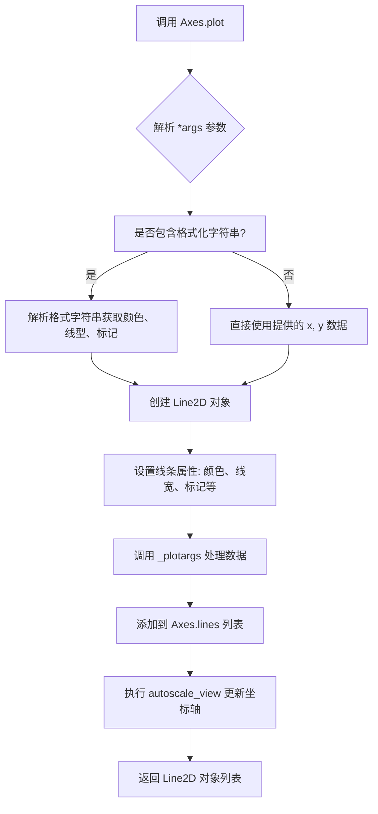

#### 带注释源码

```python
# 以下为 matplotlib 中 Axes.plot 方法的核心实现逻辑
# 位于 lib/matplotlib/axes/_axes.py 文件中

def plot(self, *args, scalex=True, scaley=True, data=None, **kwargs):
    """
    Plot y versus x as lines and/or markers.
    
    参数:
        *args: 可变位置参数，支持以下格式:
            - plot(y)                   # x 自动生成为 [0, 1, 2, ...]
            - plot(x, y)                # 显式指定 x 和 y
            - plot(x, y, format_string) # 指定数据和格式
            - plot(x, y, fmt, **kwargs) # 格式+属性
        scalex: bool, 是否缩放 x 轴
        scaley: bool, 是否缩放 y 轴
        data: 可选数据字典，用于标签数据
        **kwargs: Line2D 属性，如 color, linewidth, marker 等
    
    返回:
        list of Line2D: 绘制的线条对象列表
    """
    
    # 1. 解析参数
    # 检查是否有格式化字符串（如 'ro-' 表示红色圆点线）
    if len(args) == 1:
        # 只有一个参数，假设是 y 值
        y = np.asarray(args[0])
        x = np.arange(y.shape[0], dtype=float)
    elif len(args) == 2:
        # 两个参数: x 和 y
        x = np.asarray(args[0])
        y = np.asarray(args[1])
    else:
        # 多个系列的数据处理
        pass
    
    # 2. 创建 Line2D 对象
    # Line2D 封装了线条的所有属性
    line = mlines.Line2D(x, y, **kwargs)
    
    # 3. 将线条添加到 Axes
    self.lines.append(line)
    
    # 4. 返回线条对象列表供后续操作
    return [line]
```

---

## 补充说明

在您提供的示例代码中：

```python
ax.plot(x, (y1 + y2)/2, linewidth=2)
```

- `x`：x 轴数据数组
- `(y1 + y2)/2`：y 轴数据（两条填充曲线的中线）
- `linewidth=2`：线条宽度为 2

此调用会在填充区域之间绘制一条中线，形成完整的图表可视化效果。

---

### 潜在的技术债务与优化建议

1. **文档缺失风险**：matplotlib 源码中某些内部方法的文档较为简略
2. **参数解析复杂性**：`plot` 方法的参数解析逻辑较为复杂，存在多种兼容格式
3. **性能考量**：大量数据点时，考虑使用 `set_data` 而非重新创建 Line2D 对象

### 错误处理

- 当 x 和 y 维度不匹配时，抛出 `ValueError`
- 当数据包含 NaN 值时，会跳过这些点继续绘制


### `matplotlib.axes.Axes.set`

设置Axes对象的多个属性。该方法是一个通用接口，用于一次性设置axes的多个属性，如坐标轴范围、刻度、标签等。

参数：

- `**kwargs`：关键字参数，接受任意数量的轴属性键值对，如xlim、ylim、xticks、yticks、xlabel、ylabel、title等。类型为字典，描述为用于配置axes属性的键值对集合

返回值：`self`，返回axes对象本身，以便进行链式调用。

#### 流程图

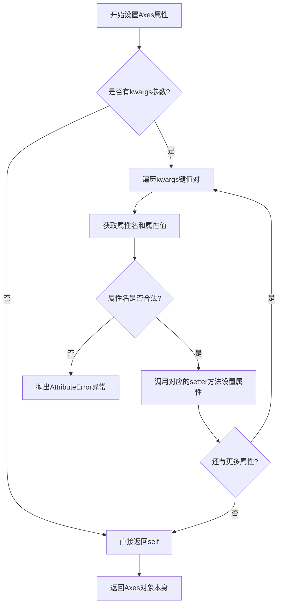

#### 带注释源码

```python
# 代码中的实际调用示例
ax.set(
    xlim=(0, 8),        # 设置x轴范围为0到8
    xticks=np.arange(1, 8),  # 设置x轴刻度为1到7的整数
    ylim=(0, 8),        # 设置y轴范围为0到8
    yticks=np.arange(1, 8)   # 设置y轴刻度为1到7的整数
)

# 内部实现逻辑（matplotlib Axes.set方法简化版）
def set(self, **kwargs):
    """
    设置axes的多个属性。
    
    参数:
        **kwargs: 关键字参数，键为属性名，值为属性值
        
    返回:
        self: 返回axes对象本身，支持链式调用
    """
    # 遍历所有传入的键值对
    for attr, value in kwargs.items():
        # 根据属性名动态获取对应的setter方法
        # 例如: 'xlim' -> set_xlim, 'title' -> set_title
        method_name = f'set_{attr}'
        
        # 检查方法是否存在
        if hasattr(self, method_name):
            # 调用对应的setter方法设置属性值
            getattr(self, method_name)(value)
        else:
            # 属性不存在时抛出异常
            raise AttributeError(f"'{type(self).__name__}' object has no attribute '{attr}'")
    
    # 返回self以支持链式调用
    return self
```

### 补充说明

#### 设计目标与约束

- **设计目标**：提供统一的接口来批量设置axes的多种属性，避免多次单独调用
- **约束**：传入的属性名必须是Axes对象支持的合法属性，否则抛出异常

#### 错误处理与异常设计

- 当传入非法的属性名时，抛出`AttributeError`异常
- 属性值类型需与对应setter方法的要求匹配

#### 外部依赖与接口契约

- 依赖于matplotlib的Axes类内部的各种setter方法（如set_xlim、set_ylim等）
- 返回self以支持链式调用是matplotlib的常见设计模式


## 关键组件


### 数据生成模块

使用 numpy 生成 x 轴数据以及两条曲线 y1 和 y2 的数据，其中 y1 和 y2 包含随机扰动

### 图形创建模块

使用 matplotlib 的 subplots 创建图形窗口和坐标轴对象

### fill_between 填充组件

使用 ax.fill_between 方法填充两条水平曲线之间的区域，设置透明度为 0.5，线宽为 0

### plot 绘制组件

使用 ax.plot 绘制两条曲线的平均值线，设置线宽为 2

### 坐标轴配置组件

设置 x 轴和 y 轴的显示范围以及刻度值，范围均为 0-8，刻度为 1-7

### 图形显示组件

使用 plt.show() 渲染并显示最终的图形


## 问题及建议


### 已知问题

-   **硬编码的魔法数字**：代码中多处使用硬编码数值（如 `0, 8`、`16`、`0.0, 0.5`、`1, 8` 等），这些值缺乏语义化命名，不利于后期维护和修改
-   **随机噪声生成重复**：`np.random.uniform(0.0, 0.5, len(x))` 调用了两次，违反 DRY 原则，增加维护成本
-   **缺乏输入数据验证**：未对 `x`、`y1`、`y2` 的维度一致性、数据类型进行校验，可能导致运行时错误
-   **全局样式污染**：`plt.style.use('_mpl-gallery')` 修改全局样式，但没有对应的清理机制，可能影响后续绘图
-   **缺少文档和类型提示**：整个脚本缺少文档字符串和类型注解，降低代码可读性和可维护性
-   **图形资源未释放**：`plt.show()` 后未调用 `plt.close(fig)`，在长时间运行或大量绘图场景中可能导致资源泄漏

### 优化建议

-   **提取配置常量**：将所有魔法数字定义为模块级常量或配置类，提供语义化命名
-   **封装噪声生成函数**：创建 `generate_noise(size, low, high)` 函数，消除重复代码
-   **添加数据验证**：在绘图前验证 `x`、`y1`、`y2` 长度一致性和数值类型
-   **使用上下文管理器**：通过 `plt.style.context()` 或手动保存/恢复样式状态
-   **完善文档和类型注解**：为脚本和函数添加 docstring 及类型提示
-   **资源管理**：在 `plt.show()` 后添加 `plt.close(fig)` 确保资源释放

## 其它


### 设计目标与约束

本代码的核心目标是演示matplotlib库中fill_between函数的基本用法，即如何在两条水平曲线之间填充区域。具体设计目标包括：(1) 生成两组具有线性趋势但带有随机扰动的数据点；(2) 使用fill_between绘制两条曲线之间的填充区域；(3) 同时绘制两条曲线的平均线以便可视化对比。设计约束方面，代码固定使用_mpl-gallery样式，x轴范围为0-8，y轴范围为0-8，数据点数量为16个。

### 错误处理与异常设计

由于本代码为演示脚本，主要依赖matplotlib和numpy的内部错误处理机制。可能的异常情况包括：(1) x、y1、y2数组长度不匹配时，numpy会抛出广播相关错误；(2) 当数组包含NaN或Inf值时，fill_between可能产生警告或异常可视化结果；(3) matplotlib后端未正确初始化时plt.show()可能失败。代码未实现显式的异常捕获机制，生产环境中建议添加数据验证和异常捕获逻辑。

### 数据流与状态机

数据流主要分为三个阶段：数据生成阶段（np.random.seed设置随机种子，生成x、y1、y2数组）、图形初始化阶段（创建fig和ax对象，设置坐标轴参数）、渲染阶段（调用fill_between和plot绘制，plt.show()显示）。状态机转换：初始状态 -> 数据就绪 -> 图形创建 -> 渲染完成 -> 显示状态。

### 外部依赖与接口契约

主要依赖包括matplotlib.pyplot（提供绘图API）、numpy（提供数值计算和数组操作）。接口契约方面：fill_between函数签名为fill_between(x, y1, y2, where=None, interpolate=False, step=None, **kwargs)，其中x、y1、y2应为相同长度的数组；plot函数返回Line2D对象列表；subplots()返回(fig, ax)元组。版本要求：matplotlib 3.0+、numpy 1.0+。

### 性能考虑

当前代码数据规模较小（16个数据点），性能表现良好。优化建议：(1) 对于大规模数据集，可考虑使用interpolate=False减少计算量；(2) 大量数据点时linewidth=0可能导致渲染缓慢，可适当调整；(3) 若需频繁更新图表，建议保留fig和ax引用而非每次重新创建。

### 安全性考虑

代码为本地演示脚本，不涉及网络通信或用户输入，安全性风险较低。潜在风险点：np.random.seed(1)使用固定种子可能导致可预测的随机数序列，在安全相关应用中应使用更安全的随机数生成器。

### 测试策略

建议测试场景包括：(1) 不同长度数组输入时的错误处理；(2) 包含NaN/Inf值的数据渲染；(3) 不同matplotlib后端兼容性；(4) 坐标轴范围设置的边界条件；(5) alpha参数和linewidth参数的各种组合。

### 部署/运行要求

运行环境要求：Python 3.6+，matplotlib 3.0+，numpy 1.0+。运行方式：直接执行脚本（python script.py）或在Jupyter Notebook中运行。无需额外配置文件，matplotlib将使用默认后端或_mpl-gallery样式。

### 版本兼容性

代码使用了相对现代的matplotlib API（subplots返回元组、fill_between的alpha参数）。向后兼容性良好，matplotlib 2.0+版本均可正常运行。numpy的广播机制确保不同形状数组的兼容性。

### 配置文件

无显式配置文件。样式通过plt.style.use('_mpl-gallery')动态加载，该样式为matplotlib内置样式。若需自定义样式，可创建matplotlibrc文件或使用plt.rcParams进行运行时配置。

### 示例/用例

扩展用例包括：(1) 使用where参数实现条件填充（仅填充特定区域）；(2) 使用color参数设置填充颜色；(3) 使用hatch参数添加纹理；(4) 结合fill_betweenx实现垂直方向填充；(5) 在动画中动态更新填充区域。

### 维护建议

代码结构清晰，适合作为入门教程。改进建议：(1) 将数据生成、绘图配置、显示逻辑分离为独立函数；(2) 添加类型注解提升代码可读性；(3) 将硬编码参数（如8、16、0.5）提取为常量或配置参数；(4) 添加docstring说明函数用途。

### 参考资料

matplotlib官方文档：https://matplotlib.org/stable/api/_as_gen/matplotlib.axes.Axes.fill_between.html；numpy官方文档：https://numpy.org/doc/stable/；matplotlib Gallery示例：https://matplotlib.org/stable/gallery/index.html

    