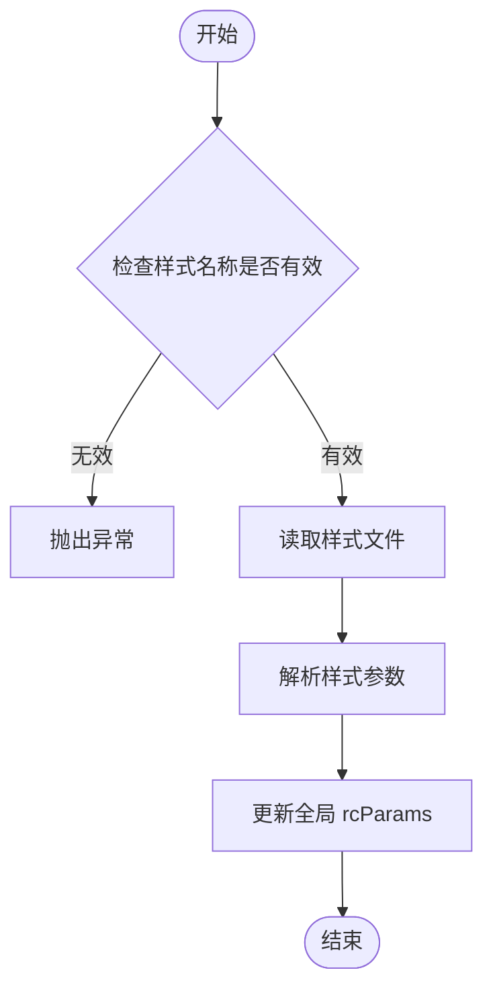
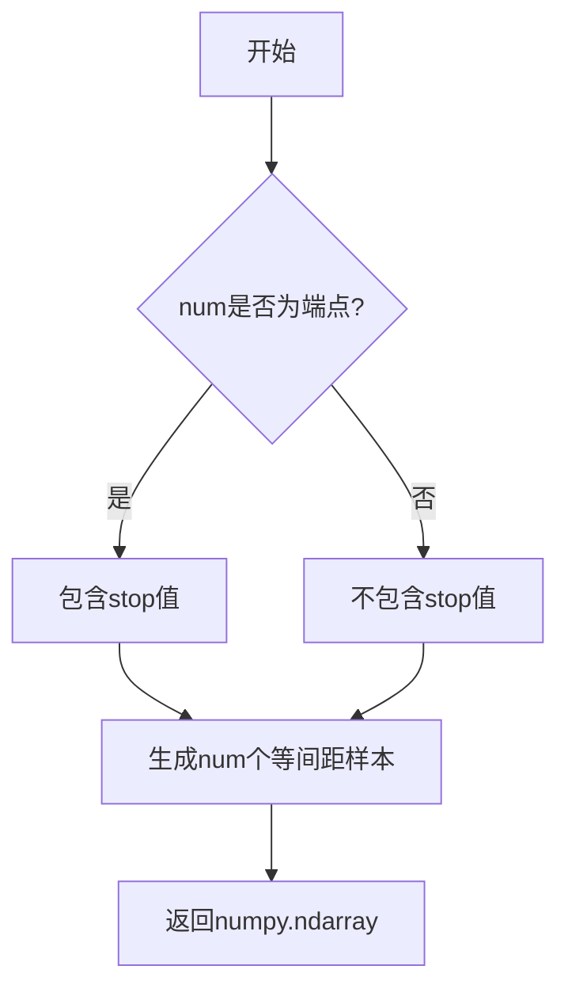
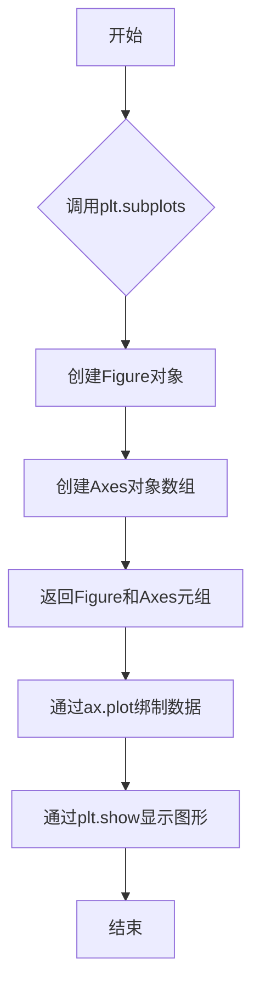
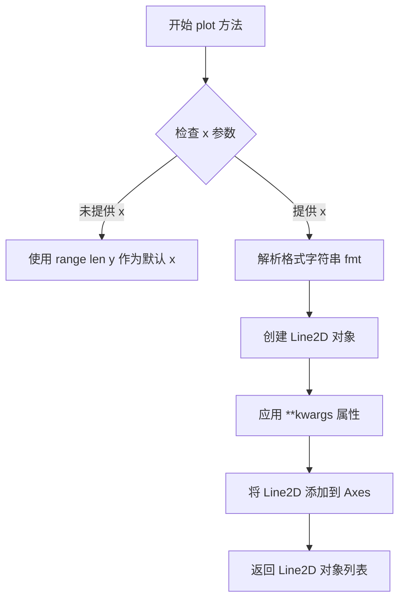
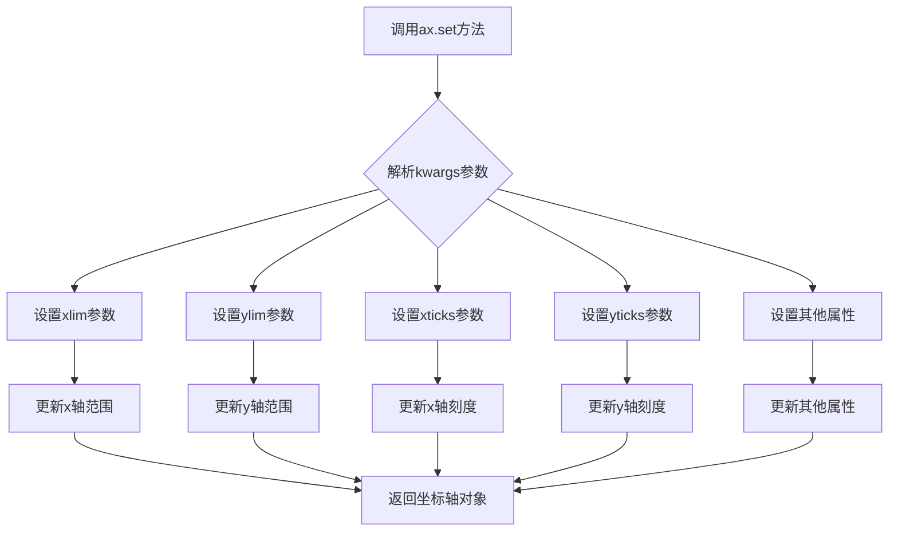
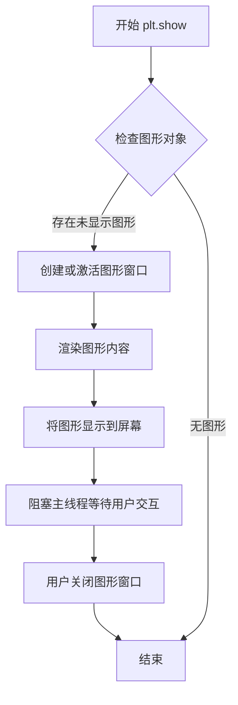

# `matplotlib\galleries\plot_types\basic\plot.py` 详细设计文档

这是一个使用matplotlib和numpy绑制正弦波图形的示例脚本，通过创建两组数据（x, y和x2, y2），利用Figure和Axes对象绑制三条不同样式的曲线，并设置坐标轴范围后显示图形。

## 整体流程

```mermaid
graph TD
    A[开始] --> B[导入模块: matplotlib.pyplot, numpy]
    B --> C[使用mpl-gallery样式]
    C --> D[生成数据: x和y数组 (100个点)]
    D --> E[生成数据: x2和y2数组 (25个点)]
    E --> F[创建Figure和Axes对象]
    F --> G[绑制第一条曲线: y+2.5 使用x标记]
    G --> H[绑制第二条曲线: y 使用线宽2.0]
    H --> I[绑制第三条曲线: y2-2.5 使用圆点标记]
    I --> J[设置坐标轴: xlim, xticks, ylim, yticks]
    J --> K[调用plt.show显示图形]
    K --> L[结束]
```

## 类结构

```
matplotlib.pyplot (主模块)
├── Figure (图形容器)
└── Axes (坐标轴/子图)
numpy (数值计算模块)
└── linspace (等差数列生成)
```

## 全局变量及字段


### `x`
    
0到10之间的100个等差点

类型：`numpy.ndarray`
    


### `y`
    
基于x的正弦波数据

类型：`numpy.ndarray`
    


### `x2`
    
0到10之间的25个等差点

类型：`numpy.ndarray`
    


### `y2`
    
基于x2的正弦波数据

类型：`numpy.ndarray`
    


### `fig`
    
图形对象

类型：`matplotlib.figure.Figure`
    


### `ax`
    
坐标轴对象

类型：`matplotlib.axes.Axes`
    


    

## 全局函数及方法


### `plt.style.use`

设置Matplotlib的绘图样式。该函数根据传入的样式名称（style_name）加载对应的样式文件，并将其参数应用到全局的 `rcParams` 中，从而改变后续图表的视觉外观（如颜色、字体、背景等）。在给定的代码中，通过 `plt.style.use('_mpl-gallery')` 调用，将当前绘图环境设置为 `'_mpl-gallery'` 样式。

参数：

-  `style_name`：`str`，要使用的样式名称。在代码中为 `'_mpl-gallery'`。

返回值：`None`，该函数主要通过修改全局配置生效，不返回任何值。

#### 流程图



#### 带注释源码

```python
def use(style_name):
    """
    设置matplotlib的默认样式。
    
    参数:
        style_name (str): 样式名称，可以是字符串或字符串列表。
    """
    # 1. 获取matplotlib的全局配置对象
    # rc = rcParams
    
    # 2. 检查传入的样式是否在可用样式列表中
    # if style_name not in available_styles:
    #     raise ValueError(f"Style '{style_name}' not found.")
    
    # 3. 根据样式名称定位并读取样式文件（通常是 .mplstyle 格式）
    # style_path = get_style_path(style_name)
    # style_data = load_file(style_path)
    
    # 4. 解析样式数据为字典格式（例如 {'lines.linewidth': 2.0, 'axes.facecolor': 'white'}）
    # params = parse_style(style_data)
    
    # 5. 将解析出的参数更新到全局 rcParams 中，使其全局生效
    # rc.update(params)
    
    # 6. 返回空值 (None)
    return None
```


### `np.linspace`

生成等差数列，返回一个指定数量的等间距数值序列。

参数：

- `start`：`float`，序列的起始值
- `stop`：`float`，序列的结束值
- `num`：`int`，要生成的样本数量，默认为50

返回值：`numpy.ndarray`，包含等差数列的NumPy数组

#### 流程图



#### 带注释源码

```python
# np.linspace 函数源码逻辑示意
def linspace(start, stop, num=50, endpoint=True, retstep=False, dtype=None, axis=0):
    """
    生成等差数列
    
    参数:
        start: 序列起始值
        stop: 序列结束值
        num: 样本数量，默认为50
        endpoint: 是否包含结束点，默认为True
        retstep: 是否返回步长
        dtype: 输出数组的数据类型
        axis: 数组轴向
    
    返回:
        numpy.ndarray: 等差数列数组
    """
    # 计算步长 (stop - start) / (num - 1) 或 (stop - start) / num
    if endpoint:
        step = (stop - start) / (num - 1)
    else:
        step = (stop - start) / num
    
    # 生成数组: start, start+step, start+2*step, ...
    y = np.arange(0, num) * step + start
    
    # 处理endpoint情况
    if endpoint and num > 0:
        y[-1] = stop  # 确保最后一个值精确等于stop
    
    return y
```

---

## 完整设计文档

### 一段话描述

该代码是一个Matplotlib数据可视化示例，通过`np.linspace`生成等差数列作为x轴数据，结合正弦函数计算y轴数据，并使用三种不同的绘图样式（散点、线条、带标记线条）在画布上绘制三条曲线，最后设置坐标轴范围和刻度后展示图形。

### 文件的整体运行流程

1. **导入模块**：导入matplotlib.pyplot和numpy库
2. **设置样式**：使用`plt.style.use('_mpl-gallery')`设置绘图风格
3. **生成数据**：
   - 使用`np.linspace`生成100个x点（0到10）
   - 计算对应的y值（4 + sin(2x)）
   - 生成25个x2点用于离散采样
4. **创建画布**：使用`plt.subplots()`创建图形和坐标轴对象
5. **绘制图形**：调用三次`ax.plot()`绘制三条曲线
6. **设置坐标轴**：通过`ax.set()`设置x和y轴的范围和刻度
7. **展示图形**：调用`plt.show()`显示最终图像

### 关键组件信息

| 组件名称 | 一句话描述 |
|---------|-----------|
| `np.linspace` | NumPy库中等差数列生成函数，用于创建均匀间隔的数值序列 |
| `np.sin` | NumPy库中的正弦函数，用于计算数学正弦值 |
| `plt.subplots` | Matplotlib中创建图形和坐标轴的便捷函数 |
| `ax.plot` | Axes对象的绘图方法，用于绘制线型图 |
| `ax.set` | Axes对象的设置方法，用于配置坐标轴属性 |

### 潜在的技术债务或优化空间

1. **硬编码参数**：数值范围(0, 10)、采样数量(100, 25)、振幅(1)和偏移量(4)均为硬编码，建议提取为配置常量
2. **魔法数字**：坐标轴范围(0, 8)和刻度(1-8)存在Magic Numbers，缺乏明确含义
3. **重复代码**：多次调用`ax.plot()`存在重复模式，可考虑封装为函数
4. **注释缺失**：代码缺乏整体逻辑注释，后续维护困难

### 其它项目

#### 设计目标与约束
- 目标：展示Matplotlib基本绘图能力，包括线图、散点图和组合样式
- 约束：使用内置样式`_mpl-gallery`，保持图形简洁专业

#### 错误处理与异常设计
- 当前代码未做错误处理，假设输入参数均为有效数值
- `num`参数为0或负数时可能导致异常
- `np.linspace`的`num`参数必须为非负整数

#### 数据流与状态机
- 数据流：参数配置 → 数据生成 → 图形绑定 → 样式设置 → 渲染展示
- 状态机：初始化(Import) → 数据准备(Data Preparation) → 绘图绑定(Plot Binding) → 渲染展示(Rendering)

#### 外部依赖与接口契约
- **NumPy**：提供数值计算和数组操作能力
- **Matplotlib**：提供2D绘图和可视化能力
- 版本要求：NumPy 1.x + Matplotlib 3.x（推荐）


### `plt.subplots`

`plt.subplots` 是 matplotlib 库中的一个函数，用于创建一个新的图形窗口和一个或多个坐标轴。在本代码中，该函数以默认参数（nrows=1, ncols=1）被调用，创建一个包含单个坐标轴的图形对象，供后续绑制数据使用。

参数：

- `nrows`：`int`，可选参数，表示图形的行数，默认为1
- `ncols`：`int`，可选参数，表示图形的列数，默认为1

返回值：`tuple(Figure, Axes)`，返回一个元组，包含图形对象（Figure）和坐标轴对象（Axes）。图形对象代表整个绑图窗口，坐标轴对象用于绑制数据。

#### 流程图



#### 带注释源码

```python
"""
==========
plot(x, y)
==========
Plot y versus x as lines and/or markers.

See `~matplotlib.axes.Axes.plot`.
"""

# 导入matplotlib的pyplot模块，用于绑图
import matplotlib.pyplot as plt
# 导入numpy模块，用于数值计算
import numpy as np

# 使用matplotlib的内置样式 '_mpl-gallery'
plt.style.use('_mpl-gallery')

# 使用numpy生成数据：x从0到10的100个等间距点
x = np.linspace(0, 10, 100)
# 计算y值：4 + 1 * sin(2 * x)
y = 4 + 1 * np.sin(2 * x)
# x2从0到10的25个等间距点
x2 = np.linspace(0, 10, 25)
# 计算y2值：4 + 1 * sin(2 * x2)
y2 = 4 + 1 * np.sin(2 * x2)

# 调用plt.subplots创建图形和坐标轴
# 等同于 plt.subplots(nrows=1, ncols=1)
# 返回fig(图形对象)和ax(坐标轴对象)
fig, ax = plt.subplots()

# 在坐标轴上绑制第一条数据：x2, y2+2.5，使用'x'标记，标记边缘宽度为2
ax.plot(x2, y2 + 2.5, 'x', markeredgewidth=2)
# 在坐标轴上绑制第二条数据：x, y，线条宽度为2.0
ax.plot(x, y, linewidth=2.0)
# 在坐标轴上绑制第三条数据：x2, y2-2.5，使用'o-'标记（圆圈加线条），线条宽度为2
ax.plot(x2, y2 - 2.5, 'o-', linewidth=2)

# 设置坐标轴的范围和刻度
ax.set(xlim=(0, 8), xticks=np.arange(1, 8),
       ylim=(0, 8), yticks=np.arange(1, 8))

# 显示绑制好的图形
plt.show()
```


### `matplotlib.axes.Axes.plot`

该方法是 Matplotlib 中 Axes 类的核心成员，用于绑制 y 关于 x 的线条和/或标记，返回 Line2D 对象列表。

参数：

- `x`：`array-like`，可选，x 轴数据。如果未提供，则使用 `range(len(y))`
- `y`：`array-like`，y 轴数据，必填
- `fmt`：`str`，可选，格式字符串，指定线条颜色、标记样式和线条样式（如 `'o-'` 表示圆形标记加实线）
- `**kwargs`：可变关键字参数，用于设置 Line2D 的各种属性，如 `linewidth`、`markeredgewidth`、`color` 等

返回值：`list[Line2D]`，返回由该绑制命令创建的 Line2D 对象列表

#### 流程图



#### 带注释源码

```python
# 注意：这是 matplotlib 库内置方法的调用示例
# 源码位于 matplotlib 库中，此处展示典型的使用方式

# 第一次调用：使用 'x' 标记，无线条
ax.plot(x2, y2 + 2.5, 'x', markeredgewidth=2)
#  - x2: x 轴数据
#  - y2 + 2.5: y 轴数据（向上偏移）
#  - 'x': 格式字符串，表示使用 'x' 标记
#  - markeredgewidth=2: 标记边缘宽度

# 第二次调用：使用线条，无标记
ax.plot(x, y, linewidth=2.0)
#  - x: x 轴数据
#  - y: y 轴数据
#  - linewidth=2.0: 线条宽度

# 第三次调用：使用圆形标记和实线
ax.plot(x2, y2 - 2.5, 'o-', linewidth=2)
#  - x2: x 轴数据
#  - y2 - 2.5: y 轴数据（向下偏移）
#  - 'o-': 格式字符串，'o' 表示圆形标记，'-' 表示实线
#  - linewidth=2: 线条宽度
```


### `ax.set`

设置坐标轴属性，允许通过关键字参数配置x轴和y轴的范围、刻度等属性。

参数：

- `**kwargs`：可变关键字参数，用于设置坐标轴属性。支持的参数包括xlim（x轴范围）、ylim（y轴范围）、xticks（x轴刻度位置）、yticks（y轴刻度位置）、xlabel（x轴标签）、ylabel（y轴标签）、title（图表标题）等。

返回值：`unknown`，实际返回坐标轴对象（Axes），用于方法链式调用。

#### 流程图



#### 带注释源码

```python
# 在代码中的实际使用方式：
ax.set(xlim=(0, 8),       # 设置x轴范围为0到8
       xticks=np.arange(1, 8),  # 设置x轴刻度为1到7
       ylim=(0, 8),       # 设置y轴范围为0到8
       yticks=np.arange(1, 8)) # 设置y轴刻度为1到7

# matplotlib中ax.set方法的典型实现结构（简化版）
def set(self, **kwargs):
    """
    设置坐标轴的一个或多个属性。
    
    参数:
        **kwargs: 关键字参数，用于设置各种坐标轴属性
            - xlim: x轴范围元组 (min, max)
            - ylim: y轴范围元组 (min, max)  
            - xticks: x轴刻度位置数组
            - yticks: y轴刻度位置数组
            - xlabel: x轴标签字符串
            - ylabel: y轴标签字符串
            - title: 图表标题字符串
            - 等等其他Axes属性
    
    返回:
        返回self（坐标轴对象），支持链式调用
    """
    # 遍历所有关键字参数
    for attr, value in kwargs.items():
        # 根据属性名设置对应的值
        if attr == 'xlim':
            self.set_xlim(value)
        elif attr == 'ylim':
            self.set_ylim(value)
        elif attr == 'xticks':
            self.set_xticks(value)
        elif attr == 'yticks':
            self.set_yticks(value)
        # ... 处理其他属性
        else:
            # 通用属性设置
            setattr(self, attr, value)
    
    return self  # 返回self以支持链式调用
```


### `plt.show()`

`plt.show()` 是 Matplotlib 库中的全局函数，用于显示当前打开的所有图形窗口，并将图形渲染到屏幕。在该代码中，它负责将之前通过 `ax.plot()` 创建的三条曲线图形渲染并展示给用户。

参数：此函数不接受任何参数。

返回值：`None`，无返回值，仅用于图形展示的副作用。

#### 流程图



#### 带注释源码

```python
# plt.show() 的调用示例
# 在完成所有绘图配置后调用此函数

# 导入必要的库
import matplotlib.pyplot as plt
import numpy as np

# 使用内置绘图风格
plt.style.use('_mpl-gallery')

# ========== 数据准备阶段 ==========
# 生成0到10之间的100个等间距点作为x轴数据
x = np.linspace(0, 10, 100)
# 计算y值: 4 + sin(2x)，生成正弦波形数据
y = 4 + 1 * np.sin(2 * x)
# 生成0到10之间的25个等间距点作为x2数据（较粗的采样点）
x2 = np.linspace(0, 10, 25)
# 计算y2值，同样基于正弦函数
y2 = 4 + 1 * np.sin(2 * x2)

# ========== 绘图阶段 ==========
# 创建一个新的图形窗口和一个Axes对象（返回fig画布和ax坐标轴对象）
fig, ax = plt.subplots()

# 绘制第一条曲线：x2 vs y2+2.5，使用'x'标记样式，边框宽度为2
ax.plot(x2, y2 + 2.5, 'x', markeredgewidth=2)

# 绘制第二条曲线：x vs y，使用实线，线宽为2.0
ax.plot(x, y, linewidth=2.0)

# 绘制第三条曲线：x2 vs y2-2.5，使用'o-'标记（圆圈+实线），线宽为2
ax.plot(x2, y2 - 2.5, 'o-', linewidth=2)

# ========== 坐标轴配置阶段 ==========
# 设置x轴范围为0到8，x轴刻度为1到7
# 设置y轴范围为0到8，y轴刻度为1到7
ax.set(xlim=(0, 8), xticks=np.arange(1, 8),
       ylim=(0, 8), yticks=np.arange(1, 8))

# ========== 图形显示阶段 ==========
# 调用plt.show()将上述所有配置渲染到窗口并显示
# 这是阻塞调用，会等待用户关闭图形窗口后继续执行
plt.show()
```


## 关键组件


### matplotlib.pyplot

matplotlib的pyplot模块，提供MATLAB风格的绘图接口，用于创建图形和图表。

### numpy (np)

Python数值计算库，用于生成数组数据和数学运算，如正弦函数计算。

### 数据生成模块

使用np.linspace生成x轴数据点，使用np.sin生成y轴正弦波形数据，包含两个不同分辨率的数据集(x, y)和(x2, y2)。

### 图表对象 (fig, ax)

使用plt.subplots()创建的Figure和Axes对象，是matplotlib的核心容器，用于承载和操作图形元素。

### 绑制方法 (ax.plot)

Axes对象的plot方法，用于绑制线型和 markers 的数据，支持多种绑图样式参数如'x'、'o-'、linewidth等。

### 坐标轴配置 (ax.set)

用于设置图表的x轴和y轴范围(xlim, xticks, ylim, yticks)，实现坐标轴的定制化显示。

### 图形显示 (plt.show())

调用matplotlib的显示函数，将绑好的图形渲染到屏幕或保存到文件。


## 问题及建议


### 已知问题

-   魔法数字（Magic Numbers）过多：代码中包含大量硬编码的数值（如0、10、100、25、4、1、2、2.5、8等），缺乏可配置的常量定义，降低了代码的可维护性和可读性
-   数据生成逻辑重复：y和y2使用了相同的数学公式4 + 1 * sin(2 * x)进行计算，存在代码重复，可以封装为函数
-   缺乏错误处理：没有对输入数据范围、数值有效性等进行验证，运行时可能因异常数据导致程序崩溃
-   无函数化封装：所有代码逻辑平铺在全局作用域，未进行任何函数或类的封装，降低了代码的可复用性和可测试性
-   图表保存功能缺失：plt.show()直接展示图表，但没有保存为文件的选项（如PNG、SVG格式），不便于后续使用
-   样式依赖问题：使用了内部样式'_mpl-gallery'，这是matplotlib内部的非公开样式，可能在不同版本中不可用或行为不一致
-   缺乏文档注释：除了文件头部的docstring外，代码中无任何注释说明各部分的功能意图
-   变量命名可优化：x2、y2等命名不够直观，应使用更具描述性的名称

### 优化建议

-   定义配置常量：将所有硬编码数值提取为具名常量，如SAMPLE_COUNT = 100、AMPLITUDE = 1等
-   封装数据生成函数：创建generate_sine_wave()函数，接收参数返回计算后的数据，避免公式重复
-   添加数据验证：在数据生成后检查数值范围、数组长度等，确保符合预期
-   封装绘图逻辑：将绘图流程封装为函数或类方法，接受数据参数，提高复用性
-   添加保存功能：在plt.show()前添加fig.savefig()调用，支持导出多种格式
-   使用公开样式或自定义样式：避免使用_mpl-gallery这类内部样式，改用'module://'指向的自定义样式文件或标准样式
-   增加注释和文档：为关键代码块添加注释说明，编写函数docstring
-   改进变量命名：使用更描述性的名称，如x_coarse、y_coarse或x_smooth、y_smooth


## 其它


### 设计目标与约束

**设计目标**：使用matplotlib和numpy库绑制正弦波数据可视化图表，展示三条不同风格的线条（散点图、实线、点线组合），并设置坐标轴范围和刻度。

**约束条件**：
- 依赖matplotlib和numpy两个外部库
- 使用mpl-gallery绘图风格
- 输出窗口图表，需要图形界面支持

### 错误处理与异常设计

- **ImportError**：当matplotlib或numpy未安装时抛出ImportError，建议使用pip安装
- **RuntimeError**：当plt.show()无法显示图形时（如无GUI环境）可能抛出RuntimeError
- **数值计算异常**：np.linspace参数无效时可能产生空数组导致警告

### 外部依赖与接口契约

**依赖库**：
- `matplotlib>=3.0.0`：绘图库，导入plt、style、subplots
- `numpy>=1.20.0`：数值计算库，导入linspace、sin函数

**接口说明**：
- `plt.style.use()`：接受字符串参数设置绘图风格
- `plt.subplots()`：返回(fig, ax)元组，fig为Figure对象，ax为Axes对象
- `ax.plot()`：接受x数组、y数组、格式字符串，返回Line2D对象列表
- `ax.set()`：设置坐标轴参数，接收kwargs

### 数据流与状态机

**数据流**：
1. 输入：空
2. 处理：生成x、y、x2、y2四个numpy数组
3. 输出：窗口显示图形

**状态转换**：
- 初始化状态 → 数据准备状态 → 图形创建状态 → 绑制状态 → 显示状态

### 性能考虑与优化空间

- 当前使用np.sin对整个数组操作，已使用向量化计算，性能良好
- 可优化点：避免重复计算sin(2*x)，可缓存结果
- 可优化点：x2和y2数据点较少(25个)，适合标记显示；x数据点(100个)适合连线

### 可维护性与扩展性

- 代码结构清晰，但硬编码参数过多
- 建议：将数据生成参数（振幅、频率、偏移量）提取为配置变量
- 建议：将绑制逻辑封装为函数，支持参数化调用

### 测试策略

- 单元测试：验证数据生成函数的输出维度正确性
- 集成测试：验证图形能正常创建和显示
- 边界测试：测试极端参数（如x范围为0、数组为空）

### 安全性考虑

- 代码本身无用户输入，无注入风险
- 无敏感数据处理
- 无网络请求

### 版本兼容性

- 代码使用现代Python语法（类型注解未使用）
- 兼容Python 3.8+
- matplotlib 3.0+、numpy 1.20+版本兼容

### 资源管理

- 图形对象使用完毕自动释放
- 无显式资源清理需求
- 内存占用主要来自numpy数组，随程序结束释放


    