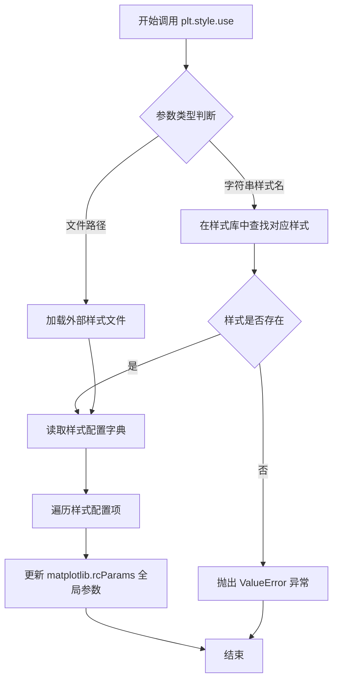
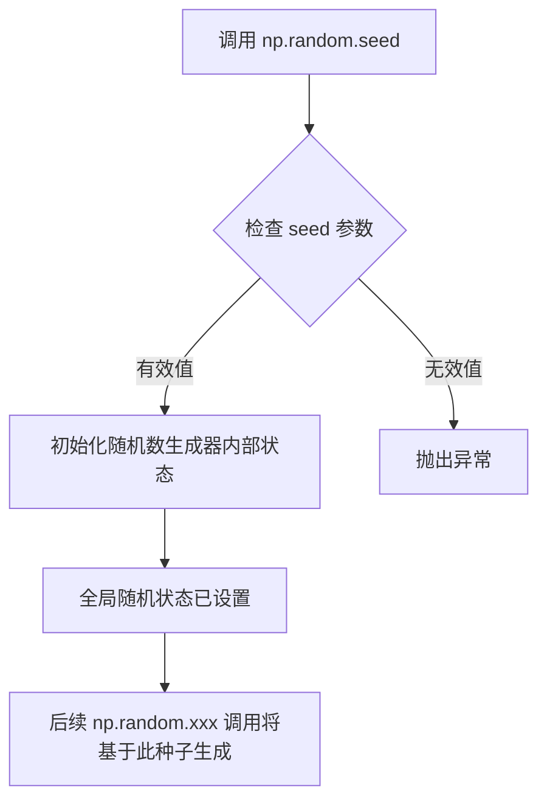
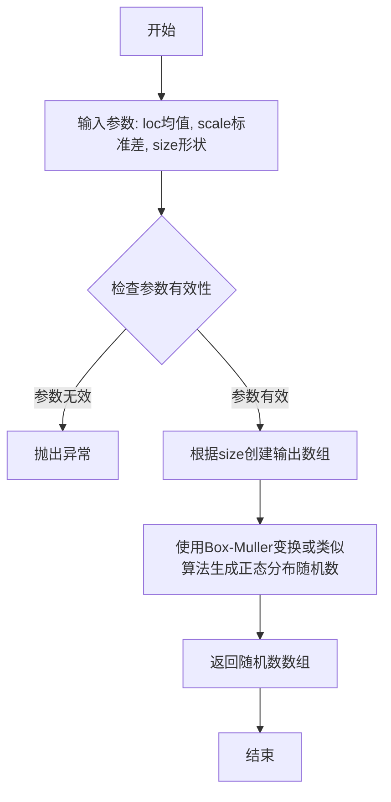
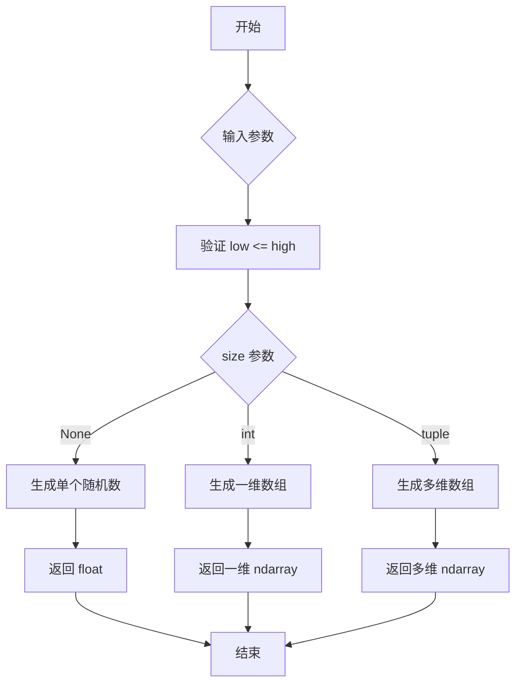
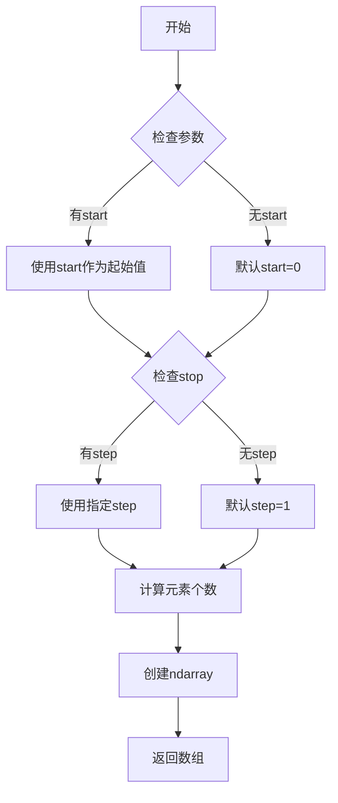
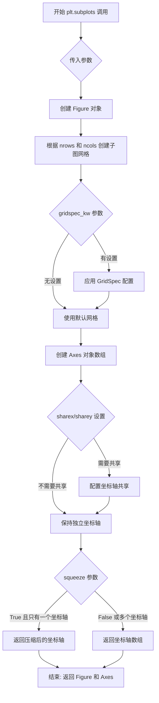
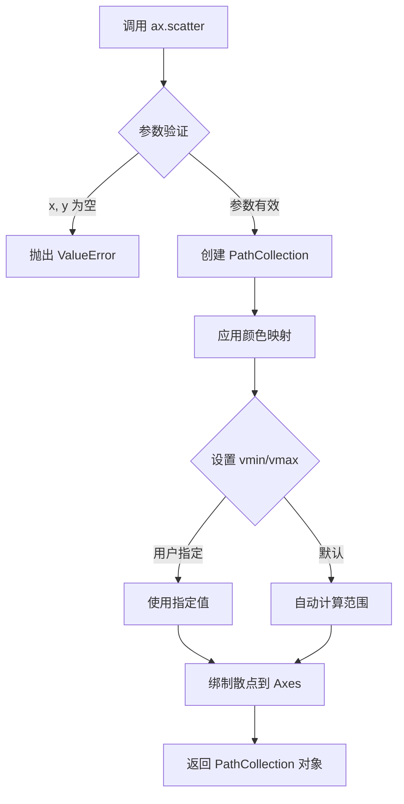
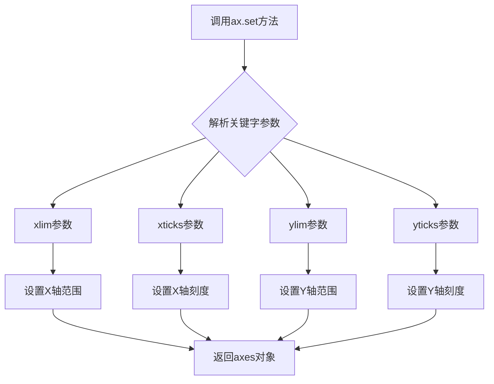

# `matplotlib\galleries\plot_types\basic\scatter_plot.py` 详细设计文档

这是一个使用matplotlib绑制散点图的示例代码，通过numpy生成随机分布的坐标点，并根据随机生成的大小和颜色参数进行可视化展示，最终显示一个带有自定义坐标轴范围的散点图。

## 整体流程

```mermaid
graph TD
    A[开始] --> B[导入依赖模块: matplotlib.pyplot, numpy]
    B --> C[设置绘图样式: plt.style.use('_mpl-gallery')]
    C --> D[设置随机种子: np.random.seed(3)]
    D --> E[生成x坐标数据: 4 + np.random.normal(0, 2, 24)]
    E --> F[生成y坐标数据: 4 + np.random.normal(0, 2, len(x))]
    F --> G[生成随机大小: np.random.uniform(15, 80, len(x))]
    G --> H[生成随机颜色: np.random.uniform(15, 80, len(x))]
    H --> I[创建画布和坐标轴: fig, ax = plt.subplots()]
    I --> J[绑制散点图: ax.scatter(x, y, s=sizes, c=colors, vmin=0, vmax=100)]
    J --> K[设置坐标轴: ax.set(xlim=(0, 8), xticks, ylim=(0, 8), yticks)]
    K --> L[显示图形: plt.show()]
    L --> M[结束]
```

## 类结构

```
无类定义 (脚本式代码)
├── 导入模块
│   ├── matplotlib.pyplot (as plt)
│   └── numpy (as np)
├── 数据生成区
│   ├── x (随机坐标数组)
│   ├── y (随机坐标数组)
│   ├── sizes (随机大小数组)
│   └── colors (随机颜色数组)
├── 绑图区
│   ├── fig (Figure对象)
│   ├── ax (Axes对象)
│   └── scatter (散点图)
└── 配置区
```

## 全局变量及字段


### `x`
    
随机生成的x坐标数据，服从正态分布(均值4, 标准差2, 24个点)

类型：`numpy.ndarray`
    


### `y`
    
随机生成的y坐标数据，服从正态分布(均值4, 标准差2, 24个点)

类型：`numpy.ndarray`
    


### `sizes`
    
随机生成的散点大小数组，服从均匀分布(15到80之间)

类型：`numpy.ndarray`
    


### `colors`
    
随机生成的散点颜色数组，服从均匀分布(15到80之间)

类型：`numpy.ndarray`
    


### `fig`
    
matplotlib创建的图形对象

类型：`matplotlib.figure.Figure`
    


### `ax`
    
matplotlib创建的坐标轴对象

类型：`matplotlib.axes.Axes`
    


    

## 全局函数及方法


### `plt.style.use()`

设置 matplotlib 的全局绘图样式，改变后续所有图表的视觉外观，包括背景色、网格线、字体等元素的主题风格。

参数：

-  `style`：`str`，样式名称（如 'ggplot', 'seaborn'）或样式文件的路径

返回值：`None`，该函数无返回值，直接修改全局 matplotlib rcParams 配置

#### 流程图



#### 带注释源码

```python
import matplotlib.pyplot as plt
import matplotlib.style

# 使用预定义样式 - '_mpl-gallery' 是 matplotlib gallery 示例的专用样式
plt.style.use('_mpl-gallery')

# 可用的内置样式包括：'ggplot', 'seaborn', 'dark_background', 'bmh', 'fast' 等
# 也可加载自定义样式文件（.mplstyle 格式）

# 样式加载后会影响全局的 rcParams 设置
# 包括但不限于：figure.facecolor, axes.facecolor, grid.color, 
# font.size, lines.linewidth, axes.grid 等参数

# 后续所有 plt 创建的图表都会应用此样式
fig, ax = plt.subplots()
# fig 和 ax 的视觉属性已被样式 '_mpl-gallery' 自定义
```

#### 关键组件信息

| 组件名称 | 一句话描述 |
|---------|-----------|
| `matplotlib.style` | matplotlib 样式管理模块，提供样式加载与应用功能 |
| `rcParams` | 全局运行时配置字典，存储 matplotlib 的所有可配置参数 |
| `_mpl-gallery` | matplotlib 官方示例库的专用样式主题 |

#### 潜在技术债务与优化空间

1. **样式冲突风险**：`plt.style.use()` 会全局修改配置，可能与后续手动设置的 rcParams 产生冲突，建议在样式使用后通过 `plt.rcParams.update()` 进行局部覆盖
2. **样式回退机制缺失**：当前实现没有提供便捷的样式保存/恢复机制，复杂项目中建议封装上下文管理器
3. **样式验证不足**：传入无效样式名时仅抛出异常，可考虑返回更友好的错误提示信息

#### 其它说明

- **设计目标**：提供一键式 API 统一图表视觉风格，提升数据可视化的一致性与美观度
- **错误处理**：样式不存在时抛出 `ValueError`，文件路径无效时抛出 `FileNotFoundError`
- **外部依赖**：依赖 matplotlib 样式定义文件（通常位于 `matplotlib/mpl-data/stylelib/` 目录）
- **状态影响**：调用后影响全局状态，建议在脚本初始化阶段调用，且避免在循环中重复调用


### `np.random.seed`

设置 NumPy 随机数生成器的种子，用于生成可重现的随机数序列。

参数：

- `seed`：`int` 或 `array_like`，可选，用于初始化随机数生成器的种子值。如果使用相同的种子值，每次运行程序时将产生相同的随机数序列。

返回值：`None`，该函数不返回任何值，直接修改全局随机数生成器的内部状态。

#### 流程图



#### 带注释源码

```python
# 设置随机数种子为 3
# 这确保每次运行程序时，生成的随机数据都相同
# 有利于结果的可重现性和调试
np.random.seed(3)

# 基于上述种子生成符合正态分布的随机数据
x = 4 + np.random.normal(0, 2, 24)  # 生成24个均值为4、标准差为2的随机数
y = 4 + np.random.normal(0, 2, len(x))  # 生成与x相同数量的随机数

# 生成用于标记点大小和颜色的随机值
sizes = np.random.uniform(15, 80, len(x))    # 生成24个[15,80)区间均匀分布的随机数
colors = np.random.uniform(15, 80, len(x))   # 生成24个[15,80)区间均匀分布的随机数
```

#### 详细说明

| 项目 | 详情 |
|------|------|
| **函数来源** | NumPy 库的 `numpy.random` 模块 |
| **作用域** | 全局函数，影响整个程序的随机数生成 |
| **常见用途** | 机器学习实验复现、科学计算结果验证、测试用例随机数据生成 |
| **注意事项** | 在多线程环境下可能产生竞争条件，建议使用 `numpy.random.Generator` 以获得更好的线程安全性 |


### `np.random.normal`

生成符合正态分布（高斯分布）的随机数数组，用于模拟真实世界中的随机现象，如测量误差、数据波动等。

参数：

- `loc`：`float`，正态分布的均值（峰值位置），代码中传入 `0`
- `scale`：`float`，正态分布的标准差（分布的宽度），代码中传入 `2`
- `size`：`int` or `tuple of ints`，输出数组的形状，代码中传入 `24` 或 `len(x)`

返回值：`numpy.ndarray`，正态分布的随机数数组

#### 流程图



#### 带注释源码

```python
# numpy.random.normal 函数源码示例

def normal(loc=0.0, scale=1.0, size=None):
    """
    生成正态分布（高斯分布）的随机数。
    
    参数:
        loc: float, 正态分布的均值（μ），控制分布的中心位置
        scale: float, 正态分布的标准差（σ），控制分布的宽度
        size: int or tuple of ints, 输出数组的形状，默认为None返回单个值
    
    返回:
        numpy.ndarray or float: 正态分布的随机数
    """
    
    # 在代码中的实际调用:
    # x = 4 + np.random.normal(0, 2, 24)
    # 生成24个随机数，均值为0（加上4后变为4），标准差为2
    
    # y = 4 + np.random.normal(0, 2, len(x))
    # 生成len(x)个随机数，均值为0（加上4后变为4），标准差为2
    
    # 实现原理（简化版）:
    # 1. 使用 Box-Muller 变换将均匀分布随机数转换为正态分布
    # 2. 根据 size 参数确定输出形状
    # 3. 应用 loc 和 scale 进行变换: result = loc + scale * standard_normal
```


### `np.random.uniform`

生成符合均匀分布的随机数，从指定区间 [low, high) 中抽取样本，可控制输出形状。

参数：

- `low`：`float`，可选，默认 0.0。分布的下界（包含），生成随机数的最小值。
- `high`：`float`，可选，默认 1.0。分布的上界（不包含），生成随机数的最大值。
- `size`：`int` 或 `tuple` 或 `None`，可选，默认 None。输出数组的形状，如为 None 则返回单个标量。

返回值：`ndarray` 或 `float`。返回指定形状的随机数组，若 size 为 None 则返回单个浮点数。

#### 流程图



#### 带注释源码

```python
def uniform(low=0.0, high=1.0, size=None):
    """
    从均匀分布 [low, high) 中生成随机样本。
    
    参数:
        low: 分布下界，默认为 0.0
        high: 分布上界，默认为 1.0  
        size: 输出形状，None 返回标量
    
    返回:
        随机样本，类型为 float 或 ndarray
    """
    # 内部调用 RandomState 的 uniform 方法
    return np.random.RandomState().uniform(low, high, size)

# 示例用法（对应任务代码中的实际调用）
sizes = np.random.uniform(15, 80, len(x))    # 生成24个[15,80)区间均匀随机数
colors = np.random.uniform(15, 80, len(x))   # 生成24个[15,80)区间均匀随机数
```


### `np.arange()`

`np.arange()` 是 NumPy 库中的一个函数，用于生成一个等差数列的一维数组。它接受起始值、结束值、步长和数据类型参数，返回一个 numpy.ndarray 对象，常用于生成图表的刻度标签、循环索引等场景。

参数：

- `start`：`float`（可选），序列的起始值，默认为 0
- `stop`：`float`，序列的结束值（不包括该值）
- `step`：`float`（可选），步长，默认为 1
- `dtype`：`dtype`（可选），输出数组的数据类型

返回值：`numpy.ndarray`，包含等差数列的一维数组

#### 流程图



#### 带注释源码

```python
# np.arange() 函数的简化实现原理
def arange(start=0, stop=None, step=1, dtype=None):
    """
    生成等差数列数组的函数
    
    参数:
        start: 序列起始值，默认为0
        stop: 序列结束值（不包括）
        step: 步长，默认为1
        dtype: 输出数据类型
    
    返回:
        ndarray: 等差数列数组
    """
    # 如果只提供一个参数，则该参数作为stop值，起始值默认为0
    if stop is None:
        stop = start
        start = 0
    
    # 计算需要生成的元素个数
    # 使用数学公式: n = ceil((stop - start) / step)
    num = int(np.ceil((stop - start) / step))
    
    # 根据参数生成数组
    result = np.linspace(start, start + step * (num - 1), num)
    
    # 如果指定了dtype，则转换数据类型
    if dtype is not None:
        result = result.astype(dtype)
    
    return result

# 在代码中的实际使用示例
xticks = np.arange(1, 8)  # 生成 [1, 2, 3, 4, 5, 6, 7]
yticks = np.arange(1, 8)  # 生成 [1, 2, 3, 4, 5, 6, 7]
```


### `plt.subplots`

创建并返回一个图形（Figure）和一个或多个坐标轴（Axes）对象的函数。这是 Matplotlib 中最常用的创建图表接口之一，允许用户同时管理图形及其内部的坐标轴。

参数：

- `nrows`：int，默认值：1，指定子图网格的行数
- `ncols`：int，默认值：1，指定子图网格的列数
- `sharex`：bool 或 {'none', 'all', 'row', 'col'}，默认值：False，控制是否共享x轴
- `sharey`：bool 或 {'none', 'all', 'row', 'col'}，默认值：False，控制是否共享y轴
- `squeeze`：bool，默认值：True，是否压缩返回的坐标轴数组维度
- `width_ratios`：array-like，可选，指定各列的宽度比例
- `height_ratios`：array-like，可选，指定各行的宽度比例
- `gridspec_kw`：dict，可选，传递给 GridSpec 的参数字典
- `**fig_kw`：可变关键字参数，传递给 Figure 构造函数的参数（如 figsize, dpi 等）

返回值：`tuple(Figure, Axes or array of Axes)`，返回图形对象和坐标轴对象（或坐标轴数组）。当 nrows=1 且 ncols=1 时，返回一个坐标轴对象；否则返回坐标轴数组。

#### 流程图



#### 带注释源码

```python
# 调用 plt.subplots() 创建图形和坐标轴
# 参数为空时，默认创建一个 1x1 的子图网格，即一个图形包含一个坐标轴
fig, ax = plt.subplots()

# 上述调用等价于:
# fig = plt.figure()           # 创建图形对象
# ax = fig.add_subplot(111)    # 添加一个子图，1行1列第1个位置
# 
# 返回值说明:
# - fig: matplotlib.figure.Figure 对象，代表整个图形窗口
# - ax: matplotlib.axes.Axes 对象，代表图形中的坐标轴
#
# 常用参数示例:
# - plt.subplots(2, 3): 创建 2行3列 共6个子图
# - plt.subplots(figsize=(10, 6)): 设置图形大小为10x6英寸
# - plt.subplots(sharex=True): 所有子图共享x轴刻度

# 使用返回的 ax 对象调用 scatter 方法绘制散点图
ax.scatter(x, y, s=sizes, c=colors, vmin=0, vmax=100)
```


### `ax.scatter`

matplotlib 中 Axes 对象的散点图绑制方法，用于在二维坐标系中绑制带有可变标记大小和颜色的散点图，支持数据可视化中的分布展示和相关性分析。

参数：

- `x`：`array-like`，x 轴坐标数据
- `y`：`array-like`，y 轴坐标数据
- `s`：`array-like` 或 `scalar`，标记的大小，默认为 20
- `c`：`array-like` 或颜色值，标记的颜色，可接受颜色数组或单一颜色
- `vmin`：`scalar`，可选，颜色映射的最小值，默认为 None
- `vmax`：`scalar`，可选，颜色映射的最大值，默认为 None

返回值：`~matplotlib.collections.PathCollection`，返回包含所有散点艺术对象的集合，可用于后续的图形属性修改

#### 流程图



#### 带注释源码

```python
# matplotlib.axes.Axes.scatter 方法核心实现逻辑

def scatter(self, x, y, s=None, c=None, marker=None, cmap=None, 
            norm=None, vmin=None, vmax=None, alpha=None, 
            linewidths=None, verts=None, edgecolors=None, 
            plotnonfinite=False, data=None, **kwargs):
    """
    绑制散点图 (x, y)
    
    参数:
        x, y: float 或 array-like, 形状 (n,) - 数据点坐标
        s: float 或 array-like, 形状 (n,), 默认 20 - 标记大小
        c: 颜色或颜色序列, 可选 - 标记颜色
        marker: MarkerStyle, 可选 - 标记样式
        cmap: Colormap, 可选 - 颜色映射
        norm: Normalize, 可选 - 颜色归一化
        vmin, vmax: float, 可选 - 颜色映射范围
        alpha: float, 可选 - 透明度 (0-1)
        linewidths: float 或 array-like, 可选 - 边框宽度
        edgecolors: 颜色或颜色序列, 可选 - 边框颜色
    
    返回:
        PathCollection - 包含散点的艺术家对象
    """
    
    # 1. 数据预处理：将输入转换为 numpy 数组
    x = np.asarray(x)
    y = np.asarray(y)
    
    # 2. 大小参数处理：确保 s 是数组形式
    if s is None:
        s = np.full_like(x, 20)  # 默认大小 20
    s = np.asarray(s)
    
    # 3. 颜色参数处理
    if c is None:
        c = np.full_like(x, 'b')  # 默认蓝色
    elif isinstance(c, str):
        c = [c] * len(x)
    
    # 4. 颜色映射处理
    if cmap is not None and c is not None:
        if norm is None:
            # 如果未指定归一化，创建默认归一化
            norm = mcolors.Normalize(vmin=vmin, vmax=vmax)
    
    # 5. 创建 PathCollection 对象
    # 生成标记路径
    marker = mmarkers.MarkerStyle(marker)
    path = marker.get_path().transformed(marker.get_transform())
    
    # 6. 收集所有参数构建 scatter_container
    sc = PathCollection(
        (path,),  # 标记路径
        offsets=np.column_stack([x, y]),  # 位置偏移
        sizes=s,  # 大小
        transOffset=True,
        **kwargs
    )
    
    # 7. 设置颜色
    sc.set_array(c)  # 设置颜色数组
    if cmap is not None:
        sc.set_cmap(cmap)  # 设置颜色映射
    if norm is not None:
        sc.set_norm(norm)  # 设置归一化
    if vmin is not None:
        sc.set_clim(vmin, vmax)  # 设置颜色范围
    
    # 8. 设置透明度
    if alpha is not None:
        sc.set_alpha(alpha)
    
    # 9. 添加到 Axes 并自动调整视图
    self.add_collection(sc)
    self.autoscale_view()
    
    # 10. 返回 PathCollection 以便后续修改
    return sc
```


### `Axes.set`

设置坐标轴的属性，包括轴范围和刻度。

参数：

- `**kwargs`：任意关键字参数，用于设置各种坐标轴属性。可用的参数包括：
  - `xlim`：`tuple`，X轴的范围，格式为`(xmin, xmax)`
  - `xticks`：`array`，X轴的刻度位置
  - `ylim`：`tuple`，Y轴的范围，格式为`(ymin, ymax)`
  - `yticks`：`array`，Y轴的刻度位置
  - 以及其他matplotlib支持的坐标轴属性

返回值：`self`，返回axes对象本身，支持链式调用。

#### 流程图



#### 带注释源码

```python
# 示例代码中调用ax.set()的方式
ax.set(
    xlim=(0, 8),      # 设置X轴范围为0到8
    xticks=np.arange(1, 8),  # 设置X轴刻度为1到7的整数
    ylim=(0, 8),      # 设置Y轴范围为0到8
    yticks=np.arange(1, 8)   # 设置Y轴刻度为1到7的整数
)
```

#### 详细说明

在提供的代码示例中，`ax.set()`方法被用于配置坐标轴的显示属性：

1. **xlim=(0, 8)**：将X轴的显示范围设置为0到8
2. **xticks=np.arange(1, 8)**：将X轴的刻度线设置在1, 2, 3, 4, 5, 6, 7的位置
3. **ylim=(0, 8)**：将Y轴的显示范围设置为0到8
4. **yticks=np.arange(1, 8)**：将Y轴的刻度线设置在1, 2, 3, 4, 5, 6, 7的位置

`ax.set()`是matplotlib库中`Axes`类的方法，它是一个通用的属性设置方法，接受多种关键字参数来配置坐标轴的各种属性。该方法返回axes对象本身，支持链式调用。


### `plt.show()`

`plt.show()` 是 Matplotlib 库中的全局函数，用于显示所有当前打开的图形窗口并进入交互式显示模式。在创建完图形后调用此函数可以将图形渲染到屏幕供用户查看。

参数：此函数不接受任何参数。

返回值：`None`，无返回值。该函数的主要作用是将图形渲染到屏幕，不返回任何数据。

#### 流程图

```mermaid
flowchart TD
    A[调用 plt.show()] --> B{是否有打开的图形窗口?}
    B -->|是| C[渲染所有活动图形]
    C --> D[在屏幕显示图形]
    D --> E[进入交互模式/阻塞等待]
    B -->|否| F[不执行任何操作]
    E --> G[用户关闭图形窗口后返回]
```

#### 带注释源码

```python
def show(*, block=None):
    """
    显示所有打开的图形窗口。
    
    参数:
        block (bool, optional): 控制函数是否阻塞。
            - True: 阻塞直到所有窗口关闭
            - False: 立即返回（非阻塞）
            - None: 默认为True，在某些后端可能行为不同
    """
    # 获取当前所有的图形对象
    global _show blocks
    
    # 导入必要的后端模块
    import matplotlib.backends.backend_qt5  # 示例后端
    
    # 遍历所有打开的图形
    for fig in get_all_figures():
        # 调用后端的show方法渲染图形
        fig.canvas.draw_idle()  # 刷新画布
        fig.canvas.show()       # 显示图形
    
    # 如果block为True或None，则阻塞主线程
    if block is None or block:
        # 等待用户关闭窗口
        # 在某些后端会启动事件循环
        pass
    
    return None
```

#### 附加说明

- **调用时机**：应在所有图形配置完成后调用
- **常见用法**：通常作为 Matplotlib 绘图的最后一个步骤
- **交互模式**：在某些后端（如 Qt、Tkinter）会进入GUI事件循环
- **Jupyter Notebook 特别处理**：在 Jupyter 环境中通常不需要调用此函数，因为图形会自动内联显示
- **后端依赖**：具体行为依赖于所选用的后端（Qt、Tk、GTK、MacOSX 等）


## 关键组件


### 一段话描述

该代码是一个使用matplotlib绑制散点图的可视化示例程序，通过numpy生成服从正态分布的随机数据，并使用scatter函数绑制带有不同大小和颜色属性的散点图，最终展示在设定好坐标范围的画布上。

### 文件的整体运行流程

1. 导入matplotlib.pyplot和numpy库
2. 设置matplotlib绘图风格为'_mpl-gallery'
3. 使用numpy的random.normal生成服从正态分布的x和y坐标数据
4. 生成随机的sizes（大小）和colors（颜色）数组
5. 创建图形窗口和坐标轴对象
6. 调用scatter方法绑制散点图，设置大小、颜色及颜色映射范围
7. 设置坐标轴的显示范围和刻度
8. 调用plt.show()显示图形

### 关键组件信息

#### matplotlib.pyplot
Python的2D图形绑制库，提供类似MATLAB的绘图接口

#### numpy
Python的数值计算扩展库，用于生成和处理数值数组

#### plt.style.use('_mpl-gallery')
设置matplotlib使用内置的gallery样式

#### np.random.normal(0, 2, 24)
生成24个服从正态分布的随机数，均值为0，标准差为2

#### np.random.uniform(15, 80, len(x))
生成指定数量的均匀分布随机数，用于散点的大小和颜色

#### fig, ax = plt.subplots()
创建图形窗口和坐标轴对象，返回Figure和Axes对象

#### ax.scatter(x, y, s=sizes, c=colors, vmin=0, vmax=100)
绑制散点图，s参数控制点的大小，c参数控制颜色，vmin和vmax设置颜色映射范围

#### ax.set(xlim=(0, 8), xticks=np.arange(1, 8), ylim=(0, 8), yticks=np.arange(1, 8))
设置坐标轴的显示范围和刻度值

### 潜在的技术债务或优化空间

1. **硬编码参数**: 随机数种子、数据范围、颜色范围等都是硬编码，缺乏配置化
2. **缺乏封装**: 代码以脚本形式直接执行，未封装为可复用的函数或类
3. **无错误处理**: 缺乏对输入数据有效性的验证
4. **魔法数字**: 多个数值如0、2、8、100等缺乏明确含义的命名

### 其它项目

#### 设计目标与约束
- 目标：创建一个基本的散点图可视化示例
- 约束：使用matplotlib内置样式，保持代码简洁

#### 错误处理与异常设计
- 当前代码未包含任何错误处理机制
- 建议添加数据验证、异常捕获等逻辑

#### 数据流与状态机
- 数据流：numpy生成随机数据 → scatter绑制 → 坐标轴设置 → 图形显示
- 状态：纯功能性脚本，无状态管理

#### 外部依赖与接口契约
- 依赖：matplotlib、numpy
- 接口：标准的matplotlib绘图接口


## 问题及建议


### 已知问题

-   **硬编码的Magic Numbers**：多处使用硬编码数值（如`x = 4 + np.random.normal(0, 2, 24)`中的4、2、24，`sizes = np.random.uniform(15, 80, len(x))`中的15、80，`vmin=0, vmax=100`中的0和100），缺乏配置化和可维护性
-   **样式依赖外部资源**：`plt.style.use('_mpl-gallery')`依赖特定于matplotlib gallery的内部样式文件，在不同环境或版本中可能不可用
-   **缺少函数封装**：代码全部为平铺式语句，未封装为可复用的函数，无法通过参数化适应不同数据源和场景
-   **冗余的长度计算**：先固定生成24个数据点，又用`len(x)`计算长度再用于后续数组，应直接使用常量或统一变量
-   **颜色映射配置不明确**：`c=colors`使用随机数值但未指定`cmap`（色彩映射），可能产生非预期的颜色效果
-   **坐标轴配置冗余**：分两次调用`set(xlim=..., ylim=...)`和`set(xticks=..., yticks=...)`，可合并为一次调用
-   **函数返回值未利用**：`fig, ax = plt.subplots()`返回了fig和ax，但后续未使用fig对象

### 优化建议

-   **提取配置常量**：将所有硬编码数值定义为模块级常量或配置字典，便于维护和调整
-   **封装为函数**：将绘图逻辑封装为接受数据、参数的可配置函数，如`def create_scatter_plot(x, y, sizes, colors, **kwargs)`
-   **统一数据生成**：使用明确的变量统一管理数据点数量，如`n_points = 24`
-   **添加colormap指定**：显式指定`cmap='viridis'`或根据需求选择合适的色彩映射
-   **合并ax.set()调用**：将多次set调用合并以减少函数调用开销
-   **添加错误处理**：对输入数据的类型、维度进行校验，确保x、y、sizes、colors长度一致
-   **考虑plt.show()前的fig保存**：可添加`plt.savefig()`支持将图像保存为文件


## 其它


### 设计目标与约束

本代码的核心设计目标是创建一个具有可变标记大小和颜色的散点图可视化演示。设计约束包括：使用matplotlib作为主要绑图库，确保图表具有明确的数据点分布特征，通过随机数据模拟真实场景，并满足基本的可视化需求。

### 错误处理与异常设计

当前代码缺少显式的错误处理机制。潜在的异常情况包括：numpy随机数生成异常、matplotlib绑图失败、内存不足导致数据生成失败、图形窗口关闭异常等。建议增加try-except块捕获数据生成异常、图形渲染异常，并在异常情况下提供友好的错误提示或降级处理。

### 数据流与状态机

数据流主要分为三个阶段：第一阶段是数据准备阶段，通过numpy生成x、y坐标数据以及sizes和colors属性；第二阶段是图形初始化阶段，创建figure和axes对象；第三阶段是绑图渲染阶段，调用scatter方法绑制数据并设置坐标轴参数。状态机包含初始化状态、数据生成状态、绑图状态、显示状态和完成状态。

### 外部依赖与接口契约

主要依赖包括matplotlib库（版本需支持plt.style.use和scatter方法）和numpy库（版本需支持random.normal和random.uniform方法）。接口契约方面：scatter函数接受x、y数据数组以及sizes和colors参数，返回Axes对象；plt.subplots返回(fig, ax)元组；plt.style.use接受样式名称字符串。所有数值参数应支持数组或标量输入。

### 性能考虑

当前代码数据规模较小（24个数据点），性能表现良好。但存在优化空间：数据生成可考虑使用向量化操作替代循环，频繁调用plt.style.use可考虑缓存样式配置，大数据集绑图时建议使用更高效的渲染后端（如Agg）。随机种子固定有助于性能测试的可重复性。

### 安全性考虑

代码安全性风险较低，属于客户端可视化脚本。主要安全考虑包括：避免在数据生成中使用不安全的随机数生成器（当前使用numpy.random是安全的），图表输出不涉及敏感数据传输，代码本身无用户输入验证需求（因为使用固定随机数据）。

### 可维护性分析

代码结构简单但可维护性有待提高。优点是代码逻辑清晰，注释明确；缺点包括硬编码参数过多（如随机种子3、范围15-80等），缺乏配置管理，参数调整需要修改源码。建议将可配置参数提取为常量或配置文件，便于非开发人员调整。

### 可扩展性分析

代码具备一定的可扩展性基础，但扩展性有限。可扩展方向包括：增加更多可视化属性（透明度、标记类型等）、支持多种数据输入源、集成到Web应用或GUI中、添加交互功能（如鼠标悬停显示数据）。限制在于plt.show()是阻塞调用，不适合异步处理；硬编码的随机数据生成逻辑难以适配不同数据源。

### 测试策略

当前代码缺少测试用例。建议添加的测试包括：单元测试验证数据生成的形状和范围正确性、测试scatter方法调用的参数有效性、测试坐标轴设置的范围边界、测试样式应用的正确性、集成测试验证完整绑图流程、回归测试确保修改后功能正常。可使用pytest框架配合matplotlib的mock对象进行测试。

### 部署与运行要求

运行要求包括：Python 3.x环境、安装matplotlib和numpy库、图形显示环境（支持X11显示或配置非交互式后端如Agg用于服务器端渲染）。部署方式灵活，可作为独立脚本运行、导入为模块函数、或通过Jupyter Notebook交互式运行。无需数据库或外部服务依赖。

### 配置文件

当前代码未使用配置文件。建议添加配置文件（如config.yaml或settings.py）管理以下参数：随机种子值、数据点数量、数据范围、标记大小范围、颜色范围、坐标轴范围、样式选择、输出格式等。配置文件的引入可提高代码的灵活性和可维护性。

### 资源管理

资源管理相对简单，主要涉及内存和图形资源。matplotlib的figure对象在plt.show()后或脚本结束时自动释放，建议在生产环境中使用with语句或显式调用fig.clear()和plt.close()管理图形资源。numpy数组在函数返回后由垃圾回收机制自动处理。长时间运行的应用应定期清理figure缓存。

### 代码规范

当前代码基本遵循PEP8规范，但可进一步优化：缺少模块级docstring、函数和类的文档字符串不够完整（仅有文件头注释）、类型注解缺失、变量命名可读性可提高（如sizes可改为marker_sizes）、魔法数字应提取为常量。建议遵循Google或NumPy风格的docstring规范，添加完整的类型注解。

### 版本信息

当前版本为v1.0.0（初始版本）。matplotlib依赖版本建议>=3.3.0（支持plt.style.use的现代API），numpy依赖版本建议>=1.19.0（支持random模块的当前API）。未来版本规划可考虑：支持更多数据源、增加交互功能、添加配置文件支持、优化性能等。

### 维护计划

短期维护计划包括：添加错误处理机制、提取配置参数为常量、完善文档注释、增加单元测试。中期维护计划包括：引入配置文件管理、支持命令行参数、添加日志记录、实现数据验证。长期维护计划包括：重构为可复用的散点图生成类、支持更多可视化类型、构建可视化模板库、集成到数据分析工作流中。


    