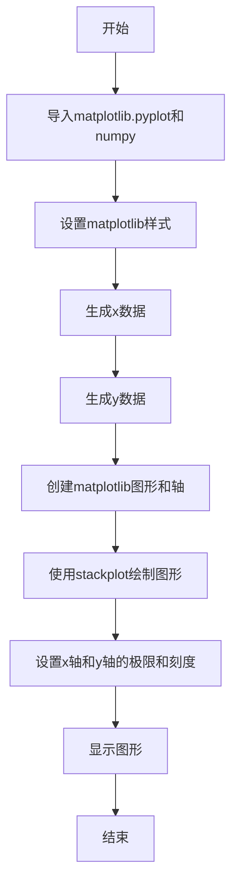
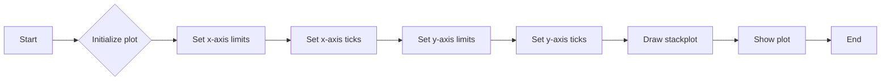
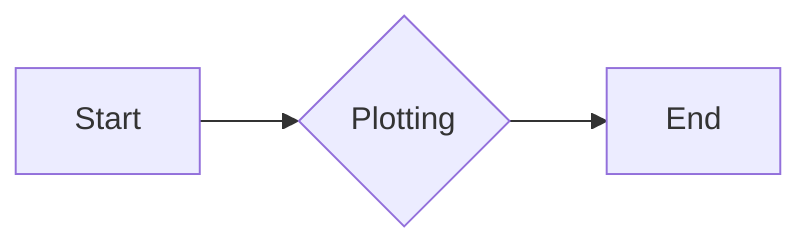

# `matplotlib\galleries\plot_types\basic\stackplot.py` 详细设计文档

This code defines a function `stackplot` that generates a stacked area plot or a streamgraph using matplotlib and numpy. It creates a plot with specified x and y data, setting the limits and ticks for both axes.

## 整体流程



## 类结构

```
StackPlot (主类)
```

## 全局变量及字段


### `plt`
    
matplotlib.pyplot module for plotting

类型：`module`
    


### `np`
    
numpy module for numerical operations

类型：`module`
    


### `fig`
    
Figure object for the plot

类型：`matplotlib.figure.Figure`
    


### `ax`
    
Axes object for the plot

类型：`matplotlib.axes._subplots.AxesSubplot`
    


### `x`
    
Array of x values for the plot

类型：`numpy.ndarray`
    


### `y`
    
Array of y values for the plot, stacked vertically

类型：`numpy.ndarray`
    


### `ay`
    
List of y values for the first stack

类型：`list`
    


### `by`
    
List of y values for the second stack

类型：`list`
    


### `cy`
    
List of y values for the third stack

类型：`list`
    


### `StackPlot.x`
    
Array of x values for the plot

类型：`numpy.ndarray`
    


### `StackPlot.y`
    
Array of y values for the plot, stacked vertically

类型：`numpy.ndarray`
    
    

## 全局函数及方法


### stackplot

绘制堆叠面积图或流图。

参数：

- `x`：`numpy.ndarray`，x轴的数据点。
- `y`：`numpy.ndarray`，堆叠的y轴数据。

返回值：无，直接在matplotlib图形窗口中显示。

#### 流程图

```mermaid
graph LR
A[开始] --> B{调用plt.subplots()}
B --> C[创建fig和ax]
C --> D[调用ax.stackplot(x, y)]
D --> E[设置ax的xlim和xticks]
E --> F[设置ax的ylim和yticks]
F --> G[调用plt.show()]
G --> H[结束]
```

#### 带注释源码

```python
"""
===============
stackplot(x, y)
===============
Draw a stacked area plot or a streamgraph.

See `~matplotlib.axes.Axes.stackplot`
"""
import matplotlib.pyplot as plt
import numpy as np

plt.style.use('_mpl-gallery')

# make data
x = np.arange(0, 10, 2)
ay = [1, 1.25, 2, 2.75, 3]
by = [1, 1, 1, 1, 1]
cy = [2, 1, 2, 1, 2]
y = np.vstack([ay, by, cy])

# plot
fig, ax = plt.subplots()

ax.stackplot(x, y)

ax.set(xlim=(0, 8), xticks=np.arange(1, 8),
       ylim=(0, 8), yticks=np.arange(1, 8))

plt.show()
```


### StackPlot.__init__

该函数初始化StackPlot类，用于绘制堆叠面积图或流图。

参数：

- `x`：`numpy.ndarray`，x轴的数据点。
- `y`：`numpy.ndarray`，y轴的数据点，应为二维数组，其中每一列代表一个堆叠层。

返回值：无

#### 流程图



#### 带注释源码

```python
"""
===============
stackplot(x, y)
===============
Draw a stacked area plot or a streamgraph.

See `~matplotlib.axes.Axes.stackplot`
"""
import matplotlib.pyplot as plt
import numpy as np

plt.style.use('_mpl-gallery')

# make data
x = np.arange(0, 10, 2)
ay = [1, 1.25, 2, 2.75, 3]
by = [1, 1, 1, 1, 1]
cy = [2, 1, 2, 1, 2]
y = np.vstack([ay, by, cy])

# plot
fig, ax = plt.subplots()

ax.stackplot(x, y)

ax.set(xlim=(0, 8), xticks=np.arange(1, 8),
       ylim=(0, 8), yticks=np.arange(1, 8))

plt.show()
```


### StackPlot.plot

该函数用于绘制堆叠面积图或流图。

参数：

- `x`：`numpy.ndarray`，x轴的数据点。
- `y`：`numpy.ndarray`，堆叠的y轴数据。

返回值：无

#### 流程图



#### 带注释源码

```python
"""
===============
stackplot(x, y)
===============
Draw a stacked area plot or a streamgraph.

See `~matplotlib.axes.Axes.stackplot`
"""
import matplotlib.pyplot as plt
import numpy as np

plt.style.use('_mpl-gallery')

# make data
x = np.arange(0, 10, 2)
ay = [1, 1.25, 2, 2.75, 3]
by = [1, 1, 1, 1, 1]
cy = [2, 1, 2, 1, 2]
y = np.vstack([ay, by, cy])

# plot
fig, ax = plt.subplots()

# 使用matplotlib的stackplot方法绘制堆叠面积图
ax.stackplot(x, y)

# 设置x轴和y轴的显示范围和刻度
ax.set(xlim=(0, 8), xticks=np.arange(1, 8),
       ylim=(0, 8), yticks=np.arange(1, 8))

# 显示图形
plt.show()
```


## 关键组件


### 张量索引

张量索引用于访问和操作多维数组中的元素。

### 惰性加载

惰性加载是一种延迟计算或初始化数据的技术，直到实际需要时才进行。

### 反量化支持

反量化支持允许在量化过程中对某些操作进行非量化处理，以保持精度。

### 量化策略

量化策略定义了如何将浮点数转换为固定点数表示，以减少计算资源消耗。


## 问题及建议


### 已知问题

-   {问题1}：代码中使用了硬编码的数据，这限制了代码的复用性和灵活性。如果需要处理不同的数据集，需要手动修改数据。
-   {问题2}：代码没有提供任何错误处理机制，如果数据格式不正确或绘图过程中出现异常，程序可能会崩溃。
-   {问题3}：代码没有提供任何用户输入或配置选项，限制了用户自定义绘图的能力。

### 优化建议

-   {建议1}：将数据作为函数参数传递，允许用户自定义数据集，提高代码的复用性和灵活性。
-   {建议2}：添加异常处理机制，确保在出现错误时程序能够优雅地处理异常，并提供有用的错误信息。
-   {建议3}：提供配置选项，允许用户自定义绘图参数，如颜色、线型、标签等，增强用户体验。
-   {建议4}：考虑使用面向对象编程方法，将绘图逻辑封装在类中，提高代码的可维护性和可扩展性。
-   {建议5}：如果代码将用于生产环境，建议添加日志记录功能，以便跟踪程序的运行情况和潜在问题。


## 其它


### 设计目标与约束

- 设计目标：实现一个能够绘制堆叠面积图或流图的函数，该函数应易于使用，并能够处理基本的输入数据。
- 约束条件：函数应使用matplotlib库进行绘图，且不依赖于其他外部库。

### 错误处理与异常设计

- 错误处理：函数应能够处理无效的输入数据，如非数值类型或空列表。
- 异常设计：应抛出适当的异常，如ValueError或TypeError，以通知调用者输入数据的问题。

### 数据流与状态机

- 数据流：输入数据（x和y）通过函数处理，并生成matplotlib图形对象。
- 状态机：函数从初始化状态开始，通过数据处理和绘图状态，最终到达显示图形的状态。

### 外部依赖与接口契约

- 外部依赖：函数依赖于matplotlib和numpy库。
- 接口契约：函数的接口应清晰定义，包括输入参数的类型和数量，以及返回值或副作用。

### 测试用例

- 测试用例：应包括对正常数据和异常数据的测试，以确保函数在各种情况下都能正确运行。

### 性能考量

- 性能考量：函数应优化以处理大量数据，并确保绘图操作尽可能高效。

### 安全性考量

- 安全性考量：函数应避免执行可能导致安全漏洞的操作，如不安全的输入处理。

### 维护与扩展性

- 维护：代码应易于维护，包括清晰的注释和良好的命名约定。
- 扩展性：函数应设计为易于扩展，以支持未来可能的需求变化。

### 文档与示例

- 文档：提供详细的文档，包括函数的用途、参数、返回值和示例。
- 示例：提供使用函数的示例代码，以帮助用户理解如何使用该函数。


    