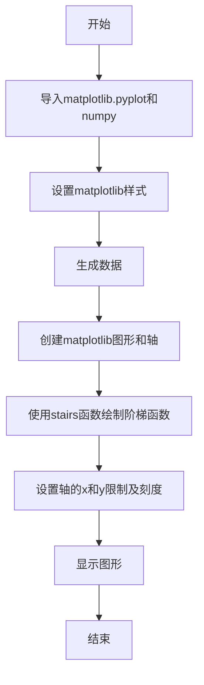
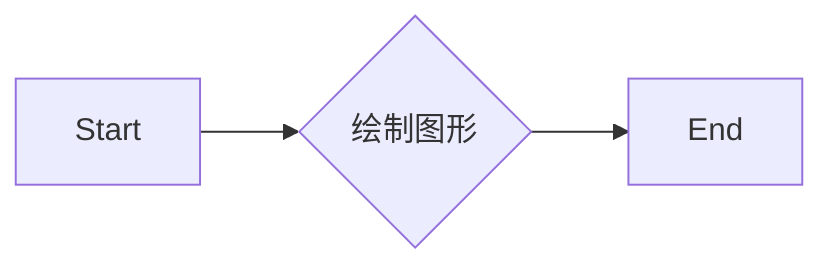
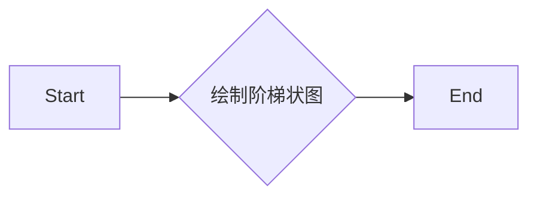
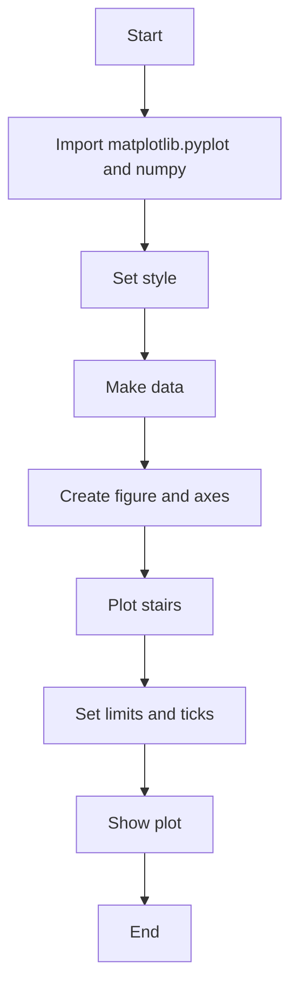

# `matplotlib\galleries\plot_types\basic\stairs.py` 详细设计文档

This code defines a function to draw a stepwise constant function as a line or a filled plot using matplotlib and numpy.

## 整体流程



## 类结构

```
matplotlib.pyplot (matplotlib模块)
├── plt (全局变量)
│   ├── style (全局函数)
│   ├── subplots (全局函数)
│   ├── stairs (全局函数)
│   └── show (全局函数)
└── numpy (numpy模块)
    └── np (全局变量)
```

## 全局变量及字段


### `plt`
    
matplotlib.pyplot module for plotting

类型：`module`
    


### `np`
    
numpy module for numerical operations

类型：`module`
    


    

## 全局函数及方法


### stairs(values)

该函数绘制一个阶梯状常数函数的线图或填充图。

参数：

- `values`：`list`，包含要绘制的阶梯状函数的值列表。

返回值：无，该函数直接在matplotlib图形窗口中绘制图形。

#### 流程图



#### 带注释源码

```python
"""
Draw a stepwise constant function as a line or a filled plot.

See `~matplotlib.axes.Axes.stairs` when plotting :math:`y` between
:math:`(x_i, x_{i+1})`. For plotting :math:`y` at :math:`x`, see
`~matplotlib.axes.Axes.step`.

.. redirect-from:: /plot_types/basic/step
"""
import matplotlib.pyplot as plt
import numpy as np

plt.style.use('_mpl-gallery')

# make data
y = [4.8, 5.5, 3.5, 4.6, 6.5, 6.6, 2.6, 3.0]

# plot
fig, ax = plt.subplots()

# 使用stairs方法绘制阶梯状函数
ax.stairs(y, linewidth=2.5)

# 设置坐标轴范围和刻度
ax.set(xlim=(0, 8), xticks=np.arange(1, 8),
       ylim=(0, 8), yticks=np.arange(1, 8))

# 显示图形
plt.show()
```


### stairs(values)

绘制一个步进常数函数的线图或填充图。

参数：

- `values`：`list`，包含要绘制的值列表。

返回值：无

#### 流程图

```mermaid
graph TD
    A[Start] --> B[Import matplotlib.pyplot as plt]
    B --> C[Import numpy as np]
    C --> D[plt.style.use('_mpl-gallery')]
    D --> E[make data]
    E --> F[plot]
    F --> G[Show plot]
    G --> H[End]
```

#### 带注释源码

```python
"""
==============
stairs(values)
==============
Draw a stepwise constant function as a line or a filled plot.

See `~matplotlib.axes.Axes.stairs` when plotting :math:`y` between
:math:`(x_i, x_{i+1})`. For plotting :math:`y` at :math:`x`, see
`~matplotlib.axes.Axes.step`.

.. redirect-from:: /plot_types/basic/step
"""

import matplotlib.pyplot as plt
import numpy as np

plt.style.use('_mpl-gallery')

# make data
y = [4.8, 5.5, 3.5, 4.6, 6.5, 6.6, 2.6, 3.0]

# plot
fig, ax = plt.subplots()

ax.stairs(y, linewidth=2.5)

ax.set(xlim=(0, 8), xticks=np.arange(1, 8),
       ylim=(0, 8), yticks=np.arange(1, 8))

plt.show()
```


### stairs(values)

绘制一个阶梯状常数函数的线图或填充图。

参数：

- `values`：`list`，包含要绘制的值列表。

返回值：无，直接在当前图形上绘制。

#### 流程图



#### 带注释源码

```python
"""
stairs(values)
Draw a stepwise constant function as a line or a filled plot.

See `~matplotlib.axes.Axes.stairs` when plotting :math:`y` between
:math:`(x_i, x_{i+1})`. For plotting :math:`y` at :math:`x`, see
`~matplotlib.axes.Axes.step`.

.. redirect-from:: /plot_types/basic/step
"""
import matplotlib.pyplot as plt
import numpy as np

plt.style.use('_mpl-gallery')

# make data
y = [4.8, 5.5, 3.5, 4.6, 6.5, 6.6, 2.6, 3.0]

# plot
fig, ax = plt.subplots()

# 使用stairs方法绘制阶梯状图
ax.stairs(y, linewidth=2.5)

# 设置坐标轴范围和刻度
ax.set(xlim=(0, 8), xticks=np.arange(1, 8),
       ylim=(0, 8), yticks=np.arange(1, 8))

# 显示图形
plt.show()
```


### stairs(values)

绘制一个步进常数函数的线图或填充图。

参数：

- `values`：`list`，包含要绘制的值列表。

返回值：无，该函数不返回任何值。

#### 流程图



#### 带注释源码

```python
"""
==============
stairs(values)
==============
Draw a stepwise constant function as a line or a filled plot.

See `~matplotlib.axes.Axes.stairs` when plotting :math:`y` between
:math:`(x_i, x_{i+1})`. For plotting :math:`y` at :math:`x`, see
`~matplotlib.axes.Axes.step`.

.. redirect-from:: /plot_types/basic/step
"""
import matplotlib.pyplot as plt
import numpy as np

plt.style.use('_mpl-gallery')

# make data
y = [4.8, 5.5, 3.5, 4.6, 6.5, 6.6, 2.6, 3.0]

# plot
fig, ax = plt.subplots()

ax.stairs(y, linewidth=2.5)

ax.set(xlim=(0, 8), xticks=np.arange(1, 8),
       ylim=(0, 8), yticks=np.arange(1, 8))

plt.show()
```


## 关键组件


### 张量索引与惰性加载

张量索引与惰性加载允许在处理大型数据集时，只加载和处理需要的数据部分，从而提高效率。

### 反量化支持

反量化支持使得代码能够处理非整数类型的索引，增加了代码的灵活性和适用范围。

### 量化策略

量化策略涉及如何将浮点数转换为整数，以适应特定的硬件或优化性能，是性能优化的关键部分。


## 问题及建议


### 已知问题

-   {问题1}：代码中使用了硬编码的 `xticks` 和 `yticks` 值，这限制了图表的可扩展性和灵活性。如果需要调整图表的尺寸或刻度，需要手动修改这些值。
-   {问题2}：代码没有提供任何错误处理机制，如果输入的数据 `y` 包含非数值类型，可能会导致运行时错误。
-   {问题3}：代码没有提供任何文档字符串或注释，这会使得代码的可读性和可维护性降低。

### 优化建议

-   {建议1}：为 `xticks` 和 `yticks` 提供一个函数或参数，允许用户自定义刻度值，从而提高图表的灵活性。
-   {建议2}：在代码中添加异常处理，确保输入数据的有效性，并在出现错误时提供有用的错误信息。
-   {建议3}：为代码添加详细的文档字符串和注释，以提高代码的可读性和可维护性。
-   {建议4}：考虑使用面向对象的方法来封装绘图逻辑，这样可以使代码更加模块化和可重用。
-   {建议5}：如果这个函数是库的一部分，应该考虑添加单元测试来确保其正确性和稳定性。


## 其它


### 设计目标与约束

- 设计目标：实现一个绘制阶梯函数的函数，该函数能够以线形或填充图的形式展示。
- 约束条件：使用matplotlib库进行绘图，数据输入应为数值列表。

### 错误处理与异常设计

- 错误处理：确保输入数据为数值列表，否则抛出异常。
- 异常设计：对于非数值输入，抛出`TypeError`异常。

### 数据流与状态机

- 数据流：输入数据 -> 处理数据 -> 绘制图形 -> 显示图形。
- 状态机：无状态机，流程线性。

### 外部依赖与接口契约

- 外部依赖：matplotlib.pyplot和numpy。
- 接口契约：`stairs`函数接受一个数值列表作为输入，并使用matplotlib绘制图形。


    