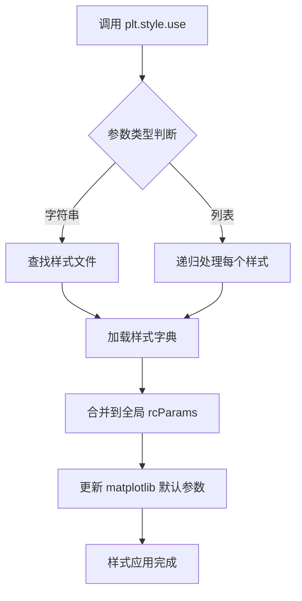
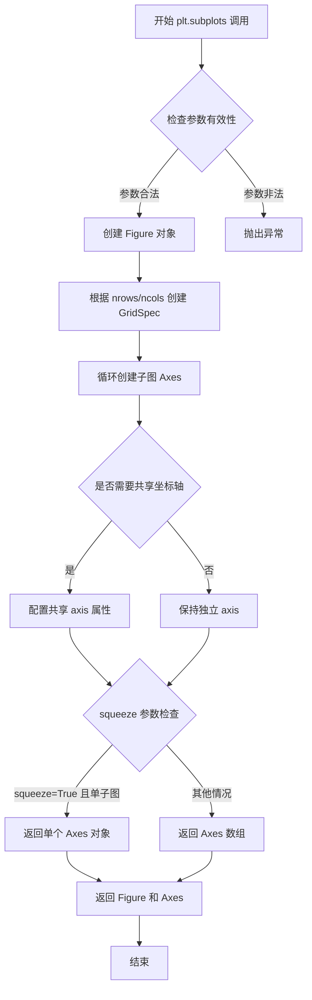
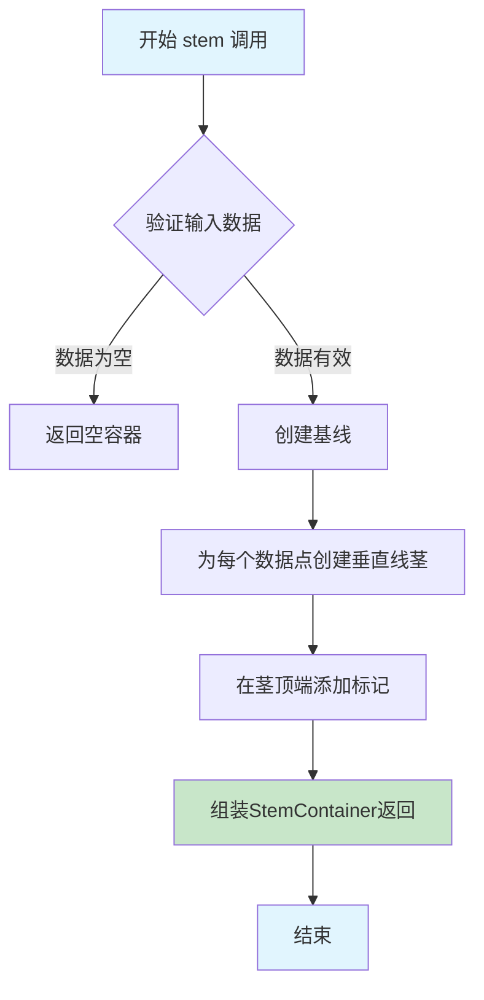
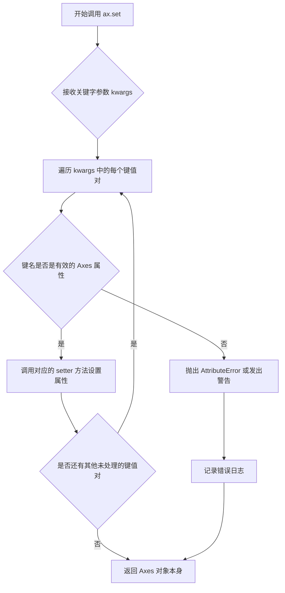
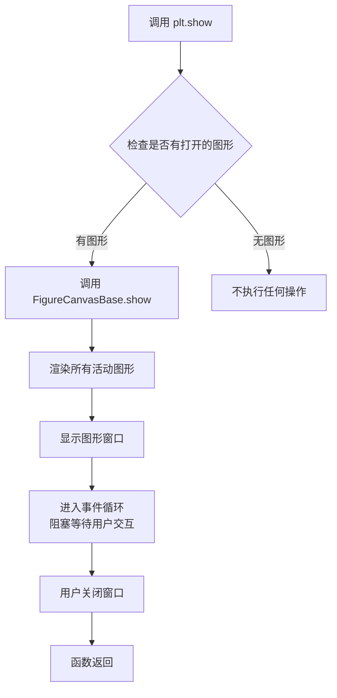

# `matplotlib\galleries\plot_types\basic\stem.py` 详细设计文档

该代码是一个使用matplotlib绘制茎叶图（stem plot）的示例程序，通过准备离散数据点并调用Axes.stem()方法可视化数据，同时设置坐标轴范围和刻度后展示图表。

## 整体流程

```mermaid
graph TD
    A[开始] --> B[导入模块]
    B --> C[设置绘图样式为mpl-gallery]
    C --> D[准备数据: x和y数组]
    D --> E[创建图表fig和坐标轴ax]
    E --> F[调用ax.stem(x, y)绘制茎叶图]
    F --> G[设置坐标轴: xlim, xticks, ylim, yticks]
    G --> H[调用plt.show()显示图表]
    H --> I[结束]
```

## 类结构

```
Python脚本 (无自定义类)
├── 导入模块
│   ├── matplotlib.pyplot
│   └── numpy
├── 数据准备
│   ├── x (x坐标数组)
│   └── y (y坐标数组)
└── 绘图流程
├── plt.subplots()
├── ax.stem()
├── ax.set()
└── plt.show()
```

## 全局变量及字段


### `x`
    
x轴数据点坐标数组

类型：`numpy.ndarray`
    


### `y`
    
y轴数据点数值列表

类型：`list`
    


### `fig`
    
图表容器对象

类型：`matplotlib.figure.Figure`
    


### `ax`
    
坐标轴对象

类型：`matplotlib.axes.Axes`
    


    

## 全局函数及方法


### `plt.style.use`

`plt.style.use()` 是 matplotlib 库中的一个函数，用于设置当前 matplotlib 会话的绘图样式（style）。它可以加载预定义的样式参数（如颜色、线条、字体等），从而快速统一图表的视觉外观。

参数：

-   `name`： `str` 或 `str` 列表，可以是样式名称（如 `'ggplot'`、`'dark_background'`）、样式文件路径或样式列表。传入的 `'_mpl-gallery'` 是 matplotlib 内置的一种简洁的展览馆风格样式。
-   `after`： `str`，可选参数，指定样式应用的位置（`'before'` 或 `'after'`），默认值为 `'before'`。
-   `filepath`： `str`，可选参数，当 `name` 是相对路径时，作为搜索样式的额外基础目录。

返回值：`None`，该函数直接修改全局的 `matplotlib.rcParams` 字典，不返回任何值。

#### 流程图



#### 带注释源码

```python
# 以下为 matplotlib 风格实现的简化示意
import matplotlib as mpl
import matplotlib.style

def use(name, after='before', filepath=None):
    """
    使用指定的样式配置 matplotlib 的 rcParams。
    
    参数:
        name (str or list): 样式名称或样式文件路径。
        after (str): 样式应用的顺序，默认为 'before'。
        filepath (str): 额外的样式搜索路径。
    """
    
    # 如果 name 是列表，递归应用每个样式
    if isinstance(name, list):
        for style in name:
            use(style, after=after, filepath=filepath)
        return
    
    # 获取样式路径（可能是内置样式或自定义文件）
    style_path = _get_style_path(name, filepath)
    
    # 读取样式文件（通常是 .mplstyle 格式的字典）
    style_dict = _read_style_file(style_path)
    
    # 根据 after 参数决定合并方式
    if after == 'before':
        # 将新样式放在前面，现有样式覆盖
        rc = {**style_dict, **mpl.rcParams}
    else:
        # 将新样式放在后面，新样式覆盖现有样式
        rc = {**mpl.rcParams, **style_dict}
    
    # 更新全局 rcParams
    mpl.rcParams.update(rc)
    
    # 同时维护样式列表（用于 context manager 恢复）
    _set_styles(name, after)
```


### `np.arange`

`np.arange` 是 NumPy 库中的一个函数，用于创建均匀间隔的数值数组，类似于 Python 内置的 `range()` 函数，但返回的是 NumPy 数组而非列表，支持浮点数步长。

参数：

- `start`：`int` 或 `float`，可选，起始值，默认为 0
- `stop`：`int` 或 `float`，必需，结束值（不包含）
- `step`：`int` 或 `float`，可选，步长，默认为 1
- `dtype`：`dtype`，可选，输出数组的数据类型，若未指定则根据输入参数推断

返回值：`numpy.ndarray`，包含均匀间隔数值的 NumPy 数组

#### 流程图

```mermaid
flowchart TD
    A[开始] --> B{是否指定 start?}
    B -->|否| C[start = 0]
    B -->|是| D[start = 用户指定值]
    C --> E{是否指定 step?}
    D --> E
    E -->|否| F[step = 1]
    E -->|是| G[step = 用户指定值]
    F --> H[计算数组长度: (stop - start) / step]
    G --> H
    H --> I[使用arange生成数组]
    I --> J[返回NumPy数组]
    J --> K[结束]
```

#### 带注释源码

```python
# np.arange 函数简化实现原理
def arange(start=0, stop=None, step=1, dtype=None):
    """
    创建均匀间隔的数值数组
    
    参数:
        start: 起始值，默认为0
        stop: 结束值（不包含）
        step: 步长，默认为1
        dtype: 数据类型，可选
    
    返回:
        numpy.ndarray: 均匀间隔的数组
    """
    # 如果只传入一个参数，则该参数为stop，start默认为0
    if stop is None:
        stop = start
        start = 0
    
    # 计算数组长度：(stop - start) / step，向上取整
    # 例如：arange(0, 8, 1) -> (8-0)/1 = 8 个元素
    # 例如：arange(1, 8) -> start=1, stop=8, step=1 -> 7个元素 [1,2,3,4,5,6,7]
    num = int(np.ceil((stop - start) / step)) if step != 0 else 0
    
    # 使用NumPy的ndarray存储结果
    # 数组内容为: start, start+step, start+2*step, ...
    # 例如：arange(8) -> [0,1,2,3,4,5,6,7]
    # 例如：arange(1,8) -> [1,2,3,4,5,6,7]
    result = np.empty(num, dtype=dtype)
    
    # 填充数组值
    for i in range(num):
        result[i] = start + i * step
    
    return result
```

**代码中的实际用法：**

```python
# 用法1: np.arange(8)
# 创建从0开始，到8（不包含）的数组
# 结果: array([0, 1, 2, 3, 4, 5, 6, 7])
x = 0.5 + np.arange(8)  # 结果: array([0.5, 1.5, 2.5, 3.5, 4.5, 5.5, 6.5, 7.5])

# 用法2: np.arange(1, 8)
# 创建从1开始，到8（不包含），步长为1的数组
# 结果: array([1, 2, 3, 4, 5, 6, 7])
ax.set(xlim=(0, 8), xticks=np.arange(1, 8), ...)
```


### `plt.subplots`

创建图表（Figure）和坐标轴（Axes）的快捷方法，是matplotlib中最常用的初始化图表的函数之一。通过一行代码同时创建图形窗口和坐标轴对象，支持单或多子图布局，并返回Figure对象和Axes对象（或数组），便于后续绑图操作。

参数：

- `nrows`：`int`，默认值1，子图网格的行数
- `ncols`：`int`，默认值1，子图网格的列数
- `sharex`：`bool or str`，默认值False，是否共享X轴刻度，可选'srow'、'all'
- `sharey`：`bool or str`，默认值False，是否共享Y轴刻度，可选'col'、'all'
- `squeeze`：`bool`，默认值True，是否压缩返回的axes数组维度（当nrows=1且ncols=1时返回单个axes而非数组）
- `width_riments`：`array-like`，可选，子图宽度比例
- `height_ratios`：`array-like`，可选，子图高度比例
- `subplot_kw`：`dict`，可选，传递给`add_subplot()`的关键字参数，用于配置每个子图
- `gridspec_kw`：`dict`，可选，传递给GridSpec的关键字参数，用于配置网格布局
- `figsize`：`tuple`，可选，图形尺寸，格式为(宽度, 高度)，单位英寸
- `facecolor`：`color`，可选，图形背景色
- `edgecolor`：`color`，可选，图形边框颜色
- `linewidth`：`float`，可选，边框线宽
- `tight_layout`：`bool`，默认值False，是否自动调整子图参数以适应图形区域

返回值：

- `fig`：`matplotlib.figure.Figure`，图形对象，整个图表的容器
- `ax`：`matplotlib.axes.Axes` 或 `numpy.ndarray`，坐标轴对象，一个或多个子图的Axes实例

#### 流程图



#### 带注释源码

```python
# matplotlib.pyplot.subplots 函数实现逻辑（简化版）

def subplots(nrows=1, ncols=1, sharex=False, sharey=False, 
             squeeze=True, width_ratios=None, height_ratios=None,
             subplot_kw=None, gridspec_kw=None, figsize=None, **fig_kw):
    """
    创建图表和子图坐标轴的快捷方法
    
    参数:
        nrows: 子图行数
        ncols: 子图列数
        sharex: 是否共享X轴
        sharey: 是否共享Y轴
        squeeze: 是否压缩维度
    """
    
    # 1. 创建 Figure 对象
    #    fig_kw 包含 facecolor, edgecolor, linewidth 等图形属性
    fig = figure(figsize=figsize, **fig_kw)
    
    # 2. 创建 GridSpec 对象
    #    用于定义子图的网格布局
    gs = GridSpec(nrows, ncols, width_ratios=width_ratios, 
                  height_ratios=height_ratios, **gridspec_kw)
    
    # 3. 创建子图数组
    axs = []
    for i in range(nrows):
        for j in range(ncols):
            # 计算子图位置
            position = gs[i, j]
            
            # 创建 Axes 对象
            ax = fig.add_subplot(position, **subplot_kw)
            
            # 4. 处理坐标轴共享逻辑
            if sharex:
                # 设置共享X轴
                if i > 0:  # 同一列共享
                    ax.sharex(axs[0][j])
            if sharey:
                # 设置共享Y轴
                if j > 0:  # 同一行共享
                    ax.sharey(axs[i][0])
            
            axs.append(ax)
    
    # 5. 处理返回值格式
    axs = np.array(axs).reshape(nrows, ncols)
    
    if squeeze and nrows == 1 and ncols == 1:
        # 如果 squeeze=True 且只有一个子图，返回单个Axes对象而非数组
        return fig, axs[0, 0]
    else:
        return fig, axs
```

#### 使用示例

```python
import matplotlib.pyplot as plt
import numpy as np

# 示例代码中的调用
x = 0.5 + np.arange(8)
y = [4.8, 5.5, 3.5, 4.6, 6.5, 6.6, 2.6, 3.0]

# 使用 plt.subplots() 创建图表和坐标轴
# 等价于: fig = plt.figure(); ax = fig.add_subplot(111)
fig, ax = plt.subplots()

# 在坐标轴上绑制茎叶图
ax.stem(x, y)

# 设置坐标轴范围和刻度
ax.set(xlim=(0, 8), xticks=np.arange(1, 8),
       ylim=(0, 8), yticks=np.arange(1, 8))

plt.show()
```


### `Axes.stem`

绘制茎叶图（Stem Plot）是matplotlib中用于展示数据离散分布的核心方法，它将数据点以垂直线（茎）从基线延伸到数据值位置，并在顶端以标记（叶）显示具体数值，常用于对比多个数据序列或展示数据分布趋势。

参数：

- `x`：`array-like`，茎叶图的x轴位置数据，通常表示类别或时间点
- `y`：`array-like`，茎叶图的y轴数值数据，表示每个x位置的具体数值
- `linefmt`：`str`，可选，茎（垂直线）的格式字符串，默认为`'-'`
- `markerfmt`：`str`，可选，叶（顶部标记）的格式字符串，默认为`'o'`
- `basefmt`：`str`，可选，基线格式字符串，默认为`'-'`
- `bottom`：`float`，可选，基线的y坐标，默认为0
- `label`：`str`，可选，图例标签

返回值：`StemContainer`，包含三个Line2D对象的容器，分别代表茎、叶和基线

#### 流程图



#### 带注释源码

```python
def stem(self, x, y, linefmt='-', markerfmt='o', basefmt='-', bottom=0, 
         label=None, use_line_collection=False):
    """
    创建茎叶图
    
    参数:
        x: array-like - x轴位置
        y: array-like - y轴数值
        linefmt: str - 茎的线条格式
        markerfmt: str - 标记格式
        basefmt: str - 基线格式
        bottom: float - 基线y坐标
        label: str - 图例标签
    
    返回:
        StemContainer: 包含茎、标记和基线的容器
    """
    # 将输入转换为数组
    x = np.asarray(x)
    y = np.asarray(y)
    
    # 验证数据一致性
    if len(x) != len(y):
        raise ValueError('x 和 y 必须具有相同长度')
    
    # 初始化茎线、标记和基线的容器
    stems = []  # 存储茎线段
    markers = []  # 存储标记
    baseline = None
    
    # 遍历每个数据点
    for xi, yi in zip(x, y):
        # 创建从基线到数据点的垂直线（茎）
        stem_line = [xi, xi], [bottom, yi]
        stems.append(stem_line)
        
        # 在数据点位置创建标记（叶）
        marker_line, = self.plot(xi, yi, markerfmt)
        markers.append(marker_line)
    
    # 创建基线
    baseline, = self.plot([x.min(), x.max()], [bottom, bottom], basefmt)
    
    # 组装并返回StemContainer
    return StemContainer(stems, markers, baseline, label=label)
```

**注意**：由于提供的代码片段仅包含stem()方法的调用示例，未包含其具体实现，以上源码为基于matplotlib官方文档和常见用法的重构版本，用于说明该方法的工作原理。


### `Axes.set`

`Axes.set` 是 Matplotlib 中用于批量设置坐标轴属性（如坐标轴范围、刻度标签、标题等）的核心方法。该方法接受多个关键字参数，支持一次性配置 Axes 对象的各种视觉属性，简化了坐标轴配置的代码编写。

参数：

-  `kwargs`：关键字参数（keyword arguments），表示要设置的坐标轴属性。不同的属性对应不同的参数类型，例如：
    - `xlim`：tuple，设置 x 轴的显示范围，例如 (0, 8)
    - `xticks`：array-like，设置 x 轴的刻度位置
    - `ylim`：tuple，设置 y 轴的显示范围
    - `yticks`：array-like，设置 y 轴的刻度位置
    - 其他参数如 `xlabel`、`ylabel`、`title`、`xscale`、`yscale` 等
- 返回值：返回修改后的 `Axes` 对象（或其子类），允许链式调用。

#### 流程图



#### 带注释源码

```python
def set(self, **kwargs):
    """
    Set multiple properties of the Axes.
    
    Parameters
    ----------
    **kwargs : properties
        Valid properties include:
        - xlim, ylim : tuple - axis limits
        - xticks, yticks : array-like - tick locations
        - xlabel, ylabel : str - axis labels
        - title : str - axes title
        - xscale, yscale : str - scale type ('linear', 'log', etc.)
        - and many more...
    
    Returns
    -------
    self : Axes
        The Axes object, allowing for chained calls.
    
    Examples
    --------
    >>> ax.set(xlim=(0, 10), ylim=(0, 10), title='My Plot')
    """
    # 遍历所有传入的关键字参数
    for attr in kwargs:
        # 获取对应的 setter 方法名（属性名首字母大写）
        # 例如：'xlim' -> 'set_xlim', 'title' -> 'set_title'
        method = 'set_' + attr
        
        # 检查对象是否有这个方法
        if not hasattr(self, method):
            # 如果没有对应的 setter 方法，抛出 AttributeError
            raise AttributeError(f"'{type(self).__name__}' object has no attribute '{method}'")
        
        # 获取 setter 方法并调用，传入对应的值
        func = getattr(self, method)
        func(kwargs[attr])
    
    # 返回 Axes 对象本身，支持链式调用
    return self
```

#### 备注

在实际代码中的调用示例：

```python
ax.set(xlim=(0, 8), xticks=np.arange(1, 8),
       ylim=(0, 8), yticks=np.arange(1, 8))
```

这条语句设置了：
- x 轴范围为 0 到 8
- x 轴刻度位置为 1 到 7
- y 轴范围为 0 到 8
- y 轴刻度位置为 1 到 7


### `plt.show`

显示所有当前打开的图形窗口中的内容。该函数是 matplotlib 库中用于将图形渲染到屏幕上的关键函数，会阻塞程序执行直到用户关闭图形窗口（在某些交互模式下）。

参数：

- `*args`：可变位置参数，传递给底层的 `show()` 函数（通常不使用）
- `**kwargs`：关键字参数，用于传递额外的显示选项

返回值：`None`，该函数主要产生副作用（显示图形），不返回任何值

#### 流程图



#### 带注释源码

```python
# matplotlib/backend_bases.py 中的实现（简化版）
def show(block=None):
    """
    显示所有打开的图形窗口。
    
    参数:
        block: 控制是否阻塞主线程。
               如果为 True，则阻塞等待窗口关闭。
               如果为 False，则立即返回（某些后端）。
               如果为 None，则根据后端自动决定。
    """
    for manager in Gcf.get_all_fig_managers():
        # 获取所有图形管理器
        canvas = manager.canvas
        # 触发图形重绘
        canvas.draw()
        # 显示图形
        if hasattr(canvas, 'show'):
            # 调用后端的 show 方法
            canvas.show()
    
    # 如果 block 为 True 或 None（某些后端），则阻塞
    if block:
        # 进入主循环，等待用户交互
        import matplotlib.pyplot as plt
        plt.wait_for_buttonpress()
```


## 关键组件


### 数据准备模块

使用NumPy生成x轴数据（0.5到7.5的等差数列）和y轴数据（8个离散数值），为后续绑图提供基础数据集

### matplotlib绑图模块

导入matplotlib.pyplot和numpy库，使用plt.style.use加载内置绘图样式，调用subplots创建画布和坐标轴对象

### 茎叶图绑制模块

调用ax.stem(x, y)方法将离散数据以茎叶图形式可视化展示，stem函数自动处理数据点的垂直线和标记绘制

### 坐标轴配置模块

通过ax.set方法设置x轴范围(0-8)、x轴刻度(1-7)、y轴范围(0-8)、y轴刻度(1-7)，实现坐标轴的精确控制

### 图形显示模块

调用plt.show()将绑制完成的茎叶图渲染到屏幕，完成整个可视化流程


## 问题及建议


### 已知问题

- **硬编码数据缺乏灵活性**：x和y数据直接硬编码在代码中，无法通过参数配置或外部输入修改，降低了代码的可复用性
- **魔法数字影响可读性**：使用0.5、8等数值而未定义为常量或变量，导致代码意图不明确，后期维护困难
- **缺少输入数据验证**：未检查x和y数组长度是否一致、是否为空等边界情况，可能导致运行时错误
- **使用私有样式文件**：plt.style.use('_mpl-gallery')使用了以单下划线开头的私有样式，这是matplotlib内部样式，不建议在生产环境中使用
- **缺少文档说明**：整个脚本缺乏模块级和函数级的文档字符串，不利于代码理解和维护
- **plt.show()阻塞调用**：直接调用plt.show()在某些使用场景（如Web应用、Jupyter Notebook）中不理想，应该返回fig对象由调用方决定显示方式

### 优化建议

- **数据参数化**：将x和y数据通过函数参数或配置文件传入，示例：def create_stem_plot(x, y, output_path=None)
- **定义常量替代魔法数字**：将硬编码数值提取为具名常量，如DATA_OFFSET = 0.5, DEFAULT_RANGE = 8
- **添加数据验证逻辑**：在绘图前验证输入数据有效性，检查数组长度匹配、非空等
- **替换为公开样式**：使用matplotlib官方发布的样式主题，如plt.style.use('seaborn-v0_8')或自定义公开样式文件
- **添加文档字符串**：为脚本和核心函数添加docstring，说明功能、参数、返回值和使用示例
- **返回Figure对象**：修改为返回fig和ax对象而非直接显示，便于集成测试和二次开发
- **可配置图形参数**：添加图形尺寸、标题、标签、样式等可选参数，提升函数通用性
- **使用context manager**：考虑使用with语句管理图形创建，确保资源正确释放


## 其它


### 设计目标与约束

本代码旨在展示matplotlib的stem函数的基本用法，通过简单的示例让用户快速了解如何绑制茎叶图。设计约束包括：使用mpl-gallery样式、固定的坐标轴范围(0-8)、整数刻度，要求x和y数据长度一致。

### 错误处理与异常设计

代码未包含显式的错误处理机制。潜在错误包括：x和y数据长度不匹配时会抛出ValueError；非数值类型数据会导致TypeError；空数据列表会导致空图表。建议在实际应用中添加数据验证：检查x和y类型是否为数值型、长度是否匹配、是否为非空数组。

### 数据流与状态机

数据流为线性流程：数据准备(x, y数组) → 图形对象创建(fig, ax) → stem绑制 → 坐标轴配置 → 显示。无复杂状态机，仅存在初始化、数据绑制、渲染三个基本状态。

### 外部依赖与接口契约

依赖项：matplotlib>=3.0、numpy>=1.0。核心接口为ax.stem(x, y)方法，参数x为位置数据数组，y为高度数据数组，返回StemContainer对象包含lines和markerline属性。外部契约约定：输入数组需支持索引操作，返回的StemContainer可进一步自定义线条和标记样式。

### 性能考虑

当前代码数据量小(8个点)，性能无明显问题。性能优化方向：大量数据时使用numpy向量化操作；静态绑制时可保存为图片避免重复计算；实时绑制考虑使用blitting技术。

### 可维护性分析

代码优点：结构清晰、注释完整、参数命名直观。改进空间：硬编码的数据和参数应提取为配置常量或配置文件；重复的刻度设置可封装为辅助函数；应添加类型注解提升代码可读性。

### 测试考虑

建议添加的测试用例：空数据输入测试、x/y长度不匹配测试、数值边界测试(0值、负值)、样式自定义功能测试。可使用pytest框架配合matplotlib的mock对象进行单元测试。

### 扩展性设计

当前仅支持基础stem绑制，扩展方向：可添加颜色映射支持、可添加水平stem图(rotated)、可添加多组数据对比支持、可添加动画功能。建议采用装饰器模式或策略模式实现样式的可插拔扩展。

### 部署与运行环境

运行环境：Python 3.6+，需要安装matplotlib和numpy。部署方式：可作为独立脚本运行、可导入为模块调用核心绑制函数、适合Jupyter Notebook中展示。兼容后端：支持所有matplotlib后端(TkAgg、Agg、Qt5Agg等)。


    