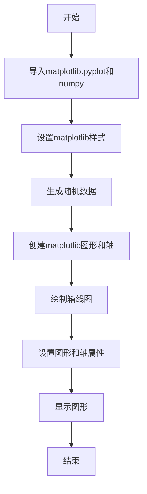
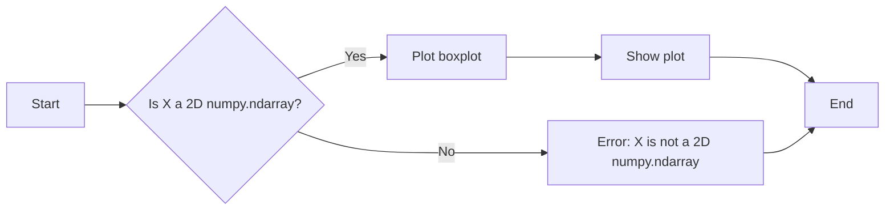

# `matplotlib\galleries\plot_types\stats\boxplot_plot.py` 详细设计文档

This code defines a function `boxplot(X)` that generates a boxplot for a given dataset X using matplotlib and numpy. The function creates a boxplot with specified properties and displays it.

## 整体流程



## 类结构

```
Boxplot (主类)
├── matplotlib.pyplot (全局模块)
│   ├── plt (全局变量)
│   └── style (全局函数)
├── numpy (全局模块)
│   └── np (全局变量)
└── boxplot (全局函数)
```

## 全局变量及字段


### `plt`
    
The matplotlib.pyplot module provides a Matplotlib API for use in scripts, interactive sessions and GUI applications.

类型：`module`
    


### `np`
    
The NumPy module provides support for large, multi-dimensional arrays and matrices, along with a collection of mathematical functions to operate on these arrays.

类型：`module`
    


    

## 全局函数及方法


### boxplot

Draw a box and whisker plot using matplotlib.

参数：

- `X`：`numpy.ndarray`，The data to be plotted. It should be a 2D array where each row is a sample and each column is a variable.

返回值：`None`，This function does not return any value. It directly plots the boxplot on the figure.

#### 流程图



#### 带注释源码

```python
"""
==========
boxplot(X)
==========
Draw a box and whisker plot.

See `~matplotlib.axes.Axes.boxplot`.
"""
import matplotlib.pyplot as plt
import numpy as np

plt.style.use('_mpl-gallery')

# make data:
np.random.seed(10)
D = np.random.normal((3, 5, 4), (1.25, 1.00, 1.25), (100, 3))

# plot
fig, ax = plt.subplots()
VP = ax.boxplot(D, positions=[2, 4, 6], widths=1.5, patch_artist=True,
                showmeans=False, showfliers=False,
                medianprops={"color": "white", "linewidth": 0.5},
                boxprops={"facecolor": "C0", "edgecolor": "white",
                          "linewidth": 0.5},
                whiskerprops={"color": "C0", "linewidth": 1.5},
                capprops={"color": "C0", "linewidth": 1.5})

ax.set(xlim=(0, 8), xticks=np.arange(1, 8),
       ylim=(0, 8), yticks=np.arange(1, 8))

plt.show()
```


## 关键组件


### 张量索引与惰性加载

张量索引与惰性加载允许在处理大型数据集时，只加载和处理需要的数据部分，从而提高效率。

### 反量化支持

反量化支持使得代码能够处理非整数类型的索引，增加了代码的灵活性和适用性。

### 量化策略

量化策略定义了如何将浮点数数据转换为固定点数表示，以减少计算资源消耗和提高执行速度。


## 问题及建议


### 已知问题

-   **全局变量和函数依赖性**：代码中使用了全局变量 `plt` 和 `np`，这可能导致代码的可重用性和可维护性降低，因为它们依赖于外部库的特定实现。
-   **硬编码的样式和参数**：代码中使用了硬编码的样式和参数，如 `plt.style.use('_mpl-gallery')` 和 `ax.boxplot` 的参数，这限制了代码的灵活性和可配置性。
-   **缺乏错误处理**：代码中没有包含错误处理机制，如果输入数据不符合预期，可能会导致程序崩溃或产生不正确的结果。

### 优化建议

-   **封装代码**：将代码封装在一个类中，可以更好地管理全局变量和函数，提高代码的可重用性和可维护性。
-   **参数化配置**：将样式和参数作为函数的参数传递，允许用户自定义这些设置，提高代码的灵活性和可配置性。
-   **添加错误处理**：在函数中添加错误处理机制，确保在输入数据不符合预期时，程序能够优雅地处理异常情况，并提供有用的错误信息。
-   **文档化**：为函数和类添加详细的文档字符串，说明其功能、参数和返回值，有助于其他开发者理解和使用代码。
-   **单元测试**：编写单元测试来验证代码的功能，确保代码在修改后仍然能够正常工作。
-   **性能优化**：如果数据集非常大，可以考虑使用更高效的数据处理和绘图方法，以减少计算和绘图所需的时间。


## 其它


### 设计目标与约束

- 设计目标：实现一个能够绘制箱线图的函数，用于展示数据的分布情况。
- 约束条件：使用matplotlib库进行绘图，不使用额外的包。

### 错误处理与异常设计

- 错误处理：函数应能够处理输入数据类型错误的情况，抛出相应的异常。
- 异常设计：定义自定义异常类，用于处理特定的错误情况。

### 数据流与状态机

- 数据流：输入数据经过验证后，通过matplotlib库进行绘图。
- 状态机：函数执行过程中没有明确的状态转换，但存在数据处理的步骤。

### 外部依赖与接口契约

- 外部依赖：matplotlib库和numpy库。
- 接口契约：函数boxplot接受一个二维数组作为输入，并返回一个matplotlib图形对象。


    