# `matplotlib\galleries\plot_types\stats\ecdf.py` 详细设计文档

This code computes and plots the empirical cumulative distribution function (ECDF) of a given dataset.

## 整体流程

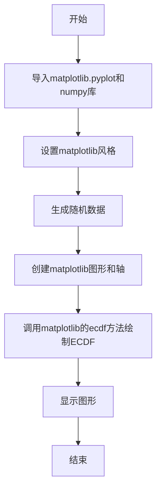

## 类结构

```
ecdf.py (主脚本)
```

## 全局变量及字段


### `plt`
    
matplotlib.pyplot module for plotting

类型：`module`
    


### `np`
    
numpy module for numerical operations

类型：`module`
    


### `x`
    
numpy array of random numbers used for plotting

类型：`numpy.ndarray`
    


### `plt.style`
    
Style of the plot

类型：`str`
    


### `plt.subplots`
    
Function to create a figure and a set of subplots

类型：`function`
    


### `plt.show`
    
Function to display the figure

类型：`function`
    


### `np.random`
    
Function to generate random numbers

类型：`function`
    


### `np.normal`
    
Function to generate random numbers from a normal distribution

类型：`function`
    


### `np.random.seed`
    
Function to set the seed for the random number generator

类型：`function`
    


### `matplotlib.pyplot.Axes.ecdf`
    
Function to plot the empirical cumulative distribution function

类型：`function`
    
    

## 全局函数及方法


### ecdf(x)

该函数计算并绘制给定数组x的经验累积分布函数（ECDF）。

参数：

- `x`：`numpy.ndarray`，输入数组，包含要计算ECDF的数据点。

返回值：`None`，该函数不返回任何值，而是直接在控制台显示ECDF的图形。

#### 流程图

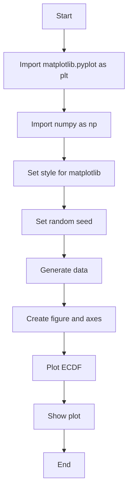

#### 带注释源码

```python
"""
=======
ecdf(x)
=======
Compute and plot the empirical cumulative distribution function of x.

See `~matplotlib.axes.Axes.ecdf`.
"""

import matplotlib.pyplot as plt
import numpy as np

plt.style.use('_mpl-gallery')

# make data
np.random.seed(1)
x = 4 + np.random.normal(0, 1.5, 200)

# plot:
fig, ax = plt.subplots()
ax.ecdf(x)
plt.show()
```


### plt.style.use

`plt.style.use` 是一个全局函数，用于设置matplotlib的样式。

参数：

- `style`：`str`，指定要使用的样式名称。

返回值：无

#### 流程图

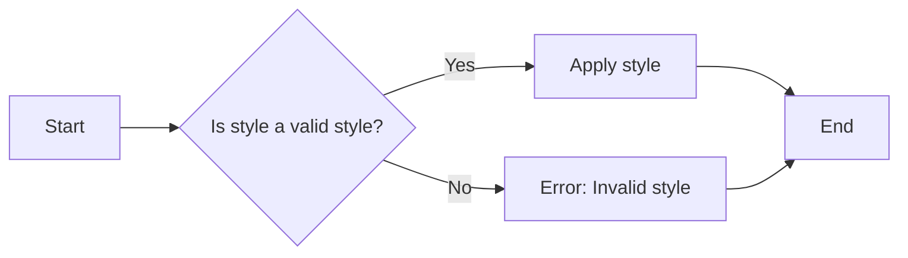

#### 带注释源码

```
# 设置matplotlib的样式
plt.style.use('_mpl-gallery')
```


### plt.subplots

`plt.subplots` 是一个全局函数，用于创建一个figure和一个或多个axes。

参数：

- `figsize`：`tuple`，指定figure的大小（宽度和高度）。
- `ncols`：`int`，指定子图的数量（列数）。
- `nrows`：`int`，指定子图的数量（行数）。
- `gridspec_kw`：`dict`，用于指定GridSpec的参数。
- `sharex`：`bool` 或 `dict`，指定子图是否共享x轴。
- `sharey`：`bool` 或 `dict`，指定子图是否共享y轴。
- `constrained_layout`：`bool`，指定是否使用constrained_layout。
- `fig`：`matplotlib.figure.Figure`，如果提供，则使用该figure而不是创建新的。

返回值：`matplotlib.figure.Figure`，`matplotlib.axes.Axes`，`matplotlib.axes.Axes`，...

#### 流程图

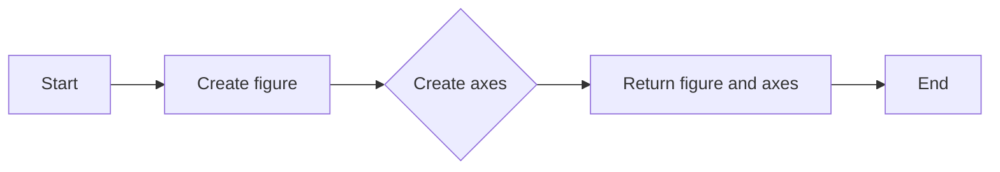

#### 带注释源码

```
# 创建一个figure和一个axes
fig, ax = plt.subplots()
```


### ax.ecdf

`ax.ecdf` 是matplotlib的Axes类的一个方法，用于绘制经验累积分布函数（ECDF）。

参数：

- `x`：`array_like`，输入数据。

返回值：无

#### 流程图


#### 带注释源码

```
# 绘制经验累积分布函数
ax.ecdf(x)
```


### plt.show

`plt.show` 是一个全局函数，用于显示所有的figure。

参数：无

返回值：无

#### 流程图


#### 带注释源码

```
# 显示所有figure
plt.show()
```


### 关键组件信息

- `matplotlib.pyplot`：matplotlib的pyplot模块，用于创建图形和显示它们。
- `numpy`：NumPy是一个用于科学计算的Python库，提供了大量的数学函数和工具。
- `matplotlib.style`：matplotlib的样式模块，用于设置matplotlib的样式。
- `matplotlib.figure`：matplotlib的figure类，用于创建图形。
- `matplotlib.axes`：matplotlib的axes类，用于创建子图。


### 潜在的技术债务或优化空间

- 代码中使用了全局变量`plt`和`np`，这可能导致代码的可读性和可维护性降低。
- 代码中没有使用异常处理来处理可能出现的错误，例如无效的样式名称或数据类型错误。
- 代码中没有使用日志记录来记录程序的运行状态。


### 设计目标与约束

- 设计目标是创建一个简单的示例，展示如何使用matplotlib和numpy来计算和绘制经验累积分布函数。
- 约束是代码必须简洁明了，易于理解。


### 错误处理与异常设计

- 代码中没有使用异常处理来处理可能出现的错误。
- 建议在代码中添加异常处理来捕获和处理可能出现的错误。


### 数据流与状态机

- 数据流：数据从numpy生成，然后传递给matplotlib进行绘图。
- 状态机：代码中没有使用状态机。


### 外部依赖与接口契约

- 代码依赖于matplotlib和numpy库。
- 接口契约：matplotlib和numpy提供了明确的接口契约，确保代码的正确性和可维护性。


### plt.subplots()

该函数用于创建一个matplotlib图形和一个轴对象。

参数：

- `figsize`：`tuple`，指定图形的大小，默认为(6, 4)。
- `dpi`：`int`，指定图形的分辨率，默认为100。
- `facecolor`：`color`，指定图形的背景颜色，默认为白色。
- `edgecolor`：`color`，指定图形的边缘颜色，默认为白色。
- `frameon`：`bool`，指定是否显示图形的边框，默认为True。
- `num`：`int`，指定要创建的轴的数量，默认为1。
- `gridspec_kw`：`dict`，指定GridSpec的参数，用于创建复杂的布局。
- `constrained_layout`：`bool`，指定是否启用约束布局，默认为False。

返回值：`Figure`，包含轴对象的图形。

#### 流程图

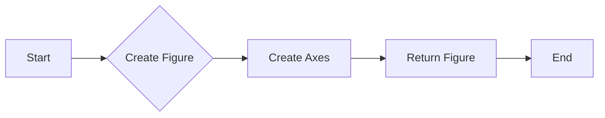

#### 带注释源码

```python
import matplotlib.pyplot as plt

# 创建图形和轴对象
fig, ax = plt.subplots()

# 绘制数据
ax.plot(x)

# 显示图形
plt.show()
```


### plt.show()

显示当前图形的窗口。

参数：

- 无

返回值：无

#### 流程图

```mermaid
graph LR
A[开始] --> B{调用plt.show()}
B --> C[结束]
```

#### 带注释源码

```python
# 显示当前图形的窗口
plt.show()
```


### numpy.seed

`numpy.seed` 是一个全局函数，用于设置 NumPy 的随机数生成器的种子。

参数：

- `seed`：`int`，用于初始化随机数生成器的种子值。如果提供了种子值，随机数生成器将产生可重复的随机数序列。

返回值：无，`numpy.seed` 函数不返回任何值。

#### 流程图

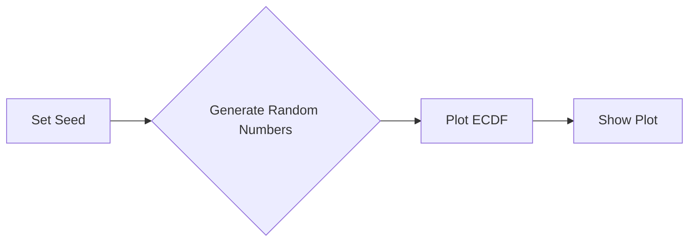

#### 带注释源码

```python
# 设置随机数生成器的种子
np.random.seed(1)

# 生成随机数据
x = 4 + np.random.normal(0, 1.5, 200)

# 绘制经验累积分布函数
fig, ax = plt.subplots()
ax.ecdf(x)

# 显示图形
plt.show()
```


### `np.random.seed()`

`np.random.seed()` 是 NumPy 库中的一个全局函数，用于设置随机数生成器的种子。

参数：

- `seed`：`int`，用于初始化随机数生成器的种子值。

参数描述：`seed` 参数是一个整数，用于设置随机数生成器的初始状态，从而确保每次运行代码时生成的随机数序列是相同的。

返回值类型：无

返回值描述：该函数没有返回值，它只是用于设置随机数生成器的种子。

#### 流程图

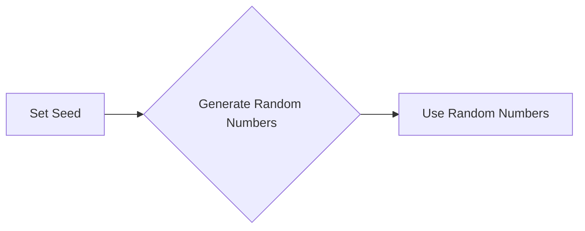

#### 带注释源码

```
import numpy as np

# Set the seed for the random number generator
np.random.seed(1)
```


### `np.random.normal()`

`np.random.normal()` 是 NumPy 库中的一个函数，用于生成具有正态分布的随机样本。

参数：

- `loc`：`float`，正态分布的均值。
- `scale`：`float`，正态分布的标准差。
- `size`：`int` 或 `tuple`，输出的形状。

参数描述：`loc` 参数指定了正态分布的均值，`scale` 参数指定了正态分布的标准差，`size` 参数指定了输出的形状。

返回值类型：`numpy.ndarray`

返回值描述：返回一个具有指定形状和参数的正态分布随机样本数组。

#### 流程图

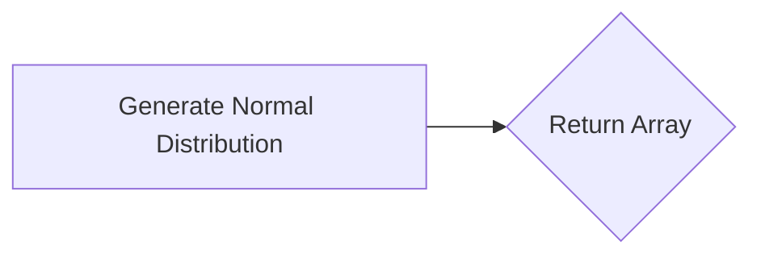

#### 带注释源码

```
# Generate 200 random numbers from a normal distribution with mean 0 and standard deviation 1.5
x = 4 + np.random.normal(0, 1.5, 200)
```


### `plt.subplots()`

`plt.subplots()` 是 Matplotlib 库中的一个函数，用于创建一个包含一个或多个子图的图表。

参数：

- `figsize`：`tuple`，指定图表的大小（宽度和高度）。
- `ncols`：`int`，指定子图的数量（列数）。
- `nrows`：`int`，指定子图的数量（行数）。
- `sharex`：`bool`，指定是否共享X轴。
- `sharey`：`bool`，指定是否共享Y轴。
- `fig`：`matplotlib.figure.Figure`，可选，如果提供，则使用该图而不是创建新的图。

参数描述：`figsize` 参数指定了图表的大小，`ncols` 和 `nrows` 参数指定了子图的数量和布局，`sharex` 和 `sharey` 参数指定了子图是否共享X轴和Y轴。

返回值类型：`matplotlib.figure.Figure`，`numpy.ndarray`

返回值描述：返回一个包含子图的图表对象和一个表示子图位置的数组。

#### 流程图

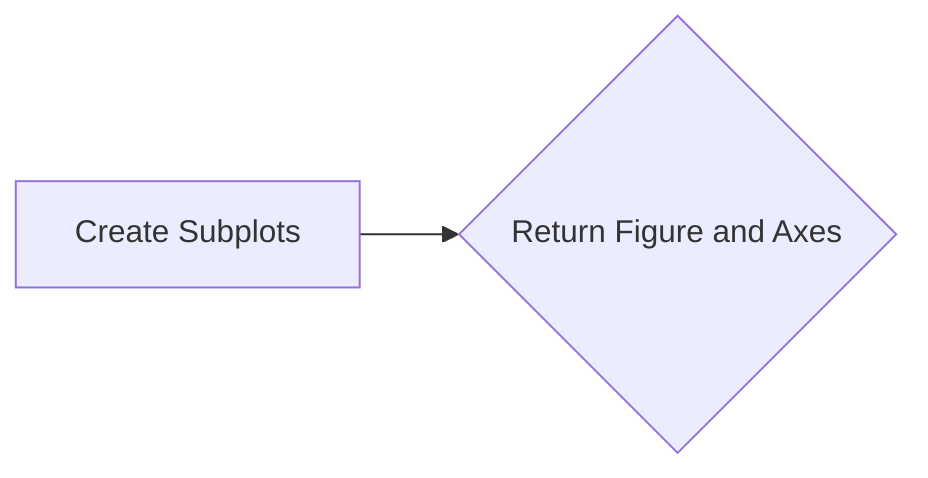

#### 带注释源码

```
# Create a figure and an axes object
fig, ax = plt.subplots()
```


### `ax.ecdf()`

`ax.ecdf()` 是 Matplotlib 库中 `Axes` 类的一个方法，用于在当前轴上绘制经验累积分布函数（ECDF）。

参数：

- `x`：`numpy.ndarray`，输入数据。

参数描述：`x` 参数是输入数据，它应该是一个一维数组。

返回值类型：无

返回值描述：该方法没有返回值，它只是将ECDF绘制在当前轴上。

#### 流程图

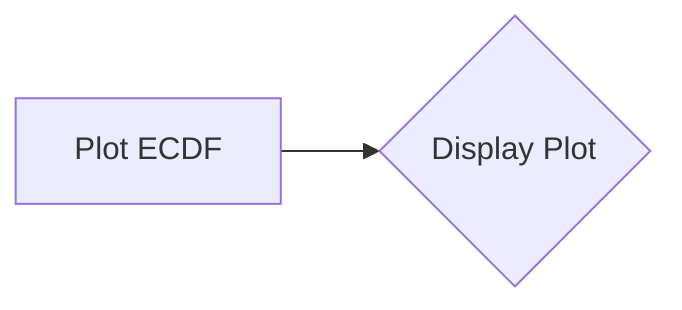

#### 带注释源码

```
# Plot the empirical cumulative distribution function of x
ax.ecdf(x)
```


### `plt.show()`

`plt.show()` 是 Matplotlib 库中的一个函数，用于显示当前图表。

参数：无

参数描述：该函数没有参数。

返回值类型：无

返回值描述：该函数没有返回值，它只是用于显示当前图表。

#### 流程图

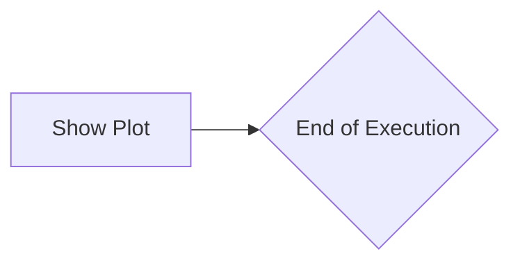

#### 带注释源码

```
# Show the plot
plt.show()
```


### 关键组件信息

- `np.random.seed()`：设置随机数生成器的种子。
- `np.random.normal()`：生成具有正态分布的随机样本。
- `plt.subplots()`：创建一个包含子图的图表。
- `ax.ecdf()`：在轴上绘制经验累积分布函数。
- `plt.show()`：显示当前图表。

这些组件共同实现了生成随机数据并绘制其经验累积分布函数的功能。


### 潜在的技术债务或优化空间

- **代码复用**：代码中使用了多个独立的函数和类，可以考虑将这些功能封装到一个类中，以提高代码的复用性和可维护性。
- **异常处理**：代码中没有异常处理机制，对于可能出现的错误（如输入数据类型不正确）没有进行适当的处理。
- **性能优化**：对于大规模数据集，绘制ECDF可能需要较长时间，可以考虑使用更高效的数据结构和算法来优化性能。


### 设计目标与约束

- **设计目标**：生成随机数据并绘制其经验累积分布函数。
- **约束**：代码应简洁、易于理解，并且能够处理不同类型的数据。


### 错误处理与异常设计

- **错误处理**：应添加异常处理机制，以处理可能出现的错误，例如输入数据类型不正确或图表无法显示。
- **异常设计**：定义明确的异常类型，以便于调试和错误追踪。


### 数据流与状态机

- **数据流**：数据从随机数生成开始，经过ECDF计算，最终显示在图表上。
- **状态机**：代码中没有明确的状态机，但可以通过封装功能到类中，引入状态管理。


### 外部依赖与接口契约

- **外部依赖**：代码依赖于NumPy和Matplotlib库。
- **接口契约**：NumPy和Matplotlib库提供了明确的接口契约，确保代码能够正确地使用这些库的功能。


### numpy.normal

`numpy.normal` 是一个全局函数，用于生成具有指定均值和标准差的正态分布随机样本。

参数：

- `loc`：`float`，正态分布的均值。
- `scale`：`float`，正态分布的标准差。
- `size`：`int` 或 `tuple`，输出数组的形状。

参数描述：
- `loc`：指定正态分布的均值。
- `scale`：指定正态分布的标准差。
- `size`：指定输出数组的形状，如果为 `int`，则生成一个形状为 `(size,)` 的数组；如果为 `tuple`，则生成一个形状为 `size` 的数组。

返回值类型：`numpy.ndarray`

返回值描述：返回一个具有指定形状、均值和标准差的正态分布随机样本数组。

#### 流程图

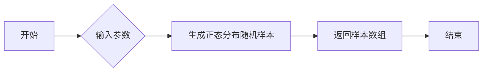

#### 带注释源码

```python
import numpy as np

# 生成具有均值0和标准差1.5的正态分布随机样本，样本数量为200
x = 4 + np.random.normal(0, 1.5, 200)
```


## 关键组件


### 张量索引与惰性加载

张量索引与惰性加载是Numpy库中用于高效处理多维数组（张量）的机制，允许在访问数组元素时延迟计算，从而提高性能。

### 反量化支持

反量化支持通常指的是在量化计算中，将量化后的数据转换回原始精度数据的能力，以便进行进一步的处理或分析。

### 量化策略

量化策略是指在机器学习模型中，将浮点数权重转换为低精度表示（如整数或定点数）的方法，以减少模型大小和加速计算。


## 问题及建议


### 已知问题

-   {问题1}：代码中使用了全局变量 `plt.style.use('_mpl-gallery')` 来设置绘图风格，这可能导致代码的可移植性降低，因为不同的环境可能需要不同的样式设置。
-   {问题2}：代码没有提供任何错误处理机制，如果绘图过程中出现异常（例如，matplotlib库未安装），程序将无法优雅地处理这些情况。
-   {问题3}：代码没有提供任何文档字符串来描述函数 `ecdf` 的参数和返回值，这不利于其他开发者理解和使用该代码。

### 优化建议

-   {建议1}：将绘图风格设置移出代码，或者提供一个配置文件，允许用户根据需要自定义样式。
-   {建议2}：添加异常处理机制，确保在出现错误时能够给出清晰的错误信息，并优雅地处理异常情况。
-   {建议3}：为 `ecdf` 函数添加文档字符串，描述其参数和返回值，提高代码的可读性和可维护性。
-   {建议4}：考虑将绘图功能封装成一个类或函数，以便于重用和扩展，同时也可以添加参数来允许用户自定义图表的样式和内容。
-   {建议5}：如果该代码是库的一部分，应该考虑添加单元测试来确保代码的稳定性和可靠性。


## 其它


### 设计目标与约束

- 设计目标：实现一个能够计算并绘制经验累积分布函数（ECDF）的函数。
- 约束条件：使用Python标准库中的matplotlib和numpy库进行绘图和数据处理。

### 错误处理与异常设计

- 错误处理：确保输入数据类型正确，如果输入数据类型不正确，则抛出异常。
- 异常设计：定义自定义异常类，用于处理特定的错误情况。

### 数据流与状态机

- 数据流：输入数据x通过numpy库生成，然后通过matplotlib库进行绘图。
- 状态机：程序从生成数据开始，经过绘图，最后展示图形。

### 外部依赖与接口契约

- 外部依赖：matplotlib.pyplot和numpy。
- 接口契约：ecdf函数接受一个一维数组作为输入，并返回一个matplotlib图形对象。


    