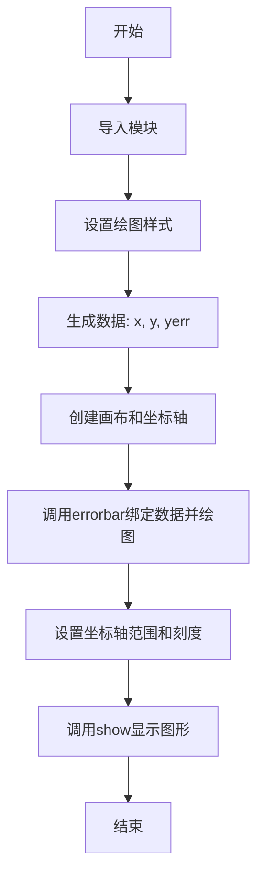
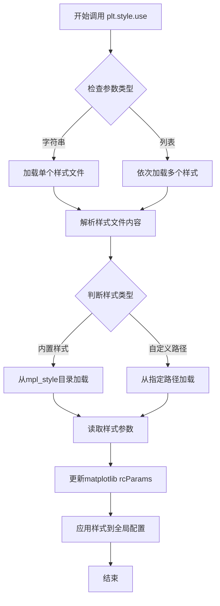
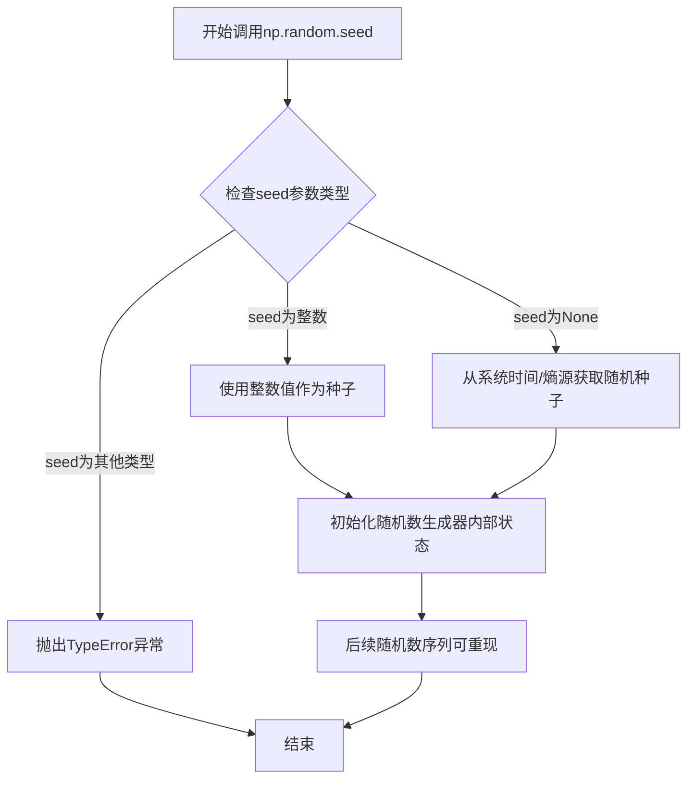
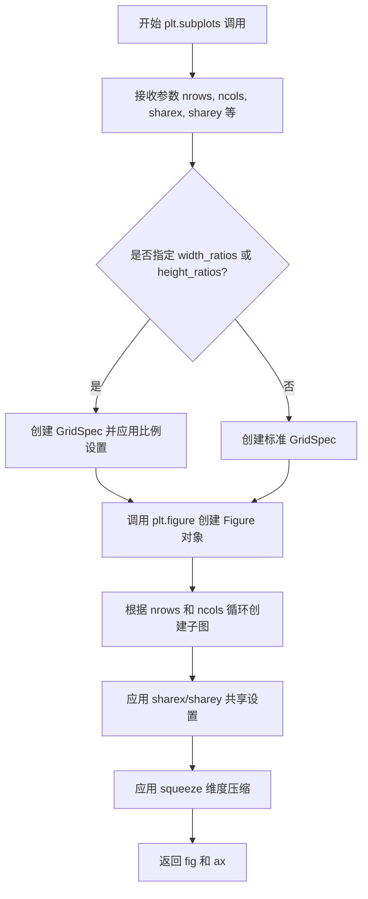
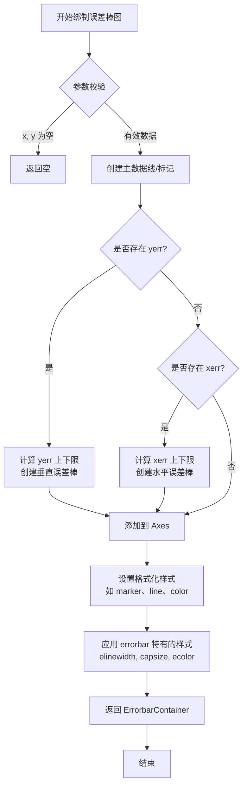
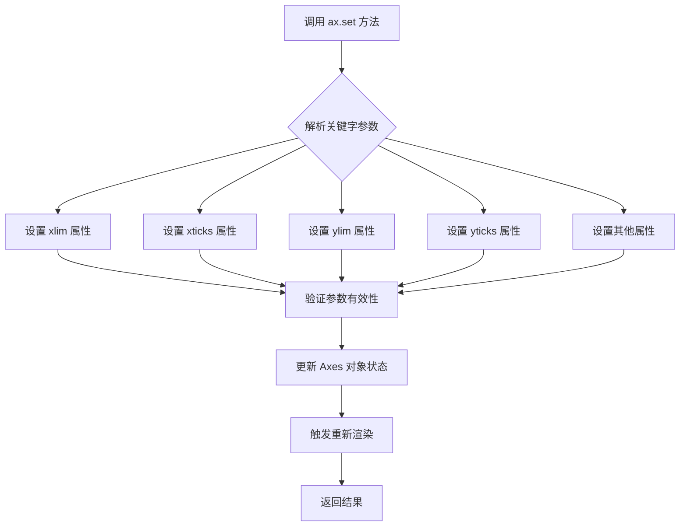
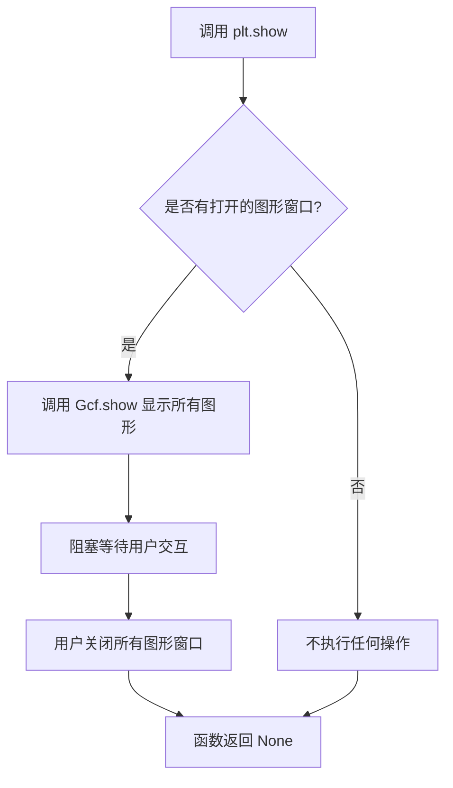

# `matplotlib\galleries\plot_types\stats\errorbar_plot.py` 详细设计文档

该代码是一个matplotlib示例程序，用于演示如何使用errorbar方法绘制带有误差棒的散点图。程序生成随机的x、y坐标数据和误差值，通过ax.errorbar绑定数据并设置样式（线宽、误差棒端点大小），最终展示一个带有垂直误差棒的散点图。

## 整体流程



## 类结构

```
该代码为扁平脚本结构，无类层次结构
直接执行式代码，由上至下顺序执行
```

## 全局变量及字段


### `np`
    
NumPy数学库，用于数值计算和数组操作

类型：`module`
    


### `plt`
    
Matplotlib.pyplot库，用于绑制图形和数据可视化

类型：`module`
    


### `x`
    
x轴数据点

类型：`list`
    


### `y`
    
y轴数据点

类型：`list`
    


### `yerr`
    
y轴误差值

类型：`list`
    


### `fig`
    
matplotlib图形对象

类型：`Figure`
    


### `ax`
    
matplotlib坐标轴对象

类型：`Axes`
    


    

## 全局函数及方法


### `plt.style.use`

设置matplotlib的全局绘图样式，使用指定的主题或样式文件来统一图表的外观。

参数：

- `name`：`str` 或 `list`，样式名称（如 'seaborn-darkgrid'）或样式文件路径，也可以是多个样式的列表
- `after_reset`：`bool`，可选，是否在应用样式之前重置所有样式，默认为 False

返回值：`None`，该函数直接修改matplotlib的rcParams配置，不返回任何值

#### 流程图



#### 带注释源码

```python
# plt.style.use 源码示例（基于matplotlib源码简化）

def use(style, after_reset=False):
    """
    设置matplotlib的全局绘图样式。
    
    参数:
        style: str 或 list
            - 内置样式名: 'default', 'seaborn', 'ggplot', '_mpl-gallery' 等
            - 样式文件路径: '/path/to/style.mplstyle'
            - 样式列表: ['theme1', 'theme2']
        after_reset: bool
            - False: 在当前rcParams基础上叠加样式
            - True: 重置后再应用新样式
    """
    
    # 导入样式模块
    from matplotlib import style
    from matplotlib.style.core import read_style_file
    
    # 处理样式列表（支持多样式叠加）
    if isinstance(style, list):
        for s in style:
            use(s, after_reset=after_reset)
        return
    
    # 读取样式文件
    if after_reset:
        # 重置为默认样式后再应用
        rcdefaults()  # 重置rcParams
    
    # 解析样式文件并更新rcParams
    style_dict = read_style_file(style)
    
    # 将样式参数应用到matplotlib的rcParams
    rcParams.update(style_dict)
    
    return None
```

#### 使用示例源码

```python
import matplotlib.pyplot as plt
import numpy as np

# 使用内置样式
plt.style.use('_mpl-gallery')

# 使用多个样式（后面的会覆盖前面的）
# plt.style.use(['dark_background', 'ggplot'])

# 使用自定义样式文件
# plt.style.use('/path/to/custom.mplstyle')

# 完成后可重置为默认样式
# plt.rcdefaults()
```


### `np.random.seed`

设置NumPy随机数生成器的种子，使得后续生成的随机数序列可重现。

参数：

- `seed`：`int` 或 `None`，随机数种子值。如果为整数，则使用该值初始化随机数生成器；如果为`None`，则从系统时间或熵源获取种子。

返回值：`None`，无返回值，该函数直接修改随机数生成器的内部状态。

#### 流程图



#### 带注释源码

```python
# 设置随机数种子为1，使得后续随机数生成可重现
# 种子值1确保每次运行程序时，相同的随机操作会产生相同的结果
np.random.seed(1)
```

#### 上下文使用说明

在给定的代码示例中，`np.random.seed(1)`的作用是：
- 确保后续可能出现的随机操作（如数据生成、训练集划分等）具有可重复性
- 值为1是任意选择的，只要使用相同的种子值，每次运行脚本时随机行为都一致
- 这对于调试、单元测试和实验复现非常重要

#### 技术债务和优化空间

- **潜在问题**：在生产代码中使用固定种子可能影响性能，因为某些随机数生成算法在设置种子后首次调用时可能有额外的初始化开销
- **优化建议**：如果在不需要可重现性的场景下，应移除此行代码或使用`np.random.default_rng()`获取独立的随机数生成器实例
- **最佳实践**：在大型项目中，建议使用`np.random.Generator`类（NumPy 1.17+引入）代替全局随机数生成器，以更好地管理随机状态


### `plt.subplots`

创建包含多个子图的图形和坐标轴对象，是 matplotlib 中初始化子图布局的核心函数。

#### 参数

- `nrows`：`int`，默认值为 1，表示子图的行数。
- `ncols`：`int`，默认值为 1，表示子图的列数。
- `sharex`：`bool` 或 `{'none', 'all', 'row', 'col'}`，默认值为 False，控制是否共享 x 轴。
- `sharey`：`bool` 或 `{'none', 'all', 'row', 'col'}`，默认值为 False，控制是否共享 y 轴。
- `squeeze`：`bool`，默认值为 True，是否压缩返回的坐标轴数组维度。
- `width_ratios`：`array-like`，可选，表示每列的宽度比例。
- `height_ratios`：`array-like`，可选，表示每行的高度比例。
- `subplot_kw`：`dict`，可选，传递给每个子图的关键字参数。
- `gridspec_kw`：`dict`，可选，传递给 GridSpec 的关键字参数。
- `**fig_kw`：任意关键字参数，传递给 `plt.figure()` 函数。

#### 返回值

- `fig`：`matplotlib.figure.Figure` 对象，整个图形容器。
- `ax`：`matplotlib.axes.Axes` 或 `numpy.ndarray` of Axes，子图对象。当 `squeeze=True` 且只有单个子图时返回单个 Axes 对象，否则返回 Axes 数组。

#### 流程图



#### 带注释源码

```python
def subplots(nrows=1, ncols=1, sharex=False, sharey=False, squeeze=True,
             width_ratios=None, height_ratios=None, subplot_kw=None,
             gridspec_kw=None, **fig_kw):
    """
    创建图形及子图坐标轴的便捷函数。
    
    参数:
        nrows: 子图行数，默认为1
        ncols: 子图列数，默认为1
        sharex: x轴共享策略，可为bool或{'none','all','row','col'}
        sharey: y轴共享策略，可为bool或{'none','all','row','col'}
        squeeze: 为True时压缩返回的ax数组维度
        width_ratios: 每列宽度比例数组
        height_ratios: 每行高度比例数组
        subplot_kw: 传递给add_subplot的参数字典
        gridspec_kw: 传递给GridSpec的参数字典
        **fig_kw: 传递给figure()的额外参数
    
    返回:
        fig: Figure对象，整个图形
        ax: Axes对象或Axes数组
    """
    # 1. 创建或获取Figure对象
    fig = plt.figure(**fig_kw)
    
    # 2. 配置GridSpec参数
    if gridspec_kw is None:
        gridspec_kw = {}
    if width_ratios is not None:
        gridspec_kw['width_ratios'] = width_ratios
    if height_ratios is not None:
        gridspec_kw['height_ratios'] = height_ratios
    
    # 3. 创建GridSpec对象
    gs = GridSpec(nrows, ncols, **gridspec_kw)
    
    # 4. 循环创建子图坐标轴
    axarr = np.empty((nrows, ncols), dtype=object)
    for i in range(nrows):
        for j in range(ncols):
            # 创建子图并添加到图形
            ax = fig.add_subplot(gs[i, j], **(subplot_kw or {}))
            axarr[i, j] = ax
    
    # 5. 处理坐标轴共享逻辑
    if sharex or sharey:
        # 配置共享轴的标签隐藏等属性
        ...
    
    # 6. 根据squeeze参数处理返回值
    if squeeze:
        # 尝试压缩维度：单行/单列返回1D数组，单个子图返回单个对象
        if nrows == 1 and ncols == 1:
            return fig, axarr[0, 0]
        elif nrows == 1 or ncols == 1:
            return fig, axarr.ravel()
    
    return fig, axarr
```


### `Axes.errorbar`

绑制带误差棒的散点图或折线图，支持同时指定 x 和 y 方向的误差棒，并可通过格式化字符串自定义主数据点的线条和标记样式。

参数：

- `x`：`array-like`，X 轴数据点坐标
- `y`：`array-like`，Y 轴数据点坐标
- `yerr`：`scalar` 或 `array-like`，可选，Y 方向的误差值
- `xerr`：`scalar` 或 `array-like`，可选，X 方向的误差值
- `fmt`：`str`，可选，格式化字符串，格式为 '[marker][line][color]'，如 `'o'` 表示圆形标记
- `elinewidth`：`float`，可选，误差棒线条宽度
- `capthick` 或 `capsize`：`float`，可选，误差棒端点（cap）的大小或厚度
- `ecolor`：`color`，可选，误差棒颜色
- `markerfacecolor` 或 `mfc`：`color`，可选，标记填充颜色
- `markeredgecolor` 或 `mec`：`color`，可选，标记边缘颜色
- `markersize` 或 `ms`：`float`，可选，标记大小
- `linewidth` 或 `lw`：`float`，可选，主数据线宽度

返回值：`ErrorbarContainer`，返回一个容器对象，包含以下属性：
- `plotlines`：`Line2D` 对象，主数据点和连线的 Artist
- `xerrbars`：`LineCollection`，X 方向误差棒
- `yerrbars`：`LineCollection`，Y 方向误差棒
- `data_line`：`Line2D`，数据线（如果 fmt 不包含 ' '）

#### 流程图



#### 带注释源码

```python
"""
==========================
errorbar(x, y, yerr, xerr)
==========================
Plot y versus x as lines and/or markers with attached errorbars.

See `~matplotlib.axes.Axes.errorbar`.
"""
import matplotlib.pyplot as plt
import numpy as np

# 使用内置绘图风格
plt.style.use('_mpl-gallery')

# 设置随机种子以确保可重复性
np.random.seed(1)

# 准备数据：x 坐标、y 坐标、y 方向误差
x = [2, 4, 6]          # X 轴数据点
y = [3.6, 5, 4.2]      # Y 轴数据点
yerr = [0.9, 1.2, 0.5] # 每个点的 Y 方向误差值

# 创建图形和坐标轴
fig, ax = plt.subplots()

# 调用 errorbar 方法绑制带误差棒的散点图
# 参数说明：
#   x, y        - 数据点坐标
#   yerr        - Y 方向误差
#   fmt='o'     - 使用圆形标记，不显示连接线
#   linewidth=2 - 数据线宽度为 2
#   capsize=6   - 误差棒端点大小为 6
ax.errorbar(x, y, yerr, fmt='o', linewidth=2, capsize=6)

# 设置坐标轴范围和刻度
ax.set(xlim=(0, 8), xticks=np.arange(1, 8),
       ylim=(0, 8), yticks=np.arange(1, 8))

# 显示图形
plt.show()
```

#### 关键组件信息

| 组件名称 | 一句话描述 |
|---------|-----------|
| `ErrorbarContainer` | 封装 errorbar 返回的多个 Artist 对象的容器，包含数据线和误差棒 |
| `Line2D` | 表示数据点和连线的二维线条对象 |
| `LineCollection` | 误差棒的集合对象，用于批量管理多条误差线 |

#### 潜在技术债务或优化空间

1. **格式化字符串解析**：当前使用简单的 fmt 字符串解析，未来可考虑更灵活的样式配置接口
2. **误差计算自动化**：可增加自动计算置信区间或标准差的选项
3. **性能优化**：大批量数据点时，误差棒的渲染可考虑使用批处理优化

#### 其它说明

- **设计目标**：提供一种直观展示数据不确定性/误差的可视化方式
- **约束条件**：x 和 y 长度必须一致；yerr 和 xerr 可以是标量（所有点共用）或与数据等长的数组
- **错误处理**：当数据长度不匹配时抛出 `ValueError`；当误差值为负数时取绝对值
- **外部依赖**：matplotlib 核心库、NumPy（用于数组操作）


### `Axes.set`

`Axes.set` 是 matplotlib 中用于设置坐标轴属性的方法，通过关键字参数的方式一次性配置坐标轴的多个属性，如轴范围、刻度、标签、标题等。该方法封装了对 xlim、ylim、xticks、yticks、xlabel、ylabel、title 等属性的设置，提供了统一的接口来配置 Axes 对象的各种视觉元素。

参数：

- `xlim`：tuple 或 list，x 轴的显示范围，格式为 (min, max)
- `xticks`：array_like，x 轴刻度线的位置
- `ylim`：tuple 或 list，y 轴的显示范围，格式为 (min, max)
- `yticks`：array_like，y 轴刻度线的位置
- `xlabel`：str，x 轴的标签文本
- `ylabel`：str，y 轴的标签文本
- `title`：str，axes 的标题
- `**kwargs`：其他关键字参数，用于设置其他 Axes 属性

返回值：`None` 或 `Artist`，通常返回 None，在某些属性设置下可能返回修改的 Artist 对象

#### 流程图



#### 带注释源码

```python
# 源码来自 matplotlib 库中的 Axes.set 方法
# 文件位置: lib/matplotlib/axes/_base.py

def set(self, **kwargs):
    """
    设置 Axes 的多个属性。
    
    该方法是多个 setter 方法的便捷包装器，
    允许使用关键字参数一次性设置多个属性。
    
    参数:
        **kwargs: 关键字参数，键为属性名，值为属性值
            - xlim: tuple 设置 x 轴范围
            - ylim: tuple 设置 y 轴范围  
            - xlabel: str 设置 x 轴标签
            - ylabel: str 设置 y 轴标签
            - title: str 设置标题
            - xticks: array 设置 x 轴刻度
            - yticks: array 设置 y 轴刻度
            - 等等其他 Axes 属性...
    
    返回值:
        Artist: 如果只设置一个属性返回该 Artist，
                否则返回包含所有修改的 Artist 的字典
    """
    # 遍历所有关键字参数
    for attr in ['xlim', 'ylim', 'xlabel', 'ylabel', 'title',
                 'xticks', 'yticks', 'xticklabels', 'yticklabels']:
        if attr in kwargs:
            # 获取对应的 setter 方法并调用
            # 例如: xlim -> set_xlim, xlabel -> set_xlabel
            setter = 'set_' + attr
            value = kwargs.pop(attr)
            # 通过 getattr 获取方法并调用
            getattr(self, setter)(value)
    
    # 处理其他关键字参数
    # 使用 setp 函数设置剩余的属性
    return self.setp(kwargs)
```


### `plt.show`

该函数是 Matplotlib 库中的图形显示函数，用于将所有当前打开的图形窗口显示在屏幕上，阻止程序继续执行直到用户关闭图形窗口。

参数：此函数无任何参数。

返回值：`None`，无返回值。

#### 流程图



#### 带注释源码

```python
def show(*, block=None):
    """
    显示所有打开的图形窗口。
    
    参数:
        block: 布尔值或 None，可选
            - True: 阻塞程序执行，等待用户关闭图形
            - False: 立即返回，不阻塞
            - None (默认): 根据后端行为决定是否阻塞
    """
    # 获取当前所有活动图形的状态管理器
    _pylab_helpers.Gcf.destroy_all()
    
    # 如果指定了 block 参数，则直接使用
    # 否则根据当前后端的默认行为决定
    if block is None:
        # 对于某些后端（如 Qt），默认会阻塞
        # 对于其他后端，可能不会阻塞
        block = _get_blocking_status()
    
    # 调用底层显示机制
    for manager in _pylab_helpers.Gcf._all_active_figs:
        manager.show()
    
    # 如果 block 为 True，则进入事件循环等待
    if block:
        # 启动 GUI 事件循环，阻塞程序执行
        # 等待用户关闭图形窗口
        _maybe_drop_to_interactive_shell()
    
    return None
```

#### 备注说明

- `plt.show()` 会调用后端特定的显示函数来渲染图形
- 在交互式环境（如 Jupyter Notebook）中，通常不需要调用此函数，因为图形会自动显示
- 在脚本模式下，必须调用此函数才能看到图形窗口
- `block` 参数的具体行为取决于所使用的 Matplotlib 后端（如 Qt、Tkinter、matplotlib inline 等）


## 关键组件


### 核心功能概述

该代码是一个matplotlib误差棒图（errorbar）绘制示例，通过绑定x轴数据、y轴数据及误差值，在坐标系中以带误差线的散点形式可视化数据点及其不确定性，并设置坐标轴范围和刻度完成图表展示。

### 文件整体运行流程

1. 导入matplotlib.pyplot和numpy模块
2. 设置绘图样式为"_mpl-gallery"
3. 设置随机种子（用于可复现性）
4. 定义绘图数据：x坐标数组、y坐标数组、y轴误差数组
5. 创建Figure和Axes对象
6. 调用Axes.errorbar()方法绑制误差棒图
7. 设置坐标轴范围和刻度
8. 调用plt.show()显示图表

### 全局变量

| 名称 | 类型 | 描述 |
|------|------|------|
| x | list | x轴数据点列表 |
| y | list | y轴数据点列表 |
| yerr | list | y轴误差值列表 |
| fig | matplotlib.figure.Figure | 图表容器对象 |
| ax | matplotlib.axes.Axes | 坐标轴对象 |

### 全局函数

| 函数名 | 参数 | 参数类型 | 参数描述 | 返回值类型 | 返回值描述 |
|--------|------|----------|----------|------------|------------|
| plt.style.use | style | str | 绘图样式名称 | None | 无返回值，设置全局样式 |
| np.random.seed | seed | int | 随机数种子 | None | 无返回值，初始化随机数生成器 |
| plt.subplots | figsize, dpi | tuple, int | 图表尺寸和分辨率 | tuple(Figure, Axes) | 返回图表和坐标轴对象 |
| ax.errorbar | x, y, yerr, xerr, fmt, linewidth, capsize | 数组/数组, 数组, 数组, 数组, str, int, int | x数据、y数据、x误差、y误差、线格式、线宽、误差棒端点大小 | ErrorbarContainer | 包含所有艺术对象的容器 |
| ax.set | xlim, xticks, ylim, yticks | tuple, array, tuple, array | x轴范围、x轴刻度、y轴范围、y轴刻度 | Artist | 设置后的坐标轴对象 |
| plt.show | 无 | - | - | None | 无返回值，显示所有图表 |

### 关键组件信息

#### matplotlib.pyplot
Matplotlib库的pyplot模块，提供类似于MATLAB的绘图接口，是本代码的核心绘图工具。

#### numpy.random
NumPy库的随机数生成模块，用于设置随机种子以确保结果可复现。

#### Axes.errorbar
matplotlib Axes对象的errorbar方法，专门用于绑制带误差线的散点图，是实现误差棒可视化的核心组件。

### 潜在技术债务与优化空间

1. **硬编码数据**：x、y、yerr数组直接硬编码，缺乏灵活性，应考虑从文件或API动态加载数据
2. **魔法数字**：坐标轴范围(0,8)和刻度值重复出现，应定义为常量提高可维护性
3. **样式依赖**：依赖"_mpl-gallery"样式，若该样式不存在会导致错误，应添加回退机制
4. **错误处理缺失**：未对输入数据的有效性进行验证（如数组长度不一致）
5. **未关闭资源**：未显式调用plt.close()释放图表资源，在大规模应用中可能导致内存泄漏

### 其它项目

#### 设计目标
通过简洁的API调用快速生成专业的误差棒可视化图表。

#### 约束
- 依赖matplotlib和numpy环境
- 数据数组长度必须一致
- 必须在有图形界面的环境中运行以显示图表

#### 错误处理
当前代码无显式错误处理，数据不一致时errorbar方法会抛出异常。

#### 外部依赖
- matplotlib>=3.0
- numpy>=1.0


## 问题及建议


### 已知问题

-   **硬编码数据缺乏灵活性**：x、y、yerr等数据直接硬编码在代码中，无法复用或通过参数传入，降低了代码的可配置性
-   **未使用导入的numpy随机函数**：代码中使用了`np.random.seed(1)`，但并未实际生成任何随机数据，该导入的随机相关功能未被使用
-   **未使用私有样式**：使用了`plt.style.use('_mpl-gallery')`，以单下划线开头的样式为私有样式，可能在版本更新时发生变化或被移除
-   **未使用的变量**：创建的`fig`变量未被使用，造成资源浪费
-   **文档与实现不匹配**：文档字符串描述了`xerr`参数，但代码中未使用该参数，可能造成误导
-   **魔法数字缺乏说明**：xlim、ylim、xticks等参数中的数值（0、8、1、7等）硬编码，缺乏常量定义，代码可读性和可维护性差
-   **plt.show()在非交互环境效率低**：在某些环境（如脚本）中可能导致显示问题，且在Jupyter notebook中应考虑使用%matplotlib inline
-   **错误处理缺失**：没有对输入数据的有效性进行校验（如数组长度不一致、负值等）

### 优化建议

-   将数据参数化，通过函数封装或配置文件管理
-   移除未使用的`np.random.seed(1)`和`fig`变量
-   使用稳定的公共样式或创建自定义样式文件
-   删除文档中未实现的`xerr`参数描述，或在代码中实现该功能
-   提取魔法数字为命名常量，提高代码可读性
-   添加输入数据验证逻辑，检查x、y、yerr数组长度一致性
-   考虑使用面向对象方式封装图表创建逻辑，提高复用性


## 其它


### 设计目标与约束

本代码旨在演示matplotlib库中errorbar函数的基本用法，通过绑定带有误差棒的散点图来展示数据可视化能力。设计目标是提供一个简洁、可运行的示例，帮助开发者快速理解errorbar API的使用方式。约束条件包括：依赖matplotlib和numpy两个外部库，需要在支持图形显示的环境中运行。

### 错误处理与异常设计

代码中未包含显式的错误处理机制。在实际应用场景中，应考虑添加以下错误处理：输入数据类型的校验（x、y、yerr应为数值型列表或数组）、数组长度一致性检查（x、y、yerr长度必须匹配）、图形环境可用性检查（plt.show()前应处理无显示设备的情况）。建议使用try-except块捕获可能出现的ImportError、ValueError等异常。

### 数据流与状态机

数据流遵循以下路径：随机种子设置 → 数据准备(x、y、yerr) → 图形对象创建(fig, ax) → 绑定绘制(ax.errorbar) → 坐标轴设置(ax.set) → 图形显示(plt.show())。状态机包含四个主要状态：初始化状态（导入依赖）、数据准备状态（生成测试数据）、绑定状态（创建图形并绑定数据）、显示状态（渲染并输出图形）。

### 外部依赖与接口契约

本代码依赖两个外部包：numpy（版本建议>=1.20.0）提供数值计算支持，matplotlib（版本建议>=3.4.0）提供绑定绘图功能。核心接口为ax.errorbar()，其签名为errorbar(x, y, yerr=None, xerr=None, fmt='', ecolor=None, elinewidth=None, capsize=None, **kwargs)，返回值包含绑定线对象、数据点对象、误差棒对象等组件。

### 性能考虑

当前代码用于演示目的，数据量较小（3个数据点），性能问题不明显。在大规模数据场景下，应考虑：批量绑定而非逐点添加、使用LineCollection优化大量线条渲染、在Web环境下使用backend而非交互式显示。plt.style.use()调用存在全局状态影响，应注意样式隔离。

### 安全性考虑

代码不涉及用户输入、文件操作或网络通信，安全性风险较低。但应注意：np.random.seed(1)的使用场景（演示固定输出 vs 生产环境应使用更安全的随机数生成）、避免在代码中硬编码敏感配置、第三方库的安全更新关注。

### 可维护性与扩展性

当前代码将所有逻辑集中在一个脚本中，不利于大型项目维护。建议的扩展方向包括：封装为函数参数化绑定过程、提取配置常量、支持数据文件输入、分离数据准备与绑定逻辑。代码注释完善，采用了文档字符串格式，符合基本的可维护性要求。

### 配置管理

当前代码采用硬编码方式管理配置（数据值、样式参数）。建议的配置管理方案包括：使用配置文件（YAML/JSON）管理绑定参数、使用环境变量控制样式选择、将可调整参数提取为模块级常量或配置类。plt.style.use('_mpl-gallery')使用了matplotlib内置样式，应注意不同版本间样式可用性的差异。

### 测试策略

由于这是演示代码，传统单元测试适用性有限。建议的测试策略包括：验证绑定返回值类型正确性、测试不同参数组合的绑定行为、添加回归测试确保样式一致性、使用mock测试图形输出、验证跨平台图形渲染一致性。对于演示代码，视觉回归测试尤为重要。

### 版本兼容性

代码需要关注以下版本兼容性：matplotlib 3.4.0+推荐使用capstone参数而非deprecated参数、_mpl-gallery样式在较旧版本中可能不存在、numpy随机API在2.0版本有重大变更。建议在requirements.txt中明确指定版本约束，或使用版本检测代码实现向后兼容。

### 安装与环境配置

运行本代码需要以下环境配置：Python 3.8+、matplotlib 3.4.0+、numpy 1.20.0+。推荐使用虚拟环境管理依赖：python -m venv venv && source venv/bin/activate && pip install matplotlib numpy。Windows系统需注意图形后端配置，Linux服务器环境可能需要安装tkinter或配置无头模式( matplotlib.use('Agg') )。


    