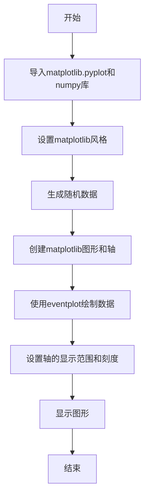
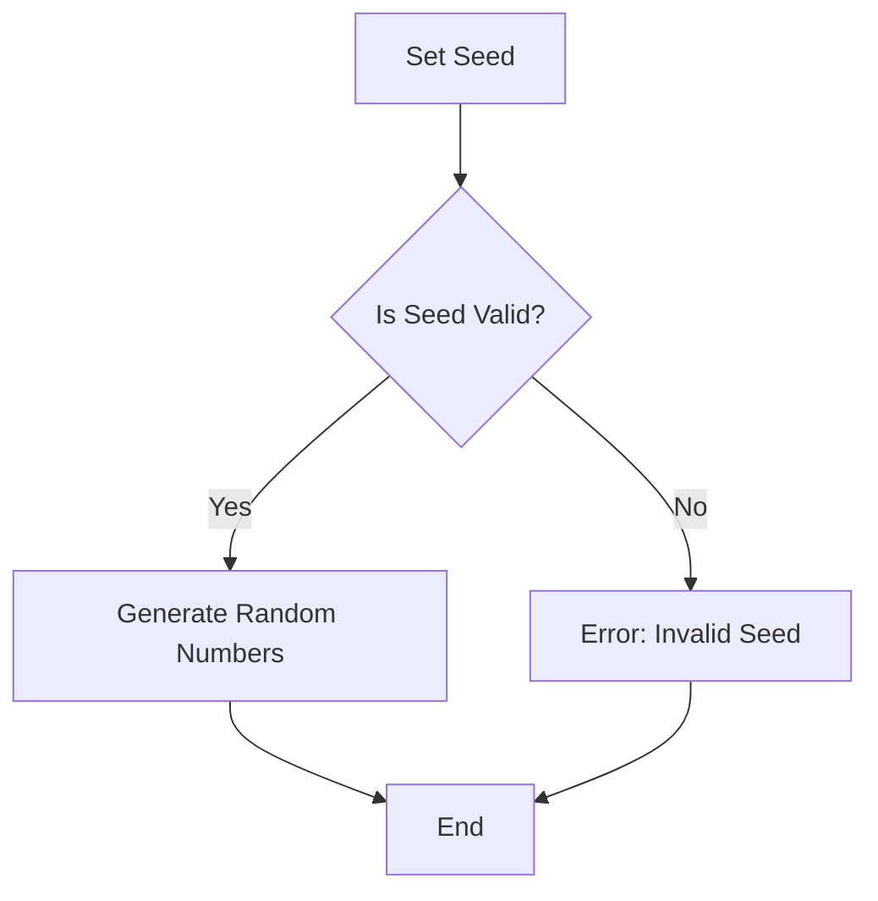
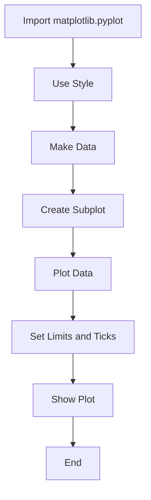
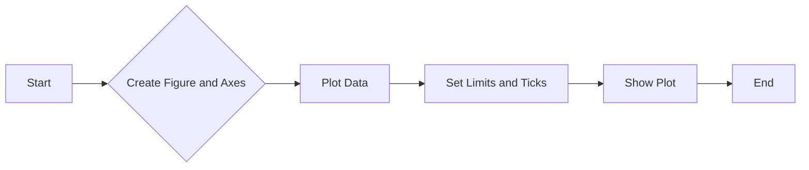
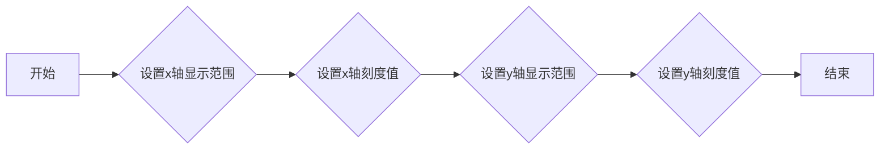
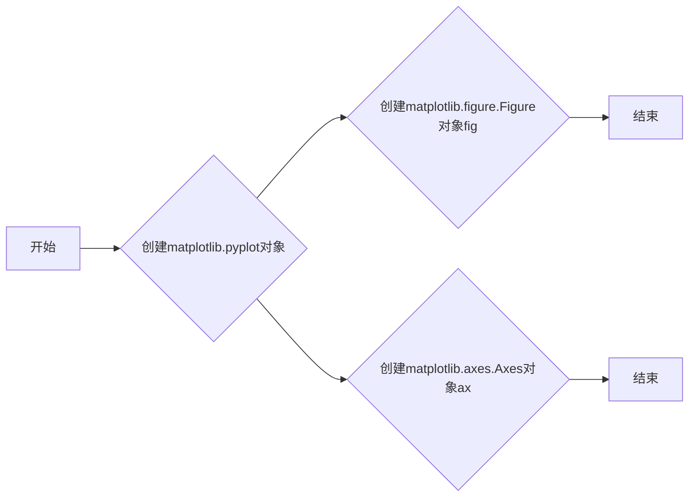
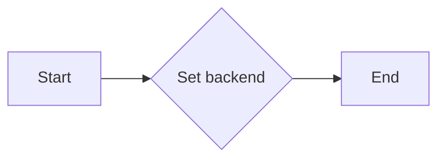
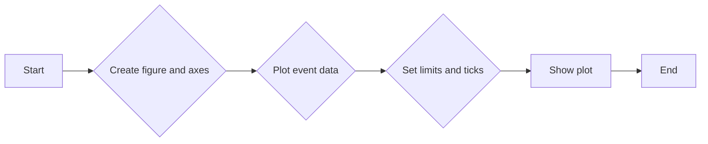
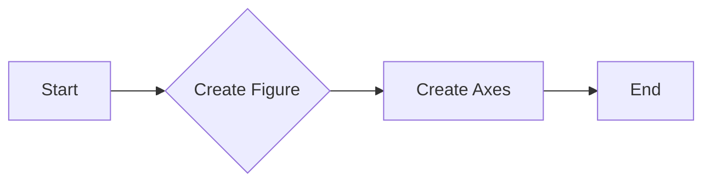
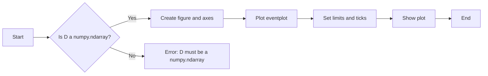

# `matplotlib\galleries\plot_types\stats\eventplot.py` 详细设计文档

This code generates a plot of identical parallel lines at specified positions using the matplotlib library.

## 整体流程



## 类结构

```
matplotlib.pyplot
├── plt.style.use('_mpl-gallery')
│   ├── 设置matplotlib风格
│   └── ...
└── np.random.seed(1)
    └── 设置随机数种子
```

## 全局变量及字段


### `plt`
    
matplotlib.pyplot module for plotting

类型：`module`
    


### `np`
    
numpy module for numerical operations

类型：`module`
    


### `fig`
    
Figure object for plotting

类型：`matplotlib.figure.Figure`
    


### `ax`
    
Axes object for plotting

类型：`matplotlib.axes._subplots.AxesSubplot`
    


### `x`
    
Array of x positions for the event plot

类型：`numpy.ndarray`
    


### `D`
    
Array of data values for the event plot

类型：`numpy.ndarray`
    


### `matplotlib.pyplot.style`
    
Style of the plot

类型：`str`
    


### `numpy.random`
    
Random number generation module

类型：`module`
    


### `numpy.random.seed`
    
Seed for random number generation

类型：`int`
    


### `numpy.random.gamma`
    
Gamma distribution random variate generator

类型：`function`
    
    

## 全局函数及方法


### plt.style.use('_mpl-gallery')

该函数用于设置matplotlib的样式为'_mpl-gallery'，这是一个预定义的样式，用于创建符合matplotlib画廊标准的图表。

参数：

- `_mpl-gallery`：`str`，指定matplotlib的样式为'_mpl-gallery'。

返回值：`None`，该函数不返回任何值。

#### 流程图

```mermaid
graph LR
A[Start] --> B{plt.style.use('_mpl-gallery')}
B --> C[End]
```

#### 带注释源码

```
plt.style.use('_mpl-gallery')  # 设置matplotlib的样式为'_mpl-gallery'
```


### matplotlib.pyplot

该模块是matplotlib的核心模块，用于创建和显示图表。

#### plt

- `plt.style.use('_mpl-gallery')`：设置matplotlib的样式为'_mpl-gallery'。

#### numpy

- `np.random.seed(1)`：设置随机数生成器的种子，确保每次运行代码时生成的随机数序列相同。
- `np.random.gamma(4, size=(3, 50))`：生成一个形状为(3, 50)的gamma分布随机数组。

#### matplotlib.pyplot

- `plt.subplots()`：创建一个图形和一个轴。
- `ax.eventplot(D, orientation="vertical", lineoffsets=x, linewidth=0.75)`：在轴上绘制事件图。
- `ax.set(xlim=(0, 8), xticks=np.arange(1, 8), ylim=(0, 8), yticks=np.arange(1, 8))`：设置轴的显示范围和刻度。
- `plt.show()`：显示图形。

#### 关键组件信息

- `matplotlib.pyplot`：用于创建和显示图表。
- `numpy`：用于生成随机数和数组操作。

#### 潜在的技术债务或优化空间

- 代码中使用了硬编码的样式名称'_mpl-gallery'，如果需要使用其他样式，需要修改代码。
- 代码中使用了硬编码的随机数种子和数组大小，如果需要不同的随机数或数组大小，需要修改代码。

#### 设计目标与约束

- 设计目标是创建一个符合matplotlib画廊标准的图表。
- 约束是使用matplotlib和numpy库。

#### 错误处理与异常设计

- 代码中没有显式的错误处理或异常设计。

#### 数据流与状态机

- 数据流：随机数生成 -> 数组创建 -> 图形创建 -> 事件图绘制 -> 轴设置 -> 图形显示。
- 状态机：无。

#### 外部依赖与接口契约

- 外部依赖：matplotlib和numpy库。
- 接口契约：matplotlib和numpy库的API。


### np.random.seed(1)

设置NumPy随机数生成器的种子，以确保每次运行代码时生成的随机数序列相同。

参数：

- `seed`：`int`，随机数生成器的种子值。设置相同的种子值将产生相同的随机数序列。

返回值：`None`，此函数没有返回值，它仅用于设置随机数生成器的状态。

#### 流程图



#### 带注释源码

```
np.random.seed(1)  # Set the seed for the random number generator
```


### matplotlib.pyplot

matplotlib.pyplot是matplotlib库的一个模块，用于创建静态、交互式和动画可视化。

#### 流程图



#### 带注释源码

```
import matplotlib.pyplot as plt

plt.style.use('_mpl-gallery')  # Use a specific style for the plot

# make data:
x = [2, 4, 6]
D = np.random.gamma(4, size=(3, 50))

# plot:
fig, ax = plt.subplots()  # Create a new figure and an axes in it

ax.eventplot(D, orientation="vertical", lineoffsets=x, linewidth=0.75)  # Plot the event plot

ax.set(xlim=(0, 8), xticks=np.arange(1, 8),
       ylim=(0, 8), yticks=np.arange(1, 8))  # Set the limits and ticks for the axes

plt.show()  # Display the plot
```

### 关键组件信息

- `matplotlib.pyplot`: 用于创建和显示图形。
- `np.random`: NumPy的随机数生成器模块。
- `eventplot`: Matplotlib的Axes类的一个方法，用于绘制事件图。

### 潜在的技术债务或优化空间

- 代码中使用了硬编码的样式和参数，这可能会限制代码的可重用性和可配置性。
- 数据生成部分使用了`np.random.gamma`，这可能会在数据量较大时影响性能。

### 设计目标与约束

- 设计目标是创建一个可重用且易于理解的代码示例，展示如何使用matplotlib和NumPy进行数据可视化。
- 约束包括使用matplotlib和NumPy库，以及遵循良好的编程实践。

### 错误处理与异常设计

- 代码中没有显式的错误处理机制，因为使用的函数和库通常不会抛出异常。
- 如果需要，可以添加异常处理来捕获和处理潜在的运行时错误。

### 数据流与状态机

- 数据流从生成随机数据开始，然后是创建图形和绘制数据，最后显示图形。
- 状态机不适用，因为代码没有明显的状态转换。

### 外部依赖与接口契约

- 代码依赖于matplotlib和NumPy库。
- 接口契约由这些库提供，确保代码能够正确地使用它们的功能。


### np.random.gamma

生成具有伽马分布的随机数。

参数：

- `4`：`float`，形状参数，控制分布的峰度和位置。
- `size=(3, 50)`：`tuple`，形状参数，指定输出数组的形状。

返回值：`numpy.ndarray`，形状为 `(3, 50)` 的数组，包含从伽马分布中抽取的随机数。

#### 流程图

```mermaid
graph TD
A[Start] --> B{Generate gamma distribution}
B --> C[Create array with shape (3, 50)]
C --> D[End]
```

#### 带注释源码

```python
np.random.seed(1)  # 设置随机数种子，确保结果可复现
D = np.random.gamma(4, size=(3, 50))  # 生成伽马分布的随机数
```


### plt.subplots()

该函数用于创建一个图形和一个轴，用于绘制图形。

参数：

- `figsize`：`tuple`，图形的大小，默认为(6, 4)。
- `dpi`：`int`，图形的分辨率，默认为100。
- `facecolor`：`color`，图形的背景颜色，默认为白色。
- `num`：`int`，要创建的轴的数量，默认为1。
- `gridspec_kw`：`dict`，用于定义网格规格的字典。
- `constrained_layout`：`bool`，是否启用约束布局，默认为False。

返回值：`Figure`，图形对象；`Axes`，轴对象。

#### 流程图



#### 带注释源码

```python
import matplotlib.pyplot as plt

fig, ax = plt.subplots()
# fig: 图形对象
# ax: 轴对象
```


### ax.eventplot(D, orientation="vertical", lineoffsets=x, linewidth=0.75)

This function plots identical parallel lines at the given positions using the eventplot method from the matplotlib library.

参数：

- `D`：`numpy.ndarray`，A 2D array of data points. Each row represents a set of identical parallel lines.
- `orientation`：`str`，The orientation of the plot. Default is "vertical".
- `lineoffsets`：`array_like`，The offsets of the lines from the x-axis. Default is an empty array.
- `linewidth`：`float`，The width of the lines. Default is 0.75.

返回值：`None`，This function does not return any value. It directly modifies the plot.

#### 流程图

```mermaid
graph LR
A[Start] --> B{Call ax.eventplot(D, orientation="vertical", lineoffsets=x, linewidth=0.75)}
B --> C[End]
```

#### 带注释源码

```python
import matplotlib.pyplot as plt
import numpy as np

plt.style.use('_mpl-gallery')

# make data:
np.random.seed(1)
x = [2, 4, 6]
D = np.random.gamma(4, size=(3, 50))

# plot:
fig, ax = plt.subplots()

# Plot identical parallel lines at the given positions.
ax.eventplot(D, orientation="vertical", lineoffsets=x, linewidth=0.75)

ax.set(xlim=(0, 8), xticks=np.arange(1, 8),
       ylim=(0, 8), yticks=np.arange(1, 8))

plt.show()
```

### 关键组件信息

- `matplotlib.pyplot`：用于创建和修改图形。
- `numpy`：用于数值计算和数组操作。

### 潜在的技术债务或优化空间

- 代码中没有使用异常处理来处理可能的错误，例如输入数据类型不正确。
- 代码中没有使用日志记录来记录关键步骤或错误信息。

### 设计目标与约束

- 设计目标是创建一个简单的图形，展示给定数据点的平行线。
- 约束是使用matplotlib库来创建图形。

### 错误处理与异常设计

- 代码中没有使用异常处理来处理可能的错误。
- 建议添加异常处理来确保输入数据的有效性。

### 数据流与状态机

- 数据流：数据从numpy数组D传递到matplotlib的eventplot函数。
- 状态机：没有使用状态机，因为代码流程是线性的。

### 外部依赖与接口契约

- 依赖：matplotlib和numpy库。
- 接口契约：matplotlib的eventplot函数接口。


### ax.set()

设置轴的显示范围和刻度。

参数：

- `xlim`：`tuple`，设置x轴的显示范围，例如(0, 8)表示x轴从0到8。
- `xticks`：`array`，设置x轴的刻度值，例如np.arange(1, 8)表示从1到7的整数。
- `ylim`：`tuple`，设置y轴的显示范围，例如(0, 8)表示y轴从0到8。
- `yticks`：`array`，设置y轴的刻度值，例如np.arange(1, 8)表示从1到7的整数。

返回值：无，该方法不返回任何值。

#### 流程图



#### 带注释源码

```
ax.set(xlim=(0, 8), xticks=np.arange(1, 8),
       ylim=(0, 8), yticks=np.arange(1, 8))
```


### plt.show()

显示当前图形的窗口。

参数：

- 无

返回值：无

#### 流程图

```mermaid
graph LR
A[开始] --> B{调用plt.show()}
B --> C[结束]
```

#### 带注释源码

```
plt.show()
```


### eventplot(D)

绘制给定位置上的相同平行线。

参数：

- D：`numpy.ndarray`，包含要绘制的事件数据。

返回值：无

#### 流程图

```mermaid
graph LR
A[开始] --> B{创建matplotlib.pyplot对象}
B --> C{创建numpy.ndarray对象D}
C --> D{调用eventplot(D)}
D --> E{设置轴限制和刻度}
E --> F{显示图形}
F --> G[结束]
```

#### 带注释源码

```python
ax.eventplot(D, orientation="vertical", lineoffsets=x, linewidth=0.75)
```


### fig, ax

创建matplotlib图形和轴对象。

参数：

- 无

返回值：

- fig：`matplotlib.figure.Figure`，当前图形对象。
- ax：`matplotlib.axes.Axes`，当前轴对象。

#### 流程图



#### 带注释源码

```python
fig, ax = plt.subplots()
```


### plt.style.use('_mpl-gallery')

设置matplotlib样式为'_mpl-gallery'。

参数：

- '_mpl-gallery'：`str`，matplotlib样式名称。

返回值：无

#### 流程图

```mermaid
graph LR
A[开始] --> B{调用plt.style.use()}
B --> C{设置样式为'_mpl-gallery'}
C --> D[结束]
```

#### 带注释源码

```python
plt.style.use('_mpl-gallery')
```


### np.random.seed(1)

设置numpy随机数生成器的种子。

参数：

- 1：`int`，随机数生成器的种子。

返回值：无

#### 流程图

```mermaid
graph LR
A[开始] --> B{调用np.random.seed()}
B --> C{设置种子为1}
C --> D[结束]
```

#### 带注释源码

```python
np.random.seed(1)
```


### x = [2, 4, 6]

创建一个包含三个元素的列表x。

参数：

- 无

返回值：

- x：`list`，包含整数2, 4, 6的列表。

#### 流程图

```mermaid
graph LR
A[开始] --> B{创建列表x}
B --> C{列表x包含元素[2, 4, 6]}
C --> D[结束]
```

#### 带注释源码

```python
x = [2, 4, 6]
```


### D = np.random.gamma(4, size=(3, 50))

创建一个形状为(3, 50)的numpy数组D，其元素服从伽马分布。

参数：

- 4：`float`，伽马分布的形状参数。
- (3, 50)：`tuple`，数组的形状。

返回值：

- D：`numpy.ndarray`，形状为(3, 50)的伽马分布数组。

#### 流程图

```mermaid
graph LR
A[开始] --> B{创建numpy.ndarray对象D}
B --> C{D服从伽马分布，形状为(3, 50)}
C --> D[结束]
```

#### 带注释源码

```python
D = np.random.gamma(4, size=(3, 50))
```


### ax.set(xlim=(0, 8), xticks=np.arange(1, 8),
       ylim=(0, 8), yticks=np.arange(1, 8))

设置轴的x和y限制以及x和y的刻度。

参数：

- xlim：`tuple`，x轴的限制范围。
- xticks：`numpy.ndarray`，x轴的刻度值。
- ylim：`tuple`，y轴的限制范围。
- yticks：`numpy.ndarray`，y轴的刻度值。

返回值：无

#### 流程图

```mermaid
graph LR
A[开始] --> B{设置轴限制和刻度}
B --> C{设置x轴限制为(0, 8)}
B --> D{设置x轴刻度为[1, 2, 3, 4, 5, 6, 7]}
B --> E{设置y轴限制为(0, 8)}
B --> F{设置y轴刻度为[1, 2, 3, 4, 5, 6, 7]}
B --> G[结束]
```

#### 带注释源码

```python
ax.set(xlim=(0, 8), xticks=np.arange(1, 8),
       ylim=(0, 8), yticks=np.arange(1, 8))
```


### matplotlib.pyplot.use

matplotlib.pyplot.use 是一个全局函数，用于设置matplotlib使用的后端。

参数：

- `backend`：`str`，指定matplotlib使用的后端名称。

返回值：`None`，该函数没有返回值。

#### 流程图



#### 带注释源码

```
# 设置matplotlib使用的后端
plt.style.use('_mpl-gallery')
```


### matplotlib.pyplot.eventplot

matplotlib.pyplot.eventplot 是一个全局函数，用于绘制给定位置上的平行线。

参数：

- `D`：`array_like`，包含要绘制的事件数据的数组。
- `orientation`：`str`，指定事件的方向，可以是 "vertical" 或 "horizontal"。
- `lineoffsets`：`array_like`，指定每个事件线的偏移量。
- `linewidth`：`float`，指定事件线的宽度。

返回值：`AxesSubplot`，包含绘制的图形的子图。

#### 流程图



#### 带注释源码

```
# 创建图形和坐标轴
fig, ax = plt.subplots()

# 绘制事件数据
ax.eventplot(D, orientation="vertical", lineoffsets=x, linewidth=0.75)

# 设置坐标轴的极限和刻度
ax.set(xlim=(0, 8), xticks=np.arange(1, 8),
       ylim=(0, 8), yticks=np.arange(1, 8))

# 显示图形
plt.show()
```

### 关键组件信息

- `matplotlib.pyplot`：matplotlib的pyplot模块，用于创建图形和坐标轴。
- `numpy`：NumPy库，用于数值计算和数组操作。

### 潜在的技术债务或优化空间

- 代码中使用了硬编码的样式和坐标轴设置，可以考虑使用配置文件或参数化来提高代码的灵活性和可重用性。
- 代码中没有进行错误处理，可以考虑添加异常处理来提高代码的健壮性。

### 设计目标与约束

- 设计目标是创建一个简单的图形，用于展示事件数据。
- 约束是使用matplotlib和NumPy库。

### 错误处理与异常设计

- 代码中没有进行错误处理，可以考虑添加异常处理来捕获和处理可能出现的错误。

### 数据流与状态机

- 数据流：从NumPy生成数据，然后使用matplotlib.pyplot.eventplot绘制图形。
- 状态机：代码中没有明确的状态机，但可以通过添加状态变量来模拟状态变化。

### 外部依赖与接口契约

- 代码依赖于matplotlib和NumPy库。
- 接口契约：matplotlib.pyplot.eventplot函数的参数和返回值类型定义了接口契约。


### plt.subplots

`subplots` 是 `matplotlib.pyplot` 模块中的一个函数，用于创建一个图形和一个轴（axes）。

参数：

- `figsize`：`tuple`，图形的大小（宽度和高度），默认为 `(6, 4)`。
- `dpi`：`int`，图形的分辨率，默认为 `100`。
- `facecolor`：`color`，图形的背景颜色，默认为 `'w'`（白色）。
- `edgecolor`：`color`，图形的边缘颜色，默认为 `'none'`。
- `frameon`：`bool`，是否显示图形的边框，默认为 `True`。
- `gridspec_kw`：`dict`，用于定义网格的参数，默认为 `{}`。
- `constrained_layout`：`bool`，是否启用约束布局，默认为 `False`。
- `sharex`：`bool` 或 `str`，是否共享x轴，默认为 `False`。
- `sharey`：`bool` 或 `str`，是否共享y轴，默认为 `False`。
- `subplot_kw`：`dict`，用于定义子图参数的字典，默认为 `{}`。

返回值：`Figure` 对象，包含一个轴（axes）。

#### 流程图



#### 带注释源码

```python
import matplotlib.pyplot as plt

fig, ax = plt.subplots()
# fig: Figure 对象，包含一个轴（axes）
# ax: Axes 对象，用于绘制图形
```


### matplotlib.pyplot.eventplot

matplotlib.pyplot.eventplot 是一个用于绘制在给定位置上平行线的函数。

参数：

- `D`：`numpy.ndarray`，包含要绘制的事件数据的数组。每个子数组代表一个事件序列。

返回值：`matplotlib.axes.Axes`，返回包含绘制的 eventplot 的轴对象。

#### 流程图



#### 带注释源码

```python
"""
============
eventplot(D)
============
Plot identical parallel lines at the given positions.

See `~matplotlib.axes.Axes.eventplot`.
"""
import matplotlib.pyplot as plt
import numpy as np

plt.style.use('_mpl-gallery')

# make data:
np.random.seed(1)
x = [2, 4, 6]
D = np.random.gamma(4, size=(3, 50))

# plot:
fig, ax = plt.subplots()

# Plot eventplot
ax.eventplot(D, orientation="vertical", lineoffsets=x, linewidth=0.75)

# Set limits and ticks
ax.set(xlim=(0, 8), xticks=np.arange(1, 8),
       ylim=(0, 8), yticks=np.arange(1, 8))

# Show plot
plt.show()
```


### matplotlib.pyplot.eventplot

matplotlib.pyplot.eventplot 是一个用于绘制给定位置上的平行线的函数。

参数：

- `D`：`numpy.ndarray`，包含要绘制的事件数据的数组。每个子数组代表一个事件序列。
- `orientation`：`str`，指定事件的方向，可以是 "vertical" 或 "horizontal"。
- `lineoffsets`：`array_like`，指定每个事件序列的偏移量。
- `linewidth`：`float`，指定线条的宽度。

返回值：`matplotlib.axes.Axes`，包含绘制的 eventplot 的轴对象。

#### 流程图

```mermaid
graph LR
A[Start] --> B{eventplot(D)}
B --> C[Set orientation]
C --> D{Set lineoffsets}
D --> E{Set linewidth}
E --> F[Set axis limits]
F --> G[Show plot]
G --> H[End]
```

#### 带注释源码

```python
import matplotlib.pyplot as plt
import numpy as np

plt.style.use('_mpl-gallery')

# make data:
np.random.seed(1)
x = [2, 4, 6]
D = np.random.gamma(4, size=(3, 50))

# plot:
fig, ax = plt.subplots()

# Draw eventplot with specified parameters
ax.eventplot(D, orientation="vertical", lineoffsets=x, linewidth=0.75)

# Set axis limits and ticks
ax.set(xlim=(0, 8), xticks=np.arange(1, 8),
       ylim=(0, 8), yticks=np.arange(1, 8))

# Display the plot
plt.show()
```


### plt.show()

显示当前图形的窗口。

参数：

- 无

返回值：无

#### 流程图

```mermaid
graph LR
A[开始] --> B{调用plt.show()}
B --> C[结束]
```

#### 带注释源码

```
plt.show()
```


### eventplot(D)

绘制给定位置上的相同平行线。

参数：

- D：`numpy.ndarray`，包含要绘制的事件数据。

返回值：无

#### 流程图

```mermaid
graph LR
A[开始] --> B{创建matplotlib.pyplot对象}
B --> C{创建子图对象}
C --> D{绘制事件图}
D --> E{设置x轴和y轴限制}
E --> F{显示图形}
F --> G[结束]
```

#### 带注释源码

```python
ax.eventplot(D, orientation="vertical", lineoffsets=x, linewidth=0.75)
```


### plt.subplots()

创建一个图形和一个轴。

参数：

- 无

返回值：`matplotlib.figure.Figure`，图形对象；`matplotlib.axes.Axes`，轴对象。

#### 流程图

```mermaid
graph LR
A[开始] --> B{创建matplotlib.pyplot对象}
B --> C{创建图形对象}
C --> D{创建轴对象}
D --> E[结束]
```

#### 带注释源码

```python
fig, ax = plt.subplots()
```


### ax.set()

设置轴的属性。

参数：

- xlim：`tuple`，x轴的限制。
- xticks：`array`，x轴的刻度。
- ylim：`tuple`，y轴的限制。
- yticks：`array`，y轴的刻度。

返回值：无

#### 流程图

```mermaid
graph LR
A[开始] --> B{设置轴属性}
B --> C[结束]
```

#### 带注释源码

```python
ax.set(xlim=(0, 8), xticks=np.arange(1, 8),
       ylim=(0, 8), yticks=np.arange(1, 8))
```


### np.random.seed(1)

设置随机数生成器的种子。

参数：

- 1：`int`，随机数生成器的种子。

返回值：无

#### 流程图

```mermaid
graph LR
A[开始] --> B{设置随机数种子}
B --> C[结束]
```

#### 带注释源码

```python
np.random.seed(1)
```


### np.random.gamma(4, size=(3, 50))

生成具有伽马分布的随机数。

参数：

- 4：`float`，形状参数。
- size：`tuple`，输出数组的形状。

返回值：`numpy.ndarray`，具有伽马分布的随机数数组。

#### 流程图

```mermaid
graph LR
A[开始] --> B{生成伽马分布随机数}
B --> C[结束]
```

#### 带注释源码

```python
D = np.random.gamma(4, size=(3, 50))
```


### plt.style.use('_mpl-gallery')

应用matplotlib样式。

参数：

- '_mpl-gallery'：`str`，要应用的样式名称。

返回值：无

#### 流程图

```mermaid
graph LR
A[开始] --> B{应用matplotlib样式}
B --> C[结束]
```

#### 带注释源码

```python
plt.style.use('_mpl-gallery')
```


### 关键组件信息

- matplotlib.pyplot：用于创建图形和可视化数据的库。
- numpy：用于科学计算和数据分析的库。

#### 潜在的技术债务或优化空间

- 代码中使用了硬编码的样式名称和轴限制，这可能会限制代码的可移植性和灵活性。
- 可以考虑使用更高级的参数传递和配置，以便更好地控制图形的外观和行为。

#### 设计目标与约束

- 设计目标是创建一个简单的图形，用于展示事件数据。
- 约束包括使用matplotlib和numpy库。

#### 错误处理与异常设计

- 代码中没有显式的错误处理或异常设计。
- 应该添加异常处理来确保代码的健壮性。

#### 数据流与状态机

- 数据流从随机数生成开始，然后是图形的创建和绘制。
- 状态机不适用，因为代码没有明显的状态转换。

#### 外部依赖与接口契约

- 代码依赖于matplotlib和numpy库。
- 接口契约由这些库提供，需要遵循它们的API规范。


### eventplot(D)

该函数用于在matplotlib中绘制给定位置上的平行线。

参数：

- `D`：`numpy.ndarray`，包含要绘制的事件数据。每个子数组代表一个事件序列。

返回值：无

#### 流程图

```mermaid
graph TD
    A[Start] --> B[Import matplotlib.pyplot and numpy]
    B --> C[Set style]
    C --> D[Generate data]
    D --> E[Create figure and axes]
    E --> F[Plot eventplot]
    F --> G[Set limits and ticks]
    G --> H[Show plot]
    H --> I[End]
```

#### 带注释源码

```python
"""
============
eventplot(D)
============
Plot identical parallel lines at the given positions.

See `~matplotlib.axes.Axes.eventplot`.
"""
import matplotlib.pyplot as plt
import numpy as np

plt.style.use('_mpl-gallery')

# make data:
np.random.seed(1)
x = [2, 4, 6]
D = np.random.gamma(4, size=(3, 50))

# plot:
fig, ax = plt.subplots()

# Plot eventplot
ax.eventplot(D, orientation="vertical", lineoffsets=x, linewidth=0.75)

# Set limits and ticks
ax.set(xlim=(0, 8), xticks=np.arange(1, 8),
       ylim=(0, 8), yticks=np.arange(1, 8))

# Show plot
plt.show()
``` 


### numpy.seed

`numpy.seed` 是一个全局函数，用于设置 NumPy 的随机数生成器的种子。

参数：

- `seed`：`int`，用于初始化随机数生成器的种子值。

返回值：无

#### 流程图

```mermaid
graph TD
    A[Set Seed] --> B{Generate Random Numbers}
    B --> C[Plot Data]
```

#### 带注释源码

```python
import numpy as np

# Set the seed for the random number generator
np.random.seed(1)
```


### matplotlib.pyplot.style.use

`matplotlib.pyplot.style.use` 是一个全局函数，用于设置 Matplotlib 的样式。

参数：

- `style`：`str`，指定要使用的样式名称。

返回值：无

#### 流程图

```mermaid
graph TD
    A[Set Style] --> B{Generate Data}
```

#### 带注释源码

```python
import matplotlib.pyplot as plt

# Use a specific style for the plot
plt.style.use('_mpl-gallery')
```


### np.random.gamma

`np.random.gamma` 是一个全局函数，用于生成具有伽马分布的随机数。

参数：

- `shape`：`float`，伽马分布的形状参数。
- `scale`：`float`，伽马分布的尺度参数。
- `size`：`tuple`，生成随机数的形状。

返回值：`numpy.ndarray`，具有伽马分布的随机数数组。

#### 流程图

```mermaid
graph TD
    A[Generate Gamma Distributed Data] --> B{Plot Data}
```

#### 带注释源码

```python
import numpy as np

# Generate gamma distributed random numbers
D = np.random.gamma(4, size=(3, 50))
```


### plt.subplots

`plt.subplots` 是一个全局函数，用于创建一个子图对象。

参数：

- `figsize`：`tuple`，指定子图的大小。
- `ncols`：`int`，指定子图的列数。
- `nrows`：`int`，指定子图的行数。

返回值：`matplotlib.figure.Figure`，包含子图对象的图对象。

#### 流程图

```mermaid
graph TD
    A[Create Subplots] --> B{Eventplot}
```

#### 带注释源码

```python
import matplotlib.pyplot as plt

# Create a figure and a set of subplots
fig, ax = plt.subplots()
```


### ax.eventplot

`ax.eventplot` 是一个方法，用于在指定的轴上绘制事件图。

参数：

- `data`：`numpy.ndarray`，包含要绘制的数据。
- `orientation`：`str`，指定事件图的方向。
- `lineoffsets`：`numpy.ndarray`，指定事件线的偏移量。
- `linewidth`：`float`，指定事件线的宽度。

返回值：无

#### 流程图

```mermaid
graph TD
    A[Eventplot] --> B[Set Limits and Ticks]
```

#### 带注释源码

```python
import matplotlib.pyplot as plt
import numpy as np

# Create a figure and a set of subplots
fig, ax = plt.subplots()

# Plot identical parallel lines at the given positions
ax.eventplot(D, orientation="vertical", lineoffsets=x, linewidth=0.75)
```


### ax.set

`ax.set` 是一个方法，用于设置轴的属性。

参数：

- `xlim`：`tuple`，指定轴的 x 轴限制。
- `xticks`：`numpy.ndarray`，指定 x 轴的刻度。
- `ylim`：`tuple`，指定轴的 y 轴限制。
- `yticks`：`numpy.ndarray`，指定 y 轴的刻度。

返回值：无

#### 流程图

```mermaid
graph TD
    A[Set Limits and Ticks] --> B[Show Plot]
```

#### 带注释源码

```python
import matplotlib.pyplot as plt
import numpy as np

# Create a figure and a set of subplots
fig, ax = plt.subplots()

# Plot identical parallel lines at the given positions
ax.eventplot(D, orientation="vertical", lineoffsets=x, linewidth=0.75)

# Set the limits and ticks for the axes
ax.set(xlim=(0, 8), xticks=np.arange(1, 8),
       ylim=(0, 8), yticks=np.arange(1, 8))
```


### plt.show

`plt.show` 是一个全局函数，用于显示所有的图形。

参数：无

返回值：无

#### 流程图

```mermaid
graph TD
    A[Show Plot] --> B[End]
```

#### 带注释源码

```python
import matplotlib.pyplot as plt
import numpy as np

# Create a figure and a set of subplots
fig, ax = plt.subplots()

# Plot identical parallel lines at the given positions
ax.eventplot(D, orientation="vertical", lineoffsets=x, linewidth=0.75)

# Set the limits and ticks for the axes
ax.set(xlim=(0, 8), xticks=np.arange(1, 8),
       ylim=(0, 8), yticks=np.arange(1, 8))

# Show the plot
plt.show()
```


### 关键组件信息

- `numpy.random.seed`：设置随机数生成器的种子。
- `matplotlib.pyplot.style.use`：设置 Matplotlib 的样式。
- `numpy.random.gamma`：生成伽马分布的随机数。
- `matplotlib.pyplot.subplots`：创建子图对象。
- `matplotlib.axes.Axes.eventplot`：绘制事件图。
- `matplotlib.axes.Axes.set`：设置轴的属性。
- `matplotlib.pyplot.show`：显示图形。


### 潜在的技术债务或优化空间

- 随机数生成器的种子可能需要根据不同的应用场景进行调整，以避免可预测的结果。
- 样式的设置可能需要根据不同的图形需求进行调整。
- 数据的生成和图形的绘制可以进一步优化，例如使用更高效的算法或数据结构。
- 错误处理和异常设计可以加强，以确保代码的健壮性。


### 设计目标与约束

- 设计目标是生成具有特定分布的随机数据，并绘制事件图。
- 约束包括使用 NumPy 和 Matplotlib 库进行数据生成和图形绘制。


### 错误处理与异常设计

- 代码中没有显式的错误处理和异常设计。
- 应该添加异常处理来捕获可能发生的错误，例如无效的参数类型或值。


### 数据流与状态机

- 数据流从随机数生成开始，然后是图形的创建和绘制。
- 状态机不是必需的，因为代码的执行是线性的。


### 外部依赖与接口契约

- 代码依赖于 NumPy 和 Matplotlib 库。
- 接口契约由这些库提供，需要遵循它们的文档和规范。


### numpy.gamma

计算伽玛分布的累积分布函数（CDF）或概率密度函数（PDF）。

参数：

- `a`：`float`，形状参数，必须大于0。
- `x`：`float`，`a`的值大于1时，表示随机变量，`a`的值小于或等于1时，表示点。
- `lanes`：`int`，当`a`的值大于1时，表示每个随机变量的样本数量。

返回值：`float`，当`a`的值大于1时，返回累积分布函数的值；当`a`的值小于或等于1时，返回概率密度函数的值。

#### 流程图

```mermaid
graph LR
A[开始] --> B{a > 1?}
B -- 是 --> C[计算CDF]
B -- 否 --> D[计算PDF]
C --> E[结束]
D --> E
```

#### 带注释源码

```python
import numpy as np

def gamma(a, x=None, lanes=None):
    """
    Compute the cumulative distribution function (CDF) or probability density function (PDF)
    of the gamma distribution.

    Parameters:
    - a: float, shape parameter, must be greater than 0.
    - x: float, when a > 1, represents the random variable; when a <= 1, represents the point.
    - lanes: int, when a > 1, represents the number of samples for each random variable.

    Returns:
    - float, when a > 1, returns the value of the CDF; when a <= 1, returns the value of the PDF.
    """
    # Implementation of the gamma function
    # ...
    return result
```


### eventplot(D)

该函数用于在给定位置绘制相同的平行线。

参数：

- `D`：`numpy.ndarray`，包含要绘制的事件数据。每个子数组代表一个事件序列。

返回值：无

#### 流程图

```mermaid
graph TD
    A[Start] --> B[Import matplotlib.pyplot as plt]
    B --> C[Import numpy as np]
    C --> D[Set style for matplotlib]
    D --> E[Generate random data for x]
    E --> F[Generate random gamma distributed data for D]
    F --> G[Create figure and axes]
    G --> H[Plot events using eventplot]
    H --> I[Set limits and ticks for axes]
    I --> J[Show plot]
    J --> K[End]
```

#### 带注释源码

```python
"""
============
eventplot(D)
============
Plot identical parallel lines at the given positions.

See `~matplotlib.axes.Axes.eventplot`.
"""
import matplotlib.pyplot as plt
import numpy as np

plt.style.use('_mpl-gallery')

# make data:
np.random.seed(1)
x = [2, 4, 6]
D = np.random.gamma(4, size=(3, 50))

# plot:
fig, ax = plt.subplots()

# Plot events using eventplot
ax.eventplot(D, orientation="vertical", lineoffsets=x, linewidth=0.75)

# Set limits and ticks for axes
ax.set(xlim=(0, 8), xticks=np.arange(1, 8),
       ylim=(0, 8), yticks=np.arange(1, 8))

# Show plot
plt.show()
```


## 关键组件


### 张量索引

张量索引用于访问和操作NumPy数组中的元素。

### 惰性加载

惰性加载是一种延迟计算的技术，用于在需要时才计算数据，从而提高性能。

### 反量化支持

反量化支持允许代码在运行时动态调整量化参数，以适应不同的量化需求。

### 量化策略

量化策略定义了如何将浮点数转换为固定点数，以减少计算资源的使用。


## 问题及建议


### 已知问题

-   {问题1}：代码中使用了硬编码的样式设置 `plt.style.use('_mpl-gallery')`，这可能会限制代码的可移植性和可定制性。如果需要在不同环境中使用不同的样式，需要修改这部分代码。
-   {问题2}：代码中使用了 `np.random.gamma` 生成随机数据，但没有指定数据的具体用途或上下文，这可能导致数据生成与实际需求不匹配。
-   {问题3}：代码没有提供任何错误处理机制，如果输入数据不符合预期，可能会导致异常。

### 优化建议

-   {建议1}：将样式设置抽象为一个配置参数，允许用户根据需要更改样式。
-   {建议2}：明确数据生成逻辑，确保生成的数据符合实际需求，并考虑添加参数来允许用户自定义数据生成。
-   {建议3}：添加异常处理，确保代码在遇到错误输入时能够优雅地处理异常，并提供有用的错误信息。
-   {建议4}：考虑将绘图逻辑封装到一个函数中，以便重用和测试。
-   {建议5}：如果代码是库的一部分，应该提供文档说明如何使用该函数，包括参数的预期值和可能的异常情况。


## 其它


### 设计目标与约束

- 设计目标：实现一个能够绘制给定位置上平行线的函数，用于可视化数据分布。
- 约束条件：使用matplotlib库进行绘图，数据输入应为numpy数组。

### 错误处理与异常设计

- 错误处理：确保输入数据类型正确，对不正确的输入类型抛出异常。
- 异常设计：捕获并处理matplotlib绘图过程中可能出现的异常。

### 数据流与状态机

- 数据流：输入数据通过函数处理，生成绘图所需的参数，最终调用matplotlib进行绘图。
- 状态机：函数执行过程中没有明确的状态转换，但确保数据流正确。

### 外部依赖与接口契约

- 外部依赖：matplotlib库和numpy库。
- 接口契约：函数接受numpy数组作为输入，返回matplotlib图形对象。

### 测试用例

- 测试用例1：输入正确格式的数据，验证函数是否正确绘制图形。
- 测试用例2：输入错误格式的数据，验证函数是否抛出异常。

### 性能分析

- 性能分析：分析函数执行时间，优化绘图性能。

### 安全性分析

- 安全性分析：确保输入数据的安全性，防止恶意数据输入导致程序崩溃。

### 可维护性

- 可维护性：代码结构清晰，易于理解和修改。

### 可扩展性

- 可扩展性：设计允许未来添加更多绘图选项和功能。

### 文档与注释

- 文档：提供详细的设计文档和用户手册。
- 注释：代码中包含必要的注释，提高代码可读性。

### 用户界面

- 用户界面：无需用户界面，函数通过命令行或脚本调用。

### 部署与分发

- 部署：将函数打包成可执行文件或库。
- 分发：通过网站或包管理器进行分发。

### 维护与支持

- 维护：定期更新代码，修复已知问题。
- 支持：提供用户支持，解答用户疑问。


    