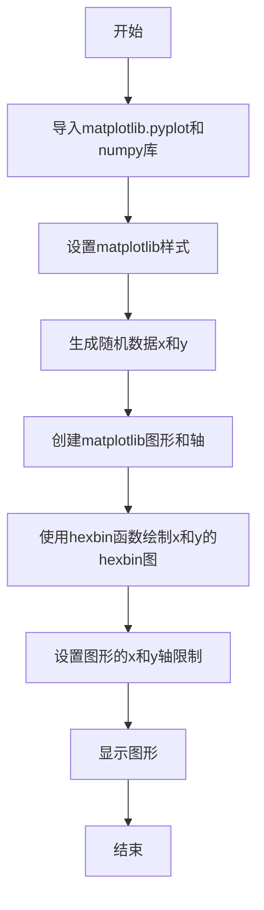
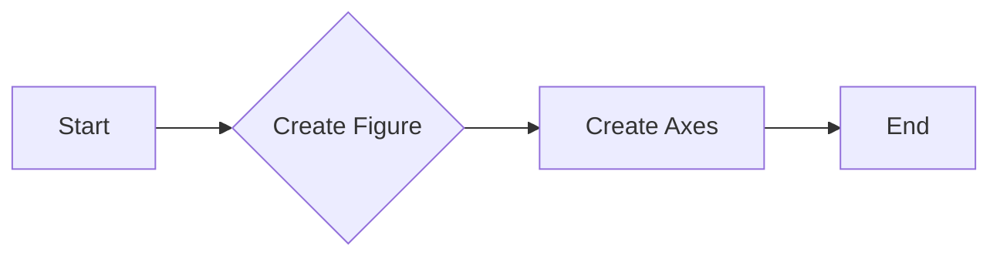
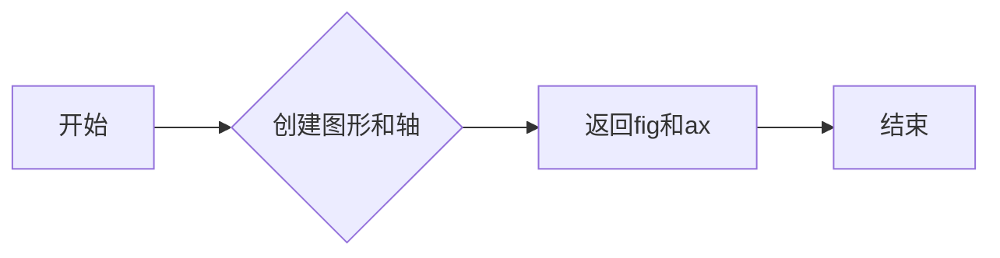
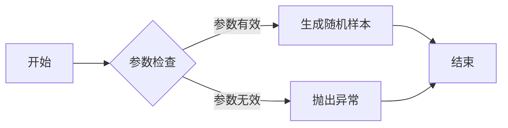
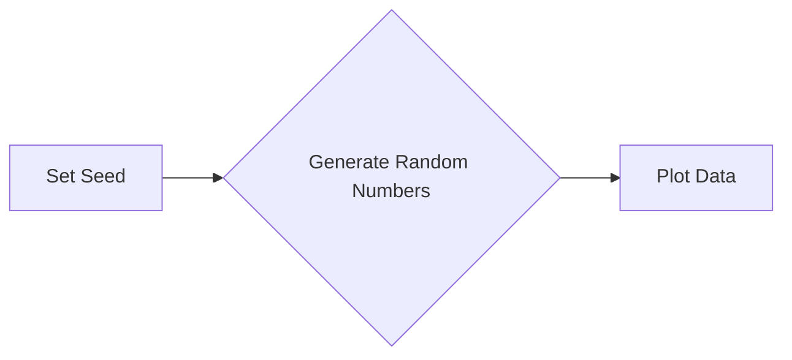
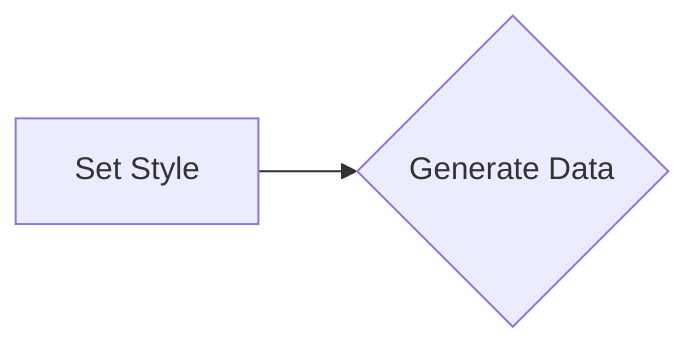
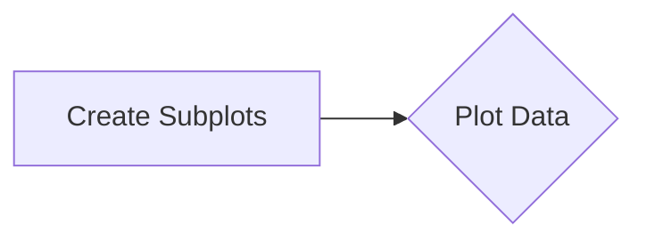
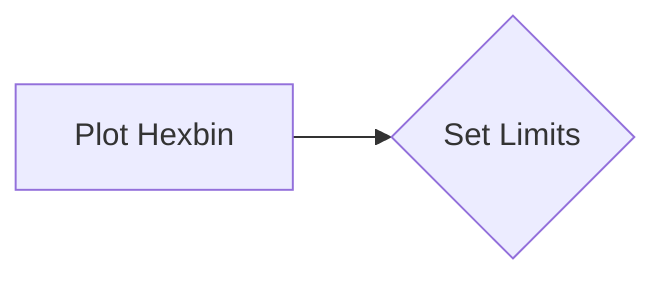
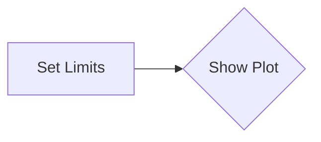
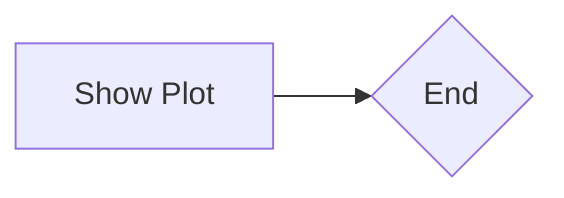

# `matplotlib\galleries\plot_types\stats\hexbin.py` 详细设计文档

This code generates a 2D hexagonal binning plot of points from given x and y data.

## 整体流程



## 类结构

```
matplotlib.pyplot (全局库)
├── numpy (全局库)
└── hexbin.py (主文件)
```

## 全局变量及字段


### `plt`
    
matplotlib.pyplot module for plotting

类型：`module`
    


### `np`
    
numpy module for numerical operations

类型：`module`
    


### `x`
    
1D array of random numbers for the x-axis

类型：`numpy.ndarray`
    


### `y`
    
1D array of random numbers for the y-axis

类型：`numpy.ndarray`
    


### `fig`
    
Figure object for the plot

类型：`matplotlib.figure.Figure`
    


### `ax`
    
Axes object for the hexbin plot

类型：`matplotlib.axes._subplots.AxesSubplot`
    


### `matplotlib.pyplot.style`
    
Style of the plot

类型：`str`
    


### `matplotlib.pyplot.subplots`
    
Function to create a figure and a set of subplots

类型：`function`
    


### `matplotlib.pyplot.show`
    
Function to display the figure

类型：`function`
    


### `numpy.random`
    
Module for generating random numbers

类型：`module`
    


### `numpy.set_seed`
    
Function to set the seed for random number generation

类型：`function`
    


### `numpy.random.randn`
    
Function to generate random numbers from a normal distribution

类型：`function`
    


### `matplotlib.axes._subplots.AxesSubplot.hexbin`
    
Function to create a hexagonal binning plot

类型：`function`
    


### `matplotlib.axes._subplots.AxesSubplot.set_xlim`
    
Function to set the x-axis limits

类型：`function`
    


### `matplotlib.axes._subplots.AxesSubplot.set_ylim`
    
Function to set the y-axis limits

类型：`function`
    
    

## 全局函数及方法


### hexbin(x, y, C)

该函数创建一个2D六边形分箱图，用于可视化点集x和y。

参数：

- `x`：`numpy.ndarray`，x坐标点的数组。
- `y`：`numpy.ndarray`，y坐标点的数组。
- `C`：`int`，可选参数，指定网格的大小。

返回值：`None`，该函数不返回值，它直接在matplotlib图形窗口中显示六边形分箱图。

#### 流程图


#### 带注释源码

```python
"""
===============
hexbin(x, y, C)
===============
Make a 2D hexagonal binning plot of points x, y.

See `~matplotlib.axes.Axes.hexbin`.
"""
import matplotlib.pyplot as plt
import numpy as np

plt.style.use('_mpl-gallery-nogrid')

# make data: correlated + noise
np.random.seed(1)
x = np.random.randn(5000)
y = 1.2 * x + np.random.randn(5000) / 3

# plot:
fig, ax = plt.subplots()

ax.hexbin(x, y, gridsize=20)

ax.set(xlim=(-2, 2), ylim=(-3, 3))

plt.show()
```


### plt.style.use

`plt.style.use` is a function used to apply a style to the matplotlib plots.

参数：

- `style`: `str`，指定要应用的样式名称。该参数描述了要应用的样式文件。

返回值：`None`，该函数没有返回值，它只是设置了一个样式。

#### 流程图

```mermaid
graph LR
A[Start] --> B{plt.style.use(style)}
B --> C[End]
```

#### 带注释源码

```python
plt.style.use('_mpl-gallery-nogrid')
# Apply the '_mpl-gallery-nogrid' style to the plots.
```


### plt.subplots()

该函数用于创建一个matplotlib图形和轴对象。

参数：

- `figsize`：`tuple`，指定图形的大小，默认为(6, 4)。
- `dpi`：`int`，指定图形的分辨率，默认为100。
- `facecolor`：`color`，指定图形的背景颜色，默认为白色。
- `edgecolor`：`color`，指定图形的边缘颜色，默认为白色。
- `frameon`：`bool`，指定是否显示图形的边框，默认为True。
- `num`：`int`，指定要创建的轴的数量，默认为1。
- `gridspec_kw`：`dict`，指定GridSpec的参数，用于创建多个轴。
- `constrained_layout`：`bool`，指定是否启用约束布局，默认为False。

返回值：`Figure`，包含轴对象的图形。

#### 流程图



#### 带注释源码

```python
import matplotlib.pyplot as plt

fig, ax = plt.subplots()
# fig: 图形对象
# ax: 轴对象
```


### plt.show()

显示当前图形的窗口。

参数：

- 无

返回值：无

#### 流程图

```mermaid
graph LR
A[开始] --> B{调用plt.show()}
B --> C[结束]
```

#### 带注释源码

```
plt.show()
```


### plt.subplots()

创建一个图形和一个轴。

参数：

- 无

返回值：`fig`：`matplotlib.figure.Figure`，当前图形对象
- `ax`：`matplotlib.axes.Axes`，当前轴对象

#### 流程图



#### 带注释源码

```
fig, ax = plt.subplots()
```


### ax.hexbin(x, y, gridsize=20)

在当前轴上创建一个2D六边形网格图。

参数：

- `x`：`numpy.ndarray`，x坐标数据
- `y`：`numpy.ndarray`，y坐标数据
- `gridsize`：`int`，网格大小，默认为20

返回值：无

#### 流程图

```mermaid
graph LR
A[开始] --> B{调用ax.hexbin(x, y, gridsize=20)}
B --> C[结束]
```

#### 带注释源码

```
ax.hexbin(x, y, gridsize=20)
```


### ax.set(xlim=(-2, 2), ylim=(-3, 3))

设置当前轴的x和y轴限制。

参数：

- `xlim`：`tuple`，x轴限制，默认为(-5, 5)
- `ylim`：`tuple`，y轴限制，默认为(-5, 5)

返回值：无

#### 流程图

```mermaid
graph LR
A[开始] --> B{调用ax.set(xlim=(-2, 2), ylim=(-3, 3))}
B --> C[结束]
```

#### 带注释源码

```
ax.set(xlim=(-2, 2), ylim=(-3, 3))
```


### 关键组件信息

- `matplotlib.pyplot`：用于创建图形和可视化数据的库
- `numpy`：用于科学计算和数据分析的库
- `plt.style.use('_mpl-gallery-nogrid')`：设置图形样式
- `np.random.seed(1)`：设置随机种子
- `x`：`numpy.ndarray`，存储x坐标数据
- `y`：`numpy.ndarray`，存储y坐标数据
- `fig`：`matplotlib.figure.Figure`，当前图形对象
- `ax`：`matplotlib.axes.Axes`，当前轴对象


### 潜在的技术债务或优化空间

- 代码中使用了硬编码的参数值，例如`gridsize=20`和`xlim=(-2, 2)`，这些值可能需要根据具体情况进行调整。
- 代码中没有进行错误处理，例如检查输入数据的类型和范围。
- 代码中没有使用注释来解释代码的功能和目的。


### 设计目标与约束

- 设计目标是创建一个2D六边形网格图来可视化数据点。
- 约束是使用matplotlib和numpy库。


### 错误处理与异常设计

- 代码中没有进行错误处理，建议添加异常处理来确保代码的健壮性。


### 数据流与状态机

- 数据流：数据从numpy数组传递到matplotlib图形。
- 状态机：代码从开始到结束，没有明确的状态转换。


### 外部依赖与接口契约

- 代码依赖于matplotlib和numpy库。
- 接口契约：matplotlib和numpy库提供了创建图形和进行数据处理的接口。


### numpy.random.randn

生成符合标准正态分布的随机样本。

参数：

- `size`：`int` 或 `tuple`，指定输出的形状。如果没有指定，则返回一个形状为 (1,) 的数组。
- ...

返回值：`ndarray`，包含符合标准正态分布的随机样本。

#### 流程图



#### 带注释源码

```python
import numpy as np

def random_normal(size=None):
    """
    Generate random samples from a normal distribution.
    
    Parameters:
    - size: int or tuple, the shape of the output array. If None, returns an array with shape (1,)
    
    Returns:
    - ndarray: an array of random samples from a normal distribution.
    """
    return np.random.randn(size)
```


### numpy.set_seed

`numpy.set_seed` 是一个全局函数，用于设置 NumPy 随机数生成器的种子。

参数：

- `seed`：`int`，用于设置随机数生成器的种子。如果提供相同的种子，随机数生成器将产生相同的随机数序列。

返回值：无

#### 流程图



#### 带注释源码

```python
import numpy as np

# 设置随机数生成器的种子
np.random.seed(1)

# 生成随机数据
x = np.random.randn(5000)
y = 1.2 * x + np.random.randn(5000) / 3
```


### matplotlib.pyplot.style.use

`matplotlib.pyplot.style.use` 是一个全局函数，用于设置 Matplotlib 的样式。

参数：

- `style`：`str`，指定要使用的样式名称。

返回值：无

#### 流程图



#### 带注释源码

```python
import matplotlib.pyplot as plt

# 设置样式
plt.style.use('_mpl-gallery-nogrid')
```


### matplotlib.pyplot.subplots

`matplotlib.pyplot.subplots` 是一个全局函数，用于创建一个图形和一个轴。

参数：

- `figsize`：`tuple`，指定图形的大小（宽度和高度）。
- `ncols`：`int`，指定图形中轴的数量（默认为1）。

返回值：`Figure` 对象和 `Axes` 对象。

#### 流程图



#### 带注释源码

```python
import matplotlib.pyplot as plt

# 创建图形和轴
fig, ax = plt.subplots(figsize=(8, 6))
```


### matplotlib.axes.Axes.hexbin

`matplotlib.axes.Axes.hexbin` 是一个类方法，用于在轴上创建一个 2D 六边形 binning 图。

参数：

- `x`：`array_like`，x 坐标数据。
- `y`：`array_like`，y 坐标数据。
- `gridsize`：`int` 或 `tuple`，指定网格的大小。

返回值：无

#### 流程图



#### 带注释源码

```python
import matplotlib.pyplot as plt

# 在轴上创建一个 2D 六边形 binning 图
ax.hexbin(x, y, gridsize=20)
```


### matplotlib.axes.Axes.set

`matplotlib.axes.Axes.set` 是一个类方法，用于设置轴的属性。

参数：

- `xlim`：`tuple`，指定 x 轴的显示范围。
- `ylim`：`tuple`，指定 y 轴的显示范围。

返回值：无

#### 流程图



#### 带注释源码

```python
import matplotlib.pyplot as plt

# 设置轴的显示范围
ax.set(xlim=(-2, 2), ylim=(-3, 3))
```


### matplotlib.pyplot.show

`matplotlib.pyplot.show` 是一个全局函数，用于显示图形。

参数：无

返回值：无

#### 流程图



#### 带注释源码

```python
import matplotlib.pyplot as plt

# 显示图形
plt.show()
```

## 关键组件


### 张量索引

张量索引用于在多维数组中定位和访问元素。

### 惰性加载

惰性加载是一种延迟计算或初始化数据的技术，直到实际需要时才进行。

### 反量化支持

反量化支持允许在量化过程中对数据进行逆量化，以便在量化后能够恢复原始数据。

### 量化策略

量化策略定义了如何将浮点数数据转换为固定点数表示，通常用于优化计算效率和存储空间。


## 问题及建议


### 已知问题

-   {问题1}：代码中使用了硬编码的随机种子（`np.random.seed(1)`），这可能导致每次运行代码时生成的数据集相同。如果需要可重复性，这可能是合理的，但如果需要每次运行都生成不同的数据集，则应移除或修改这部分代码。
-   {问题2}：代码没有提供任何参数来调整散点图的样式，如颜色、透明度或散点的大小。这限制了用户自定义图表的能力。
-   {问题3}：代码没有提供任何错误处理机制，如果`matplotlib`或`numpy`模块不可用，代码将无法执行。

### 优化建议

-   {建议1}：移除或修改硬编码的随机种子，以允许每次运行时生成不同的数据集。
-   {建议2}：添加参数来允许用户自定义散点图的样式，例如颜色、透明度和散点大小。
-   {建议3}：添加异常处理来确保在`matplotlib`或`numpy`模块不可用时，代码能够优雅地处理错误并给出有用的错误信息。
-   {建议4}：考虑将代码封装在一个函数中，以便它可以被重用，并接受参数来调整散点图的样式和数据。
-   {建议5}：如果代码是库的一部分，应该提供文档说明如何使用该函数，包括所有参数的详细说明。


## 其它


### 设计目标与约束

- 设计目标：实现一个简单的二维六边形分箱绘图功能，用于可视化点集的分布。
- 约束条件：使用matplotlib库进行绘图，不使用额外的包。

### 错误处理与异常设计

- 错误处理：代码中未包含显式的错误处理机制。
- 异常设计：如果matplotlib库不可用，代码将抛出异常。

### 数据流与状态机

- 数据流：数据从随机数生成到绘图，经过一系列处理。
- 状态机：代码没有使用状态机，它是一个简单的流程。

### 外部依赖与接口契约

- 外部依赖：matplotlib库和numpy库。
- 接口契约：matplotlib的hexbin函数用于绘图。


    