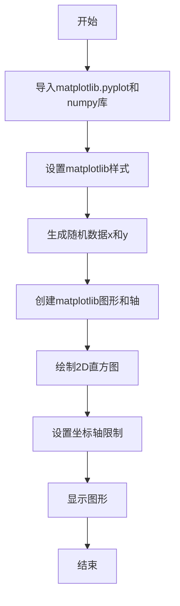
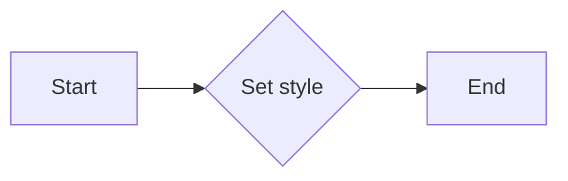
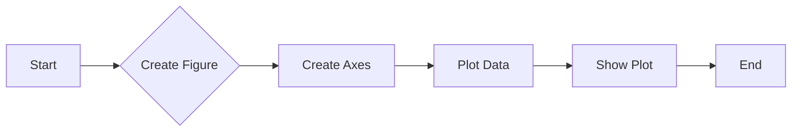
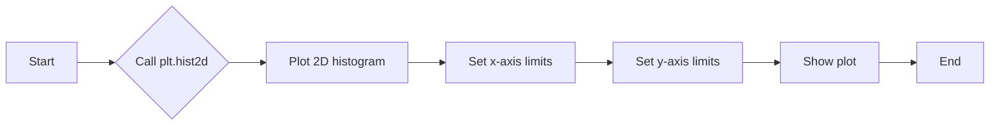
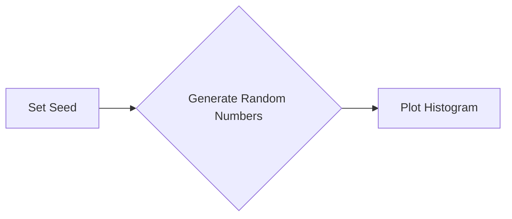
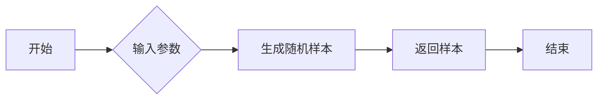
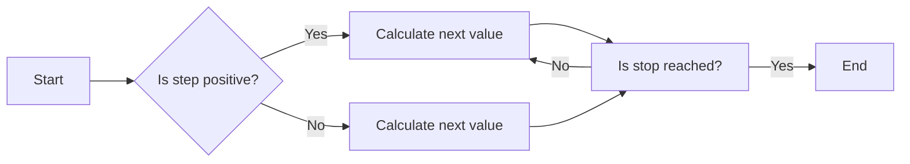

# `matplotlib\galleries\plot_types\stats\hist2d.py` 详细设计文档

This code generates a 2D histogram plot of two correlated datasets with added noise.

## 整体流程



## 类结构

```
matplotlib.pyplot
├── plt.style.use('_mpl-gallery-nogrid')
│   ├── 设置matplotlib样式
│   └── 无子类
└── np
    ├── random.seed(1)
    ├── np.random.randn(5000)
    ├── np.arange(-3, 3, 0.1)
    └── np.random.randn(5000) / 3
```

## 全局变量及字段


### `plt`
    
matplotlib.pyplot module for plotting

类型：`matplotlib.pyplot`
    


### `np`
    
numpy module for numerical operations

类型：`numpy`
    


### `x`
    
Randomly generated array of numbers representing the x-axis data for the histogram

类型：`numpy.ndarray`
    


### `y`
    
Randomly generated array of numbers representing the y-axis data for the histogram

类型：`numpy.ndarray`
    


### `fig`
    
Figure object created by matplotlib for plotting

类型：`matplotlib.figure.Figure`
    


### `ax`
    
Axes object created within the figure for plotting the histogram

类型：`matplotlib.axes._subplots.AxesSubplot`
    


### `matplotlib.pyplot.style`
    
Style object used to configure the appearance of plots

类型：`matplotlib.style.core.Style`
    


### `numpy.random`
    
Random number generator for numpy

类型：`numpy.random.Generator`
    


### `numpy.arange`
    
Function to create an array of evenly spaced values

类型：`numpy.ndarray`
    


### `numpy.random.Generator.seed`
    
Function to set the seed for the random number generator

类型：`None`
    


### `numpy.random.Generator.random.randn`
    
Function to generate random numbers from a normal distribution

类型：`numpy.ndarray`
    


### `matplotlib.pyplot.subplots`
    
Function to create a figure and a set of subplots

类型：`matplotlib.figure.Figure`
    


### `matplotlib.pyplot.hist2d`
    
Function to create a 2D histogram plot

类型：`None`
    


### `matplotlib.pyplot.set`
    
Function to set properties of the axes

类型：`None`
    


### `matplotlib.pyplot.show`
    
Function to display the figure

类型：`None`
    
    

## 全局函数及方法


### hist2d()

Make a 2D histogram plot.

参数：

- `x`：`numpy.ndarray`，输入数据的一维数组，代表x轴的数据。
- `y`：`numpy.ndarray`，输入数据的一维数组，代表y轴的数据。

返回值：`None`，该函数不返回任何值，它直接在屏幕上显示2D直方图。

#### 流程图


#### 带注释源码

```
"""
============
hist2d(x, y)
============
Make a 2D histogram plot.

See `~matplotlib.axes.Axes.hist2d`.
"""
import matplotlib.pyplot as plt
import numpy as np

plt.style.use('_mpl-gallery-nogrid')

# make data: correlated + noise
np.random.seed(1)
x = np.random.randn(5000)
y = 1.2 * x + np.random.randn(5000) / 3

# plot:
fig, ax = plt.subplots()

ax.hist2d(x, y, bins=(np.arange(-3, 3, 0.1), np.arange(-3, 3, 0.1)))

ax.set(xlim=(-2, 2), ylim=(-3, 3))

plt.show()
```


### plt.style.use

`plt.style.use` is a function used to set the style of the plot.

参数：

- `style`：`str`，The name of the style to use. It should be a string that matches one of the predefined styles in the matplotlib library.

返回值：`None`，This function does not return any value.

#### 流程图



#### 带注释源码

```python
plt.style.use('_mpl-gallery-nogrid')
# Set the style of the plot to '_mpl-gallery-nogrid'
```


### plt.subplots()

该函数用于创建一个matplotlib图形和轴对象。

参数：

- `figsize`：`tuple`，指定图形的大小，默认为(6, 4)。
- `dpi`：`int`，指定图形的分辨率，默认为100。
- `facecolor`：`color`，指定图形的背景颜色，默认为白色。
- `edgecolor`：`color`，指定图形的边缘颜色，默认为白色。
- `frameon`：`bool`，指定是否显示图形的边框，默认为True。
- `num`：`int`，指定要创建的轴的数量，默认为1。
- `gridspec_kw`：`dict`，指定GridSpec的参数，用于布局轴。
- `constrained_layout`：`bool`，指定是否启用约束布局，默认为False。

返回值：`Figure`，包含轴对象的图形。

#### 流程图



#### 带注释源码

```python
import matplotlib.pyplot as plt

# 创建图形和轴对象
fig, ax = plt.subplots()

# 绘制数据
ax.hist2d(x, y, bins=(np.arange(-3, 3, 0.1), np.arange(-3, 3, 0.1)))

# 设置轴的范围
ax.set(xlim=(-2, 2), ylim=(-3, 3))

# 显示图形
plt.show()
```


### matplotlib.pyplot.hist2d

该函数用于创建一个二维直方图。

参数：

- `x`：`numpy.ndarray`，x轴的数据点。
- `y`：`numpy.ndarray`，y轴的数据点。
- `bins`：`tuple`，指定x轴和y轴的bins数量，默认为None，将自动计算。

返回值：`None`，该函数直接在当前的Axes对象上绘制直方图。

#### 流程图

```mermaid
graph LR
A[Start] --> B{Call plt.subplots()}
B --> C{Call ax.hist2d(x, y, bins=bins)}
C --> D{Set ax.set(xlim=(-2, 2), ylim=(-3, 3))}
D --> E{Call plt.show()}
E --> F[End]
```

#### 带注释源码

```
import matplotlib.pyplot as plt
import numpy as np

plt.style.use('_mpl-gallery-nogrid')

# make data: correlated + noise
np.random.seed(1)
x = np.random.randn(5000)
y = 1.2 * x + np.random.randn(5000) / 3

# plot:
fig, ax = plt.subplots()

# Create a 2D histogram plot
ax.hist2d(x, y, bins=(np.arange(-3, 3, 0.1), np.arange(-3, 3, 0.1)))

# Set the limits of the x and y axes
ax.set(xlim=(-2, 2), ylim=(-3, 3))

# Display the plot
plt.show()
```

### 关键组件信息

- `matplotlib.pyplot`：用于创建和显示图形。
- `numpy`：用于数值计算和数据处理。

### 潜在的技术债务或优化空间

- 代码中使用了固定的bins值，可能需要根据数据集的特性进行调整。
- 代码中没有进行错误处理，例如检查输入数据的类型和范围。

### 设计目标与约束

- 设计目标是创建一个二维直方图，用于可视化数据分布。
- 约束是使用matplotlib和numpy库。

### 错误处理与异常设计

- 代码中没有显式错误处理，但可以通过检查输入数据的类型和范围来增加错误处理。

### 数据流与状态机

- 数据流从numpy生成数据，然后通过matplotlib进行可视化。

### 外部依赖与接口契约

- 依赖于matplotlib和numpy库。
- 接口契约是matplotlib.pyplot.hist2d函数的参数和返回值。


### plt.hist2d

该函数用于创建一个二维直方图。

参数：

- `x`：`numpy.ndarray`，x轴的数据点。
- `y`：`numpy.ndarray`，y轴的数据点。
- `bins`：`tuple`，指定x轴和y轴的bins数量，默认为None，将自动计算bins的数量。

返回值：`Axes`，包含直方图信息的轴对象。

#### 流程图



#### 带注释源码

```python
import matplotlib.pyplot as plt
import numpy as np

plt.style.use('_mpl-gallery-nogrid')

# make data: correlated + noise
np.random.seed(1)
x = np.random.randn(5000)
y = 1.2 * x + np.random.randn(5000) / 3

# plot:
fig, ax = plt.subplots()

# Create a 2D histogram plot
ax.hist2d(x, y, bins=(np.arange(-3, 3, 0.1), np.arange(-3, 3, 0.1)))

# Set x-axis limits
ax.set(xlim=(-2, 2))

# Set y-axis limits
ax.set(ylim=(-3, 3))

# Show the plot
plt.show()
```


### plt.show()

显示当前图形的窗口。

参数：

- 无

返回值：无

#### 流程图


#### 带注释源码

```python
"""
显示当前图形的窗口。
"""
import matplotlib.pyplot as plt
import numpy as np

# 设置绘图风格
plt.style.use('_mpl-gallery-nogrid')

# 生成随机数据
np.random.seed(1)
x = np.random.randn(5000)
y = 1.2 * x + np.random.randn(5000) / 3

# 创建图形和轴对象
fig, ax = plt.subplots()

# 绘制2D直方图
ax.hist2d(x, y, bins=(np.arange(-3, 3, 0.1), np.arange(-3, 3, 0.1)))

# 设置坐标轴限制
ax.set(xlim=(-2, 2), ylim=(-3, 3))

# 显示图形
plt.show()
```


### numpy.seed

设置NumPy随机数生成器的种子。

参数：

- `seed`：`int`，用于初始化随机数生成器的种子值。如果提供相同的种子，随机数生成器将产生相同的随机数序列。

返回值：无

#### 流程图



#### 带注释源码

```python
np.random.seed(1)
```

该行代码设置了NumPy随机数生成器的种子为1。这意味着每次运行代码时，生成的随机数序列将是相同的，这对于调试和重现结果非常有用。在后续的代码中，`np.random.randn(5000)`将使用这个种子来生成随机数。


### numpy.random.randn

生成具有指定分布的随机样本。

参数：

- `size`：`int` 或 `tuple`，指定输出数组的形状。如果没有指定，则返回一个具有单个元素的数组。
- ...

返回值：`ndarray`，具有指定分布的随机样本数组。

#### 流程图



#### 带注释源码

```python
import numpy as np

def random_normal(size=None):
    """
    Generate random samples from a normal distribution.
    
    Parameters:
    - size: int or tuple, the shape of the output array. If None, returns an array with a single element.
    
    Returns:
    - ndarray: an array of random samples from a normal distribution.
    """
    return np.random.randn(size)
```


### numpy.arange

`numpy.arange` 是一个用于生成沿一个轴均匀间隔的数的数组的函数。

参数：

- `start`：`int`，数组的起始值。
- `stop`：`int`，数组的结束值，但不包括这个值。
- `step`：`int`，步长，默认为 1。

返回值：`numpy.ndarray`，一个沿一个轴均匀间隔的数的数组。

#### 流程图



#### 带注释源码

```
def arange(start, stop=None, step=1):
    """
    Return evenly spaced values within a given interval.

    Parameters
    ----------
    start : int
        Start of interval. The interval includes the start value.
    stop : int, optional
        End of interval, excluded from the returned sequence. If `stop` is not
        specified, the sequence goes from `start` to `stop` (up to, but not
        including, `stop`).
    step : int, optional
        Spacing between values. Default is 1.

    Returns
    -------
    out : ndarray
        Array of evenly spaced values.

    Examples
    --------
    >>> np.arange(0, 10, 2)
    array([0, 2, 4, 6, 8])

    >>> np.arange(0, 10, 0.5)
    array([ 0. ,  0.5,  1. ,  1.5,  2. ,  2.5,  3. ,  3.5,  4. ,  4.5,
            5. ,  5.5,  6. ,  6.5,  7. ,  7.5,  8. ,  8.5,  9. ])
    """
    if stop is None:
        start, stop = 0, start
    if step == 0:
        raise ValueError("step argument must not be zero")
    if step < 0:
        start, stop, step = stop, start, -step
    out = empty((stop - start) // step + 1, dtype=object)
    for i in range(len(out)):
        out[i] = start + i * step
    return out
```


## 关键组件


### 张量索引

张量索引用于在多维数组中定位和访问元素。

### 惰性加载

惰性加载是一种延迟计算的技术，它仅在需要时才计算数据，从而提高性能和效率。

### 反量化支持

反量化支持允许在量化过程中对数据进行逆量化，以便在量化后能够恢复原始数据。

### 量化策略

量化策略定义了如何将浮点数数据转换为固定点数表示，以减少计算资源的使用。


## 问题及建议


### 已知问题

-   {问题1}：代码中使用了硬编码的参数值，例如`bins=(np.arange(-3, 3, 0.1), np.arange(-3, 3, 0.1))`，这限制了图表的可定制性。如果需要不同的范围或更细或更粗的分割，代码需要手动修改。
-   {问题2}：代码没有提供任何错误处理机制，如果`matplotlib`或`numpy`模块不可用，或者在使用过程中出现其他异常，程序可能会崩溃。
-   {问题3}：代码没有提供任何用户输入或配置选项，这意味着用户无法自定义图表的样式、颜色或其他属性。

### 优化建议

-   {建议1}：增加参数以允许用户自定义图表的范围、分割数和样式，提高代码的灵活性和可重用性。
-   {建议2}：添加异常处理来确保代码的健壮性，例如检查`matplotlib`和`numpy`模块是否可用，并在出现错误时提供有用的反馈。
-   {建议3}：提供配置文件或命令行参数，允许用户在运行时自定义图表的各个方面，例如颜色、标签和标题。
-   {建议4}：考虑使用面向对象的方法来封装图表生成逻辑，以便更好地管理状态和提供更多的定制选项。
-   {建议5}：如果代码被集成到更大的系统中，考虑将图表生成逻辑封装在一个独立的模块中，以便于测试和维护。


## 其它


### 设计目标与约束

- 设计目标：实现一个简单的二维直方图绘制功能，用于可视化两个变量之间的关系。
- 约束条件：使用matplotlib库进行绘图，不使用额外的包。

### 错误处理与异常设计

- 错误处理：代码中未包含显式的错误处理机制。
- 异常设计：如果matplotlib库不可用，代码将抛出异常。

### 数据流与状态机

- 数据流：数据从随机数生成到绘图，通过numpy库处理数据，最后通过matplotlib库进行可视化。
- 状态机：代码没有明确的状态转换，它是一个线性流程。

### 外部依赖与接口契约

- 外部依赖：matplotlib和numpy库。
- 接口契约：matplotlib的Axes.hist2d方法用于绘制直方图。


    